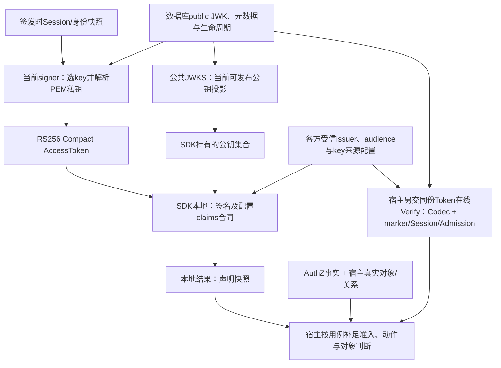

# JWT/JOSE与密钥轮换：格式、消费合同与信任时效

> 状态：已实现 · 2026-10-07按main `3a12cd4b`核对标准签发、在线验证、公共JWKS和SDK锁定依赖；通用协议、当前合同、源码推演与未实施候选分别说明，目标环境验收未知。

IAM的AccessToken携带一份签发时声明，JWS保护其完整性，JWKS交付验签材料；消费方还要限定来源、用途和声明，并按用例判断在线资格、权限与对象。密钥轮换改变签发/发布状态，不同步改变所有消费者已经持有的公钥、Session或授权事实。

本篇负责这些概念如何组成信任合同，以及不同时间窗口为何不能合并。签发/Refresh/撤销回链[Token](../02-业务模块/02-AuthN/05-关键链路-Token签发刷新吊销.md)，数据库/PEM转换与发布流程归[JWKS主文](../02-业务模块/02-AuthN/06-关键链路-JWKS与本地验签.md)，算法、包格式及异常材料归[密码学](../03-基础设施/04-密码学密钥与令牌.md)，宿主配置/资源责任归[SDK接入](../04-接口与SDK/02-Go-SDK与业务系统接入.md)。

## 1. 名称回答不同问题，IAM Profile再缩小接受集合

| 概念 | 它表达什么 | 本项目的选择与边界 |
| --- | --- | --- |
| JWT | JSON声明集合的紧凑表示，可置于JWS或JWE | AccessToken是已签名JWT；“JWT”本身不保证可信、权限或加密 |
| JWS | 对任意payload做数字签名或MAC，支持不同序列化 | IAM签发RS256 Compact；不是“所有JWS都是JWT”，也不隐藏payload |
| JWE | 对内容提供加密及完整性保护的容器 | IAM未采用；引入它还须决定接收方解密key、用途和嵌套验证 |
| JWK | 一把key的JSON表示，可含公钥、私钥或对称秘密 | IAM公共投影只输出RSA/RS256公钥字段；投影通过不独立证明材料能验签 |
| JWKS/JWK Set | JSON中的key集合 | 交付可选材料；没有自带issuer信任、状态/撤销或业务授权 |
| IAM Access Profile | 项目限定的格式、算法、来源、声明与消费规则 | 比协议格式窄；标准签发、在线验证、SDK当前接受集合并不完全相同 |

定义分别见[RFC 7519](https://www.rfc-editor.org/rfc/rfc7519.html#section-3)、[JWS](https://www.rfc-editor.org/rfc/rfc7515.html#section-3)、[JWE](https://www.rfc-editor.org/rfc/rfc7516.html#section-3)与[JWK/JWKS](https://www.rfc-editor.org/rfc/rfc7517.html#section-5)。JWT的注册claims不是通用必填表，应用须规定自己的必填/可选项；IAM要求的sid和入口ID也不是所有JWT的标准字段。

Bearer描述持有者呈交凭证的使用方式，不决定其编码。当前AccessToken按Bearer使用；Refresh值是服务端保存/消费的随机UUID凭证，不是另一份可经JWKS验签的访问JWT。Refresh只能用于对应续期/退出合同，不能因同一响应同时返回两者就互换。

## 2. 三段Compact保护原字节，不把声明变成秘密

```text
H = BASE64URL(UTF8(protected header))
P = BASE64URL(UTF8(claims JSON))
S = BASE64URL(RS256签名(ASCII(H + "." + P)))
AccessToken = H + "." + P + "." + S
```

标准[SignedJWTCodec](../../internal/apiserver/infra/token/jwt/signed_jwt_codec.go)写入`alg=RS256`、`typ=JWT`、当前key的kid，以SHA-256/RSA PKCS#1 v1.5签名；算法定义见[RFC 7518 §3.3](https://www.rfc-editor.org/rfc/rfc7518.html#section-3.3)。验原签名时不能先把JSON解码、排序、重编码后再使用新字节；同义JSON不保证具有同一签名输入。

Base64url是编码。能取得Token的人仍可读payload；HTTPS保护传输跳，不让终端、持有者、错误出口或副本看不到声明。Codec原样复制Attributes，没有通用秘密字段过滤，当前写`typ=JWT`也不等于验证时要求typ。若业务提出“让手机号或业务详情不可见”，先限定是否需要在令牌携带；采用JWE还会增加解密key与接收者合同，不能用“JWT已签名”回应保密需求。

以下图表示证明层次，不是SDK逐行调用顺序，也不表示本地验证默认追加在线调用：



## 3. 字段之间有不变量，不是填满一个claims表

| 字段/关系 | IAM当前含义与检查 | 不能承诺什么 |
| --- | --- | --- |
| iss与key来源 | Codec固定issuer；SDK必须配置AllowedIssuer，调用级ExpectedIssuer只加限制 | header/claims中的URL不是自动信任入口；字符串相等不证明部署选对key来源 |
| aud | 非空预期接收者集合；服务端/SDK均以精确交集匹配 | 同一issuer不等于所有服务都可接受；多个aud不是“必须同时满足全部” |
| sub、user_id、login_identity_id、sid | 在线领域claims要求非零身份ID、非空SID且规范化sub等于UserID字符串 | 不是AuthZ的`user:17`语法；SDKRequiredClaims不执行该身份不变量 |
| jti | 标识当次AccessToken，可供在线撤销marker查找 | 有ID不等于自动防重放或已撤销；本地策略不读marker |
| iat/nbf/exp | 标准minter一次取时钟、按秒投影；领域要求三者存在且exp>nbf，Codec另做时间验证 | iat不是再次认证；存在检查不等于合法区间、最长寿命或当前在线有效 |
| auth_time/AMR | 原认证时间和认证手段；Refresh不应把它提升为新认证 | 不自动构成MFA或最近认证许可；操作的step-up另由应用检查 |
| org_id/Attributes | Session业务上下文的声明快照，由上游投影负责 | 不证明实时组织关系、门店归属、动作Scope或全部字段无秘密 |
| token_type与typ | 当前payload只接受access，缺失/空值有兼容；header写JWT但无完整typ验证 | 不能接收service/refresh JWT；“有类型字段”不证明跨用途合同互斥完整 |

[NewAccessTokenClaims与Validate](../../internal/apiserver/domain/authn/token/token.go)职责不同：前者规范化并构造声明对象，后者仅检查声明不变量；二者均不执行验签或在线查询。Codec验签成功也不是独立在线ALLOW：领域Verifier随后检查预期audience、jti撤销marker、active Session、JWT所称User/入口的Admission。Session读取不再将SID的User/入口/Org与claims逐项重对齐，可信签名仍是这些声明的前提，多次读取没有共同瞬间。

具体例：User17经入口103获得SID=S1，签发sub=`17`。把未经核验body的`user:42`直接作为AuthZ Subject，不是对这个JWT的语法转换；把org_id用于认定Store42属该公司，也不是签名所证明的实时领域事实。可信操作者构造、动作与同条Scope配对及对象资格归[服务间授权](../02-业务模块/03-AuthZ/06-关键链路-gRPC服务间授权与SDK.md)与[威胁模型](03-IAM威胁模型与安全边界.md)。

## 4. kid定位受信集合中的key，来源信任不能倒过来

设issuer A/B恰有同名kid=`K1`。kid没有全局唯一或issuer归属保证；消费方必须先有“允许的issuer→可信key来源/材料→验证规则”合同，再在该集合中取K1。不能只见kid匹配就合并两个签发者，也不能按未经验签的iss/jku去任意URL取key。来源绑定和算法/用途限定的原则见[RFC 8725 §3.1、3.8–3.12](https://www.rfc-editor.org/rfc/rfc8725.html#section-3.1)。

当前SDK是一个配置issuer配合宿主给定JWKSManager，不是多issuer自动发现器；同一个临时RSA key用于多issuer测试只证明字符串/额外约束，不能证明材料按签发者隔离。标准Codec按kid从已配置manager取数据库JWK，SDK按配置链取得集合；两者都不因Token的jku/jwk改换来源，但没有完整header白名单/crit/typ合同。

公共端点输出的`kty=RSA/use=sig/alg=RS256/kid/n/e`是IAM的投影合同；profile只检查n/e非空，不解码或验证RSA数学条件。若有权限将持久化n改成非法Base64url、其余字段仍一致，发布可成功，在线key源随后解码却失败。标准公开创建走真实RSA生成器；这是存储异常的源码条件，不是公开caller能提交任意n的漏洞，也无该专项实验。

JWKS本身可以表达其他key，SDK通用jwk.Parse不会自动把自定义链或seed收窄为同一Profile。它们的来源、算法绑定、私钥/对称key拒绝、重复kid及RSA材料边界须另定义。可信URL、可信TLS/代理、共享AuthClient与独立gRPC fetcher也不是同一配置；SDK独立endpoint使用insecure credentials，HTTP还有重定向行为，装配责任回链传输与SDK主文。

## 5. 在线与本地接受合同要逐项对照

| 项目 | 标准服务端 | SDK本地当前合同 |
| --- | --- | --- |
| 编码/算法 | Compact；显式核header.alg、返回key的kid/算法和RS256 | 限定RS256配置/单个受保护header；锁定JWX还可解析JSON序列化 |
| 已选key绑定 | 标准adapter校验生命周期/JWK profile，Codec再对齐算法 | KeySet直交JWX v2.1.6，实际verifier按所选JWK.alg构造，未再次显式对齐header |
| 声明 | IAM身份与时间不变量、固定issuer；Verifier另匹配受众 | issuer/audience/用途与配置必需项；默认不要求exp，RequiredClaims只看存在 |
| 时间特殊值 | 正常Codec截止校验及领域区间约束 | 锁定依赖对exp/iat/nbf的Unix值0跳过对应时间验证；ClockSkew零值为0 |
| 当前资格 | marker、active Session及User/入口Admission | 本地成功不查在线状态；默认local优先，符合分类的本地失败才可remote |

两组源码条件推演须保留前提：一是受信KeySet某kid标RS384，protected header为RS256、实际按RS384签名，JWX可能按key算法验真却没有重绑定header；普通RS256签名配RS384标签仍会失败。二是可信签名Token具有`exp:0`，存在检查可成立却跳过对应截止检查。这些不是本轮专项复现或生产事故，不能写成“任何错算法都通过”或“普通过期Token都有效”。具体解析与依赖入口由密码学主文维护。

完整消费Profile是候选收敛要求：明确接受格式、header与key算法/用途、身份字段、有限时间区间、来源与用途；然后分别校准服务端、SDK、旧Token和custom KeySet。只开启RequireExpirationTime或增加typ，尚不足以让两端等价。若保留不同合同，宿主必须知道自己得到的是哪一层证明。

例如S1已被撤销而key、签名与JWT时间仍可用：标准在线验证会拒绝，本地签名/claims仍可通过。这个差异不由“升级验签算法”消除；用例应先选择需要当前在线资格还是允许有期限声明快照，再定义额外准入与失败行为，不依赖local成功后的自动在线兜底。

## 6. 至少有五个时钟，TTL不互相替代

| 时钟/状态 | 当前约束对象 | 常见误推 |
| --- | --- | --- |
| JWT exp及消费方skew | 这份声明在该时钟下的时间接受 | exp限制不撤销Session，也不保证key仍被发布 |
| key NotBefore/NotAfter、active/grace/retired | IAM当前选key、在线验签和新构建发布 | 不随JWKS传给本地消费者，退役不让旧缓存失去验签能力 |
| HTTP max-age=3600 | HTTP缓存可复用的响应 | 不是key寿命；SDKHTTPFetcher不消费该策略，也不自动处理304 |
| 服务端一分钟标签快照 | GetCurrentCacheTag可复用本进程标签 | REST仍先Build再比较ETag，不因此省去数据库读取 |
| SDK fresh/max-stale与获取链成功时间 | 公钥集合的缓存获取年龄 | seed成功重设updated，不证明原公钥最新，也不约束验证结果缓存 |

ETag是排序后的当前JSON摘要，Last-Modified取构建时间而非数据库变更时间。REST只比较精确If-None-Match字符串；304早于缓存头写入。SDKHTTPFetcher只接受200，用户自行加条件header还没有304与旧集合合并合同。gRPC GetJWKS空请求每次返回完整集合及ETag/timestamp，不实现HTTP条件请求或304；路由门禁也不验证这些响应行为。协议描述中的头、OAS漏记304、SDK获取成功和目标代理实际持有版本分别核对，不能据同一个200解释时效。

验证结果缓存又是宿主显式选择的另一层：命中不重新运行本地/在线策略，token-only key不重查issuer/audience/exp，但仍按当前AllowedTokenTypes检查用途。顶层TokenVerifier的ForceRemote直接走remote、绕过这层缓存，不刷新JWKS；直接调用CachingVerifyStrategy没有同一ForceRemote分支。公钥刷新不能自动删除已经缓存的验证结果。当前JWKS集合也没有独立版本/撤销epoch，成功取集不能作为全实例退役确认。

## 7. 正常轮换与紧急退役需要不同接受样本

以下均为有配置前提的时序推演。消费者09:59取得只含A的非空集合，本例fresh=5分钟；10:00 IAM激活B、将A转grace，随后成功构建的JWKS输出A+B；激活与发布不是共同提交：

| 时刻/输入 | 当前可发生的结果 | 设计含义 |
| --- | --- | --- |
| 10:00收到有效B Token，SDK仍持A | unknown kid直接拒绝，不ForceRefresh也不remote fallback | 保留A解决旧Token重叠，不解决B预热；源端激活成功不等于消费可用 |
| 到本例fresh截止后再次读取 | 尝试获取；失败/代理旧集合/seed仍可能只得A | 不能承诺五分钟内全部恢复；ForceRefresh也须观察实际集合 |
| B可用后提前force-retire A | 新发布/在线选key排除A；持A缓存仍可验时间/声明合格的A Token | 普通轮换接受旧A，安全退役则要求旧A拒绝，两种目标不能共用200 |
| A私钥泄漏且旧seed仍可续龄 | 攻击者可能签发新的合格声明，本地仍信任A | 仅缩短AccessTTL/CacheTTL不能给这份seed信任设置不可续期截止 |

配置要求`AccessTokenTTL <= grace < rotation_interval`，却从生成RSA前捕获的t0算旧key截止。若t0=10:00:00、提交10:00:02，10:00:01仍用A签发15分钟Token且grace=15分钟，Token至10:15:01，A在线资格却在10:15:00截止。证明重叠应依据最后旧key可被选择的claims时间、最大TTL、允许skew与时钟差留裕量；当前配置不等式不独立证明此条件，自定义窗口和在途另验。

15分钟是边界例，生产模板AccessTTL=60分钟、grace=168小时；模板不代表加载或部署后的有效配置。恢复还要将数据库元数据、PEM与可信来源/缓存策略配对；部署tar只含配置和日志、数据库gzip不含PEM，健康/解压或JWKS200不能替代实际新旧Token接受与材料恢复证明。

`max_publishable_keys`统计active+grace状态行并告警，含可能已过期/清理失败的行，不硬截断可发布集合。唯一active索引只保证数据库最多一把，不能保证PEM可签名、每台实例已切换或已有请求终止。数据库、文件、publisher和消费者没有共同提交，补偿/未知结果与恢复细节回链JWKS主文。

## 8. 候选方案按要改变的合同选择

| 要改变的事实 | 具体候选与owner | 代价与接受样本 |
| --- | --- | --- |
| 两端Profile不同 | AuthN/SDK共同定义拒绝集合、header/key重绑定和身份/时间校验，记录旧兼容窗口 | custom/seed/旧payload兼容成本；正常RS256成功、错alg/issuer/aud/type、缺字段/epoch0/错身份各独立样本 |
| 新B未被消费者认识 | 密钥owner预发布pending B→可信预热证据→切signer；或SDK unknown kid限频刷新一次再验 | 新状态/确认与刷新DoS预算；取集失败仍拒绝，错误签名不升级成ALLOW，已有A仍成功 |
| 退役没有可证明截止 | SDK/部署将seed绑定来源与不可续期截止；必要时独立集合版本/撤销epoch并覆盖结果缓存 | 离线可用性缩短、实例登记/在途规则；旧A拒绝、新B成功、断源截止与恢复分别验证 |
| 并发旧集覆盖新集 | SDK控制Set复制所有权、单飞与可信版本/请求代次，定义恢复回退 | 单飞不证明源更新；验迟到旧响应、宿主修改Set与合法恢复，不以缓存成功计数验单调性 |
| 私钥可导出/跨主机不一致 | 密钥/部署新增Signer端口，限定算法、签名输入、key reference、远程失败及未知结果，再接KMS/HSM | resolver当前返回本地RSA私钥，不能只换名称；验key/pub配对、在途/恢复与依赖故障 |

采用更短Token加在线验证能缩小某些窗口，但增加依赖/延迟，仍须定义在途和业务提交资格；采用JWE保护声明另增加解密责任，不能替代用途、Session或授权。候选的收益、成本与验收对象不同，当前没有上述增强接线。

## 9. 本篇证据与维护边界

本轮只重写专题、专题导航和阶段台账，不改算法、机器契约或业务实现。既有选测原日志须绑定原执行日期、源码与工具，复用不算新跑；临时RSA/SQLite/HTTP或替身只证明各自断言。unknown kid轮换、异常KeySet/epoch0、seed年龄/刷新乱序与共享卷等时序按源码条件登记，不冒充现场验收。

本轮新执行Go行为测试0。精确复用2026-10-07第40、43、44、46篇的66个run/pass事件（43顶层、23子项），跨来源重复引用已去重；其中同一逻辑用例在两个原执行各有回执，故不同package/test为65项。11份原package pass来自10个不同包，另计，不算本轮重跑或66个生产场景。

| 复用范围 | 具体证明与限制 |
| --- | --- |
| Compact、claims、key profile与生命周期 | 原字节合同、身份不变量、材料/资格拒绝和临时PEM；发布失败测试的lifecycle替身不证明真实数据库提交 |
| SDK消费、fallback与缓存链 | 配置/声明约束、错误分类、fresh/stale与seed获取；部分配置错误用例有其他失败条件，不能单独归因算法/audience |
| 发布标签、轮换配置与路由 | 本机快照、配置不等式及路径注册；不证明HTTP头、304语义、全实例公钥预热或生产无损轮换 |

48组来源map共5015条去重路径已回验；本篇42项静态选源未增加独立路径，不计行为覆盖。历史源码/日志/HEAD与已知文档摘要例外原样保留，不用当前Go二进制补写旧工具身份。标准资料另核术语和消费原则，不把它计作测试结果。

```bash
make docs-hygiene docs-facts
python3 scripts/test-docs-release-validation.py
git diff --check
```

这些为本批main已有入口；撰写阶段独立工作区另执行的`docs-validation-tests`增强目标未随本批发布。具体选测、来源与图形回执见[阶段复核](../_data/reviews/2026-10-06-docs-refactor.md)。标准来源核对只说明术语/原则，不是IAM已完整符合全部RFC的认证结论；生产key/issuer/代理/seed与业务接受仍需独立证据。
