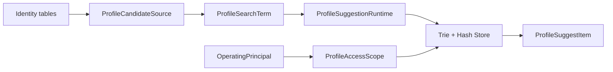

# Suggest 为什么采用派生读模型

> 状态：已实现 · “派生读模型 + 独立查询策略”的设计已与当前代码核对；尚未实现的持久化恢复、敏感索引治理等内容单独列为风险，不作为当前能力。

## 1. 30 秒结论

Suggest 被设计成读模型，是因为 Profile 主数据的正确性和联想搜索的查询形态不同：Identity 负责 User、Profile、ProfileLink 的写入和不变量；Suggest 只派生适合姓名、拼音、ID、手机号匹配的索引，并按当前操作者范围返回脱敏候选。

```text
Identity facts -> ProfileSearchTerm -> process-local search index -> safe candidate
```

这个选择换来了查询性能、写模型隔离和可重建性，也引入了最终一致、内存敏感数据保护和重启重建成本。

- 当前事实见 [Suggest 模块](../02-业务模块/05-Suggest/README.md)，
- 模型见 [模型与应用端口](../02-业务模块/05-Suggest/01-模型与应用端口.md)；
- 刷新链路见 [索引刷新](../02-业务模块/05-Suggest/02-关键链路-索引刷新Full-Delta.md)；
- 查询链路见 [SuggestProfile 查询](../02-业务模块/05-Suggest/03-关键链路-SuggestProfile查询.md)；

## 2. 写模型和读模型的差异

| 维度 | Identity 写模型 | Suggest 读模型 |
| --- | --- | --- |
| 核心目标 | 保证身份事实和关系正确 | 快速召回可见候选 |
| 主要对象 | User、Profile、ProfileLink | ProfileSearchTerm、Query、ProfileAccessScope |
| 数据形态 | 规范化事实、关系和生命周期 | 姓名/拼音键、ID/手机号键、排序字段、最小可见范围字段 |
| 一致性 | 写入正确性优先 | 可以通过 Full/Delta 最终同步 |
| 失败处理 | 不能伪造或丢失主事实 | 可以保留旧索引或保守返回空结果 |
| 权威性 | Profile 事实源 | 不能回写主数据，也不是授权凭证 |

如果直接在 Identity 聚合里加入拼音树、通配符展开、候选排序和限流，搜索技术细节会污染身份写模型；如果让 Suggest 写 Profile，又会倒置主从关系。

## 3. 当前设计形态



设计边界：

- Loader 读取 Identity 表，但 Suggest 不拥有这些表。
- Store 负责召回、scope 过滤、排序和 limit，不修改主数据。
- AuthZ 提供角色和手机号搜索许可；索引本身不是权限事实源。
- ProfileSuggestItem 是候选展示，不代表拥有详情读取、修改或导出权限。

## 4. 为什么不直接查 Identity 主表

直接对 Identity 表做联想搜索会把多种需求耦合到事务模型：

- 姓名、全拼、拼音首字母需要专门索引结构；
- 手机号既是敏感字段又是搜索键；
- 候选召回量通常大于最终返回量；
- 可见范围过滤必须先于最终排序截断；
- 搜索刷新、指标和降级不应阻塞 Identity 写入。

当前实现用 MySQL Loader 批量派生 `ProfileSearchTerm`，查询走进程内 Trie/Hash，避免每次请求执行跨表模糊查询。

## 5. 为什么 scope 不是授权结果

`ProfileAccessScope` 是 Suggest 查询所需的局部投影：全量标记、OrgID、OperatorID、ProfileID 列表和手机号搜索开关。

它不能替代通用 AuthZ：

- scope 只回答哪些候选能进入本次搜索结果；
- 搜索到 Profile 不代表可以读取详情；
- 后续动作仍应使用自己的 Resource、Action、Scope 做授权；
- ProfileLink 是 Identity 关系事实，不应直接当成 AuthZ Policy 或 Suggest scope。

## 6. 为什么过滤早于最终 limit

如果先从全局候选取前 N 条再过滤，无权限候选会挤占可见结果，结果数量也可能泄露候选分布。

当前 Store 的顺序是：

```text
recall up to InternalLimit
  -> scope filter
  -> rank
  -> final Limit
```

这里仍有 `InternalLimit` 召回上限，因此它不是无限候选上的完整排序；但权限过滤发生在最终返回截断之前。

## 7. 可重建不等于持久化恢复

当前 Full refresh 会构建新 Store 并原子切换，Delta 会修正当前 Store 的键。这个结构在逻辑上可从 Identity facts 重建。

当前实现已经移除文件快照。重启后的“可重建”只来自 Loader + Full refresh；如果数据源不可用，模块只能按 `required` 策略启动失败或降级为空结果，不能从本地敏感文件恢复。

## 8. 主要收益与代价

| 收益 | 对应代价 |
| --- | --- |
| 搜索技术细节不污染 Identity | 需要维护数据同步和刷新任务 |
| 进程内查询快 | 多副本各自持有索引，切换时间可能不同 |
| Full 可整体切换 | Full 前要读取和构建全部候选 |
| Delta 降低刷新成本 | 自定义 SQL 必须正确处理 tombstone |
| 可保守降级为空结果 | 空结果无法区分无匹配、无权限和索引不可用 |
| 输出可统一脱敏 | 原始手机号仍存在于 Loader 和内存索引 |

## 9. 当前风险，不要讲过头

```text
当前没有 Suggest gRPC 或 Go SDK；
当前没有文件快照或持久化索引恢复；
当前没有手机号 hash 索引，Hash 使用原始手机号；
当前 visibility resolver 按 profiles.created_by，是过渡数据权限读模型；
当前 Redis 限流异常 fail-open；
当前没有独立持久化审计记录；
当前模块 health 不表达索引新鲜度。
```

这些是后续可演进方向，不应在架构介绍中说成已经完成。

## 10. 事实源与 Verify

| 内容 | 路径 |
| --- | --- |
| Identity 主数据 | `internal/apiserver/domain/identity`、`internal/apiserver/infra/mysql/profile`、`profilelink`、`user` |
| Suggest 模型和用例 | `internal/apiserver/domain/suggest`、`internal/apiserver/application/suggest` |
| Loader 和索引 | `internal/apiserver/infra/mysql/suggest`、`internal/apiserver/infra/suggest/search` |
| Scope adapter | `internal/apiserver/infra/suggest/access` |

```bash
go test ./internal/apiserver/domain/suggest/...
go test ./internal/apiserver/application/suggest/...
go test ./internal/apiserver/infra/suggest/...
go test ./internal/apiserver/infra/mysql/suggest/...
make docs-hygiene
```
