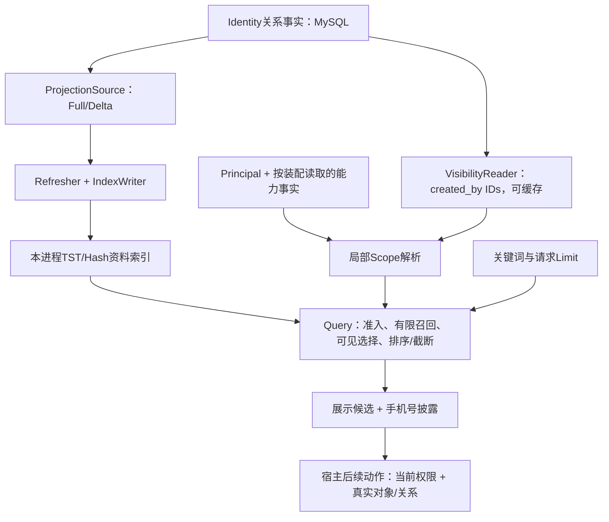

# Suggest读模型：查询形态、来源时效与替换条件

> 状态：已实现 · 2026-10-07按main `3a12cd4b`核对标准MySQL投影、进程内索引、查询策略与组合根；设计解释、源码条件推演和未实施候选分别说明，目标环境接受未知。

Suggest把多表身份关系变成适合姓名、拼音和数字键检索的资料，再对有限候选执行局部可见选择与披露。它把检索表示和刷新责任从Identity写模型中分开；没有把身份事实、查询范围与后续业务许可变成同一个实时证明。

当前是同一服务中的独立模型/用例与内存适配器，不是已接线的事件/CDC投影器、独立搜索服务或持久化查询库。本文根据现有职责与行为解释选择成立的条件，不补写未经记录的历史决策。模型/端口、刷新算法、查询入口及装配细节分别归[模型主文](../02-业务模块/05-Suggest/01-模型与应用端口.md)、[Full/Delta](../02-业务模块/05-Suggest/02-关键链路-索引刷新Full-Delta.md)、[查询](../02-业务模块/05-Suggest/03-关键链路-SuggestProfile查询.md)与[边界索引](../02-业务模块/05-Suggest/04-模块边界与代码索引.md)。

## 1. “读模型”在这里指什么

| 层次 | 当前对象与责任 | 不能用它代替的事实 |
| --- | --- | --- |
| 身份事实 | Identity维护User、Profile、ProfileLink及其写入不变量 | 搜索索引是否追平、哪些候选已被召回 |
| 可检索投影 | SuggestibleProfile保存姓名、手机号集合、权重与局部可见字段 | User当前可登录、ProfileLink当前资格或真实组织归属 |
| 物理索引 | 内存TST存姓名/拼音键，Hash存ID/手机号原字符串键 | 领域Profile、授权政策或持久化事实来源 |
| 查询规则 | Keyword/Admission、Scope、Selection、Disclosure | 完整库上的最佳排序、详情/修改/导出的许可 |
| 展示候选 | ProfileID、DisplayName、MobileMask、Weight | 业务对象已获授权或已被最终选择/接受 |

它不只是给Profile读取结果加TTL：默认Loader跨Profile/Link/User重新判定索引资格并聚合手机号；查询还有意图、匹配强度、候选预算、可见范围与披露规则。反过来，姓名/拼音索引也没有理由回写Profile，查询的候选数量不能纠正Identity关系事实。

读写职责分开不要求立即拆进程。当前复用宿主MySQL，启动与Cron执行Full/Delta，查询可再访问AuthZ和visibility SQL/cache；只有候选检索在本进程内。调用链不支持“整条查询纯内存”，也没有本文可绑定的吞吐/延迟比较结果。

## 2. 投影是一次领域翻译，不是表的镜像

[默认Loader](../../internal/apiserver/infra/mysql/suggest/loader.go)只投影未软删Profile、未软删/撤销Link及未软删User的JOIN结果；至少有这样的Link/User组合才进入Full。它没有检查User.Status，也没有把所有Profile无条件复制到索引。

| 投影字段 | 默认来源与转换 | 设计含义 |
| --- | --- | --- |
| ID/DisplayName | Profile ID/name；投影构造要求正ID、trim后非空名 | 是搜索资料的最小形状，不等于Identity全部不变量 |
| Mobiles | 合格关联User的phone，经GROUP_CONCAT再拆分 | 多个号码不等于稳定主号码；数据库聚合未指定顺序 |
| OrgID | 配置PlaceholderOrgID，默认SQL不读Profile真实Org | 0不虚构组织；非零占位会参与局部OR判断，不能冒充多组织隔离 |
| OwnerOperatorIDs | profiles.created_by转字符串/集合 | 是创建审计来源，不是ProfileLink持有人名单 |
| Weight | 默认常量1 | 自定义投影可另给权重，但当前不是概率、权限等级或相似度 |

例：Profile101名为“张三”，created_by=42，User7及8各有未撤销Link。默认owner为42，手机号取7/8的存储值；撤销7但8仍满足JOIN时，101仍可索引，owner不会因此变成8。created_by由PO创建hook从数据库context取UserID，无值可为0；不能把业务参数或Link另一端当成这个字段。

资料格式与查询语法必须一起设计。Identity正常phone写出E.164，如`+8613800138000`；Hash保留该字符串，带`+`输入却走文本TST，裸数字输入又不等于这个key。长ID `1234567`还先命中手机号形态判断，无mobile能力时在索引召回前返回空。这些是现有条件，不是手机号已完整可搜的证明；修复须决定显式intent、号码归一化和ID/mobile命名空间，而非仅换一个索引实现。

自定义FullSQL/DeltaSQL是来源合同变更：资格、字段、组织/owner语义、唯一ID、排序与删除编码都须配对。标准Delta在适配器边界把空白name解释成Delete，不能据“返回了合法列”证明业务资格正确；具体坏行/空集差异回链刷新主文。

## 3. 为什么保留独立查询模型，什么时候考虑别的方案

当前结构将拼音计算和多键构建移到刷新阶段，将意图、排序、可见选择留在查询用例，Identity写入不用直接持有TST/Hash或候选排序。这是可观察的职责分离；收益是否超过周期投影成本，要根据数据规模、实例数、延迟、新鲜度和隐私要求验证。

| 选择 | 它具体改变什么 | 需要接受或验证的代价 |
| --- | --- | --- |
| 每次直接查业务表 | 请求时做JOIN、资格与检索，减少独立资料副本 | 仍需拼音/号码表示、查询计划、Scope和披露；一次SQL也不自动统一AuthZ或后续业务提交 |
| 当前进程内投影 | 请求不重复构建姓名/拼音键，Full可替换本机Store | 每实例扫描/构建、内存含原号码、周期漏读窗口；性能与源端压力须实测 |
| 同库持久化投影表 | 可随同一业务事务维护搜索字段/代次，重启可读 | 要覆盖Profile、Link、User全部变化/删除入口，增加写耦合、schema和迁移责任；仅在Profile写入处加一行不够 |
| 共享搜索后端/独立服务 | 查询实例共享索引、减少每副本构建，支持不同检索能力 | 远端可读完成、代次/水位、部分或未知写入、租约栅栏、敏感副本与关闭责任都需新合同 |

直接SQL并非原则上不可行，独立索引也非规模增长后的自动答案。当前对外需求若是少量联想候选、允许明确年龄窗口，保留独立模型有清晰责任；若要求立即撤销可见资格、全库最优排名或恢复后持续可查，先补这些合同，再选存储与部署形态。

## 4. 三条读取链组合一次结果，却没有共同版本

图限定标准启用装配的来源/使用关系，节点是职责层次，不表示所有请求都遍历全部分支，也不表示每个节点独立部署：


```mermaid
flowchart TB
    D["Identity关系事实：MySQL"] --> S["ProjectionSource：Full/Delta"]
    S --> R["Refresher + IndexWriter"]
    R --> M["本进程TST/Hash资料索引"]
    D --> V["VisibilityReader：created_by IDs，可缓存"]
    P["Principal + 按装配读取的能力事实"] --> C["局部Scope解析"]
    V --> C
    M --> Q["Query：准入、有限召回、可见选择、排序/截断"]
    C --> Q
    I["关键词与请求Limit"] --> Q
    Q --> O["展示候选 + 手机号披露"]
    O --> B["宿主后续动作：当前权限 + 真实对象/关系"]
```

投影链决定本机有哪些资料；范围链组合能力、Principal的Org、created_by ID缓存与候选owner；查询链才决定本次意图、有限召回、过滤和披露。当前Scope的显式ID/Org/owner为OR，不读取Assignment Scope；默认占位Org相等可直接使候选可见。FactsReader先查list_all，再按分支查全量或局部mobile能力，没有一起返回的策略版本。

例如Profile101已软删，但本机还持有owner=42的旧资料。即便42的visibility SQL这次没有返回101，owner OR仍可能选中旧项；只缩短visibility TTL不能消除这个路径。这个源码交错不宣称生产已复现，反映“查询范围”与“当前关系许可”需要不同证明。后续详情、关联或写入应由该动作的宿主核验可信对象/关系和权限，不能把候选ID直接当许可。

披露也有独立合同。没有mobile搜索能力仍可按姓名得到可见资料的首项手机号掩码；Disclosure不读Scope，搜索能力不是字段读取许可的通用开关。标准启用模块production初始化拒绝DisableMask=true，其他构造入口并无同一强制；内存与Loader仍含原号码。输出掩码不消除枚举、日志/heap/备份或共享后端副本的责任，细节归[威胁模型](03-IAM威胁模型与安全边界.md)。

## 5. 有限召回如何影响“可见”和“最佳”

当前正常查询先ResolveScope与Admission，再由Store按CandidateBudget召回，之后Scope过滤、ProfileID去重、排序，最后Limit。默认MaxResults=20、CandidateBudget=其10倍；构造可提升小于MaxResults的预算，但预算仍在可见过滤之前。

在MaxResults=1、CandidateBudget=2的配置下，考虑某数字key的桶为`[1,1,2]`且只有Profile2可见：Hash先返回`[1,1]`，最后为空，尽管2有资格且匹配。Hash的反向清理键去重不阻止桶重复append；文本召回有先按ID去重的分支。排序再正确，也无法比较根本没有召回的2，更无法推出空结果意味着不存在可见资料。

这是有限工作与召回质量的取舍，不能只说“过滤先于limit，所以公平/安全”。增加预算可能改善部分输入，却不证明全库完整召回；通配键展开上限和遍历成本也不是同一个数字。后置Scope避免直接输出不符合该次局部范围的候选，不证明已经关闭数量/时间等侧信道。

要改变这项合同，可以对Hash桶去重，或者分批续查/将Scope下推。后两者还需要稳定游标、资料代次、可信范围事实与总扫描/时间预算；将过滤提前而不定义这些输入，会把权限来源塞入物理索引而没有解决时效。若提供“更多候选”，应说明是继续已召回集合还是继续检索源，不能把两者都叫分页。

## 6. 可重建、新鲜、可用是不同要求

| 状态 | 当前能说明什么 | 仍缺的证明 |
| --- | --- | --- |
| 成功Full | source返回、映射/过滤后writer成功；标准Runtime构建新Store再换指针 | 全集合正确/完整、源提交水位、全部实例同代次 |
| 成功Delta | affected资料重算/显式删除后Apply成功；空批也可推进游标 | 没有漏过晚提交/硬删/精度变化，索引已追平 |
| 本机Recall | 持有一个Store，单次召回读锁保护其资料 | 范围/权限与资料来自同一瞬间；Full前已拿到旧Store的查询已排空 |
| CheckHealth成功 | 启用时Querier存在且Refresher曾成功 | Cron正在跑、最近错误、资料年龄、撤销完成或其他实例状态 |
| 无文件快照 | 重启不自动复用本地敏感索引文件 | 数据源故障时仍可查询；原号码在其他副本中不存在 |

Full指针交换不等于整个读模型不可变：Delta对当前Store加整批写锁并原地修改；一次Refresher的TryLock也只排本机刷新。端口只有Replace/Apply返回error，没有提交水位、generation或远端可读回执，不能把标准内存行为推广到任意writer。

具体时序：Identity事务在T0写updated_at但未提交，T1刷新未读到它却成功把lastFetch推进到T1，T2才提交且保留T0时间。下轮严格`updated_at > T1`可继续漏过；没有其他变化或成功Full时，不能承诺最终会靠Delta补齐。秒级列精度、维护硬删、不同writer时钟也各有前提，详见Full/Delta与[一致性](02-事务缓存与事件一致性.md)。

因此可重建的准确含义是：来源与资格合同仍有效，成功Full能重新生成当前查询资料。它不是持久化恢复，也没有给出有界追平或坏数据修复保证；合法空Full还会安装空Store。判断恢复成功至少要核对来源覆盖、代次/年龄以及选定查询和资格样本，不能只看count或health。

初始失败也要分支：DB缺失、标准production禁用掩码配置直接报错；只有初始Full/Cron启动失败按Required决定返回错误或换DegradedQuerier。optional降级不启动调度，也无自动恢复链。若初始Full已成功而Cron表达式错误，降级后仍可能满足“曾成功”的health；后续刷新普通error则保留旧Store并记录失败，不自动切为空。组件Required与宿主最终启动/readiness决策由运行时主文维护。

## 7. 把业务合同与索引技术分开演进

| 要改善的问题 | 具体候选与责任 | 成本与接受样本 |
| --- | --- | --- |
| ID/号码意图错配 | 查询/投影共同定义显式intent、规范化和key命名空间 | 兼容旧请求/自定义SQL；长ID、E.164/裸号、碰撞、无mobile能力分别验 |
| 源变化可能漏过 | Identity/投影owner定义提交序号或变更账本、Full衔接水位与generation | 覆盖全部关系/User/删除入口及重复/乱序/恢复；晚提交、同秒、硬删、Full期间变化各验 |
| 旧范围仍可输出 | 业务owner决定创建人、组织与关系可见政策，再定义当前资格/撤销屏障 | 不只是改SQL；更新Scope OR、缓存key/失效与在途接受，旧owner/旧Org/缓存各独立拒绝样本 |
| 有权限但未召回 | 查询owner定义可接受召回质量，adapter补去重/续查/Scope下推 | 稳定代次/游标、扫描与取消预算；预算外可见项、重复桶及排序的正反样本 |
| 多副本/共享索引 | 宿主选择单发布者或带条件发布的多构建者，明确可读完成/接管/关闭 | 源水位、旧owner栅栏、部分/未知写入及隐私副本；旧Full迟到、旧Delta、断源与恢复各验 |

选择事件/CDC可改善变化交付，不能自动给出资料资格、删除政策或可读完成；选择共享后端也不统一JWT Org、AuthZ能力与关系事实。上述均是候选，当前没有这些增强接线。共享索引替换合同及影子比较、切换/回退归边界主文；指标需要分别表达处理成功、源覆盖、水位与读取接受，不能统一成“同步成功”。

不建议为解决某个物理索引问题扩大Suggest职责。它可维护检索资料和局部查询政策，身份写入归Identity，通用动作判定归AuthZ，业务对象/关系接受归宿主；领域政策若改变，先说明资格和失效规则，再决定哪一层新增字段或端口。

## 8. 本篇验证与维护入口

本轮仅重写专题、专题导航和阶段台账，不改source SQL、索引、配置、协议或业务实现。旧测试按实际步骤和断言复用，测试名称、SQLite/miniredis或替身不代替真实MySQL/Redis、跨实例时序、性能或业务接受。

`TestLoaderFullDeltaEquivalenceOnActiveProfile`只执行Full→Recall→Select，未比较Delta；`TestRecallNumericExactDedupAndSort`主要检查召回数量，不证明完整去重/排序。新设计的验收样本由上表决定，不能用整个包pass为上述缺口补证。

本轮新执行Go行为测试0，精确复用2026-10-06第30–33篇原日志的16个run/pass（16顶层、0子项），6份原包回执另计、6不同包。包括SQLite投影、Full游标/空Delta、旧键撤销、Scope/过滤、visibility缓存与缺Refresher的health分支；不证明完整Full/Delta等价、真实提交时序、最新范围或全模块健康。

53组来源map共5019条去重路径已回验；本篇48项静态选源不计行为覆盖，较前基础新增4条Cron/Viper依赖路径。原binding未记录执行HEAD和完整命令，阶段audit的HEAD及原flags/selection分别保留，不补写旧工具身份/执行环境。来源摘要、测试名称和当前文档检查不互相代替。

```bash
make docs-hygiene docs-facts
python3 scripts/test-docs-release-validation.py
git diff --check
```

这些是本批main已有入口；撰写阶段独立工作区另执行的`docs-validation-tests`增强目标未随本批发布。具体原执行日期、选测、来源摘要与图形回执见[阶段复核](../_data/reviews/2026-10-06-docs-refactor.md)。本篇的时序/预算/号码案例按源码条件推演；实际启用配置、索引覆盖/年龄、各消费者资格与业务接受仍需独立证据。
