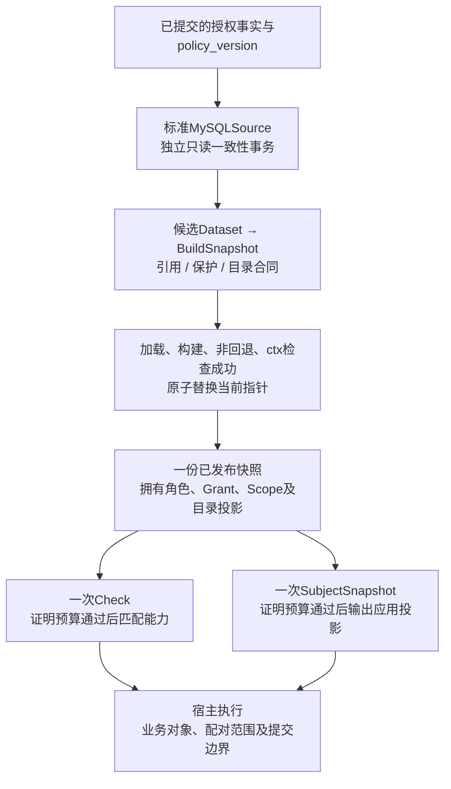

# 自有授权快照：模型取舍、发布边界与演进条件

> 状态：已实现 · 当前是直接角色与无条件Grant的不可变授权快照；替代方案及增强条件尚未实施。文件名保留历史导航，“角色图”不表示今天仍有继承闭包。

## 1. 当前方案解决什么问题

IAM将授权事实留在Role、Assignment、Resource和PermissionGrant中，将快速判定交给可重建的Runtime投影。角色管理保护、人员岗位分配、公司/门店范围、事实版本与撤销传播都有自己的责任；一次Check从一份已发布快照取得角色和Grant，匹配资源/动作后产生Decision。宿主仍负责业务对象、范围消费和最终执行。

这篇讨论当前结构的收益与代价，不把“自有”当成正确性的证明，也不推断历史作者为何放弃某个库。Casbin切换、独立业务角色、继承退役和条件退役是不同批次；旧验收时存在的继承或条件能力，不能加入今天的判定语义。

| 问题 | 当前责任 | 没有由此保证的结果 |
| --- | --- | --- |
| 谁获得什么能力 | Role组合Grant，Assignment连接主体与Role | 岗位继承、deny优先或动态对象条件 |
| 能处理哪些业务对象 | Assignment保存公司/门店Scope；宿主匹配许可并核验对象 | Check自动执行公司/门店过滤 |
| 一次判定是否读到混合策略 | 标准Source一致读，Build构建候选，Runtime原子发布 | 两次RPC同版、全实例同时切换 |
| 撤销后旧许可能读多久 | target、数据库版本确认和证明预算 | 已开始的业务操作自动撤回、数据库恢复全局防倒退 |

当前规则由[领域模型](../02-业务模块/03-AuthZ/01-领域模型设计.md)、[判定链](../02-业务模块/03-AuthZ/02-关键链路-授权判定与不可变快照.md)、[写入链](../02-业务模块/03-AuthZ/03-关键链路-授权写入与受管Assignment.md)分别维护。本专题解释这些边界为何需要同时存在。

## 2. 能力、岗位和范围分开后，组合仍有成本

设主体同时获得两个直接Role：审核岗位允许`qs:assessment:collection:reports / read`，执行岗位允许同资源的`retry`。在公司1，审核Assignment的范围是门店A，执行Assignment的范围是门店B。允许`retry`不能把主体所有Assignment的范围并成A+B，否则审核关系会扩张执行范围。

当前快照按贡献**同一原始resource/action条目**的Assignment合并同公司Scope。消费者先匹配目标资源/动作，再合并对应范围；两个不同模式同时覆盖同一目标时，也须消费各自配对范围。Check只回答能力匹配，首个命中Role/Grant只是一个允许依据，并不代表完整范围。当前RoleID、GrantID排序使首个命中可重复，却没有“最具体规则优先”或deny覆盖规则。[Scope配对](../../internal/apiserver/infra/authz/runtime/scopes.go)、[Evaluator](../../internal/apiserver/domain/authz/authorization/evaluator.go)。

由此得到的设计收益是：撤销一个岗位Assignment不必改共享Role，转店不必复制整套Grant，管理保护不必混入业务公司范围。代价是一个Assignment的范围适用于这个Role的全部Grant；若同岗位的read和retry必须有不同范围，当前需要拆分Role/Assignment或另立新合同。把字段放到Assignment，并没有消除消费方匹配、并集和对象核验的复杂度。

当前`EffectiveRoles`沿用接口名，直接返回去重排序后的DirectRoles；多个岗位显式分配，没有继承闭包。旧接口注释中的“继承”不能反证当前实现。[直接角色解析](../../internal/apiserver/infra/authz/runtime/direct_roles.go)。空Scope也不表示所有门店；Scope与成员身份、对象归属和本次操作合法性是不同事实。

### 应用投影与在线判定为何不能互换

假设一个符合管理保护要求的Role携带零ResourceID系统Grant：`*:*:*:* / *`。Check可覆盖合法的QS请求；`SubjectSnapshot(subject,"qs")`却按Grant资源键的具体App段过滤，App为`*`的条目会被排除。角色名称还有自己的App过滤，不能靠返回角色列表推导全部许可。`/me`的自助权限条目另走不带这个App过滤的投影，但其传输合同也不能代替完整Scope与版本事实。[应用快照](../../internal/apiserver/infra/authz/runtime/snapshot.go)、[自助权限](../../internal/apiserver/infra/authz/runtime/self_permissions.go)。

因此用应用快照缓存替代在线Check，是接受集合发生变化的方案选择，需要逐项比较全局通配、Role名、Scope、版本和失效行为。SDK的Scoped helper校验同一Snapshot RPC的合同和范围形状，并不替宿主执行公司过滤、对象准入或在线Check。[消费合同](../04-接口与SDK/02-Go-SDK与业务系统接入.md)。

## 3. 不可变快照是一种发布协议

图表示职责和读取路径，不承诺提交后立即加载、Check与Snapshot共同版本，或业务提交仍使用最新许可。事件通知、定时确认和失败恢复继续由[多实例收敛](../02-业务模块/03-AuthZ/04-关键链路-多实例策略收敛.md)与[事务专题](02-事务缓存与事件一致性.md)维护。

标准MySQLSource用独立只读REPEATABLE READ事务读取未删除Role/Assignment、未删除且未撤销Grant、全部未删除Resource，以及固定版本行。数据库事实与版本需要由写入协议共同推进；事务一致读不能替不守协议的writer制造这个关联。标准组合根持有根DB，不因调用ctx带共享事务carrier而自动读取借入的写事务。[Source](../../internal/apiserver/infra/authz/runtime/mysql_source.go)、[标准装配](../../internal/apiserver/container/authz/infra.go)。

Build核对Role/Assignment引用、角色保护、非零ResourceID的目录及动作。零ResourceID系统Grant跳过目录绑定，仍检查Role与敏感能力保护；`qs:*:*:* / *`不因此必需protected，覆盖代码列出的六组IAM敏感能力才触发该保护。Evaluator借用已验证且活跃的候选，不重做这些管理校验。自定义Source和直接调用Evaluator必须维护前置合同，不能把Build描述成重跑全部领域构造器。[构建](../../internal/apiserver/infra/authz/runtime/snapshot.go)、[保护规则](../../internal/apiserver/domain/authz/role/protection.go)。

不可变的实质是已发布事实的所有权隔离：Resource复制Actions，Grant复制RevokedAt，Scope复制值并遵循其私有集合/构造器/getter复制协议，输出另建集合。内部EvaluationContext只读借用当前快照；不是每次Check都递归复制所有对象。一次Check只加载一次指针，旧读者可以完成旧版判定；新指针发布不会反向修改它持有的事实。

### 一个无关目录坏行也能阻断整批发布

例如未被任何Grant引用的Resource仍保存attributes含至少一项的旧Schema。Source读取全部未删除Resource，mapper即报错；候选不会因为“本次主体用不到它”就跳过。启动首次加载失败会使Runtime构造失败；运行中加载失败保留旧快照，其读取仍受旧证明预算限制。候选失败不会发布半份策略，也不会自动立刻撤掉全部旧许可。

这是完整性与可用性的具体取舍。若改为按App分区或隔离坏行，须先定义全局通配落在哪个分区、版本是否共同推进、坏行是否包含撤销、缺失策略是否允许读取。直接忽略坏行可能把“应撤销的事实未成功加载”包装成新鲜快照。完整构建的代价则是全量内存/CPU、旧新快照短时共存、坏事实影响较大；本轮没有性能数据，不能写成现有规模下必然便宜。

## 4. 发布成功、证明新鲜与业务接受分开

### 借入事务：应用返回不一定是事实已提交

宿主开启事务，调用AuthZ修改Assignment；共享Required复用宿主事务。应用WithinTx返回后尝试Reload，标准Source却在根DB的独立事务中读取，可能仍读到旧事实。宿主随后commit，才产生可见变更；这次应用返回的版本不表示本地快照已接受它。普通顶层命令也可能已提交但Reload失败，helper吞最终重载错误，命令仍成功。[命令重载](../../internal/apiserver/application/authz/assignment/command_service.go)、[重载helper](../../internal/apiserver/application/authz/policychange/reloader.go)。

同事务Outbox建立持久交接，不能代替消息已发送、该实例已加载或宿主业务已接受。事件消费先提高最高target；已有版本覆盖事件版本可以直接返回，否则请求加载。`PolicyVersionLoaded`只判断版本覆盖，不检查证明年龄或sync状态。消费者成功和在线读取门禁因此不能合成同一个健康结论。[发布应用](../../internal/apiserver/application/authz/policypublication/service.go)。

### v41、v42与已经开始的业务操作

实例持有v41，收到v42后target上升；若重载失败，旧快照保留。proof没有因为“尝试成功”任意续期：加载候选须覆盖target，开始时间也须晚于旧proof；等版本数据库确认同样有覆盖、非回退和ctx条件。预算到期后在线读取返回门禁错误，不能当成普通无匹配DENY。默认预算值属于代码配置，不证明目标部署实际采用它。[freshness](../../internal/apiserver/infra/authz/runtime/freshness.go)、[配置](../../internal/apiserver/infra/authz/runtime/config.go)。

即使v42随后完成发布，之前已从v41获得ALLOW的业务操作仍可继续。当前Runtime没有把IAM判定与宿主数据库commit绑成一个事务。若业务需要撤销与提交有明确顺序，宿主必须定义复核点、版本要求和冲突处理；仅在提交前多Check一次仍存在最后一次读取到提交的窗口。租约、共同提交栅栏或业务侧可验证的授权revision均是候选，必须明确哪个writer拒绝旧版本，以及失败如何恢复。

### 恢复旧库：进程内单调不等于系统防倒退

LoadPolicy拒绝低于**该Runtime已发布版本**的候选。全新Runtime没有previous，target初始为0，可加载恢复的低版本并获得新proof；不能由新进程健康推导历史撤权仍生效。若恢复或旁路修改保留相同版本，Reconcile看到等版本可能只确认旧快照而不重新读取全部事实。[Runtime](../../internal/apiserver/infra/authz/runtime/runtime.go)、[版本确认](../../internal/apiserver/infra/authz/runtime/freshness.go)。

这些是源码条件推论，本轮没有恢复实验。恢复方案必须共同处理事实备份与版本、持久Outbox/旧消息、存活实例、外部权限缓存及受治理的版本推进；涉及停写和恢复操作时，使用独立的[数据库运维](../05-工程质量与运维/03-迁移发布与数据库运维.md)与[遗留资产审计](../05-工程质量与运维/06-遗留资产兼容层与数据库退役审计.md)，不能从本专题发起现场操作。

## 5. 演进批次的退出条件不同

| 阶段 | 可核对的仓库事实 | 不能据此推导 |
| --- | --- | --- |
| Casbin事实表退役 | 000027：空casbin_rule可直接通过；非空须verified标记、64位hex摘要及时间，再删除旧表/列 | SQL门禁重算了历史权限语义；今天仍存在Casbin读链 |
| 独立岗位与继承退出 | 000033保存迁移回执；000034要求applied回执、匹配after_hash、有效归档/校验和、无活跃旧角色与边，再DROP继承表 | 单凭归档就完成逐用户能力/范围接受 |
| 条件行为退役 | 000035建立维护回执；当前Grant/Resource mapper只接受合法空兼容表示、写固定空JSON | constraint_set物理列已经删除；旧条件仍参与Check |
| 标准消息交接 | 000038–40分别建立标准Outbox、失败状态字段与终失败审计 | 旧Outbox已自动复制、排空或所有实例已加载 |

以上是不同迁移及维护协议，000019的Identity回填和000021的租户/字典删除也不能作为Casbin退役证据。[迁移源码](../../internal/pkg/migration/migrations)、[维护与退役](../02-业务模块/03-AuthZ/09-安全加固与发布验收.md)。

合法空兼容输入包括空白、null、空对象、数组缺省/null或空数组等，具体由严格解析器限定，不能只认可一种序列化。稳定GrantKey仍使用固定空条件的v2哈希输入；legacycondition仅在维护链解释历史材料，不进入Runtime求值。保留兼容表示的目的是识别/拒绝残留和维持合同，不是恢复退役能力。[空兼容解析](../../internal/pkg/authzcompat/empty.go)、[Grant mapper](../../internal/apiserver/infra/mysql/permissiongrant/mapper.go)。

[2026-09-08切换记录](../_data/releases/iam-v5-cutover-20260908.md)记载的样本仍有8条继承；[独立角色记录](../_data/releases/independent-role-migration-20260909.md)另记迁移/退役执行，并保留后续业务验收限制。两份记录是有日期的证据，不能将当时数量、测试、条件场景或线上观察改写成当前部署状态。

## 6. 如何判断下一种方案是否值得引入

比较对象应是同一组责任，而非“框架”与“自研”的标签。当前实现可观察到的收益是领域写入合同明确、判定路径有限、快照可整体发布；它的成本是团队自行维护匹配、保护、索引、证据和升级兼容。本篇没有证明Casbin无法表达这些规则，也没有给旧选型补写未经记录的动机。

| 候选 | 必须补齐的设计 | 最小接受样本及成本 |
| --- | --- | --- |
| 继续本地快照，改用通用求值器 | 事实到policy的确定性映射；保留管理保护、Scope配对、版本/proof和输出合同；规定自定义函数与模型升级 | 同一事实对照能力/范围/错误；全局通配、系统Grant、撤销及残留拒绝都要一致。引擎替换不免除传播责任 |
| 每请求直接SQL | 多表与版本共同读；能力/Scope同版；连接、事务和超时归属；并发writer协议 | 读与撤销交错、取消、坏行、数据库不可用；增加请求对DB的依赖，仍不自动绑定宿主commit |
| 独立远程判定服务 | 可信Subject、请求/响应版本与范围、超时/重试、返回丢失和失效消费；明确远程调用是否携带业务对象事实 | 假身份、过期响应、网络隔离、旧缓存和提交交错；新增传输及服务可用性责任 |
| 增量或分区快照 | 确定顺序、缺口检测、撤销tombstone、重建/回退、全局Grant跨区、所有权与共同版本 | 删除/改Role/目录动作、乱序重复和遗漏、坏分区；减少全量成本但增加合并与完整性证明 |

若重新引入继承或条件，应先回答具体业务矛盾。继承须区分岗位身份与能力复用，避免派生出不应出现的岗位；条件须明确属性由谁取得、来源与时效、未知值/类型错误如何拒绝、解释如何绑定本次输入。当前对象范围已由宿主消费，不应把调用方任意属性直接当成可信事实。接受这些合同、迁移/退役成本后才讨论实现，均不属于当前能力。

## 7. 本篇证据与验证边界

本篇以当前源码与有日期的迁移/发布材料为准。复用第50/51篇原日志15run/pass（13顶层、2子项），8份原package pass另计，8不同包；原日志日期为2026-10-07北京时间，执行HEAD、race/count=1/json选测、环境与当时记录的工具摘要均保留。本轮新增Go行为执行0、测试文件0。未找到独立执行绑定的早期Scope/直接角色/所有权结果不进入复用计数，当前只静态审读源码与测试体。

选测实际覆盖残留兼容/旧入口拒绝、旧快照保留、证明边界、丢通知后的fake版本恢复、读开始时间，以及stub消费者/重载helper的调用和重试。Grant mapper坏行fixture的其他字段不完整，不能单凭Error断言孤立证明条件残留是错误原因；解析顺序由源码证明。54组来源map重核5022条路径，其中82项为本篇静态子集、3新增路径仅有日期的历史文档；这些数量和package pass不建立真实MySQL隔离、全实例撤权、跨RPC共同版本或业务对象提交接受。[完整阶段来源](../_data/reviews/2026-10-06-docs-refactor.md)。

特别是本轮仅静态审读的既有所有权测试体中，修改Resource.Actions后Check仍ALLOW，Evaluator并不消费该字段，不能仅靠这一步证明Actions复制；该测试不计入15项历史复用，具体克隆由源码定位。借入事务、全局通配投影、坏目录与恢复案例是带前提的推演，不是本轮复现的事故。当前生产配置/策略事实、消费者版本、性能容量、恢复及业务接受均为unknown；历史运行事实保留原日期与来源。
