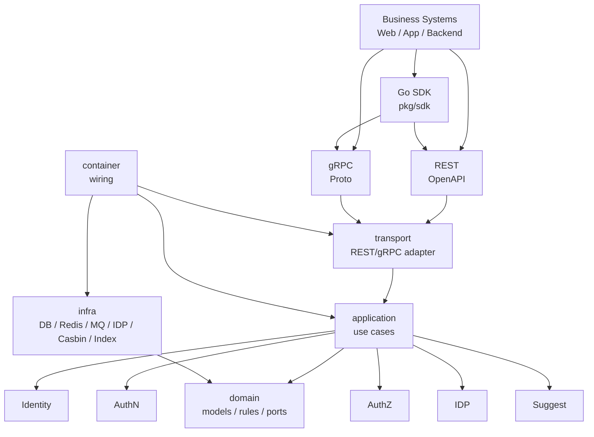

# 系统架构讲法

> 状态：待补证据 · 宣讲第一版，已按金字塔结构重写；后续需要继续结合 `cmd`、`internal/apiserver`、`api/rest`、`api/grpc`、`pkg/sdk`、架构测试和部署配置逐项核对。

---

## 1. 本文目标

本文用于回答：

```text
IAM 的系统架构是怎么设计的？
```

它不是完整架构文档，而是宣讲用表达稿，适用于：

```text
面试项目讲解；
技术评审；
架构图讲解；
README 导读；
向其他业务系统说明 IAM 如何接入。
```

本文采用金字塔表达：

```text
先讲顶层结论；
再讲架构分层；
再讲业务模块；
再讲接入方式；
再讲关键运行链路；
最后讲工程护栏。
```

---

## 2. 一句话架构结论

IAM 的系统架构可以概括为：

```text
以 Identity / AuthN / AuthZ 为核心业务能力，以 IDP / Suggest 为辅助扩展能力，对外通过 REST、gRPC、Go SDK 提供接入，对内采用 transport -> application -> domain -> infra 的分层架构，并通过架构测试、契约测试和文档卫生防止边界漂移。
```

更短一点：

```text
IAM 是一个分层清晰、模块解耦、契约驱动、带工程护栏的身份与访问管理服务。
```

---

## 3. 金字塔结构

### 3.1 顶层结论

```text
IAM 不是单一用户中心，而是身份事实、认证、授权、外部身份源、Profile 搜索和接入契约组合起来的系统。
```

---

### 3.2 三个架构支柱

| 支柱 | 说明 |
| --- | --- |
| 业务模块化 | Identity、AuthN、AuthZ、IDP、Suggest 各自边界清晰 |
| 运行时分层 | transport、application、domain、infra、container 各司其职 |
| 契约与护栏 | REST/gRPC/SDK 契约驱动，architecture tests / contract tests / docs hygiene 防漂移 |

---

### 3.3 五个业务模块

| 模块 | 定位 | 架构关注点 |
| --- | --- | --- |
| Identity | 身份事实中心 | User / Profile / ProfileLink 写模型与关系不变量 |
| AuthN | 认证中心 | LoginIdentity / Credential / Principal / Session / Token / JWKS |
| AuthZ | 授权中心 | Subject / Resource / Action / Scope / Role / Permission / RoleBinding / Check |
| IDP | 外部身份源基础设施 | provider app / credential / app token / external identity |
| Suggest | Profile 搜索读模型 | Snapshot / search term / visibility filter / mask result |

---

### 3.4 六层运行时结构

| 层 | 职责 |
| --- | --- |
| process / cmd | 进程入口、配置加载、生命周期管理 |
| container | 依赖装配，把 port 和 concrete 绑定起来 |
| transport | REST/gRPC 协议适配、DTO/proto mapper、middleware/interceptor |
| application | 用例编排、事务边界、跨模块 port、事件/outbox 编排 |
| domain | 领域对象、不变量、领域服务、领域错误、port 定义 |
| infra | repository、cache、MQ、provider adapter、Casbin adapter、index store 等技术实现 |

---

## 4. 30 秒版本

```text
IAM 的架构不是简单的用户表 CRUD，而是按身份事实、认证、授权、外部身份源和搜索读模型拆成五个模块。运行时采用分层架构：transport 负责 REST/gRPC 协议适配，application 负责用例编排，domain 负责模型和规则，infra 负责数据库、缓存、消息、Casbin、外部 provider 等技术实现，container 负责装配。对外通过 REST、gRPC 和 Go SDK 接入，同时用架构测试、契约测试和 docs hygiene 防止分层、接口和文档漂移。
```

---

## 5. 1 分钟版本

```text
IAM 的系统架构我主要从两条线来讲：一条是业务模块线，一条是运行时分层线。

业务模块上，我把它拆成 Identity、AuthN、AuthZ、IDP、Suggest 五块。Identity 维护用户、档案和 ProfileLink 这些身份事实；AuthN 负责登录认证、Session、AccessToken、RefreshToken 和 JWKS；AuthZ 负责 Subject、Role、Permission、RoleBinding 和访问决策；IDP 负责微信等外部身份源接入；Suggest 是一个读模型，负责在安全范围内做 Profile 联想搜索。

运行时分层上，对外是 REST、gRPC 和 Go SDK；进入服务后 transport 只做协议适配，application 编排用例，domain 表达业务模型和不变量，infra 实现 repository、cache、MQ、Casbin adapter、provider adapter 等技术细节，container 只做依赖装配。为了防止项目变大后边界漂移，我还设计了架构测试、契约测试、SDK compile test 和 docs hygiene，把这些边界固化下来。
```

---

## 6. 3 分钟版本

```text
IAM 的系统架构可以从四个层次讲：业务模块、接入契约、运行时分层和工程护栏。

第一层是业务模块。IAM 不是单纯的用户中心，而是身份与访问管理服务，所以我把它拆成五个模块。Identity 负责用户、档案和 ProfileLink，解决“谁是谁、谁和哪个档案有关系”；AuthN 负责登录认证、Credential、Principal、Session、AccessToken、RefreshToken 和 JWKS，解决“当前请求者如何证明自己是谁”；AuthZ 负责 Subject、Resource、Action、Scope、Role、Permission、RoleBinding 和 Check，解决“某个主体能不能访问某个资源”；IDP 负责微信等外部身份源接入，把外部 provider 的身份事实解析出来；Suggest 是 Profile 联想搜索读模型，用来在安全范围内搜索候选档案。

第二层是接入契约。IAM 对外提供 REST、gRPC 和 Go SDK。REST 适合 Web、App、管理端和跨语言调用；gRPC 适合内部可信服务间调用；Go SDK 则给 Go 业务服务提供更稳定的接入封装。这里我明确 OpenAPI 是 REST 的机器契约，proto 是 gRPC 的机器契约，pkg/sdk 是 Go SDK public API 的事实源，文档只解释语义和边界，不反向制造接口事实。

第三层是运行时分层。请求进入后先到 transport 层，REST handler 或 gRPC service 只做协议适配、参数解析、错误映射和 middleware/interceptor 接入；然后进入 application 层，由 use case 编排事务、调用领域对象、调用跨模块 port、写 outbox 或触发事件；domain 层只保留领域对象、不变量和领域服务，不依赖 transport、infra、proto、Casbin；infra 层实现数据库、缓存、消息队列、外部 provider、Casbin runtime、搜索索引等具体技术；container 是组合根，只负责把这些依赖装配起来。

第四层是工程护栏。为了防止代码和文档随着迭代变乱，我把几个护栏固定下来：architecture tests 防止 domain 依赖 infra、transport 绕过 application、SDK import internal；contract tests 防止 OpenAPI、proto、SDK 和 transport 实现漂移；SDK compile test 保护 Go SDK public API；docs hygiene 防止 README 链接失效、active docs 引用 archive 旧事实。

所以这个系统的架构重点不是用了某个框架，而是通过模块拆分、分层依赖、契约事实源和自动化护栏，把身份事实、认证、授权、外部身份源和搜索读模型稳定地组织起来。
```

---

## 7. 系统架构总图讲法

可以用这张逻辑图讲：



讲图时的顺序：

```text
先讲外部接入：REST / gRPC / Go SDK；
再讲运行时分层：transport -> application -> domain，infra 实现端口，container 装配；
再讲业务模块：Identity / AuthN / AuthZ / IDP / Suggest；
最后讲工程护栏：架构测试、契约测试、SDK compile test、docs hygiene。
```

---

## 8. 运行时分层讲法

### 8.1 process / cmd

```text
process 或 cmd 是进程入口，负责配置加载、启动 HTTP/gRPC server、初始化依赖、生命周期管理和优雅退出。
```

它不应该承载业务规则。

---

### 8.2 container

```text
container 是组合根，负责把 repository、service、use case、handler、provider adapter、Casbin adapter、index store 等依赖装配起来。
```

关键边界：

```text
container 可以知道所有 concrete；
container 只做 wiring；
container 不执行业务用例；
handler 不应该运行时从 container 临时取依赖。
```

---

### 8.3 transport

```text
transport 是协议适配层，负责 REST/gRPC 的请求解析、DTO/proto mapper、错误映射、认证授权 middleware/interceptor 接入。
```

关键边界：

```text
transport 不写业务规则；
transport 不直接访问 repository；
transport 不直接调用 Casbin；
transport 不绕过 application。
```

---

### 8.4 application

```text
application 是用例编排层，负责 Login、Refresh、Check、Grant、SuggestProfile 等用例，处理事务边界、调用领域对象、调用 port、写 outbox、触发事件。
```

关键边界：

```text
application 可以调 domain；
application 调 port，不直接依赖具体 infra；
application 不依赖 transport；
application 不知道请求来自 REST 还是 gRPC。
```

---

### 8.5 domain

```text
domain 是领域层，负责 User、Profile、LoginIdentity、Credential、Principal、Subject、Role、Permission、ProfileSearchTerm 等核心模型和不变量。
```

关键边界：

```text
domain 不依赖 infra；
domain 不依赖 transport；
domain 不依赖 generated proto；
domain 不依赖 Casbin concrete；
domain 不关心数据库、缓存、HTTP、gRPC。
```

---

### 8.6 infra

```text
infra 是技术实现层，负责 MySQL/Mongo/Redis、MQ、Outbox store、IDP provider adapter、Casbin adapter、Suggest index store 等具体实现。
```

关键边界：

```text
infra 实现 port；
infra 不反向调用 application；
infra store 不直接吞并授权决策；
infra 不返回 transport DTO。
```

---

## 9. 业务模块讲法

### 9.1 Identity

```text
Identity 是身份事实中心，维护 User、Profile、ProfileLink 等对象。它解决的是“谁是谁，用户和档案是什么关系”。这里最重要的边界是 ProfileLink 只是身份关系事实，不是权限。
```

---

### 9.2 AuthN

```text
AuthN 是认证中心，负责 LoginIdentity、Credential、Challenge、Principal、Session、AccessToken、RefreshToken 和 JWKS。它解决的是“当前请求者如何证明自己是谁”。这里最重要的边界是认证不等于授权，AccessToken 可本地验签，但验签后仍要 AuthZ Check。
```

---

### 9.3 AuthZ

```text
AuthZ 是授权中心，负责 Subject、Resource、Action、Scope、Role、Permission、RoleBinding 和 AuthorizationDecision。它解决的是“某个主体能不能对某个资源执行某个动作”。这里最重要的边界是 AuthZ 领域模型与 Casbin runtime 分离，Casbin 只是 infra adapter。
```

---

### 9.4 IDP

```text
IDP 是外部身份源基础设施，负责 provider app、credentials、provider access token 和 ExternalIdentity 解析。它只解析外部身份事实，不直接创建 User，不签发 IAM Token。
```

---

### 9.5 Suggest

```text
Suggest 是 Profile 联想搜索读模型，从 Identity 的 Profile facts 派生搜索索引和 Snapshot，在查询时做可见性过滤、排序、截断和脱敏。它不是 Profile 主数据，也不是授权凭证。
```

---

## 10. 接入层讲法

IAM 对外提供三类接入：

| 接入方式 | 讲法 |
| --- | --- |
| REST | 面向 Web、App、管理端和跨语言调用，OpenAPI 是机器契约 |
| gRPC | 面向内部可信服务间调用，proto 是机器契约 |
| Go SDK | 面向 Go 业务服务，封装 REST/gRPC 调用和错误模型 |

关键边界：

```text
OpenAPI/proto 是机器契约；
文档不反向定义接口字段；
SDK 不 import internal；
业务系统不直接访问 IAM 数据库；
业务系统通过 AuthN + AuthZ 接入认证授权能力。
```

---

## 11. 关键运行链路讲法

### 11.1 登录认证链路

```text
login request
  -> transport/authn
  -> application/authn LoginUseCase
  -> domain LoginIdentity / Credential / Principal
  -> create Session
  -> issue AccessToken / RefreshToken
  -> return token response
```

讲解重点：

```text
Credential 校验属于 AuthN；
Session 是服务端会话状态；
AccessToken 用于普通 API；
RefreshToken 只用于续期；
JWKS 支持业务系统本地验签。
```

---

### 11.2 API 访问控制链路

```text
business request with AccessToken
  -> local verification / AuthN context
  -> Principal
  -> Subject
  -> AuthZ Check(Resource, Action, Scope)
  -> AuthorizationDecision
```

讲解重点：

```text
验签只解决认证；
授权必须看 Resource / Action / Scope；
Token claims 不替代权限系统。
```

---

### 11.3 授权写入与策略刷新链路

```text
Grant / Revoke / Bind / Unbind
  -> application/authz
  -> write authorization facts
  -> bump PolicyVersion
  -> write OutboxEvent
  -> Relay publish
  -> RuntimeReload
  -> Casbin runtime reload snapshot
```

讲解重点：

```text
Outbox 解决业务事实写入和事件发布的一致性；
发布语义是 at-least-once；
消费者必须幂等；
Casbin runtime reload 是最终一致。
```

---

### 11.4 Suggest 查询链路

```text
keyword
  -> SuggestProfile
  -> match ProfileSuggestionIndex candidates
  -> visibility filter
  -> rank / limit
  -> mask
  -> ProfileSuggestItem
```

讲解重点：

```text
Suggest 是读模型；
索引命中不等于可见；
先过滤再截断；
返回脱敏候选，不返回明文手机号。
```

---

## 12. 架构护栏讲法

可以这样讲：

```text
为了防止项目持续演进后边界变乱，我做了四类护栏：架构测试保证 import 方向不越界，契约测试保证 OpenAPI/proto/SDK/transport 不漂移，SDK compile test 保证 Go SDK public API 可编译，docs hygiene 保证文档链接、active/archive 和事实源不漂移。
```

对应关系：

| 护栏 | 保护什么 |
| --- | --- |
| architecture tests | domain 不依赖 infra/transport，SDK 不 import internal，transport 不绕过 application |
| contract tests | OpenAPI/proto/SDK/transport 实现一致 |
| SDK compile test | Go SDK public API 和示例可编译 |
| docs hygiene | README、链接、active/archive 和 Verify 命令不漂移 |

---

## 13. 项目架构不是什么

可以主动澄清：

```text
不是一个只有 JWT 的登录 demo；
不是一个所有逻辑写在 handler 里的 CRUD 服务；
不是业务系统直接查 IAM 数据库；
不是把 Casbin 当领域模型；
不是把 ProfileLink 当 Permission；
不是把 Suggest 索引当 Profile 主数据；
不是靠文档约定边界，而是用测试和 CI 固化边界。
```

---

## 14. 面试追问时的展开点

| 追问方向 | 展开点 |
| --- | --- |
| 为什么要拆 Identity/AuthN/AuthZ？ | 用户事实、认证过程、授权决策是三个不同问题，混在一起会导致模型混乱 |
| 为什么要分层？ | 让协议、用例、领域规则、技术实现解耦，便于测试和演进 |
| 为什么 Casbin 不进 domain？ | Casbin 是 runtime engine，领域模型应该表达 Subject/Role/Permission 等业务语言 |
| 为什么需要 Outbox？ | 授权事实写入和 runtime reload 事件发布存在双写一致性问题 |
| 为什么 Suggest 是读模型？ | 搜索索引可重建、可最终一致、可降级，不应该污染 Identity 写模型 |
| 为什么要契约测试？ | 防止 OpenAPI/proto/SDK 和 transport 实现不一致 |
| 为什么 SDK 不 import internal？ | SDK 是外部接入面，必须依赖公开契约，不能穿透服务内部实现 |

---

## 15. 事实源回链

| 内容 | 事实源 |
| --- | --- |
| 项目定位 | [01-项目一句话定位.md](01-项目一句话定位.md) |
| 业务模块 | [../02-业务模块/README.md](../02-业务模块/README.md) |
| 接入契约 | [../03-接入与契约/README.md](../03-接入与契约/README.md) |
| 分层依赖边界 | [../04-架构护栏/01-分层依赖边界.md](../04-架构护栏/01-分层依赖边界.md) |
| 架构测试 | [../04-架构护栏/02-架构测试.md](../04-架构护栏/02-架构测试.md) |
| 契约测试 | [../04-架构护栏/03-契约测试.md](../04-架构护栏/03-契约测试.md) |
| 专题设计 | [../05-专题设计/README.md](../05-专题设计/README.md) |
| 架构风格 | [../00-概览/05-架构风格与设计原则.md](../00-概览/05-架构风格与设计原则.md) |

---

## 16. Verify

修改本文后至少执行：

```bash
make docs-hygiene
```

如果同步修改架构、契约或业务模块，需要按对应目录执行：

```bash
go test ./internal/pkg/architecture
make api-validate
make proto-gen
go test ./pkg/sdk/...
```

---

## 17. 本文总结

系统架构讲法可以压缩成：

```text
业务上五个模块：Identity / AuthN / AuthZ / IDP / Suggest；
接入上三种方式：REST / gRPC / Go SDK；
运行时六层结构：process / container / transport / application / domain / infra；
工程上四类护栏：architecture tests / contract tests / SDK compile test / docs hygiene。
```

宣讲时最重要的是：

```text
先讲系统为什么这么拆；
再讲请求如何流转；
再讲每层边界；
最后讲如何防止边界随着迭代漂移。
```
