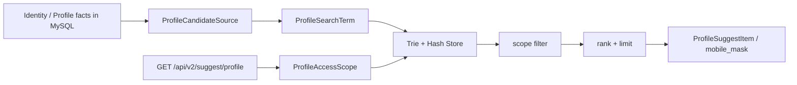

# Suggest 读模型讲法

> 状态：已实现 · 本文只保留宣讲表达，实现细节以 [Suggest 模块文档](../02-业务模块/05-Suggest/README.md) 和代码为准。

## 1. 一句话定位

Suggest 是从 Identity Profile 事实派生的联想搜索读模型：它在当前操作员的可见范围内召回、排序并返回脱敏的 Profile 候选项。

```text
Suggest 管“安全地找候选 Profile”，
不管 Profile 主数据写入，也不代替详情读取或后续操作的 AuthZ 决策。
```

## 2. 30 秒版本

Suggest 定时从 MySQL 加载 Profile 候选数据，把姓名、全拼、简拼放入 Trie，把 Profile ID 和原始手机号放入精确 Hash 索引。查询时，application 先校验操作员、解析 `ProfileAccessScope` 和选择搜索策略，Store 再召回候选、先做 scope 过滤，最后排序和截断。响应只返回 `profile_id`、`display_name`、`mobile_mask` 和 `weight`。

最重要的边界是：索引命中不等于可见，Suggest 可见也不等于已获得 Profile 详情或操作权限。

## 3. 三分钟主线

### 3.1 数据从哪里来

Profile 主数据属于 Identity。Suggest 通过 `ProfileCandidateSource` 从 MySQL 读取数据，构造 `ProfileSearchTerm`。它没有消息订阅链路，当前依靠初始全量加载和定时 Full / Delta 刷新。

### 3.2 读模型如何工作



- Full 刷新先构建新 Store，再通过原子指针替换当前索引。
- Delta 刷新在当前 Store 上移除旧 key 并导入新 term，不是整仓原子切换。
- Full 与 Delta 共用非阻塞刷新锁；重叠任务直接跳过，不排队。
- 增量游标使用查询开始时间，空增量成功也推进，失败时不推进。

### 3.3 查询如何工作

```text
rate limit
  -> validate principal and keyword
  -> resolve ProfileAccessScope
  -> select numeric / text / mobile-denied strategy
  -> recall candidates from Trie or Hash
  -> filter by compiled scope
  -> rank and limit
  -> map to masked response
```

`ProfileAccessScope` 由当前操作员、组织和可见性数据解析得到。当前普通用户的可见 Profile 主要通过 `profiles.created_by` 查询，而不是对每个候选逐一执行 AuthZ Check。

## 4. 四个心智模型

| 对象 | 在 Suggest 中的职责 | 不是什么 |
| --- | --- | --- |
| `ProfileSearchTerm` | 从 Profile 派生的索引输入 | 不是 Profile 实体 |
| `ProfileSuggestionIndex` | 对 scope 内候选执行搜索 | 不是授权事实源 |
| `ProfileAccessScope` | 本次查询的可见范围和手机号搜索开关 | 不是 ProfileLink 或 AuthZ Scope |
| `ProfileSuggestItem` | 脱敏的候选展示结果 | 不是 Profile 详情或授权凭证 |

## 5. 手机号搜索怎么讲

当前实现的安全措施是：

- 7–15 位纯数字被视为手机号形态；
- scope 没有 `AllowMobileSearch` 时返回 HTTP 200 和空列表；
- 候选仍必须通过 scope 过滤；
- 响应只返回 `mobile_mask`；
- handler 在进入 application 前限流；可使用内存令牌桶或 Redis 限流。

不能说成已实现的事项：

- 手机号 hash 或后缀 token：当前 Store 仍使用原始手机号，但不会写入文件；
- 持久化安全审计：当前有日志和指标，没有专用审计存储；
- Redis 故障时严格拒绝：当前 Redis 错误采用 fail-open，未配置 Redis 则回退内存限流。

## 6. 与 Identity 和 AuthZ 的边界

| 问题 | 归属 |
| --- | --- |
| Profile 的创建、修改和关系事实 | Identity |
| 姓名、拼音、手机号的候选召回 | Suggest |
| 本次 Suggest 查询的本地 scope 过滤 | Suggest |
| 查看详情、修改、导出等资源操作 | 相应用例的 AuthZ |

因此，“在 Suggest 中出现”只说明可以作为脱敏候选展示，不能作为后续操作的授权依据。

## 7. 宣讲时的准确性红线

| 容易说过头的表达 | 当前准确说法 |
| --- | --- |
| Suggest 已有 REST / gRPC / Go SDK 完整契约 | 当前只有 `GET /api/v2/suggest/profile` REST 入口 |
| 候选数据由事件订阅实时同步 | 当前由 MySQL loader 初始加载并定时刷新 |
| Full 和 Delta 都是整仓原子切换 | 只有 Full 使用新 Store 原子替换，Delta 原地更新 |
| Suggest 有本地持久化恢复 | 当前只有进程内索引，重启必须从 MySQL Full 重建 |
| Suggest 命中就代表 AuthZ 通过 | Suggest 只做本地可见范围过滤，后续操作仍需自己授权 |

## 8. 常见追问

### 为什么不直接查 Profile 表？

联想搜索需要姓名前缀、拼音和高频排序，与 Profile 写模型的查询形状不同。独立读模型能隔离两类变化，也能在刷新失败时保留上一份可用 Full 索引。

### 为什么先过滤再 limit？

如果先截断，不可见候选会占用名额，既造成可见结果丢失，也容易产生边信道。当前 Store 在最终排序和 limit 前执行 scope 过滤。

### 读模型可以接受最终一致吗？

可以，因为 Suggest 返回的是候选而非交易或授权结果。但当前文档不应把“可接受”说成已经具备完整的事件同步、版本校验或快照恢复机制。

## 9. 事实回链

| 要追问的事实 | 文档 |
| --- | --- |
| 模块定位、REST 契约和降级 | [Suggest 模块](../02-业务模块/05-Suggest/README.md) |
| Domain 对象和 application 端口 | [模型与应用端口](../02-业务模块/05-Suggest/01-模型与应用端口.md) |
| Full、Delta、刷新锁和游标 | [索引刷新](../02-业务模块/05-Suggest/02-关键链路-索引刷新Full-Delta.md) |
| 召回、scope、限流和脱敏 | [SuggestProfile 查询](../02-业务模块/05-Suggest/03-关键链路-SuggestProfile查询.md) |
| 为什么选择读模型 | [Suggest 为什么是读模型](../05-专题设计/06-Suggest为什么是读模型.md) |
