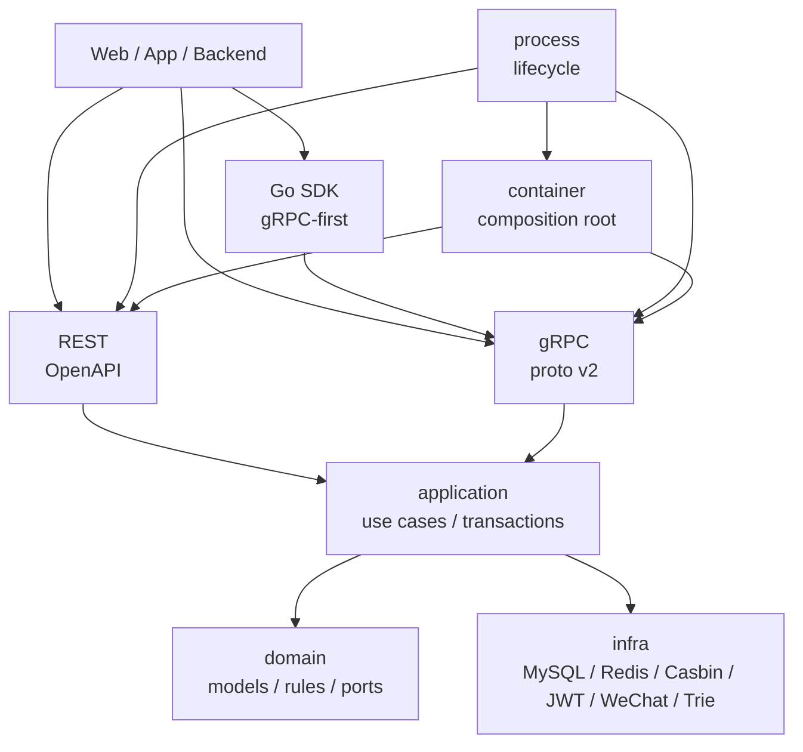

# 30 分钟技术分享脚本

> 状态：已实现 · 已与当前进程装配、五个业务模块、REST/OpenAPI、gRPC/proto、Go SDK、Outbox、架构测试和 CI 核对。本文是宣讲入口，不代替代码和机器契约。

## 1. 本文回答

本文用于技术分享、架构评审或项目深讲，回答三个问题：

- 30 分钟内应该如何讲清 IAM？
- 哪些能力是当前已实现，哪些不能说过头？
- 听众追问时，应该回链到哪个代码或契约事实源？

这不是全量设计文档的口语复制版。主讲人只需沿时间轴讲，细节通过末尾的证据回链展开。

## 2. 30 秒结论

IAM 是面向业务系统的身份与访问管理服务。它用 Identity 管理 User、Profile 和 ProfileLink 身份事实，用 AuthN 完成登录、Session、Token 和 JWKS，用 AuthZ 处理资源操作决策，用 IDP 管理微信/企微应用与 provider 能力，用 Suggest 提供可见范围内的 Profile 联想搜索。

运行时由一个 `iam-apiserver` 进程同时提供 REST 和 gRPC，Go SDK 主入口走 gRPC。分层与契约通过架构测试、proto 注册覆盖测试、SDK compile test、docs hygiene 和全仓测试保护。

## 3. 时间轴与听众要记住的事

| 时间 | 内容 | 听众应记住 |
| --- | --- | --- |
| 0–3 分钟 | 定位与问题背景 | IAM 不是登录 demo |
| 3–7 分钟 | 运行时与分层 | 一个进程、两种协议、清晰组合根 |
| 7–10 分钟 | Identity | 身份事实不等于认证或权限 |
| 10–13 分钟 | AuthN | 认证结果不等于授权结果 |
| 13–16 分钟 | AuthZ | 授权是 Subject/Tenant/Resource/Action/ObjectScope 决策 |
| 16–18 分钟 | IDP | 外部 provider 能力与 IAM 登录态分离 |
| 18–20 分钟 | Suggest | 搜索候选不是 Profile 主数据或授权凭证 |
| 20–24 分钟 | REST / gRPC / Go SDK | 三种入口的覆盖范围不完全相同 |
| 24–27 分钟 | 设计取舍与工程护栏 | 一致性、边界和契约要有可执行保护 |
| 27–30 分钟 | 总结与追问 | 当前能力、当前缺口和证据入口 |

## 4. 一张图先建立全局地图



讲图时只强调三点：

1. `process` 管理资源、HTTP/gRPC 生命周期、后台任务和优雅关闭。
2. `container` 是组合根，把五个业务模块和技术适配器组装到 transport。
3. REST/gRPC 做协议适配，application 编排用例，domain 表达规则，infra 实现端口。

## 5. 0–3 分钟：项目定位

### 可直接讲

> 这个项目不是一个只有登录和 JWT 的 demo，而是面向业务系统接入的身份与访问管理服务。
>
> 当每个业务系统都自己管用户表、接微信登录、发 Token、写角色判断和做人员搜索时，身份事实、认证凭证和访问权限很容易混在一起。IAM 的核心价值是把这些问题拆成稳定边界，再通过统一契约给业务系统使用。

转场句：

> 下面先不讲 JWT 或 Casbin，而是先看整个服务如何运行，再看五个模块如何分工。

## 6. 3–7 分钟：运行时与分层

### 可直接讲

> IAM 当前只有一个 `iam-apiserver` 进程。启动时，`process` 加载配置和 MySQL、Redis、事件总线等资源，创建 `container`，然后构建并注册 REST 和 gRPC 服务。两个 server 由同一个进程并行运行，任一 server 退出都会进入统一关闭流程。
>
> 后台任务也纳入同一生命周期，包括 JWKS key rotation、Outbox relay、AuthZ policy sync 和 Suggest refresh。这些能力不是在 handler 里临时启动的 goroutine。
>
> 分层上，transport 做协议转换，application 管用例和事务，domain 管模型与不变量，infra 管数据库、Redis、Casbin、JWT、微信 API 和搜索索引等实现。

这里不要将层数固定说成“六层”。`cmd`、`process`、`container`、`transport`、`application`、`domain`、`infra` 是不同职责，宣讲时重点是依赖方向，不是数层数。

## 7. 7–16 分钟：三个核心模块

### 7.1 7–10 分钟：Identity

> Identity 是身份事实中心。`User` 是 IAM 内部的稳定身份锚点，`Profile` 是业务档案或被服务对象，`ProfileLink` 表达 User 与 Profile 之间可建立、可撤销的关系事实。
>
> 最重要的边界是 `ProfileLink` 不是 Permission。它可以表达自有档案、亲属或监护关系，但不能单独推导读取、修改、删除或导出资源的权限。

记忆句：

```text
Identity 记录“是谁、关系是什么”，不证明“当前请求是谁”，也不判断“能不能做”。
```

### 7.2 10–13 分钟：AuthN

> AuthN 负责证明当前请求者是谁。`LoginIdentity` 表达用户从哪个 provider 和 realm 登录，`Credential` 表达密码 hash 等长期认证材料，`Challenge` 表达验证码或 OAuth state 等短期挑战。认证成功后产生 `Principal`，再建立 `Session` 并签发 AccessToken / RefreshToken。
>
> AccessToken 当前使用 JWT 实现，公钥通过 JWKS 发布，业务服务可以本地验签。但验签成功只说明 Token 可信且认证上下文可用，不说明对某个业务资源已授权。

记忆句：

```text
AuthN 回答“你是谁”；Token 是认证结果的携带方式，不是业务权限清单。
```

### 7.3 13–16 分钟：AuthZ

> AuthZ 负责“能不能做”。当前 Check 输入包含 Subject、TenantID、ResourceKey、Action 和 ObjectScope，输出 `Decision`，其中包含 allow/deny、命中的 role/permission 和 PolicyVersion。
>
> Casbin 是 infra 层的运行时决策引擎，不是 AuthZ 的业务模型。Permission 或 RoleBinding 变更时，application 在同一数据库事务内写入授权事实、递增 PolicyVersion 并暂存 Outbox 事件；提交后尝试刷新本地 runtime，Outbox relay 再把版本事件传播给其他实例。

记忆句：

```text
数据库事实和版本变更在本地事务内一致，runtime 刷新和跨实例传播是后续过程。
```

## 8. 16–20 分钟：两个辅助模块

### 8.1 16–18 分钟：IDP

> IDP 当前主要管理微信/企微应用配置、加密凭据、provider app access token 和微信 API 适配器。AuthN 登录或绑定链路会使用这些能力，将小程序、微信开放平台或企微 code 换成 openid、unionid 或 userid，再在 AuthN 中查找 `LoginIdentity`。
>
> provider access token 不是 IAM AccessToken，openid 也不是 IAM UserID。当前 IDP domain 没有一个独立的 `ExternalIdentity` 聚合，不要把概念模型说成已实现实体。

### 8.2 18–20 分钟：Suggest

> Suggest 是从 Identity Profile 数据派生的联想搜索读模型。当前 MySQL loader 通过 Full/Delta 刷新进程内 Trie/Hash Store；查询时先解析 `ProfileAccessScope`，召回候选，再做 scope 过滤、排序、截断和手机号脱敏。
>
> 索引命中不等于可见，可见候选也不是详情访问的授权凭证。当前 Suggest 只有 REST，没有 gRPC proto 或 Go SDK 客户端。

## 9. 20–24 分钟：业务系统如何接入

先给出当前能力矩阵：

| 模块 | REST | gRPC v2 | `sdk.NewClient` |
| --- | --- | --- | --- |
| AuthN | 已实现 | 已实现 | `Auth()` |
| AuthZ | 已实现 | 已实现 | `Authz()` |
| Identity | 查询和当前用户能力为主 | 查询和写命令已实现 | `Identity()` / `Profile()` / `ProfileLink()` |
| IDP | 已实现 | 已实现 | `IDP()` |
| Suggest | 已实现 | 未实现 | 未实现 |

### 可直接讲

> REST 面向 HTTP/JSON 和跨语言场景，机器契约是 `api/rest/*.yaml`。gRPC 面向可信服务间调用，当前 v2 proto 覆盖 AuthN、AuthZ、Identity 和 IDP，由同一个 apiserver 进程注册。
>
> `sdk.NewClient` 是 Go 业务服务的统一入口，它创建 gRPC connection，并暴露 AuthN、AuthZ、Identity 和 IDP 子客户端。AuthN 目录另外有登录、Challenge、Signup 等 HTTP helper，但这不代表统一 SDK 已经封装所有 REST 能力。
>
> 接入时要把认证和授权拆开：先验证或获取 Principal，再对业务资源做 AuthZ Check，Identity、IDP 和 Suggest 按用例需要接入。

契约事实源：

| 内容 | 事实源 |
| --- | --- |
| REST path / method / schema | [`api/rest`](../../api/rest/README.md) |
| gRPC service / RPC / message | [`api/grpc`](../../api/grpc/README.md) |
| Go SDK 稳定公开面 | [`pkg/sdk`](../../pkg/sdk/README.md) |
| 业务语义 | [业务模块](../02-业务模块/README.md) |

## 10. 24–27 分钟：设计取舍与工程护栏

### 可直接讲

> 这个项目的技术深度不在于名词数量，而在于把边界和失败语义做成了可执行规则。
>
> 第一个例子是 AuthN：Session、AccessToken 和 RefreshToken 拆开生命周期，JWKS 让业务服务可以本地验签，但不越界代替授权。
>
> 第二个例子是 AuthZ：授权事实、PolicyVersion 和 Outbox 在同一本地事务内提交，Casbin runtime 在提交后刷新，跨实例同步通过版本事件最终完成。
>
> 第三个例子是 Identity 和 Suggest：ProfileLink 不充当 Permission，Suggest 索引也不充当 Profile 主数据或授权结果。

当前已落地的护栏：

| 护栏 | 当前保护 |
| --- | --- |
| Architecture tests | domain/application/transport/container/sdk 依赖方向和专项边界 |
| gRPC proto contract test | 每个 v2 proto service 都有 transport 注册点 |
| SDK compile test | 公开包、工厂和主要方法可编译 |
| Docs hygiene | 活跃文档链接、仓库路径和已退役符号 |
| CI full tests | `go test -race ./...` 间接执行上述 Go 测试，并在通过后构建产物 |

当前不能说成已落地的 CI 护栏：

- `make api-validate` 是现有 OpenAPI/Spectral/路由对齐检查，但当前 CI 没有独立执行该命令；
- `make proto-gen` 是现有生成入口，但当前 CI 没有重新生成并检查工作区差异的步骤。

## 11. 27–30 分钟：收束与追问

### 可直接讲

> 总结一下，IAM 把“身份事实、如何证明身份、能访问什么”拆成 Identity、AuthN 和 AuthZ 三个核心边界，再用 IDP 和 Suggest 承接外部 provider 与搜索读模型。
>
> 系统通过一个 apiserver 同时提供 REST 和 gRPC，Go SDK 为 Go 服务提供 gRPC-first 的接入面。内部用 process、container、transport、application、domain 和 infra 分离生命周期、组合、协议、用例、规则和技术实现。
>
> 项目当前也有明确缺口：Suggest 还没有 gRPC/SDK，IDP 没有独立 ExternalIdentity 领域聚合，OpenAPI 校验和 proto 重生成还没有成为独立 CI 步骤。我会把这些区分为现状和后续改进，而不是包装成已完成能力。

可主动给出三个追问入口：

1. AuthN 的 Session、AccessToken、RefreshToken 和 JWKS 如何协作？
2. AuthZ 的事实写入、PolicyVersion、Outbox 和 Casbin runtime 如何保持一致？
3. Suggest 为什么是读模型，可见性、限流和手机号脱敏如何实现？

追问导航见 [追问回链证据索引](11-追问回链证据索引.md)。

## 12. 10 分钟和 5 分钟备用版本

### 12.1 10 分钟

| 时间 | 讲什么 |
| --- | --- |
| 0–1 分钟 | IAM 解决的业务问题 |
| 1–3 分钟 | 一进程、REST/gRPC、分层与组合根 |
| 3–7 分钟 | Identity / AuthN / AuthZ 三条核心边界 |
| 7–8 分钟 | IDP / Suggest 的辅助作用 |
| 8–9 分钟 | REST/gRPC/SDK 实际覆盖矩阵 |
| 9–10 分钟 | Outbox 或 JWKS 选一个取舍，加当前缺口 |

### 12.2 5 分钟

> IAM 是面向业务系统的身份与访问管理服务。Identity 管 User、Profile 和 ProfileLink 事实，AuthN 管登录、Session、Token 和 JWKS，AuthZ 管 Subject 对 Resource/Action/ObjectScope 的访问决策，IDP 管微信/企微应用与 provider 能力，Suggest 管可见范围内的 Profile 联想搜索。
>
> 它由一个 apiserver 进程同时提供 REST 和 gRPC，Go SDK 主入口走 gRPC。最重要的边界是 ProfileLink 不是 Permission、JWT 验签不是授权、Casbin 是 runtime 而不是领域模型、Suggest 候选不是访问凭证。当前 Suggest 还没有 gRPC/SDK，OpenAPI 和 proto 生成检查也还需补进 CI。

## 13. 准确性红线

| 不准确或容易说过头 | 当前准确说法 |
| --- | --- |
| 五个模块都同时提供 REST/gRPC/SDK | Suggest 只有 REST；其余覆盖也以各自机器契约为准 |
| Go SDK 统一封装所有 HTTP 和 gRPC | `sdk.NewClient` 以 gRPC 为主，AuthN 另有部分 HTTP helper |
| IDP 已经拥有 `ExternalIdentity` 领域聚合 | 当前 IDP 管 WechatApp/credential/app token/provider，AuthN 用外部 ID 解析 LoginIdentity |
| 所有契约检查都已进 CI | CI 跑 docs hygiene、lint、全仓 race test 和 build；`api-validate` / `proto-gen` 未独立接入 |
| Suggest Full 和 Delta 都原子切换 | Full 新建 Store 后原子替换，Delta 在当前 Store 内互斥更新 |
| `snapshot.txt` 是 Suggest 的恢复事实源 | 当前只写不读，不承担启动恢复 |
| ProfileLink 能直接推出资源权限 | ProfileLink 是 Identity 关系事实，资源操作仍由 AuthZ 决策 |
| JWT 验签成功就可执行业务操作 | 验签只完成认证上下文校验，资源访问还要授权 |

## 14. 证据回链

| 要核对的内容 | 首选事实源 |
| --- | --- |
| 启动、资源、REST/gRPC 装配 | [`process/bootstrap.go`](../../internal/apiserver/process/bootstrap.go)、[`process/run_group.go`](../../internal/apiserver/process/run_group.go) |
| REST 模块注册与降级 | [`transport/rest/module_routes.go`](../../internal/apiserver/transport/rest/module_routes.go) |
| gRPC 模块注册 | [`container/grpc_registry.go`](../../internal/apiserver/container/grpc_registry.go)、[`transport/grpc/registry.go`](../../internal/apiserver/transport/grpc/registry.go) |
| Identity 业务边界 | [Identity 模块](../02-业务模块/01-Identity/README.md) |
| AuthN 业务边界 | [AuthN 模块](../02-业务模块/02-AuthN/README.md) |
| AuthZ Check 和版本事件 | [`authorization/service.go`](../../internal/apiserver/application/authz/authorization/service.go)、[`policy/committer.go`](../../internal/apiserver/application/authz/policy/committer.go) |
| IDP 与 AuthN 边界 | [`container/idp`](../../internal/apiserver/container/idp)、[`signin/proof`](../../internal/apiserver/application/authn/signin/proof) |
| Suggest 现状 | [Suggest 模块](../02-业务模块/05-Suggest/README.md)、[Suggest 宣讲稿](07-Suggest读模型讲法.md) |
| REST / gRPC / SDK 对外面 | [`api/rest`](../../api/rest/README.md)、[`api/grpc`](../../api/grpc/README.md)、[`pkg/sdk`](../../pkg/sdk/README.md) |
| 分层架构测试 | [`architecture_test.go`](../../internal/pkg/architecture/architecture_test.go) |
| gRPC service 覆盖 | [`proto_contract_test.go`](../../internal/apiserver/transport/grpc/proto_contract_test.go) |
| SDK 公开面编译保护 | [`public_api_compile_test.go`](../../pkg/sdk/public_api_compile_test.go) |
| 当前 CI 步骤 | [`.github/workflows/ci.yml`](../../.github/workflows/ci.yml) |

## 15. Verify

纯讲稿修改至少执行：

```bash
make docs-hygiene
git diff --check
```

本文涉及运行时、契约和护栏事实，核对时还应执行：

```bash
go test ./internal/apiserver/process/...
go test ./internal/apiserver/transport/rest/...
go test ./internal/apiserver/transport/grpc/...
go test ./internal/pkg/architecture
go test ./pkg/sdk/...
```

`make api-validate` 需要 Docker；`make proto-gen` 需要 protoc 及 Go 插件。纯讲稿修改不要把这两个命令写成必然已执行。
