# 架构图素材索引

> 状态：待补证据 · 宣讲第一版，已按 06-宣讲目录重新整理架构图素材；后续需要继续结合当前 Mermaid 图、README、业务模块文档、接入契约、架构护栏和实际演示材料逐项校准。

---

## 1. 本文目标

本文用于整理 IAM 宣讲时可以使用的架构图素材。

它回答：

```text
讲 IAM 时应该画哪些图？
每张图回答什么问题？
每张图放在哪一段讲？
每张图需要回链到哪些文档事实源？
哪些旧图入口已经不适合作为当前事实源？
```

本文不是完整架构文档，也不是最终 PPT，而是：

```text
宣讲素材索引；
架构图选型清单；
画图时的事实源导航；
30 分钟技术分享的配图规划。
```

---

## 2. 30 秒结论

IAM 宣讲建议准备 8 类图：

| 图 | 作用 | 推荐使用位置 |
| --- | --- | --- |
| 项目总定位图 | 解释 IAM 是什么 | 开场 0-3 分钟 |
| 系统架构总图 | 解释模块、接入、分层 | 系统架构 3-7 分钟 |
| 模块协作图 | 解释 Identity/AuthN/AuthZ/IDP/Suggest 如何协作 | 架构总览或 30 分钟分享 |
| Identity 模型图 | 解释 User / Profile / ProfileLink | Identity 讲法 |
| AuthN 认证链路图 | 解释 LoginIdentity -> Principal -> Session/Token | AuthN 讲法 |
| AuthZ 授权链路图 | 解释 Principal -> Subject -> Check -> Decision | AuthZ 讲法 |
| IDP 第三方登录图 | 解释 provider identity -> ExternalIdentity -> LoginIdentity | IDP 讲法 |
| Suggest 读模型图 | 解释 keyword -> Snapshot -> visibility -> mask | Suggest 讲法 |

最重要的原则：

```text
宣讲图不是为了展示所有对象，而是为了降低理解成本。
每张图只回答一个核心问题。
```

---

## 3. 图谱总览

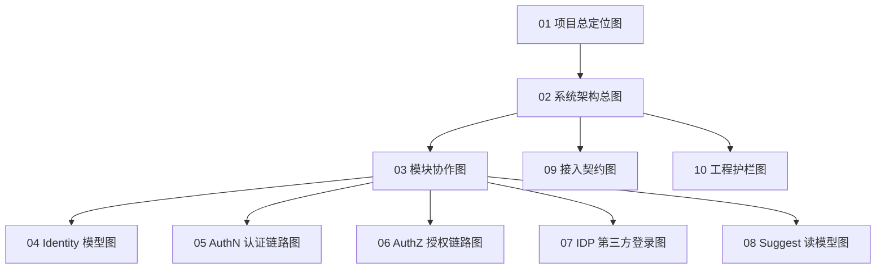

读图规则：

```text
先用项目总定位图建立“为什么需要 IAM”；
再用系统架构总图建立“系统怎么组织”；
再用模块协作图建立“五个模块如何配合”；
然后按模块分别展开局部图；
最后用接入契约图和工程护栏图收束到工程治理。
```

---

## 4. 图 1：项目总定位图

### 4.1 回答的问题

```text
IAM 到底是什么？
它在业务系统和身份/权限能力之间处于什么位置？
```

---

### 4.2 推荐图形

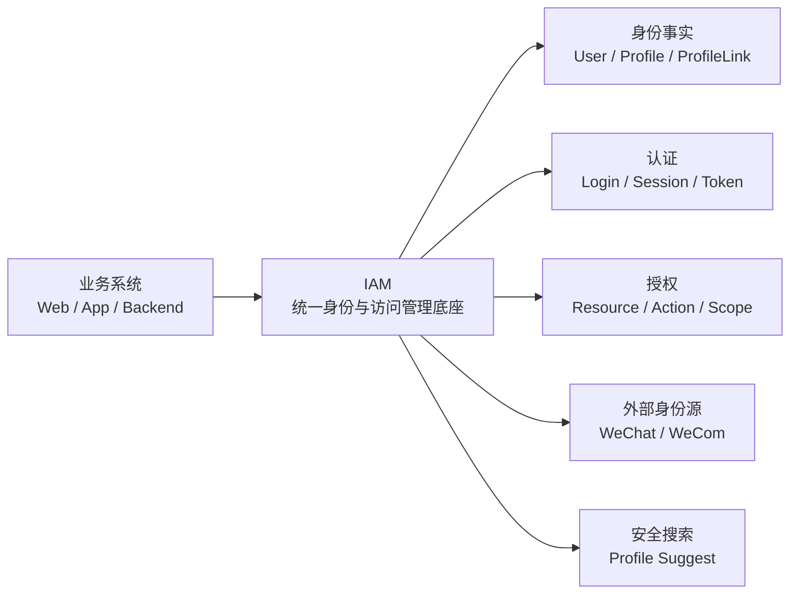

---

### 4.3 讲图话术

```text
这张图用来解释 IAM 的项目定位。业务系统不再各自实现用户关系、登录、Token、权限判断、微信身份解析和 Profile 搜索，而是统一接入 IAM。IAM 内部再按 Identity、AuthN、AuthZ、IDP、Suggest 拆分能力。
```

---

### 4.4 回链

| 内容 | 回链 |
| --- | --- |
| 项目一句话定位 | [01-项目一句话定位.md](01-项目一句话定位.md) |
| 30 分钟分享脚本 | [09-30分钟技术分享脚本.md](09-30分钟技术分享脚本.md) |
| 业务模块总览 | [../02-业务模块/README.md](../02-业务模块/README.md) |

---

## 5. 图 2：系统架构总图

### 5.1 回答的问题

```text
IAM 对外怎么接入？
内部如何分层？
业务模块放在哪一层讲？
```

---

### 5.2 推荐图形

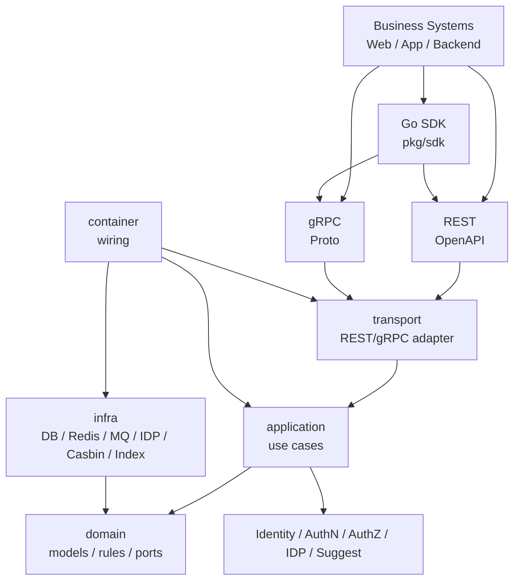

---

### 5.3 讲图话术

```text
这张图从外到内讲。外部有 REST、gRPC 和 Go SDK 三种接入方式；进入服务后 transport 做协议适配，application 编排用例，domain 表达模型和规则，infra 实现数据库、缓存、消息、provider、Casbin 和索引；container 只负责依赖装配。业务模块则贯穿 application/domain/infra，但对外统一通过接入契约暴露能力。
```

---

### 5.4 回链

| 内容 | 回链 |
| --- | --- |
| 系统架构讲法 | [02-系统架构讲法.md](02-系统架构讲法.md) |
| 分层依赖边界 | [../04-架构护栏/01-分层依赖边界.md](../04-架构护栏/01-分层依赖边界.md) |
| 接入契约总览 | [../03-接入与契约/README.md](../03-接入与契约/README.md) |

---

## 6. 图 3：模块协作图

### 6.1 回答的问题

```text
Identity、AuthN、AuthZ、IDP、Suggest 五个模块如何协作？
```

---

### 6.2 推荐图形

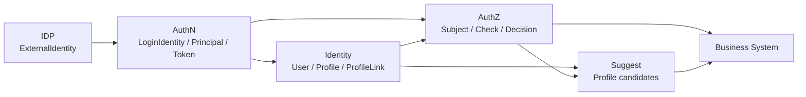

---

### 6.3 讲图话术

```text
这张图讲模块协作主线。IDP 负责解析外部身份事实，AuthN 使用这些事实完成登录并产出 Principal/Token，Identity 提供内部 User/Profile/ProfileLink 身份事实，AuthZ 基于 Subject/Resource/Action/Scope 做访问决策，Suggest 从 Identity facts 派生搜索读模型，并结合可见性过滤返回脱敏候选。
```

---

### 6.4 回链

| 内容 | 回链 |
| --- | --- |
| 业务模块总入口 | [../02-业务模块/README.md](../02-业务模块/README.md) |
| 系统架构讲法 | [02-系统架构讲法.md](02-系统架构讲法.md) |
| 30 分钟分享脚本 | [09-30分钟技术分享脚本.md](09-30分钟技术分享脚本.md) |

---

## 7. 图 4：Identity 模型图

### 7.1 回答的问题

```text
User、Profile、ProfileLink 是什么关系？
为什么 ProfileLink 不是 Permission？
```

---

### 7.2 推荐图形

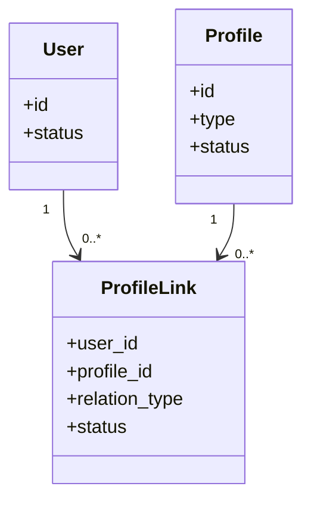

---

### 7.3 讲图话术

```text
Identity 只回答身份事实。User 是内部稳定身份主体，Profile 是业务档案或被服务对象，ProfileLink 表达 User 与 Profile 的关系。ProfileLink 可以作为 AuthZ 的事实输入，但它不是 Permission，不能直接推出 read、write、delete、export 等资源访问权。
```

---

### 7.4 回链

| 内容 | 回链 |
| --- | --- |
| Identity 讲法 | [03-Identity讲法.md](03-Identity讲法.md) |
| Identity 模块 | [../02-业务模块/01-Identity/README.md](../02-业务模块/01-Identity/README.md) |
| ProfileLink 专题 | [../05-专题设计/05-ProfileLink为什么不是Permission.md](../05-专题设计/05-ProfileLink为什么不是Permission.md) |

---

## 8. 图 5：AuthN 认证链路图

### 8.1 回答的问题

```text
登录认证如何从 LoginIdentity/Credential 变成 Principal/Session/Token？
```

---

### 8.2 推荐图形

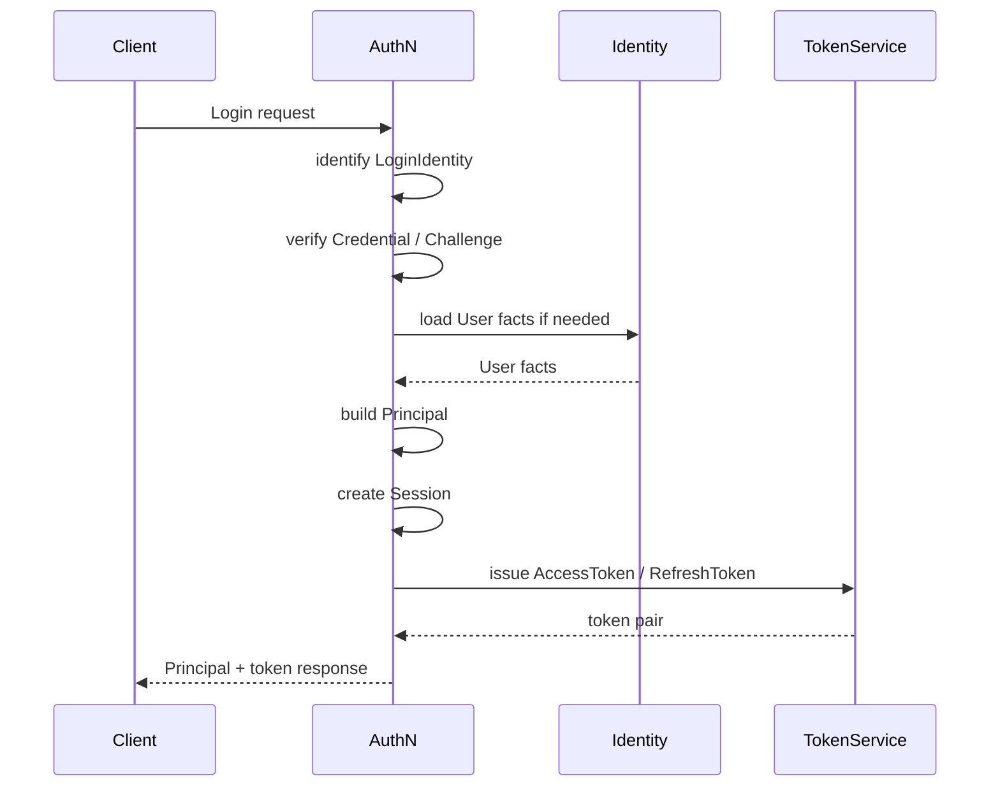

---

### 8.3 讲图话术

```text
AuthN 的主链路是：先识别 LoginIdentity，再校验 Credential 或 Challenge，认证成功后构造 Principal，创建 Session，最后签发 AccessToken 和 RefreshToken。AccessToken 用于普通 API，RefreshToken 只用于续期，验签成功仍然不等于授权通过。
```

---

### 8.4 回链

| 内容 | 回链 |
| --- | --- |
| AuthN 讲法 | [04-AuthN讲法.md](04-AuthN讲法.md) |
| AuthN 模块 | [../02-业务模块/02-AuthN/README.md](../02-业务模块/02-AuthN/README.md) |
| Session/双 Token 专题 | [../05-专题设计/02-Session-AccessToken-RefreshToken边界.md](../05-专题设计/02-Session-AccessToken-RefreshToken边界.md) |
| JWT/JWKS 专题 | [../05-专题设计/01-JWT-JWS-JWK-JWKS-KeyRotation.md](../05-专题设计/01-JWT-JWS-JWK-JWKS-KeyRotation.md) |

---

## 9. 图 6：AuthZ 授权链路图

### 9.1 回答的问题

```text
认证后的 Principal 如何进入授权决策？
```

---

### 9.2 推荐图形

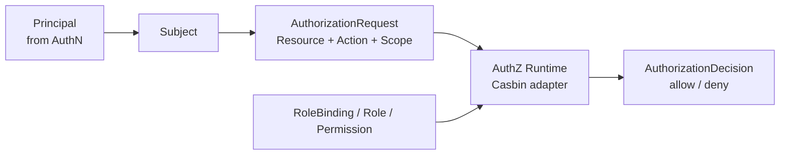

---

### 9.3 讲图话术

```text
AuthZ 的关键是把“你是谁”和“你能做什么”分开。AuthN 产出 Principal，AuthZ 映射成 Subject，再结合 Resource、Action、Scope 和当前 RoleBinding/Permission 策略做 Check，最后返回 allow 或 deny。Casbin 可以做 runtime engine，但不是领域模型。
```

---

### 9.4 回链

| 内容 | 回链 |
| --- | --- |
| AuthZ 讲法 | [05-AuthZ讲法.md](05-AuthZ讲法.md) |
| AuthZ 模块 | [../02-业务模块/03-AuthZ/README.md](../02-业务模块/03-AuthZ/README.md) |
| Casbin 专题 | [../05-专题设计/04-Casbin在AuthZ中的定位.md](../05-专题设计/04-Casbin在AuthZ中的定位.md) |

---

## 10. 图 7：PolicyVersion / Outbox / RuntimeReload 图

### 10.1 回答的问题

```text
授权事实变化后，runtime 如何感知？
```

---

### 10.2 推荐图形

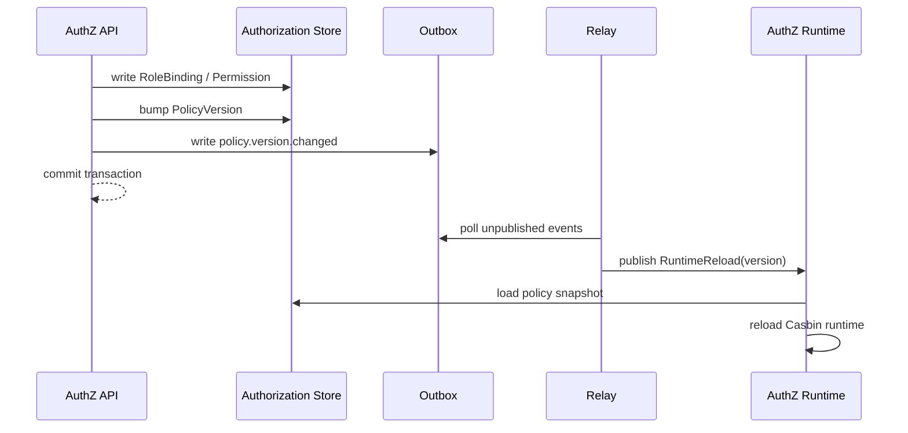

---

### 10.3 讲图话术

```text
授权写入不是直接修改 Casbin 内存，而是先写授权事实并 bump PolicyVersion，同时在本地事务内写 OutboxEvent。Relay 再异步发布 RuntimeReload，AuthZ runtime 根据版本加载新的策略快照。这个链路选择的是本地事务强一致、跨系统最终一致，消费者必须按 version 幂等。
```

---

### 10.4 回链

| 内容 | 回链 |
| --- | --- |
| AuthZ 讲法 | [05-AuthZ讲法.md](05-AuthZ讲法.md) |
| PolicyVersion / Outbox | [../02-业务模块/03-AuthZ/04-关键链路-授权版本传播PolicyVersion-Outbox-RuntimeReload.md](../02-业务模块/03-AuthZ/04-关键链路-授权版本传播PolicyVersion-Outbox-RuntimeReload.md) |
| Outbox 专题 | [../05-专题设计/03-Transactional-Outbox设计.md](../05-专题设计/03-Transactional-Outbox设计.md) |

---

## 11. 图 8：IDP 第三方登录图

### 11.1 回答的问题

```text
微信/企业微信外部身份如何进入 IAM 内部登录态？
```

---

### 11.2 推荐图形

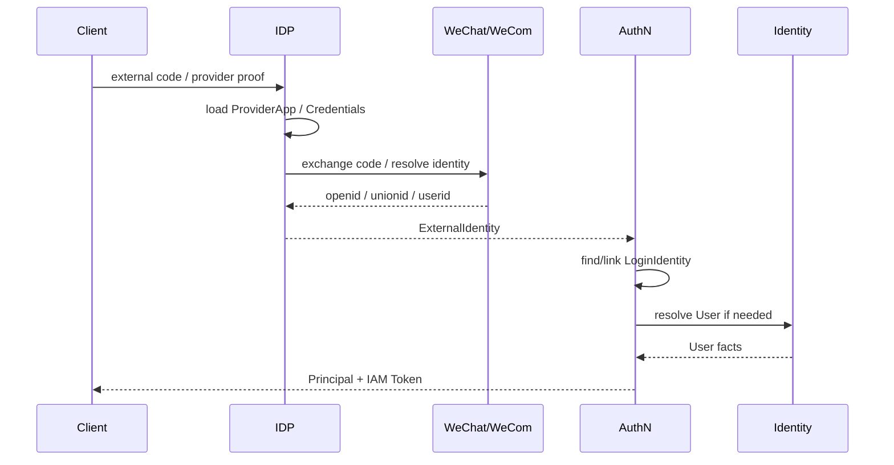

---

### 11.3 讲图话术

```text
IDP 只负责解析外部 provider 说了什么，比如 openid、unionid、wecom userid。ExternalIdentity 不是内部登录态。AuthN 才负责把 ExternalIdentity 映射到 LoginIdentity/User，并签发 IAM AccessToken/RefreshToken。provider access_token 不是 IAM AccessToken。
```

---

### 11.4 回链

| 内容 | 回链 |
| --- | --- |
| IDP 讲法 | [06-IDP与第三方登录讲法.md](06-IDP与第三方登录讲法.md) |
| IDP 模块 | [../02-业务模块/04-IDP/README.md](../02-业务模块/04-IDP/README.md) |
| AuthN 讲法 | [04-AuthN讲法.md](04-AuthN讲法.md) |

---

## 12. 图 9：Suggest 读模型图

### 12.1 回答的问题

```text
Profile 联想搜索为什么是读模型？
查询为什么要先过滤再截断？
```

---

### 12.2 推荐图形

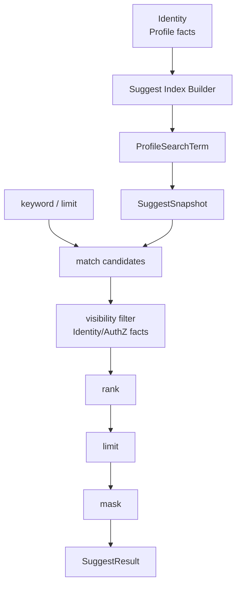

---

### 12.3 讲图话术

```text
Suggest 从 Identity 的 Profile facts 派生 ProfileSearchTerm 和 SuggestSnapshot。查询时 keyword 先命中候选，但候选不能直接返回，必须先做可见性过滤，再排序、截断和脱敏。手机号搜索只能扩大匹配方式，不能扩大可见范围，返回结果只能是脱敏候选。
```

---

### 12.4 回链

| 内容 | 回链 |
| --- | --- |
| Suggest 讲法 | [07-Suggest读模型讲法.md](07-Suggest读模型讲法.md) |
| Suggest 模块 | [../02-业务模块/05-Suggest/README.md](../02-业务模块/05-Suggest/README.md) |
| Suggest 读模型专题 | [../05-专题设计/06-Suggest为什么是读模型.md](../05-专题设计/06-Suggest为什么是读模型.md) |

---

## 13. 图 10：接入契约图

### 13.1 回答的问题

```text
业务系统通过什么方式接入 IAM？
OpenAPI、proto、SDK 分别是什么事实源？
```

---

### 13.2 推荐图形

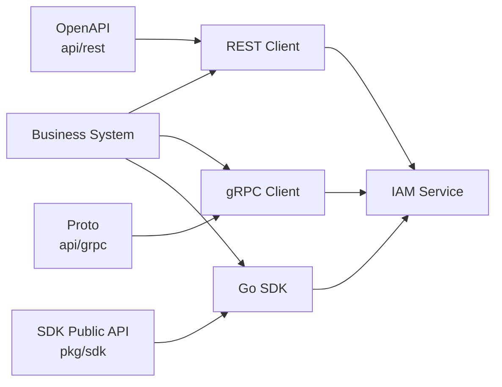

---

### 13.3 讲图话术

```text
REST 的机器契约是 OpenAPI，gRPC 的机器契约是 proto，Go SDK 的事实源是 pkg/sdk public API。文档只解释语义和边界，不反向定义接口字段。业务系统不直接访问 IAM 数据库，而是通过 REST、gRPC 或 SDK 接入。
```

---

### 13.4 回链

| 内容 | 回链 |
| --- | --- |
| 接入契约总览 | [../03-接入与契约/README.md](../03-接入与契约/README.md) |
| REST 接入 | [../03-接入与契约/01-REST接入契约.md](../03-接入与契约/01-REST接入契约.md) |
| gRPC 接入 | [../03-接入与契约/02-gRPC接入契约.md](../03-接入与契约/02-gRPC接入契约.md) |
| Go SDK | [../03-接入与契约/03-Go-SDK接入模型.md](../03-接入与契约/03-Go-SDK接入模型.md) |

---

## 14. 图 11：工程护栏图

### 14.1 回答的问题

```text
IAM 如何防止分层、契约、SDK 和文档长期漂移？
```

---

### 14.2 推荐图形

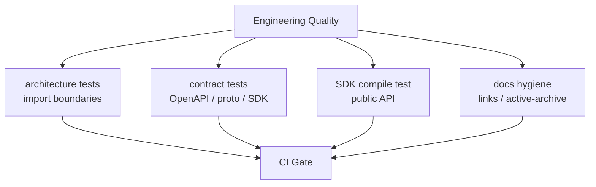

---

### 14.3 讲图话术

```text
工程质量不是只靠自觉或 code review，而是把关键边界固化成测试和 CI。architecture tests 保护分层依赖，contract tests 保护 OpenAPI/proto/SDK 与实现一致，SDK compile test 保护外部 Go 调用面，docs hygiene 保护文档入口和事实源。
```

---

### 14.4 回链

| 内容 | 回链 |
| --- | --- |
| 工程质量讲法 | [08-工程质量与架构护栏讲法.md](08-工程质量与架构护栏讲法.md) |
| 架构护栏总览 | [../04-架构护栏/README.md](../04-架构护栏/README.md) |
| 架构测试 | [../04-架构护栏/02-架构测试.md](../04-架构护栏/02-架构测试.md) |
| 契约测试 | [../04-架构护栏/03-契约测试.md](../04-架构护栏/03-契约测试.md) |

---

## 15. 30 分钟分享推荐配图顺序

| 时间 | 图 | 目的 |
| --- | --- | --- |
| 0-3 分钟 | 项目总定位图 | 解释 IAM 是什么 |
| 3-7 分钟 | 系统架构总图 | 解释接入、分层、模块 |
| 7-10 分钟 | Identity 模型图 | 解释 User/Profile/ProfileLink |
| 10-13 分钟 | AuthN 认证链路图 | 解释认证和 Token |
| 13-15 分钟 | AuthZ 授权链路图 | 解释授权决策 |
| 15-17 分钟 | IDP 第三方登录图 | 解释外部身份源 |
| 17-19 分钟 | Suggest 读模型图 | 解释搜索读模型 |
| 19-23 分钟 | 接入契约图 | 解释 REST/gRPC/SDK |
| 23-27 分钟 | 工程护栏图 | 解释质量治理 |
| 27-30 分钟 | 模块协作图 | 收束全局主线 |

---

## 16. 画图原则

### 16.1 每张图只回答一个问题

推荐：

```text
AuthN 图只讲认证链路；
AuthZ 图只讲授权决策；
Suggest 图只讲读模型查询；
工程护栏图只讲质量治理。
```

不推荐：

```text
一张图塞完所有模块、所有表、所有接口、所有部署节点。
```

---

### 16.2 图中只放宣讲需要的对象

推荐：

```text
讲 Identity 时放 User / Profile / ProfileLink；
讲 AuthZ 时放 Subject / Resource / Action / Scope / Permission；
讲 Suggest 时放 ProfileSearchTerm / Snapshot / VisibilityFilter / SuggestResult。
```

不推荐：

```text
为了显得完整，把所有字段、所有 repository、所有 handler 都画进去。
```

---

### 16.3 图和话术必须一致

```text
图里出现的每个名词，都应该能在宣讲稿里解释；
宣讲稿强调的边界，图里不能画反；
图里的箭头应该代表依赖、调用或事实流，不能混用。
```

---

## 17. 旧入口处理说明

旧骨架中引用过以下入口：

```text
../02-业务模块/00-模块协作总图.md
../02-业务模块/01-Identity/02-领域模型图.md
../02-业务模块/02-AuthN/02-领域模型图.md
../02-业务模块/03-AuthZ/02-领域模型图.md
../02-业务模块/04-IDP/02-领域模型图.md
../02-业务模块/05-Suggest/02-领域模型图.md
```

当前宣讲目录不再直接依赖这些旧入口作为当前事实源。

原因：

```text
02-业务模块/00-模块协作总图.md 已合并进 02-业务模块/README.md；
AuthN/AuthZ 旧 02-领域模型图.md 的内容已被合并进新的领域模型主文档；
Suggest 当前主文档已改为 01-领域模型-ProfileSearchTerm-ProfileAccessScope-Snapshot.md；
宣讲层应回链到 README、模块主文档、专题设计和当前讲法文档，而不是旧骨架文件。
```

如果本地仍保留旧文件，可以：

```text
将旧文件改成跳转页；
或在确认无引用后删除；
删除后同步运行 make docs-hygiene。
```

---

## 18. 事实源回链总表

| 图 | 主要事实源 |
| --- | --- |
| 项目总定位图 | [01-项目一句话定位.md](01-项目一句话定位.md) |
| 系统架构总图 | [02-系统架构讲法.md](02-系统架构讲法.md) |
| 模块协作图 | [../02-业务模块/README.md](../02-业务模块/README.md) |
| Identity 模型图 | [03-Identity讲法.md](03-Identity讲法.md) |
| AuthN 认证链路图 | [04-AuthN讲法.md](04-AuthN讲法.md) |
| AuthZ 授权链路图 | [05-AuthZ讲法.md](05-AuthZ讲法.md) |
| IDP 第三方登录图 | [06-IDP与第三方登录讲法.md](06-IDP与第三方登录讲法.md) |
| Suggest 读模型图 | [07-Suggest读模型讲法.md](07-Suggest读模型讲法.md) |
| 接入契约图 | [../03-接入与契约/README.md](../03-接入与契约/README.md) |
| 工程护栏图 | [08-工程质量与架构护栏讲法.md](08-工程质量与架构护栏讲法.md) |
| 30 分钟分享配图 | [09-30分钟技术分享脚本.md](09-30分钟技术分享脚本.md) |

---

## 19. Verify

修改本文后至少执行：

```bash
make docs-hygiene
```

如果同步调整 Mermaid 图或其他宣讲文件，也执行：

```bash
make docs-hygiene
```

如果同步修改接入契约、架构护栏或代码事实源，按影响范围执行：

```bash
make api-validate
make proto-gen
go test ./internal/pkg/architecture
go test ./pkg/sdk/...
```

---

## 20. 本文总结

架构图素材可以压缩成 4 类：

```text
总览图：项目总定位图、系统架构总图、模块协作图；
模块图：Identity、AuthN、AuthZ、IDP、Suggest；
接入图：REST / gRPC / Go SDK 契约图；
治理图：工程护栏图。
```

宣讲时最重要的是：

```text
图服务于表达，不服务于堆细节；
每张图只回答一个问题；
图里的每个箭头都要能说清含义；
图的事实源要回链到当前 active 文档；
不要继续依赖已合并或旧骨架文档作为当前事实源。
```
