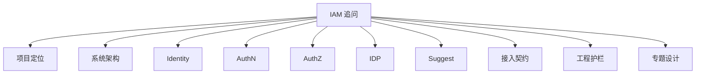

# 追问回链证据索引

> 状态：规划改造 · 已完成当前事实盘点；正文仍含待实现或尚未收敛的设计内容，不得作为现有能力承诺。

---

## 1. 本文目标

本文用于准备 IAM 宣讲后的追问回答。

它回答：

```text
面试官或评审可能追问什么？
每个追问应该怎么回答？
回答应该回链到哪篇文档作为证据？
哪些问题适合展开成技术深讲？
哪些问题只需要边界澄清？
```

本文不是完整答案库，而是追问导航表。

使用方式：

```text
先用 30 秒回答稳定结论；
再根据对方追问深度展开一层；
最后回链到对应 active 文档；
不要把未实现能力说成已实现；
不要引用旧骨架或 archive 文档作为当前事实源。
```

---

## 2. 30 秒结论

IAM 追问可以归为 8 类：

| 类别 | 核心问题 | 首选回链 |
| --- | --- | --- |
| 项目定位 | IAM 为什么不是普通用户中心？ | [01-项目一句话定位.md](01-项目一句话定位.md) |
| 系统架构 | 系统如何分层、模块如何协作？ | [02-系统架构讲法.md](02-系统架构讲法.md) |
| Identity | User / Profile / ProfileLink 如何建模？ | [03-Identity讲法.md](03-Identity讲法.md) |
| AuthN | 登录认证、Session、Token、JWKS 如何设计？ | [04-AuthN讲法.md](04-AuthN讲法.md) |
| AuthZ | 授权模型、Casbin、PolicyVersion 如何设计？ | [05-AuthZ讲法.md](05-AuthZ讲法.md) |
| IDP | 第三方登录和外部身份源如何接入？ | [06-IDP与第三方登录讲法.md](06-IDP与第三方登录讲法.md) |
| Suggest | 为什么 Suggest 是读模型？ | [07-Suggest读模型讲法.md](07-Suggest读模型讲法.md) |
| 工程质量 | 如何防止架构和契约漂移？ | [08-工程质量与架构护栏讲法.md](08-工程质量与架构护栏讲法.md) |

最重要的追问回答原则：

```text
先答边界，再答链路，再答取舍，最后给事实源。
```

---

## 3. 追问地图



读图规则：

```text
项目定位类追问先回答“为什么做 IAM”；
架构类追问回答“为什么这么拆”；
模块类追问回答“对象、链路、边界”；
专题类追问回答“设计取舍”；
接入和护栏类追问回答“如何工程化落地”。
```

---

## 4. 项目定位类追问

### 4.1 IAM 为什么不是普通用户中心？

30 秒回答：

```text
普通用户中心通常只解决用户资料和账号管理，而 IAM 解决的是身份与访问管理。它不仅管理 User/Profile/ProfileLink 这些身份事实，还负责 AuthN 登录认证、AuthZ 资源授权、IDP 外部身份源接入和 Suggest 安全搜索。也就是说，它不是单表 CRUD，而是统一身份事实、认证、授权和接入契约的基础设施。
```

可展开点：

```text
Identity 管身份事实；
AuthN 管认证；
AuthZ 管授权；
IDP 管外部身份源；
Suggest 管搜索读模型；
REST/gRPC/Go SDK 管业务系统接入。
```

证据回链：

| 证据 | 回链 |
| --- | --- |
| 项目定位 | [01-项目一句话定位.md](01-项目一句话定位.md) |
| 系统架构 | [02-系统架构讲法.md](02-系统架构讲法.md) |
| 业务模块总览 | [../02-业务模块/README.md](../02-业务模块/README.md) |

---

### 4.2 IAM 解决的核心问题是什么？

30 秒回答：

```text
它解决业务系统身份与权限能力分散的问题。没有 IAM 时，用户关系、微信登录、Token、权限判断、搜索脱敏等能力会散落在不同业务系统里，导致身份事实不统一、认证授权混杂、外部身份源难治理、权限规则难维护。IAM 的目标是把这些能力统一成可复用、可治理、可接入的基础服务。
```

证据回链：

| 证据 | 回链 |
| --- | --- |
| 项目一句话定位 | [01-项目一句话定位.md](01-项目一句话定位.md) |
| 30 分钟分享脚本 | [09-30分钟技术分享脚本.md](09-30分钟技术分享脚本.md) |

---

## 5. 系统架构类追问

### 5.1 模块为什么拆成 Identity / AuthN / AuthZ / IDP / Suggest？

30 秒回答：

```text
因为它们回答的是不同问题。Identity 回答“用户是谁、档案是什么、关系是什么”；AuthN 回答“当前请求者如何证明自己是谁”；AuthZ 回答“这个主体能不能访问这个资源”；IDP 回答“外部 provider 说了什么”；Suggest 回答“当前请求者能搜索到哪些候选 Profile”。这些问题如果混在一起，会导致身份事实、认证过程、授权策略和搜索读模型相互污染。
```

证据回链：

| 证据 | 回链 |
| --- | --- |
| 系统架构讲法 | [02-系统架构讲法.md](02-系统架构讲法.md) |
| 业务模块总览 | [../02-业务模块/README.md](../02-业务模块/README.md) |
| 架构图素材 | [10-架构图素材索引.md](10-架构图素材索引.md) |

---

### 5.2 为什么要做分层架构？

30 秒回答：

```text
分层是为了隔离协议、用例、领域规则和技术实现。transport 只处理 REST/gRPC 协议适配；application 编排用例和事务；domain 表达模型和不变量；infra 实现数据库、缓存、MQ、Casbin、provider adapter、搜索索引等技术细节；container 只做依赖装配。这样可以避免 handler 里堆业务逻辑，也避免 domain 被数据库、proto、Casbin 这些技术细节污染。
```

证据回链：

| 证据 | 回链 |
| --- | --- |
| 系统架构讲法 | [02-系统架构讲法.md](02-系统架构讲法.md) |
| 分层依赖边界 | [../04-架构护栏/01-分层依赖边界.md](../04-架构护栏/01-分层依赖边界.md) |
| 架构测试 | [../04-架构护栏/02-架构测试.md](../04-架构护栏/02-架构测试.md) |

---

### 5.3 这个项目最值得讲的架构亮点是什么？

30 秒回答：

```text
我会优先讲三类亮点：第一是 Identity/AuthN/AuthZ 的边界分离，体现领域拆分；第二是 Token/JWKS、Session/RefreshToken、AuthZ/Casbin/Outbox、Suggest 读模型这些专题设计，体现安全和一致性取舍；第三是 architecture tests、contract tests、SDK compile test、docs hygiene 这些工程护栏，体现长期演进治理能力。
```

证据回链：

| 证据 | 回链 |
| --- | --- |
| 项目一句话定位 | [01-项目一句话定位.md](01-项目一句话定位.md) |
| 系统架构讲法 | [02-系统架构讲法.md](02-系统架构讲法.md) |
| 专题设计总览 | [../05-专题设计/README.md](../05-专题设计/README.md) |
| 工程质量讲法 | [08-工程质量与架构护栏讲法.md](08-工程质量与架构护栏讲法.md) |

---

## 6. Identity 类追问

### 6.1 User / Profile / ProfileLink 有什么区别？

30 秒回答：

```text
User 是内部稳定身份主体，Profile 是业务档案或被服务对象，ProfileLink 是 User 和 Profile 之间的身份关系。比如家长是 User，儿童档案是 Profile，监护关系是 ProfileLink。这里最重要的是 ProfileLink 只表达关系事实，不表达资源访问权限。
```

证据回链：

| 证据 | 回链 |
| --- | --- |
| Identity 讲法 | [03-Identity讲法.md](03-Identity讲法.md) |
| Identity 模块 | [../02-业务模块/01-Identity/README.md](../02-业务模块/01-Identity/README.md) |
| ProfileLink 专题 | [../05-专题设计/05-ProfileLink为什么不是Permission.md](../05-专题设计/05-ProfileLink为什么不是Permission.md) |

---

### 6.2 为什么 ProfileLink 不是 Permission？

30 秒回答：

```text
ProfileLink 是身份关系事实，Permission 是资源访问权声明。ProfileLink 只能说明“这个用户和这个档案有什么关系”，不能直接说明“这个用户可以读取、修改、删除或导出哪些资源”。真正的资源访问要进入 AuthZ，用 Subject、Resource、Action、Scope 做 Check。
```

可展开点：

```text
ProfileLink 可作为 AuthZ 的事实输入；
但不能替代 RoleBinding；
不能替代 Permission；
不能直接写成 Casbin g rule；
不能推出所有操作都允许。
```

证据回链：

| 证据 | 回链 |
| --- | --- |
| ProfileLink 专题 | [../05-专题设计/05-ProfileLink为什么不是Permission.md](../05-专题设计/05-ProfileLink为什么不是Permission.md) |
| Identity 讲法 | [03-Identity讲法.md](03-Identity讲法.md) |
| AuthZ 讲法 | [05-AuthZ讲法.md](05-AuthZ讲法.md) |

---

### 6.3 openid / unionid 能不能直接当 UserID？

30 秒回答：

```text
不建议。openid、unionid 是外部 provider 侧标识，不应该污染内部身份主键。正确链路是 IDP 解析 ExternalIdentity，AuthN 根据 ExternalIdentity 绑定或查找 LoginIdentity，再映射到内部 User。这样一个 User 可以绑定多个登录身份，也能避免 provider 变化影响内部身份模型。
```

证据回链：

| 证据 | 回链 |
| --- | --- |
| IDP 讲法 | [06-IDP与第三方登录讲法.md](06-IDP与第三方登录讲法.md) |
| AuthN 讲法 | [04-AuthN讲法.md](04-AuthN讲法.md) |
| Identity 讲法 | [03-Identity讲法.md](03-Identity讲法.md) |

---

## 7. AuthN 类追问

### 7.1 AuthN 怎么签发 Token？

30 秒回答：

```text
AuthN 会先识别 LoginIdentity，再校验 Credential 或 Challenge。认证成功后构造 Principal，创建 Session，然后签发 AccessToken 和 RefreshToken。AccessToken 用于普通 API 访问，RefreshToken 只用于续期。AccessToken 如果是 JWT/JWS，可以通过 JWKS 发布公钥给业务系统本地验签。
```

证据回链：

| 证据 | 回链 |
| --- | --- |
| AuthN 讲法 | [04-AuthN讲法.md](04-AuthN讲法.md) |
| Token 签发刷新吊销 | [../02-业务模块/02-AuthN/05-关键链路-Token签发刷新吊销.md](../02-业务模块/02-AuthN/05-关键链路-Token签发刷新吊销.md) |
| JWKS 与本地验签 | [../02-业务模块/02-AuthN/06-关键链路-JWKS与本地验签.md](../02-业务模块/02-AuthN/06-关键链路-JWKS与本地验签.md) |

---

### 7.2 AccessToken 和 RefreshToken 为什么要分开？

30 秒回答：

```text
它们风险和用途不同。AccessToken 是短期访问凭证，进入普通业务 API；RefreshToken 是续期凭证，生命周期更长，只能进入 refresh/logout/revoke 等 AuthN 链路，不能进入普通业务 API。这样可以在兼顾用户体验的同时降低长期凭证暴露面，并支持服务端吊销和重放检测。
```

证据回链：

| 证据 | 回链 |
| --- | --- |
| AuthN 讲法 | [04-AuthN讲法.md](04-AuthN讲法.md) |
| Session/双 Token 专题 | [../05-专题设计/02-Session-AccessToken-RefreshToken边界.md](../05-专题设计/02-Session-AccessToken-RefreshToken边界.md) |

---

### 7.3 JWKS 解决什么问题？

30 秒回答：

```text
JWKS 用来发布 AccessToken 验签公钥。AuthN 用私钥签名 JWT/JWS，业务系统通过 JWKS 按 kid 获取公钥并本地验签，这样普通 API 不需要每次请求 AuthN 校验 Token，能降低认证中心运行时压力。但 JWKS 只发布公钥，验签成功也只代表认证通过，不代表授权通过。
```

证据回链：

| 证据 | 回链 |
| --- | --- |
| JWT/JWKS 专题 | [../05-专题设计/01-JWT-JWS-JWK-JWKS-KeyRotation.md](../05-专题设计/01-JWT-JWS-JWK-JWKS-KeyRotation.md) |
| JWKS 与本地验签 | [../02-业务模块/02-AuthN/06-关键链路-JWKS与本地验签.md](../02-业务模块/02-AuthN/06-关键链路-JWKS与本地验签.md) |
| AuthN 讲法 | [04-AuthN讲法.md](04-AuthN讲法.md) |

---

### 7.4 Token 验签成功是不是就有权限？

30 秒回答：

```text
不是。Token 验签成功只说明这个 AccessToken 可信，当前请求者已经通过认证。资源访问仍然要进入 AuthZ，用 Subject、Resource、Action、Scope 做 Check。认证回答“你是谁”，授权回答“你能做什么”。
```

证据回链：

| 证据 | 回链 |
| --- | --- |
| AuthN 讲法 | [04-AuthN讲法.md](04-AuthN讲法.md) |
| AuthZ 讲法 | [05-AuthZ讲法.md](05-AuthZ讲法.md) |
| JWT/JWKS 专题 | [../05-专题设计/01-JWT-JWS-JWK-JWKS-KeyRotation.md](../05-专题设计/01-JWT-JWS-JWK-JWKS-KeyRotation.md) |

---

## 8. AuthZ 类追问

### 8.1 为什么不是 user.role == admin？

30 秒回答：

```text
因为真实授权不是只有全局角色，还需要表达谁在什么范围内，对什么资源，执行什么动作。AuthZ 把它拆成 Subject、Resource、Action、Scope、Role、Permission、RoleBinding。这样能区分 read、export、delete 等不同风险动作，也能把权限限定在家庭、机构、项目或租户范围内，避免全局过度授权。
```

证据回链：

| 证据 | 回链 |
| --- | --- |
| AuthZ 讲法 | [05-AuthZ讲法.md](05-AuthZ讲法.md) |
| AuthZ 领域模型 | [../02-业务模块/03-AuthZ/01-领域模型-Subject-Resource-Action-Scope-Role-Permission-RoleBinding.md](../02-业务模块/03-AuthZ/01-领域模型-Subject-Resource-Action-Scope-Role-Permission-RoleBinding.md) |
| 权限检查链路 | [../02-业务模块/03-AuthZ/02-关键链路-权限检查Check.md](../02-业务模块/03-AuthZ/02-关键链路-权限检查Check.md) |

---

### 8.2 Subject 和 User 有什么区别？

30 秒回答：

```text
User 是 Identity 中的内部身份事实，Subject 是 AuthZ 中的授权主体。一个 User 通常可以映射成 Subject，但二者不是同一个概念。Principal 经过认证后，可以根据授权域、组织、服务关系等上下文映射为 Subject，再参与 Resource/Action/Scope 的授权判断。
```

证据回链：

| 证据 | 回链 |
| --- | --- |
| AuthZ 讲法 | [05-AuthZ讲法.md](05-AuthZ讲法.md) |
| Identity 讲法 | [03-Identity讲法.md](03-Identity讲法.md) |
| AuthN 讲法 | [04-AuthN讲法.md](04-AuthN讲法.md) |

---

### 8.3 Casbin 在项目中是什么角色？

30 秒回答：

```text
Casbin 是 AuthZ 的 infra runtime engine，不是 AuthZ 的领域模型。领域层仍然用 Subject、Role、Permission、RoleBinding、Resource、Action、Scope 这些业务语言；infra adapter 再把领域授权事实映射为 Casbin 的 p/g/r rules。这样不会让 domain 被 Casbin 的运行时表达污染。
```

证据回链：

| 证据 | 回链 |
| --- | --- |
| Casbin 专题 | [../05-专题设计/04-Casbin在AuthZ中的定位.md](../05-专题设计/04-Casbin在AuthZ中的定位.md) |
| AuthZ 讲法 | [05-AuthZ讲法.md](05-AuthZ讲法.md) |
| AuthZ 模块 | [../02-业务模块/03-AuthZ/README.md](../02-业务模块/03-AuthZ/README.md) |

---

### 8.4 AuthZ 写入为什么复杂？

30 秒回答：

```text
因为授权写入不只是写一条 RoleBinding，还要让运行时策略最终感知变化。正确链路是写授权事实、bump PolicyVersion、同事务写 OutboxEvent，事务提交后由 Relay 发布 RuntimeReload，AuthZ runtime 再加载新策略快照。Outbox 解决的是授权事实写入和版本变化事件发布之间的双写一致性。
```

证据回链：

| 证据 | 回链 |
| --- | --- |
| 授权写入链路 | [../02-业务模块/03-AuthZ/03-关键链路-授权写入Grant-Revoke-Bind-Unbind.md](../02-业务模块/03-AuthZ/03-关键链路-授权写入Grant-Revoke-Bind-Unbind.md) |
| PolicyVersion / Outbox | [../02-业务模块/03-AuthZ/04-关键链路-授权版本传播PolicyVersion-Outbox-RuntimeReload.md](../02-业务模块/03-AuthZ/04-关键链路-授权版本传播PolicyVersion-Outbox-RuntimeReload.md) |
| Outbox 专题 | [../05-专题设计/03-Transactional-Outbox设计.md](../05-专题设计/03-Transactional-Outbox设计.md) |
| AuthZ 讲法 | [05-AuthZ讲法.md](05-AuthZ讲法.md) |

---

## 9. IDP 类追问

### 9.1 IDP 和 AuthN 有什么区别？

30 秒回答：

```text
IDP 负责解析外部身份事实，AuthN 负责生成内部登录态。比如微信登录时，IDP 用 code 调微信接口，解析出 openid/unionid，并包装成 ExternalIdentity；AuthN 再根据 ExternalIdentity 查找或绑定 LoginIdentity，生成 Principal、Session、AccessToken 和 RefreshToken。
```

证据回链：

| 证据 | 回链 |
| --- | --- |
| IDP 讲法 | [06-IDP与第三方登录讲法.md](06-IDP与第三方登录讲法.md) |
| IDP 模块 | [../02-业务模块/04-IDP/README.md](../02-业务模块/04-IDP/README.md) |
| 外部身份解析与 AuthN 协作 | [../02-业务模块/04-IDP/04-关键链路-外部身份解析与AuthN协作.md](../02-业务模块/04-IDP/04-关键链路-外部身份解析与AuthN协作.md) |

---

### 9.2 微信 access_token 是不是 IAM AccessToken？

30 秒回答：

```text
不是。微信 access_token 是 IAM 或服务端调用微信 API 用的 provider token；IAM AccessToken 是 AuthN 签发给业务系统访问 IAM/业务 API 的访问凭证。二者来源、用途、生命周期和安全边界都不同，不能混用。
```

证据回链：

| 证据 | 回链 |
| --- | --- |
| IDP 讲法 | [06-IDP与第三方登录讲法.md](06-IDP与第三方登录讲法.md) |
| AuthN 讲法 | [04-AuthN讲法.md](04-AuthN讲法.md) |
| JWT/JWKS 专题 | [../05-专题设计/01-JWT-JWS-JWK-JWKS-KeyRotation.md](../05-专题设计/01-JWT-JWS-JWK-JWKS-KeyRotation.md) |

---

## 10. Suggest 类追问

### 10.1 Suggest 为什么是读模型？

30 秒回答：

```text
因为 Suggest 不维护 Profile 主数据，只从 Identity 的 Profile facts 派生搜索 token 和 ProfileSuggestionIndex，用于 keyword 搜索、排序、可见性过滤和脱敏展示。它可以重建、可以最终一致、可以保守降级，不应该污染 Identity 的写模型和关系不变量。
```

证据回链：

| 证据 | 回链 |
| --- | --- |
| Suggest 讲法 | [07-Suggest读模型讲法.md](07-Suggest读模型讲法.md) |
| Suggest 读模型专题 | [../05-专题设计/06-Suggest为什么是读模型.md](../05-专题设计/06-Suggest为什么是读模型.md) |
| Suggest 模块 | [../02-业务模块/05-Suggest/README.md](../02-业务模块/05-Suggest/README.md) |

---

### 10.2 搜索命中是不是就能看详情？

30 秒回答：

```text
不是。搜索命中只是候选召回，必须先做 ProfileAccessScope 和可见性过滤，再脱敏返回 ProfileSuggestItem。即使候选可见，也不代表有详情读取、修改或导出权限。后续详情接口仍然要用 Resource、Action、Scope 重新走 AuthZ Check。
```

证据回链：

| 证据 | 回链 |
| --- | --- |
| Suggest 讲法 | [07-Suggest读模型讲法.md](07-Suggest读模型讲法.md) |
| SuggestProfile 查询链路 | [../02-业务模块/05-Suggest/03-关键链路-SuggestProfile查询.md](../02-业务模块/05-Suggest/03-关键链路-SuggestProfile查询.md) |
| AuthZ 讲法 | [05-AuthZ讲法.md](05-AuthZ讲法.md) |

---

### 10.3 手机号搜索如何保证安全？

30 秒回答：

```text
手机号搜索只能扩大匹配方式，不能扩大可见范围。当前实现使用原始手机号精确 Hash 匹配，配合额外搜索权限、scope 过滤、限流和输出脱敏；响应只返回 mobile_mask。手机号 hash/后缀 token 与持久化安全审计仍是可选改进，不是已实现能力。
```

证据回链：

| 证据 | 回链 |
| --- | --- |
| Suggest 讲法 | [07-Suggest读模型讲法.md](07-Suggest读模型讲法.md) |
| 查询与手机号安全策略 | [../02-业务模块/05-Suggest/03-关键链路-SuggestProfile查询.md](../02-业务模块/05-Suggest/03-关键链路-SuggestProfile查询.md) |
| Suggest 读模型专题 | [../05-专题设计/06-Suggest为什么是读模型.md](../05-专题设计/06-Suggest为什么是读模型.md) |

---

## 11. 接入契约类追问

### 11.1 REST、gRPC、Go SDK 分别适合什么场景？

30 秒回答：

```text
REST 适合 Web、App、管理端和跨语言 HTTP 调用；gRPC 适合内部可信服务间调用；Go SDK 适合 Go 业务服务快速接入 IAM。REST 的机器契约是 OpenAPI，gRPC 的机器契约是 proto，Go SDK 的 public API 是 SDK 事实源。
```

证据回链：

| 证据 | 回链 |
| --- | --- |
| 接入契约总览 | [../03-接入与契约/README.md](../03-接入与契约/README.md) |
| REST 接入 | [../03-接入与契约/01-REST接入契约.md](../03-接入与契约/01-REST接入契约.md) |
| gRPC 接入 | [../03-接入与契约/02-gRPC接入契约.md](../03-接入与契约/02-gRPC接入契约.md) |
| Go SDK | [../03-接入与契约/03-Go-SDK接入模型.md](../03-接入与契约/03-Go-SDK接入模型.md) |

---

### 11.2 如何防止接口契约漂移？

30 秒回答：

```text
要明确事实源：REST 看 OpenAPI，gRPC 看 proto，Go SDK 看 pkg/sdk public API。契约变更必须同步 transport、application、SDK、测试和文档，并通过 api-validate、proto-gen、transport tests、SDK compile test 和 docs hygiene 做门禁。
```

证据回链：

| 证据 | 回链 |
| --- | --- |
| 契约事实源与防漂移 | [../03-接入与契约/05-契约事实源与防漂移.md](../03-接入与契约/05-契约事实源与防漂移.md) |
| 契约测试 | [../04-架构护栏/03-契约测试.md](../04-架构护栏/03-契约测试.md) |
| 工程质量讲法 | [08-工程质量与架构护栏讲法.md](08-工程质量与架构护栏讲法.md) |

---

## 12. 工程质量与架构护栏类追问

### 12.1 你说的架构测试测什么？

30 秒回答：

```text
架构测试测 import 依赖方向和禁止依赖。比如 domain 不能依赖 infra、transport、api、proto；application 不依赖 transport 和具体 infra；transport 不能绕过 application 直接访问 repository 或 Casbin；SDK 不能 import internal；Casbin 不能进入 domain。这类测试保护的是结构边界，不是业务分支。
```

证据回链：

| 证据 | 回链 |
| --- | --- |
| 工程质量讲法 | [08-工程质量与架构护栏讲法.md](08-工程质量与架构护栏讲法.md) |
| 架构测试 | [../04-架构护栏/02-架构测试.md](../04-架构护栏/02-架构测试.md) |
| 分层依赖边界 | [../04-架构护栏/01-分层依赖边界.md](../04-架构护栏/01-分层依赖边界.md) |

---

### 12.2 为什么不只靠 code review？

30 秒回答：

```text
code review 能发现问题，但无法稳定覆盖所有架构边界和契约漂移。像 domain import infra、SDK import internal、OpenAPI 和 handler 不一致、README 链接失效等问题，更适合用自动化测试和 CI 门禁固化。核心边界应该从口头约定变成可执行规则。
```

证据回链：

| 证据 | 回链 |
| --- | --- |
| 工程质量讲法 | [08-工程质量与架构护栏讲法.md](08-工程质量与架构护栏讲法.md) |
| 架构护栏总览 | [../04-架构护栏/README.md](../04-架构护栏/README.md) |

---

### 12.3 文档如何防漂移？

30 秒回答：

```text
文档防漂移主要靠 docs hygiene 和事实源约定。README 要和实际文件一致，active docs 不引用 archive 旧事实，Verify 命令不能指向不存在路径，文档不能把未实现能力写成已实现事实，接入文档不能反向定义 OpenAPI/proto 之外的机器契约。
```

证据回链：

| 证据 | 回链 |
| --- | --- |
| 工程质量讲法 | [08-工程质量与架构护栏讲法.md](08-工程质量与架构护栏讲法.md) |
| 架构护栏总览 | [../04-架构护栏/README.md](../04-架构护栏/README.md) |
| 契约事实源与防漂移 | [../03-接入与契约/05-契约事实源与防漂移.md](../03-接入与契约/05-契约事实源与防漂移.md) |

---

## 13. 专题设计类追问

### 13.1 Transactional Outbox 解决什么问题？

30 秒回答：

```text
Outbox 解决业务事实写入和事件发布之间的双写一致性。比如授权写入时，要在同一个本地事务里写 RoleBinding/Permission、bump PolicyVersion、写 OutboxEvent。事务提交后 Relay 再发布事件，runtime 最终刷新策略。它通常提供 at-least-once 语义，因此消费者必须幂等。
```

证据回链：

| 证据 | 回链 |
| --- | --- |
| Outbox 专题 | [../05-专题设计/03-Transactional-Outbox设计.md](../05-专题设计/03-Transactional-Outbox设计.md) |
| PolicyVersion / Outbox | [../02-业务模块/03-AuthZ/04-关键链路-授权版本传播PolicyVersion-Outbox-RuntimeReload.md](../02-业务模块/03-AuthZ/04-关键链路-授权版本传播PolicyVersion-Outbox-RuntimeReload.md) |
| AuthZ 讲法 | [05-AuthZ讲法.md](05-AuthZ讲法.md) |

---

### 13.2 JWT / JWS / JWK / JWKS 怎么区分？

30 秒回答：

```text
JWT 是 claims 的紧凑表达，JWS 是对 payload 做签名保护的结构，JWK 是 JSON 格式的单把密钥对象，JWKS 是一组公开 JWK，业务系统可通过 JWKS 按 kid 找公钥验签。JWKS 只发布公钥，不发布私钥；验签成功只代表认证通过，不代表授权通过。
```

证据回链：

| 证据 | 回链 |
| --- | --- |
| JWT/JWKS 专题 | [../05-专题设计/01-JWT-JWS-JWK-JWKS-KeyRotation.md](../05-专题设计/01-JWT-JWS-JWK-JWKS-KeyRotation.md) |
| AuthN 讲法 | [04-AuthN讲法.md](04-AuthN讲法.md) |

---

## 14. 追问回答模板

### 14.1 30 秒回答模板

```text
这个问题我会先拆成两个边界来看：A 负责什么，B 负责什么。
在 IAM 里，A 不直接做 B 的职责，而是通过某个 use case / port / fact 协作。
这样设计的好处是避免模型混淆，也方便后续测试和演进。
对应文档可以看 xxx。
```

---

### 14.2 深入回答模板

```text
这个问题可以从三层展开：
第一是模型层，核心对象分别是什么；
第二是链路层，请求或事件如何流转；
第三是工程层，怎么通过测试、契约或文档护栏防止漂移。
```

---

### 14.3 不确定时的回答模板

```text
这个点需要以当前代码和契约为准。我现在可以先讲设计边界：xxx 不应该替代 yyy；具体字段、接口和路径需要回到 OpenAPI/proto/code 再核对。
```

---

## 15. 常见追问与首选跳转表

| 追问 | 首选文档 | 备选文档 |
| --- | --- | --- |
| IAM 是什么 | [01-项目一句话定位.md](01-项目一句话定位.md) | [09-30分钟技术分享脚本.md](09-30分钟技术分享脚本.md) |
| 系统怎么分层 | [02-系统架构讲法.md](02-系统架构讲法.md) | [../04-架构护栏/01-分层依赖边界.md](../04-架构护栏/01-分层依赖边界.md) |
| 模块怎么协作 | [../02-业务模块/README.md](../02-业务模块/README.md) | [10-架构图素材索引.md](10-架构图素材索引.md) |
| User/Profile/ProfileLink | [03-Identity讲法.md](03-Identity讲法.md) | [../02-业务模块/01-Identity/README.md](../02-业务模块/01-Identity/README.md) |
| ProfileLink 不是 Permission | [../05-专题设计/05-ProfileLink为什么不是Permission.md](../05-专题设计/05-ProfileLink为什么不是Permission.md) | [05-AuthZ讲法.md](05-AuthZ讲法.md) |
| AuthN Token | [04-AuthN讲法.md](04-AuthN讲法.md) | [../02-业务模块/02-AuthN/05-关键链路-Token签发刷新吊销.md](../02-业务模块/02-AuthN/05-关键链路-Token签发刷新吊销.md) |
| JWKS | [../05-专题设计/01-JWT-JWS-JWK-JWKS-KeyRotation.md](../05-专题设计/01-JWT-JWS-JWK-JWKS-KeyRotation.md) | [../02-业务模块/02-AuthN/06-关键链路-JWKS与本地验签.md](../02-业务模块/02-AuthN/06-关键链路-JWKS与本地验签.md) |
| AuthZ Check | [05-AuthZ讲法.md](05-AuthZ讲法.md) | [../02-业务模块/03-AuthZ/02-关键链路-权限检查Check.md](../02-业务模块/03-AuthZ/02-关键链路-权限检查Check.md) |
| Casbin | [../05-专题设计/04-Casbin在AuthZ中的定位.md](../05-专题设计/04-Casbin在AuthZ中的定位.md) | [05-AuthZ讲法.md](05-AuthZ讲法.md) |
| Outbox | [../05-专题设计/03-Transactional-Outbox设计.md](../05-专题设计/03-Transactional-Outbox设计.md) | [../02-业务模块/03-AuthZ/04-关键链路-授权版本传播PolicyVersion-Outbox-RuntimeReload.md](../02-业务模块/03-AuthZ/04-关键链路-授权版本传播PolicyVersion-Outbox-RuntimeReload.md) |
| IDP 第三方登录 | [06-IDP与第三方登录讲法.md](06-IDP与第三方登录讲法.md) | [../02-业务模块/04-IDP/README.md](../02-业务模块/04-IDP/README.md) |
| Suggest 读模型 | [07-Suggest读模型讲法.md](07-Suggest读模型讲法.md) | [../05-专题设计/06-Suggest为什么是读模型.md](../05-专题设计/06-Suggest为什么是读模型.md) |
| REST/gRPC/SDK 接入 | [../03-接入与契约/README.md](../03-接入与契约/README.md) | [../03-接入与契约/04-业务系统接入IAM.md](../03-接入与契约/04-业务系统接入IAM.md) |
| 工程质量 | [08-工程质量与架构护栏讲法.md](08-工程质量与架构护栏讲法.md) | [../04-架构护栏/README.md](../04-架构护栏/README.md) |

---

## 16. Verify

修改本文后至少执行：

```bash
make docs-hygiene
```

如果同步修改宣讲目录其他文件，也执行：

```bash
make docs-hygiene
```

如果同步修改代码、契约或架构护栏，按影响范围执行：

```bash
go test ./internal/pkg/architecture
make api-validate
make proto-gen
go test ./pkg/sdk/...
```

---

## 17. 本文总结

追问回链的核心原则是：

```text
项目定位问题，回到 01；
系统架构问题，回到 02；
模块问题，回到 03-07；
工程质量问题，回到 08；
分享节奏问题，回到 09；
图形素材问题，回到 10；
证据追踪问题，回到本文。
```

最重要的是：

```text
回答追问时不要凭记忆散讲；
先给稳定结论；
再补对象和链路；
最后给 active 文档回链；
不引用旧骨架文件作为当前事实源；
不把待实现或待核对内容说成已实现事实。
```
