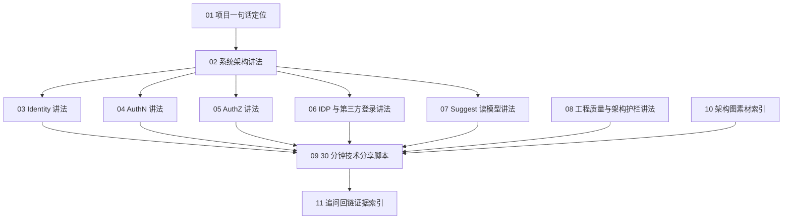

# 06-宣讲

> 状态：待补证据 · 宣讲目录总入口，已按项目定位、系统架构、五个模块讲法、工程质量、30 分钟脚本、架构图素材和追问回链证据重写；后续需要继续结合代码事实源、契约文件、演示材料和面试反馈持续校准。

---

## 1. 本目录定位

`06-宣讲/` 面向技术分享、面试讲解、架构评审和对外表达。

它解决的问题不是“事实是什么”，而是：

```text
如何把 IAM 项目讲清楚？
如何用金字塔结构表达？
如何从一句话讲到 30 分钟？
如何把模块、链路、边界、取舍和证据回链串起来？
如何避免讲成散点堆叠？
```

本目录不替代事实层。

事实层仍然以以下目录为准：

| 事实层 | 作用 |
| --- | --- |
| [../02-业务模块/README.md](../02-业务模块/README.md) | Identity / AuthN / AuthZ / IDP / Suggest 的业务模块事实源 |
| [../03-接入与契约/README.md](../03-接入与契约/README.md) | REST / gRPC / Go SDK 接入契约事实源 |
| [../04-架构护栏/README.md](../04-架构护栏/README.md) | 分层依赖、架构测试、契约测试等工程护栏事实源 |
| [../05-专题设计/README.md](../05-专题设计/README.md) | Token/JWKS、Outbox、Casbin、ProfileLink、Suggest 等专题设计事实源 |

宣讲层只做一件事：

```text
把事实层内容压缩、排序、结构化，形成可讲、可追问、可回链的表达体系。
```

---

## 2. 30 秒结论

IAM 宣讲的主线是：

```text
一句话定位
  -> 系统架构总图
  -> Identity / AuthN / AuthZ 三个核心模块
  -> IDP / Suggest 两个扩展模块
  -> REST / gRPC / Go SDK 接入
  -> 专题设计与工程护栏
  -> 追问回链证据
```

最重要的表达原则：

```text
先讲项目解决什么问题；
再讲模块为什么这样拆；
再讲每个模块的对象、链路和边界；
再讲关键设计取舍；
最后讲工程质量如何固化。
```

如果只记一句话：

> 06-宣讲不是新增事实，而是把 IAM 的事实、边界和取舍组织成可复用的技术表达。

---

## 3. 推荐讲法

### 3.1 5 分钟版本

```text
IAM 是统一身份与访问管理服务。

业务模块上拆成五块：Identity 管用户和档案关系，AuthN 管登录认证和 Token，AuthZ 管资源访问决策，IDP 管微信等外部身份源，Suggest 管 Profile 联想搜索读模型。

架构上对外提供 REST、gRPC、Go SDK，对内采用 transport、application、domain、infra、container 分层。

设计上最重要的几个边界是：ProfileLink 不是 Permission，验签不等于授权，Casbin 是 runtime 不是领域模型，Suggest 是读模型不是 Profile 主数据。

工程上用架构测试、契约测试、SDK compile test 和 docs hygiene 防止长期漂移。
```

---

### 3.2 10 分钟版本

```text
1. IAM 一句话定位；
2. 系统架构：五模块 + 三接入 + 分层；
3. Identity / AuthN / AuthZ；
4. IDP / Suggest；
5. 选讲 Token/JWKS、Outbox、Casbin、Suggest 读模型中的两个设计点；
6. 架构护栏和总结。
```

---

### 3.3 30 分钟版本

```text
0-3 分钟：项目定位和问题背景；
3-7 分钟：系统架构总图；
7-15 分钟：Identity / AuthN / AuthZ；
15-19 分钟：IDP / Suggest；
19-23 分钟：REST / gRPC / Go SDK；
23-27 分钟：专题设计与架构护栏；
27-30 分钟：总结和追问入口。
```

完整脚本见 [09-30分钟技术分享脚本.md](09-30分钟技术分享脚本.md)。

---

## 4. 文档结构

| 文档 | 主题 | 适合场景 |
| --- | --- | --- |
| [01-项目一句话定位.md](01-项目一句话定位.md) | IAM 项目一句话、30 秒、1 分钟、3 分钟定位 | 开场、简历项目介绍、面试第一问 |
| [02-系统架构讲法.md](02-系统架构讲法.md) | 系统架构、业务模块、运行时分层、接入层、关键链路 | 架构讲解、技术评审 |
| [03-Identity讲法.md](03-Identity讲法.md) | User / Profile / ProfileLink 及 Identity 边界 | 身份事实建模追问 |
| [04-AuthN讲法.md](04-AuthN讲法.md) | LoginIdentity / Credential / Principal / Session / Token / JWKS | 登录认证与 Token 设计追问 |
| [05-AuthZ讲法.md](05-AuthZ讲法.md) | Subject / Resource / Action / Scope / Role / Permission / RoleBinding / Casbin | 权限模型、Casbin、Outbox 追问 |
| [06-IDP与第三方登录讲法.md](06-IDP与第三方登录讲法.md) | 外部身份源、微信/企业微信登录、ExternalIdentity 与 LoginIdentity | 第三方登录追问 |
| [07-Suggest读模型讲法.md](07-Suggest读模型讲法.md) | ProfileSearchTerm / ProfileSuggestionIndex / 可见性过滤 / 手机号脱敏 | 搜索读模型、隐私安全追问 |
| [08-工程质量与架构护栏讲法.md](08-工程质量与架构护栏讲法.md) | architecture tests / contract tests / SDK compile test / docs hygiene | 工程质量、CI、长期演进追问 |
| [09-30分钟技术分享脚本.md](09-30分钟技术分享脚本.md) | 30 分钟完整分享节奏和逐段话术 | 技术分享、面试深讲 |
| [10-架构图素材索引.md](10-架构图素材索引.md) | 架构图素材、Mermaid 图、讲图话术、配图顺序 | PPT / 白板 / 架构图准备 |
| [11-追问回链证据索引.md](11-追问回链证据索引.md) | 常见追问、30 秒回答、证据回链 | 面试追问、评审答疑 |

---

## 5. 宣讲总图



读图规则：

```text
01 负责开场定位；
02 负责建立全局架构地图；
03-07 负责五个模块的分层讲法；
08 负责工程质量与护栏；
09 负责把所有内容串成 30 分钟分享；
10 负责提供图形素材；
11 负责追问时的证据回链。
```

---

## 6. 核心表达主线

### 6.1 项目主线

```text
IAM 是统一身份与访问管理底座。
```

展开为：

```text
Identity 管身份事实；
AuthN 管认证；
AuthZ 管授权；
IDP 管外部身份源；
Suggest 管 Profile 搜索读模型；
REST/gRPC/Go SDK 管业务系统接入；
架构护栏管长期演进质量。
```

---

### 6.2 架构主线

```text
Business System
  -> REST / gRPC / Go SDK
  -> transport
  -> application
  -> domain
  -> infra
  -> DB / Redis / MQ / Provider / Casbin / Index
```

讲法重点：

```text
transport 不写业务规则；
application 编排用例；
domain 表达模型和不变量；
infra 实现技术细节；
container 只做依赖装配；
SDK 不 import internal。
```

---

### 6.3 模块主线

```text
IDP ExternalIdentity
  -> AuthN LoginIdentity / Principal / Token
  -> Identity User / Profile / ProfileLink
  -> AuthZ Subject / Resource / Action / Scope / Decision
  -> Suggest Profile candidate / visibility / mask
```

讲法重点：

```text
外部身份不是内部 User；
认证不是授权；
身份关系不是权限；
搜索命中不是资源访问；
运行时引擎不是领域模型。
```

---

## 7. 关键边界清单

宣讲时必须反复守住这些边界：

| 边界 | 正确表达 |
| --- | --- |
| User vs LoginIdentity | User 是内部身份事实，LoginIdentity 是登录入口 |
| openid vs UserID | openid 是外部 provider 标识，不是内部 UserID |
| Principal vs Subject | Principal 是认证结果，Subject 是授权主体 |
| AuthN vs AuthZ | AuthN 证明你是谁，AuthZ 判断你能做什么 |
| AccessToken vs RefreshToken | AccessToken 访问 API，RefreshToken 只用于续期 |
| JWKS vs private key | JWKS 只发布公钥，不发布私钥 |
| ProfileLink vs Permission | ProfileLink 是身份关系，Permission 是访问权声明 |
| Casbin vs AuthZ domain | Casbin 是 infra runtime，不是领域模型 |
| Outbox vs MQ | Outbox 记录待发布事件，MQ 负责投递 |
| ProfileSuggestionIndex vs Profile | ProfileSuggestionIndex 是派生读模型，Profile 是 Identity 主数据 |
| ProfileSuggestItem vs AuthorizationDecision | ProfileSuggestItem 是候选展示，AuthorizationDecision 是授权决策 |
| docs vs machine contract | 文档解释语义，OpenAPI/proto/SDK 才是机器契约事实源 |

---

## 8. 素材入口

### 8.1 总览素材

| 素材 | 入口 |
| --- | --- |
| 项目定位 | [01-项目一句话定位.md](01-项目一句话定位.md) |
| 系统架构 | [02-系统架构讲法.md](02-系统架构讲法.md) |
| 架构图素材 | [10-架构图素材索引.md](10-架构图素材索引.md) |
| 30 分钟脚本 | [09-30分钟技术分享脚本.md](09-30分钟技术分享脚本.md) |
| 追问证据 | [11-追问回链证据索引.md](11-追问回链证据索引.md) |

---

### 8.2 模块素材

| 模块 | 宣讲入口 | 事实源入口 |
| --- | --- | --- |
| Identity | [03-Identity讲法.md](03-Identity讲法.md) | [../02-业务模块/01-Identity/README.md](../02-业务模块/01-Identity/README.md) |
| AuthN | [04-AuthN讲法.md](04-AuthN讲法.md) | [../02-业务模块/02-AuthN/README.md](../02-业务模块/02-AuthN/README.md) |
| AuthZ | [05-AuthZ讲法.md](05-AuthZ讲法.md) | [../02-业务模块/03-AuthZ/README.md](../02-业务模块/03-AuthZ/README.md) |
| IDP | [06-IDP与第三方登录讲法.md](06-IDP与第三方登录讲法.md) | [../02-业务模块/04-IDP/README.md](../02-业务模块/04-IDP/README.md) |
| Suggest | [07-Suggest读模型讲法.md](07-Suggest读模型讲法.md) | [../02-业务模块/05-Suggest/README.md](../02-业务模块/05-Suggest/README.md) |

---

### 8.3 专题素材

| 专题 | 入口 |
| --- | --- |
| JWT/JWS/JWK/JWKS/KeyRotation | [../05-专题设计/01-JWT-JWS-JWK-JWKS-KeyRotation.md](../05-专题设计/01-JWT-JWS-JWK-JWKS-KeyRotation.md) |
| Session / AccessToken / RefreshToken | [../05-专题设计/02-Session-AccessToken-RefreshToken边界.md](../05-专题设计/02-Session-AccessToken-RefreshToken边界.md) |
| Transactional Outbox | [../05-专题设计/03-Transactional-Outbox设计.md](../05-专题设计/03-Transactional-Outbox设计.md) |
| Casbin 在 AuthZ 中的定位 | [../05-专题设计/04-Casbin在AuthZ中的定位.md](../05-专题设计/04-Casbin在AuthZ中的定位.md) |
| ProfileLink 为什么不是 Permission | [../05-专题设计/05-ProfileLink为什么不是Permission.md](../05-专题设计/05-ProfileLink为什么不是Permission.md) |
| Suggest 为什么是读模型 | [../05-专题设计/06-Suggest为什么是读模型.md](../05-专题设计/06-Suggest为什么是读模型.md) |

---

### 8.4 接入与护栏素材

| 内容 | 入口 |
| --- | --- |
| 接入契约总览 | [../03-接入与契约/README.md](../03-接入与契约/README.md) |
| REST 接入 | [../03-接入与契约/01-REST接入契约.md](../03-接入与契约/01-REST接入契约.md) |
| gRPC 接入 | [../03-接入与契约/02-gRPC接入契约.md](../03-接入与契约/02-gRPC接入契约.md) |
| Go SDK | [../03-接入与契约/03-Go-SDK接入模型.md](../03-接入与契约/03-Go-SDK接入模型.md) |
| 业务系统接入 IAM | [../03-接入与契约/04-业务系统接入IAM.md](../03-接入与契约/04-业务系统接入IAM.md) |
| 契约防漂移 | [../03-接入与契约/05-契约事实源与防漂移.md](../03-接入与契约/05-契约事实源与防漂移.md) |
| 架构护栏总览 | [../04-架构护栏/README.md](../04-架构护栏/README.md) |
| 分层依赖边界 | [../04-架构护栏/01-分层依赖边界.md](../04-架构护栏/01-分层依赖边界.md) |
| 架构测试 | [../04-架构护栏/02-架构测试.md](../04-架构护栏/02-架构测试.md) |
| 契约测试 | [../04-架构护栏/03-契约测试.md](../04-架构护栏/03-契约测试.md) |

---

## 9. 讲解顺序建议

### 9.1 面试项目介绍

```text
01-项目一句话定位.md
  -> 02-系统架构讲法.md
  -> 03-Identity讲法.md
  -> 04-AuthN讲法.md
  -> 05-AuthZ讲法.md
  -> 08-工程质量与架构护栏讲法.md
  -> 11-追问回链证据索引.md
```

目标：

```text
先讲清项目价值，再讲核心模块和工程质量。
```

---

### 9.2 技术评审分享

```text
09-30分钟技术分享脚本.md
  -> 10-架构图素材索引.md
  -> 02-系统架构讲法.md
  -> 03-Identity讲法.md
  -> 04-AuthN讲法.md
  -> 05-AuthZ讲法.md
  -> 06-IDP与第三方登录讲法.md
  -> 07-Suggest读模型讲法.md
  -> 08-工程质量与架构护栏讲法.md
```

目标：

```text
按时间线完整讲完项目定位、架构、模块、接入、专题和护栏。
```

---

### 9.3 权限专题深讲

```text
05-AuthZ讲法.md
  -> ../05-专题设计/04-Casbin在AuthZ中的定位.md
  -> ../05-专题设计/03-Transactional-Outbox设计.md
  -> ../05-专题设计/05-ProfileLink为什么不是Permission.md
  -> ../02-业务模块/03-AuthZ/README.md
```

目标：

```text
讲清 AuthZ 领域模型、Casbin runtime、PolicyVersion/Outbox 和 ProfileLink/Permission 边界。
```

---

### 9.4 登录认证专题深讲

```text
04-AuthN讲法.md
  -> ../05-专题设计/01-JWT-JWS-JWK-JWKS-KeyRotation.md
  -> ../05-专题设计/02-Session-AccessToken-RefreshToken边界.md
  -> ../02-业务模块/02-AuthN/README.md
```

目标：

```text
讲清 LoginIdentity/Credential/Principal/Session/Token/JWKS。
```

---

### 9.5 搜索读模型专题深讲

```text
07-Suggest读模型讲法.md
  -> ../05-专题设计/06-Suggest为什么是读模型.md
  -> ../02-业务模块/05-Suggest/README.md
  -> ../05-专题设计/05-ProfileLink为什么不是Permission.md
```

目标：

```text
讲清 Suggest 读模型、可见性过滤、手机号搜索、脱敏和 AuthZ 边界。
```

---

## 10. 常见反模式

| 反模式 | 问题 | 推荐做法 |
| --- | --- | --- |
| 一上来讲 JWT | 听众还不知道项目解决什么问题 | 先讲 IAM 定位，再讲 AuthN 专题 |
| 一上来讲 Casbin | 容易把 AuthZ 讲成框架使用 | 先讲 Subject/Resource/Action/Scope，再讲 Casbin runtime |
| 模块平铺介绍 | 没有主线 | 按 Identity -> AuthN -> AuthZ -> IDP -> Suggest 的逻辑展开 |
| 把 AuthN/AuthZ 都叫鉴权 | 认证授权混淆 | 明确 AuthN 证明是谁，AuthZ 判断能做什么 |
| 把 ProfileLink 讲成权限 | 身份关系和资源权限混淆 | ProfileLink 是事实输入，Permission/AuthZ Check 才是权限判断 |
| 把 Suggest 讲成搜索功能 | 忽略读模型和安全边界 | 强调 Snapshot、可见性过滤、脱敏、最终一致、保守降级 |
| 只讲工具名 | 缺少设计取舍 | 每个工具都要讲“保护什么边界” |
| 文档反推事实 | 事实源错位 | 文档解释语义，代码/OpenAPI/proto/SDK 是机器事实源 |
| 引用旧骨架文件 | 证据不稳定 | 回链当前 active README、模块文档和专题文档 |
| 把待核对内容说成已实现 | 风险高 | 标注“以当前代码为准 / 待核对” |

---

## 11. 旧入口处理说明

旧 README 曾引用：

```text
../02-业务模块/00-模块协作总图.md
```

当前已不再使用该入口作为当前事实源。

原因：

```text
02-业务模块/00-模块协作总图.md 已合并进 02-业务模块/README.md；
宣讲层应回链到当前 active README、模块主文档、专题设计和讲法文档；
不要继续引用已合并或旧骨架文件作为当前事实源。
```

当前模块协作入口统一为：

```text
../02-业务模块/README.md
10-架构图素材索引.md
02-系统架构讲法.md
```

---

## 12. Verify

修改本文后至少执行：

```bash
make docs-hygiene
```

如果同步修改宣讲目录其他文件，也执行：

```bash
make docs-hygiene
```

如果同步修改接入契约、架构护栏或代码事实源，按影响范围执行：

```bash
make api-validate
make proto-gen
go test ./internal/pkg/architecture
go test ./pkg/sdk/...
```

---

## 13. 本目录总结

`06-宣讲/` 的职责可以压缩成：

```text
01 讲项目是什么；
02 讲系统怎么组织；
03-07 讲五个模块怎么表达；
08 讲工程质量怎么保证；
09 讲 30 分钟如何完整分享；
10 提供架构图素材；
11 提供追问证据回链。
```

本目录最重要的工程规则是：

```text
宣讲不新增事实；
表达必须能回链；
每个概念都有边界；
每条链路都有事实源；
每个亮点都能被追问；
不引用旧骨架作为当前事实；
不把待核对内容讲成已实现事实。
```
