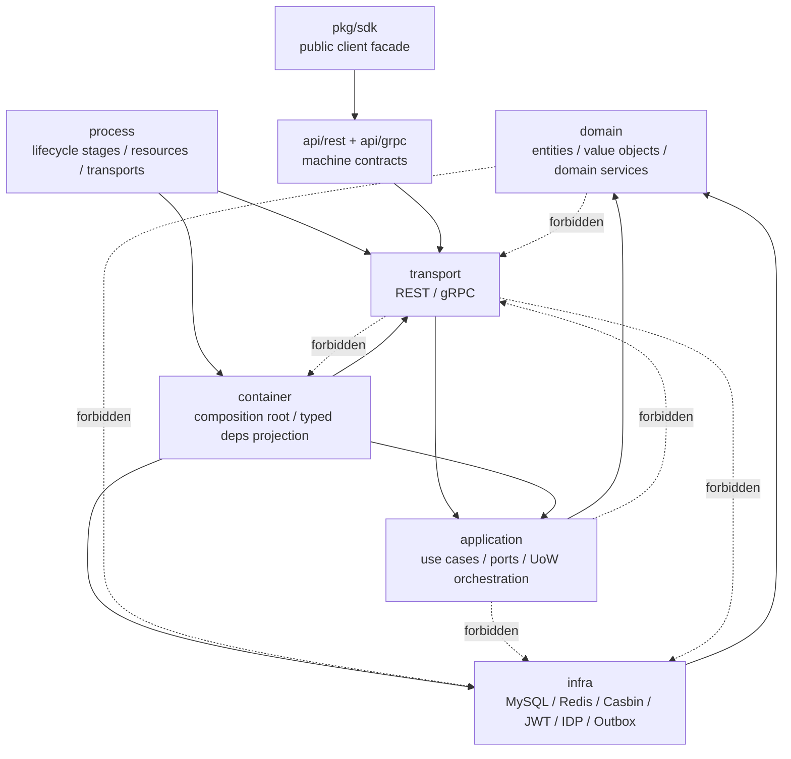

# 架构测试与依赖边界

## 本文回答

本文回答：IAM 如何用自动化测试保护架构边界；哪些层不能依赖哪些层；为什么 domain 不能依赖 infra/database，application 不能依赖 transport，REST router 不能依赖 container/global config，assembler 不能构造 transport；AuthZ 为什么必须把 Casbin facts 隔离在 infra 层；REST/gRPC/SDK/API 文档如何通过契约测试避免接口漂移。

读完本文，你应该能回答：

- IAM 当前有哪些架构护栏；
- 这些护栏保护的不是“代码风格”，而是哪类架构决策；
- `internal/pkg/architecture/architecture_test.go` 主要检查什么；
- domain、application、transport、container、assembler、process 的依赖边界分别是什么；
- 为什么 application tests 也有依赖边界；
- 为什么 REST router 必须消费显式 `rest.Deps`；
- 为什么 container capability navigation 只能出现在 collector 文件中；
- 为什么 AuthZ 的 Casbin `p/g/r` facts 不能进入 domain/transport；
- 为什么 gRPC proto、REST OpenAPI、SDK public API 都需要契约测试；
- 新增模块、路由、RPC、SDK API 时应该跑哪些验证。

---

## 30 秒结论

IAM 的架构护栏可以概括成一句话：

> 业务规则只能向内依赖，运行时装配只能通过显式 typed deps，协议契约必须被测试保护，历史兼容包不能回流。

当前最重要的护栏有四类：

| 护栏类型 | 代表测试/脚本 | 保护什么 |
| --- | --- | --- |
| 代码依赖边界 | `internal/pkg/architecture/architecture_test.go` | domain/application/transport/container/process 分层不回退 |
| REST 契约 | `router_matrix_test.go`、`check-route-contracts.py`、`check-openapi-contracts.py` | 运行时路由、OpenAPI、Swagger 不漂移 |
| gRPC 契约 | `proto_contract_test.go` | proto service 必须有 transport registration |
| SDK 公开面 | `pkg/sdk/public_api_compile_test.go` | SDK 稳定公开包和关键符号不被误删 |
| 文档卫生 | `make docs-hygiene`、`scripts/check-docs-links.py` | 活跃文档链接有效，不引用退役事实 |

这些测试不是为了“测试业务正确性”，而是为了防止架构回退。例如：

```text
domain -> infra/database
application -> transport/infra
transport -> container/global config
assembler -> REST/gRPC implementation
AuthZ domain -> Casbin p/g/r facts
docs -> retired routes/packages
```

都属于应该被测试及时拦截的回退。

核心源码入口：

- [../../internal/pkg/architecture/architecture_test.go](../../internal/pkg/architecture/architecture_test.go)
- [../../internal/apiserver/transport/rest/router_matrix_test.go](../../internal/apiserver/transport/rest/router_matrix_test.go)
- [../../internal/apiserver/transport/grpc/proto_contract_test.go](../../internal/apiserver/transport/grpc/proto_contract_test.go)
- [../../pkg/sdk/public_api_compile_test.go](../../pkg/sdk/public_api_compile_test.go)
- [../../scripts/check-route-contracts.py](../../scripts/check-route-contracts.py)
- [../../scripts/check-openapi-contracts.py](../../scripts/check-openapi-contracts.py)
- [../../scripts/check-docs-links.py](../../scripts/check-docs-links.py)
- [../../docs/CONTRIBUTING-DOCS.md](../../docs/CONTRIBUTING-DOCS.md)

---

## 主图：IAM 依赖边界



---

## 重点速查

| 边界 | 当前护栏 | 代码证据 |
| --- | --- | --- |
| domain 不依赖 infra/database | 扫描 `internal/apiserver/domain` imports，禁止 infra/database 依赖。 | [../../internal/pkg/architecture/architecture_test.go](../../internal/pkg/architecture/architecture_test.go) |
| application 不依赖 transport/infra | 扫描 `internal/apiserver/application` imports，禁止 transport 和 infra/database 依赖。 | [../../internal/pkg/architecture/architecture_test.go](../../internal/pkg/architecture/architecture_test.go) |
| application test infra 依赖只能进 testutil | 普通 application tests 不能直接 import infra/GORM。 | [../../internal/pkg/architecture/architecture_test.go](../../internal/pkg/architecture/architecture_test.go) |
| REST router 不依赖 container/viper | REST 只能消费 explicit deps，不能 import container/global config。 | [../../internal/pkg/architecture/architecture_test.go](../../internal/pkg/architecture/architecture_test.go) |
| application/container 不读 viper | runtime config 必须通过 typed options/deps 进入。 | [../../internal/pkg/architecture/architecture_test.go](../../internal/pkg/architecture/architecture_test.go) |
| assembler 使用 typed deps | 禁止 `params ...interface{}`、`[]interface{}`。 | [../../internal/pkg/architecture/architecture_test.go](../../internal/pkg/architecture/architecture_test.go) |
| assembler 不构造 transport | 禁止 assembler import `internal/apiserver/transport/*`。 | [../../internal/pkg/architecture/architecture_test.go](../../internal/pkg/architecture/architecture_test.go) |
| assembler module 不暴露 handler/grpc fields | 禁止模块结构体直接暴露 transport fields。 | [../../internal/pkg/architecture/architecture_test.go](../../internal/pkg/architecture/architecture_test.go) |
| REST registrars 不用 package global deps | 禁止 `var deps`、`Provide(...)`。 | [../../internal/pkg/architecture/architecture_test.go](../../internal/pkg/architecture/architecture_test.go) |
| legacy interface 包退休 | 禁止 `internal/apiserver/interface` 回流。 | [../../internal/pkg/architecture/architecture_test.go](../../internal/pkg/architecture/architecture_test.go) |
| AuthZ 内部语言使用 rolebinding | 禁止 `application/domain/infra authz/assignment` 包回流。 | [../../internal/pkg/architecture/architecture_test.go](../../internal/pkg/architecture/architecture_test.go) |
| Casbin facts 留在 infra/casbin | 禁止 domain/transport/application 直接使用 Casbin 技术事实。 | [../../internal/pkg/architecture/architecture_test.go](../../internal/pkg/architecture/architecture_test.go) |
| REST routes 与 OpenAPI 不漂移 | router matrix test + route/schema contract scripts。 | [../../internal/apiserver/transport/rest/router_matrix_test.go](../../internal/apiserver/transport/rest/router_matrix_test.go)、[../../scripts/check-route-contracts.py](../../scripts/check-route-contracts.py)、[../../scripts/check-openapi-contracts.py](../../scripts/check-openapi-contracts.py) |
| gRPC proto service 有注册实现 | `proto_contract_test.go` 扫描 proto service 与 `Register<Service>Server`。 | [../../internal/apiserver/transport/grpc/proto_contract_test.go](../../internal/apiserver/transport/grpc/proto_contract_test.go) |
| SDK 公开面不漂移 | `public_api_compile_test.go` 固定公开包和关键符号。 | [../../pkg/sdk/public_api_compile_test.go](../../pkg/sdk/public_api_compile_test.go) |
| 文档不引用退役事实 | `scripts/check-docs-links.py` 检查链接和 retired references。 | [../../scripts/check-docs-links.py](../../scripts/check-docs-links.py) |

---

## 1. 架构测试的定位

架构测试不是业务单元测试。
它不验证“登录是否成功”“授权是否 allowed”“ProfileLink 是否建立成功”。

它验证的是：

```text
代码结构有没有破坏我们已经确定的架构边界。
```

例如：

- 某个 domain 包偷偷 import 了 MySQL repository；
- 某个 application service 直接 new 了 REST handler；
- REST router 直接拿 container；
- assembler 直接构造 gRPC service；
- AuthZ domain 写出了 Casbin `p/g/r`；
- 文档又引用旧路由 `/api/v2/auth/login`。

这些问题不一定会马上导致业务测试失败，但会让架构逐步退化。
架构测试的价值就是在退化刚发生时拦住。

---

## 2. Domain 边界：只表达业务规则

当前护栏：

```text
TestDomainPackagesDoNotAddInfrastructureDependencies
```

保护的是：

```text
internal/apiserver/domain
 不能依赖 infra/database/migration/GORM 等基础设施
```

### 为什么 domain 不能依赖 infra

domain 层应该表达：

```text
实体
值对象
领域服务
领域规则
repository port
```

例如：

- `authn/authentication.Authenticator`;
- `authz.Permission`;
- `profilelink.ProfileLinker`;
- `profile.Profile`;
- `user.Lifecycler`.

它不能知道：

- MySQL 如何查询；
- Redis key 怎么命名；
- Casbin p/g/r 怎么存；
- REST request 怎么 bind；
- gRPC proto 怎么映射。

否则 domain 会变成基础设施脚本，无法保持稳定业务语言。

### 正确依赖方向

```text
domain 定义 port
infra 实现 port
application 调用 port
```

错误方向：

```text
domain -> infra/mysql
domain -> infra/casbin
domain -> transport/rest
```

---

## 3. Application 边界：用例编排，不依赖协议和基础设施实现

当前护栏：

```text
TestApplicationPackagesDoNotAddTransportOrInfrastructureDependencies
```

保护的是：

```text
internal/apiserver/application
 不能依赖 transport
 不能依赖 infra/database/GORM
```

application 层应该做：

```text
用例编排
DTO / command / query
调用 domain service
调用 repository ports
管理 UoW
提交 PolicyChange
```

它不应该做：

```text
读取 Gin context
解析 HTTP headers
直接 new GORM repository
直接调用 CasbinAdapter
直接构造 gRPC response
```

### 例子：AuthZ 写入

正确链路是：

```text
REST handler
  -> application PolicyAdministration
  -> domain AuthorizationPolicy
  -> PolicyChangeCommitter
  -> UoW ports
  -> infra repositories
```

如果 application 直接 import `infra/casbin`，就会绕过 UoW、version、outbox 和 runtime reload。

### Application testutil 例外

application 测试可能需要 infra-backed fixture，但这些依赖必须集中在：

```text
application/*/testutil
```

普通 `_test.go` 不应直接 import infra/GORM。
这避免测试代码把基础设施依赖悄悄带回 application 包。

相关护栏：

```text
TestApplicationTestSupportDependenciesStayInTestutil
TestApplicationTestsUseTestutilForInfrastructureDependencies
```

---

## 4. Transport 边界：协议适配，不做组合根

REST/gRPC transport 的职责是：

```text
解析协议输入
做 DTO/proto mapper
调用 application service
映射响应和错误
注册 routes/services
接入 middleware/interceptor
```

它不应该：

```text
初始化业务模块
读取全局配置
访问 container 内部字段
直接调用 infra/casbin
直接操作 DB/Redis
```

### 4.1 REST router 不依赖 container / viper

当前护栏：

```text
TestRESTRouterDoesNotImportCompositionOrGlobalConfig
```

禁止 REST router import：

```text
internal/apiserver/container
github.com/spf13/viper
```

原因是 REST router 应该消费：

```text
rest.Deps
RouterOptions
AuthnDeps
AuthzDeps
UserDeps
IDPDeps
SuggestDeps
```

而不是直接去 container 里挖模块。

正确：

```text
Container.BuildRESTDeps(...)
  -> rest.Deps
  -> rest.NewRouter(deps)
```

错误：

```text
Router receives Container
Router calls container.AuthnModule...
Router reads viper.GetString(...)
```

### 4.2 REST registrars 不使用 package global deps

当前护栏：

```text
TestRESTRegistrarsDoNotUsePackageGlobalDependencies
```

禁止：

```text
var deps
func Provide(...)
```

这保护的是依赖显式传递。
如果路由注册靠全局变量，就会造成测试污染、初始化顺序问题和隐式依赖。

### 4.3 Transport 不依赖 legacy interface 包

当前护栏：

```text
TestTransportPackagesDoNotDependOnLegacyInterfacePackages
TestLegacyInterfacePackageIsRetired
```

确保 transport 包自己拥有 REST/gRPC 注册逻辑，不再通过旧的：

```text
internal/apiserver/interface
```

兼容层包装。

---

## 5. Container 与 Assembler 边界：组合根和 typed deps

container/assembler 是 IAM 的组合根区域，但它也有边界。

### 5.1 assembler 使用 typed deps

当前护栏：

```text
TestAssemblerModulesUseTypedDependencies
```

禁止：

```go
params ...interface{}
[]interface{}
```

这保护的是模块初始化的显式依赖。

正确：

```go
type AuthzModuleDeps struct {
    DB          *gorm.DB
    EventStager event.Stager
}
```

错误：

```go
Initialize(params ...interface{})
```

### 5.2 assembler 不返回泛型 component holder

当前护栏：

```text
TestAssemblerComponentHoldersDoNotReturn
```

禁止退回：

```text
RepoComponent
ServiceComponent
HandlerComponent
Repository interface{}
Service interface{}
Handler interface{}
```

这些泛型 holder 会让模块边界变模糊，最终所有依赖都变成 `interface{}`。

### 5.3 assembler 不构造 transport implementation

当前护栏：

```text
TestAssemblerDoesNotConstructTransportImplementations
```

assembler 只能暴露 application/domain capability，不应该构造：

```text
REST handler
gRPC service
router
```

正确链路：

```text
assembler AuthnModule exposes ApplicationCapabilities
container/rest_deps.go creates REST handlers
container/grpc_registry.go creates gRPC registrations
```

### 5.4 assembler module 不暴露 transport fields

当前护栏：

```text
TestAssemblerModulesDoNotExposeTransportFields
```

禁止模块结构体暴露：

```text
SomeHandler *...
GRPCService *...
```

特别是 AuthN 还有专门测试：

```text
TestAuthnModuleDoesNotExposeConcreteApplicationFields
```

防止 AuthNModule 重新暴露大量具体 application fields，而应通过 `ApplicationCapabilities()` 暴露能力。

---

## 6. Container capability collectors：限制向内导航

当前护栏：

```text
TestContainerCapabilityNavigationStaysInCollectors
```

它允许少数 collector 文件访问模块 capability：

```text
internal/apiserver/container/rest_deps.go
internal/apiserver/container/grpc_registry.go
internal/apiserver/container/runtime_deps.go
internal/apiserver/container/module_graph.go
```

其他地方不应直接写：

```text
AuthnModule.TokenService
AuthzModule.CheckHandler
UserModule.ProfileHandler
IDPModule.WechatAppHandler
SuggestModule.Cleanup
```

### 为什么要限制

container 中确实需要做能力投影：

```text
REST deps
gRPC registrations
runtime deps
module graph deps
```

但如果任何文件都可以随便访问模块内部 capability，container 就会变成“第二个业务层”。

所以当前设计是：

```text
能力导航只能在 collectors 中集中发生
其他地方通过 collector 输出消费
```

这能让后续重构模块内部字段时，只需要改少数 collector 文件。

---

## 7. Process 边界：生命周期编排，不持有 bootstrap 细节

process 层负责：

```text
PrepareRun stage pipeline
resource preparation
container initialization
transport bootstrap
runtime tasks
graceful shutdown
```

但它也不能无限膨胀。

当前护栏包括：

```text
TestRootAPIServerPackageOwnsOnlyRunDelegation
TestProcessRootDoesNotOwnBootstrapDetails
TestLocalProcessRunnerDoesNotReturn
```

这些测试保护：

- root apiserver package 只做 run delegation；
- process root 不直接持有 gRPC option apply、NSQ normalize、IDP key parse、EventBus create、outbox relay loop 等 bootstrap detail；
- 退休的本地 process runner 不回流。

### 为什么要拆 process

如果 `root.go` 同时负责：

```text
配置解析
DB 初始化
Redis 初始化
EventBus 初始化
container 初始化
REST/gRPC 注册
runtime task
shutdown
```

它很快会变成新的 God object。

当前更合理的是：

```text
root.go 管生命周期所有权
bootstrap.go 管 stage 细节
database.go / event_bus.go / idp_key.go / grpc_config.go 分别处理资源细节
shutdown_lifecycle.go 管后台任务和关闭
```

---

## 8. Runtime config 边界：不用全局 viper

当前护栏：

```text
TestRuntimeCompositionDoesNotReadGlobalConfigDirectly
```

扫描：

```text
internal/apiserver/application
internal/apiserver/container
```

禁止 import：

```text
github.com/spf13/viper
```

### 为什么

配置读取应该发生在入口层：

```text
pkg/app
  -> viper
  -> options.Options
  -> config.Config
  -> typed runtime options/deps
```

application/container 不应该自己读：

```go
viper.GetString("xxx")
```

否则：

- 测试难以控制配置；
- 模块依赖隐式化；
- 配置来源无法追踪；
- 同一配置可能被多个地方以不同默认值读取。

正确方式是：

```text
process/container 构造 typed options
container.RuntimeOptions
rest.RouterOptions
grpc.Config
```

---

## 9. AuthZ 专项护栏：Casbin facts 不进入业务语言

AuthZ 是当前架构测试最严格的区域之一。

当前护栏：

```text
TestAuthzCasbinFactsStayBehindApplicationPorts
```

保护几件事：

### 9.1 assignment 包不回流

禁止这些包重新出现：

```text
internal/apiserver/domain/authz/assignment
internal/apiserver/application/authz/assignment
internal/apiserver/infra/mysql/assignment
```

内部语言必须使用：

```text
rolebinding
```

`assignment` 只作为 REST/proto wire term 保留。

### 9.2 domain 不出现 Casbin 技术语言

禁止 domain/authz 中出现：

```text
PolicyRule
GroupingRule
CasbinAdapter
SubjectKey
RoleKey
scopeMatch
Sub/Dom/Obj/Act
```

domain 应使用：

```text
Subject
Role
Resource
Permission
RoleBinding
Scope
AuthorizationRequest
AuthorizationDecision
```

Casbin `p/g/r` 五元组只属于 infra/casbin。

### 9.3 transport 不直接依赖 Casbin

REST/gRPC AuthZ transport 不能直接 import：

```text
internal/apiserver/infra/casbin
```

也不能直接调用：

```text
.Enforce(...)
.GetRolesForUser(...)
```

transport 应依赖：

```text
application authorization use cases
RouteAuthorizationRuntime
```

### 9.4 application 不依赖 Casbin infra

application/authz 不能 import infra/casbin。
写入事实要通过 UoW 的 application ports，判定要通过 `DecisionEngine` port。

### 9.5 Casbin model 与 API scope 受测试保护

测试还确认这些文件包含 scope 相关契约：

```text
configs/casbin_model.conf
api/grpc/iam/authz/v2/authz.proto
internal/apiserver/transport/rest/authz/dto/policy.go
internal/apiserver/transport/rest/authz/dto/check.go
```

这保护的是 scope-aware authorization 不会被无意退回四元组。

---

## 10. Suggest 专项护栏：候选搜索不是关系和权限

当前护栏：

```text
TestSuggestProfileSuggestionBoundaries
```

保护：

- application/suggest 不依赖 infra、filesystem、cron；
- domain/suggest 不出现 Trie、Hash、snapshot、cron 等基础设施语言；
- REST suggest transport 不直接 import infra/suggest。

这对应前面文档里的边界：

```text
Suggest = 候选发现
ProfileLink = 关系建立
AuthZ = 权限判定
```

Suggest domain/application 应该表达：

```text
Profile candidate
Query
Ranking
Suggestor port
```

而不是：

```text
snapshot file
trie index
cron scheduler
filesystem path
```

这些实现细节属于 infra 或 runtime。

---

## 11. Identity 事务边界：txCtx 必须传入事务内领域调用

当前护栏：

```text
TestIdentityApplicationTransactionDomainCallsUseTxContext
```

它扫描 Identity application，禁止在事务内的领域调用中使用外层 `ctx`：

```text
validator.ValidateCreate(ctx, ...)
profileEditor.Rename(ctx, ...)
managerService.Establish(ctx, ...)
```

应使用：

```text
txCtx
```

### 为什么

Identity UoW 会把事务对象绑定到 `txCtx`。
如果事务内调用继续用外层 `ctx`，repository 可能拿不到 active transaction，从而导致：

```text
部分操作在事务内
部分操作在事务外
```

对于 User/Profile/ProfileLink 这种组合写入，这是严重一致性问题。

正确模式：

```go
uow.WithinTx(ctx, func(txCtx context.Context, tx TxRepositories) error {
    entity, err := domainService.Do(txCtx, ...)
    return tx.Repository.Update(txCtx, entity)
})
```

---

## 12. REST 契约护栏

REST 防漂移不是只靠架构测试。

### 12.1 router matrix test

`router_matrix_test.go` 检查两件事：

1. 关键路由必须注册；
2. 注册的 public routes 必须被 OpenAPI 覆盖。

关键路由包括：

```text
/health
/.well-known/jwks.json
/api/v2/authn/login
/api/v2/authz/check
/api/v2/identity/me
/api/v2/idp/wechat-apps
/api/v2/suggest/profile
/api/v2/admin/sessions/:sessionId/revoke
```

同时它确认旧路由不应重新出现，例如：

```text
/api/v2/authn/accounts/wechat/register
```

### 12.2 route contract script

`scripts/check-route-contracts.py` 比较：

```text
internal/apiserver/docs/swagger.yaml
api/rest/*.yaml
```

检查：

- spec 有但 swagger/code 没有；
- code 有但 spec 没有。

### 12.3 OpenAPI schema contract script

`scripts/check-openapi-contracts.py` 比较：

```text
swagger definitions
api/rest component schemas
```

检查 DTO 字段漂移和 required mismatch。

### 12.4 make api-validate

Makefile 中：

```bash
make api-validate
```

运行：

```bash
./scripts/validate-openapi.sh
```

用于 OpenAPI lint 和契约比较。
注意该命令通常依赖 Docker daemon。

核心源码：

- [../../internal/apiserver/transport/rest/router_matrix_test.go](../../internal/apiserver/transport/rest/router_matrix_test.go)
- [../../scripts/check-route-contracts.py](../../scripts/check-route-contracts.py)
- [../../scripts/check-openapi-contracts.py](../../scripts/check-openapi-contracts.py)
- [../../Makefile](../../Makefile)

---

## 13. gRPC 契约护栏

gRPC proto 防漂移主要靠：

```text
internal/apiserver/transport/grpc/proto_contract_test.go
```

它做的事：

```text
扫描 api/grpc/iam/**/*.proto
  -> 找 service <Name>
  -> 扫描 transport/grpc/service Go 源码
  -> 确认存在 Register<Name>Server
```

这能防止：

```text
proto 声明了 AuthorizationService
但 transport 没有 RegisterAuthorizationServiceServer
```

### 能保证什么

它能保证：

```text
proto service 至少有对应注册调用
```

### 不能保证什么

它不能保证：

- 每个 RPC 字段都被正确使用；
- 业务错误码完全正确；
- service runtime 一定可用；
- module 一定初始化成功；
- ACL 一定允许调用。

所以它是 service registration 级别的护栏，不是完整业务测试。

核心源码：

- [../../internal/apiserver/transport/grpc/proto_contract_test.go](../../internal/apiserver/transport/grpc/proto_contract_test.go)

---

## 14. SDK 公开面护栏

SDK 有单独的公开 API compile test：

```text
pkg/sdk/public_api_compile_test.go
```

它固定了当前公开稳定入口，例如：

```text
sdk.NewClient
sdk.Config
sdk.ConfigFromEnv
sdk.DefaultObservabilityConfig
sdk.WithMetricsCollector
sdk.WithTracingHook
auth/loginv2.NewClient
auth/jwks.NewJWKSManager
auth/verifier.NewTokenVerifier
auth/serviceauth.NewServiceAuthHelper
authz.NewClient
identity.NewClient
identity.NewProfileLinkClient
idp.NewClient
sdk/errors facade
```

这个测试的价值是：

```text
只要公开 API 被误删或签名发生不可兼容变化，编译就会失败。
```

它保护的是 SDK 对外稳定面，而不是 SDK 内部实现。

### 为什么需要 SDK compile test

SDK 是外部调用方直接 import 的包。
一旦公开符号被误删，业务服务会编译失败。

因此 SDK 公开面必须比 internal package 更稳定。

核心源码：

- [../../pkg/sdk/public_api_compile_test.go](../../pkg/sdk/public_api_compile_test.go)
- [../../pkg/sdk/README.md](../../pkg/sdk/README.md)

---

## 15. 文档卫生护栏

文档也有自动化护栏。

Makefile 中：

```bash
make docs-hygiene
```

运行：

```bash
python scripts/check-docs-links.py
```

该脚本检查：

1. 活跃 Markdown 文档的相对链接是否存在；
2. 活跃文档是否引用退役路径、旧路由、旧术语。

默认检查范围：

```text
README.md
docs
api
pkg/sdk/README.md
pkg/sdk/docs
```

跳过：

```text
_archive
```

### retired references 示例

脚本会拒绝活跃文档引用：

```text
internal/apiserver/interface
internal/apiserver/routers.go
internal/apiserver/application/authz/assignment
internal/apiserver/domain/authz/assignment
internal/apiserver/infra/jwt
internal/apiserver/domain/authn/token
/api/v2/auth/login
/api/v2/identity/refs
Profile ref 旧术语
```

这保证文档不会把历史事实重新写回当前事实。

核心源码：

- [../../scripts/check-docs-links.py](../../scripts/check-docs-links.py)
- [../../docs/CONTRIBUTING-DOCS.md](../../docs/CONTRIBUTING-DOCS.md)
- [../../Makefile](../../Makefile)

---

## 16. 新增代码时如何判断该不该加护栏

当你新增一个模块或重构边界时，可以问这几个问题：

```text
1. 这个依赖方向是否可能被误用？
2. 这个术语是否曾经有历史包/旧路由？
3. 这个 capability 是否只能从某个 collector 暴露？
4. 这个契约是否有机器事实源？
5. 这个公开 API 是否会被外部调用方 import？
6. 这个文档是否可能引用历史事实？
```

如果答案是“是”，就应该考虑添加架构测试或契约测试。

### 例子：新增 gRPC service

应该加：

```text
proto service
transport service implementation
container registration
proto_contract_test 通过
SDK compile or client wrapper
docs update
```

### 例子：新增 REST route

应该加：

```text
OpenAPI path
handler/router registration
router_matrix_test key path if重要
route contract script 通过
schema contract script 通过
docs update
```

### 例子：新增 AuthZ scope kind

应该加：

```text
domain Scope test
Resource.ScopeKinds 支持
Casbin scopeMatch 是否需要扩展
REST DTO / gRPC proto scope字段保持
AuthZ architecture test 必要时更新
docs update
```

---

## 17. 常见误区

### 误区一：架构测试只是代码洁癖

不是。
它保护的是业务规则和基础设施、协议层、组合根之间的长期边界。

### 误区二：domain 不能 import infra，但 application 可以

当前不可以。
application 也不能直接依赖 infra/transport。它应通过 ports/UoW/factory seam 协作。

### 误区三：container 是组合根，所以哪里都能访问 container

不对。
REST router、router tests、transport 都不能依赖 container。container 的能力投影必须通过 explicit deps。

### 误区四：assembler 可以顺手 new handler

不对。
assembler 只负责模块业务能力，REST/gRPC 构造放在 container 的 transport deps builders。

### 误区五：Casbin 是 AuthZ 业务模型

不对。
Casbin 是 infra runtime adapter。业务模型是 Role、Resource、Permission、RoleBinding、Scope。

### 误区六：proto contract test 能保证 RPC 业务逻辑

不能。
它只保证 service registration 没漂移。业务逻辑仍要靠 service tests、application tests 和集成测试。

### 误区七：docs-hygiene 只检查断链

不只。
它还检查活跃文档是否引用退役路径、旧路由和旧术语。

---

## 18. 当前边界与待讨论点

### 18.1 架构测试依赖字符串扫描

当前很多护栏通过 imports/token 扫描实现。
优点是简单直接，缺点是可能需要随着代码命名调整更新 token。
但这类测试正适合捕捉“某个不该出现的依赖或术语又回来了”。

### 18.2 某些契约测试只能防一层漂移

例如：

- `proto_contract_test` 防 service registration 漂移；
- `router_matrix_test` 防关键路由和 OpenAPI 覆盖漂移；
- SDK compile test 防公开符号漂移。

它们不能替代业务语义测试。

### 18.3 架构测试应该随重构同步更新

如果你确实要改变架构边界，不应该绕过测试。
应先明确：

```text
新边界是什么
旧护栏为什么不适用
新护栏如何替代旧护栏
```

再更新架构测试。

### 18.4 归档文档不参与默认 docs hygiene

`_archive` 是历史区，不参与默认 docs hygiene。
这意味着活跃正文不能依赖 `_archive` 才能成立。

---

## 19. 推荐源码阅读路线

### 第一轮：架构测试总览

```text
internal/pkg/architecture/architecture_test.go
```

目标：看清所有跨层依赖护栏和退役路径检查。

### 第二轮：REST 契约护栏

```text
internal/apiserver/transport/rest/router_matrix_test.go
scripts/check-route-contracts.py
scripts/check-openapi-contracts.py
api/rest/*.yaml
internal/apiserver/docs/swagger.yaml
```

目标：看清运行时 routes、OpenAPI、Swagger 如何互相校验。

### 第三轮：gRPC 契约护栏

```text
api/grpc/iam/*/v2/*.proto
internal/apiserver/transport/grpc/proto_contract_test.go
internal/apiserver/container/grpc_registry.go
internal/apiserver/transport/grpc/registry.go
```

目标：看清 proto service 如何落到 runtime registration。

### 第四轮：SDK 公开面护栏

```text
pkg/sdk/public_api_compile_test.go
pkg/sdk/README.md
pkg/sdk/docs/07-migration-breaking-changes.md
```

目标：看清稳定公开 API 和已收回内部的能力。

### 第五轮：文档卫生护栏

```text
docs/CONTRIBUTING-DOCS.md
scripts/check-docs-links.py
Makefile
```

目标：看清文档事实源、链接规则和 retired references。

---

## 20. 验证建议

常规架构与契约检查：

```bash
go test ./internal/pkg/architecture
go test ./internal/apiserver/transport/rest
go test ./internal/apiserver/transport/grpc
go test ./pkg/sdk
make docs-hygiene
```

涉及 REST/OpenAPI：

```bash
make docs-swagger
make api-validate
```

如果 Docker daemon 不可用，至少单独运行：

```bash
python scripts/check-route-contracts.py
python scripts/check-openapi-contracts.py
```

涉及 proto：

```bash
make proto-gen
go test ./internal/apiserver/transport/grpc
go test ./pkg/sdk
```

涉及 SDK 公开面：

```bash
go test ./pkg/sdk
go test ./pkg/sdk/auth/...
go test ./pkg/sdk/authz
go test ./pkg/sdk/identity
go test ./pkg/sdk/idp
```

涉及文档：

```bash
make docs-hygiene
```

---

## 21. 新增功能的检查清单

### 新增 domain 模型

```text
不 import infra/database/transport
只定义业务实体、值对象、domain service、repository port
必要时在 architecture_test 中添加退役术语防回流
```

### 新增 application use case

```text
不 import transport/infra
通过 port/UoW 调用 repository
事务内使用 txCtx
普通 tests 不直接 import infra，infra fixture 放 testutil
```

### 新增 REST route

```text
OpenAPI path/schema 更新
handler 只做 DTO mapping
router 通过 explicit deps 注册
router_matrix_test 视重要性加入 key path
check-route-contracts / check-openapi-contracts 通过
```

### 新增 gRPC service

```text
proto service/RPC/message 更新
生成代码
transport/grpc/service 实现
container/grpc_registry.go registration
proto_contract_test 通过
SDK wrapper 或 raw client 使用方式明确
```

### 新增 SDK 公开 API

```text
更新 pkg/sdk/public_api_compile_test.go
更新 pkg/sdk/README.md / docs
避免暴露 internal transport/observability/errorsx
```

### 新增文档

```text
相对链接可解析
不引用 _archive 作为当前事实
不引用 retired path / old routes / old terms
make docs-hygiene 通过
```

---

## 本文总结

架构测试与依赖边界可以压缩成一句话：

> IAM 用 architecture tests 固化分层依赖，用 REST/gRPC 契约测试固化协议边界，用 SDK compile test 固化公开 API，用 docs hygiene 固化文档事实源，防止项目在重构后慢慢退回旧结构。

核心护栏是：

```text
domain 不碰 infra
application 不碰 transport/infra
transport 不碰 container/global config
assembler 不碰 transport
container capability navigation 集中在 collectors
AuthZ 业务语言不退回 Casbin p/g/r
REST/gRPC/SDK 契约都有自动测试
活跃文档不引用退役事实
```

理解这篇后，下一篇《文档事实源与防漂移机制.md》会继续回答：

```text
文档该以哪些文件为事实源
_openapi / proto / sdk docs / tests / _archive 如何排序
如何避免文档比代码更快过期
```
