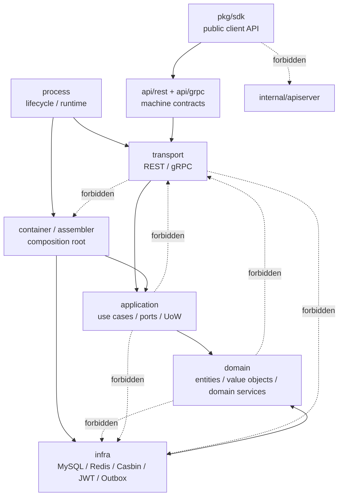

# 01-架构测试与依赖边界

## 1. 本文定位

本文是 `06-架构护栏/` 中关于 **代码依赖边界与架构测试** 的文档。

它不讲 DDD 理论，也不重复 AuthN、AuthZ、Identity、REST、gRPC、SDK 的业务设计。

本文只回答：

```text
哪些代码依赖方向不能破坏？
哪些包不能互相 import？
哪些历史结构不能回流？
哪些契约需要自动化测试保护？
新增模块、路由、RPC、SDK API 时要检查什么？
```

一句话：

> 本文是 IAM 代码结构的防撞栏：用架构测试保护分层依赖、组合根、协议契约、SDK 公开面和文档卫生。

---

## 2. 30 秒结论

IAM 的架构护栏可以压缩成一句话：

```text
业务规则向内依赖，技术实现向外适配，运行时装配集中在组合根，协议契约由机器事实源和测试保护。
```

核心护栏：

```text
domain 不依赖 infra / transport；
application 不依赖 transport / 具体 infra；
transport 不依赖 container / global config / repository；
assembler 不构造 REST/gRPC transport；
container capability navigation 集中在 collector 文件；
AuthZ 领域语言不退回 Casbin p/g/r；
SDK 不 import IAM internal 包；
REST / gRPC / SDK 契约必须有测试保护；
活跃文档不引用退役路径、旧路由、旧术语。
```

主要事实源：

```text
internal/pkg/architecture/architecture_test.go
internal/apiserver/transport/rest/router_matrix_test.go
internal/apiserver/transport/grpc/proto_contract_test.go
pkg/sdk/public_api_compile_test.go
scripts/check-route-contracts.py
scripts/check-openapi-contracts.py
scripts/check-docs-links.py
```

---

## 3. IAM 依赖边界总图



允许方向：

```text
Transport -> Application -> Domain
Infra -> Domain/Application ports
Container -> Application/Infra/Transport deps builders
Process -> Container/Transport lifecycle
SDK -> REST/gRPC contracts
```

禁止方向：

```text
Domain -> Infra / Transport
Application -> Transport / concrete Infra
Transport -> Container / Repository / Casbin
SDK -> internal/apiserver / infra
```

---

## 4. Domain 层护栏

Domain 层只表达业务语言：

```text
实体；
值对象；
领域服务；
领域规则；
repository port；
领域错误。
```

Domain 禁止依赖：

```text
infra/mysql；
infra/casbin；
GORM；
Redis client；
HTTP framework；
gRPC transport；
generated proto；
container；
viper / global config。
```

错误示例：

```text
domain/authz -> infra/casbin
domain/authn -> transport/rest
domain/identity -> gorm
```

正确模式：

```text
domain 定义 port；
infra 实现 port；
application 编排 port。
```

---

## 5. Application 层护栏

Application 层负责用例编排：

```text
command / query；
调用 domain service；
调用 repository port；
事务 / UoW 编排；
提交 PolicyChange；
错误语义转换。
```

Application 禁止：

```text
读取 Gin context；
构造 gRPC response；
直接 new GORM repository；
直接调用 Casbin adapter；
直接 import transport；
直接 import concrete infra；
直接读 viper。
```

正确链路：

```text
REST/gRPC handler
  -> Application service
  -> Domain model / port
  -> Infra adapter
```

测试例外：application 测试需要 infra fixture 时，应集中在：

```text
application/*/testutil
```

普通 application tests 不应直接 import infra/GORM。

---

## 6. Transport 层护栏

Transport 层负责协议适配：

```text
HTTP / gRPC request 绑定；
DTO / proto mapper；
调用 application service；
响应与错误映射；
路由 / service 注册。
```

Transport 禁止：

```text
直接访问 repository；
直接操作 DB transaction；
直接调用 casbin.Enforce；
直接签发 Token；
直接递增 PolicyVersion；
直接写 Outbox；
直接读取 container；
直接读取 viper。
```

REST router 应消费显式 deps：

```text
rest.Deps
RouterOptions
AuthnDeps / AuthzDeps / IdentityDeps / IDPDeps
```

不应：

```text
router -> container
router -> viper
registrar -> package global deps
```

---

## 7. Container / Assembler 护栏

Container / Assembler 是组合根，但也不能无限膨胀。

它负责：

```text
创建 infra adapter；
创建 application service；
连接 ports 和 adapters；
构造 REST/gRPC deps；
暴露 runtime capabilities。
```

它应使用 typed deps：

```go
type AuthzModuleDeps struct {
    DB            *gorm.DB
    EventStager   event.Stager
    RuntimeLoader authz.RuntimeReloader
}
```

禁止回退：

```text
params ...interface{}
[]interface{}
Repository interface{}
Service interface{}
Handler interface{}
```

Assembler 不应直接构造：

```text
REST handler；
gRPC service；
router。
```

这些应在 container 的 transport deps builder 中完成。

Capability navigation 应集中在 collector 文件中，例如：

```text
rest_deps.go
grpc_registry.go
runtime_deps.go
module_graph.go
```

不要在任意 container 文件里到处访问模块内部字段。

---

## 8. Process / Runtime Config 护栏

Process 负责生命周期：

```text
配置准备；
资源初始化；
container 初始化；
transport 启动；
runtime tasks；
graceful shutdown。
```

Process 不应变成 God object。

配置读取应集中在入口层：

```text
pkg/app / options / config
  -> typed options
  -> process/container/application
```

禁止 application/container 直接读：

```go
viper.GetString("...")
```

原因：

```text
隐式依赖；
测试困难；
默认值分散；
配置来源不可追踪。
```

---

## 9. AuthZ 专项护栏

AuthZ 的核心边界：

```text
Casbin 是 infra runtime，不是领域模型。
```

Domain / Application 应使用业务语言：

```text
Subject；
Role；
Resource；
Permission；
RoleBinding；
Scope；
AuthorizationRequest；
AuthorizationDecision；
PolicyChange。
```

Casbin 技术语言只应留在 infra/casbin：

```text
p fact；
g fact；
r request；
sub / dom / obj / act；
matcher；
casbin_rule。
```

禁止：

```text
domain/authz 出现 CasbinAdapter / PolicyRule / GroupingRule；
transport/authz 直接 import infra/casbin；
application/authz 直接调用 casbin.Enforce；
REST handler 直接写 casbin_rule；
授权写入绕过 PolicyChangeCommitter。
```

另外，内部领域术语应使用：

```text
rolebinding
```

`assignment` 只作为 REST / proto / SDK wire term，不应作为内部 domain/application/infra 包回流。

---

## 10. Identity 事务护栏

Identity 组合写入必须守住事务上下文。

事务内调用应使用：

```text
txCtx
```

而不是外层：

```text
ctx
```

错误模式：

```go
uow.WithinTx(ctx, func(txCtx context.Context, tx TxRepositories) error {
    return managerService.Establish(ctx, ...)
})
```

正确模式：

```go
uow.WithinTx(ctx, func(txCtx context.Context, tx TxRepositories) error {
    return managerService.Establish(txCtx, ...)
})
```

原因：

```text
事务对象可能绑定在 txCtx；
如果继续使用外层 ctx，部分 repository 可能跑到事务外。
```

---

## 11. SDK 护栏

SDK 是外部 Go 项目的接入面。

SDK 禁止：

```text
import internal/apiserver；
import infra/mysql；
import infra/casbin；
访问 IAM 数据库；
复制 IAM Server 领域模型作为本地事实源；
本地维护 Role / Permission / RoleBinding；
直接暴露 internal 包给接入方。
```

SDK 应依赖：

```text
REST contract；
gRPC proto；
public client facade；
稳定 error mapping；
fake / test helper。
```

SDK 公开 API 应由 compile test 保护。

---

## 12. REST / gRPC / SDK 契约护栏

### 12.1 REST

REST 契约护栏：

```text
router_matrix_test.go
scripts/check-route-contracts.py
scripts/check-openapi-contracts.py
make api-validate
```

保护：

```text
运行时 routes 与 OpenAPI 不漂移；
OpenAPI schema 与 DTO 不漂移；
关键路由不丢失；
旧路由不回流。
```

---

### 12.2 gRPC

gRPC 契约护栏：

```text
proto_contract_test.go
make proto-gen
```

保护：

```text
proto service 有对应 transport registration；
生成代码可更新；
service registration 不漂移。
```

注意：它不能替代业务语义测试。

---

### 12.3 SDK

SDK 契约护栏：

```text
pkg/sdk/public_api_compile_test.go
go test ./pkg/sdk/...
```

保护：

```text
公开包；
公开 type；
公开 method；
关键 helper；
error facade；
```

不被误删或破坏签名。

---

## 13. 文档卫生护栏

文档也需要测试保护。

主要命令：

```bash
make docs-hygiene
```

核心脚本：

```text
scripts/check-docs-links.py
```

保护：

```text
活跃 Markdown 链接有效；
活跃文档不引用退役路径；
活跃文档不引用旧路由；
活跃文档不引用旧术语。
```

活跃文档不应依赖 `_archive` 才能成立。

---

## 14. 新增功能检查清单

### 14.1 新增 domain 模型

```text
不 import infra / transport；
只定义业务实体、值对象、领域服务、port；
必要时补 architecture test 防旧术语回流。
```

### 14.2 新增 application use case

```text
不 import transport / concrete infra；
通过 port / UoW 协作；
事务内使用 txCtx；
infra fixture 放 testutil。
```

### 14.3 新增 REST route

```text
更新 OpenAPI；
handler 只做 DTO mapping；
router 通过 explicit deps 注册；
必要时加入 router matrix；
运行 route / schema contract scripts。
```

### 14.4 新增 gRPC service

```text
更新 proto；
生成代码；
实现 transport service；
注册到 container / registry；
确保 proto_contract_test 通过；
必要时更新 SDK wrapper。
```

### 14.5 新增 SDK public API

```text
更新 public_api_compile_test；
更新 SDK docs / examples；
避免暴露 internal；
保持 error mapping 稳定。
```

### 14.6 新增文档

```text
相对链接有效；
不引用 _archive 作为当前事实；
不引用 retired path / old routes / old terms；
make docs-hygiene 通过。
```

---

## 15. 常见坏味道

看到以下情况，应警惕架构退化：

```text
domain import infra；
application import transport；
handler 直接访问 repository；
handler 直接调用 casbin.Enforce；
router 读取 viper；
assembler new REST handler；
container 任意文件到处访问 module 内部字段；
SDK import internal/apiserver；
业务系统 import IAM internal 包；
文档引用旧路由或退役包；
```

这些不一定马上导致业务失败，但会让代码边界逐渐坍塌。

---

## 16. 验证建议

常规架构检查：

```bash
go test ./internal/pkg/architecture
```

REST 契约：

```bash
go test ./internal/apiserver/transport/rest
make api-validate
```

如果 Docker 不可用，可单独运行：

```bash
python scripts/check-route-contracts.py
python scripts/check-openapi-contracts.py
```

gRPC 契约：

```bash
make proto-gen
go test ./internal/apiserver/transport/grpc
```

SDK 公开面：

```bash
go test ./pkg/sdk/...
```

文档卫生：

```bash
make docs-hygiene
```

---

## 17. 本文总结

架构测试与依赖边界的价值不是“代码洁癖”，而是防止 IAM 在持续重构中退回旧结构。

核心护栏是：

```text
domain 不碰 infra；
application 不碰 transport / concrete infra；
transport 不碰 container / repository / Casbin；
assembler 不构造 transport；
container capability navigation 集中在 collectors；
AuthZ 业务语言不退回 Casbin p/g/r；
SDK 不 import internal；
REST/gRPC/SDK 契约都有自动测试；
活跃文档不引用退役事实。
```

如果只记住一句话：

> IAM 用 architecture tests 固化分层依赖，用 REST/gRPC 契约测试固化协议边界，用 SDK compile test 固化公开 API，用 docs hygiene 固化文档事实源。
