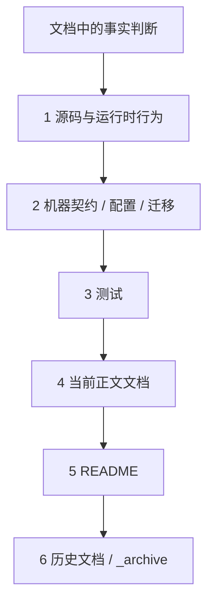

# 02-文档事实源与防漂移机制

## 1. 本文定位

本文是 `06-架构护栏/` 中关于 **文档事实源与防漂移** 的文档。

它不重复讲 AuthN、AuthZ、Identity、Suggest、REST、gRPC、SDK 的业务细节。

本文只回答：

```text
文档和代码冲突时以谁为准？
OpenAPI、proto、SDK、测试、README、正文，谁是事实源？
旧文档和 _archive 能不能作为当前事实？
代码或契约变化后，哪些文档必须同步？
如何避免旧路径、旧术语、旧接口重新写回当前文档？
```

一句话：

> docs 是解释层，不是机器契约；文档必须回链源码、契约和测试，不能靠历史记忆维护。

---

## 2. 30 秒结论

事实源优先级：

```text
源码真实行为
  -> 机器契约 / 配置 / 迁移
  -> 测试
  -> 当前模块正文文档
  -> README
  -> 历史文档 / _archive
```

具体规则：

```text
REST 路径、字段、schema：看 OpenAPI + REST handler + REST tests；
Suggest REST 路径、字段、schema：看 api/rest/suggest.v2.yaml + transport/rest/suggest + Suggest tests；
gRPC service、rpc、message：看 proto + generated code + gRPC tests；
SDK public API：看 pkg/sdk + SDK tests + examples；
架构依赖边界：看 architecture tests；
文档链接和旧事实回流：看 docs-hygiene；
_archive 只保存历史，不能作为当前事实源。
```

最小验证命令：

```bash
make docs-hygiene
```

涉及 REST：

```bash
make docs-swagger
make api-validate
```

涉及 gRPC：

```bash
make proto-gen
go test ./internal/apiserver/transport/grpc
```

涉及 SDK：

```bash
go test ./pkg/sdk/...
```

涉及 Suggest：

```bash
go test ./internal/apiserver/domain/suggest/... \
  ./internal/apiserver/application/suggest/... \
  ./internal/apiserver/infra/suggest/... \
  ./internal/apiserver/infra/mysql/suggest/... \
  ./internal/apiserver/transport/rest/suggest/...
```

---

## 3. 文档事实源总图



冲突时，不要按旧文档改代码。

应该：

```text
先查源码和机器契约；
再查测试；
最后修正文档；
必要时补测试。
```

---

## 4. docs 的定位

`docs/` 负责解释：

```text
系统边界；
运行链路；
设计取舍；
业务模型；
接入方式；
源码阅读路径；
辅助读模型；
失败边界；
验证方式。
```

`docs/` 不替代：

```text
REST OpenAPI；
gRPC proto；
SDK public API；
源码真实行为；
测试事实；
数据库 migration；
运行配置。
```

例如：

```text
文档可以解释 AuthZ Check 的语义；
但 Check 的 REST 字段以 OpenAPI 为准。

文档可以解释 gRPC 适合服务间调用；
但 gRPC service、rpc、field number 以 proto 为准。

文档可以解释 SDK 使用路径；
但 SDK 方法签名以 pkg/sdk 为准。
```

---

## 5. 模块级事实源

| 模块 | 主要事实源 |
| --- | --- |
| `00-概览` | `cmd/`、`process`、`container`、`transport` |
| `01-运行时` | `process`、`container`、`server`、`options` |
| `02-认证AuthN` | `domain/authn`、`application/authn`、`infra/token`、AuthN API |
| `03-授权AuthZ` | `domain/authz`、`application/authz`、`infra/casbin`、`casbin_model.conf` |
| `04-身份Identity` | `domain/identity`、`application/identity`、Identity API |
| `05-接入与契约` | `api/rest`、`api/grpc`、`pkg/sdk`、contract tests |
| `08-Suggest` | `domain/suggest`、`application/suggest`、`infra/suggest/search`、`infra/mysql/suggest`、`transport/rest/suggest`、`api/rest/suggest.v2.yaml`、Suggest tests |
| `06-架构护栏` | `architecture_test.go`、contract tests、docs hygiene |

不要把文档写成字段全集。

字段事实源应回到：

```text
api/rest/*.yaml
api/rest/suggest.v2.yaml
api/grpc/**/*.proto
pkg/sdk/*.go
migration files
config/options structs
internal/apiserver/application/suggest/config.go
```

---

## 6. _archive 的边界

`_archive` 是历史区。

它可以用于：

```text
理解历史背景；
查找旧命名；
追溯迁移原因；
辅助理解为什么改设计。
```

它不能用于：

```text
证明当前代码结构；
证明当前 API 路径；
证明当前业务术语；
证明当前架构边界；
证明当前运行行为。
```

如果从 `_archive` 迁回一个结论，必须重新核对：

```text
源码；
OpenAPI / proto / SDK；
测试；
当前正文文档。
```

---

## 7. 术语防漂移

当前文档必须避免旧术语回流。

| 当前术语 | 不应退回 |
| --- | --- |
| `ProfileLink` | `Ref`、`GuardianRef`、`identity refs` |
| `rolebinding` | 内部 `assignment` 包 |
| `assignment` | 只能作为 REST / proto / SDK wire term |
| `transport/rest`、`transport/grpc` | 旧 `interface` 包 |
| `process` | 旧 `server/router` 启动模型 |
| `infra/token/jwt`、`infra/token/keyset` | 旧 `infra/jwt` |
| `transactional outbox` | 普通 best-effort publish |
| `Casbin facts` | AuthZ 领域模型 |
| `TenantDomain` | 数字型 `tenant_id` / `DefaultTenantID` / 业务 `org_id` |
| `OrgID` | IAM 授权域 / Casbin domain / tenant domain |
| `Suggest` | AuthN/AuthZ/Identity 核心域、完整搜索服务、完整组织权限系统 |
| `ProfileAccessScope` | 逐条 Casbin Check、ProfileLink 直接当权限、全局可见结果 |
| `ProfileSearchTerm` | REST DTO、Profile 聚合本体、数据库字段全集 |
| `ProfileSuggestionRuntime` | 包级全局 active store、直接 MySQL 查询 suggest |
| `mobile_mask` | 明文 `mobile`、手机号数组、手机号命中 profileIDs |

如果文档中出现退役路径、旧路由、旧术语，`make docs-hygiene` 应尽量拦截。

---

## 8. REST / gRPC / SDK 防漂移

### 8.1 REST

事实源：

```text
api/rest
internal/apiserver/transport/rest
REST tests
```

护栏：

```text
router_matrix_test.go
scripts/check-route-contracts.py
scripts/check-openapi-contracts.py
make api-validate
```

修改 REST 时检查：

```text
OpenAPI；
REST handler；
Application command/query；
SDK REST client；
前端/接入方；
docs/05 REST 文档。
```

---

### 8.1.1 Suggest REST

事实源：

```text
api/rest/suggest.v2.yaml
internal/apiserver/transport/rest/suggest
internal/apiserver/application/suggest
internal/apiserver/domain/suggest
internal/apiserver/infra/suggest
Suggest tests
```

护栏：

```text
OpenAPI suggest 契约；
REST handler tests；
application/suggest tests；
domain/suggest tests；
infra/suggest/search tests；
docs/08-Suggest 文档；
```

修改 Suggest REST 时检查：

```text
api/rest/suggest.v2.yaml；
transport/rest/suggest DTO / handler；
application/suggest Service / DTO；
domain/suggest Query / ProfileSearchTerm / mobile_mask；
ProfileAccessScope 过滤语义；
RateLimiter / Metrics / DegradedService；
docs/05 REST 文档；
docs/08-Suggest 相关文档。
```

特别禁止：

```text
返回明文 mobile；
跳过 ProfileAccessScope 过滤；
把 tenant_id 当 org_id；
把 Suggest 写成逐条调用 Casbin；
把索引未初始化时改成直接查 MySQL 返回全局结果。
```

---

### 8.2 gRPC

事实源：

```text
api/grpc
.proto files
generated code
internal/apiserver/transport/grpc
```

护栏：

```text
proto_contract_test.go
make proto-gen
```

修改 gRPC 时检查：

```text
proto；
generated code；
gRPC service implementation；
container registration；
SDK gRPC client；
docs/05 gRPC / SDK 文档。
```

---

### 8.3 SDK

事实源：

```text
pkg/sdk
pkg/sdk public API
SDK tests
SDK examples
```

护栏：

```text
pkg/sdk/public_api_compile_test.go
go test ./pkg/sdk/...
```

修改 SDK public API 时检查：

```text
SDK tests；
examples；
qs-server 接入代码；
docs/05 SDK / qs-server 文档。
```

---

## 9. 文档卫生检查

基础命令：

```bash
make docs-hygiene
```

核心脚本：

```text
scripts/check-docs-links.py
```

它主要检查：

```text
Markdown 链接是否存在；
活跃文档是否引用退役路径；
活跃文档是否引用旧路由；
活跃文档是否引用旧术语。
活跃文档是否把 tenant_id 冒充 org_id；
活跃文档是否把 mobile_mask 写回明文 mobile；
活跃文档是否把 Suggest 写成 IAM 核心身份域。
```

它默认不检查 `_archive`。

它不能检查：

```text
某段业务解释是否准确；
Mermaid 图语义是否正确；
某个接口字段是否遗漏；
某个源码函数是否仍存在；
```

所以 `docs-hygiene` 是最低门槛，不是完整质量保证。

---

## 10. 代码变更触发的文档检查

### 10.1 修改 AuthN

检查：

```text
docs/02-认证AuthN；
docs/05-接入与契约；
REST AuthN OpenAPI；
gRPC AuthN proto；
SDK AuthN client。
```

### 10.2 修改 AuthZ

检查：

```text
docs/03-授权AuthZ；
docs/05-接入与契约；
REST AuthZ OpenAPI；
gRPC AuthZ proto；
SDK AuthZ client；
qs-server AuthZ Check 示例。
```

### 10.3 修改 Identity

检查：

```text
docs/04-身份Identity；
docs/05-接入与契约；
REST Identity OpenAPI；
gRPC Identity proto；
SDK Identity client；
ProfileLink 相关说明。
```

### 10.4 修改 Suggest

检查：

```text
docs/08-Suggest；
docs/01-运行时；
docs/05-接入与契约；
docs/06-架构护栏；
api/rest/suggest.v2.yaml；
transport/rest/suggest；
application/suggest；
domain/suggest；
infra/suggest/search；
infra/mysql/suggest；
Suggest tests。
```

如果修改以下内容，必须同步文档：

```text
Suggest REST path / query / response；
ProfileSuggestItem / REST DTO；
ProfileAccessScope 字段与过滤顺序；
ProfileSearchTerm 字段与索引语义；
Trie / Hash / Runtime 行为；
Full / Delta refresh；
Delta tombstone 协议；
RateLimiter / Metrics / DegradedService；
mobile_mask / DisableMobileMask；
TenantDomain / OrgID 边界。
```

### 10.5 修改 REST / gRPC / SDK

检查：

```text
docs/05-接入与契约；
如果涉及 Suggest REST，同步 docs/08-Suggest；
OpenAPI / proto / pkg/sdk；
contract tests；
examples；
qs-server 接入说明。
```

### 10.6 修改架构边界

检查：

```text
internal/pkg/architecture/architecture_test.go；
docs/06-架构护栏；
相关模块 README。
```

不要只删除失败测试。

如果边界变化，必须说明：

```text
旧边界为什么不适用；
新边界是什么；
新护栏如何保护它。
```

---

## 11. 文档写作规则

文档应该写：

```text
场景；
链路；
边界；
事实源入口；
验证命令；
失败语义；
维护规则。
如果是 Suggest，还要写明权限过滤、手机号安全和降级语义。
```

文档不应该大量复制：

```text
完整 OpenAPI schema；
完整 proto message；
SDK 全量 method 列表；
数据库字段全集；
临时内部函数名；
Suggest 索引全量内存结构快照；
明文手机号示例；
```

原因：

```text
复制越多，漂移越快。
```

如果必须给示例，应保持短小，并标明：

```text
字段以 OpenAPI / proto / SDK public API 为准。
```

---

## 12. 发布前检查清单

发布或重写文档前，至少检查：

```text
1. 事实能落到源码、契约或测试；
2. 没有从 _archive 直接复制当前结论；
3. 没有旧术语、旧路径、旧路由回流；
4. REST 字段没有替代 OpenAPI；
5. gRPC 字段没有替代 proto；
6. SDK 方法没有替代 pkg/sdk；
7. 链接真实存在；
8. README 与正文目录一致；
9. Mermaid 图与当前链路一致；
10. make docs-hygiene 通过。
11. 如果涉及 Suggest，docs/08-Suggest、REST 契约、运行时文档和本护栏文档已同步；
12. active docs 中没有 tenant_id 冒充 org_id；
13. active docs 中没有把 Suggest 写成 IAM 核心身份域；
14. active docs 中没有把 mobile_mask 写回明文 mobile；
15. active docs 中没有把 ProfileAccessScope 写成逐条 Casbin Check。
```

涉及接口或 SDK 时，再补：

```text
REST：make docs-swagger && make api-validate；
gRPC：make proto-gen && go test ./internal/apiserver/transport/grpc；
SDK：go test ./pkg/sdk/...
Suggest：go test ./internal/apiserver/domain/suggest/... ./internal/apiserver/application/suggest/... ./internal/apiserver/infra/suggest/... ./internal/apiserver/transport/rest/suggest/...。
```

---

## 13. 常见误区

### 13.1 文档写了就是事实

错误。

文档是解释层，事实要回到源码、机器契约和测试。

---

### 13.2 OpenAPI 有路径，运行时一定注册

不一定。

还要看 REST router 和 router matrix test。

---

### 13.3 proto 声明 service，运行时一定可用

不一定。

还要看 transport registration、container registration 和 module 初始化。

---

### 13.4 SDK README 示例就是全部事实

不完整。

SDK public API 要看 `pkg/sdk` 和 compile test。

---

### 13.5 docs-hygiene 通过就说明文档完全正确

错误。

它只检查链接和退役事实，业务解释仍需人工核对。

---

### 13.6 配置 YAML 有字段就说明运行时使用

不一定。

还要看 Options struct、mapstructure tag 和实际读取位置。

---

### 13.7 Suggest 文档写了“搜索”，就可以当完整搜索服务

错误。

Suggest 是 Profile 联想搜索读模型，服务 operating 后台 autocomplete。

它不是全文检索服务，不是完整组织权限系统，也不是 AuthZ 权限中心。

---

### 13.8 `tenant_id` 和 `org_id` 可以在文档里混用

错误。

当前约定是：

```text
TenantDomain = IAM 授权域 / Casbin domain；
OrgID        = 业务组织范围。
```

Suggest 数据权限主路径使用 `OrgID / OperatorID / ProfileIDs`，不应把 tenant_id 写成 org_id。

---

### 13.9 Suggest 返回手机号方便前端展示

错误。

生产 REST response 应返回 `mobile_mask`，不应返回明文手机号。

手机号形态关键词还需要额外授权、限流、日志脱敏和 ProfileAccessScope 过滤。

---

## 14. 验证建议

基础文档检查：

```bash
make docs-hygiene
```

架构边界：

```bash
go test ./internal/pkg/architecture
```

REST：

```bash
make docs-swagger
make api-validate
```

Docker 不可用时：

```bash
python scripts/check-route-contracts.py
python scripts/check-openapi-contracts.py
```

gRPC：

```bash
make proto-gen
go test ./internal/apiserver/transport/grpc
```

SDK：

```bash
go test ./pkg/sdk/...
```

Suggest：

```bash
go test ./internal/apiserver/domain/suggest/... \
  ./internal/apiserver/application/suggest/... \
  ./internal/apiserver/infra/suggest/... \
  ./internal/apiserver/infra/mysql/suggest/... \
  ./internal/apiserver/transport/rest/suggest/...
```

---

## 15. 本文总结

文档事实源与防漂移机制的核心是：

```text
docs 解释事实；
源码产生事实；
OpenAPI / proto / SDK 定义机器契约；
测试保护边界；
Suggest 文档解释辅助读模型，但事实回到 Suggest 源码、OpenAPI 和测试；
_archive 只保存历史。
```

核心规则是：

```text
源码证明运行行为；
OpenAPI/proto 证明接口契约；
pkg/sdk 证明 SDK 公开 API；
api/rest/suggest.v2.yaml 和 transport/rest/suggest 证明 Suggest REST 契约；
tests 证明边界没有回退；
docs-hygiene 证明链接和旧事实没有回流；
_archive 不能证明当前事实。
```

如果只记住一句话：

> IAM 的活跃文档只能解释当前源码、机器契约和测试已经支持的事实；Suggest 这类辅助读模型也必须回到源码、OpenAPI 和测试确认，历史材料只能给线索，不能当事实源。
