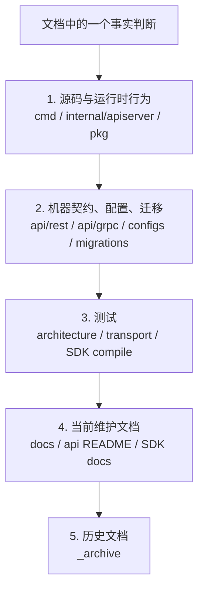

# 文档事实源与防漂移机制

## 本文回答

本文回答：IAM 文档体系如何判断“什么才是当前事实”；源码、OpenAPI、proto、SDK、配置、迁移、测试、当前文档、历史文档之间的优先级如何排序；为什么 `docs/` 是解释层而不是机器契约；文档如何通过 `make docs-hygiene`、REST/gRPC/SDK 契约测试和架构测试防止漂移；新增或修改文档时应该如何选择事实源、如何验证、如何避免把旧术语和旧路径重新写回当前正文。

读完本文，你应该能回答：

- `docs/` 在 IAM 中的定位是什么；
- REST 字段和路径应该以哪里为准；
- gRPC service、message、RPC 应该以哪里为准；
- SDK 公开 API 应该以哪里为准；
- 源码、测试、契约和当前文档冲突时如何判断；
- `_archive/` 能不能作为当前事实源；
- 为什么不能从旧文档直接复制当前架构结论；
- `make docs-hygiene` 检查什么；
- REST / gRPC / SDK 防漂移机制分别是什么；
- 文档中哪些术语必须统一；
- 新增文档、修改 API、重构源码时应该跑哪些验证；
- 第一版文档发布前应该检查什么。

---

## 30 秒结论

IAM 文档的核心原则是：

> `docs/` 是解释层，不是机器契约本身。

事实源优先级是：

```text
源码与运行时行为
  -> 机器契约、配置、迁移
  -> 架构测试、契约测试、SDK compile tests
  -> 当前维护文档
  -> 历史文档与归档材料
```

具体规则：

| 问题 | 优先事实源 |
| --- | --- |
| 服务如何启动 | `cmd/`、`internal/apiserver/process` |
| 模块如何装配 | `internal/apiserver/container`、`internal/apiserver/container/assembler` |
| REST 路径、字段、schema | `api/rest/*.yaml` |
| REST 路由是否真的注册 | `internal/apiserver/transport/rest`、`router_matrix_test.go` |
| gRPC service / RPC / message | `api/grpc/iam/**/v2/*.proto` |
| gRPC service 是否注册 | `container/grpc_registry.go`、`transport/grpc/registry.go`、`proto_contract_test.go` |
| SDK 公开 API | `pkg/sdk`、`pkg/sdk/public_api_compile_test.go` |
| 架构依赖边界 | `internal/pkg/architecture/architecture_test.go` |
| 文档链接和退役事实 | `scripts/check-docs-links.py` |
| 历史背景 | `docs/_archive`，但不能作为当前事实源 |

当前文档防漂移的最小验证命令是：

```bash
make docs-hygiene
```

涉及 REST/OpenAPI 时再跑：

```bash
make docs-swagger
make api-validate
```

涉及 gRPC/proto 时再跑：

```bash
make proto-gen
go test ./internal/apiserver/transport/grpc
```

涉及 SDK 对外 API 时再跑：

```bash
go test ./pkg/sdk
```

---

## 主图：文档事实源优先级



---

## 重点速查

| 主题 | 当前规则 | 代码证据 |
| --- | --- | --- |
| docs 定位 | `docs/` 是解释层，REST/gRPC/SDK/运行行为各有事实源。 | [../../docs/README.md](../../docs/README.md) |
| 写作约定 | 活跃文档以源码、契约、测试、当前文档、历史材料为事实源优先级。 | [../../docs/CONTRIBUTING-DOCS.md](../../docs/CONTRIBUTING-DOCS.md) |
| `_archive` 边界 | `_archive` 只保存历史材料，不作为当前事实源。 | [../../docs/README.md](../../docs/README.md)、[../../docs/CONTRIBUTING-DOCS.md](../../docs/CONTRIBUTING-DOCS.md) |
| 文档卫生命令 | `make docs-hygiene` 调用 `python scripts/check-docs-links.py`。 | [../../Makefile](../../Makefile)、[../../scripts/check-docs-links.py](../../scripts/check-docs-links.py) |
| 文档卫生检查范围 | README、docs、api、pkg/sdk README、pkg/sdk/docs。 | [../../scripts/check-docs-links.py](../../scripts/check-docs-links.py) |
| 文档卫生跳过什么 | `.git`、`node_modules`、`vendor`、`_archive`。 | [../../scripts/check-docs-links.py](../../scripts/check-docs-links.py) |
| 文档卫生检查退役事实 | 旧 interface 包、旧 auth 路由、旧 ref 术语、旧 assignment 包等。 | [../../scripts/check-docs-links.py](../../scripts/check-docs-links.py) |
| REST 路由覆盖 | `router_matrix_test.go` 检查关键路由和 OpenAPI 覆盖。 | [../../internal/apiserver/transport/rest/router_matrix_test.go](../../internal/apiserver/transport/rest/router_matrix_test.go) |
| REST route contract | `check-route-contracts.py` 比较 swagger routes 与 `api/rest` specs。 | [../../scripts/check-route-contracts.py](../../scripts/check-route-contracts.py) |
| REST schema contract | `check-openapi-contracts.py` 比较 swagger definitions 与 OpenAPI schemas。 | [../../scripts/check-openapi-contracts.py](../../scripts/check-openapi-contracts.py) |
| gRPC service contract | `proto_contract_test.go` 确认 proto service 有对应 Register 调用。 | [../../internal/apiserver/transport/grpc/proto_contract_test.go](../../internal/apiserver/transport/grpc/proto_contract_test.go) |
| SDK public API | `public_api_compile_test.go` 固定公开包和关键符号。 | [../../pkg/sdk/public_api_compile_test.go](../../pkg/sdk/public_api_compile_test.go) |
| 架构依赖边界 | `architecture_test.go` 扫描依赖、退役包、AuthZ/Casbin 边界等。 | [../../internal/pkg/architecture/architecture_test.go](../../internal/pkg/architecture/architecture_test.go) |

---

## 1. `docs/` 的定位

`docs/` 是解释层。

它负责说明：

```text
系统边界
运行链路
设计取舍
业务模型
接入方式
源码阅读路径
失败边界
验证方式
```

它不负责替代：

```text
REST OpenAPI
gRPC proto
SDK public API
源码行为
测试事实
```

这意味着：

- 文档可以解释 `AuthZ Check` 为什么这样设计；
- 但 `AuthZ Check` 的 REST request 字段以 OpenAPI 为准；
- 文档可以解释 gRPC 适合服务间调用；
- 但 gRPC service、RPC、field number 以 proto 为准；
- 文档可以解释 SDK 接入路径；
- 但 SDK 公开 API 以 `pkg/sdk` 和 compile test 为准。

### 为什么要这样分层

如果文档直接复制字段表、proto message、SDK method 列表，很快就会漂移。  
文档应该解释的是：

```text
这些契约如何使用
为什么这么设计
什么时候应该选哪条链路
哪些失败边界要注意
读者应该去哪里验证事实
```

---

## 2. 事实源优先级

文档中出现事实冲突时，按以下顺序判断。

### 2.1 第一优先级：源码与运行时行为

包括：

```text
cmd/
internal/apiserver/
internal/pkg/
pkg/
```

适合回答：

- 服务如何启动；
- container 如何初始化模块；
- REST/gRPC 如何注册；
- TokenIssuer 如何签发 token；
- AuthZ committer 如何写入 facts；
- ProfileLink 是否软撤销；
- Outbox relay 如何重试。

示例：

```text
“runtime reload 失败是否回滚 DB facts？”
```

应该看：

```text
application/authz/policy/committer.go
committer_test.go
```

而不是只看文档描述。

### 2.2 第二优先级：机器契约、配置、迁移

包括：

```text
api/rest
api/grpc
configs
internal/pkg/migration/migrations
internal/apiserver/docs/swagger.yaml
```

适合回答：

- REST 路径和字段是什么；
- gRPC service 和 RPC 是什么；
- 配置字段如何命名；
- 迁移脚本是否存在某个字段/索引；
- swagger 与 OpenAPI 是否对齐。

示例：

```text
“REST LoginV2 支持哪些 auth_method？”
```

应该看：

```text
api/rest/authn.v2.yaml
transport/rest/authn/request/auth.go
```

### 2.3 第三优先级：测试

包括：

```text
internal/pkg/architecture
transport/rest tests
transport/grpc tests
pkg/sdk compile tests
contract scripts
```

适合回答：

- 哪些依赖方向被强制禁止；
- 哪些路由必须被注册；
- proto service 是否必须有 registration；
- SDK 哪些符号属于公开 API；
- 文档不能引用哪些旧事实。

测试不是低优先级。  
有些设计约束只在测试中明确表达，例如：

```text
REST router 不依赖 container/viper
AuthZ domain 不出现 Casbin p/g/r
docs 不引用 retired references
```

### 2.4 第四优先级：当前维护文档

包括：

```text
docs/
api/README.md
api/rest/README.md
api/grpc/README.md
pkg/sdk/docs/README.md
```

当前维护文档用于解释系统，但不能覆盖源码、契约和测试。

### 2.5 第五优先级：历史文档和归档材料

包括：

```text
docs/_archive
历史报告
旧分析
旧迁移说明
```

这些材料只能用于：

```text
了解历史背景
追溯为什么改名
寻找迁移线索
```

不能直接作为当前事实源。

---

## 3. 当前文档体系的事实源地图

| 文档目录 | 主要事实源 |
| --- | --- |
| `00-概览` | `cmd/`、`internal/apiserver/process`、`container`、`transport`、架构测试 |
| `01-运行时` | `process`、`container`、`server`、`grpc`、`options`、`runtime tests` |
| `02-认证AuthN` | `application/authn`、`domain/authn`、`infra/token`、`transport/rest/authn`、`api/rest/authn`、`api/grpc/authn` |
| `03-授权AuthZ` | `domain/authz`、`application/authz`、`infra/casbin`、`infra/mysql/casbinrule`、`configs/casbin_model.conf`、`api/rest/authz`、`api/grpc/authz` |
| `04-身份Identity` | `domain/uc/user`、`domain/uc/profile`、`domain/uc/profilelink`、`application/uc`、`transport/rest/identity`、`api/rest/identity`、`api/grpc/identity` |
| `05-接入与契约` | `api/rest`、`api/grpc`、`pkg/sdk`、contract tests、SDK compile tests |
| `06-架构护栏` | `architecture_test.go`、contract tests、docs hygiene、Makefile、CONTRIBUTING-DOCS |

### 文档不是字段清单

尤其是 `05-接入与契约`：

- 不复制完整 OpenAPI schema；
- 不复制完整 proto message；
- 不复制 SDK 每个 method 的签名；
- 只解释接入模型、选择规则、边界和验证方式。

字段事实回链到：

```text
api/rest/*.yaml
api/grpc/**/*.proto
pkg/sdk/*.go
```

---

## 4. `_archive` 的边界

`_archive` 是历史区。

它可以用于：

```text
看旧架构怎么演化
查找历史命名
理解为什么某些术语被废弃
追溯旧分析和迁移背景
```

它不能用于：

```text
证明当前代码事实
证明当前 API 路径
证明当前模块结构
证明当前业务术语
证明当前架构边界
```

### 为什么 `_archive` 不参与默认 docs hygiene

`check-docs-links.py` 会跳过：

```text
_archive
```

因为归档文档本来就可能保留旧路径、旧术语、旧结论。  
如果让它参与当前文档卫生检查，会产生大量无意义失败。

但反过来，这也意味着：

```text
活跃正文不能依赖 _archive 才能成立
```

如果从 `_archive` 迁回一个结论，必须重新核对源码、契约或测试。

---

## 5. 术语防漂移

当前文档必须统一的关键术语：

| 当前术语 | 不应退回 |
| --- | --- |
| `ProfileLink` | `Ref`、`GuardianRef`、`identity refs` |
| `rolebinding` | 内部 `assignment` 包 |
| `assignment` | 只能作为 REST/proto wire term |
| `process` | 不能写成旧 `server/router` 包 |
| `transport/rest`、`transport/grpc` | 不能写成旧 `interface` 包 |
| `application/authn/token` | 不能写成旧 `domain/authn/token` |
| `infra/token/jwt`、`infra/token/keyset` | 不能写成旧 `infra/jwt` |
| `transactional outbox` | 不能写成普通 best-effort publish |
| `Casbin facts` | 不能写成 AuthZ 业务模型 |

`docs-hygiene` 中的 retired references 会直接拦截一批旧路径和旧术语，例如：

```text
internal/apiserver/interface
internal/apiserver/application/authz/assignment
internal/apiserver/domain/authz/assignment
internal/apiserver/infra/jwt
/api/v2/auth/login
/api/v2/identity/refs
RefQuery
RefCommand
```

---

## 6. 文档写作结构

长文建议结构：

```text
# 标题

## 本文回答
## 30 秒结论
## 主图
## 重点速查
## 核心模型 / 核心链路
## 为什么这么设计
## 失败边界 / 安全边界 / 降级边界
## 设计模式
## 推荐源码阅读路线
## 验证建议
## 本文总结
```

不是每篇都必须机械套满。  
但第一版重建文档至少应该包含：

```text
本文回答
30 秒结论
核心链路
代码证据
验证建议
```

### 为什么要统一结构

统一结构的价值是：

- 读者能快速判断本文是否回答自己的问题；
- 30 秒结论让精读前先建立骨架；
- 主图把链路压缩成可记忆模型；
- 重点速查给源码入口；
- 验证建议让文档能落地；
- 推荐阅读路线让读者继续读代码。

---

## 7. 文档卫生检查

命令：

```bash
make docs-hygiene
```

Makefile 中实际执行：

```bash
python scripts/check-docs-links.py
```

### 7.1 检查范围

默认检查：

```text
README.md
docs
api
pkg/sdk/README.md
pkg/sdk/docs
```

### 7.2 跳过目录

跳过：

```text
.git
node_modules
vendor
_archive
```

### 7.3 检查内容

脚本做两类检查。

第一类：Markdown 链接是否存在。

例如：

```markdown
[REST API](../api/rest)
```

必须能解析到真实文件或目录。

第二类：是否引用退役事实。

例如活跃文档中出现：

```text
/api/v2/auth/login
internal/apiserver/interface
RefQuery
```

就会失败。

### 7.4 这不能检查什么

`docs-hygiene` 不能判断：

- 某段业务解释是否准确；
- 某个 Mermaid 图是否语义正确；
- 某个源码路径里的函数是否还存在；
- 某个字段含义是否过期；
- 某篇文档是否遗漏了关键事实。

所以它是最低门槛，不是完整质量保证。

---

## 8. REST 契约防漂移

REST 防漂移有三层。

### 8.1 OpenAPI 事实源

REST 路径、字段、schema 的机器契约是：

```text
api/rest/*.yaml
```

当前包括：

```text
authn.v2.yaml
authz.v2.yaml
identity.v2.yaml
idp.v2.yaml
suggest.v2.yaml
```

文档中不要手写大段字段表替代 OpenAPI。

### 8.2 Router matrix test

`router_matrix_test.go` 检查：

- 关键路由是否实际注册；
- OpenAPI 是否覆盖已注册 public routes；
- 某些旧路由不应重新出现。

这保护的是：

```text
运行时 Gin routes
  与
api/rest OpenAPI
```

之间不漂移。

### 8.3 Route/schema contract scripts

`scripts/check-route-contracts.py` 比较：

```text
internal/apiserver/docs/swagger.yaml
api/rest/*.yaml
```

检查路由是否对齐。

`scripts/check-openapi-contracts.py` 比较：

```text
swagger definitions
OpenAPI component schemas
```

检查 schema 字段和 required 是否漂移。

### 8.4 验证命令

```bash
make docs-swagger
make api-validate
```

如果 Docker daemon 不可用，至少跑：

```bash
python scripts/check-route-contracts.py
python scripts/check-openapi-contracts.py
```

---

## 9. gRPC 契约防漂移

gRPC 的机器契约是：

```text
api/grpc/iam/**/v2/*.proto
```

当前模块：

```text
authn
authz
identity
idp
```

### 9.1 Proto contract test

`proto_contract_test.go` 会：

```text
扫描 api/grpc/iam/**/*.proto
  -> 找 service <Name>
  -> 扫描 transport/grpc/service Go 源码
  -> 检查 Register<Name>Server 是否存在
```

这防止：

```text
proto 声明了 service
但运行时没有注册代码
```

### 9.2 它不能保证什么

它不能保证：

- RPC 每个字段都被正确使用；
- service runtime 一定可用；
- module 一定初始化成功；
- ACL 一定允许调用；
- SDK 一定封装了这个 RPC。

所以新增 gRPC service 时，还要更新：

```text
transport/grpc/service/*
container/grpc_registry.go
SDK 或使用文档
tests
docs
```

### 9.3 验证命令

```bash
make proto-gen
go test ./internal/apiserver/transport/grpc
```

---

## 10. SDK 契约防漂移

SDK 的公开事实源是：

```text
pkg/sdk
pkg/sdk/public_api_compile_test.go
pkg/sdk/docs
pkg/sdk/_examples
```

### 10.1 Public API compile test

`public_api_compile_test.go` 固定：

- `sdk.NewClient`;
- `sdk.Config`;
- `sdk.ConfigFromEnv`;
- `auth/loginv2.NewClient`;
- `auth/jwks.NewJWKSManager`;
- `auth/verifier.NewTokenVerifier`;
- `auth/serviceauth.NewServiceAuthHelper`;
- `authz.NewClient`;
- `identity.NewClient`;
- `identity.NewProfileLinkClient`;
- `idp.NewClient`;
- `sdk/errors` facade。

如果这些公开符号被误删或签名不兼容，测试会编译失败。

### 10.2 SDK 文档事实源

SDK 文档应该以：

```text
pkg/sdk源码
public_api_compile_test
pkg/sdk/docs/07-migration-breaking-changes.md
```

为事实源。

尤其注意：

```text
pkg/sdk/transport
pkg/sdk/observability
高级 errors analyzer/matcher/handler
```

已经不是公开稳定 API，不应在当前接入文档中鼓励调用方使用。

### 10.3 验证命令

```bash
go test ./pkg/sdk
go test ./pkg/sdk/auth/...
go test ./pkg/sdk/authz
go test ./pkg/sdk/identity
go test ./pkg/sdk/idp
```

---

## 11. 架构依赖防漂移

架构依赖防漂移主要由：

```text
internal/pkg/architecture/architecture_test.go
```

负责。

它检查：

```text
domain 不依赖 infra/database
application 不依赖 transport/infra
REST router 不依赖 container/viper
runtime composition 不读 viper
assembler 使用 typed deps
assembler 不构造 transport
legacy interface 包不回流
AuthZ 不退回 assignment 包
Casbin facts 不进入 domain/transport/application
Suggest 不把 infra/trie/cron 语言带进 domain/application
UC 事务内调用使用 txCtx
```

这些护栏和文档事实源关系很密切。  
文档中如果写出了与这些测试相反的说法，基本就是文档错了。

### 验证命令

```bash
go test ./internal/pkg/architecture
```

---

## 12. 配置、迁移与运行行为事实源

### 12.1 配置事实源

配置事实不能只看 YAML 示例。  
应优先看：

```text
internal/apiserver/options
internal/pkg/options
internal/apiserver/process
internal/apiserver/container/runtime_options.go
```

原因是：

```text
configs/*.yaml 中可能保留示例字段、历史字段或尚未接入 Options 的字段
```

判断某个配置是否生效，要看：

```text
Options struct
mapstructure tag
ApplyTo / runtime conversion
process/container/transport 实际读取位置
```

### 12.2 迁移事实源

数据库结构、索引、约束应该看：

```text
internal/pkg/migration/migrations
```

例如 active self profile link 的约束不能只看文档说明，还要看 migration 里的：

```text
self_key
uk_active_self_profile_link
```

### 12.3 运行行为事实源

启动、降级、runtime task、shutdown 等，优先看：

```text
internal/apiserver/process
internal/apiserver/container
internal/pkg/server
internal/pkg/grpc
```

而不是从 README 或旧运行手册推断。

---

## 13. 文档中如何引用源码和契约

### 13.1 引用源码路径

文档中写关键判断时，应该提供源码入口。

例如：

```text
核心源码：
- internal/apiserver/application/authz/policy/committer.go
- internal/apiserver/application/authz/shared/version_event.go
```

不要只写：

```text
代码里有实现
```

### 13.2 引用机器契约

REST 字段：

```text
api/rest/authn.v2.yaml
```

gRPC RPC：

```text
api/grpc/iam/authz/v2/authz.proto
```

SDK 公开 API：

```text
pkg/sdk/public_api_compile_test.go
pkg/sdk/README.md
```

### 13.3 不要在 docs 中复制整段契约

文档可以给少量示例，但不要复制完整 schema。  
如果字段列表太长，应指向 OpenAPI/proto/SDK docs。

### 13.4 链接路径规则

- 使用相对路径；
- 文件名有空格时使用 `%20` 或确保 Markdown 能被解析；
- 指向目录时确认目录存在；
- 不链接不存在的待建文档；
- 暂未重建的文档可以用代码路径文本，避免断链。

---

## 14. 不同类型修改的防漂移流程

### 14.1 修改 REST API

检查：

```text
1. 修改 api/rest/*.yaml
2. 修改 transport/rest handler/router
3. 如有 swagger 注解，运行 make docs-swagger
4. 运行 make api-validate
5. 运行 go test ./internal/apiserver/transport/rest
6. 更新 docs/05-接入与契约/01-REST API契约.md
```

如果新增关键路由，考虑加入：

```text
router_matrix_test.go
```

### 14.2 修改 gRPC API

检查：

```text
1. 修改 proto
2. 不复用 field number
3. make proto-gen
4. 修改 transport/grpc/service
5. 修改 container/grpc_registry.go
6. go test ./internal/apiserver/transport/grpc
7. 如 SDK 封装，go test ./pkg/sdk
8. 更新 docs/05-接入与契约/02-gRPC API契约.md
```

### 14.3 修改 SDK 公开 API

检查：

```text
1. 修改 pkg/sdk
2. 更新 public_api_compile_test.go
3. 更新 pkg/sdk/README.md / docs
4. 更新 docs/05-接入与契约/03-SDK接入模型.md
5. go test ./pkg/sdk
```

### 14.4 修改架构边界

检查：

```text
1. 明确新边界
2. 修改 architecture_test.go 或新增测试
3. 更新 docs/06-架构护栏/*
4. go test ./internal/pkg/architecture
```

不要只删掉失败测试。  
如果测试不再适用，要给出新的边界和替代护栏。

### 14.5 修改业务模型

例如 AuthZ RoleBinding、Identity ProfileLink、AuthN Token 语义。

检查：

```text
1. 修改 domain/application/infra/transport
2. 补充业务测试
3. 检查 docs 中所有相关专题文档
4. 检查 REST/gRPC/SDK 契约是否受影响
5. make docs-hygiene
```

### 14.6 修改文档

检查：

```text
1. 找到源码或契约事实源
2. 避免从 _archive 直接复制当前结论
3. 相对链接可解析
4. 不引用退役路径/术语
5. make docs-hygiene
```

---

## 15. 发布检查清单

第一版文档发布前至少检查：

```text
1. docs/README.md 是唯一文档入口
2. 所有活跃文档链接有效
3. 每篇专题文档有“本文回答”
4. 每篇专题文档有“30 秒结论”
5. 每篇专题文档有源码入口或契约入口
6. REST 字段和路径不靠 docs 自己维护
7. gRPC service/RPC/message 不靠 docs 自己维护
8. SDK 公开 API 不靠 docs 自己维护
9. _archive 不作为当前事实源
10. ProfileLink / rolebinding / process / container / transport 术语统一
11. 没有退回旧 auth 路由、旧 ref、旧 assignment 包
12. make docs-hygiene 通过
13. 涉及 REST 时 make api-validate 或脚本替代检查通过
14. 涉及 gRPC 时 proto contract test 通过
15. 涉及 SDK 时 public API compile test 通过
```

---

## 16. 常见误区

### 误区一：文档写了就算事实

不对。  
文档是解释层。事实要回到源码、契约、测试验证。

### 误区二：OpenAPI 写了路径，运行时一定注册

不一定。  
运行时 registration 取决于 transport/router、module availability、middleware 条件。需要看 `transport/rest` 和 router matrix test。

### 误区三：proto 声明了 service，运行时一定可用

不一定。  
还需要 transport registration、container registration 和 module 初始化。

### 误区四：SDK README 示例就是全部事实

不完整。  
SDK 公开 API 还要看源码和 `public_api_compile_test.go`。

### 误区五：旧文档可以直接复制

不可以。  
旧文档只能提供线索，迁回活跃正文必须重新核对源码或契约。

### 误区六：docs-hygiene 通过就说明文档完全正确

不对。  
它只检查链接和退役事实。业务解释仍需人工核对事实源。

### 误区七：配置 YAML 里有字段就说明运行时使用

不一定。  
要看 Options struct、mapstructure tag 和 process/container/transport 实际读取。

---

## 17. 当前边界与待讨论点

### 17.1 docs-hygiene 不能解析所有语义漂移

它能发现断链和退役引用，但不能判断：

```text
某段设计解释是否已经过期
某个 Mermaid 图是否描述错了
某个“当前支持”是否被源码改变
```

因此核心事实仍要手动回链源码和契约。

### 17.2 Swagger 与 OpenAPI 是双轨

当前 REST 契约同时存在：

```text
internal/apiserver/docs/swagger.yaml
api/rest/*.yaml
```

脚本负责比较它们。  
文档不应把 swagger 当作唯一事实源，也不应忽略它和 OpenAPI 的差异。

### 17.3 _archive 是历史资产，不是垃圾桶

归档文档仍有价值，但必须和活跃文档隔离。  
不要删除所有历史分析；也不要让历史分析继续影响当前事实。

### 17.4 文档重建后需要持续维护

第一版重建完成只是起点。  
后续每次改代码、契约或 SDK，都应该判断是否影响 docs。

---

## 18. 设计模式

| 模式 | 为什么用 | IAM 落地 | 代价和边界 |
| --- | --- | --- | --- |
| Explanation Layer | 文档解释设计，不复制机器契约 | `docs/` 解释源码/API/SDK | 需要持续回链事实源 |
| Fact Source Priority | 冲突时要能判断谁优先 | 源码 -> 契约 -> 测试 -> 当前文档 -> 历史材料 | 文档作者必须核对代码 |
| Contract Tests | API 文档容易漂移 | REST route/schema scripts、gRPC proto contract | 不能替代业务测试 |
| Public API Compile Test | SDK 外部调用方依赖稳定符号 | `pkg/sdk/public_api_compile_test.go` | 只保护符号，不保护语义 |
| Retired Reference Gate | 旧术语最容易回流 | `check-docs-links.py` retired references | 需要维护 retired list |
| Archive Isolation | 历史材料有价值但不能混入当前事实 | `_archive` 被 docs hygiene 跳过 | 活跃文档不能依赖 archive |
| Source-linked Writing | 文档要能落到代码 | 每篇给源码/契约入口 | 写作成本更高，但可信度更高 |

---

## 19. 推荐源码阅读路线

### 第一轮：文档中心和写作约定

```text
docs/README.md
docs/CONTRIBUTING-DOCS.md
```

目标：理解 docs 定位、事实源优先级、术语规范、发布检查。

### 第二轮：文档卫生脚本

```text
scripts/check-docs-links.py
Makefile
```

目标：理解 `make docs-hygiene` 检查范围、跳过目录、retired references。

### 第三轮：REST 防漂移

```text
internal/apiserver/transport/rest/router_matrix_test.go
scripts/check-route-contracts.py
scripts/check-openapi-contracts.py
api/rest/*.yaml
```

目标：理解 OpenAPI、swagger、runtime routes 如何对齐。

### 第四轮：gRPC 防漂移

```text
internal/apiserver/transport/grpc/proto_contract_test.go
api/grpc/iam/*/v2/*.proto
internal/apiserver/container/grpc_registry.go
```

目标：理解 proto service 与 runtime registration 的关系。

### 第五轮：SDK 防漂移

```text
pkg/sdk/public_api_compile_test.go
pkg/sdk/README.md
pkg/sdk/docs/07-migration-breaking-changes.md
```

目标：理解 SDK 稳定公开面和已收回内部实现。

### 第六轮：架构护栏

```text
internal/pkg/architecture/architecture_test.go
```

目标：理解代码依赖边界如何被自动化保护。

---

## 20. 验证建议

基础文档检查：

```bash
make docs-hygiene
```

架构边界：

```bash
go test ./internal/pkg/architecture
```

REST 契约：

```bash
make docs-swagger
make api-validate
```

Docker 不可用时：

```bash
python scripts/check-route-contracts.py
python scripts/check-openapi-contracts.py
```

gRPC 契约：

```bash
make proto-gen
go test ./internal/apiserver/transport/grpc
```

SDK 公开面：

```bash
go test ./pkg/sdk
```

综合检查：

```bash
go test ./internal/pkg/architecture \
  ./internal/apiserver/transport/rest \
  ./internal/apiserver/transport/grpc \
  ./pkg/sdk

make docs-hygiene
```

---

## 21. 文档变更自检问题

写完一篇文档后，至少问自己：

```text
1. 这篇文档的核心事实能落到源码或契约吗？
2. 有没有把 API 字段复制成长期维护负担？
3. 有没有从 _archive 或旧文档复制当前结论？
4. 有没有使用旧术语：Ref、assignment internal、interface package、旧 auth route？
5. Mermaid 图是否和当前源码链路一致？
6. 链接是否真实存在？
7. 如果代码改了，哪条测试能发现文档可能漂移？
8. 如果契约改了，哪条脚本能发现文档或 OpenAPI/proto 可能漂移？
```

如果第 1 条回答不了，这篇文档就不应该发布。

---

## 本文总结

文档事实源与防漂移机制可以压缩成一句话：

> IAM 的活跃文档只负责解释当前源码、机器契约和测试已经证明的事实；REST/gRPC/SDK/架构/文档各有自动化护栏，历史材料只能作为线索，不能作为当前事实源。

核心规则是：

```text
源码证明运行行为
OpenAPI/proto 证明机器契约
tests 证明架构和契约边界
SDK compile test 证明公开 API
docs-hygiene 证明链接和退役事实没有回流
_archive 只证明历史
```

到这里，架构护栏两篇文档闭合：

```text
01-架构测试与依赖边界
  -> 代码结构如何防回退

02-文档事实源与防漂移机制
  -> 文档如何防过期、防断链、防旧事实回流
```

第一版文档体系的最后一层也随之闭合：

```text
系统总览
  -> 运行时
  -> AuthN
  -> AuthZ
  -> Identity
  -> 接入与契约
  -> 架构与文档护栏
```
