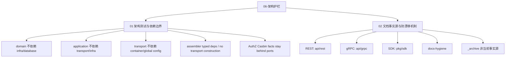
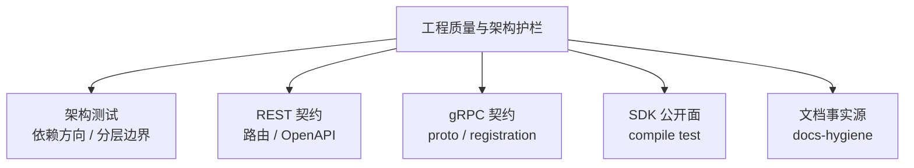
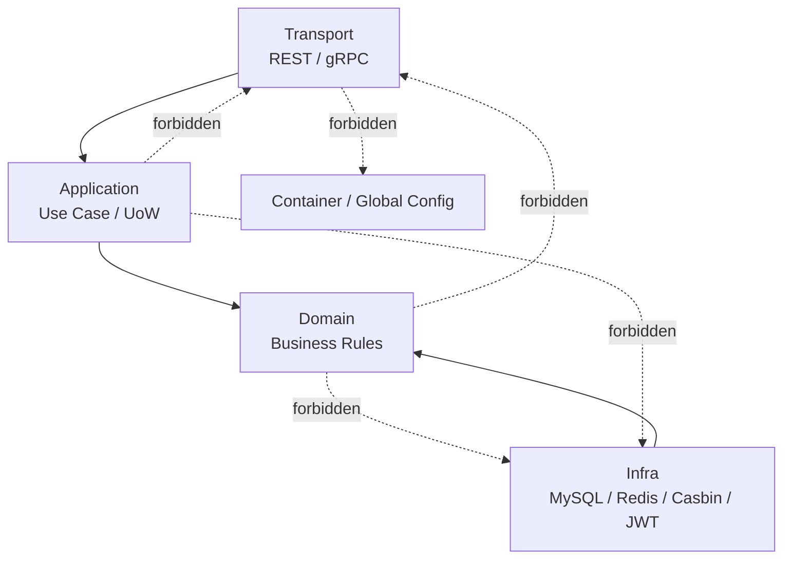

# 06-架构护栏

## 本文回答

`06-架构护栏/` 是 IAM 文档体系中解释 **如何用自动化规则防止架构边界、契约和文档事实源在长期演进中漂移** 的模块。

它回答：

1. IAM 为什么不能只靠“约定”维护分层架构；
2. architecture tests 具体保护哪些依赖边界；
3. REST/gRPC/SDK 契约如何防漂移；
4. AuthZ 为什么需要专项护栏防止 Casbin facts 污染领域模型；
5. 文档为什么也需要 facts source 和 docs-hygiene；
6. `_archive/` 与 active docs 的边界是什么；
7. 新增模块、接口、SDK API、文档时应该遵守哪些检查；
8. 面试或技术分享时如何把工程质量讲成项目亮点。

本目录只解释 **架构边界、契约边界和文档事实源**。  
具体业务链路在 AuthN、AuthZ、Identity、接入文档中展开。

---

## 30 秒结论

IAM 的工程质量不只靠单元测试，而是建立了多层自动化护栏：

```text
architecture tests
  -> 保护 domain / application / transport / container 的依赖方向

REST contract tests
  -> 保护 OpenAPI 与运行时路由一致

gRPC proto contract tests
  -> 保护 proto service 与 runtime registration 一致

SDK public API compile test
  -> 保护 Go SDK 对外稳定面

docs-hygiene
  -> 保护活跃文档链接、术语和事实源不漂移
```

一句话：

> **架构护栏的目标不是让代码好看，而是让 IAM 作为基础服务在长期演进中保持边界清楚、契约可信、文档可用。**

---

## 本目录文档

当前 `06-架构护栏/` 建议包含 2 篇正文文档：

```text
06-架构护栏/
├── README.md
├── 01-架构测试与依赖边界.md
└── 02-文档事实源与防漂移机制.md
```

| 文档 | 作用 | 读完后应该能回答 |
|---|---|---|
| `01-架构测试与依赖边界.md` | 解释代码层架构护栏 | domain/application/transport/container 的依赖方向如何被测试保护 |
| `02-文档事实源与防漂移机制.md` | 解释文档与契约防漂移 | docs、OpenAPI、proto、SDK、_archive 的事实源优先级如何维护 |

---

## 架构护栏知识地图



---

## 推荐阅读顺序

### 标准顺序

```text
01-架构测试与依赖边界
  -> 02-文档事实源与防漂移机制
```

原因：

1. 先理解代码层为什么不会轻易退化；
2. 再理解文档、契约和归档材料如何防止旧事实回流。

---

### 如果你要新增业务模块

推荐路径：

```text
01-架构测试与依赖边界.md
  -> ../00-概览/README.md
  -> ../01-运行时/README.md
```

重点关注：

```text
模块应该放在 application/domain/infra 哪一层
container 是否只做 composition root
transport 是否只消费 explicit deps
是否需要新增架构测试
```

---

### 如果你要新增 REST/gRPC/SDK 能力

推荐路径：

```text
02-文档事实源与防漂移机制.md
  -> ../05-接入与契约/README.md
  -> api/rest/README.md
  -> api/grpc/README.md
  -> pkg/sdk/README.md
```

重点关注：

```text
OpenAPI/proto/SDK public API 是否同步
runtime route/service 是否注册
contract tests 是否更新
docs 是否引用正确事实源
```

---

### 如果你要准备面试工程质量亮点

推荐路径：

```text
../08-宣讲/10-工程质量与架构护栏讲法.md
  -> 01-架构测试与依赖边界.md
  -> 02-文档事实源与防漂移机制.md
  -> ../08-宣讲/13-面试追问证据索引.md
```

重点关注：

```text
不是“写了很多测试”
而是“把容易漂移的边界变成自动化验证”
```

---

## 工程护栏总图



这张图表达的是：

```text
IAM 的工程质量不是单点测试
而是代码结构、机器契约、SDK 公开面、文档事实源共同构成的护栏体系
```

---

## 分层依赖护栏



这张图表达的是：

```text
业务规则向内
协议和基础设施向外
依赖方向不能反向穿透
```

---

## 主要架构护栏

| 护栏 | 保护什么 | 典型测试 |
|---|---|---|
| domain 不依赖 infra/database | 保持领域规则纯净 | `TestDomainPackagesDoNotAddInfrastructureDependencies` |
| application 不依赖 transport/infra | 保持用例层不绑定协议和基础设施 | `TestApplicationPackagesDoNotAddTransportOrInfrastructureDependencies` |
| REST router 不依赖 container/viper | transport 消费显式 deps，不导航组合根 | `TestRESTRouterDoesNotImportCompositionOrGlobalConfig` |
| runtime composition 不直接读 viper | 配置通过 typed options/deps 进入运行时 | `TestRuntimeCompositionDoesNotReadGlobalConfigDirectly` |
| assembler 使用 typed deps | 避免 `interface{}` 黑盒注入 | `TestAssemblerModulesUseTypedDependencies` |
| assembler 不构造 transport | 模块装配不创建 REST/gRPC 实现 | `TestAssemblerDoesNotConstructTransportImplementations` |
| legacy interface 包退役 | 防止旧 transport 包回流 | `TestLegacyInterfacePackageIsRetired` |
| container capability navigation 受控 | 只有 collector 文件能导航模块能力 | `TestContainerCapabilityNavigationStaysInCollectors` |
| AuthZ Casbin facts 不进入 domain | 保持 AuthZ 领域语言稳定 | `TestAuthzCasbinFactsStayBehindApplicationPorts` |
| root apiserver 只委托 process | 防止入口层重新拥有生命周期细节 | `TestRootAPIServerPackageOwnsOnlyRunDelegation` |

---

## REST / gRPC / SDK 契约护栏

### REST

REST 事实源：

```text
api/rest/*.yaml
```

运行时：

```text
internal/apiserver/transport/rest
```

护栏：

```text
router matrix test
route/schema contract
make docs-swagger
make api-validate
```

保护目标：

```text
运行时路由和 OpenAPI 不漂移
public routes 被 OpenAPI 覆盖
旧路由不重新回流
```

---

### gRPC

gRPC 事实源：

```text
api/grpc/iam/*/v2/*.proto
```

运行时：

```text
internal/apiserver/transport/grpc
```

护栏：

```text
proto_contract_test.go
make proto-gen
```

保护目标：

```text
proto 声明的 service 必须有 runtime registration
field number 不复用
proto / transport / SDK 同步演进
```

---

### SDK

SDK 事实源：

```text
pkg/sdk
```

护栏：

```text
pkg/sdk/public_api_compile_test.go
```

保护目标：

```text
sdk.NewClient
Config / ConfigFromEnv / ConfigFromViper
auth/loginv2
auth/jwks
auth/verifier
auth/serviceauth
authz
identity
idp
errors
```

不被无意 breaking change 破坏。

---

## 文档事实源护栏

文档不是机器契约本身。  
事实源优先级是：

1. 源码与运行时行为；
2. REST OpenAPI / gRPC proto / SDK public API / configs / migrations；
3. 架构测试和契约测试；
4. 当前维护文档；
5. `_archive/` 历史材料。

`docs-hygiene` 保护：

```text
active docs 链接存在
不引用退役路径
不引用旧路由
不引用旧术语
_archive 不作为当前事实源
```

---

## 代码证据入口

| 主题 | 代码 / 脚本入口 |
|---|---|
| 架构测试 | `internal/pkg/architecture/architecture_test.go` |
| REST contract test | `internal/apiserver/transport/rest/router_matrix_test.go` |
| gRPC proto contract | `internal/apiserver/transport/grpc/proto_contract_test.go` |
| SDK public API compile test | `pkg/sdk/public_api_compile_test.go` |
| docs-hygiene | `scripts/check-docs-links.py` |
| REST 契约事实源 | `api/rest/README.md`、`api/rest/*.yaml` |
| gRPC 契约事实源 | `api/grpc/README.md`、`api/grpc/iam/*/v2/*.proto` |
| SDK 事实源 | `pkg/sdk/README.md`、`pkg/sdk` |
| 文档中心事实源说明 | `docs/README.md` |
| 文档贡献规范 | `docs/CONTRIBUTING-DOCS.md` |

---

## 与其他目录的关系

| 目录 | 关系 |
|---|---|
| `00-概览` | 概览层说明系统分层；架构护栏解释这些分层如何被测试保护 |
| `01-运行时` | 运行时说明 process/container/transport；架构护栏防止这些层次混淆 |
| `02-认证AuthN` | AuthN 文档说明业务链路；架构护栏防止 REST handler 拥有登录方式分发 |
| `03-授权AuthZ` | AuthZ 是最需要专项护栏的模块，防止 Casbin facts 和 assignment 包回流 |
| `04-身份Identity` | Identity 文档说明 User/Profile/ProfileLink；架构护栏防止旧关系术语和 N+1 查询回流 |
| `05-接入与契约` | 接入文档说明 REST/gRPC/SDK；架构护栏提供 contract tests |
| `07-专题分析` | 专题分析解释为什么需要这些护栏 |
| `08-宣讲` | 宣讲模块把工程质量转成可面试表达 |
| `_archive` | 历史材料，不作为当前事实源 |

---

## 常见误区

### 误区一：架构护栏是洁癖

错误。  
架构护栏保护的是长期可维护性，不是目录审美。

---

### 误区二：有单元测试就够了

错误。  
单元测试验证业务行为。  
架构测试验证依赖边界和代码结构。  
契约测试验证机器契约与运行时一致性。

---

### 误区三：文档写完就可信

错误。  
文档也会漂移。  
必须明确事实源，并通过 docs-hygiene 检查 active docs。

---

### 误区四：Casbin 就是 AuthZ 领域模型

错误。  
Casbin 是 infra runtime engine。  
AuthZ 领域模型应保持 Role、Resource、Permission、RoleBinding、Scope。

---

### 误区五：SDK internal 包可以给业务方用

错误。  
SDK 对外稳定面只包括 README 中声明的公开包。  
`internal/transport`、`internal/observability`、`internal/errorsx` 不应被外部依赖。

---

### 误区六：_archive 可以作为当前实现参考

错误。  
`_archive/` 只保存历史材料，不作为当前事实源。

---

## 验证建议

架构护栏：

```bash
go test ./internal/pkg/architecture
```

REST 契约：

```bash
make docs-swagger
make api-validate
go test ./internal/apiserver/transport/rest
```

gRPC 契约：

```bash
make proto-gen
go test ./internal/apiserver/transport/grpc
```

SDK 公开面：

```bash
go test ./pkg/sdk/...
```

文档卫生：

```bash
make docs-hygiene
```

全量常用检查：

```bash
go test ./internal/pkg/architecture \
  ./internal/apiserver/transport/rest \
  ./internal/apiserver/transport/grpc \
  ./pkg/sdk/...

make docs-hygiene
```

---

## 维护规则

### 1. README 只做护栏模块入口

本 README 负责：

```text
说明架构护栏回答什么
列出两篇正文
说明各类护栏保护什么
提供代码证据入口
提供验证命令
```

详细测试解释放到正文文档。

---

### 2. 新增边界必须可测试

如果新增模块、层次或契约，应考虑是否需要新增：

```text
architecture test
contract test
compile test
docs-hygiene rule
```

不要只靠人工 review。

---

### 3. 机器契约变化必须同步文档

涉及 REST：

```text
api/rest
transport/rest
docs/05-接入与契约
docs/08-宣讲
```

涉及 gRPC：

```text
api/grpc
transport/grpc
pkg/sdk
docs/05-接入与契约
```

涉及 SDK：

```text
pkg/sdk
pkg/sdk/public_api_compile_test.go
pkg/sdk/README.md
docs/05-接入与契约
```

---

### 4. 不把旧事实写回 active docs

尤其避免：

```text
旧 interface 包
旧 REST route
旧 Identity 关系术语
旧 AuthZ assignment 包
旧 SDK internal public API
```

这些如需保留，只能放在 `_archive` 或迁移说明中，并明确标注历史语义。

---

### 5. 架构测试失败不要简单删测试

如果 architecture test 失败，优先判断：

```text
是不是边界真的被破坏？
是否应该新增 port/factory seam？
是否应该更新 typed deps？
是否应该扩展测试规则？
```

不要为了通过 CI 直接删除护栏。

---

## 本文总结

`06-架构护栏/` 解释的是 IAM 如何在长期演进中保持架构边界和事实源可信。

核心心智是：

```text
架构不是靠口头约定维护
契约不是靠人工记忆同步
文档不是写完就永远可信
```

它的主线是：

```text
architecture tests
  -> 保护分层和依赖方向

REST/gRPC contract tests
  -> 保护机器契约和运行时注册

SDK compile test
  -> 保护 Go SDK 对外公开面

docs-hygiene
  -> 保护 active docs 链接、术语和事实源
```

读完本目录后，读者应该能回答：

```text
domain 为什么不能依赖 infra？
application 为什么不能依赖 transport？
REST router 为什么不能导航 container？
AuthZ 为什么不能让 Casbin facts 进入 domain？
REST/gRPC/SDK 如何防漂移？
文档如何防止旧事实回流？
_archive 为什么不是当前事实源？
```

如果只记一句话：

> **架构护栏把 IAM 中最容易漂移的边界变成自动化验证，让系统在持续演进中仍然保持分层清晰、契约可信、文档可用。**
