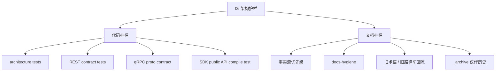

# 06-架构护栏

## 1. 模块定位

`06-架构护栏/` 是 IAM 文档体系中的治理层文档。

它不讲 AuthN、AuthZ、Identity、REST、gRPC、SDK 的业务细节。

它只回答：

```text
哪些代码依赖边界不能破坏？
哪些契约事实源必须优先？
哪些旧路径、旧术语、旧接口不能回流？
代码、契约、测试、文档发生冲突时，以谁为准？
后续重构时，如何防止架构和文档慢慢漂移？
```

一句话：

> 06-架构护栏 是 IAM 的防撞栏，不是新的业务设计模块。

---

## 2. 30 秒结论

本目录只保留两类护栏：

```text
代码护栏：保护分层依赖、组合根、REST/gRPC/SDK 契约；
文档护栏：保护事实源优先级、链接、术语和旧事实不回流。
```

核心原则：

```text
domain 不依赖 infra / transport；
application 不依赖 transport / 具体 infra；
transport 不依赖 container / repository / Casbin；
SDK 不 import IAM internal 包；
REST 字段以 OpenAPI 为准；
gRPC 字段以 proto 为准；
SDK API 以 pkg/sdk 为准；
_archive 只保存历史，不能证明当前事实。
```

最小验证命令：

```bash
go test ./internal/pkg/architecture
make docs-hygiene
```

涉及 REST / gRPC / SDK 时，再运行对应契约检查。

---

## 3. 文档目录

```text
06-架构护栏/
├── README.md
├── 01-架构测试与依赖边界.md
└── 02-文档事实源与防漂移机制.md
```

| 文档 | 主题 |
| --- | --- |
| `01-架构测试与依赖边界.md` | 代码分层、依赖方向、组合根、SDK、REST/gRPC 契约护栏 |
| `02-文档事实源与防漂移机制.md` | 文档事实源优先级、_archive 边界、术语防漂移、文档检查规则 |

---

## 4. 推荐阅读顺序

标准顺序：

```text
01-架构测试与依赖边界.md
  -> 02-文档事实源与防漂移机制.md
```

如果你在改代码，先看第 01 篇。

如果你在改文档、OpenAPI、proto、SDK 或 README，先看第 02 篇。

---

## 5. 护栏总图



这张图表达：

```text
代码边界靠 architecture / contract / compile tests；
文档边界靠事实源优先级和 docs-hygiene。
```

---

## 6. 代码护栏速查

| 护栏 | 保护目标 |
| --- | --- |
| `architecture_test.go` | 分层依赖不回退 |
| `router_matrix_test.go` | REST 路由不漂移 |
| `check-route-contracts.py` | REST runtime 与 OpenAPI 不漂移 |
| `check-openapi-contracts.py` | OpenAPI schema 不漂移 |
| `proto_contract_test.go` | proto service 有 runtime registration |
| `public_api_compile_test.go` | SDK 公开 API 不被误删 |

主要命令：

```bash
go test ./internal/pkg/architecture
go test ./internal/apiserver/transport/rest
go test ./internal/apiserver/transport/grpc
go test ./pkg/sdk/...
```

---

## 7. 文档护栏速查

事实源优先级：

```text
源码真实行为
  -> 机器契约 / 配置 / 迁移
  -> 测试
  -> 当前正文文档
  -> README
  -> 历史文档 / _archive
```

文档卫生命令：

```bash
make docs-hygiene
```

重点保护：

```text
链接有效；
不引用退役路径；
不引用旧路由；
不引用旧术语；
不把 _archive 当当前事实源。
```

---

## 8. 与其他目录的关系

| 目录 | 关系 |
| --- | --- |
| `00-概览` | 讲系统总览，06 保护架构边界不跑偏 |
| `01-运行时` | 讲启动与生命周期，06 保护 process/container/transport 边界 |
| `02-认证AuthN` | 讲认证模型与链路，06 不重复 AuthN 业务设计 |
| `03-授权AuthZ` | 讲授权模型与链路，06 防止 Casbin facts 污染领域模型 |
| `04-身份Identity` | 讲 User/Profile/ProfileLink，06 防止旧身份术语回流 |
| `05-接入与契约` | 讲 REST/gRPC/SDK 接入，06 保护契约事实源和防漂移规则 |
| `_archive` | 历史材料，不作为当前事实源 |

---

## 9. 常见误区

### 9.1 架构护栏是代码洁癖

不是。

它保护的是长期演进中的边界稳定性。

---

### 9.2 单元测试够了，不需要架构测试

不够。

单元测试验证业务行为。

架构测试验证依赖方向和结构边界。

---

### 9.3 文档写了就是事实

不是。

文档是解释层。

事实要回到源码、OpenAPI、proto、SDK 和测试。

---

### 9.4 _archive 可以作为当前实现依据

不能。

`_archive` 只能提供历史线索，不能证明当前事实。

---

## 10. 维护规则

### 10.1 新增代码边界，要补护栏

如果新增模块、协议、SDK API 或组合根能力，应考虑是否需要新增：

```text
architecture test；
contract test；
compile test；
docs-hygiene rule。
```

---

### 10.2 架构测试失败，不要直接删测试

先判断：

```text
边界是否真的被破坏；
是否需要新增 port / typed deps；
是否需要更新组合根；
是否是架构目标本身变化。
```

如果架构目标变化，必须同步更新文档和测试。

---

### 10.3 文档更新必须回链事实源

活跃文档中的结论应能回链到：

```text
源码；
OpenAPI；
proto；
pkg/sdk；
配置 / migration；
测试。
```

不要从 `_archive` 直接复制当前结论。

---

## 11. 验证建议

基础检查：

```bash
go test ./internal/pkg/architecture
make docs-hygiene
```

REST：

```bash
make docs-swagger
make api-validate
go test ./internal/apiserver/transport/rest
```

gRPC：

```bash
make proto-gen
go test ./internal/apiserver/transport/grpc
```

SDK：

```bash
go test ./pkg/sdk/...
```

---

## 12. 本文总结

`06-架构护栏/` 不追求内容多，而追求后续重构不跑偏。

它的核心职责是：

```text
用 architecture tests 固化分层依赖；
用 REST/gRPC contract tests 固化协议边界；
用 SDK compile test 固化公开 API；
用 docs-hygiene 固化文档事实源；
用 _archive 边界防止历史事实回流。
```

如果只记住一句话：

> 06 是 IAM 的治理层文档：代码边界靠测试守住，文档事实靠事实源守住，历史材料不能反向污染当前设计。
