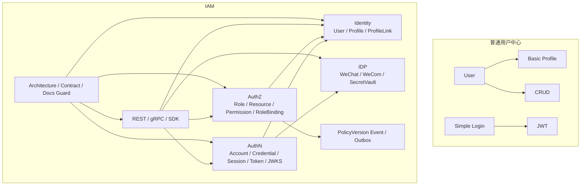

# 为什么 IAM 不是普通用户中心

## 本文回答

本文回答：为什么当前 IAM 项目不能被理解成“用户表 CRUD”或“用户中心后台”；为什么它必须同时包含 AuthN、AuthZ、Identity、IDP、REST/gRPC/SDK 接入、Transactional Outbox 和架构护栏；如果把 IAM 简化成普通用户中心，会丢失哪些系统能力；当前设计的收益、代价和必须守住的不变量是什么。

读完本文，你应该能回答：

- 普通用户中心解决什么问题；
- IAM 解决的问题为什么比 User CRUD 大得多；
- 为什么 User 只是 IAM 的一个身份锚点，而不是整个系统；
- 为什么 AuthN 不能只是“查用户 + 发 JWT”；
- 为什么 AuthZ 不能只是“用户表里放 role 字段”；
- 为什么 Identity 需要 User、Profile、ProfileLink，而不是 User 一个表；
- 为什么 IDP 只做第三方身份源基础设施，而不直接签发 IAM token；
- 为什么 REST/gRPC/SDK 是产品化接入能力，不是附属工具；
- 为什么架构护栏和文档防漂移也是 IAM 的一部分；
- 如何向面试官或技术同事解释：IAM 是身份与访问管理服务，不是普通用户管理模块。

---

## 30 秒结论

普通用户中心通常回答：

```text
用户是谁？
用户资料是什么？
如何增删改查用户？
```

IAM 回答的是更大的问题：

```text
谁在登录？
用什么方式登录？
登录态如何管理？
token 如何签发、刷新、撤销和验签？
用户是否仍然允许访问？
这个 subject 在哪个 tenant 下有没有权限访问某个 resource？
外部身份源如何接入？
用户和业务档案是什么关系？
业务系统如何通过 REST/gRPC/SDK 接入？
架构和契约如何防止漂移？
```

所以 IAM 不是：

```text
users 表 + login 接口 + JWT
```

而是：

```text
AuthN
  -> 认证、账号、Session、Access Token、Refresh Token、JWKS、KeyRotation

AuthZ
  -> Role、Resource、Permission、RoleBinding、Check、Casbin facts、PolicyVersion、Outbox

Identity
  -> User、Profile、ProfileLink、当前用户视角、档案关系

IDP
  -> 微信/企微应用配置、SecretVault、外部身份源协作

Access Contract
  -> REST、gRPC、SDK

Architecture Guard
  -> 架构测试、契约测试、文档事实源与防漂移
```

一句话概括：

> **普通用户中心管理用户资料；IAM 管理身份、认证、授权、会话、凭证、第三方身份源、业务档案关系和系统接入边界。**

---

## 主图：普通用户中心 vs IAM



---

## 重点速查

| 问题 | 普通用户中心 | IAM 当前答案 | 代码入口 |
| --- | --- | --- | --- |
| 用户是谁 | User 表 | User 是 Identity 身份锚点 | `internal/apiserver/domain/identity/user` |
| 如何登录 | 用户名密码查表 | AuthN LoginMethod + ProofFactory + AuthStrategy + SessionTokenIssuer | `internal/apiserver/application/authn/login` |
| token 是什么 | 通常只发 JWT | Access Token + Refresh Token + Session + Verify/Revoke | `internal/apiserver/application/authn/token` |
| 是否支持离线验签 | 不一定 | JWKS + KeyRotation | `internal/apiserver/application/authn/jwks`、`internal/apiserver/infra/token/keyset` |
| 权限怎么做 | user.role 字段 | Role/Resource/Permission/RoleBinding + Casbin facts | `internal/apiserver/domain/authz`、`internal/apiserver/infra/casbin` |
| 权限变更怎么传播 | 通常无 | PolicyVersion + Transactional Outbox | `internal/apiserver/application/authz/policy`、`internal/apiserver/infra/mysql/eventoutbox` |
| 用户资料是什么 | User profile 字段 | User 与 Profile 分离，ProfileLink 表达关系 | `internal/apiserver/domain/identity/profile`、`domain/identity/profilelink` |
| 第三方登录怎么做 | 直接在 login 里写微信逻辑 | IDP 管配置/secret/API，AuthN 管登录态 | `internal/apiserver/container/assembler/idp.go`、`application/authn/login` |
| 如何接入业务系统 | 手写 HTTP 调用 | REST/gRPC/SDK 三层契约 | `api/rest`、`api/grpc`、`pkg/sdk` |
| 如何防止边界回退 | 通常靠约定 | 架构测试、契约测试、docs hygiene | `internal/pkg/architecture`、`scripts` |

---

## 1. 普通用户中心通常解决什么问题

普通用户中心通常围绕一个对象展开：

```text
User
```

常见能力是：

```text
创建用户
查询用户
更新用户资料
禁用用户
重置密码
简单登录
简单角色字段
```

它的核心模型可能是：

```text
users
user_profiles
user_roles
```

这种系统的默认假设是：

```text
用户资料是核心
登录只是附属能力
权限可以简单放在用户字段或角色字段里
第三方登录可以直接写在 login service 里
token 可以简单发一个 JWT
```

如果系统只是后台管理、单租户、低安全要求、没有服务间接入、没有第三方身份源、没有权限快照和跨系统授权传播，这样设计未必有问题。

但 IAM 当前不是这个问题域。

---

## 2. IAM 面对的是身份与访问管理问题

IAM 面对的问题更接近：

```text
Identity and Access Management
```

它不是只管理用户资料，而是统一回答：

```text
Authentication：你如何证明你是谁？
Authorization：你能访问什么？
Identity：系统内部如何表达身份主体和业务档案？
Federation / IDP：外部身份源如何接入？
Access Contract：业务系统如何接入认证授权能力？
Governance：这些边界如何不漂移？
```

当前项目 README 已经明确：IAM 提供完整的认证、授权、用户档案管理和第三方身份集成能力，并且功能列表包括 AuthN、AuthZ、Identity、IDP、Suggest、CacheGovernance 和 Transactional Outbox。  
因此它天然不是一个单纯 User CRUD 服务。

---

## 3. 为什么 User 只是身份锚点，不是整个系统

在 IAM 中，User 很重要，但 User 只是身份体系里的一个锚点。

User 回答：

```text
IAM 内部这个人是谁？
这个用户当前是 active / inactive / blocked？
这个用户的基础资料是什么？
```

但 User 不回答：

```text
这个人用什么账号登录？
这个 token 是否被撤销？
这个 session 是否仍然 active？
这个人有没有 read 某个 resource 的权限？
这个人和某个儿童档案是什么关系？
这个人来自微信还是企微？
业务系统如何接入他的权限判定？
```

这些问题分别属于：

| 问题 | 模块 |
| --- | --- |
| 如何登录 | AuthN |
| token/session 是否有效 | AuthN |
| 有无资源权限 | AuthZ |
| 关联哪个 Profile | Identity / ProfileLink |
| 外部身份源配置 | IDP |
| 业务服务如何接入 | REST/gRPC/SDK |

所以，如果把 IAM 看成 User 模块，会出现根本性误判：

```text
把身份主体当成系统全部
把登录态当成用户字段
把权限当成用户属性
把第三方身份当成用户字段
把业务档案关系当成 user.profile_id
```

这会直接破坏 IAM 的边界。

---

## 4. 为什么 AuthN 不只是“查用户 + 发 JWT”

普通登录逻辑可能是：

```text
username/password
  -> 查 user
  -> 密码正确
  -> 发 JWT
```

IAM 的 AuthN 链路明显更复杂：

```text
LoginV2Request
  -> auth_method + method_payload
  -> MethodRegistry.Select
  -> LoginMethod.BuildPayload
  -> ProofFactory.Build
  -> AuthCredential proof
  -> Authenticator / AuthStrategy
  -> Principal
  -> Session
  -> Access Token
  -> Refresh Token
```

AuthN 当前支持：

```text
password
phone_otp
wechat
wecom
bearer compatibility
service token
JWKS
key rotation
session revoke
refresh token rotation
online verify
```

这说明 AuthN 不是一个 login 函数，而是一组认证能力。

### 4.1 Session 是在线锚点

如果只发无状态 JWT，会遇到：

```text
用户被 block 了，旧 token 仍然可用
账号被 disabled 了，旧 token 仍然可用
用户登出后，旧 token 仍然可用
refresh token 泄露后，不好管理
```

IAM 通过 Session + TokenStore + SubjectAccessEvaluator 解决：

```text
JWT 签名有效
  还不够
还要检查：
  access revoke marker
  session active
  user/account 状态
```

这就不是普通用户中心的登录能力，而是在线认证状态管理。

### 4.2 Refresh Token 是续期凭证

Refresh Token 不是“另一个长期 JWT”。  
它是服务端保存的续期凭证，和 session 绑定。

这让 IAM 可以：

- 轮换 refresh token；
- 撤销 refresh token；
- 终止 session；
- 控制长期登录态；
- 将短期 access token 与长期登录态分开。

### 4.3 JWKS 是对外验签能力

普通用户中心通常不需要考虑：

```text
其他服务如何离线验证我签发的 token？
key 如何轮换？
旧 token 如何在 grace period 内继续验签？
```

IAM 需要支持业务系统接入，因此必须发布 JWKS，并维护 KeyRotation。

这已经超出“发个 JWT”的范围。

---

## 5. 为什么 AuthZ 不只是 user.role 字段

普通用户中心经常把权限简化成：

```text
users.role = admin / user
```

或者：

```text
user_roles(user_id, role_id)
```

但 IAM 的 AuthZ 需要回答的是：

```text
某个 subject
在某个 tenant/domain 下
能不能对某个 resource
执行某个 action
并且限定某个 scope？
```

这至少需要：

```text
Subject
Tenant
Role
Resource
Permission
RoleBinding
Scope
AuthorizationRequest
AuthorizationDecision
```

当前 AuthZ 使用：

```text
Subject -> RoleBinding -> Role -> Permission -> Resource + Action + Scope
```

并通过 CasbinAdapter 把业务事实转成 runtime policy facts。

### 5.1 为什么不能放在 User 表里

如果把权限放在 User 表里，会导致：

- 无法表达 resource/action/scope；
- 无法表达 tenant domain；
- 无法做授权快照；
- 无法统一服务间 Check；
- 无法支持 PolicyVersion；
- 无法把授权变更通过 Outbox 传播；
- 无法把 Casbin 作为 infra adapter 隔离；
- 无法区分 REST/proto assignment 和内部 rolebinding。

### 5.2 权限写入不是 CRUD

普通 CRUD 是：

```text
insert role_binding
```

IAM 的授权写入是：

```text
PolicyChange
  -> UoW
  -> write p/g facts
  -> increment policy version
  -> stage version changed event
  -> commit
  -> reload runtime policy
  -> outbox relay publish
```

这说明 AuthZ 是一个策略变更系统，不是一个权限表 CRUD 系统。

---

## 6. 为什么 Identity 不等于 User Profile 字段

普通用户中心常见设计：

```text
users:
  name
  phone
  email
  avatar
  child_id
```

IAM 的 Identity 不这样做，因为它需要表达：

```text
User 是登录主体
Profile 是业务档案
User 与 Profile 之间有关系
```

当前模型是：

```text
User -- ProfileLink -- Profile
```

而不是：

```text
User has one Profile
```

### 6.1 为什么需要 Profile

Profile 是业务档案，尤其适合表达：

```text
儿童档案
本人档案
被测评者档案
业务侧需要被记录的个体资料
```

它不是登录主体。

### 6.2 为什么需要 ProfileLink

因为关系不是简单外键：

- 一个 User 可以有关联多个 Profile；
- 一个 Profile 可以被多个 User 关联；
- 关系有类型：self、parent、grandparent、other；
- 关系可以撤销；
- self profile link 是系统不变量；
- 当前用户视角需要 guard；
- ProfileLink 不能替代 AuthZ 权限，但可以表达 identity relationship。

如果把 Profile 直接塞进 User，就无法表达这些关系。

---

## 7. 为什么 IDP 不是登录模块

第三方登录很容易被写成：

```text
LoginService
  -> 调微信 code2Session
  -> 查/建用户
  -> 发 token
```

但 IAM 把 IDP 和 AuthN 分开。

IDP 负责：

```text
微信应用配置
AppSecret 加密存储
微信 access_token 缓存
微信/企微 API 适配
向 AuthN 暴露 Repository / SecretVault / AuthProvider
```

AuthN 负责：

```text
登录方式选择
proof 构造
外部身份交换
OAuth credential 绑定检查
Principal
Session
IAM token
```

### 为什么要分开

如果 IDP 直接签发 IAM token，会出现：

- 微信应用管理和登录态混在一起；
- AppSecret 管理和 session 管理混在一起；
- 外部身份源配置污染 AuthN 领域；
- 登录方式扩展困难；
- 账号绑定和 onboarding 难以收敛；
- 微信 access_token 与 IAM access token 容易混淆。

正确边界是：

```text
IDP 证明“外部身份源如何接入”
AuthN 证明“这个外部身份是否能成为 IAM Principal”
```

---

## 8. 为什么接入契约也是 IAM 的核心能力

普通用户中心可能只提供几个 HTTP 接口。  
IAM 必须作为基础服务被其他业务系统接入。

所以它需要三类接入面：

```text
REST
gRPC
SDK
```

### 8.1 REST

REST 适合：

- Web；
- Admin UI；
- Mobile；
- 登录；
- Swagger/OpenAPI 调试；
- 通用 HTTP 接入。

REST 事实源是：

```text
api/rest/*.yaml
```

### 8.2 gRPC

gRPC 适合：

- 可信服务间调用；
- token verify；
- AuthZ Check；
- AuthorizationSnapshot；
- Identity query；
- ProfileLink 系统侧 command；
- IDP 内部高信任读取。

gRPC 事实源是：

```text
api/grpc/iam/**/v2/*.proto
```

### 8.3 SDK

SDK 适合 Go 后端服务接入：

```text
sdk.NewClient
Auth().VerifyToken
Authz().AllowScoped
Identity().GetUser
ProfileLink().HasProfileLink
ServiceAuthHelper
JWKSManager
TokenVerifier
```

SDK 不是新的业务契约，而是 REST/gRPC 的 Go 封装。

这些接入能力说明 IAM 是一个基础平台服务，不是一个内部用户表模块。

---

## 9. 为什么架构护栏也是 IAM 的组成部分

IAM 这种系统最怕边界慢慢腐烂。

常见回退方式：

```text
domain 直接 import infra/mysql
application 直接 import transport/rest
REST router 直接访问 container
AuthZ domain 出现 Casbin p/g/r
IDP 直接签 IAM token
Identity 把 ProfileLink 写成 User 字段
SDK 暴露 internal transport
文档继续引用旧 route 或旧 package
```

所以 IAM 当前有架构护栏：

```text
architecture_test
router_matrix_test
proto_contract_test
public_api_compile_test
docs-hygiene
```

这些护栏不是附属工具，而是 IAM 能长期维护的前提。

普通用户中心可以靠人工约定，IAM 这种基础服务必须靠测试固化边界。

---

## 10. 替代方案分析

### 方案一：做成普通用户中心

```text
User CRUD
Login
JWT
Role 字段
```

优点：

- 实现快；
- 代码少；
- 初期理解成本低。

问题：

- 无法支持多登录方式；
- token 撤销和 session 管理弱；
- 权限模型表达力不足；
- 第三方身份源难治理；
- ProfileLink 关系无法表达；
- 服务间接入能力弱；
- 后续重构成本很高。

结论：

```text
不适合当前 IAM。
```

### 方案二：做成 AuthN-only 服务

```text
只负责登录、token、JWKS
AuthZ 和 Identity 由业务系统自己做
```

优点：

- 认证边界清晰；
- 比普通用户中心强。

问题：

- 业务系统会重复造授权；
- ProfileLink 关系分散；
- AuthZ Check 无法统一；
- SDK 接入能力会残缺；
- IAM 无法作为统一 identity/access 平台。

结论：

```text
适合非常轻量系统，不适合 FangcunMount 多业务系统接入。
```

### 方案三：当前 IAM 设计

```text
AuthN + AuthZ + Identity + IDP + REST/gRPC/SDK + Guard
```

优点：

- 能统一认证和授权；
- 能支撑业务系统接入；
- 能表达用户与业务档案关系；
- 能支持第三方身份源；
- 能通过 JWKS 和在线 Verify 平衡性能与安全；
- 能通过 Outbox 传播授权版本；
- 能用架构测试保护边界。

代价：

- 模块更多；
- 文档必须更清楚；
- 测试和契约维护成本更高；
- 接入方需要理解 REST/gRPC/SDK 选择；
- 运行时依赖更多：MySQL、Redis、Casbin、JWKS、Outbox、IDP 配置。

结论：

```text
这是当前项目阶段最合理的方向。
```

---

## 11. 当前设计收益

### 11.1 身份与认证分离

User 不再被登录方式绑死。  
账号、凭据、微信身份、企微身份都可以归一到 Principal/User。

### 11.2 认证与授权分离

AuthN 回答：

```text
你是谁？
你的登录态是否有效？
```

AuthZ 回答：

```text
你能不能做这件事？
```

这避免了 JWT roles、用户字段和权限判断混在一起。

### 11.3 User 与 Profile 分离

业务档案不污染登录主体。  
ProfileLink 可以表达用户与儿童档案、自有档案、亲属关系之间的协作。

### 11.4 IDP 与 AuthN 分离

第三方身份源配置、secret、access token、外部 API 由 IDP 治理；IAM 登录态由 AuthN 统一签发。

### 11.5 接入产品化

REST/gRPC/SDK 让 IAM 不只是内部包，而是可被业务系统稳定接入的服务。

### 11.6 边界可测试

架构测试和契约测试让边界不只靠口头约定。

---

## 12. 当前设计代价

### 12.1 学习成本高

读者必须理解：

```text
AuthN
AuthZ
Identity
IDP
ProfileLink
JWKS
Outbox
SDK
```

这不是读一个 User service 就能掌握的系统。

### 12.2 装配复杂

container 需要把 AuthN、AuthZ、User、IDP、Suggest、CacheGovernance、Outbox、REST/gRPC 注册起来。

### 12.3 依赖更多

运行时依赖包括：

```text
MySQL
Redis
Casbin
JWT keyset
IDP encryption key
EventBus / Outbox
```

### 12.4 文档必须持续维护

因为接入契约和边界较多，文档一旦漂移，误导成本很高。  
所以需要 docs-hygiene 和事实源机制。

### 12.5 不能随便绕过边界

短期写代码时，绕过架构边界可能更快。  
但 IAM 作为基础服务，绕过边界会导致长期不可维护。

---

## 13. IAM 必须守住的不变量

### 13.1 User 不是 Account

Account 属于 AuthN 登录账号语义。  
User 属于 Identity 内部身份锚点语义。

### 13.2 User 不是 Profile

Profile 是业务档案。  
User 与 Profile 通过 ProfileLink 建立关系。

### 13.3 AuthN 不做 AuthZ

AuthN 只负责认证和登录态。  
资源权限必须走 AuthZ。

### 13.4 IDP 不签 IAM token

IDP 只提供第三方身份源基础设施。  
IAM 登录态 token 由 AuthN `SessionTokenIssuer` / `SessionTokenPairIssuer` 统一签发。

### 13.5 Casbin 不是业务语言

业务语言是：

```text
Role
Resource
Permission
RoleBinding
Scope
```

Casbin p/g/r 是 infra runtime facts。

### 13.6 SDK 不进入 domain

SDK 是业务系统接入 IAM 的客户端封装。  
IAM 自己的 domain 不应该依赖 SDK。

### 13.7 文档不是事实源本身

REST 字段看 OpenAPI；gRPC RPC 看 proto；SDK API 看 `pkg/sdk`；运行行为看源码和测试。

---

## 14. 面试/宣讲讲法

### 14.1 10 秒版

```text
IAM 是一个身份与访问管理服务，不是普通用户中心；它统一处理登录、Session、Token、授权判定、用户档案关系、第三方身份源和业务系统接入。
```

### 14.2 30 秒版

```text
这个 IAM 项目不是简单的用户 CRUD。它把系统拆成 AuthN、AuthZ、Identity、IDP 四个核心边界：AuthN 负责登录、Session、Token、JWKS；AuthZ 负责角色、资源、权限和授权判定；Identity 负责 User、Profile 和 ProfileLink；IDP 负责微信/企微应用配置和外部身份源协作。对外通过 REST、gRPC、SDK 给业务系统接入，并用架构测试和契约测试保护边界。
```

### 14.3 3 分钟版结构

```text
1. 先说为什么不是用户中心
2. 再说四个边界：AuthN / AuthZ / Identity / IDP
3. 再说登录态：Session + Access Token + Refresh Token + JWKS
4. 再说权限：Role / Resource / Permission / RoleBinding / Check
5. 再说 ProfileLink：业务档案关系
6. 再说接入：REST / gRPC / SDK
7. 最后说工程护栏：架构测试、契约测试、文档防漂移
```

---

## 15. 典型追问与回答

### Q1：为什么不直接做一个 user-service？

因为 IAM 不只是用户资料管理。  
它还要负责登录态、token 生命周期、授权判定、第三方身份源、业务档案关系和系统接入。user-service 只能覆盖 Identity 的一部分。

### Q2：为什么不直接 JWT 里放 role？

JWT role 只能表达签发时的静态信息。  
IAM 需要在线 revoke、session 状态、user/account 状态、tenant/resource/action/scope 判定，还需要授权版本传播。把 role 放进 JWT 会让权限变更难以及时生效。

### Q3：为什么 AuthZ 要用 Casbin？

Casbin 提供 runtime policy engine，但 IAM 没把 Casbin 当业务模型。  
业务层仍然使用 Role、Resource、Permission、RoleBinding；Casbin facts 只是 infra 适配。

### Q4：为什么需要 ProfileLink？

因为 User 和 Profile 不是一对一。  
一个 User 可以有自己的档案和儿童档案；一个儿童 Profile 也可以被多个 User 关联。关系本身有类型、状态和历史，所以必须建模成 ProfileLink。

### Q5：为什么 IDP 不直接登录？

IDP 只负责外部身份源配置和 API，例如微信 AppSecret、code2Session。  
登录成功后如何创建 Principal、Session、Token，必须由 AuthN 统一处理。

### Q6：为什么要 SDK？

因为 IAM 是基础服务，业务系统不应该散落手写 REST/gRPC/JWKS/AuthZ Check。  
SDK 把常用接入模式产品化，但不替代 REST/gRPC 契约。

---

## 16. 代码证据地图

| 结论 | 代码/契约入口 |
| --- | --- |
| IAM 不只是用户中心 | `README.md` 功能特性 |
| 文档事实层已覆盖 AuthN/AuthZ/Identity/接入/护栏 | `docs/README.md` |
| AuthN 装配 login/token/session/JWKS | `internal/apiserver/container/assembler/authn_application_builder.go` |
| AuthZ 装配 Role/Resource/Policy/RoleBinding/Checker/Snapshot | `internal/apiserver/container/assembler/authz.go` |
| Identity 装配 User/Profile/MyProfiles/ProfileLink | `internal/apiserver/container/assembler/user.go` |
| IDP 明确“认证功能由 authn 模块统一提供” | `internal/apiserver/container/assembler/idp.go` |
| REST 契约覆盖 authn/authz/identity/idp/suggest | `api/rest/README.md` |
| gRPC 契约覆盖 authn/authz/identity/idp | `api/grpc/README.md` |
| SDK 公开 API | `pkg/sdk/README.md`、`pkg/sdk/public_api_compile_test.go` |
| 架构护栏 | `internal/pkg/architecture/architecture_test.go` |

---

## 17. 推荐源码阅读路线

### 第一轮：先看系统定位

```text
README.md
docs/README.md
```

目标：建立 IAM 是身份与访问管理服务，而不是用户中心的整体认知。

### 第二轮：看 AuthN

```text
internal/apiserver/application/authn/login
internal/apiserver/application/authn/token
internal/apiserver/application/authn/jwks
internal/apiserver/domain/authn/authentication
internal/apiserver/domain/authn/session
internal/apiserver/infra/token
```

目标：理解登录、session、token、JWKS。

### 第三轮：看 AuthZ

```text
internal/apiserver/domain/authz
internal/apiserver/application/authz
internal/apiserver/infra/casbin
internal/apiserver/infra/mysql/casbinrule
```

目标：理解授权模型、判定、写入、版本传播。

### 第四轮：看 Identity

```text
internal/apiserver/domain/identity/user
internal/apiserver/domain/identity/profile
internal/apiserver/domain/identity/profilelink
internal/apiserver/application/identity
```

目标：理解 User、Profile、ProfileLink 的关系。

### 第五轮：看 IDP

```text
internal/apiserver/domain/idp/wechatapp
internal/apiserver/application/idp/wechatapp
internal/apiserver/container/assembler/idp.go
internal/apiserver/application/authn/login/method/wechat.go
internal/apiserver/application/authn/login/method/wecom.go
internal/apiserver/application/authn/login/proof/oauth.go
```

目标：理解 IDP 与 AuthN 的协作边界。

### 第六轮：看接入和护栏

```text
api/rest
api/grpc
pkg/sdk
internal/pkg/architecture
scripts/check-docs-links.py
```

目标：理解 IAM 如何作为平台服务被接入，并如何防止边界漂移。

---

## 18. 验证建议

```bash
go test ./internal/apiserver/application/authn/...   ./internal/apiserver/domain/authn/...   ./internal/apiserver/application/authz/...   ./internal/apiserver/domain/authz/...   ./internal/apiserver/application/identity/...   ./internal/apiserver/domain/identity/...   ./internal/pkg/architecture   ./internal/apiserver/transport/rest   ./internal/apiserver/transport/grpc   ./pkg/sdk

make docs-hygiene
```

如果涉及接口契约：

```bash
make docs-swagger
make api-validate
make proto-gen
```

---

## 本文总结

IAM 不是普通用户中心，原因不在于它“功能更多”，而在于它解决的问题域不同。

普通用户中心以 User CRUD 为核心。  
IAM 以身份与访问管理为核心：

```text
身份主体
认证方式
登录态
凭证生命周期
授权模型
授权判定
第三方身份源
业务档案关系
系统接入契约
架构防漂移
```

当前 IAM 的合理表达应该是：

> **IAM 是一个面向业务系统接入的身份与访问管理服务。User 只是身份锚点，AuthN 管登录态和 token，AuthZ 管资源访问，Identity 管 User/Profile/ProfileLink，IDP 管第三方身份源，REST/gRPC/SDK 管接入，架构护栏保证边界不回退。**

这篇是 `07-专题分析` 的开篇。  
后续专题可以继续围绕一个核心问题展开：

```text
为什么要拆 AuthN/AuthZ/Identity/IDP？
为什么需要 Session 与 RefreshToken？
为什么 JWKS 与在线 Verify 要并存？
为什么 AuthZ 写入不是简单 CRUD？
```
