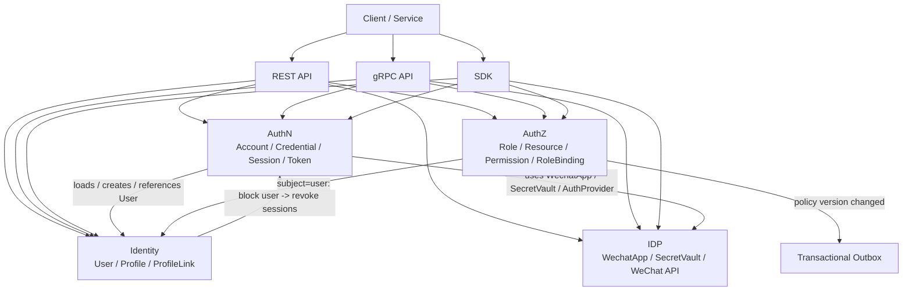

# 为什么拆分 AuthN、AuthZ、Identity、IDP

## 本文回答

本文回答：为什么 IAM 不把认证、授权、用户档案和第三方身份源合成一个“大用户模块”；为什么当前拆成 AuthN、AuthZ、Identity、IDP 四个核心边界；每个边界分别守住什么语义；它们之间如何协作；如果合并会造成哪些耦合；当前拆分带来的收益、代价和不变量是什么。

读完本文，你应该能回答：

- AuthN、AuthZ、Identity、IDP 分别解决什么问题；
- 为什么认证和授权不能混在一起；
- 为什么登录账号 Account 不等于 User；
- 为什么 User/Profile/ProfileLink 不应该放进 AuthN；
- 为什么微信/企微配置不应该直接写进登录策略；
- 为什么 IDP 只提供第三方身份源基础设施，不签发 IAM token；
- 为什么 AuthZ 写入和判定不能依赖 User 模块内部细节；
- 为什么 REST/gRPC/SDK 接入面需要跨这四个边界组织能力；
- 拆分后的协作链路是什么；
- 这套拆分的收益和代价分别是什么。

---

## 30 秒结论

IAM 拆分 AuthN、AuthZ、Identity、IDP 的根本原因是：  
**这四个模块回答的是四类完全不同的问题。**

```text
AuthN：你如何证明你是谁？
AuthZ：你被允许做什么？
Identity：系统内部如何表达你和业务档案？
IDP：外部身份源如何接入和治理？
```

如果合并成一个“大用户中心”，会把以下概念混在一起：

```text
登录账号
用户主体
业务档案
第三方身份源
资源权限
会话状态
token 生命周期
微信 AppSecret
授权版本事件
```

这样初期看起来简单，但后续会迅速失控。

当前拆分是：

| 模块 | 核心职责 | 不负责 |
| --- | --- | --- |
| AuthN | 登录、账号、凭据、Session、Token、JWKS、KeyRotation | 不做资源权限判定，不管理 Profile |
| AuthZ | Role、Resource、Permission、RoleBinding、Check、PolicyVersion、Outbox | 不认证用户身份，不签发 token |
| Identity | User、Profile、ProfileLink、用户状态、当前用户档案关系 | 不验证密码，不做资源权限判定 |
| IDP | 微信/企微应用配置、SecretVault、微信 access_token、外部 API 适配 | 不签发 IAM token，不创建登录态 |

一句话：

> **AuthN 管“认证态”，AuthZ 管“访问权”，Identity 管“身份与档案关系”，IDP 管“外部身份源基础设施”。**

---

## 主图：四个边界如何协作



---

## 重点速查

| 拆分问题 | 结论 | 源码入口 |
| --- | --- | --- |
| AuthN 为什么独立 | 它负责账号、凭据、认证策略、Session、Token、JWKS、KeyRotation | `internal/apiserver/container/assembler/authn.go`、`application/authn` |
| AuthZ 为什么独立 | 它负责授权模型、判定、策略写入、PolicyVersion、Outbox | `internal/apiserver/container/assembler/authz.go`、`application/authz` |
| Identity 为什么独立 | 它负责 User、Profile、ProfileLink、当前用户档案关系 | `internal/apiserver/container/assembler/user.go`、`application/identity` |
| IDP 为什么独立 | 它负责微信应用配置、SecretVault、微信 API，并明确认证由 AuthN 统一提供 | `internal/apiserver/container/assembler/idp.go` |
| AuthN 如何依赖 IDP | 通过 `Repository()`、`SecretVault()`、`WechatAuthProvider()` 获取第三方身份源能力 | `authn_infra_builder.go`、`idp.go` |
| AuthN 如何依赖 Identity | 通过 User repo、SubjectAccessEvaluator、onboarding、session revoke 与 User 交互 | `authn_infra_builder.go`、`user.go` |
| AuthZ 如何与 Identity 关联 | 用 `user:<id>` 作为 subject，并通过 User repository 校验 subject | `authz.go` |
| 接入契约如何组织 | REST/gRPC 按 authn/authz/identity/idp 拆分 | `api/rest/README.md`、`api/grpc/README.md` |
| 拆分如何被保护 | 架构测试和 typed deps 防止边界回退 | `internal/pkg/architecture/architecture_test.go` |

---

## 1. 为什么不能做成一个“大用户模块”

一个直觉设计可能是：

```text
UserModule
  -> User CRUD
  -> Login
  -> JWT
  -> Role
  -> WeChatLogin
  -> Profile
```

这看起来简单，但问题是每个能力的变化原因不同。

| 能力 | 变化原因 |
| --- | --- |
| 登录方式 | 密码、OTP、微信、企微、ServiceToken、Bearer |
| token 策略 | access TTL、refresh TTL、revoke、JWKS、KeyRotation |
| 用户状态 | active、inactive、blocked |
| 业务档案 | Profile 字段、关系类型、儿童档案协作 |
| 授权模型 | Role、Resource、Action、Scope、Tenant |
| 第三方身份源 | 微信应用、AppSecret、微信 access_token、SecretVault |
| 接入面 | REST、gRPC、SDK |
| 策略传播 | PolicyVersion、Outbox、runtime reload |

如果把它们合并：

```text
一个 UserService 要同时懂密码哈希、Redis session、JWT、Casbin、微信 AppSecret、ProfileLink、OpenAPI、gRPC、SDK。
```

这不是“高内聚”，而是典型 God Service。

IAM 的拆分就是为了让每个模块只承担一种核心语义。

---

## 2. AuthN：认证态边界

AuthN 回答的问题是：

```text
你如何证明你是谁？
你的登录态是否仍然有效？
你的 token 是否能继续使用？
```

它的核心对象和能力包括：

```text
Account
Credential
AuthCredential proof
Authenticator / AuthStrategy
Principal
Session
Access Token
Refresh Token
JWKS
KeyRotation
LoginPreparation
AccountOnboarding
ServiceToken
```

当前 AuthN module 装配了：

```text
accountService
accountOnboarder
loginService
loginPreparationService
tokenService
sessionService
keyManagementApp
keyPublishApp
keyRotationApp
rotationScheduler
```

这说明 AuthN 的边界远大于一个 login handler。

### AuthN 不应该负责什么

AuthN 不应该负责：

```text
资源权限判定
Role/Resource/Permission 维护
Profile 资料编辑
ProfileLink 关系管理
微信应用后台管理
业务系统 SDK 接入策略
```

### 为什么

如果 AuthN 负责授权，就会让 token 和 permission 绑定过死。  
如果 AuthN 负责 Profile，就会让登录账号和业务档案耦合。  
如果 AuthN 负责微信应用管理，就会让登录策略变成 IDP 配置中心。

AuthN 应该只产出：

```text
Principal
Session
Token
Claims
```

后续“这个 Principal 能做什么”交给 AuthZ。

---

## 3. AuthZ：访问权边界

AuthZ 回答的问题是：

```text
某个 subject 在某个 tenant 下，能不能对某个 resource 执行某个 action，并且符合某个 scope？
```

它的核心对象和能力包括：

```text
Role
Resource
Permission
RoleBinding
AuthorizationRequest
AuthorizationDecision
Casbin facts
PolicyChange
PolicyChangeCommitter
PolicyVersion
AuthorizationSnapshot
Outbox
```

当前 AuthZ module 初始化时创建：

```text
CasbinAdapter
RoleRepository
BindingRepository
ResourceRepository
PolicyVersionRepository
UserRepository
UnitOfWork
ResourceCatalog / Directory
RoleCatalog / Directory
PermissionCommands / Reader
RoleBindingCommands / Directory
AuthorizationChecker
AuthorizationSnapshotReader
```

这说明 AuthZ 不只是“角色表”，而是完整授权策略系统。

### AuthZ 不应该负责什么

AuthZ 不应该负责：

```text
验证 token
检查密码
签发 session
保存 Profile
调用微信 API
管理 AppSecret
```

它只应接收一个已经明确的 subject：

```text
user:123
service:qs-server
```

然后回答：

```text
allowed / denied
```

### 为什么 AuthZ 必须独立

授权模型会独立演进：

- 从 user subject 到 group/service subject；
- 从 all scope 到 origin/profile/school 等 scope；
- 从角色绑定到授权快照；
- 从本地 runtime policy 到跨系统同步；
- 从简单查询到 PolicyVersion + Outbox。

这些变化不应该影响 AuthN 登录代码，也不应该影响 Identity 的 User/Profile 模型。

---

## 4. Identity：身份与档案关系边界

Identity 回答的问题是：

```text
IAM 内部这个用户是谁？
这个用户状态是什么？
这个用户和哪些业务档案有关？
```

它的核心对象和能力包括：

```text
User
Profile
ProfileLink
Active self guard
MyProfiles
MyProfileLinks
User lifecycle
```

当前 UserModule 装配了：

```text
UserCreator
UserEditor
UserStatusChanger
UserDirectory
ProfileDirectory
MyProfiles
ProfileLinkCommands
ProfileLinkDirectory
MyProfileLinks
RoleNames
```

这说明 Identity 不是 AuthN 的附属表，而是独立身份模型。

### 为什么 User 不等于 Account

Account 是登录账号，例如：

```text
operation account
phone account
wechat account
wecom account
```

User 是 IAM 内部身份锚点。

一个 User 可能有多个 Account。  
一个 Account 是“如何登录”，User 是“登录后系统内部是谁”。

### 为什么 User 不等于 Profile

Profile 是业务档案，例如：

```text
本人档案
儿童档案
被测评者档案
```

User 和 Profile 之间通过 ProfileLink 表达关系。  
这个关系可能是：

```text
self
parent
grandparent
other
```

如果把 Profile 塞进 User，就无法表达一个用户多个档案、一个档案多个用户、关系撤销和 self link 不变量。

### Identity 与 AuthN 的双向协作

AuthN 需要 Identity：

- onboarding 时创建或复用 User；
- token claims 中包含 UserID；
- online verify 通过 User 状态判断 subject access。

Identity 也会影响 AuthN：

- User block 后撤销该用户 sessions。

但协作不等于合并。  
它们的变化原因不同，所以需要通过端口和 capability 协作。

---

## 5. IDP：外部身份源基础设施边界

IDP 回答的问题是：

```text
外部身份源如何被 IAM 使用和治理？
```

当前 IDP 主要围绕微信生态：

```text
WechatApp
AppSecret / CorpSecret
SecretVault
微信 access_token cache
WechatAuthProvider
WechatTokenProvider
微信 SDK cache
```

IDP module 的注释已经明确：

```text
认证功能由 authn 模块统一提供
IDP 提供基础设施服务供 authn 模块使用
```

这句话就是 IDP 与 AuthN 的边界。

### IDP 向 AuthN 暴露什么

IDP 暴露：

```text
Repository()
SecretVault()
WechatAuthProvider()
```

AuthN 使用这些能力：

- 查询 WechatApp；
- 解密 AppSecret；
- 调微信 code2Session / 企微接口；
- 构造第三方登录 proof；
- 继续走 AuthN 统一登录链路。

### 为什么 IDP 不直接登录

如果 IDP 直接登录，会导致：

```text
微信登录一套 token
密码登录一套 token
企微登录一套 token
Session 管理分散
账号绑定分散
SessionTokenIssuer / SessionTokenPairIssuer 分散
Refresh/Revoke 语义分散
```

IAM 的正确模型是：

```text
IDP 负责“外部身份源配置和 API”
AuthN 负责“这个外部身份能否成为 IAM Principal，并签发 IAM token”
```

---

## 6. 四个模块如何协作

### 6.1 密码登录

```text
Client
  -> AuthN Login(password)
  -> PasswordAuthStrategy
  -> Account/Credential
  -> Principal(UserID, AccountID, TenantID)
  -> Session + Token
```

涉及：

```text
AuthN
Identity UserID
```

不涉及：

```text
IDP
AuthZ
```

### 6.2 微信登录

```text
Client
  -> AuthN Login(wechat)
  -> AuthN wechat LoginMethod / ProofFactory
  -> IDP Repository 查询 WechatApp
  -> IDP SecretVault 解密 AppSecret
  -> IDP AuthProvider code2Session
  -> AuthN OAuthCredential binding
  -> Principal
  -> Session + Token
```

涉及：

```text
AuthN
IDP
Identity UserID
```

不涉及：

```text
AuthZ resource permission
```

### 6.3 授权判定

```text
Business Service
  -> AuthZ Check(subject=user:123, tenant, resource, action, scope)
  -> CasbinAdapter
  -> p/g facts
  -> AuthorizationDecision
```

涉及：

```text
AuthZ
Identity subject id
```

不涉及：

```text
AuthN 登录方式
IDP AppSecret
Profile 资料字段
```

### 6.4 用户被封禁

```text
Identity BlockUser
  -> User.Status = blocked
  -> AuthN SessionManager.RevokeByUser
  -> old token online verify fails
```

涉及：

```text
Identity
AuthN
```

不涉及：

```text
AuthZ policy facts
IDP
```

### 6.5 授权策略变更

```text
AuthZ grant/revoke/bind/unbind
  -> PolicyChange
  -> UoW
  -> casbin_rule facts
  -> PolicyVersion
  -> Outbox event
  -> runtime reload
```

涉及：

```text
AuthZ
Outbox
Eventing
```

不涉及：

```text
AuthN login
Identity ProfileLink
IDP
```

---

## 7. 如果不拆，会出现什么问题

### 7.1 AuthN 和 AuthZ 合并

错误结果：

```text
JWT 里塞 role
登录时加载权限
权限变化依赖 token 重新签发
用户登出和权限撤销混在一起
```

后果：

- 权限变更不及时；
- AuthZ Check 无法独立提供给业务服务；
- AuthorizationSnapshot 不好做；
- PolicyVersion/Outbox 难以加入；
- 登录服务变成权限服务。

### 7.2 AuthN 和 IDP 合并

错误结果：

```text
LoginService 里直接管理微信 AppSecret
LoginService 里直接管微信 access_token cache
微信/企微 API 逻辑散落在认证策略里
```

后果：

- 第三方身份源配置难维护；
- AppSecret 生命周期难治理；
- 微信 access_token 与 IAM access token 容易混淆；
- IDP 管理面无法独立演进。

### 7.3 Identity 和 AuthN 合并

错误结果：

```text
UserService 同时管理 User、Account、Session、Token、Profile
```

后果：

- User 与 Account 边界消失；
- ProfileLink 很容易被降级成 user.profile_id；
- User block 的 session revoke 变成隐式副作用；
- onboarding、登录、档案关系混杂。

### 7.4 Identity 和 AuthZ 合并

错误结果：

```text
User 里放 roles
ProfileLink 里放 permission
```

后果：

- ProfileLink 被误当权限；
- AuthZ resource/action/scope 表达力丢失；
- tenant domain 难处理；
- 业务档案关系和资源权限耦合。

---

## 8. 拆分后的收益

### 8.1 每个模块问题更清晰

```text
AuthN：认证态
AuthZ：访问权
Identity：身份和档案关系
IDP：第三方身份源
```

这让读代码的人能快速判断某个问题应该去哪里找。

### 8.2 变化可以局部发生

例如：

- 新增企微登录，主要影响 AuthN LoginMethod / ProofFactory / strategy 和 IDP 配置；
- 新增授权 scope，主要影响 AuthZ；
- 新增 ProfileLink relation，主要影响 Identity；
- 更换微信 SDK，主要影响 IDP infra；
- 新增 SDK 包装，主要影响 access contract 层。

### 8.3 接入面更清楚

REST/gRPC/SDK 可以按模块组织：

```text
authn
authz
identity
idp
```

调用方知道：

- 登录找 AuthN；
- 权限找 AuthZ；
- 用户档案找 Identity；
- 微信配置找 IDP。

### 8.4 架构护栏更容易写

拆清楚边界后，测试才能禁止：

- domain -> infra；
- application -> transport；
- AuthZ domain -> Casbin facts；
- IDP -> AuthN token issuer；
- Identity -> AuthZ policy facts。

如果一开始就是大 UserModule，这些护栏很难成立。

---

## 9. 拆分后的代价

### 9.1 装配复杂度增加

container 必须组装：

```text
AuthnModule
AuthzModule
UserModule
IDPModule
SuggestModule
CacheGovernance
Outbox
REST deps
gRPC registrations
Runtime deps
```

这比一个 UserService 复杂。

### 9.2 文档成本增加

读者必须理解：

```text
AuthN/AuthZ/Identity/IDP
```

以及它们之间的协作。

这就是为什么我们需要：

```text
事实层文档
专题分析层
宣讲层
```

### 9.3 跨模块协作要谨慎

例如：

```text
AuthN 需要 User repo
Identity block 需要 SessionManager
AuthN wechat login 需要 IDP Repository / SecretVault
AuthZ 需要 UserRepository 校验 subject
```

这些协作必须通过 typed deps、ports 和 application capabilities 发生，不能变成互相 import 具体实现。

### 9.4 测试成本增加

每个模块要有自己的测试，跨模块还要有装配测试、契约测试和架构测试。  
但这正是基础服务应该付出的成本。

---

## 10. 必须守住的不变量

### 10.1 AuthN 不做资源权限判定

AuthN 可以产出 Principal 和 claims。  
是否允许访问资源必须由 AuthZ 判断。

### 10.2 AuthZ 不验证密码和 token

AuthZ 只消费 subject/domain/resource/action/scope。  
token verify 是 AuthN 的事。

### 10.3 Identity 不管理登录凭证

Identity 管 User/Profile/ProfileLink。  
Account/Credential 属于 AuthN。

### 10.4 IDP 不签 IAM token

IDP 只提供第三方身份源基础设施。  
IAM 登录态 token 由 AuthN `SessionTokenIssuer` / `SessionTokenPairIssuer` 统一签发。

### 10.5 ProfileLink 不是 AuthZ Permission

ProfileLink 是身份关系 guard。  
资源权限仍由 AuthZ Check 判断。

### 10.6 Casbin 不进入 domain

Casbin 是 infra runtime adapter。  
domain 语言必须保持 Role/Resource/Permission/RoleBinding/Scope。

### 10.7 接入契约不能绕过模块边界

REST/gRPC/SDK 只能作为 facade，不应该把内部模块边界揉碎。

---

## 11. 面试/宣讲讲法

### 10 秒版

```text
IAM 拆分 AuthN、AuthZ、Identity、IDP，是因为登录态、资源权限、用户档案关系和第三方身份源是四类不同问题，不能都塞进 UserService。
```

### 30 秒版

```text
我没有把 IAM 做成一个大用户中心，而是拆成 AuthN、AuthZ、Identity、IDP 四个边界。AuthN 负责登录、Session、Token、JWKS；AuthZ 负责 Role、Resource、Permission、RoleBinding 和授权判定；Identity 负责 User、Profile、ProfileLink；IDP 负责微信/企微应用配置和外部身份源。这样可以避免登录、权限、档案关系和第三方配置互相污染，也方便通过 REST、gRPC、SDK 给业务系统接入。
```

### 3 分钟版结构

```text
1. 先说明大 UserService 会混淆四类问题
2. AuthN 解决认证态
3. AuthZ 解决访问权
4. Identity 解决用户与业务档案关系
5. IDP 解决第三方身份源基础设施
6. 讲协作链路：微信登录、授权判定、用户封禁
7. 讲收益和代价
8. 讲不变量和架构护栏
```

---

## 12. 常见追问

### Q1：为什么 AuthN 不直接判断权限？

因为认证和授权回答的问题不同。  
AuthN 证明“你是谁、登录态是否有效”；AuthZ 判断“你能不能访问某资源”。如果 AuthN 直接判断权限，就会让 token、session、permission 强耦合，权限变更也很难独立传播。

### Q2：为什么 IDP 不直接完成登录？

IDP 只应该证明外部身份源如何接入，例如微信应用配置、AppSecret、code2Session。  
这个外部身份是否已经绑定 IAM account/user，以及是否应该签发 IAM session/token，必须由 AuthN 统一处理。

### Q3：为什么 User 和 Account 要分开？

Account 是登录账号和凭据归属；User 是 IAM 内部身份锚点。  
一个 User 可以通过多个 Account 登录。如果混在一起，多账号、微信/企微、手机号、运营账号都会变成一堆特殊字段。

### Q4：为什么 User 和 Profile 要分开？

User 是登录主体；Profile 是业务档案。  
一个用户可能有本人档案和多个儿童档案，一个儿童档案也可能被多个用户关联。必须通过 ProfileLink 表达关系。

### Q5：为什么 AuthZ 不直接用数据库表判断？

AuthZ 使用 domain 模型生成 policy facts，再通过 Casbin runtime 判定。写入还需要 PolicyVersion 和 Outbox。直接表查询会把授权模型、runtime policy、版本传播和缓存失效混在一起。

### Q6：拆这么细会不会过度设计？

如果只是单体后台用户 CRUD，是过度设计。  
但 IAM 当前要作为多业务系统接入的身份与访问管理服务，支持 REST/gRPC/SDK、第三方登录、session/token、授权快照、ProfileLink、Outbox 和架构护栏，这个拆分是为控制复杂度，不是为炫技。

---

## 13. 代码证据地图

| 结论 | 源码/契约入口 |
| --- | --- |
| IAM 包含 AuthN/AuthZ/Identity/IDP/Suggest/Outbox 等能力 | `README.md` |
| docs 第一版已按 AuthN/AuthZ/Identity/接入/护栏重建 | `docs/README.md` |
| AuthN module 装配 account/login/token/session/JWKS/scheduler | `internal/apiserver/container/assembler/authn.go` |
| AuthN 通过 IDP module 获取 Repository/SecretVault/AuthProvider | `internal/apiserver/container/assembler/authn_infra_builder.go` |
| AuthZ module 装配 roles/resources/policies/rolebindings/checker/snapshot | `internal/apiserver/container/assembler/authz.go` |
| UserModule 装配 User/Profile/ProfileLink/MyProfiles/MyProfileLinks | `internal/apiserver/container/assembler/user.go` |
| IDP module 明确认证功能由 AuthN 统一提供 | `internal/apiserver/container/assembler/idp.go` |
| REST contract 按 authn/authz/identity/idp/suggest 拆分 | `api/rest/README.md` |
| gRPC contract 按 authn/authz/identity/idp 拆分 | `api/grpc/README.md` |
| 架构边界由测试保护 | `internal/pkg/architecture/architecture_test.go` |

---

## 14. 推荐源码阅读路线

### 第一轮：看模块装配

```text
internal/apiserver/container/assembler/authn.go
internal/apiserver/container/assembler/authz.go
internal/apiserver/container/assembler/user.go
internal/apiserver/container/assembler/idp.go
```

目标：先从 composition root 看四个模块到底装配了什么。

### 第二轮：看 AuthN 与 IDP 协作

```text
internal/apiserver/container/assembler/authn_infra_builder.go
internal/apiserver/application/authn/login/method/wechat.go
internal/apiserver/application/authn/login/method/wecom.go
internal/apiserver/application/authn/login/proof/oauth.go
internal/apiserver/domain/authn/authentication/auth-wechat-mini.go
internal/apiserver/domain/authn/authentication/auth-wechat-com.go
```

目标：理解第三方身份源不是直接登录模块。

### 第三轮：看 AuthZ 模型和判定

```text
internal/apiserver/domain/authz/model.go
internal/apiserver/application/authz/authorization/service.go
internal/apiserver/infra/casbin/facts.go
internal/apiserver/infra/casbin/adapter.go
```

目标：理解权限不是 User 字段。

### 第四轮：看 Identity

```text
internal/apiserver/domain/identity/user
internal/apiserver/domain/identity/profile
internal/apiserver/domain/identity/profilelink
internal/apiserver/application/identity/profile
internal/apiserver/application/identity/profilelink
```

目标：理解 User/Profile/ProfileLink 的拆分价值。

### 第五轮：看接入契约

```text
api/rest/README.md
api/grpc/README.md
pkg/sdk/README.md
```

目标：理解这四个边界如何对外提供 REST/gRPC/SDK 接入。

---

## 15. 验证建议

```bash
go test ./internal/apiserver/application/authn/... \
  ./internal/apiserver/application/authz/... \
  ./internal/apiserver/application/identity/... \
  ./internal/apiserver/domain/authn/... \
  ./internal/apiserver/domain/authz/... \
  ./internal/apiserver/domain/identity/... \
  ./internal/pkg/architecture

go test ./internal/apiserver/transport/rest \
  ./internal/apiserver/transport/grpc \
  ./pkg/sdk

make docs-hygiene
```

涉及接口契约时：

```bash
make docs-swagger
make api-validate
make proto-gen
```

---

## 本文总结

拆分 AuthN、AuthZ、Identity、IDP 的本质不是为了目录好看，而是为了把四类不同问题隔离开：

```text
AuthN：认证态
AuthZ：访问权
Identity：身份与业务档案关系
IDP：第三方身份源基础设施
```

如果不拆，这些概念会全部塞进 UserService：

```text
账号、用户、档案、权限、微信配置、token、session、授权版本、SDK 接入
```

最终系统会变成一个难以测试、难以扩展、难以接入、难以讲清楚的大泥球。

当前拆分的核心价值是：

```text
问题边界清楚
变化原因隔离
接入面清晰
领域语言稳定
架构测试可保护
```

这篇和上一篇《为什么 IAM 不是普通用户中心》一起，构成 `07-专题分析` 的基础开篇：

```text
01：先说明 IAM 不是 User CRUD
02：再说明为什么必须拆成 AuthN / AuthZ / Identity / IDP
```
