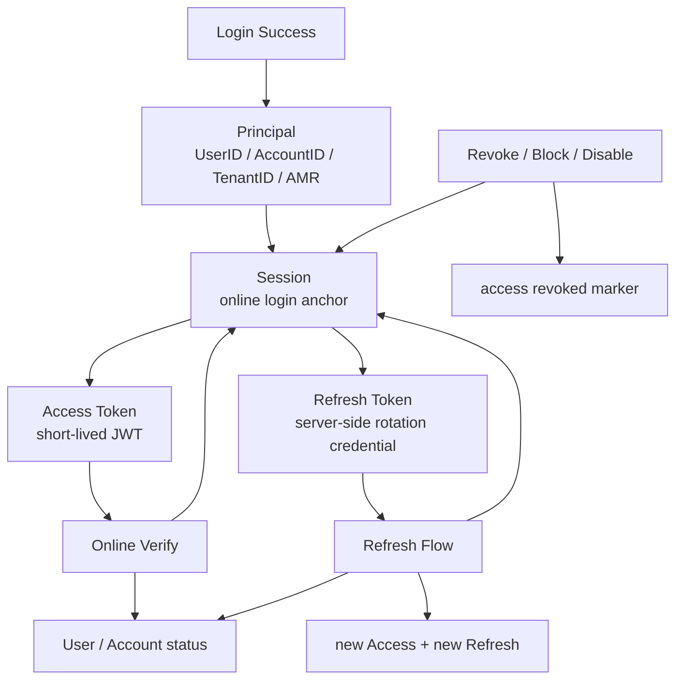
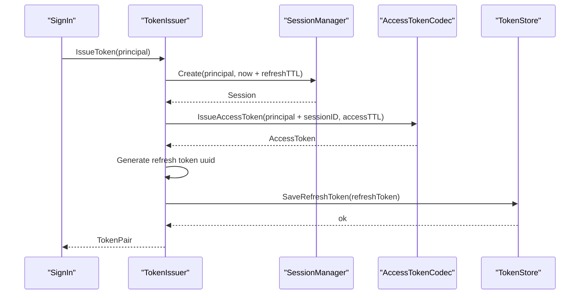
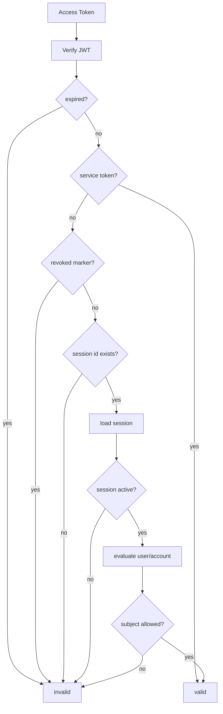
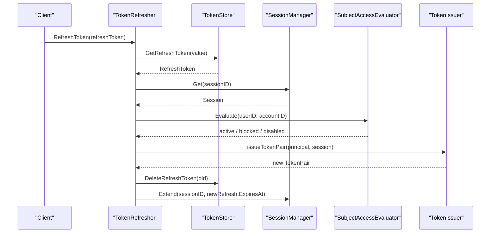

# 为什么 AuthN 需要 Session 与 RefreshToken

## 本文回答

本文回答：为什么 IAM 的 AuthN 不能只依赖一个无状态 JWT；为什么登录成功后必须创建 Session；为什么 Access Token 应该短期、Refresh Token 应该长期且服务端可控；为什么 Refresh Token 需要和 Session 绑定；为什么 Verify / Refresh 都必须回查 Session 和 subject access；这样设计带来的收益、代价和必须守住的不变量是什么。

读完本文，你应该能回答：

- 如果只发 JWT，会遇到哪些不可撤销问题；
- Session 在 AuthN 中到底是什么；
- Session 为什么是在线登录态锚点；
- Access Token 和 Refresh Token 分别解决什么问题；
- 为什么 Refresh Token 不应该只是另一个长期 JWT；
- 为什么 Refresh Token 必须服务端存储；
- 为什么 Refresh 时要回查 Session；
- 为什么 Verify 时要检查 revoked marker、Session 和 User/Account 状态；
- 用户 block、账号 disable、session revoke、refresh revoke 分别如何影响旧 token；
- Service Token 为什么是另一类语义；
- 当前设计的收益、代价和演进边界是什么。

---

## 30 秒结论

如果 AuthN 只做：

```text
登录成功
  -> 签一个 JWT
  -> 业务服务只验签
```

系统会立刻遇到几个问题：

```text
用户被封禁后，旧 JWT 还能用
账号被禁用后，旧 JWT 还能用
用户登出后，旧 JWT 还能用
refresh token 泄露后，很难终止会话
无法按 user/account 批量撤销登录态
无法区分短期访问凭证与长期续期凭证
```

IAM 当前选择的模型是：

```text
Session = 在线登录态锚点
Access Token = 短期访问凭证
Refresh Token = 长期续期凭证
```

登录签发链路是：

```text
Principal
  -> Create Session(refreshTTL)
  -> Issue Access Token(accessTTL, with sessionID)
  -> Save Refresh Token(refreshTTL, with sessionID)
```

在线 Verify 链路是：

```text
Verify JWT signature/claims
  -> check access token expired
  -> service token short-circuit
  -> check access token revoked marker
  -> load session
  -> session.IsActive
  -> evaluate user/account subject access
```

Refresh 链路是：

```text
load refresh token from store
  -> load session
  -> session.IsActive
  -> evaluate user/account subject access
  -> check refresh token expired
  -> issue new token pair
  -> delete old refresh token
  -> extend session
```

一句话：

> **JWT 证明 token 是 IAM 签的；Session 证明这次登录态仍然在线有效；Refresh Token 证明调用方有资格续期。三者不能互相替代。**

---

## 主图：Session、Access Token、Refresh Token 的职责分工



---

## 重点速查

| 问题 | 当前答案 | 源码入口 |
| --- | --- | --- |
| 登录成功后是否先创建 Session | 是，`IssueToken` 先 `sessionManager.Create`，再生成 token pair。 | `application/authn/token/issuer.go` |
| Session 过期时间依据什么 | 使用 `refreshTTL`，即 session 生命周期与 refresh 续期窗口绑定。 | `issuer.go` |
| Access Token 是否携带 SessionID | 是，`issueTokenPair` 构造 `principalWithSession`。 | `issuer.go` |
| Refresh Token 是否服务端保存 | 是，Redis 保存 `refresh_token:{value}` JSON。 | `infra/cache/redis/token-store.go` |
| Access Token 撤销如何实现 | Redis 写 revoked access token marker，TTL 为 token 剩余有效期。 | `infra/cache/redis/token-store.go` |
| Verify 是否只验 JWT | 否，还检查 revoked marker、session、subject access。 | `application/authn/token/verifier.go` |
| Refresh 是否只看 refresh token | 否，还检查 session 和 subject access。 | `application/authn/token/refresher.go` |
| Refresh 是否轮换 refresh token | 是，刷新成功后删除旧 refresh token。 | `refresher.go` |
| Session 如何撤销 | `Session.Revoke` 设置 revoked 状态、reason、revokedBy。 | `domain/authn/session/session.go` |
| 是否支持按 user/account 批量撤销 | 支持，Redis SessionStore 有 user/account ZSet index。 | `infra/cache/redis/session_store.go` |
| User/Account 状态如何影响旧 token | `SubjectAccessEvaluator` 加载 account 和 user 状态。 | `domain/authn/session/evaluator.go` |
| Service Token 是否走 session | 当前 Verify 中 service token 在过期检查后 short-circuit。 | `verifier.go` |

---

## 1. 只靠 JWT 的问题

只靠 JWT 的设计通常是：

```text
Login
  -> JWT(exp=7 days)
  -> Client stores JWT
  -> Services verify signature locally
```

这种设计很简单，但问题也很明显。

### 1.1 用户封禁无法立即生效

如果用户被 block：

```text
User.Status = blocked
```

但 JWT 仍然没过期。  
只要业务服务只做离线验签，旧 JWT 仍然可以访问服务。

### 1.2 登出无法真正撤销

用户点击 logout 后，如果没有服务端状态：

```text
旧 JWT 无法被服务端识别为已撤销
```

最多只能依赖客户端删除 token。  
但客户端删除不代表攻击者手里的 token 消失。

### 1.3 账号禁用无法立即生效

账号 disabled、archived、deleted 后，旧 token 如果只看签名仍然有效。  
这和安全预期冲突。

### 1.4 Refresh Token 泄露难以处理

如果 refresh token 也是一个长期 JWT，而且服务端不存储，则：

```text
泄露后难以精准撤销
难以判断它是否已经轮换
难以终止关联 session
```

### 1.5 无法批量撤销

常见安全场景需要：

```text
撤销某个 user 的全部 session
撤销某个 account 的全部 session
撤销某个 session
撤销某个 access token
撤销某个 refresh token
```

纯 JWT 很难优雅支持这些能力。

结论：

```text
JWT 适合承载短期访问凭证
不适合单独承担完整在线登录态
```

---

## 2. Session 解决什么问题

Session 是一次登录会话。

当前 Session 字段包括：

```text
SessionID
UserID
AccountID
TenantID
Status
AMR
SessionClaims
CreatedAt
ExpiresAt
RevokedAt
RevokeReason
RevokedBy
```

状态包括：

```text
active
revoked
expired
```

`IsActive()` 的判断是：

```text
session != nil
并且未过期
并且 Status == active
```

### 2.1 Session 是在线登录态锚点

Session 的核心价值是：

```text
所有 token 最终可以回到一次在线登录态
```

Access Token 中携带：

```text
session_id
```

Refresh Token 中也保存：

```text
session_id
```

这样系统可以通过 session 控制整次登录态，而不是逐个 token 失控地漂浮。

### 2.2 Session 支持主动撤销

Session 可以被：

```text
Revoke(sessionID)
RevokeByUser(userID)
RevokeByAccount(accountID)
```

这让系统可以处理：

- 用户登出；
- access token revoke；
- refresh token revoke；
- 用户封禁；
- 账号禁用；
- 安全事件下线所有设备。

### 2.3 Session 生命周期绑定 refresh TTL

登录时：

```text
sessionExpiresAt = now + refreshTTL
sessionManager.Create(principal, sessionExpiresAt)
```

这说明：

```text
Session 代表可续期登录窗口
Access Token 只是这个窗口内的短期访问凭证
```

---

## 3. Access Token 解决什么问题

Access Token 是短期访问凭证。

它的特点应该是：

```text
短 TTL
可被业务服务携带
可通过 JWT/JWKS 验签
可用于请求认证
携带 user/account/tenant/session claims
```

### 3.1 为什么 Access Token 适合 JWT

Access Token 频繁出现在请求中。  
如果每次请求都回数据库查登录态，成本会很高。

JWT 的价值是：

```text
快速携带身份 claims
可离线验签
跨服务传递方便
```

所以 Access Token 适合用 JWT。

### 3.2 为什么 Access Token 不能太长

Access Token 越长，撤销延迟越大。  
即使有在线 Verify，也可能有业务服务做离线 JWKS 验签。

因此 Access Token 应该短期，用 Refresh Token 负责续期。

### 3.3 Access Token 撤销标记

当前 RevokeAccessToken 会：

```text
解析 token
如果未过期：
  Redis 写 revoked marker，TTL 为 token 剩余有效期
如果有 sessionID：
  revoke session
```

这说明 access token revoke 不是简单“拉黑 JWT jti”，还会影响关联 session。

---

## 4. Refresh Token 解决什么问题

Refresh Token 是长期续期凭证。

它回答的是：

```text
access token 过期后，这个客户端是否还能续期？
```

### 4.1 为什么需要 Refresh Token

如果 access token 很短，用户会频繁重新登录。  
Refresh Token 让系统做到：

```text
Access Token 短期
Refresh Token 长期
用户体验可接受
安全风险可控
```

### 4.2 为什么 Refresh Token 不应该只是长期 JWT

长期 JWT 一旦泄露，会在有效期内持续可用。  
如果服务端完全不存储 refresh token，就无法做到：

- 单个 refresh token revoke；
- refresh token rotation；
- 判断 refresh token 是否已经被使用；
- 和 session 一起终止；
- 服务端主动失效。

IAM 当前选择：

```text
Refresh Token 是随机 uuid value
服务端 Redis 保存 refresh token 数据
```

Redis 中保存：

```text
TokenID
SessionID
UserID
AccountID
TenantID
AMR
SessionClaims
ExpiresAt
```

### 4.3 Refresh Token 绑定 Session

Refresh Token 里保存：

```text
SessionID
```

刷新时先加载 refresh token，再加载 session，要求 session active。

这保证：

```text
只要 session 被 revoke
即使 refresh token 还在
也不能继续续期
```

---

## 5. 登录签发链路为什么这样设计

当前 `IssueToken` 流程是：

```text
principal required
sessionExpiresAt = now + refreshTTL
sessionManager.Create(principal, sessionExpiresAt)
issueTokenPair(principal, session)
```

`issueTokenPair` 流程是：

```text
principal + sessionID
  -> IssueAccessToken(accessTTL)
  -> new refresh token uuid
  -> SaveRefreshToken(refreshTTL)
  -> return TokenPair
```



### 为什么先创建 Session

因为 Access Token 和 Refresh Token 都要回到同一个 session。  
如果先签 token，再创建 session，失败边界会更复杂：

```text
token 已签出
session 创建失败
refresh token 保存失败
```

当前顺序能保证：

```text
没有 session 就不签发 token pair
```

### 为什么 access token 要带 sessionID

因为 Verify 需要：

```text
claims.SessionID
  -> sessionManager.Get
  -> session.IsActive
```

如果 Access Token 不带 sessionID，就无法通过 session 精确判断这次登录态是否仍然有效。

### 为什么 refresh token 也带 sessionID

因为 Refresh 需要：

```text
refreshToken.SessionID
  -> sessionManager.Get
  -> session.IsActive
```

如果 Refresh Token 不绑定 session，就无法在 session 被撤销后阻止继续续期。

---

## 6. Verify 为什么不能只验 JWT

当前 `VerifyAccessToken` 流程是：

```text
tokenCodec.VerifyAccessToken
  -> claims.IsExpired
  -> if service token: return claims
  -> tokenStore.IsAccessTokenRevoked
  -> claims.SessionID required
  -> sessionManager.Get
  -> session.IsActive
  -> accessChecker.Evaluate(userID, accountID)
```



### 6.1 JWT 验签只证明来源和完整性

JWT 验签能证明：

```text
token 是 IAM 签的
claims 没被篡改
exp/nbf/aud/iss 等静态条件满足
```

但它不能证明：

```text
token 没被撤销
session 没被撤销
user 没被 block
account 没被 disable
```

### 6.2 revoked marker 解决单 token 撤销

Redis revoked marker 解决：

```text
这个 access token 是否已经被主动撤销？
```

marker 的 TTL 是 token 剩余有效期，因此 token 自然过期后 marker 也自动消失。

### 6.3 session check 解决登录态撤销

session check 解决：

```text
这次登录会话是否仍然有效？
```

只要 session revoked，旧 access token 即使签名有效，也会在线 Verify 失败。

### 6.4 subject access 解决主体状态变化

SubjectAccessEvaluator 会重新加载：

```text
Account
User
```

判断：

```text
account disabled / archived / deleted -> deny
user missing / blocked -> deny
user inactive -> deny
```

这让旧 token 受最新用户和账号状态影响。

---

## 7. Refresh 为什么要回查 Session 与 SubjectAccess

当前 `RefreshToken` 流程是：

```text
GetRefreshToken
  -> sessionManager.Get
  -> session.IsActive
  -> accessChecker.Evaluate
  -> refreshToken.IsExpired
  -> issue new token pair
  -> DeleteRefreshToken(old)
  -> sessionManager.Extend(sessionID, newRefresh.ExpiresAt)
```



### 7.1 为什么先查 Session

因为 Refresh Token 只是续期凭证。  
能不能续期，还要看这次登录态是否仍然 active。

如果 session 已经 revoked：

```text
refresh token 不能继续续期
```

### 7.2 为什么检查 User/Account 状态

因为用户可能已经被 block，账号可能已经 disabled。  
即使 refresh token 没过期，也不应该继续发新 access token。

### 7.3 为什么要删除旧 refresh token

刷新成功后：

```text
DeleteRefreshToken(old)
```

这是 refresh token rotation。  
它降低 refresh token 被重放的风险。

### 7.4 为什么要 Extend Session

刷新成功后：

```text
sessionManager.Extend(sessionID, newRefresh.ExpiresAt)
```

表示本次登录态继续延长到新的 refresh token 生命周期。

---

## 8. User / Account 状态如何影响旧 token

SubjectAccessEvaluator 规则：

```text
load account
  -> account nil / disabled / archived / deleted => disabled
load user
  -> user nil / blocked => blocked
  -> user inactive => disabled
  -> active
```

这意味着：

| 状态变化 | Access Token 在线 Verify | Refresh |
| --- | --- | --- |
| User blocked | 失败 | 失败 |
| User inactive | 失败 | 失败 |
| Account disabled | 失败 | 失败 |
| Account archived/deleted | 失败 | 失败 |
| Session revoked | 失败 | 失败 |
| Access token revoked marker | 失败 | 不直接看 marker，但 session 可能已 revoked |
| Refresh token deleted | 不影响已有 access token 离线验签 | 不能 refresh |

### 8.1 User block 还能主动撤销 session

Identity 的 User block 用例会调用：

```text
sessionManager.RevokeByUser
```

这让 session 层主动失效。  
即使某些业务没有及时读取 User 状态，session 也能阻断在线 Verify / Refresh。

### 8.2 Account 维度撤销

SessionStore 维护 account session index，因此支持：

```text
RevokeByAccount
```

这适合账号级安全操作，例如某个账号被判定泄露或禁用。

---

## 9. Access Token、Refresh Token、Session 三者的影响矩阵

| 操作 | Access Token | Refresh Token | Session |
| --- | --- | --- | --- |
| access token 自然过期 | access 不能用 | refresh 可继续续期 | session 不一定失效 |
| refresh token 自然过期 | access 到期后无法续期 | refresh 不能用 | session 到期 |
| RevokeAccessToken | 当前 access marker 失效 | 不直接删除 | 当前实现会 revoke session |
| RevokeRefreshToken | 旧 access 不直接写 marker | refresh 删除 | revoke session |
| User block | 在线 Verify 失败 | Refresh 失败 | RevokeByUser 主动撤销 |
| Account disable | 在线 Verify 失败 | Refresh 失败 | 可通过 RevokeByAccount 主动撤销 |
| Session revoke | 在线 Verify 失败 | Refresh 失败 | revoked |
| 离线 JWKS 验签 | 仍可能通过签名 | 不适用 | 看不到 session |

这个矩阵说明：

```text
离线验签和在线登录态控制不是同一个层次
```

---

## 10. Service Token 是特殊边界

当前 Verify 中有一条特殊逻辑：

```text
if claims.TokenType == TokenTypeService {
    return claims, nil
}
```

也就是说：

```text
Service Token 在过期检查后直接通过
不检查 revoked marker
不检查 session
不检查 user/account status
```

这是合理但必须被明确的边界。

Service Token 是服务身份凭证，不属于用户登录 session。  
它应该由服务间认证、安全配置、mTLS、ACL 和 service token 策略管理。

不能把 service token 当用户 token，也不能把用户 session 语义套到 service token 上。

---

## 11. 替代方案分析

### 方案一：只用长 JWT

```text
Login -> JWT(exp=7d)
```

优点：

- 实现简单；
- 不依赖 Redis；
- 验证性能好。

问题：

- 撤销困难；
- 用户封禁/账号禁用不能立即生效；
- 登出不可靠；
- 权限和主体状态更新延迟长；
- 无法按 session/user/account 管理登录态。

结论：

```text
不适合 IAM。
```

### 方案二：Access Token + Refresh Token，但不建 Session

```text
Access JWT
Refresh token in Redis
No session
```

优点：

- 比长 JWT 更安全；
- refresh 可撤销。

问题：

- 无法统一管理一次登录态；
- access token 和 refresh token 缺少共同锚点；
- 按 user/account 批量撤销复杂；
- Refresh 可以撤销，但 access token online check 缺少 session anchor；
- 设备会话、登录审计、会话列表难做。

结论：

```text
比纯 JWT 好，但仍不完整。
```

### 方案三：Session + Access Token + Refresh Token

```text
Session online anchor
Access Token short-lived
Refresh Token server-side rotation credential
```

优点：

- 支持 token 短期化；
- 支持 refresh 续期；
- 支持 session 撤销；
- 支持 user/account 批量撤销；
- 支持在线 Verify 看到最新状态；
- 支持离线 JWKS 和在线 Verify 并存；
- 支持后续设备会话和登录审计扩展。

代价：

- 依赖 Redis；
- Verify/Refresh 链路更复杂；
- 需要处理 session store、token store、subject access 的一致性；
- 文档和接入方需要理解边界。

结论：

```text
这是当前 IAM 合理选择。
```

---

## 12. 当前设计收益

### 12.1 安全性更强

系统可以处理：

- access token revoke；
- refresh token revoke；
- session revoke；
- user block；
- account disable；
- user/account session 批量撤销。

### 12.2 用户体验更好

Access Token 可以短期，Refresh Token 支持续期。  
用户不需要频繁重新登录。

### 12.3 接入更灵活

高性能场景可以离线 JWKS 验签。  
高安全场景可以在线 Verify。

### 12.4 后续可扩展

Session 作为锚点，后续可以扩展：

- 设备管理；
- 登录地点；
- session list；
- 一键下线所有设备；
- 风险登录检测；
- session 审计。

### 12.5 模块职责清楚

AuthN 管登录态和 token。  
Identity 管 User 状态。  
Verify/Refresh 通过 SubjectAccessEvaluator 串起两者。

---

## 13. 当前设计代价

### 13.1 Redis 成为关键依赖

Session、Refresh Token、Access Token revoked marker 都依赖 Redis。  
Redis 不可用会影响登录态验证、刷新和撤销。

### 13.2 Verify 成本更高

在线 Verify 不只是验签，还要读：

```text
revoked marker
session store
user/account status
```

这比纯离线验签更重。

### 13.3 接入方需要理解两种验证方式

业务服务需要知道什么时候用：

```text
JWKS local verify
```

什么时候用：

```text
online Verify
```

否则可能误把离线验签当成完整认证状态判断。

### 13.4 refresh rotation 需要客户端配合

Refresh 成功后客户端必须保存新的 refresh token。  
如果客户端继续用旧 refresh token，会失败。

---

## 14. 必须守住的不变量

### 14.1 Access Token 必须短期

Access Token 不应承担长期登录态。  
长期登录态由 Refresh Token + Session 管理。

### 14.2 Refresh Token 必须服务端可控

Refresh Token 不应只是一个不可撤销长期 JWT。  
必须能服务端查询、删除、轮换。

### 14.3 Access Token 必须携带 sessionID

否则在线 Verify 无法回查 session。

### 14.4 Refresh Token 必须绑定 sessionID

否则 session revoke 后仍可能 refresh。

### 14.5 Verify 不能只验 JWT

完整在线 Verify 必须检查：

```text
revoked marker
session active
subject access
```

### 14.6 Refresh 不能只查 refresh token

Refresh 必须检查：

```text
session active
subject access
refresh token expiry
```

### 14.7 Service Token 不能混同用户 token

Service Token 是服务身份，不走用户 session 语义。  
接入文档和安全配置必须单独处理它。

---

## 15. 面试/宣讲讲法

### 10 秒版

```text
IAM 不能只发 JWT，因为 JWT 只能证明签名有效，不能证明登录态仍然有效；所以我用 Session 做在线锚点，用 Access Token 做短期访问凭证，用 Refresh Token 做服务端可控的续期凭证。
```

### 30 秒版

```text
AuthN 里我没有只做无状态 JWT，而是拆成 Session、Access Token 和 Refresh Token。Access Token 是短期 JWT，适合请求携带和 JWKS 验签；Session 是在线登录态锚点，用来支持登出、封禁、账号禁用、批量撤销；Refresh Token 是服务端保存的长期续期凭证，刷新时必须检查 session 和 user/account 状态，并且刷新成功后会轮换旧 refresh token。
```

### 3 分钟版结构

```text
1. 先讲纯 JWT 的问题：撤销、封禁、登出、账号禁用
2. 再讲三层模型：Session / Access Token / Refresh Token
3. 讲登录签发：先创建 session，再签 access，再保存 refresh
4. 讲 Verify：JWT + revoked marker + session + subject access
5. 讲 Refresh：refresh store + session + subject access + rotation
6. 讲收益：安全、体验、扩展
7. 讲代价：Redis、复杂度、接入理解成本
```

---

## 16. 常见追问

### Q1：为什么不直接把 JWT 过期时间设短一点？

短 JWT 可以减少风险窗口，但不能解决续期和会话管理。  
如果没有 Refresh Token，用户会频繁登录。  
如果有 Refresh Token 但没有 Session，仍然缺少统一登录态锚点。

### Q2：为什么 Refresh Token 不做 JWT？

Refresh Token 的关键不是携带 claims，而是服务端可控。  
它应该能被删除、轮换、绑定 session。随机 uuid + Redis store 更适合这个目标。

### Q3：有了 Session，为什么还要 Access Token？

Session 是服务端状态，不适合每个请求都直接作为凭证传递。  
Access Token 是短期访问凭证，可以携带 claims，适合跨服务传递和 JWT/JWKS 验签。

### Q4：有了 Refresh Token，为什么还要 Session？

Refresh Token 只代表续期凭证。  
Session 表达一次登录态。  
多个 token、撤销、扩展、批量下线都需要 session anchor。

### Q5：在线 Verify 会不会太慢？

在线 Verify 比离线验签慢，但它能看到撤销和最新主体状态。  
高吞吐低风险场景可以用 JWKS 本地验签；高风险场景应在线 Verify。IAM 同时支持两种模式。

### Q6：用户 block 后为什么不只删除 refresh token？

只删 refresh token，旧 access token 在过期前仍可能通过。  
User block 还要让在线 Verify 失败，并主动 revoke sessions。

---

## 17. 代码证据地图

| 结论 | 代码入口 |
| --- | --- |
| IssueToken 先创建 Session，再 issue token pair | `application/authn/token/issuer.go` |
| Access Token 签发时带 SessionID | `issuer.go` |
| Refresh Token 用 uuid value，并保存 SessionID/UserID/AccountID/TenantID | `issuer.go`、`infra/cache/redis/token-store.go` |
| Verify 检查 revoked marker、Session、SubjectAccess | `application/authn/token/verifier.go` |
| Refresh 检查 refresh token、Session、SubjectAccess，并轮换旧 refresh token | `application/authn/token/refresher.go` |
| Session 状态包括 active/revoked/expired | `domain/authn/session/session.go` |
| SessionStore 支持 RevokeByUser/RevokeByAccount | `infra/cache/redis/session_store.go` |
| SubjectAccessEvaluator 检查 Account 和 User 状态 | `domain/authn/session/evaluator.go` |
| AuthN module 装配 tokenIssuer/tokenRefresher/tokenVerifier | `container/assembler/authn_application_builder.go` |

---

## 18. 推荐源码阅读路线

### 第一轮：Session 模型

```text
internal/apiserver/domain/authn/session/session.go
internal/apiserver/domain/authn/session/manager.go
internal/apiserver/domain/authn/session/evaluator.go
```

目标：理解 Session 状态、撤销、延期和主体访问状态。

### 第二轮：Token 应用层

```text
internal/apiserver/application/authn/token/issuer.go
internal/apiserver/application/authn/token/verifier.go
internal/apiserver/application/authn/token/refresher.go
internal/apiserver/application/authn/token/types.go
internal/apiserver/application/authn/token/ports.go
```

目标：理解 Issue、Verify、Refresh、Revoke。

### 第三轮：Redis Store

```text
internal/apiserver/infra/cache/redis/token-store.go
internal/apiserver/infra/cache/redis/session_store.go
```

目标：理解 refresh token、revoked access marker、session 和 session index。

### 第四轮：User/Account 状态

```text
internal/apiserver/domain/uc/user/user.go
internal/apiserver/domain/uc/user/types.go
internal/apiserver/domain/authn/account/account.go
```

目标：理解 User/Account 状态如何影响旧 token。

### 第五轮：JWT/JWKS

```text
internal/apiserver/infra/token/jwt/generator.go
internal/apiserver/infra/token/keyset
```

目标：理解 JWT 签名和 JWKS 离线验签能力。

---

## 19. 验证建议

```bash
go test ./internal/apiserver/application/authn/token \
  ./internal/apiserver/domain/authn/session \
  ./internal/apiserver/infra/cache/redis \
  ./internal/apiserver/domain/uc/user \
  ./internal/apiserver/domain/authn/account

make docs-hygiene
```

建议重点测试方向：

| 测试方向 | 目的 |
| --- | --- |
| IssueToken creates session | 登录签发必须先创建 session |
| Access token includes sessionID | Verify 能回查 session |
| SaveRefreshToken | refresh token 存储 SessionID/UserID/AccountID/TenantID |
| Verify revoked access | revoked marker 生效 |
| Verify revoked session | session revoked 后旧 access token 失败 |
| Verify blocked user | user blocked 后旧 token 失败 |
| Refresh rotation | 成功刷新后删除旧 refresh token |
| Refresh revoked session | session revoked 后 refresh 失败 |
| RevokeRefreshToken | 删除 refresh token 并 revoke session |
| RevokeByUser | 用户维度批量撤销 session |
| RevokeByAccount | 账号维度批量撤销 session |

---

## 本文总结

AuthN 需要 Session 与 RefreshToken 的根本原因是：

> JWT 只能证明“这个 token 是 IAM 签发且未过期”，不能证明“这次登录态仍然在线有效”。

所以 IAM 把登录态拆成三层：

```text
Session
  -> 在线登录态锚点，可撤销、可延期、可按 user/account 管理

Access Token
  -> 短期访问凭证，适合请求携带和 JWKS 验签

Refresh Token
  -> 长期续期凭证，服务端保存、可轮换、可撤销、绑定 session
```

完整在线认证必须同时满足：

```text
JWT 有效
access token 未撤销
session active
user/account 仍允许访问
```

这就是 IAM AuthN 和普通“登录后发 JWT”的根本区别。
