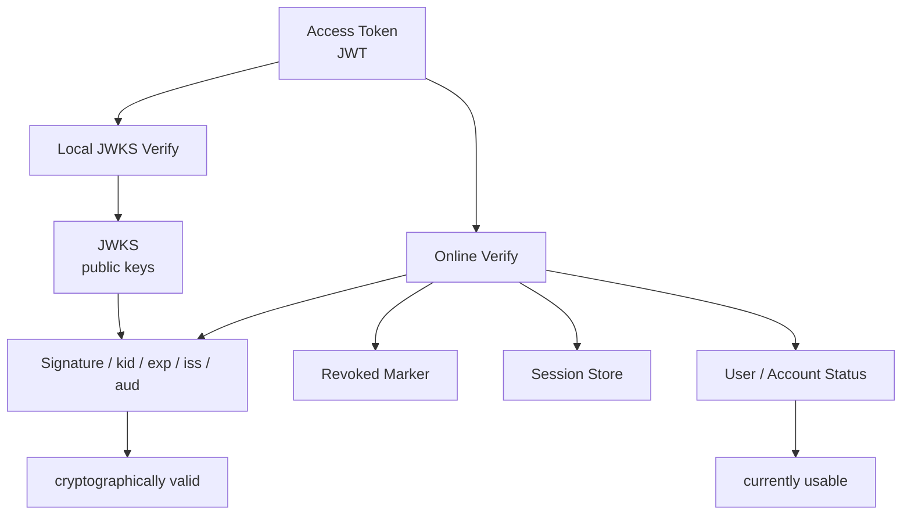

# 为什么 JWKS 与在线 Verify 要并存

## 本文回答

本文回答：为什么 IAM 既要提供 JWKS 离线验签能力，又要提供在线 Verify 能力；两者分别解决什么问题；为什么 JWKS 只能证明 token 的密码学有效性，不能证明登录态仍然有效；为什么在线 Verify 必须检查 revoked marker、Session 和 User/Account 状态；业务系统接入时如何选择本地 JWKS 验签、在线 Verify 或二者组合。

读完本文，你应该能回答：

- JWKS 解决什么问题；
- 在线 Verify 解决什么问题；
- 为什么 JWKS 不能替代 Verify；
- 为什么 Verify 不能替代 JWKS；
- `kid`、active key、grace key、retired key 在验签链路中的作用；
- JWKS 发布哪些 key；
- 在线 Verify 为什么还要查 Redis Session 和 subject access；
- 业务系统什么时候用离线 JWKS 验签；
- 什么时候必须调用在线 Verify；
- SDK 为什么同时提供 JWKSManager、TokenVerifier 和 Auth().VerifyToken；
- 当前实现里 service token 与用户 access token 的 Verify 边界有什么不同；
- 这套双轨机制的收益、代价和必须守住的不变量是什么。

---

## 30 秒结论

JWKS 与在线 Verify 不是二选一。

它们解决的是两类不同问题：

```text
JWKS 离线验签
  -> 这个 JWT 是不是 IAM 签的？
  -> 签名有没有被篡改？
  -> exp / nbf / iss / aud 等静态 claims 是否有效？

在线 Verify
  -> 这个 access token 现在还能不能用？
  -> token 是否被撤销？
  -> session 是否 active？
  -> user/account 是否仍允许访问？
```

因此：

```text
JWKS = 密码学信任分发机制
Verify = 在线认证状态判定机制
```

如果只用 JWKS，系统无法立即感知：

```text
access token revoked
session revoked
user blocked
account disabled / archived / deleted
```

如果只用在线 Verify，又会牺牲：

```text
服务间低延迟验签
跨语言本地验证
减少 IAM 中心服务调用压力
标准 OIDC/JWT 生态兼容
```

所以 IAM 需要两条链路并存：

```text
低风险 / 高吞吐 / 可接受短暂撤销延迟
  -> JWKS 本地验签

高风险 / 需要撤销立即生效 / 需要最新用户账号状态
  -> 在线 Verify

多数生产服务
  -> 本地验签 + 高风险动作在线 Verify / fallback
```

一句话：

> **JWKS 证明 token 的“签名可信”，在线 Verify 证明 token 的“当前可用”。**

---

## 主图：离线验签与在线 Verify 的分工



---

## 重点速查

| 问题 | 当前答案 | 源码入口 |
|---|---|---|
| JWT 如何签发 | `Generator.signClaims` 使用 active signing key，并把 `kid` 写入 header。 | `infra/token/jwt/generator.go` |
| JWT 验签如何找 key | `VerifyAccessToken` 从 header 取 `kid`，调用 `VerificationKey(ctx, kid)`。 | `infra/token/jwt/generator.go` |
| JWKS 发布哪些 key | `BuildJWKS` 查 `FindPublishable`，并只加入 `ShouldPublish()` 的 key。 | `infra/token/keyset/keyset_builder.go` |
| key 什么时候可发布 | active 或 grace，且未过期。 | `infra/token/keyset/key.go` |
| public JWKS endpoint | `/.well-known/jwks.json` 返回 JWKS，并写 ETag、Last-Modified、Cache-Control。 | `transport/rest/authn/handler/jwks_public.go` |
| 在线 Verify 是否只验 JWT | 否，还查 revoked marker、session、subject access。 | `application/authn/token/verifier.go` |
| revoked marker 在哪里 | Redis token store 使用 revoked access token marker String。 | `infra/cache/redis/token-store.go` |
| session 状态在哪里 | Redis SessionStore 保存 session 主对象和 user/account index。 | `infra/cache/redis/session_store.go` |
| User/Account 状态如何参与 | `SubjectAccessEvaluator` 重新加载 account/user 状态。 | `domain/authn/session/evaluator.go` |
| service token 是否查 session | 当前 Verify 中 service token 在过期检查后直接返回 claims。 | `application/authn/token/verifier.go` |

---

## 1. JWKS 解决什么问题

JWKS 是 JSON Web Key Set。  
它发布的是 IAM 用来验 JWT 签名的公钥集合。

JWT header 中有：

```text
kid
alg
typ
```

业务服务拿到 JWT 后，可以：

```text
读取 header.kid
从 JWKS 中找到对应 public key
验证 JWT 签名
检查 exp / nbf / iss / aud 等静态 claims
```

### 1.1 为什么需要 JWKS

如果没有 JWKS，业务服务要验证 IAM token，就只能：

```text
每次调用 IAM Verify
或者
把公钥用配置手工复制到每个服务
```

前者增加中心依赖和延迟。  
后者难以轮换和分发。

JWKS 提供了标准化公钥发布机制：

```text
GET /.well-known/jwks.json
```

业务服务可以缓存 JWKS，并本地验签。

### 1.2 JWKS 不是 token store

JWKS 只包含 public keys。

它不包含：

```text
refresh token
session
revoked token marker
user status
account status
permission
```

所以 JWKS 只能回答密码学问题，不能回答在线状态问题。

---

## 2. 在线 Verify 解决什么问题

在线 Verify 是 IAM 对某个 access token 当前可用性的判定。

当前链路是：

```text
tokenCodec.VerifyAccessToken
  -> claims.IsExpired
  -> service token short-circuit
  -> tokenStore.IsAccessTokenRevoked
  -> claims.SessionID required
  -> sessionManager.Get
  -> session.IsActive
  -> accessChecker.Evaluate(userID, accountID)
```

这说明在线 Verify 不只是“远程 JWT 验签”。

它会检查：

| 检查 | 解决的问题 |
|---|---|
| JWT 签名和 claims | token 是否由 IAM 签发、是否过期 |
| revoked marker | access token 是否被主动撤销 |
| Session | 登录态是否仍然 active |
| SubjectAccess | user/account 是否仍允许访问 |

### 2.1 在线 Verify 的核心价值

在线 Verify 可以让这些操作即时生效：

```text
logout
revoke access token
revoke refresh token
revoke session
user block
account disable / archive / delete
```

这些都不是 JWKS 能看到的。

---

## 3. 为什么 JWKS 不能替代在线 Verify

JWKS 离线验签只能基于 token 自身和 public key 判断。

它看不到服务端实时状态。

### 3.1 看不到 access token revoke

当前 access token revoke 会在 Redis 写：

```text
revoked_access_token:{token_id}
```

本地 JWKS 验签不会访问这个 Redis marker。  
因此被 revoke 的 access token，只要还没过期，本地验签仍可能通过。

### 3.2 看不到 session revoke

Access Token 中有 sessionID，但本地验签不会加载 SessionStore。  
所以：

```text
session revoked
session expired
session not found
```

这些在线状态，本地 JWKS 验签都看不到。

### 3.3 看不到 User/Account 状态变化

SubjectAccessEvaluator 会重新读取：

```text
Account
User
```

判断：

```text
account disabled / archived / deleted
user blocked / inactive
```

本地 JWKS 验签只看 token claims。  
如果 token 签发时 user 是 active，但后来被 block，本地验签不会知道。

### 3.4 看不到 Refresh Token 生命周期

JWKS 只验证 access token。  
它无法判断：

```text
refresh token 是否已删除
session 是否还能 refresh
```

Refresh 续期必须走服务端逻辑。

结论：

```text
JWKS 适合证明 token 没被伪造
不适合证明 token 当前还被允许使用
```

---

## 4. 为什么在线 Verify 不能替代 JWKS

反过来，如果所有服务都只调用 IAM 在线 Verify，也会有问题。

### 4.1 中心服务压力

每个业务请求都远程调用 IAM Verify，会让 IAM 成为高频认证中心。  
高吞吐业务服务会把认证流量压到 IAM。

### 4.2 延迟增加

本地验签是内存和 CPU 操作。  
在线 Verify 需要网络调用，还可能查 Redis、Session、User、Account。

### 4.3 可用性耦合

如果业务服务完全依赖在线 Verify，IAM Verify 或网络短暂不可用时，业务服务就可能无法处理请求。

### 4.4 标准生态兼容弱

JWT/JWKS 是标准生态。  
很多 API gateway、sidecar、服务框架都能直接接 JWKS。  
如果只有私有 Verify API，会降低通用性。

### 4.5 服务间接入不够灵活

不同业务风险不同：

- 低风险查询可以离线验签；
- 高风险写入可以在线 Verify；
- 后台任务可以用 service token；
- 网关可以做第一层 JWKS 验签；
- 核心服务可以做第二层在线 Verify。

如果没有 JWKS，接入策略会变得单一。

---

## 5. `kid` 与 KeyRotation 为什么重要

JWT 签发时：

```text
ActiveSigningKey(ctx)
  -> active key kid + private key
  -> JWT header.kid = kid
  -> RS256 sign
```

JWT 验签时：

```text
read header.kid
  -> VerificationKey(ctx, kid)
  -> public RSA key
  -> verify signature
```

### 5.1 active key

active key 用于签新 token。

当前 `Key.CanSign()`：

```text
status == active
并且未过期
```

### 5.2 grace key

grace key 不再签新 token，但仍然发布到 JWKS。  
它的作用是让旧 token 在过渡期内还能被验签。

### 5.3 retired key

retired key 不再发布到 JWKS。  
外部服务正常不会再通过 public JWKS 拿到它。

### 5.4 为什么 key rotation 需要 JWKS

没有 JWKS，公钥轮换要靠手工分发。  
有了 JWKS，业务服务只需按 ETag/Cache-Control 定期刷新。

---

## 6. JWKS 发布边界

JWKS public endpoint：

```text
GET /.well-known/jwks.json
GET /api/v2/.well-known/jwks.json
```

当前 HTTP response 设置：

```text
Content-Type: application/json
ETag
Last-Modified
Cache-Control: public, max-age=3600
```

客户端可以用：

```text
If-None-Match
```

命中时返回：

```text
304 Not Modified
```

### 6.1 JWKS 发布哪些 key

`KeySetBuilder.BuildJWKS`：

```text
keyRepo.FindPublishable
  -> filter key.ShouldPublish()
  -> sort by kid
  -> marshal JWKS
  -> generate ETag
```

`ShouldPublish()` 条件：

```text
active 或 grace
并且未过期
```

所以 public JWKS 的设计语义是：

```text
新 token 的 active key
旧 token 过渡期的 grace key
```

### 6.2 JWKS 不承诺在线状态

JWKS endpoint 的描述是：

```text
用于验证 JWT 签名
```

它不承诺：

```text
token 未被 revoke
session active
user active
account active
```

这正是在线 Verify 存在的原因。

---

## 7. 在线 Verify 的状态链路

在线 Verify 在 JWT 验签之后继续做三层在线状态检查。

### 7.1 Access Token revoke marker

Redis 记录：

```text
revoked access token marker
```

TTL 是 access token 剩余有效期。  
token 过期后 marker 自动失效。

### 7.2 Session active

Verify 要求 claims 中必须有：

```text
SessionID
```

然后：

```text
sessionManager.Get(sessionID)
sess.IsActive()
```

`IsActive()` 要求：

```text
session 未过期
status == active
```

### 7.3 SubjectAccess

最后检查：

```text
account status
user status
```

规则：

```text
account nil / disabled / archived / deleted => disabled
user nil / blocked => blocked
user inactive => disabled
otherwise active
```

这让在线 Verify 可以反映最新主体状态。

---

## 8. 接入策略：什么时候用 JWKS，什么时候用 Verify

### 8.1 适合 JWKS 本地验签的场景

```text
高吞吐读接口
风险较低的接口
可接受 access token TTL 内撤销延迟
API gateway 第一层认证
服务本地缓存认证结果
跨语言服务接入
```

例如：

```text
GET /public-user-summary
GET /low-risk profile preview
网关统一验签
```

### 8.2 必须在线 Verify 的场景

```text
高风险写操作
资金/隐私/管理操作
用户封禁要立即生效
账号禁用要立即生效
session revoke 要立即生效
登出后必须马上拒绝旧 token
需要确认 User/Account 最新状态
```

例如：

```text
修改密码
撤销 session
访问管理后台
授权策略变更
导出敏感数据
```

### 8.3 推荐组合

多数业务服务可采用：

```text
请求入口：本地 JWKS 验签
核心动作：在线 Verify / AuthZ Check
```

或者：

```text
本地验签成功
  -> 低风险读直接放行
  -> 高风险写调用在线 Verify
```

SDK 层可以封装这种策略：

```text
JWKSManager
TokenVerifier
Auth().VerifyToken
```

---

## 9. SDK 为什么同时提供 JWKS 与 Verify

SDK 中有几类能力：

| SDK 能力 | 作用 |
|---|---|
| `auth/jwks.JWKSManager` | 获取和缓存 JWKS |
| `auth/verifier.TokenVerifier` | 本地/远程/fallback token 验证策略 |
| `client.Auth().VerifyToken` | gRPC 在线 Verify |
| `auth/serviceauth.ServiceAuthHelper` | 服务间 token 获取与刷新 |

这说明 SDK 也没有把 JWKS 和 Verify 做成二选一。

合理模型是：

```text
JWKSManager 负责 key distribution
TokenVerifier 负责策略选择
Auth().VerifyToken 负责在线状态判定
```

---

## 10. Service Token 的特殊边界

当前 Verify 逻辑中：

```text
if claims.TokenType == service:
    return claims
```

这意味着 service token 在过期检查后，不走：

```text
revoked marker
session
subject access
```

原因是 service token 不是用户登录态。

Service token 应该由：

```text
mTLS
service identity
ACL
audience
ttl
IssueServiceToken policy
audit
```

共同约束。

### 10.1 这带来的文档要求

接入文档必须明确：

```text
用户 access token
  -> session/user/account 语义

service token
  -> service identity 语义
```

两者不能混用。

### 10.2 未来可演进方向

如果后续需要撤销 service token，可以考虑：

- service token revoke marker；
- service identity registry；
- service credential version；
- ACL 动态版本；
- service token introspection。

但当前实现里，service token 不走用户 session 语义。

---

## 11. 替代方案分析

### 方案一：只提供 JWKS

优点：

- 接入标准；
- 性能好；
- IAM 压力小；
- 服务本地可验签。

问题：

- 无法立即撤销；
- User block/Account disable 不立即生效；
- Session revoke 看不到；
- 高风险操作不够安全。

结论：

```text
适合低风险本地验签，不适合完整认证状态。
```

### 方案二：只提供在线 Verify

优点：

- 安全状态最新；
- 可以统一控制撤销；
- 实现逻辑集中。

问题：

- 所有业务请求依赖 IAM 在线服务；
- 性能压力大；
- 延迟高；
- 可用性耦合强；
- 不符合标准 JWKS/OIDC 接入生态。

结论：

```text
适合强一致认证，不适合作为唯一机制。
```

### 方案三：JWKS + 在线 Verify 并存

优点：

- 标准接入；
- 高吞吐场景可本地验签；
- 高风险场景可在线验证；
- 支持 key rotation；
- 支持 token/session/user/account 在线状态；
- SDK 可封装策略。

代价：

- 接入方需要理解边界；
- 文档必须明确使用场景；
- 本地验签和在线 Verify 可能产生短暂认知差异；
- key cache / ETag / rotation 需要治理。

结论：

```text
这是 IAM 当前最合理的选择。
```

---

## 12. 设计收益

### 12.1 性能与安全可以分层

```text
JWKS 本地验签负责性能
在线 Verify 负责强一致安全
```

业务系统可按风险选择。

### 12.2 支持标准生态

JWKS 是标准 JWT 验签机制，利于：

- API Gateway；
- 多语言服务；
- sidecar；
- 第三方系统；
- SDK。

### 12.3 支持撤销和封禁

在线 Verify 能让：

- logout；
- revoke；
- block；
- disable；
- session revoke；

即时生效。

### 12.4 支持 key rotation

active/grace/retired 状态让新旧 key 平滑过渡。  
业务服务可以通过 JWKS 缓存更新完成验签 key 切换。

### 12.5 支持 SDK 策略化

SDK 可以支持：

```text
local first
remote first
fallback
cache
circuit breaker
```

而不是把所有调用方绑死到一种验证模式。

---

## 13. 设计代价

### 13.1 接入方需要理解双轨语义

最常见错误是：

```text
把本地 JWKS 验签当作完整在线 Verify
```

这会导致撤销/封禁不生效。

### 13.2 JWKS 缓存需要治理

业务服务需要处理：

- ETag；
- Cache-Control；
- key rotation；
- kid miss；
- refresh JWKS；
- cache stale。

### 13.3 在线 Verify 依赖更多资源

在线 Verify 依赖：

```text
JWT key source
Redis token store
Redis session store
User repo
Account repo
```

所以它比本地验签更重。

### 13.4 两种结果可能短暂不一致

例如：

```text
本地验签通过
在线 Verify 因 session revoked 失败
```

这不是 bug，而是两者语义不同。  
文档和 SDK 必须把这件事讲清楚。

---

## 14. 必须守住的不变量

### 14.1 JWKS 只发布 public key

绝不能发布 private key 或 secret。

### 14.2 JWKS 只证明签名可信

文档和 SDK 都不能把 JWKS 描述成“完整登录态有效性验证”。

### 14.3 在线 Verify 必须检查在线状态

在线 Verify 必须继续检查：

```text
revoked marker
session
subject access
```

不能退化成远程 JWT parse。

### 14.4 Access Token 必须包含 `kid`

没有 `kid`，key rotation 和多 key 验签会困难。

### 14.5 Access Token 必须包含 SessionID

用户 access token 的在线 Verify 需要回查 session。  
如果没有 sessionID，在线 Verify 无法表达登录态。

### 14.6 Service Token 与 User Token 必须区分

Service Token 不走用户 session 语义，必须由服务间安全策略管理。

### 14.7 SDK 必须暴露选择，而不是隐藏语义

SDK 可以封装策略，但不能让调用方误以为 local verify 等价 online verify。

---

## 15. 面试/宣讲讲法

### 10 秒版

```text
JWKS 解决 token 的离线验签，在线 Verify 解决 token 当前是否还能用；一个管签名可信，一个管状态有效，所以必须并存。
```

### 30 秒版

```text
IAM 同时提供 JWKS 和在线 Verify。JWKS 让业务服务可以本地验证 JWT 签名、kid、exp、issuer、audience，适合高吞吐低风险场景；在线 Verify 在验签之外还会检查 access token 是否撤销、session 是否 active、user/account 是否仍可访问，适合高风险操作和需要撤销立即生效的场景。这两个机制互补，不是替代关系。
```

### 3 分钟版结构

```text
1. 先讲只靠 JWKS 的问题：看不到撤销、session、user/account 状态
2. 再讲只靠 Verify 的问题：性能、延迟、中心依赖、标准生态弱
3. 讲 JWT 签发和 kid
4. 讲 JWKS 发布 active/grace public key
5. 讲在线 Verify 的 revoked marker/session/subject access
6. 讲业务接入策略：低风险 local，高风险 online
7. 讲 SDK 如何封装两条链路
```

---

## 16. 常见追问

### Q1：业务服务本地验签通过，为什么在线 Verify 还会失败？

因为本地验签只看签名和静态 claims。  
在线 Verify 还看 revoked marker、session 和 user/account 最新状态。  
所以本地通过、在线失败是合理结果。

### Q2：为什么不让所有服务都在线 Verify？

可以，但会带来中心依赖、延迟和吞吐压力。  
IAM 是基础服务，应该允许调用方按风险选择本地验签或在线 Verify。

### Q3：JWKS key 被 rotation 后，旧 token 怎么办？

旧 active key 进入 grace 后不再签新 token，但仍发布到 JWKS，用于验证旧 token。  
过渡期结束后 retired，不再公开发布。

### Q4：在线 Verify 会不会绕过 JWKS？

在线 Verify 的密码学阶段也要按 `kid` 找 key 验签。  
但它比 JWKS 本地验签多了在线状态检查。

### Q5：JWT 里有 exp，为什么还要 session？

exp 只表示 token 自然过期时间。  
session 表示登录态是否被主动撤销或延期。两者不是同一个概念。

### Q6：Service Token 为什么不查 session？

Service Token 不是用户登录态，不属于 User/Account/Session 语义。  
它应通过 service identity、audience、TTL、mTLS、ACL 管理。

---

## 17. 代码证据地图

| 结论 | 代码入口 |
|---|---|
| JWT 签发时使用 active signing key 并写入 header.kid | `infra/token/jwt/generator.go` |
| JWT 验签时从 header.kid 取 VerificationKey | `infra/token/jwt/generator.go` |
| JWKS 只发布 active/grace 未过期 public key | `infra/token/keyset/keyset_builder.go`、`keyset/key.go` |
| JWKS public endpoint 返回 ETag/Last-Modified/Cache-Control | `transport/rest/authn/handler/jwks_public.go` |
| 在线 Verify 检查 revoked marker、Session、SubjectAccess | `application/authn/token/verifier.go` |
| Redis token store 保存 revoked marker | `infra/cache/redis/token-store.go` |
| SessionStore 支持 session active/revoked 和索引 | `infra/cache/redis/session_store.go` |
| SubjectAccessEvaluator 检查 User/Account 状态 | `domain/authn/session/evaluator.go` |
| SDK 提供 JWKS/Verifier/Auth.VerifyToken | `pkg/sdk/auth/jwks`、`pkg/sdk/auth/verifier`、`pkg/sdk/auth/client` |

---

## 18. 推荐源码阅读路线

### 第一轮：JWT 签发和验签

```text
internal/apiserver/infra/token/jwt/generator.go
internal/apiserver/infra/token/keyset/jwt_key_source.go
```

目标：理解 `kid`、active signing key、verification key。

### 第二轮：JWKS 发布

```text
internal/apiserver/infra/token/keyset/key.go
internal/apiserver/infra/token/keyset/keyset_builder.go
internal/apiserver/transport/rest/authn/handler/jwks_public.go
```

目标：理解 active/grace/retired、ShouldPublish、ETag、Cache-Control。

### 第三轮：在线 Verify

```text
internal/apiserver/application/authn/token/verifier.go
internal/apiserver/infra/cache/redis/token-store.go
internal/apiserver/infra/cache/redis/session_store.go
internal/apiserver/domain/authn/session/evaluator.go
```

目标：理解 token 当前可用性判断。

### 第四轮：Refresh 与 Session

```text
internal/apiserver/application/authn/token/refresher.go
internal/apiserver/domain/authn/session/session.go
```

目标：理解 refresh 和 session 如何共同维持登录态。

### 第五轮：SDK 接入

```text
pkg/sdk/auth/jwks
pkg/sdk/auth/verifier
pkg/sdk/auth/client
pkg/sdk/docs/04-jwt-verification.md
```

目标：理解业务服务如何选择 local/remote/fallback 验证策略。

---

## 19. 验证建议

```bash
go test ./internal/apiserver/infra/token/jwt \
  ./internal/apiserver/infra/token/keyset \
  ./internal/apiserver/application/authn/token \
  ./internal/apiserver/infra/cache/redis \
  ./pkg/sdk/auth/...

make docs-hygiene
```

建议重点测试方向：

| 测试方向 | 目的 |
|---|---|
| JWT signs with kid | access token header 必须有 kid |
| JWKS publish active/grace | active/grace 未过期 key 被发布 |
| Retired not published | retired key 不出现在 JWKS |
| ETag 304 | If-None-Match 命中返回 304 |
| Verify revoked marker | access token 被 marker 拒绝 |
| Verify session revoked | session revoked 后在线 Verify 失败 |
| Verify user blocked | user blocked 后在线 Verify 失败 |
| Local verify vs remote verify | 本地验签通过但在线状态失败的场景 |
| Service token boundary | service token 不走 session/user/account 检查 |
| JWKS cache refresh | kid miss 或 cache stale 后刷新 JWKS |

---

## 本文总结

JWKS 与在线 Verify 并存的根本原因是：

```text
它们回答的问题不同。
```

JWKS 回答：

```text
这个 JWT 的签名是否可信？
```

在线 Verify 回答：

```text
这个 access token 现在是否仍被 IAM 允许使用？
```

完整模型是：

```text
JWKS
  -> public key distribution
  -> local cryptographic verification
  -> performance and standard ecosystem

Online Verify
  -> revoked marker
  -> session active
  -> user/account latest status
  -> security consistency
```

所以 IAM 不应该只提供其中一个。

正确接入策略是：

```text
低风险高吞吐：JWKS 本地验签
高风险强一致：在线 Verify
成熟生产服务：本地验签 + 在线 Verify / fallback 组合
```

这篇和上一篇《为什么AuthN需要Session与RefreshToken》共同构成 AuthN 专题分析的核心：

```text
Session / RefreshToken 解决在线登录态
JWKS / Verify 解决签名可信与当前可用的双轨验证
```
