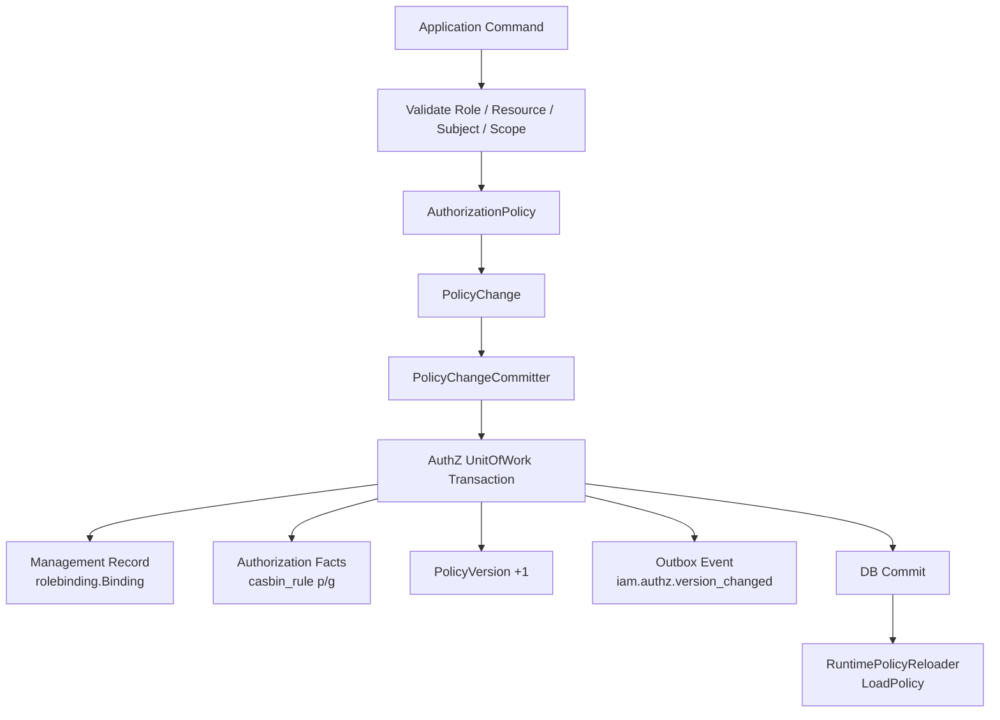
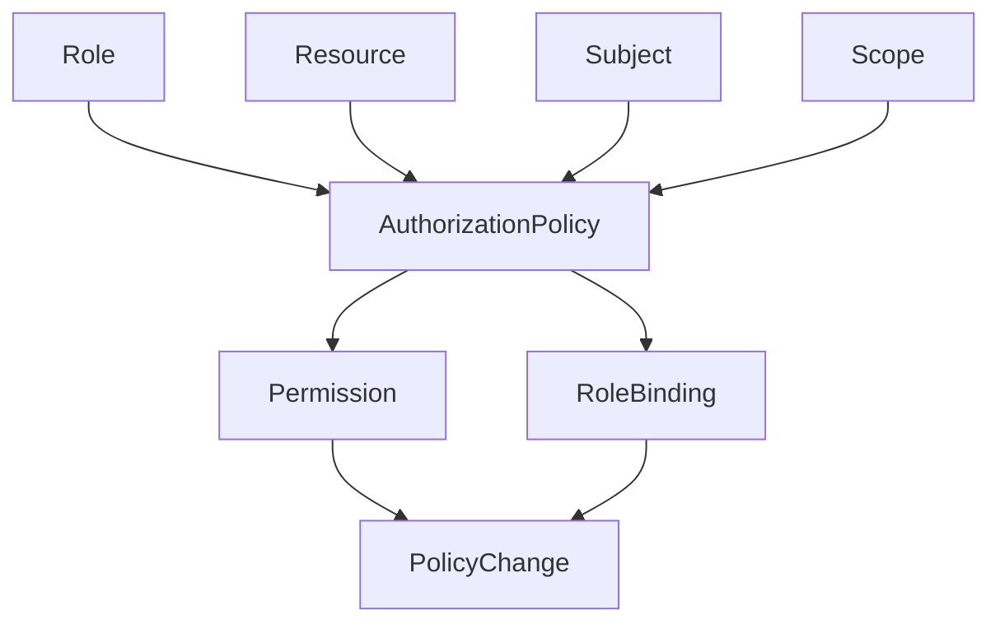
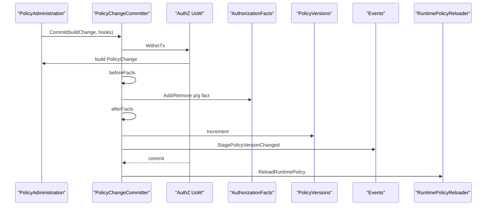

# 为什么 AuthZ 写入不是简单 CRUD

## 本文回答

本文回答：为什么 IAM AuthZ 中“授予权限”“撤销权限”“绑定角色”“解绑角色”不能被实现成简单的 repository create/delete；为什么一次授权写入必须同时处理业务授权变更、管理记录、Casbin facts、PolicyVersion、Outbox event 和 runtime policy reload；为什么需要 `AuthorizationPolicy`、`PolicyChange`、`PolicyChangeCommitter` 和 AuthZ UoW 这一整条链路。

读完本文，你应该能回答：

- 普通 CRUD 写入和 AuthZ 策略写入有什么本质区别；
- 为什么不能直接 insert/delete `casbin_rule`；
- 为什么不能只写 `role_bindings` 管理记录；
- `AuthorizationPolicy` 为什么只生成 `PolicyChange`，不直接写数据库；
- `PolicyChangeCommitter` 为什么是应用事务所有者；
- `BeforeFacts` / `AfterFacts` 解决什么问题；
- 为什么 rolebinding 管理记录和 Casbin `g` fact 是两类东西；
- 为什么 permission 当前主要体现为 Casbin `p` fact；
- 为什么每次授权变更都要递增 `PolicyVersion`；
- 为什么授权版本事件必须和 facts 同事务 stage；
- 为什么 runtime policy reload 在事务提交之后执行；
- reload 失败为什么不回滚 DB facts；
- 这套设计的收益、代价和必须守住的不变量是什么。

---

## 30 秒结论

AuthZ 写入不是 CRUD，因为它写的不是一张表，而是在修改一套 **运行时可判定、可版本化、可传播、可回滚的授权策略事实**。

普通 CRUD 是：

```text
insert / update / delete 一条业务记录
```

AuthZ 写入是：

```text
Command
  -> validate role/resource/subject/scope
  -> AuthorizationPolicy 生成 PolicyChange
  -> PolicyChangeCommitter 开启 UoW transaction
      -> beforeFacts: 写/删管理记录
      -> writeAuthorizationFact: 写/删 Casbin p/g facts
      -> afterFacts: 需要时再处理管理记录
      -> PolicyVersions.Increment
      -> StagePolicyVersionChanged
  -> transaction commit
  -> ReloadRuntimePolicy
```

也就是说，一次授权变更至少涉及四类结果：

| 结果 | 例子 | 目的 |
| --- | --- | --- |
| 管理记录 | `rolebinding.Binding` | 用于后台查询、审计、管理 |
| 授权事实 | `casbin_rule p/g` | 用于 runtime 判定 |
| 策略版本 | `PolicyVersion` | 用于授权快照和缓存失效 |
| 版本事件 | `iam.authz.version_changed` outbox | 用于跨系统同步 |

如果只做 CRUD，会丢掉后面三件事。

一句话：

> **CRUD 只关心“数据记录变了”；AuthZ 写入关心“授权事实变了、运行时要生效、下游要知道、失败要一致回滚”。**

---

## 主图：AuthZ 写入为什么不是 CRUD



---

## 重点速查

| 问题 | 当前答案 | 源码入口 |
| --- | --- | --- |
| 领域层如何表达授权变更 | `AuthorizationPolicy` 生成 `PolicyChange`，类型包括 grant/revoke permission、bind/unbind role。 | `domain/authz/policy/authorization_policy.go` |
| 应用事务由谁拥有 | `PolicyChangeCommitter.Commit`。 | `application/authz/policy/committer.go` |
| Commit 的事务边界 | `uow.WithinTx`。 | `application/authz/policy/committer.go` |
| UoW 内有哪些仓储 | Bindings、Roles、Resources、PolicyVersions、Users、AuthorizationFacts、Events。 | `application/authz/uow/uow.go` |
| MySQL UoW 如何提供事务仓储 | 在 GORM tx 中创建 binding/role/resource/policyVersion/user/casbinrule repos。 | `infra/mysql/uow/authz/uow.go` |
| 授权 facts 写到哪里 | `casbin_rule` 表，`p` 是 permission，`g` 是 role binding。 | `infra/mysql/casbinrule/repo.go` |
| RoleBinding 管理记录何时写 | BindRole 使用 `BeforeFacts` 创建 `rolebinding.Binding`。 | `application/authz/policy/administration.go` |
| policy version 何时递增 | facts 写入后，`PolicyVersions.Increment`。 | `application/authz/policy/committer.go`、`infra/mysql/policy/repo.go` |
| 授权版本事件何时 stage | version 递增后，在同一 UoW 内调用 `StagePolicyVersionChanged`。 | `application/authz/policy/committer.go`、`application/authz/shared/version_event.go` |
| runtime reload 何时执行 | UoW 成功提交后调用 `ReloadRuntimePolicy`。 | `application/authz/policy/committer.go`、`application/authz/shared/reloader.go` |
| reload 失败是否回滚 DB | 不回滚；reload 是提交后的 best-effort。 | `application/authz/shared/reloader.go` |

---

## 1. 普通 CRUD 解决什么问题

普通 CRUD 的问题模型是：

```text
对某个实体做增删改查
```

例如：

```text
CreateRole
UpdateResource
DeleteProfile
```

这类操作通常只需要：

```text
validate input
  -> repository create/update/delete
  -> return result
```

它关心的是：

```text
某条业务记录是否被保存
```

但授权写入不是这样。

授权写入关心的是：

```text
一次权限变更是否被 runtime 判定器看见
一次权限变更是否有版本号
一次权限变更是否能通知其他系统
一次权限变更是否和管理记录保持一致
一次权限变更失败时是否能完整回滚
```

所以 AuthZ 写入不是“表操作”，而是“策略变更事务”。

---

## 2. AuthZ 写入到底写了什么

以“给 teacher 角色授予 read 某资源权限”为例，它不是简单：

```sql
INSERT INTO permissions ...
```

当前设计中，它要产生：

```text
p(role:teacher, tenant-a, scale:form:*, read, origin:school-a)
PolicyVersion(tenant-a, version+1)
iam.authz.version_changed(tenant-a, version)
runtime LoadPolicy()
```

以“给用户绑定 teacher 角色”为例，它也不是简单：

```sql
INSERT INTO role_bindings ...
```

它要产生：

```text
rolebinding.Binding 管理记录
g(user:123, role:teacher, tenant-a)
PolicyVersion(tenant-a, version+1)
iam.authz.version_changed(tenant-a, version)
runtime LoadPolicy()
```

因此，授权写入至少分成两类数据：

| 类型 | 作用 |
| --- | --- |
| 管理数据 | 给后台、审计、查询、撤销使用 |
| 运行时事实 | 给 Casbin runtime Enforce 使用 |

如果只写管理数据，runtime 判定不会变。  
如果只写 runtime facts，后台管理和审计会断裂。  
如果不递增 version，下游快照无法判断过期。  
如果不 stage event，其他服务不知道授权变化。  
如果不 reload runtime，本进程判定可能仍是旧策略。

---

## 3. AuthorizationPolicy：先表达领域变更

领域层不是直接写库，而是先把授权操作表达成：

```text
PolicyChange
```

四种变更类型：

```text
grant_permission
revoke_permission
bind_role
unbind_role
```

`AuthorizationPolicy` 提供：

```text
GrantPermission
RevokePermission
BindRole
UnbindRole
```

它会做领域规则检查，例如：

```text
role 必须有 tenant
resource 必须支持 action
resource 必须支持 scope kind
subject 必须合法
```

然后创建：

```text
authz.Permission
authz.RoleBinding
```

再包装成：

```text
PolicyChange
```



### 为什么先有 PolicyChange

因为一次授权变更不只是数据写入。  
它还要携带：

```text
Kind
TenantID
Actor
Reason
Permission or RoleBinding
```

这些信息后续要用于：

- 决定写入还是删除 facts；
- 决定是 p fact 还是 g fact；
- 递增哪个 tenant 的 policy version；
- 生成 version changed event；
- 记录 changedBy 和 reason；
- reload runtime policy 时记录 operation。

如果直接 CRUD，就没有这个统一语义对象。

---

## 4. PolicyAdministration：应用写入入口

`PolicyAdministration` 是应用层授权写入用例。

它提供：

```text
GrantPermissionToRole
RevokePermissionFromRole
BindRoleToSubject
UnbindRoleFromSubject
UnbindRoleBindingByID
```

它的职责不是直接写库，而是：

```text
校验 command
规范化 scope
创建 actor
在 committer 的事务中加载 Role/Resource/Subject
调用 AuthorizationPolicy 生成 PolicyChange
按场景提供 BeforeFacts / AfterFacts hook
```

### 4.1 Permission 写入

`GrantPermissionToRole` / `RevokePermissionFromRole`：

```text
validate roleID/resourceID/action/tenant/changedBy
normalize scope
create actor
committer.Commit
  -> resolve role/resource
  -> AuthorizationPolicy.GrantPermission/RevokePermission
  -> write p fact
  -> version/event/reload
```

Permission 当前没有单独管理记录表，主要体现为 Casbin `p` fact。

### 4.2 RoleBinding 写入

`BindRoleToSubject`：

```text
validate subject/role/tenant/grantedBy
committer.Commit
  -> check role exists
  -> check subject exists
  -> load role
  -> AuthorizationPolicy.BindRole
  -> BeforeFacts: create rolebinding.Binding
  -> write g fact
  -> version/event/reload
```

这里同时写：

```text
rolebinding.Binding 管理记录
Casbin g fact
```

这就是为什么不能简单 insert 一张表。

### 4.3 UnbindByID 为什么用 AfterFacts

`UnbindRoleBindingByID` 需要：

```text
先读取 Binding
再根据 Binding.RoleID 找 RoleName
再构造 RoleBinding fact
再删除 g fact
最后删除 Binding 管理记录
```

所以它使用 `AfterFacts` 删除管理记录。  
如果一开始就删掉 Binding，就丢失了构造 g fact 所需的信息。

---

## 5. PolicyChangeCommitter：应用事务所有者

`PolicyChangeCommitter.Commit` 是授权写入事务的核心。

执行顺序：

```text
validate committer
collect options
uow.WithinTx
  -> build PolicyChange
  -> run beforeFacts
  -> writeAuthorizationFact
  -> run afterFacts
  -> PolicyVersions.Increment
  -> StagePolicyVersionChanged
after tx success
  -> ReloadRuntimePolicy
```



### 为什么它属于 application 层

因为它编排的是：

```text
domain change
multiple repositories
transaction boundary
event staging
runtime reload
```

这不是 domain rule，也不是 infra repository。  
它是典型 application transaction orchestration。

---

## 6. AuthZ UoW：为什么需要多个事务仓储

AuthZ UoW 提供：

```text
Bindings
Roles
Resources
PolicyVersions
Users
AuthorizationFacts
Events
```

这些仓储必须在同一个事务里协同。

例如 BindRole：

```text
查 Role
查 User
写 Binding
写 g fact
递增 version
stage event
```

任何一步失败，都应该一起回滚。

### 为什么不能每个 repository 自己开事务

如果每个 repository 自己写，就可能出现：

```text
Binding 写成功，g fact 写失败
g fact 写成功，version 写失败
version 写成功，event 没 stage
```

这种局部成功会让管理面、runtime 判定、下游缓存互相不一致。

UoW 的价值是：

```text
一次授权变更的所有持久化副作用，要么全部提交，要么全部回滚。
```

### MySQL UoW 如何实现

MySQL AuthZ UoW 在 GORM transaction 内重新创建：

```text
BindingRepository(tx)
RoleRepository(tx)
ResourceRepository(tx)
PolicyVersionRepository(tx)
UserRepository(tx)
CasbinRuleRepository(tx)
Events stager
```

这确保所有 repository 使用同一个事务句柄。

---

## 7. AuthorizationFacts：为什么不是直接操作 CasbinAdapter

AuthZ 写入 facts 的端口是：

```text
AuthorizationFactStore
```

它提供：

```text
AddPermission
RemovePermission
AddRoleBinding
RemoveRoleBinding
```

当前 MySQL 实现写的是：

```text
casbin_rule
```

映射：

| 领域事实 | Casbin fact |
| --- | --- |
| Permission | `p(role, tenant, resource, action, scope)` |
| RoleBinding | `g(subject, role, tenant)` |

### 为什么不直接调用 CasbinAdapter.AddPolicy

因为当前设计中：

```text
DB 是授权事实源
CasbinAdapter 是 runtime 判定器
```

写入必须通过 UoW 进入 DB。  
运行时 Casbin enforcer 通过 `LoadPolicy` 从 DB 加载事实。

如果直接调用 CasbinAdapter.AddPolicy：

- 可能只改内存；
- 可能绕过 PolicyVersion；
- 可能绕过 Outbox；
- 可能绕过 UoW；
- 可能造成 DB 和 runtime 不一致。

所以正确链路是：

```text
UoW -> casbin_rule repository -> commit -> runtime LoadPolicy
```

而不是：

```text
CasbinAdapter.AddPolicy
```

---

## 8. PolicyVersion：为什么每次写入都要递增版本

授权策略是会被缓存和下发的。

业务服务可能缓存：

```text
某个 subject 的 roles
某个 subject 的 permissions
某个 tenant 的 policy snapshot
```

如果没有版本号，下游无法判断：

```text
我缓存的是不是旧的？
```

所以每次授权事实变化后，都要：

```text
PolicyVersions.Increment(tenantID, changedBy, reason)
```

### 为什么 version 在 facts 之后

因为 version 表示：

```text
授权事实已经发生变化
```

如果 facts 写入失败，不应该递增 version。  
如果 version 递增失败，facts 也应该回滚。

当前顺序是：

```text
writeAuthorizationFact
  -> PolicyVersions.Increment
  -> StagePolicyVersionChanged
```

这保证：

```text
version 和 facts 在同一个事务中保持一致
```

---

## 9. Outbox：为什么版本事件必须同事务 stage

授权版本变化需要通知其他系统：

```text
IAM 其他实例
业务服务本地授权缓存
policy sync worker
SDK / snapshot consumer
```

事件是：

```text
iam.authz.version_changed
```

payload 是：

```text
tenant_id
version
```

如果直接 publish MQ，会出现经典问题：

```text
DB 提交成功，但 MQ 发布失败 -> 下游不知道变更
MQ 发布成功，但 DB 回滚 -> 下游看到不存在的变更
```

所以当前做法是：

```text
在同一个 UoW transaction 内 stage outbox event
```

也就是：

```text
tx.Events.Stage(...)
```

如果 stager 缺失，`StagePolicyVersionChanged` 返回错误，整个事务回滚。  
这是偏安全的选择：宁愿不提交授权变更，也不提交一个无法传播的变更。

---

## 10. Runtime reload：为什么在事务之后

授权 facts 写到 DB 后，当前进程的 Casbin runtime 还在内存里。

所以事务提交后需要：

```text
ReloadRuntimePolicy
```

它会：

```text
InvalidateCache
LoadPolicy
最多重试 3 次
失败后记录 degraded
```

### 为什么不放在事务内

因为 runtime reload 应该加载已提交事实。  
如果在事务内 reload：

- runtime 可能看不到未提交数据；
- reload 成功后事务可能回滚；
- runtime 反而变成比 DB 更“新”的错误状态。

所以正确顺序是：

```text
DB commit
  -> runtime reload
```

### reload 失败为什么不回滚 DB

因为 reload 发生在事务之后，DB 已经是事实源。  
reload 失败说明当前 runtime 暂时没有同步到最新策略，但不能因此回滚已经提交的授权事实、版本和 outbox event。

当前 `ReloadRuntimePolicy` 是 best-effort：

```text
try 3 times
log degraded
return
```

这意味着：

```text
DB 事实一致性由 UoW 保证
runtime 新鲜度由 reload 尽力保证
跨系统传播由 outbox 保证
```

---

## 11. 四个典型写入场景

### 11.1 Grant Permission

```text
RoleID + ResourceID + Action + Scope
  -> load Role / Resource
  -> AuthorizationPolicy.GrantPermission
  -> Permission(roleName, tenant, resourceKey, action, scope)
  -> AddPermission p fact
  -> Version + Event + Reload
```

### 11.2 Revoke Permission

```text
RoleID + ResourceID + Action + Scope
  -> load Role / Resource
  -> AuthorizationPolicy.RevokePermission
  -> RemovePermission p fact
  -> Version + Event + Reload
```

### 11.3 Bind Role

```text
Subject + RoleID + Tenant
  -> validate subject exists
  -> load Role
  -> AuthorizationPolicy.BindRole
  -> BeforeFacts: create Binding management record
  -> AddRoleBinding g fact
  -> Version + Event + Reload
```

### 11.4 Unbind Role

```text
Subject + RoleID + Tenant
  -> load Role
  -> AuthorizationPolicy.UnbindRole
  -> BeforeFacts or AfterFacts delete Binding
  -> RemoveRoleBinding g fact
  -> Version + Event + Reload
```

---

## 12. 如果做成简单 CRUD 会怎样

### 12.1 只写 Binding 表

```text
insert role_bindings
```

问题：

```text
Casbin runtime 没有 g fact
Check 结果不会变
PolicyVersion 不变
Outbox 不通知
```

### 12.2 只写 casbin_rule

```text
insert p/g into casbin_rule
```

问题：

```text
后台管理查不到管理记录
无法按 bindingID revoke
缺少 changedBy/reason/version/event
runtime 可能没 reload
```

### 12.3 直接调用 CasbinAdapter

```text
enforcer.AddPolicy
```

问题：

```text
绕过 DB 事实源
绕过 UoW
绕过 version
绕过 outbox
重启后可能丢失
```

### 12.4 写完 DB 不 reload

问题：

```text
DB 已经变了
当前进程 Enforcer 仍用旧策略
Check 结果短期不一致
```

### 12.5 reload 成功但 event 没发

问题：

```text
当前进程知道变更
其他服务或实例不知道变更
下游授权缓存不会失效
```

这就是为什么 AuthZ 写入不能只是一条 CRUD 语句。

---

## 13. 当前设计收益

### 13.1 一致性更强

管理记录、facts、version、event 在同一事务中处理。  
失败时一起回滚。

### 13.2 运行时可同步

DB 提交后 reload runtime，让当前进程尽快看到最新策略。

### 13.3 下游可感知

PolicyVersion + Outbox event 让其他系统知道：

```text
tenant 授权版本变了
```

### 13.4 领域语义更清楚

领域层生成：

```text
PolicyChange
```

而不是散落 insert/delete。  
这让授权变更有可解释的业务语义。

### 13.5 易于扩展

后续如果新增：

- audit log；
- approval workflow；
- policy diff；
- version rollback；
- external policy sync；
- multi-node reload；

都可以挂在 PolicyChange/UoW/Event 这条链路上。

---

## 14. 当前设计代价

### 14.1 代码链路更长

一次简单授权变更不再是一个 repository call，而是：

```text
Command
Validator
AuthorizationPolicy
PolicyChangeCommitter
UoW
Facts
Version
Event
Reload
```

理解成本更高。

### 14.2 运行依赖更多

需要：

```text
MySQL
casbin_rule
policy_versions
outbox stager
runtime reloader
```

### 14.3 测试成本更高

需要分别测试：

- domain change；
- committer；
- UoW rollback；
- facts 写入；
- version increment；
- event stage；
- reload failure。

### 14.4 reload 是 best-effort

DB 提交后 runtime 可能短时间没刷新成功。  
需要 health、日志和后续重试/运维来补。

---

## 15. 必须守住的不变量

### 15.1 授权写入必须先产生 PolicyChange

不要直接在 application service 里拼 Casbin p/g 字符串。

### 15.2 授权 facts 必须走 UoW

不要绕过 UoW 直接写 casbin_rule。

### 15.3 Binding 管理记录与 g fact 必须同事务

不能出现只写 Binding 或只写 g fact 的成功状态。

### 15.4 facts 写入成功后必须递增 PolicyVersion

没有 version，下游无法判断授权快照是否过期。

### 15.5 version changed event 必须同事务 stage

不能先提交 DB 再尝试发 MQ。

### 15.6 runtime reload 必须在事务提交后

不能在事务内 reload 未提交事实。

### 15.7 reload 失败不能反向否定 DB 事实

DB 是授权事实源，runtime 是可重载缓存/判定器。

### 15.8 Casbin facts 不能进入 domain

domain 语言必须是：

```text
Role
Resource
Permission
RoleBinding
Scope
PolicyChange
```

不是：

```text
p
g
sub
dom
obj
act
```

---

## 16. 面试/宣讲讲法

### 10 秒版

```text
AuthZ 写入不是 CRUD，因为一次权限变更不仅要改管理记录，还要写运行时授权 facts、递增策略版本、stage outbox 事件，并在事务提交后 reload Casbin runtime。
```

### 30 秒版

```text
我没有把授权写入做成简单 insert/delete，而是先由领域层生成 PolicyChange，再由 PolicyChangeCommitter 在 AuthZ UoW 里统一提交。一次变更会写 Casbin p/g facts，必要时同步 rolebinding 管理记录，递增 PolicyVersion，并 stage 授权版本事件。事务提交后再 reload runtime policy。这样能保证管理面、判定面、版本传播和运行时缓存之间保持一致。
```

### 3 分钟版结构

```text
1. 先讲 CRUD 的局限
2. 讲授权写入的四个结果：管理记录、facts、version、event
3. 讲 AuthorizationPolicy 生成 PolicyChange
4. 讲 Committer 和 UoW 的事务顺序
5. 讲 BeforeFacts / AfterFacts
6. 讲 runtime reload 为什么在事务后
7. 讲收益和代价
8. 讲不变量
```

---

## 17. 常见追问

### Q1：为什么不能直接写 casbin_rule？

因为 casbin_rule 只是运行时授权事实表。  
直接写它会绕过业务规则、PolicyVersion、Outbox event、rolebinding 管理记录和 runtime reload 编排。

### Q2：为什么不能只写 rolebinding 表？

rolebinding 表是管理记录。  
AuthZ Check 用的是 Casbin runtime facts。只写管理记录，判定不会生效。

### Q3：为什么 Permission 没有单独表？

当前 permission 事实主要体现为 Casbin `p` fact。  
这可以减少一张同步表，但要求 Casbin facts 的写入必须严格通过 UoW 和 committer 管理。

### Q4：为什么要 PolicyVersion？

因为业务服务可能缓存授权快照。  
PolicyVersion 让下游知道 tenant 的授权数据是否发生变化。

### Q5：为什么要 Outbox？

因为授权版本变化要通知其他系统。  
直接 publish MQ 无法和 DB 事务原子提交，所以要 transactional outbox。

### Q6：runtime reload 失败怎么办？

当前不会回滚 DB。  
DB 是事实源，reload 是事务后的 best-effort。失败会记录 degraded，后续可以通过重试、健康检查或运维修复。

### Q7：这是不是过度设计？

如果只是单体后台 user.role 字段，是过度设计。  
但 IAM 要给多个业务系统提供 AuthZ Check、Snapshot、版本传播和 runtime policy 判定，这套链路是为一致性和可扩展性付出的必要成本。

---

## 18. 代码证据地图

| 结论 | 代码入口 |
| --- | --- |
| AuthorizationPolicy 生成 PolicyChange | `domain/authz/policy/authorization_policy.go` |
| PolicyAdministration 调用 committer 提交授权变更 | `application/authz/policy/administration.go` |
| PolicyChangeCommitter 拥有事务顺序 | `application/authz/policy/committer.go` |
| UoW 包含 Bindings/Roles/Resources/PolicyVersions/Users/Facts/Events | `application/authz/uow/uow.go` |
| MySQL UoW 创建 tx-bound repositories | `infra/mysql/uow/authz/uow.go` |
| Casbin facts 写入 casbin_rule | `infra/mysql/casbinrule/repo.go` |
| PolicyVersion Increment 递增版本 | `infra/mysql/policy/repo.go` |
| VersionChanged event 同事务 stage | `application/authz/shared/version_event.go` |
| Runtime reload 提交后 best-effort | `application/authz/shared/reloader.go` |

---

## 19. 推荐源码阅读路线

### 第一轮：领域变更

```text
internal/apiserver/domain/authz/policy/authorization_policy.go
internal/apiserver/domain/authz/model.go
```

目标：理解 Permission、RoleBinding、PolicyChange 如何产生。

### 第二轮：应用写入入口

```text
internal/apiserver/application/authz/policy/administration.go
internal/apiserver/application/authz/policy/command_service.go
internal/apiserver/application/authz/rolebinding/command_service.go
```

目标：理解 grant/revoke/bind/unbind 如何进入 application。

### 第三轮：事务提交器

```text
internal/apiserver/application/authz/policy/committer.go
```

目标：理解 Commit 顺序、BeforeFacts、AfterFacts、version、event、reload。

### 第四轮：UoW 与 facts

```text
internal/apiserver/application/authz/uow/uow.go
internal/apiserver/infra/mysql/uow/authz/uow.go
internal/apiserver/infra/mysql/casbinrule/repo.go
```

目标：理解多个 repository 如何同事务工作。

### 第五轮：版本与事件

```text
internal/apiserver/infra/mysql/policy/repo.go
internal/apiserver/application/authz/shared/version_event.go
internal/apiserver/domain/authz/policy/events.go
internal/apiserver/infra/mysql/eventoutbox/store.go
```

目标：理解 PolicyVersion 与 Outbox。

### 第六轮：runtime reload

```text
internal/apiserver/application/authz/shared/reloader.go
internal/apiserver/infra/casbin/adapter.go
```

目标：理解 DB facts 如何进入运行时判定器。

---

## 20. 验证建议

```bash
go test ./internal/apiserver/domain/authz/... \
  ./internal/apiserver/application/authz/policy \
  ./internal/apiserver/application/authz/rolebinding \
  ./internal/apiserver/application/authz/uow \
  ./internal/apiserver/infra/mysql/uow/authz \
  ./internal/apiserver/infra/mysql/casbinrule \
  ./internal/apiserver/infra/mysql/policy \
  ./internal/apiserver/infra/casbin

make docs-hygiene
```

建议重点测试方向：

| 测试方向 | 目的 |
| --- | --- |
| GrantPermission | p fact 写入、version 递增、event staged、reload |
| RevokePermission | p fact 删除、version 递增、event staged |
| BindRole | Binding 管理记录 + g fact 同事务写入 |
| UnbindRole | Binding 管理记录 + g fact 同事务删除 |
| UnbindByID | 使用 AfterFacts 删除 Binding |
| build change failure | 不写 facts/version/event |
| beforeFacts failure | 事务回滚 |
| write facts failure | 不递增 version |
| version increment failure | facts 回滚 |
| event stage failure | facts/version 回滚 |
| reload failure | DB facts 保留，runtime degraded |
| duplicate fact | AddPermission/AddRoleBinding 幂等 |
| default scope delete | 兼容 null/empty/all:* |

---

## 本文总结

AuthZ 写入不是简单 CRUD，因为它改变的是一套可运行、可版本化、可传播的授权策略。

CRUD 只问：

```text
这条记录有没有写进去？
```

AuthZ 写入要问：

```text
领域规则是否通过？
管理记录是否一致？
runtime facts 是否变化？
policy version 是否递增？
outbox event 是否同事务 stage？
当前进程 runtime policy 是否 reload？
失败时是否能一致回滚？
```

所以当前设计必须是：

```text
AuthorizationPolicy
  -> PolicyChange
  -> PolicyChangeCommitter
  -> AuthZ UoW
  -> AuthorizationFacts
  -> PolicyVersion
  -> Outbox Event
  -> Runtime Reload
```

这篇和前面的 AuthZ 事实层文档共同说明：

```text
AuthZ 不只是权限表
它是授权模型、判定引擎、策略写入事务和版本传播机制的组合
```
