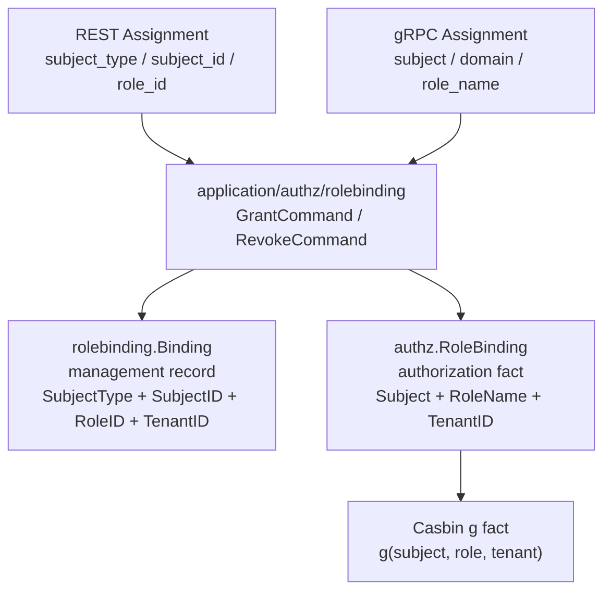
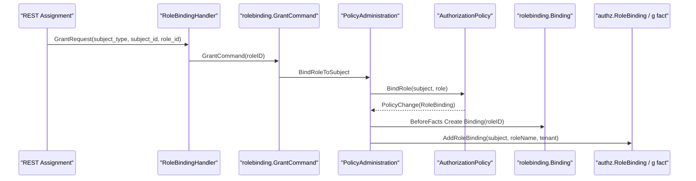

# 为什么 RoleBinding 与 Assignment 要分层

## 本文回答

本文回答：为什么 IAM AuthZ 中要区分 `RoleBinding` 和 `Assignment`；为什么 REST/proto 对外仍保留 `assignment` 这个 wire term，而内部 domain/application 统一使用 `rolebinding`；为什么持久化管理模型 `rolebinding.Binding` 又和授权事实模型 `authz.RoleBinding` 不完全相同；如果全部统一叫 assignment 或全部强行改成 rolebinding，会分别带来什么问题。

读完本文，你应该能回答：

- Assignment 是什么层面的术语；
- RoleBinding 是什么层面的术语；
- `authz.RoleBinding` 和 `rolebinding.Binding` 有什么区别；
- 为什么 REST 路由仍然是 `/authz/assignments/*`；
- 为什么 gRPC 仍然有 `GrantAssignment/RevokeAssignment`；
- 为什么 application/domain 不应该重新出现 `assignment` 包；
- 为什么 REST 用 `role_id`，gRPC 用 `role_name`；
- 为什么管理记录使用 `RoleID`，授权事实使用 `RoleName`；
- 为什么 wire term 和 domain language 分层比“一刀切改名”更稳；
- 这套分层的收益、代价和必须守住的不变量是什么。

---

## 30 秒结论

`Assignment` 和 `RoleBinding` 不是同一个层次的词。

```text
Assignment
  -> 对外 wire term
  -> REST/proto/API 文案中的“授予/分配角色”动作
  -> 兼容调用方理解和历史路径

RoleBinding
  -> 内部领域语言
  -> Subject 在 Tenant 下持有 Role 的授权事实
  -> application/domain/infra 内部应使用这个概念
```

当前实际有三层模型：

| 层次 | 名称 | 字段特点 | 用途 |
| --- | --- | --- | --- |
| REST/proto wire term | Assignment | REST 用 `subject_type + subject_id + role_id`；gRPC 用 `subject + domain + role_name` | 外部 API 契约 |
| 管理记录 | `rolebinding.Binding` | `SubjectType + SubjectID + RoleID + TenantID + GrantedBy` | 后台查询、撤销、按 ID 管理 |
| 授权事实 | `authz.RoleBinding` | `Subject + RoleName + TenantID + GrantedBy` | 生成 Casbin `g` fact，参与运行时授权判定 |

核心结论：

> **Assignment 是接口语言，RoleBinding 是领域语言；Binding 是管理记录，RoleBinding 是授权事实。**

这三者分层，是为了同时满足：

```text
外部接口兼容
内部领域语言稳定
数据库管理方便
运行时授权事实清晰
```

---

## 主图：Assignment、Binding、RoleBinding 三层关系



---

## 重点速查

| 问题 | 当前答案 | 源码入口 |
| --- | --- | --- |
| 授权事实模型在哪里 | `authz.RoleBinding` 定义在通用授权模型中。 | `internal/apiserver/domain/authz/model.go` |
| 管理记录模型在哪里 | `rolebinding.Binding` 定义在 `domain/authz/rolebinding`。 | `internal/apiserver/domain/authz/rolebinding/binding.go` |
| REST 对外为什么叫 assignment | DTO 是 `GrantRequest/RevokeRequest/AssignmentResponse`，路由是 `/authz/assignments/*`。 | `transport/rest/authz/dto/assignment.go` |
| REST handler 内部叫什么 | Handler 名是 `RoleBindingHandler`，调用 `rolebinding.GrantCommand/RevokeCommand`。 | `transport/rest/authz/handler/rolebinding.go` |
| application 命令叫什么 | `application/authz/rolebinding`，接口是 `Commands/Directory`。 | `application/authz/rolebinding/types.go` |
| gRPC 对外叫什么 | `GrantAssignment/RevokeAssignment`，字段使用 `role_name`。 | `api/grpc/iam/authz/v2/authz.proto` |
| 管理记录用什么角色标识 | `RoleID`。 | `domain/authz/rolebinding/binding.go` |
| 授权事实用什么角色标识 | `RoleName`。 | `domain/authz/model.go` |
| REST 当前开放哪些 subject | DTO binding 限定 `oneof=user`。 | `transport/rest/authz/dto/assignment.go` |
| gRPC subject 格式 | `subject` 字符串，如 `user:<id>`。 | `api/grpc/iam/authz/v2/authz.proto` |

---

## 1. 为什么这个问题会出现

IAM 的授权系统同时面对三类读者：

```text
外部 API 调用方
内部领域代码
运行时策略引擎
```

这三类读者对“给某个主体授予角色”这件事的理解不同。

### 1.1 外部 API 调用方

对 REST 或 gRPC 调用方来说，它看到的是：

```text
给用户分配角色
撤销用户角色
列出角色分配记录
```

所以 `assignment` 是自然的接口词。

### 1.2 内部领域代码

对领域模型来说，这不是泛泛的“分配”，而是一个严格的授权事实：

```text
某个 Subject 在某个 Tenant 下持有某个 Role
```

这更准确地叫：

```text
RoleBinding
```

### 1.3 运行时策略引擎

对 Casbin 来说，它最终是：

```text
g = subject, role, domain
```

也就是 grouping rule。

所以，如果所有地方都叫 assignment，会丢失领域精度。  
如果所有地方都强行改成 rolebinding，又会破坏对外契约和调用方理解。

正确做法就是分层。

---

## 2. Assignment：对外 wire term

`Assignment` 是 REST/proto 对外契约语言。

REST 中：

```text
POST   /api/v2/authz/assignments/grant
POST   /api/v2/authz/assignments/revoke
DELETE /api/v2/authz/assignments/{id}
GET    /api/v2/authz/assignments/subject
GET    /api/v2/authz/roles/{id}/assignments
```

DTO 仍然叫：

```text
GrantRequest
RevokeRequest
AssignmentResponse
ListAssignmentQuery
```

字段是：

```text
subject_type
subject_id
role_id
tenant_id
granted_by
```

gRPC 中：

```text
GrantAssignment
RevokeAssignment
```

字段是：

```text
subject
domain
role_name
granted_by
```

### 为什么对外继续用 Assignment

原因有三个：

1. **更符合 API 调用者直觉**  
   外部调用方更容易理解“assign role to user”。

2. **兼容历史契约**  
   REST 路由和 OpenAPI 已经暴露 `/assignments`，随意改路径会破坏调用方。

3. **wire term 可以与 internal term 分层**  
   API 叫 assignment，不代表内部代码也要叫 assignment。

### Assignment 不是内部领域语言

Assignment 只应该出现在：

```text
api/rest
api/grpc
transport/rest DTO / route / swagger tag
少量 transport mapping
```

不应该回到：

```text
domain/authz/assignment
application/authz/assignment
infra/mysql/assignment
```

内部包名和业务语义应统一为：

```text
rolebinding
```

---

## 3. `authz.RoleBinding`：授权事实模型

`authz.RoleBinding` 定义在通用授权模型中：

```text
Subject
RoleName
TenantID
GrantedBy
```

它表达的是：

```text
某个 subject 在某个 tenant 下持有某个 role
```

这个模型是生成运行时授权 facts 的业务事实。

字段语义：

| 字段 | 作用 |
| --- | --- |
| `Subject` | 被授权主体，user/group/service |
| `RoleName` | 角色事实名 |
| `TenantID` | 授权域 |
| `GrantedBy` | 授权人 |

### 为什么用 RoleName，不用 RoleID

运行时授权事实更接近：

```text
role:teacher
```

而不是：

```text
role_id:123
```

Casbin grouping rule 需要的是稳定 role key：

```text
g(user:123, role:teacher, tenant-a)
```

如果运行时 facts 使用 RoleID：

- 可读性差；
- 跨环境迁移困难；
- role rename/display name 语义混乱；
- 和 policy facts 中的 role name 不一致。

因此授权事实层使用：

```text
RoleName
```

### 为什么它不是数据库管理记录

`authz.RoleBinding` 没有：

```text
BindingID
RoleID
```

因为它不是后台管理列表记录。  
它的目标是产生运行时授权事实。

---

## 4. `rolebinding.Binding`：管理记录模型

`rolebinding.Binding` 是管理记录。

字段：

```text
ID
SubjectType
SubjectID
RoleID
TenantID
GrantedBy
```

它表达的是：

```text
数据库里有一条角色绑定管理记录
```

### 为什么管理记录用 RoleID

REST 后台管理更适合使用：

```text
role_id
```

原因：

- 数据库记录稳定；
- REST 路径和管理页面常用数字 ID；
- 按 ID 删除、查询、分页更方便；
- 管理记录需要有自己的 BindingID。

例如：

```text
DELETE /api/v2/authz/assignments/{id}
```

这个 id 对应的是：

```text
rolebinding.Binding.ID
```

不是 Casbin g fact 的主键。

### Binding 和 RoleBinding 的转换

BindRole 时：

```text
REST GrantRequest(role_id)
  -> rolebinding.GrantCommand(roleID)
  -> load Role by RoleID
  -> AuthorizationPolicy.BindRole(subject, role)
  -> authz.RoleBinding(subject, role.Name, tenant)
  -> Casbin g fact
  -> BeforeFacts create rolebinding.Binding(roleID)
```

也就是说：

```text
Binding 用于管理记录
RoleBinding 用于授权事实
```

两者不是重复，而是服务不同目标。

---

## 5. 为什么 REST 用 role_id，gRPC 用 role_name

这是一个非常重要但容易被忽略的接入差异。

### 5.1 REST assignment 使用 role_id

REST DTO：

```text
role_id
```

REST 通常面向：

```text
管理后台
Web/Admin UI
通用 HTTP 调用方
```

这些调用方常通过列表接口拿到 role id，然后发起 grant/revoke。

所以 REST 使用：

```text
role_id
```

更自然。

### 5.2 gRPC assignment 使用 role_name

gRPC proto：

```text
GrantAssignmentRequest {
  subject
  domain
  role_name
  granted_by
}
```

gRPC 更偏服务间调用。  
服务间调用经常使用稳定业务 role key，而不是数据库 ID。

例如：

```text
role_name = teacher
role_name = school_admin
```

这更接近授权事实模型。

### 5.3 application 同时支持两种入口

application `Commands` 同时定义：

```text
Grant / Revoke
GrantByRoleName / RevokeByRoleName
```

也就是：

```text
REST -> role_id based
gRPC -> role_name based
```

但内部最终都要回到：

```text
authz.RoleBinding(subject, roleName, tenant)
```

---

## 6. 为什么不能全都叫 Assignment

如果内部也全部叫 assignment，会产生几个问题。

### 6.1 领域语义不够精确

Assignment 是泛词。  
可以是：

```text
角色分配
任务分配
资源分配
用户分配
```

但 AuthZ 内部需要表达的是：

```text
Subject holds Role inside Tenant
```

`RoleBinding` 更精确。

### 6.2 容易污染授权模型

如果 domain 包叫：

```text
domain/authz/assignment
```

读者很难判断它是：

```text
API assignment
management assignment
runtime role binding
```

最终会把 wire term、管理记录和授权事实揉在一起。

### 6.3 不利于 Casbin facts 映射

Casbin 中对应的是 grouping rule：

```text
g(subject, role, domain)
```

它更接近 RBAC 的 role binding，而不是泛泛 assignment。

### 6.4 历史包会回流

旧的 `assignment` 包如果回到 application/domain/infra，会让新版“rolebinding 作为内部语言”的边界失效。

所以：

```text
assignment 只能留在 API 契约层
```

---

## 7. 为什么也不能把对外全部改成 RoleBinding

反过来，把 REST/proto 对外全部改成 rolebinding 也不一定划算。

### 7.1 API 兼容成本高

REST 路由已经是：

```text
/authz/assignments
```

如果改成：

```text
/authz/role-bindings
```

会破坏已有调用方和 OpenAPI 契约。

### 7.2 外部调用者不一定需要领域词

业务调用方往往只想表达：

```text
给这个用户分配一个角色
撤销这个用户的角色分配
```

`assignment` 对他们更直观。

### 7.3 wire term 可以和 domain term 不同

接口语言和内部领域语言不需要完全一致。

只要边界清楚：

```text
wire: assignment
domain/application: rolebinding
```

就不会混乱。

---

## 8. 转换链路：从 REST Assignment 到 RoleBinding fact

REST grant 链路：

```text
dto.GrantRequest
  -> RoleBindingHandler
  -> rolebinding.GrantCommand
  -> PolicyAdministration.BindRoleToSubject
  -> load Role by RoleID
  -> authz.NewSubject
  -> AuthorizationPolicy.BindRole
  -> authz.RoleBinding
  -> BeforeFacts create rolebinding.Binding
  -> AddRoleBinding g fact
```



### 8.1 这里发生了两次语义转换

第一次：

```text
Assignment DTO
  -> rolebinding command
```

第二次：

```text
rolebinding.Binding management record
  + Role loaded by RoleID
  -> authz.RoleBinding authorization fact
```

这就是分层的价值。

---

## 9. 转换链路：从 gRPC Assignment 到 RoleBinding fact

gRPC grant 链路更接近授权事实：

```text
GrantAssignmentRequest(subject, domain, role_name, granted_by)
  -> parse subject
  -> rolebinding.GrantByRoleNameCommand
  -> find Role by role_name + domain
  -> AuthorizationPolicy.BindRole
  -> authz.RoleBinding
  -> AddRoleBinding g fact
```

gRPC 和 REST 的差异：

| 维度 | REST | gRPC |
| --- | --- | --- |
| 对外名称 | Assignment | Assignment |
| role 标识 | role_id | role_name |
| subject 表达 | subject_type + subject_id | subject 字符串 |
| 典型调用方 | 管理后台 | 可信服务 |
| 内部终点 | RoleBinding fact | RoleBinding fact |

最终都必须统一到：

```text
authz.RoleBinding
```

---

## 10. 与 Permission 的对称关系

AuthZ 模型中有两类事实：

```text
Permission
RoleBinding
```

它们对应 Casbin 两类 rule：

```text
p = role, tenant, resource, action, scope
g = subject, role, tenant
```

Permission 回答：

```text
这个 role 能做什么？
```

RoleBinding 回答：

```text
这个 subject 持有什么 role？
```

如果把 RoleBinding 叫 Assignment，模型对称性会变差：

```text
Permission + Assignment
```

不如：

```text
Permission + RoleBinding
```

清楚。

这也是为什么内部领域语言应坚持：

```text
RoleBinding
```

---

## 11. 与 AuthZ 写入事务的关系

RoleBinding 和 Assignment 分层不是单纯命名问题。  
它会影响写入事务。

一次 REST assignment grant 实际上要写：

```text
rolebinding.Binding 管理记录
authz.RoleBinding 授权事实
PolicyVersion
Outbox event
runtime reload
```

如果内部只叫 assignment，很容易把这件事误解为：

```text
insert assignment row
```

但真实语义是：

```text
subject-role relationship changed
runtime authorization facts changed
policy version changed
```

所以内部使用 `RoleBinding` 能提醒开发者：

```text
这不是普通分配记录，而是授权关系事实。
```

---

## 12. 替代方案分析

### 方案一：全部叫 Assignment

优点：

- REST/proto/内部命名统一；
- 新人初看简单。

问题：

- 领域语义模糊；
- assignment 包容易回流 domain/application/infra；
- 管理记录和授权事实混淆；
- 无法体现 RBAC role binding 概念；
- 与 Permission 不对称。

结论：

```text
不适合作为内部领域语言。
```

### 方案二：全部叫 RoleBinding

优点：

- 内外术语一致；
- 领域语言准确。

问题：

- 破坏 REST/proto 现有契约；
- API 调用者理解成本增加；
- 迁移路由和 SDK 成本高；
- 对外不一定需要这么领域化。

结论：

```text
不适合强行改造所有 wire term。
```

### 方案三：wire term 保留 Assignment，内部统一 RoleBinding

优点：

- API 兼容；
- 外部语义直观；
- 内部领域语言准确；
- 管理记录和授权事实可分层；
- 架构测试可保护旧 assignment 包不回流。

代价：

- 文档必须讲清楚；
- handler/DTO 名称和 application/domain 名称不同；
- 新人需要理解转换链路。

结论：

```text
这是当前最合理的选择。
```

---

## 13. 当前设计收益

### 13.1 API 兼容性好

外部仍使用：

```text
assignments
GrantAssignment
RevokeAssignment
```

不破坏调用方。

### 13.2 内部领域语言稳定

内部使用：

```text
rolebinding
```

能准确表达 RBAC 关系。

### 13.3 管理记录与授权事实清晰分层

```text
rolebinding.Binding
  -> DB 管理记录

authz.RoleBinding
  -> runtime 授权事实
```

### 13.4 REST/gRPC 可各自选择适合的 role 标识

```text
REST role_id
gRPC role_name
```

同时最终统一到 role binding fact。

### 13.5 架构护栏更好写

测试可以明确禁止：

```text
domain/authz/assignment
application/authz/assignment
infra/mysql/assignment
```

同时允许：

```text
transport/rest/authz/dto/assignment.go
proto GrantAssignment
```

---

## 14. 当前设计代价

### 14.1 文档必须解释

不解释的话，读者会疑惑：

```text
为什么路由叫 assignments，但 handler 叫 RoleBindingHandler？
```

所以必须在文档中明确：

```text
assignment = wire term
rolebinding = internal term
```

### 14.2 转换链路更长

REST 到 domain 需要：

```text
Assignment DTO
  -> GrantCommand
  -> Binding management record
  -> RoleBinding fact
```

### 14.3 命名不完全一致

DTO、Swagger、proto 和 domain 名称不同。  
这需要契约文档和架构测试共同维护。

### 14.4 未来迁移要谨慎

如果未来要对外也改成 rolebinding，需要：

- 新增 v3 API；
- 保留 v2 assignment compatibility；
- 更新 OpenAPI/proto/SDK；
- 提供迁移说明。

不应该在 v2 中直接破坏现有路径。

---

## 15. 必须守住的不变量

### 15.1 Assignment 只能是 wire term

允许出现在：

```text
api/rest
api/grpc
transport DTO
Swagger/OpenAPI/proto
```

不应出现在：

```text
domain/authz/assignment
application/authz/assignment
infra/mysql/assignment
```

### 15.2 内部包名统一 rolebinding

应用层和领域管理记录应使用：

```text
application/authz/rolebinding
domain/authz/rolebinding
infra/mysql/rolebinding
```

### 15.3 授权事实统一 authz.RoleBinding

生成 Casbin g fact 的必须是：

```text
authz.RoleBinding
```

而不是 REST DTO 或管理记录。

### 15.4 管理记录可以用 RoleID

后台管理、REST grant/revoke、binding ID 撤销，可以使用 RoleID。

### 15.5 授权事实必须用 RoleName

Casbin g fact 和 `authz.RoleBinding` 应使用 RoleName。

### 15.6 REST 当前只开放 user subject

REST DTO binding 当前限定：

```text
oneof=user
```

不能写成 REST 已全面支持 group/service assignment。

### 15.7 gRPC subject 是 wire 字符串

gRPC Check/Assignment 使用：

```text
subject = "user:<id>"
```

这和 REST 的 `subject_type + subject_id` 不同。

---

## 16. 面试/宣讲讲法

### 10 秒版

```text
Assignment 是对外接口里的“角色分配”说法，RoleBinding 是内部领域里的“主体持有角色”事实；我把它们分层，是为了兼顾 API 兼容和领域语义准确。
```

### 30 秒版

```text
IAM 中 REST/proto 对外仍使用 assignment，因为调用方更容易理解“给用户分配角色”，也能保持已有 API 兼容。但内部 application/domain 统一使用 rolebinding，因为本质上这是 RBAC 中 subject 在 tenant 下持有 role 的授权事实。同时我又区分了管理记录 rolebinding.Binding 和授权事实 authz.RoleBinding：前者用 RoleID 便于后台管理，后者用 RoleName 生成 Casbin g fact。
```

### 3 分钟版结构

```text
1. 先说明 assignment 和 rolebinding 是不同层级词
2. REST/proto 为什么保留 assignment
3. 内部为什么统一 rolebinding
4. Binding 管理记录和 RoleBinding 授权事实的区别
5. REST role_id 与 gRPC role_name 的差异
6. 写入链路如何转换
7. 收益、代价、不变量
```

---

## 17. 常见追问

### Q1：为什么不把 REST 路由也改成 `/role-bindings`？

因为 v2 API 已经暴露 `/assignments`，直接改名会破坏外部契约。  
当前更好的做法是保留 wire term，并在内部统一 rolebinding。

### Q2：为什么 REST 用 role_id，gRPC 用 role_name？

REST 更偏管理后台，通常先查角色列表再用 role_id 操作。  
gRPC 更偏服务间调用，role_name 更接近稳定授权事实。两者最终都会转换为 RoleName-based RoleBinding fact。

### Q3：为什么管理记录不用 RoleName？

管理记录需要 ID、RoleID、分页、按 ID 删除等后台管理能力。  
RoleID 对数据库管理更方便。授权事实才需要 RoleName。

### Q4：为什么授权事实不用 RoleID？

运行时 policy 更需要稳定业务角色名，例如 `role:teacher`。  
RoleID 跨环境可读性和迁移性差，不适合作为 policy fact。

### Q5：Assignment 和 RoleBinding 都存在会不会让人困惑？

会，所以必须通过文档和架构测试固定边界。  
困惑的代价小于破坏 API 兼容或内部领域语义模糊的代价。

### Q6：group/service subject 现在支持了吗？

通用 `authz.Subject` 支持 user/group/service，但 REST DTO 当前限定 `oneof=user`。  
不能把模型预留能力写成 REST 已开放能力。

---

## 18. 代码证据地图

| 结论 | 源码/契约入口 |
| --- | --- |
| 授权事实模型是 `authz.RoleBinding` | `internal/apiserver/domain/authz/model.go` |
| 管理记录模型是 `rolebinding.Binding` | `internal/apiserver/domain/authz/rolebinding/binding.go` |
| REST DTO 对外仍叫 Assignment | `internal/apiserver/transport/rest/authz/dto/assignment.go` |
| REST handler 内部是 RoleBindingHandler | `internal/apiserver/transport/rest/authz/handler/rolebinding.go` |
| application 内部是 rolebinding Commands/Directory | `internal/apiserver/application/authz/rolebinding/types.go` |
| gRPC 对外仍叫 GrantAssignment/RevokeAssignment | `api/grpc/iam/authz/v2/authz.proto` |
| RoleBinding fact 由 AuthorizationPolicy 生成 | `internal/apiserver/domain/authz/policy/authorization_policy.go` |
| Casbin g fact 由 authz.RoleBinding 映射 | `internal/apiserver/infra/casbin/facts.go` |
| 架构测试禁止 assignment 包回流 | `internal/pkg/architecture/architecture_test.go` |

---

## 19. 推荐源码阅读路线

### 第一轮：通用授权模型

```text
internal/apiserver/domain/authz/model.go
```

目标：理解 `authz.RoleBinding` 的授权事实语义。

### 第二轮：管理记录模型

```text
internal/apiserver/domain/authz/rolebinding/binding.go
internal/apiserver/domain/authz/rolebinding/validator.go
internal/apiserver/domain/authz/rolebinding/repository.go
```

目标：理解 `rolebinding.Binding` 为什么使用 RoleID。

### 第三轮：REST wire term

```text
internal/apiserver/transport/rest/authz/dto/assignment.go
internal/apiserver/transport/rest/authz/handler/rolebinding.go
api/rest/authz.v2.yaml
```

目标：理解 REST 为什么仍是 assignment route 和 DTO。

### 第四轮：gRPC wire term

```text
api/grpc/iam/authz/v2/authz.proto
internal/apiserver/transport/grpc/service/authz/service.go
```

目标：理解 gRPC GrantAssignment/RevokeAssignment 为什么使用 role_name。

### 第五轮：应用转换链路

```text
internal/apiserver/application/authz/rolebinding/types.go
internal/apiserver/application/authz/rolebinding/command_service.go
internal/apiserver/application/authz/policy/administration.go
```

目标：理解 REST/gRPC command 如何统一进入 RoleBinding 事实。

### 第六轮：Facts 映射与架构护栏

```text
internal/apiserver/infra/casbin/facts.go
internal/pkg/architecture/architecture_test.go
```

目标：理解 authz.RoleBinding 如何变成 Casbin g fact，以及 assignment 包为何不能回流。

---

## 20. 验证建议

```bash
go test ./internal/apiserver/domain/authz/... \
  ./internal/apiserver/application/authz/rolebinding \
  ./internal/apiserver/application/authz/policy \
  ./internal/apiserver/transport/rest/authz/handler \
  ./internal/apiserver/transport/grpc/service/authz \
  ./internal/apiserver/infra/casbin \
  ./internal/pkg/architecture

make docs-hygiene
```

建议重点测试方向：

| 测试方向 | 目的 |
| --- | --- |
| REST GrantAssignment | DTO role_id -> GrantCommand |
| REST RevokeAssignment | DTO role_id -> RevokeCommand |
| REST subject_type | 当前只允许 user |
| gRPC GrantAssignment | role_name -> GrantByRoleName |
| gRPC RevokeAssignment | role_name -> RevokeByRoleName |
| Binding management record | RoleID 持久化正确 |
| authz.RoleBinding fact | RoleName 转 Casbin g fact 正确 |
| UnbindByID | BindingID -> RoleID -> RoleName -> RemoveRoleBinding |
| Architecture guard | assignment 包不回流 domain/application/infra |
| Docs hygiene | 活跃文档不把 assignment 写成内部领域包 |

---

## 本文总结

RoleBinding 与 Assignment 分层的根本原因是：

```text
接口语言和领域语言服务的对象不同。
```

Assignment 服务外部调用方：

```text
给主体分配角色
撤销角色分配
查询角色分配记录
```

RoleBinding 服务内部授权模型：

```text
Subject 在 Tenant 下持有 Role
```

Binding 服务管理记录：

```text
这条角色绑定记录的 ID、RoleID、TenantID、GrantedBy 是什么
```

所以当前正确分层是：

```text
REST/proto:
  Assignment

application/domain internal:
  rolebinding

management record:
  rolebinding.Binding by RoleID

authorization fact:
  authz.RoleBinding by RoleName
```

这套设计看起来比“一刀切命名”复杂，但它同时保住了：

```text
API 兼容
领域语义
后台管理
运行时授权事实
架构防漂移
```

这就是为什么 IAM 不应该把 Assignment 和 RoleBinding 混成一个概念。
