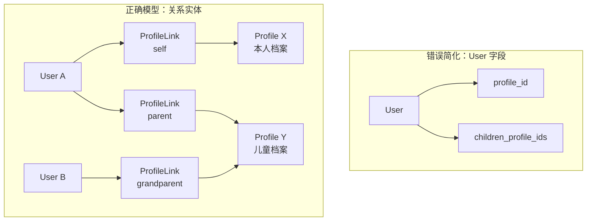
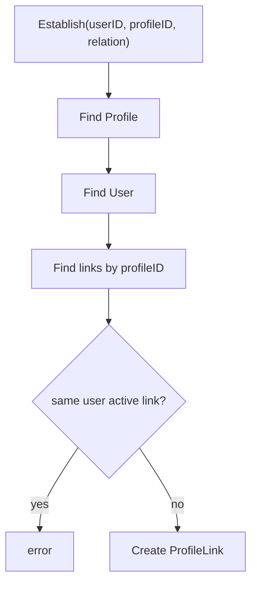
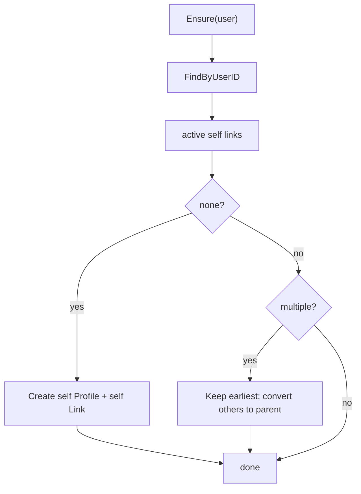

# 为什么 ProfileLink 不能只是 User 字段

## 本文回答

本文回答：为什么 IAM Identity 模块不能把 Profile 关系简化成 `User.profile_id`、`User.children` 或 `Profile.user_id` 字段；为什么必须把 User 与 Profile 之间的关系建模成独立的 `ProfileLink`；ProfileLink 为什么需要 relation、type、active/revoked 状态、self link 不变量、当前用户访问 guard 和数据库唯一约束；它和 AuthZ permission 又是什么边界。

读完本文，你应该能回答：

- User 和 Profile 分别是什么；
- 为什么 User 不是 Profile；
- 为什么 Profile 也不直接属于某个 User；
- 为什么一个 User 可能关联多个 Profile；
- 为什么一个 Profile 可能被多个 User 关联；
- 为什么关系本身需要 relation、type 和状态；
- 为什么撤销关系不应该物理删除；
- 为什么 self profile link 需要不变量保护；
- 为什么 MyProfiles / MyProfileLinks 需要基于 ProfileLink 做访问 guard；
- 为什么 ProfileLink 不是 AuthZ 权限；
- 如果把 ProfileLink 简化成 User 字段，会丢掉哪些能力；
- 当前设计的收益、代价和必须守住的不变量是什么。

---

## 30 秒结论

ProfileLink 不能只是 User 字段，因为它表达的不是“用户资料的一部分”，而是：

```text
User 与 Profile 之间的一条可建模、可撤销、可查询、可约束的关系边。
```

普通字段只能表达：

```text
User.profile_id = 123
```

但 IAM 需要表达：

```text
User A 是 Profile X 的 self
User A 是 Profile Y 的 parent
User B 也是 Profile Y 的 parent
User C 是 Profile Y 的 grandparent
这条关系什么时候建立？
这条关系是否已经撤销？
当前用户是否有 active link 可以访问这个 Profile？
这个 User 是否只有一个 active self ProfileLink？
```

所以正确模型是：

```text
User -- ProfileLink -- Profile
```

而不是：

```text
User.profile_id
Profile.user_id
User.children
```

当前 ProfileLink 拥有：

```text
User
Profile
Type: self / relation
Relation: self / parent / grandparent / other
EstablishedAt
RevokedAt
```

一句话：

> **User 是登录主体，Profile 是业务档案，ProfileLink 是二者之间的关系事实。关系有类型、状态和历史，所以必须独立建模。**

---

## 主图：字段建模 vs 关系实体建模



---

## 重点速查

| 问题 | 当前答案 | 源码入口 |
| --- | --- | --- |
| User 是什么 | IAM 内部身份锚点，包含状态和基础资料。 | `domain/uc/user/user.go` |
| Profile 是什么 | 业务档案，包含姓名、证件、性别、生日、身高体重。 | `domain/uc/profile/profile.go` |
| ProfileLink 是什么 | User 与 Profile 的关系边，包含 type/relation/established/revoked。 | `domain/uc/profilelink/profile_link.go` |
| 支持哪些关系 | self、parent、grandparent、other。 | `profile_link.go` |
| 关系是否有效如何判断 | `IsActive()` 判断 `RevokedAt == nil`。 | `profile_link.go` |
| 建立关系会校验什么 | Profile 存在、User 存在、同 User/Profile 没有 active duplicate。 | `domain/uc/profilelink/linker.go` |
| 撤销关系如何实现 | `Revoke` 设置 `RevokedAt`，不是删除记录。 | `profile_link.go`、`linker.go` |
| self link 不变量如何维护 | `SelfProfileEnsurer` 保证 active self link，重复时保留最早、其他转 parent。 | `domain/uc/profilelink/self_profile_ensurer.go` |
| 当前用户创建档案如何处理 | `MyProfiles.Create` 同事务创建 Profile 和 ProfileLink。 | `application/uc/profile/service_my_profiles.go` |
| 当前用户访问 Profile 如何 guard | `accessibleProfileIDInTx` 查 active ProfileLink。 | `application/uc/profile/service_access.go` |
| 当前用户操作 ProfileLink 如何 guard | `MyProfileLinks` 禁止 grant/list/revoke 其他 user 的 link。 | `application/uc/profilelink/service_access.go` |
| active self link 如何做 DB 兜底 | `self_key` + `uk_active_self_profile_link`。 | `migration/000007_add_active_self_profile_link_guard.up.sql` |

---

## 1. User 和 Profile 不是同一个概念

### 1.1 User 是身份锚点

User 是 IAM 内部身份锚点。

它回答：

```text
这个登录主体是谁？
这个用户当前 active / inactive / blocked 吗？
这个用户的基础资料是什么？
```

当前 User 字段包括：

```text
ID
Name
Nickname
Phone
Email
IDCard
Status
```

User 会参与：

- AuthN token claims；
- session subject access；
- AuthZ subject；
- 当前用户接口；
- block / deactivate 生命周期。

### 1.2 Profile 是业务档案

Profile 是业务档案。

它回答：

```text
这个被记录、被测评、被关联的业务个体是谁？
```

当前 Profile 字段包括：

```text
ID
Name
IDCard
Gender
Birthday
Height
Weight
```

Profile 更接近：

```text
本人档案
儿童档案
被测评者档案
业务侧个体资料
```

Profile 不直接登录，不直接拥有 session，也不直接作为 AuthZ subject。

### 1.3 二者不能合并

如果把 Profile 字段放进 User，会导致：

- 业务档案污染登录主体；
- 儿童档案被迫变成登录用户；
- 多档案场景无法表达；
- 多用户共同关联一个档案无法表达；
- 关系类型和撤销历史无法表达。

所以必须拆分：

```text
User
Profile
ProfileLink
```

---

## 2. 为什么 `User.profile_id` 不够

最简单方案是：

```text
users.profile_id
```

这个方案只能表达：

```text
一个 User 对应一个 Profile
```

但 IAM 至少需要这些场景：

### 2.1 一个 User 关联多个 Profile

例如：

```text
用户本人档案
孩子 A 档案
孩子 B 档案
```

一个字段无法表达多个关系。

### 2.2 一个 Profile 被多个 User 关联

例如一个儿童档案：

```text
父亲 UserA
母亲 UserB
祖父 UserC
```

都可能关联同一个 Profile。

如果用 `Profile.user_id`，只能归属一个 User，无法支持家庭协作。

### 2.3 关系有类型

同样是 User/Profile 关联，关系可能是：

```text
self
parent
grandparent
other
```

`profile_id` 字段表达不了关系类型。

### 2.4 关系有状态

关系可能：

```text
active
revoked
```

普通字段只能表达“现在指向谁”，不能表达：

```text
曾经关联过
何时撤销
撤销后能否重新建立
```

### 2.5 关系有不变量

系统需要保证：

```text
每个 User 最多一个 active self ProfileLink
```

单个字段无法表达“self link 与普通 relation link 的不同约束”。

---

## 3. 为什么 `User.children` 也不够

另一种方案是：

```text
User.children_profile_ids
```

或者：

```text
user_children(user_id, profile_id)
```

这比 `profile_id` 好一点，但仍然不够。

### 3.1 只表达 parent，不能表达 self / grandparent / other

`children` 默认把关系限定为 parent-child。  
但当前系统需要：

```text
self
parent
grandparent
other
```

### 3.2 不能表达关系生命周期

如果只是 children 列表，通常不会有：

```text
EstablishedAt
RevokedAt
```

也就不能保留历史关系。

### 3.3 不能支持本人档案不变量

`children` 语义无法覆盖：

```text
self profile
```

而 self profile 是当前 Identity 模型的关键不变量。

### 3.4 名称会污染模型

如果系统里只有儿童档案，可以叫 children。  
但 IAM 的 Profile 是更通用的业务档案，不能被 children 这个单一场景绑死。

所以更稳定的词是：

```text
ProfileLink
```

而不是：

```text
ChildRelation
UserChildren
GuardianRef
```

---

## 4. ProfileLink 解决了什么

ProfileLink 把关系本身变成一等实体。

它的字段：

```text
ID
User
Profile
Type
Rel
EstablishedAt
RevokedAt
```

其中：

```text
Type = self / relation
Rel  = self / parent / grandparent / other
```

### 4.1 关系类型

```text
RelSelf
RelParent
RelGrandparent
RelOther
```

这能表达不同业务语义。

### 4.2 主类别 Type

`Type` 区分：

```text
self
relation
```

其中 self 有特殊约束：

```text
一个 User 只能有一个 active self link
```

普通 relation 不受这个唯一约束。

### 4.3 active / revoked 状态

`IsActive()` 的语义：

```text
RevokedAt == nil
```

撤销关系时：

```text
Revoke(at)
```

会设置 `RevokedAt`，而不是删除。

### 4.4 历史保留

软撤销保留：

```text
这条关系曾经存在
何时撤销
之后是否重新建立
```

这对于审计和业务追溯都重要。

---

## 5. 建立关系为什么是领域能力

`ProfileLinker.Establish` 不只是 new 一个 struct。

它会：

```text
检查 Profile 存在
检查 User 存在
检查同一个 User/Profile 没有 active duplicate
根据 relation 计算 Type
创建 ProfileLink entity
```

这说明建立关系本身是领域行为，不是简单 repository insert。



### 为什么不在 handler 里直接 Create

如果 handler 直接 create，会绕过：

- User/Profile 存在性校验；
- active duplicate 校验；
- relation -> type 规则；
- 领域错误语义；
- UoW 组合事务。

所以 ProfileLink 必须有领域能力。

---

## 6. 撤销关系为什么不是删除字段

如果是 `User.profile_id`，撤销关系通常是：

```text
user.profile_id = null
```

或者删除一条关联表记录。

ProfileLink 当前选择：

```text
设置 RevokedAt
```

### 6.1 为什么保留历史

因为业务上可能需要知道：

```text
这个用户曾经关联过哪个档案
什么时候撤销
撤销后是否又重新建立
```

### 6.2 为什么 active 查询默认过滤 revoked

大部分当前业务只关心 active 关系。  
Repository 提供 active only 和 including revoked 两类查询，满足：

```text
当前访问
历史追溯
```

### 6.3 为什么撤销后可以重新建立

duplicate 检查只拒绝：

```text
same user + same profile + active link
```

如果旧 link 已 revoked，后续可以重新建立新关系。

这比简单删除更具备业务表达力。

---

## 7. SelfProfileEnsurer：为什么本人档案要单独保护

系统希望每个登录 User 有一个 active self profile link。

原因是很多业务流程需要：

```text
当前登录用户自己的档案
```

如果没有 self profile/link，就会出现：

- `/identity/me/profiles` 没有本人档案；
- 当前用户档案关系不完整；
- onboarding 后无法稳定找到“本人”档案；
- 后续业务系统需要自己补默认档案。

所以有：

```text
SelfProfileEnsurer
```

它的逻辑：

```text
如果没有 active self link：
  -> 创建 Profile(Name=user.Name)
  -> 创建 self ProfileLink

如果有多个 active self links：
  -> 保留最早一条 self
  -> 其他转换为 parent relation
```



### 7.1 为什么不是 User.self_profile_id

因为 self profile 只是 ProfileLink 的一种关系。  
如果为了 self 单独加字段：

```text
User.self_profile_id
```

就会让 self 关系和普通关系走两套模型：

```text
self 在 User 字段
parent 在 ProfileLink 表
grandparent 在另一张表？
```

这会破坏模型统一性。

正确做法是：

```text
self 也是 ProfileLink
但有额外不变量
```

### 7.2 DB 也要兜底

代码层保护不够，还需要数据库兜底。

当前 mapper 在 active self link 时设置：

```text
self_key = user_id
```

migration 创建：

```text
uk_active_self_profile_link(self_key)
```

这样同一个 User 只能有一个 active self link。

---

## 8. MyProfiles：为什么当前用户访问 Profile 要走 ProfileLink guard

当前用户访问 Profile 不能简单：

```text
GET /profiles/{id}
  -> FindProfileByID
```

否则任何登录用户只要猜到 profile id，就能读/改别人的档案。

当前 `MyProfiles.Get/Patch` 会先检查：

```text
FindByUserIDAndProfileID(userID, profileID)
```

如果没有 active ProfileLink，返回：

```text
permission denied
```

也就是说：

```text
当前用户能访问这个 Profile
  是因为他与这个 Profile 有 active ProfileLink
```

### 8.1 Create 也要同时建关系

`MyProfiles.Create` 会在同一个 UoW transaction 中：

```text
Create Profile
Establish ProfileLink(currentUser, profile, relation)
Create ProfileLink
```

这保证：

```text
不会出现孤立 Profile
不会出现 Profile 创建成功但关系未建立
```

### 8.2 Patch 也要查关系

Patch 先调用：

```text
accessibleProfileIDInTx
```

再加载 Profile 并更新。

这保证“当前用户视角”的 Profile 编辑不会绕过关系检查。

---

## 9. MyProfileLinks：为什么当前用户不能操作别人的关系

ProfileLink 有系统侧 Commands，也有当前用户视角 MyProfileLinks。

`MyProfileLinks.Grant` 规则：

```text
如果 dto.UserID 非空且不等于 currentUserID：
  permission denied
否则 dto.UserID = currentUserID
```

`MyProfileLinks.List` 也禁止查询其他用户。

`MyProfileLinks.Revoke` 会解析 selector 后检查：

```text
resolved userID == currentUserID
```

否则拒绝。

### 9.1 为什么需要 MyProfileLinks

如果直接暴露系统侧 Commands 给 REST 当前用户：

```text
用户 A 可以给用户 B 建立关系
用户 A 可以撤销用户 B 的关系
用户 A 可以查询用户 B 的关系
```

这显然不安全。

所以要区分：

```text
Commands = 系统侧能力
MyProfileLinks = 当前用户视角能力
```

### 9.2 这不是 AuthZ

MyProfileLinks 的 guard 是 Identity 关系 guard。  
它不是完整 AuthZ permission。

它回答的是：

```text
当前 user 是否能操作自己的 ProfileLink？
当前 user 是否 linked 到这个 Profile？
```

AuthZ 回答的是：

```text
subject 是否能对某 resource 执行某 action？
```

两者不同。

---

## 10. ProfileLink 与 AuthZ 的边界

ProfileLink 可以做身份关系 guard，但它不是 AuthZ 权限。

### 10.1 ProfileLink 回答的问题

```text
User 和 Profile 有没有 active relationship？
关系是什么？
是否撤销？
```

例如：

```text
user:123 是 profile:456 的 parent
```

### 10.2 AuthZ 回答的问题

```text
subject 是否能对 resource 执行 action？
```

例如：

```text
user:123 can read identity:profile:* in scope origin:school-a
```

### 10.3 为什么不能把 ProfileLink 当权限

如果把 ProfileLink 当 Permission，会混淆：

- 亲属关系；
- 档案访问；
- 资源操作；
- tenant/scope；
- 管理权限；
- 业务协作关系。

正确做法是：

```text
ProfileLink 表达身份关系
AuthZ 表达资源权限
```

未来如果要把 Profile 访问纳入统一 AuthZ，应新增：

```text
Resource: identity:profile:*
Action: read / update / link / revoke
Scope: profile:<id> 或 origin:<value>
```

而不是让 ProfileLink 承担所有权限语义。

---

## 11. 与 Suggest 的边界

Suggest 只做候选发现：

```text
输入关键词
  -> 返回候选 Profile terms
```

它不代表：

```text
用户已经 linked 到这个 Profile
用户有权访问这个 Profile
用户可以编辑这个 Profile
```

正确链路是：

```text
Suggest 找候选
  -> 用户/系统选择目标 Profile
  -> 建立 ProfileLink
  -> 后续访问基于 active ProfileLink guard
```

如果把 Suggest 结果当作关系，会造成严重越权风险。

---

## 12. 如果用 User 字段会丢掉什么

### 12.1 丢掉多档案

`User.profile_id` 只能表达一个档案。

### 12.2 丢掉多人协作

`Profile.user_id` 只能表达一个拥有者。

### 12.3 丢掉关系类型

字段表达不了：

```text
self / parent / grandparent / other
```

### 12.4 丢掉关系历史

字段更新只留下最终状态，不能保留：

```text
EstablishedAt
RevokedAt
```

### 12.5 丢掉 self link 不变量

无法统一表达：

```text
self 是一种特殊 ProfileLink
```

### 12.6 丢掉当前用户 guard

如果直接按 ProfileID 查 Profile，很容易绕过关系检查。

### 12.7 丢掉未来扩展能力

后续如果要增加：

```text
guardian
teacher
doctor
viewer
emergency_contact
```

User 字段会继续膨胀，而 ProfileLink 只需扩展 relation/type 或额外属性。

---

## 13. 替代方案分析

### 方案一：User.profile_id

优点：

- 最简单；
- 查询本人档案方便；
- 初期代码少。

问题：

- 只能一对一；
- 无法表达儿童档案；
- 无法多人关联一个 Profile；
- 无法表达关系类型和撤销历史。

结论：

```text
不适合 IAM。
```

### 方案二：Profile.user_id

优点：

- Profile 归属清楚；
- 查询某用户 Profile 直接。

问题：

- 一个 Profile 只能有一个 User；
- 家庭协作场景无法表达；
- self/parent/grandparent 混淆；
- 关系撤销历史缺失。

结论：

```text
也不适合。
```

### 方案三：User.children JSON/List

优点：

- 可以表达多个儿童档案；
- 比单 profile_id 稍强。

问题：

- 关系不规范；
- 难以查询反向关系；
- 难以做事务和约束；
- 不支持 self/other；
- 不利于审计和撤销。

结论：

```text
短期可以 hack，长期不可维护。
```

### 方案四：ProfileLink 关系实体

优点：

- 支持多对多；
- 支持关系类型；
- 支持软撤销；
- 支持 self 不变量；
- 支持当前用户 guard；
- 支持历史查询；
- 支持后续扩展。

代价：

- 多一个领域对象；
- 查询需要 join/多查；
- 应用层需要 UoW 组合写入；
- 文档必须解释 ProfileLink 不是 AuthZ 权限。

结论：

```text
这是当前 IAM 最合理的选择。
```

---

## 14. 当前设计收益

### 14.1 领域表达准确

User、Profile、ProfileLink 分别表达：

```text
登录主体
业务档案
关系事实
```

### 14.2 支持家庭/儿童档案场景

一个儿童 Profile 可以被多个 User 关联。  
一个 User 可以关联多个儿童 Profile。

### 14.3 支持本人档案

self link 被纳入同一关系模型，同时通过 self_key unique index 保护。

### 14.4 支持访问 guard

当前用户访问档案必须有 active ProfileLink。  
这降低越权风险。

### 14.5 支持历史追溯

撤销关系保留 RevokedAt。  
后续可以做关系历史、审计、纠错。

### 14.6 支持扩展

未来可扩展更多 relation、metadata、approval、邀请机制，而不需要改 User 表结构。

---

## 15. 当前设计代价

### 15.1 模型更复杂

读者必须理解：

```text
User != Profile
ProfileLink != AuthZ Permission
self link 是 ProfileLink 特例
```

### 15.2 查询更复杂

查询当前用户档案需要：

```text
ProfileLinks.FindByUserID
Profiles.FindByID
```

而不是直接从 User 字段读取。

### 15.3 事务更重要

创建 Profile + ProfileLink 必须同事务。  
否则会出现孤立档案或孤立关系。

### 15.4 DB 约束要维护

active self link 不变量需要 mapper + migration + unique index 一起保护。

---

## 16. 必须守住的不变量

### 16.1 User 不是 Profile

不能把 Profile 字段重新塞回 User。

### 16.2 Profile 不直接属于 User

Profile 通过 ProfileLink 与 User 关联。

### 16.3 self 也是 ProfileLink

不要单独加 `User.self_profile_id` 破坏统一模型。

### 16.4 每个 User 最多一个 active self link

代码层和 DB 层都要保护。

### 16.5 撤销是软撤销

撤销 ProfileLink 应设置 RevokedAt，不应直接删除历史。

### 16.6 当前用户访问 Profile 必须检查 active ProfileLink

不能直接按 ProfileID 读写 Profile。

### 16.7 ProfileLink 不是 AuthZ Permission

关系 guard 和资源权限必须区分。

---

## 17. 面试/宣讲讲法

### 10 秒版

```text
ProfileLink 不能只是 User 字段，因为 User 和 Profile 是多对多关系，而且关系本身有类型、状态和历史；所以我把它建模成独立关系实体。
```

### 30 秒版

```text
在 IAM 里 User 是登录主体，Profile 是业务档案，比如本人档案或儿童档案。一个 User 可以关联多个 Profile，一个 Profile 也可能被多个 User 关联，而且关系有 self、parent、grandparent、other，不是一个 profile_id 字段能表达的。所以我用 ProfileLink 作为关系实体，支持关系类型、软撤销、self link 不变量和当前用户访问 guard。
```

### 3 分钟版结构

```text
1. 先解释 User 和 Profile 的语义不同
2. 讲 User.profile_id / Profile.user_id 的不足
3. 讲 ProfileLink 的字段和关系类型
4. 讲 self link 不变量
5. 讲 MyProfiles/MyProfileLinks 的访问 guard
6. 讲它和 AuthZ 的边界
7. 讲收益、代价和不变量
```

---

## 18. 常见追问

### Q1：为什么不直接在 User 里放 profile_id？

因为一个 User 可能关联多个 Profile，一个 Profile 也可能被多个 User 关联。`profile_id` 只能表达一对一。

### Q2：为什么不把儿童档案作为 User 的 children 字段？

children 只表达父子关系，无法表达 self、grandparent、other，也难以支持撤销历史和反向查询。

### Q3：ProfileLink 是权限吗？

不是。  
ProfileLink 是身份关系。它可以作为当前用户访问档案的 guard，但资源权限仍由 AuthZ 判定。

### Q4：为什么撤销不删除？

因为关系历史有价值。软撤销可以保留 RevokedAt，支持审计、追溯和重新建立关系。

### Q5：为什么需要 self profile？

很多业务流程需要当前用户自己的档案。self profile 通过 ProfileLink 统一表达，而不是另开 User.self_profile_id。

### Q6：self link 为什么还要数据库唯一约束？

代码层可能在并发或历史数据下失效。DB unique index 是兜底，保证一个 User 只有一个 active self link。

---

## 19. 代码证据地图

| 结论 | 代码入口 |
| --- | --- |
| User 是身份锚点 | `domain/uc/user/user.go` |
| Profile 是业务档案 | `domain/uc/profile/profile.go` |
| ProfileLink 包含 User/Profile/Type/Rel/EstablishedAt/RevokedAt | `domain/uc/profilelink/profile_link.go` |
| Establish 校验 User/Profile 存在和 active duplicate | `domain/uc/profilelink/linker.go` |
| Revoke 设置 RevokedAt | `domain/uc/profilelink/linker.go`、`profile_link.go` |
| SelfProfileEnsurer 维护 active self link | `domain/uc/profilelink/self_profile_ensurer.go` |
| MyProfiles.Create 同事务创建 Profile + ProfileLink | `application/uc/profile/service_my_profiles.go` |
| MyProfiles.Get/Patch 用 active ProfileLink guard | `application/uc/profile/service_access.go` |
| MyProfileLinks 限制 currentUserID | `application/uc/profilelink/service_access.go` |
| active self link DB 约束 | `infra/mysql/profilelink/mapper.go`、`000007_add_active_self_profile_link_guard.up.sql` |

---

## 20. 推荐源码阅读路线

### 第一轮：User 与 Profile 模型

```text
internal/apiserver/domain/uc/user/user.go
internal/apiserver/domain/uc/profile/profile.go
```

目标：先理解 User 与 Profile 的语义差异。

### 第二轮：ProfileLink 领域模型

```text
internal/apiserver/domain/uc/profilelink/profile_link.go
internal/apiserver/domain/uc/profilelink/relation.go
internal/apiserver/domain/uc/profilelink/linker.go
```

目标：理解 relation、type、active/revoked、establish/revoke。

### 第三轮：self link 不变量

```text
internal/apiserver/domain/uc/profilelink/self_profile_ensurer.go
internal/apiserver/infra/mysql/profilelink/mapper.go
internal/pkg/migration/migrations/000007_add_active_self_profile_link_guard.up.sql
```

目标：理解代码层和数据库层如何保护 active self link。

### 第四轮：当前用户访问 guard

```text
internal/apiserver/application/uc/profile/service_my_profiles.go
internal/apiserver/application/uc/profile/service_access.go
internal/apiserver/application/uc/profilelink/service_access.go
```

目标：理解 MyProfiles 和 MyProfileLinks 如何防止越权。

### 第五轮：REST/gRPC 接入

```text
internal/apiserver/transport/rest/identity/handler/profile_link.go
internal/apiserver/transport/grpc/service/uc/identity/profile_link_query.go
internal/apiserver/transport/grpc/service/uc/identity/profile_link_command.go
```

目标：理解当前用户视角和系统侧接口边界。

---

## 21. 验证建议

```bash
go test ./internal/apiserver/domain/uc/profilelink \
  ./internal/apiserver/application/uc/profile \
  ./internal/apiserver/application/uc/profilelink \
  ./internal/apiserver/infra/mysql/profilelink \
  ./internal/apiserver/transport/rest/identity \
  ./internal/apiserver/transport/grpc/service/uc/identity

make docs-hygiene
```

建议重点测试方向：

| 测试方向 | 目的 |
| --- | --- |
| Establish success | User/Profile 存在时创建 link |
| Establish duplicate | 同 User/Profile active link 不允许重复 |
| Revoke | 设置 RevokedAt，而不是删除 |
| Active query | 默认只返回 RevokedAt nil |
| Including revoked query | 能查历史关系 |
| SelfProfileEnsurer no self | 自动创建 Profile + self link |
| SelfProfileEnsurer duplicate self | 保留最早 self，其余转 parent |
| self_key mapper | active self 设置 self_key=userID |
| DB unique self | 同 User active self 只能一个 |
| MyProfiles.Create | Profile + ProfileLink 同事务 |
| MyProfiles.Get/Patch | 无 active link 返回 permission denied |
| MyProfileLinks.Grant | 不能给其他 user grant |
| MyProfileLinks.Revoke | 不能 revoke 其他 user 的 link |

---

## 本文总结

ProfileLink 不能只是 User 字段，因为它表达的是关系事实，而不是用户属性。

User 字段适合表达：

```text
用户自己的基础属性
```

ProfileLink 适合表达：

```text
User 与 Profile 之间的关系类型、状态、历史和访问边界
```

当前 IAM 的正确模型是：

```text
User
  -> ProfileLink(self / parent / grandparent / other)
  -> Profile
```

而不是：

```text
User.profile_id
Profile.user_id
User.children
```

这套设计的核心价值是：

```text
支持多对多
支持关系类型
支持软撤销
支持 self link 不变量
支持当前用户访问 guard
支持未来扩展
```

也要守住边界：

```text
ProfileLink 是 Identity 关系，不是 AuthZ 权限。
```

如果未来要把 Profile 访问纳入统一权限系统，应该通过 AuthZ Resource/Action/Scope 扩展，而不是把 ProfileLink 变成权限表。
