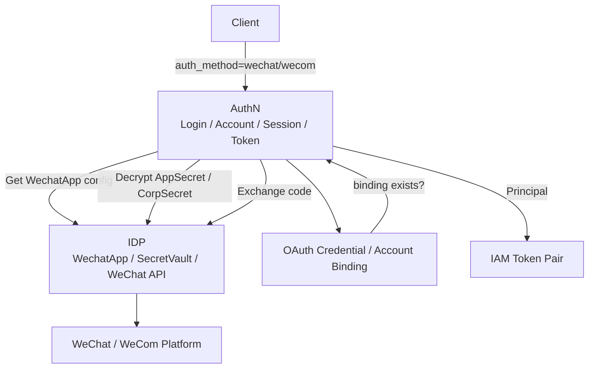
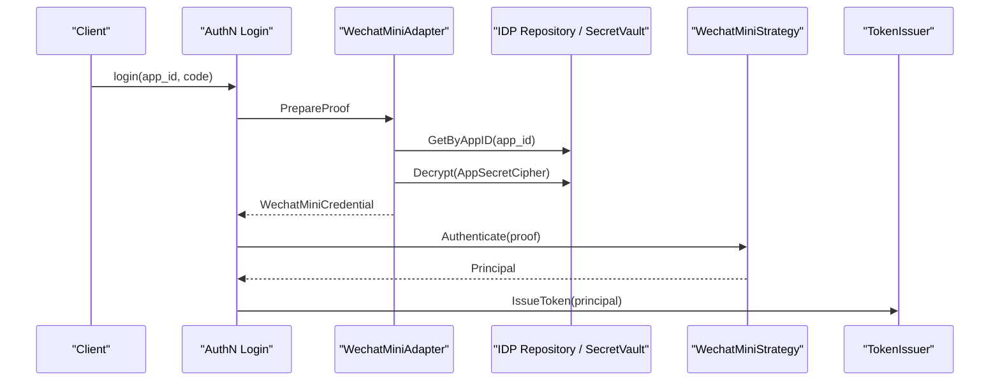

# 为什么 IDP 只做身份源基础设施

## 本文回答

本文回答：为什么 IAM 中的 IDP 模块不能直接承担登录、账号绑定、Session 创建和 IAM Token 签发；为什么 IDP 应该只负责第三方身份源基础设施，包括微信/企微应用配置、SecretVault、微信 access_token、微信 API 适配和供 AuthN 使用的能力暴露；AuthN 与 IDP 的正确协作边界是什么；如果把 IDP 做成登录模块，会带来哪些耦合与安全问题。

读完本文，你应该能回答：

- IDP 在 IAM 中到底是什么；
- IDP 为什么不是 AuthN；
- IDP 为什么不直接签发 IAM access token；
- IDP 为什么不直接创建 Session；
- 微信小程序登录为什么由 AuthN 统一编排；
- 企业微信登录为什么也由 AuthN 统一编排；
- IDP 管理的微信 access_token 与 IAM access token 有什么区别；
- SecretVault 为什么属于 IDP 基础设施能力；
- 为什么 IDP REST 管理路由需要 admin middleware；
- 为什么 AuthN 只借用 IDP 的 Repository / SecretVault / AuthProvider；
- 这套边界的收益、代价和必须守住的不变量是什么。

---

## 30 秒结论

IDP 是 Identity Provider 的基础设施模块，但在当前 IAM 中，它不是登录模块。

IDP 回答的是：

```text
外部身份源如何被配置、加密、缓存和调用？
```

AuthN 回答的是：

```text
这个外部身份是否能成为 IAM Principal，并获得 IAM Session 和 Token？
```

所以 IDP 负责：

```text
WechatApp 配置
AppSecret / CorpSecret 加密存储
SecretVault
微信 access_token 缓存
微信 code2Session / 企微 API 适配
向 AuthN 暴露 Repository / SecretVault / WechatAuthProvider
```

AuthN 负责：

```text
登录方式选择
proof 构造
第三方身份交换
OAuth credential 绑定检查
Account / User / Principal
Session
Access Token
Refresh Token
```

一句话：

> **IDP 证明“外部身份源如何接入”，AuthN 决定“外部身份能否登录 IAM”。**

如果 IDP 直接签发 IAM token，会导致：

```text
微信登录一套 token
密码登录一套 token
企微登录一套 token
Session/Refresh/Revoke/JWKS 语义分裂
账号绑定和 onboarding 分散
AppSecret 生命周期和登录态生命周期混杂
```

---

## 主图：IDP 与 AuthN 的边界



---

## 重点速查

| 问题 | 当前答案 | 源码入口 |
| --- | --- | --- |
| IDP module 职责是什么 | 微信应用管理、向 AuthN 提供基础设施服务，认证由 AuthN 统一提供。 | `container/assembler/idp.go` |
| IDP 对外应用服务有哪些 | WechatApp 管理、凭据轮换、微信 access_token 获取/刷新。 | `application/idp/wechatapp/services.go` |
| IDP 暴露给 AuthN 什么 | Repository、SecretVault、WechatAuthProvider。 | `container/assembler/idp.go` |
| 微信小程序登录如何使用 IDP | AuthN adapter 查询 WechatApp，检查启用状态，解密 AppSecret，构造 WechatMiniCredential。 | `application/authn/login/adapter_wechat_mini.go` |
| 企业微信登录如何使用 IDP | AuthN adapter 查询 WechatApp，检查启用状态，解密 CorpSecret，并使用 server-side AgentID。 | `application/authn/login/adapter_wecom.go` |
| SecretVault 是什么 | IDP 领域依赖的外部服务接口，支持 Encrypt/Decrypt/Sign。 | `domain/idp/wechatapp/external.go` |
| WechatApp 是什么 | IDP 的微信应用领域对象，包含 AppID、Name、Type、Status、Credentials。 | `domain/idp/wechatapp/wechatapp.go` |
| IDP REST 路由是否做登录 | 不做；源码注释明确认证功能由 AuthN 模块统一提供。 | `transport/rest/idp/router.go` |
| IDP 管理路由是否开放 | 需要 admin middlewares；否则不注册管理路由。 | `transport/rest/idp/router.go` |
| 微信 access_token 是 IAM token 吗 | 不是，它是微信平台访问令牌，由 IDP token service 管理。 | `application/idp/wechatapp/services.go` |

---

## 1. IDP 到底是什么

IDP 是外部身份源基础设施模块。

在当前 IAM 中，它主要围绕微信生态提供：

```text
微信小程序应用配置
企业微信应用配置
AppSecret / CorpSecret 加密存储
微信 access_token 缓存
微信 API 适配
微信 SDK cache
IDP cache family inspector
```

它不是：

```text
登录服务
账号服务
Session 服务
TokenIssuer
RefreshToken 服务
OAuth account binding 服务
```

源码中 IDP module 的注释已经把职责写得很明确：

```text
- 微信应用管理（HTTP 接口）
- 提供基础设施服务（供 authn 模块使用）
- 认证功能由 authn 模块统一提供
```

这就是本文的核心事实源。

---

## 2. 为什么 IDP 不是 AuthN

AuthN 解决的是认证问题：

```text
调用方提交某种凭据
系统判断凭据是否能对应 IAM Principal
然后创建 Session 并签发 IAM Token
```

IDP 解决的是外部身份源基础设施问题：

```text
微信应用配置在哪里？
AppSecret 如何加密？
微信 access_token 如何缓存？
如何调用微信 code2Session？
如何读取企业微信配置？
```

它们的变化原因完全不同。

| 变化 | 应该影响 |
| --- | --- |
| 新增登录方式 password/phone_otp/wechat/wecom | AuthN |
| access token TTL / refresh TTL | AuthN |
| Session revoke 语义 | AuthN |
| 微信 AppSecret 轮换 | IDP |
| 微信 access_token 缓存策略 | IDP |
| 微信 SDK 替换 | IDP |
| OAuth credential 绑定规则 | AuthN |
| User onboarding 规则 | AuthN / Identity |

如果混在一起，LoginService 会同时管理：

```text
密码认证
Session
JWT
Refresh Token
微信 AppSecret
微信 access_token
企业微信 AgentID
微信 SDK cache
```

这是明显的职责爆炸。

---

## 3. IDP 应该提供什么能力

IDP 应该提供三类能力。

### 3.1 配置能力

```text
CreateWechatApp
GetWechatApp
ListWechatApps
UpdateWechatApp
EnableWechatApp
DisableWechatApp
```

这些能力管理：

```text
AppID
Name
Type
Status
Credentials
```

WechatApp 领域对象包含：

```text
ID
AppID
Name
Type
Status
Cred
```

并提供：

```text
IsEnabled
IsDisabled
IsArchived
Enable
Disable
Archive
```

### 3.2 密钥能力

```text
RotateAuthSecret
RotateMsgSecret
SecretVault.Encrypt
SecretVault.Decrypt
SecretVault.Sign
```

AppSecret、CorpSecret、消息密钥不应该明文散落在 AuthN 策略里。  
IDP 用 SecretVault 管理这些外部应用密钥。

### 3.3 外部平台访问能力

```text
GetAccessToken
RefreshAccessToken
WechatAuthProvider
WechatTokenProvider
AccessTokenCache
WechatSDKCache
```

这里的 access_token 是：

```text
微信平台 access_token
```

不是：

```text
IAM access token
```

这是最容易混淆的点之一。

---

## 4. IDP 不应该提供什么能力

IDP 不应该提供：

```text
Login
CreateSession
IssueAccessToken
IssueRefreshToken
VerifyAccessToken
RevokeToken
Account binding
User onboarding
AuthZ Check
```

尤其不应该直接实现：

```text
POST /idp/wechat/login
  -> issue IAM token
```

原因是 IAM Token 必须由 AuthN 统一管理，否则这些语义会分裂：

```text
Session
RefreshToken
AccessToken
JWKS
KeyRotation
Revoke
Verify
SubjectAccess
Account/User 状态
```

如果 IDP 自己签发 token，就会出现两套登录态：

```text
AuthN token
IDP token
```

这会让后续 revoke、refresh、verify、session list、user block 全部变复杂。

---

## 5. 微信小程序登录中的正确协作

微信小程序登录入口在 AuthN。

链路是：

```text
Client 提交 app_id + code
  -> AuthN login method selector
  -> wechatMiniAdapter
  -> IDP Repository.GetByAppID
  -> 检查 WechatApp 存在且 enabled
  -> IDP SecretVault.Decrypt(AppSecretCipher)
  -> 构造 WechatMiniCredential
  -> Authenticator / WechatMiniStrategy
  -> 微信 code exchange
  -> OAuth credential binding
  -> Principal
  -> Session + IAM Token Pair
```



IDP 在这个链路中只提供：

```text
应用配置
密钥解密
微信 API 基础能力
```

它不做：

```text
账号绑定判定
Principal 创建
Session 创建
Token 签发
```

这些是 AuthN 的职责。

---

## 6. 企业微信登录中的正确协作

企业微信登录也是 AuthN 统一入口。

链路是：

```text
Client 提交 corp_id + auth_code
  -> AuthN wecomAdapter
  -> 检查 server-side AgentID
  -> IDP Repository.GetByAppID(corp_id)
  -> 检查 WechatApp enabled
  -> SecretVault.Decrypt(CorpSecret)
  -> 构造 WecomCredential
  -> Authenticator / WecomStrategy
  -> 企业微信 code exchange
  -> OAuth credential binding
  -> Principal
  -> Session + IAM Token Pair
```

这里有一个关键点：

```text
agent_id 来自服务端配置，不来自客户端请求
```

这也是安全边界的一部分。

IDP 仍然只是：

```text
企业微信应用配置和密钥基础设施
```

不是登录态所有者。

---

## 7. 微信 access_token 与 IAM access token 的区别

这两个名字很像，但完全不是一回事。

| 名称 | 所属系统 | 用途 | 管理模块 |
| --- | --- | --- | --- |
| 微信 access_token | 微信平台 | 调用微信平台 API | IDP |
| IAM access token | IAM | 访问业务系统 / IAM protected API | AuthN |

### 7.1 微信 access_token

由 IDP 的：

```text
WechatAppTokenApplicationService
```

管理：

```text
GetAccessToken
RefreshAccessToken
AccessTokenCache
```

它用于：

```text
调用微信开放平台 API
```

### 7.2 IAM access token

由 AuthN 的：

```text
TokenIssuer
```

签发，用于：

```text
Authorization: Bearer <IAM access token>
```

它需要：

```text
Session
JWT/JWKS
Verify
Revoke
Refresh
SubjectAccess
```

### 7.3 为什么必须区分

如果把这两个 token 混在一起，会出现灾难性语义错误：

```text
拿微信 access_token 当 IAM Bearer
拿 IAM access_token 调微信 API
把微信 token 过期当 IAM session 过期
把 IAM token revoke 当微信 token refresh
```

所以 IDP 只管理微信 access_token。  
IAM access token 只能由 AuthN 管。

---

## 8. SecretVault 为什么属于 IDP 基础设施

外部身份源通常带有 secret：

```text
AppSecret
CorpSecret
CallbackToken
EncodingAESKey
```

这些 secret 的生命周期包括：

```text
写入
加密
解密
轮换
签名
审计
```

IDP 的 `SecretVault` 接口定义了：

```text
Encrypt
Decrypt
Sign
```

它是外部身份源基础设施的一部分。

### 8.1 AuthN 为什么不能持有密钥生命周期

AuthN 登录 adapter 只在 `PrepareProof` 阶段需要：

```text
解密后的 AppSecret / CorpSecret
```

但 AuthN 不应该负责：

```text
如何存储 AppSecret
如何轮换 AppSecret
如何缓存微信 token
如何管理微信应用启用/禁用
```

这些都属于 IDP。

### 8.2 安全收益

这样能做到：

```text
secret 存储集中
secret 轮换集中
登录策略不散落密钥管理代码
后续可以替换本地 AES-GCM 为 KMS/HSM
```

---

## 9. IDP REST 为什么是管理面，不是登录面

IDP REST 路由包括：

```text
GET /api/v2/idp/health
GET /api/v2/idp/wechat-apps
POST /api/v2/idp/wechat-apps
GET /api/v2/idp/wechat-apps/:app_id
PATCH /api/v2/idp/wechat-apps/:app_id
POST /api/v2/idp/wechat-apps/:app_id/enable
POST /api/v2/idp/wechat-apps/:app_id/disable
GET /api/v2/idp/wechat-apps/:app_id/access-token
POST /api/v2/idp/wechat-apps/rotate-auth-secret
POST /api/v2/idp/wechat-apps/rotate-msg-secret
POST /api/v2/idp/wechat-apps/refresh-access-token
```

这些都是：

```text
微信应用管理
凭据轮换
微信平台 token 管理
```

不是：

```text
IAM 登录
```

源码里也明确写着：

```text
WechatAuthHandler 已移除
认证功能由 authn 模块统一提供
```

### 9.1 为什么需要 admin middleware

IDP 管理的是敏感资源：

```text
AppSecret
微信应用启用/禁用
微信 access_token
凭据轮换
```

所以管理路由必须有 admin middlewares。  
如果没有 admin middlewares，管理路由不会注册。

这比“开放一个 IDP 登录接口”安全得多。

---

## 10. IDP 与 AuthN 的依赖方向

正确方向是：

```text
AuthN 依赖 IDP 提供的端口能力
```

而不是：

```text
IDP 调 AuthN 签 token
```

IDPModule 暴露给其他模块的能力是：

```text
Repository()
SecretVault()
WechatAuthProvider()
```

AuthN wechat/wecom adapter 使用这些能力构造 proof。

### 10.1 为什么方向不能反

如果 IDP 调 AuthN 签 token：

- IDP 需要知道 Principal；
- IDP 需要知道 Session；
- IDP 需要知道 TokenIssuer；
- IDP 需要知道 RefreshToken；
- IDP 需要知道 Account binding；
- IDP 变成登录 orchestrator。

这会导致 IDP 边界失效。

正确模型是：

```text
AuthN orchestrates login
IDP supplies external identity infrastructure
```

---

## 11. IDP 与 Account Binding 的边界

微信 code exchange 只能证明：

```text
这个 code 在微信平台上对应某个 openid/unionid/userid
```

它不能证明：

```text
这个外部身份已经绑定 IAM Account
这个用户应该登录哪个 User
这个 User 是否 active
是否应该创建 Session
是否应该签发 Token
```

这些都属于 AuthN。

所以微信登录后，还要检查：

```text
OAuth credential binding
Account status
User status
```

如果没有绑定，应返回未绑定/需要 onboarding 的业务结果，而不是 IDP 直接登录成功。

---

## 12. 如果 IDP 做登录会怎样

### 12.1 token 语义分裂

会出现：

```text
AuthN password token
IDP wechat token
IDP wecom token
```

每套 token 都要处理：

```text
verify
refresh
revoke
session
JWKS
claims
```

很快不可维护。

### 12.2 account binding 分散

微信绑定逻辑可能写在 IDP，密码账号逻辑写在 AuthN，企微逻辑又写在另一个地方。

最终系统无法统一回答：

```text
一个 User 到底有哪些 Account？
一个 Account 是否 disabled？
这个 Principal 从哪里来？
```

### 12.3 secret 管理污染登录链路

登录策略里会充满：

```text
AppSecret 加密/解密
access_token 缓存
微信 SDK cache
密钥轮换
```

认证策略会变成微信 SDK 适配器，而不是 AuthN 领域逻辑。

### 12.4 IDP 管理面与登录面混杂

管理微信应用和用户登录是两类完全不同安全等级的操作。  
混在一个模块里会让权限保护和审计边界模糊。

---

## 13. 替代方案分析

### 方案一：IDP 直接登录并签发 IAM token

优点：

- 微信登录链路短；
- 初期代码少；
- IDP 内部能一次完成 code2Session + token。

问题：

- TokenIssuer 分散；
- Session 语义分裂；
- Refresh/Revoke/JWKS 分裂；
- Account/User binding 分散；
- secret 管理和登录态管理耦合。

结论：

```text
不适合 IAM。
```

### 方案二：AuthN 直接内嵌微信配置和 SDK

优点：

- 没有 IDP 模块；
- AuthN 直接完成所有第三方登录。

问题：

- AuthN 被微信配置污染；
- 微信 AppSecret 生命周期没有独立管理面；
- 微信 access_token cache 和登录策略混杂；
- 未来增加企微/公众号/其他 IDP 会让 AuthN 膨胀。

结论：

```text
短期可用，长期不可维护。
```

### 方案三：IDP 只做身份源基础设施，AuthN 统一登录

优点：

- 登录态统一；
- Token/Session/Refresh/Revoke/JWKS 统一；
- 外部身份源配置独立治理；
- SecretVault 可替换为 KMS/HSM；
- IDP 管理面可独立授权；
- AuthN adapter 只借用 IDP 端口能力。

代价：

- 模块协作链路更长；
- 文档必须解释清楚；
- container 装配需要把 IDP capability 注入 AuthN；
- 测试需要覆盖 AuthN/IDP 协作。

结论：

```text
这是当前 IAM 最合理的设计。
```

---

## 14. 当前设计收益

### 14.1 登录态统一

无论是：

```text
password
phone_otp
wechat
wecom
service_token
```

最终 IAM token 和 session 都由 AuthN 管理。

### 14.2 外部身份源治理独立

微信应用配置、启用禁用、secret 轮换、微信 access_token 缓存，都在 IDP 里。

### 14.3 安全边界清楚

IDP 管理路由需要 admin middlewares。  
AuthN 登录入口只拿到必要的 proof。

### 14.4 可扩展其他身份源

未来如果接入：

```text
飞书
钉钉
Apple
Google
OIDC Provider
```

也可以按：

```text
IDP 管配置和外部 API
AuthN 管登录态和 token
```

扩展。

### 14.5 可替换 SecretVault

当前 SecretVault 可以是本地 AES-GCM，也可以演进到：

```text
云 KMS
HSM
密钥托管服务
```

AuthN 不需要关心底层实现。

---

## 15. 当前设计代价

### 15.1 登录链路更长

微信登录要跨：

```text
AuthN adapter
IDP repo
SecretVault
WechatAuthProvider
AuthN strategy
Credential binding
TokenIssuer
```

不是一个函数完成。

### 15.2 装配依赖更多

AuthN 初始化需要拿到 IDP 的：

```text
Repository
SecretVault
WechatAuthProvider
```

如果 IDP 没初始化，微信/企微登录不可用。

### 15.3 文档成本更高

必须持续解释：

```text
微信 access_token != IAM access token
IDP != AuthN
WechatApp != Account
code2Session != login success
```

### 15.4 测试要覆盖跨模块协作

需要测试：

- WechatApp 不存在；
- WechatApp disabled；
- SecretVault 解密失败；
- AgentID 缺失；
- no binding；
- binding success；
- token issue success。

---

## 16. 必须守住的不变量

### 16.1 IDP 不签发 IAM token

IAM access token 只能由 AuthN TokenIssuer 统一签发。

### 16.2 IDP 不创建 Session

Session 是 AuthN 登录态，不属于 IDP。

### 16.3 IDP 不判断 OAuth credential 是否绑定

绑定判定属于 AuthN 认证策略或 onboarding。

### 16.4 IDP 只管理外部平台 token

微信 access_token 属于微信平台，不是 IAM access token。

### 16.5 AuthN 只借用 IDP 基础设施能力

AuthN 通过 Repository、SecretVault、WechatAuthProvider 获取外部身份源能力，不接管 IDP 管理面。

### 16.6 IDP 管理路由必须受 admin middleware 保护

没有 admin middleware 时，不应注册微信应用管理路由。

### 16.7 Secret 不进入日志和普通业务响应

AppSecret/CorpSecret 等敏感信息必须通过 SecretVault 保护，不能在普通路径泄露。

---

## 17. 面试/宣讲讲法

### 10 秒版

```text
IDP 只负责第三方身份源配置、密钥和外部 API；真正的登录判定、账号绑定、Session 和 IAM Token 都由 AuthN 统一处理。
```

### 30 秒版

```text
我没有让 IDP 直接做微信登录并签发 token。IDP 只管理微信/企微应用配置、AppSecret 加密、微信 access_token 缓存和 code exchange 等基础设施能力。AuthN 在登录链路中通过 IDP 查询应用配置、解密 secret、调用微信接口，然后再做账号绑定、Principal、Session 和 IAM Token 签发。这样可以保证所有登录方式共用同一套 Session、Refresh、Verify、Revoke 和 JWKS 语义。
```

### 3 分钟版结构

```text
1. 先说明 IDP 和 AuthN 回答的问题不同
2. 讲 IDP 管 WechatApp / SecretVault / 微信 access_token
3. 讲 AuthN 管 Login / Account / Session / Token
4. 讲微信小程序登录协作链路
5. 讲企业微信登录协作链路
6. 讲微信 access_token 与 IAM access token 的区别
7. 讲如果 IDP 直接登录会导致什么问题
8. 讲收益、代价和不变量
```

---

## 18. 常见追问

### Q1：为什么不让 IDP 直接签发 token？

因为 token、session、refresh、verify、revoke、JWKS 都是 AuthN 的统一语义。  
如果 IDP 自己签 token，不同登录方式会出现多套登录态。

### Q2：微信 code2Session 成功不就代表登录成功吗？

不代表。  
它只证明 code 对应某个微信身份。还要检查这个微信身份是否绑定 IAM Account/User，Account/User 状态是否可用，然后才能创建 Session 和 IAM Token。

### Q3：为什么 IDP 管微信 access_token？

微信 access_token 是调用微信平台 API 的凭证，和 IAM access token 不是一回事。它属于外部平台基础设施，因此放在 IDP。

### Q4：AuthN 为什么要解密 AppSecret？

AuthN adapter 需要构造微信登录 proof。但它不拥有 AppSecret 生命周期，只是通过 IDP SecretVault 获取必要的解密结果。

### Q5：IDP REST 为什么要 admin middleware？

因为它管理的是微信应用配置、secret 轮换和微信 access_token，属于敏感管理面。普通登录请求不应访问这些能力。

### Q6：以后接入其他第三方身份源怎么办？

沿用同样边界：IDP 管外部身份源配置和 API，AuthN 管统一登录态和 IAM token。必要时按 provider 增加 IDP adapter 和 AuthN strategy。

---

## 19. 代码证据地图

| 结论 | 代码入口 |
| --- | --- |
| IDP module 明确认证由 AuthN 统一提供 | `container/assembler/idp.go` |
| IDP 暴露 Repository/SecretVault/WechatAuthProvider 给 AuthN | `container/assembler/idp.go` |
| 微信小程序 AuthN adapter 使用 IDP repo/vault | `application/authn/login/adapter_wechat_mini.go` |
| 企业微信 AuthN adapter 使用 IDP repo/vault 和 server-side AgentID | `application/authn/login/adapter_wecom.go` |
| WechatApp 是 IDP 领域对象 | `domain/idp/wechatapp/wechatapp.go` |
| SecretVault 是 IDP 外部服务端口 | `domain/idp/wechatapp/external.go` |
| IDP 应用服务是 WechatApp 管理、凭据轮换、微信 access_token | `application/idp/wechatapp/services.go` |
| IDP REST 管理路由需要 admin middlewares | `transport/rest/idp/router.go` |

---

## 20. 推荐源码阅读路线

### 第一轮：IDP module 边界

```text
internal/apiserver/container/assembler/idp.go
```

目标：先看模块注释、暴露能力和 ApplicationCapabilities。

### 第二轮：IDP 领域与应用服务

```text
internal/apiserver/domain/idp/wechatapp/wechatapp.go
internal/apiserver/domain/idp/wechatapp/external.go
internal/apiserver/application/idp/wechatapp/services.go
```

目标：理解 WechatApp、SecretVault、AccessTokenCache、AppTokenProvider。

### 第三轮：AuthN 如何使用 IDP

```text
internal/apiserver/application/authn/login/adapter_wechat_mini.go
internal/apiserver/application/authn/login/adapter_wecom.go
internal/apiserver/domain/authn/authentication/auth-wechat-mini.go
internal/apiserver/domain/authn/authentication/auth-wechat-com.go
```

目标：理解 IDP 能力如何变成 AuthN proof。

### 第四轮：IDP REST 管理面

```text
internal/apiserver/transport/rest/idp/router.go
internal/apiserver/transport/rest/idp/handler/wechatapp.go
api/rest/idp.v2.yaml
```

目标：理解 IDP 对外只暴露管理面，不暴露登录面。

### 第五轮：接入契约和安全

```text
docs/02-认证AuthN/04-第三方登录与IDP协作.md
docs/05-接入与契约/01-REST API契约.md
docs/05-接入与契约/02-gRPC API契约.md
```

目标：理解 IDP 与 AuthN/REST/gRPC 的边界。

---

## 21. 验证建议

```bash
go test ./internal/apiserver/application/idp/... \
  ./internal/apiserver/domain/idp/... \
  ./internal/apiserver/application/authn/login \
  ./internal/apiserver/domain/authn/authentication \
  ./internal/apiserver/transport/rest/idp \
  ./internal/apiserver/container/assembler

make docs-hygiene
```

建议重点测试方向：

| 测试方向 | 目的 |
| --- | --- |
| IDP init without DB/Redis/key | 初始化失败，边界明确 |
| WechatApp disabled | AuthN adapter 拒绝登录 proof |
| WechatApp missing | AuthN adapter 返回错误 |
| SecretVault decrypt failed | AuthN adapter 返回错误 |
| Wecom AgentID missing | 企业微信 proof 准备失败 |
| IDP management route without admin middleware | 不注册管理路由 |
| GetAccessToken cache | 微信 access_token 缓存与刷新 |
| RotateAuthSecret | AppSecret 轮换进入 SecretVault |
| AuthN login no binding | 微信 code exchange 成功但无 IAM binding 时不登录成功 |
| Token issuance location | IAM token 只能由 AuthN 签发 |

---

## 本文总结

IDP 只做身份源基础设施，是为了让外部身份源接入和 IAM 登录态管理保持边界清楚。

IDP 负责：

```text
WechatApp
SecretVault
微信 access_token
微信/企微 API
应用启用/禁用
凭据轮换
```

AuthN 负责：

```text
Login
Account binding
Principal
Session
Access Token
Refresh Token
Verify
Revoke
JWKS
```

两者协作，但不能合并：

```text
IDP 提供外部身份源能力
AuthN 统一认证判定和 IAM token 签发
```

这套设计的核心价值是：

```text
第三方身份源可治理
登录态语义统一
secret 生命周期集中
微信/企微接入可扩展
REST 管理面与 AuthN 登录面分离
```

必须守住的边界是：

```text
IDP 不签 IAM token
IDP 不创建 Session
IDP 不决定 Account/User 绑定是否可登录
IDP 管微信 access_token，不管 IAM access token
```

如果未来接入更多第三方身份源，也应继续遵循这个边界。
