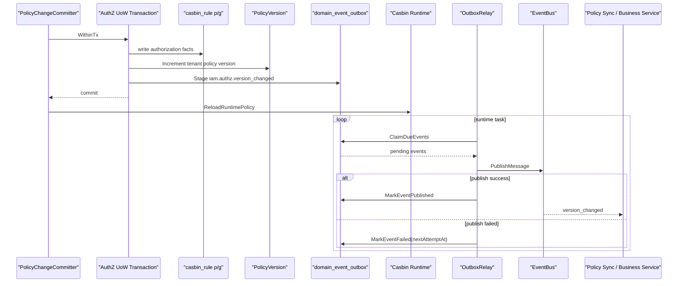
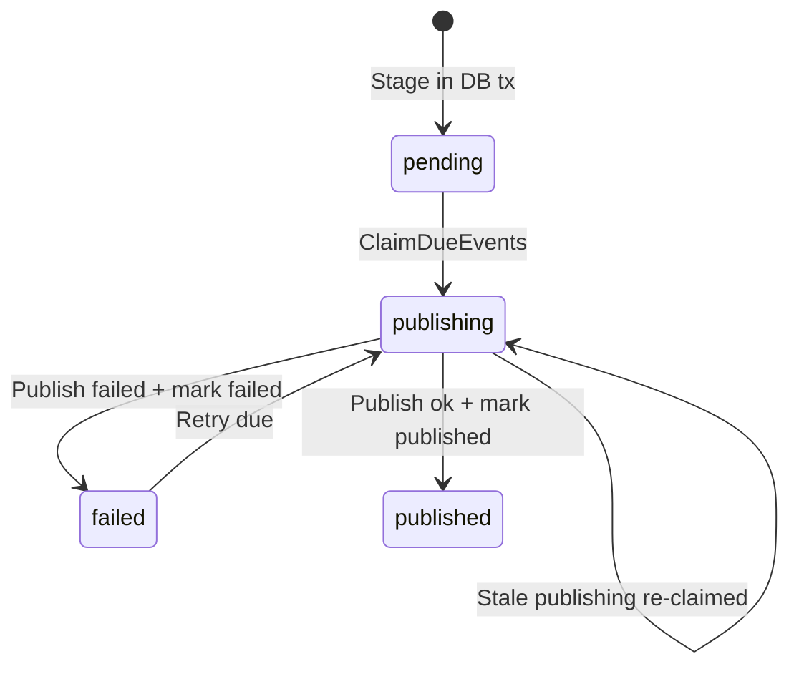

# 为什么需要 Transactional Outbox 传播授权版本

## 本文回答

本文回答：为什么 IAM AuthZ 的授权版本变化不能直接同步 publish 到 MQ；为什么必须用 Transactional Outbox 让授权 facts、PolicyVersion 和 `iam.authz.version_changed` 事件同事务提交；Outbox 如何保证 EventBus 不可用时事件不丢；为什么它提供的是 at-least-once 而不是 exactly-once；业务服务收到授权版本事件后应该如何处理。

读完本文，你应该能回答：

- 授权版本事件解决什么问题；
- 为什么只 reload 本进程 Casbin runtime 不够；
- 为什么不能在授权写入时直接 publish MQ；
- `PolicyVersion` 和 `iam.authz.version_changed` 的关系是什么；
- 为什么 outbox row 必须和授权 facts 同事务 stage；
- `domain_event_outbox` 记录了哪些信息；
- outbox 状态机 pending / publishing / published / failed 是什么；
- EventBus 不可用时为什么不会丢事件；
- publish 失败后如何重试；
- relay 崩溃或 mark published 失败时会发生什么；
- 为什么下游消费者必须幂等；
- 当前设计的收益、代价和必须守住的不变量是什么。

---

## 30 秒结论

授权变更不是只影响 IAM 当前进程。  
一次授权写入会导致：

```text
DB 授权事实变化
当前进程 runtime policy 需要 reload
其他服务/实例/SDK cache/PolicySync worker 需要知道授权版本变化
```

`ReloadRuntimePolicy` 只解决当前 IAM 进程：

```text
当前进程的 Casbin Enforcer 重新加载 DB facts
```

它不能通知：

```text
其他 IAM 实例
业务服务本地授权缓存
SDK AuthorizationSnapshot cache
policy sync worker
外部订阅者
```

所以需要事件：

```text
iam.authz.version_changed
```

但不能直接：

```text
DB commit 后 publish MQ
```

因为会出现：

```text
DB 成功，MQ 发布失败 -> 下游永远不知道版本变了
MQ 发布成功，DB 回滚 -> 下游看到不存在的版本
```

Transactional Outbox 的核心做法是：

```text
在同一个数据库事务里：
  写授权 facts
  递增 PolicyVersion
  写 outbox row

事务提交后：
  后台 relay 异步 claim outbox row
  publish 到 EventBus
  mark published / failed
```

一句话：

> **PolicyVersion 记录“授权事实已经变化”，Outbox 保证“这个变化最终会被可靠传播”。**

---

## 主图：授权版本通过 Outbox 可靠传播



---

## 重点速查

| 问题 | 当前答案 | 源码入口 |
|---|---|---|
| AuthZ 何时 stage 版本事件 | `PolicyChangeCommitter.Commit` 在写 facts、递增 version 后调用 `StagePolicyVersionChanged`。 | `application/authz/policy/committer.go` |
| 版本事件内容是什么 | `tenant_id + version`。 | `domain/authz/policy/events.go` |
| stager 缺失会怎样 | `StagePolicyVersionChanged` 返回错误，UoW 回滚。 | `application/authz/shared/version_event.go` |
| outbox stage 是否要求事务 | `Store.Stage` 调用 `RequireTx(ctx)`，没有 active tx 会失败。 | `infra/mysql/eventoutbox/store.go` |
| outbox row 初始状态 | `pending`，`attempt_count=0`，`next_attempt_at=now`。 | `pkg/outboxcore/core.go` |
| 事件目录如何配置 | `iam.authz.version_changed` -> topic `iam.authz.version`，delivery `durable_outbox`。 | `configs/events.yaml` |
| relay EventBus 不可用怎么办 | 不 claim，记录 degraded，直接返回 nil。 | `infra/messaging/outbox_relay.go` |
| relay 如何投递 | ClaimDueEvents -> PublishMessage -> MarkEventPublished/Failed。 | `infra/messaging/outbox_relay.go` |
| publish 失败如何重试 | MarkEventFailed 设置 failed、last_error、next_attempt_at、attempt_count+1。 | `infra/mysql/eventoutbox/store.go` |
| relay 崩溃如何恢复 | ClaimDueEvents 可重新 claim stale publishing。 | `infra/mysql/eventoutbox/store.go` |
| relay 如何启动 | `startRuntimeTasks` 启动 `runOutboxRelay`，并注册 shutdown cancel hook。 | `process/shutdown_lifecycle.go` |
| container 如何创建 outbox | MySQL 存在则创建 outboxStore，EventBus 存在则创建 outboxRelay。 | `container/container.go` |

---

## 1. 授权版本事件解决什么问题

AuthZ 写入会改变授权事实：

```text
grant_permission
revoke_permission
bind_role
unbind_role
```

这些事实变化会影响：

```text
当前 IAM 进程的 Check 结果
其他 IAM 实例的 Check 结果
业务服务本地授权缓存
SDK 的 AuthorizationSnapshot 缓存
策略同步 worker
监控和审计系统
```

如果只改 DB，不发事件，下游不会知道：

```text
某个 tenant 的授权版本已经变化
```

所以每次授权变更都会递增：

```text
PolicyVersion
```

并生成事件：

```text
iam.authz.version_changed
```

事件 payload 非常轻：

```json
{
  "tenant_id": "tenant-a",
  "version": 12
}
```

它不是全量权限快照，而是：

```text
授权缓存失效 / 策略同步信号
```

下游收到事件后，应该按 tenant/version 决定是否刷新本地缓存或重新拉取 snapshot。

---

## 2. 为什么 runtime reload 不够

授权写入提交后，IAM 当前进程会调用：

```text
ReloadRuntimePolicy
```

这个动作负责：

```text
让当前进程 Casbin Enforcer 重新 LoadPolicy
```

但它只影响当前进程。

如果系统中有：

```text
多个 iam-apiserver 实例
业务服务缓存 AuthorizationSnapshot
SDK 本地缓存角色/权限
外部 policy sync worker
```

它们不会因为当前进程 reload 自动刷新。

因此需要：

```text
跨系统事件传播
```

也就是：

```text
iam.authz.version_changed
```

### runtime reload 与 outbox 的区别

| 机制 | 解决什么 |
|---|---|
| `ReloadRuntimePolicy` | 当前 IAM 进程的内存判定器刷新 |
| `PolicyVersion` | tenant 授权事实版本递增 |
| `Outbox event` | 跨系统通知版本变化 |
| `OutboxRelay` | 把 durable event 投递到 EventBus |

它们是互补关系，不是替代关系。

---

## 3. 为什么不能直接 publish MQ

最直观的写法是：

```text
write facts
increment version
commit DB
publish MQ
```

但这有不可修复的窗口。

### 3.1 DB 成功，MQ 失败

```text
DB commit success
MQ publish failed
```

后果：

```text
授权事实已经变了
PolicyVersion 已经变了
下游永远不知道
业务服务缓存一直旧
```

如果没有 outbox row，系统无法可靠重试。

### 3.2 MQ 成功，DB 回滚

```text
publish MQ success
DB rollback
```

后果：

```text
下游收到 version changed
但 DB 里没有这个版本
下游刷新到不存在或旧的事实
```

### 3.3 进程在两步之间崩溃

```text
DB commit success
process crash before publish
```

后果和 MQ 失败一样：

```text
授权事实变化丢失通知
```

### 3.4 解决方案

必须把事件“先写入数据库”：

```text
write facts
increment version
insert outbox row
commit DB
```

然后异步发布：

```text
relay claim outbox row
publish MQ
mark published
```

这就是 Transactional Outbox。

---

## 4. 为什么 outbox row 必须与 facts 同事务

`PolicyChangeCommitter` 的事务顺序是：

```text
writeAuthorizationFact
PolicyVersions.Increment
StagePolicyVersionChanged
```

其中 `StagePolicyVersionChanged` 会调用：

```text
stager.Stage(ctx, VersionChangedEvent)
```

而 MySQL outbox store 的 `Stage` 会调用：

```text
dbmysql.RequireTx(ctx)
```

这意味着：

```text
没有 active transaction，就不能 stage outbox event。
```

这条规则非常关键。

### 4.1 同事务带来的保证

同一个事务中：

```text
casbin_rule facts
policy_versions
domain_event_outbox
```

要么都提交，要么都回滚。

因此不会出现：

```text
facts 已提交但事件没记录
事件已记录但 facts 没提交
version 变了但事件没记录
```

### 4.2 stager nil 为什么要失败

如果 stager 缺失，`StagePolicyVersionChanged` 返回：

```text
authz policy version event stager is required
```

这样整个 UoW 会回滚。

这是一个偏安全设计：

```text
如果无法持久化授权变化通知，就不要提交授权变化。
```

---

## 5. 事件目录为什么标记 durable_outbox

事件目录中：

```yaml
iam.authz.version_changed:
  topic: authz_version
  delivery: durable_outbox
  aggregate: PolicyVersion
  domain: authz
```

这说明：

```text
授权版本事件是 durable outbox 事件
```

不是 best-effort 事件。

### 5.1 durable_outbox 的含义

`durable_outbox` 表示：

```text
事件必须进入事务性 outbox
后续由 relay 投递
不能绕过 outbox 直接 publish
```

`outboxcore.BuildRecords` 会检查事件 delivery class。  
如果不是 `durable_outbox`，就不能 stage 到 outbox。

### 5.2 为什么登录 OTP 可以 best_effort，而 authz version 不能

事件目录中还有：

```text
iam.login_otp_sms
delivery: best_effort
```

OTP 短信是任务型事件，失败可以由用户重试。  
但授权版本事件表示系统事实已经变化，不能丢。

所以：

```text
AuthZ version changed 必须 durable
```

---

## 6. outbox row 记录了什么

`domain_event_outbox` 记录：

```text
event_id
event_type
aggregate_type
aggregate_id
topic_name
payload_json
status
attempt_count
next_attempt_at
last_error
created_at
updated_at
published_at
```

初始 record：

```text
status = pending
attempt_count = 0
next_attempt_at = now
created_at = now
updated_at = now
```

### 6.1 为什么需要 event_id

`event_id` 是事件唯一标识。  
用于：

- 防重复记录；
- 下游幂等；
- 日志追踪；
- mark published/failed。

### 6.2 为什么需要 aggregate_id

授权版本事件的 aggregate 是：

```text
PolicyVersion
```

aggregate_id 是：

```text
tenantID:version
```

这让下游知道：

```text
哪个 tenant 的哪个版本发生变化
```

### 6.3 为什么 payload 很轻

payload 只包含：

```text
tenant_id
version
```

因为事件不是权限数据复制，而是版本变化信号。

下游如果需要具体权限，应重新拉取：

```text
AuthorizationSnapshot
```

或查询 IAM。

---

## 7. Outbox 状态机

状态包括：

```text
pending
publishing
published
failed
```



### 7.1 pending

事件已经持久化，等待 relay claim。

### 7.2 publishing

事件已被 relay claim，正在发布中。

### 7.3 published

事件已经发布成功，并成功 mark。

### 7.4 failed

事件发布失败，等待 `next_attempt_at` 到期后重试。

### 7.5 stale publishing

如果 relay 进程在 publishing 状态崩溃，事件可能卡住。  
所以 claim 逻辑会重新捞：

```text
publishing 且 updated_at <= staleBefore
```

默认 stale 窗口：

```text
1 minute
```

---

## 8. relay 如何投递

`OutboxRelay.DispatchDue` 流程：

```text
if store nil:
  return nil

if publisher nil:
  log degraded
  return nil

pendingEvents = store.ClaimDueEvents(batchSize, now)

for each pending:
  PublishMessage(topic, payload, metadata)

  if success:
    MarkEventPublished

  if failed:
    MarkEventFailed(nextAttemptAt)
```

### 8.1 publisher nil 不 claim

这是非常重要的设计。

EventBus 不可用时：

```text
publisher == nil
```

relay 不会 claim 任何事件，只会记录 degraded 并返回。

这保证：

```text
EventBus 不可用不会导致 pending 事件错误变成 publishing/failed。
```

事件会继续留在 outbox 中，等待 EventBus 恢复后投递。

### 8.2 publish failed 后 retry

如果 `PublishMessage` 失败：

```text
MarkEventFailed(eventID, err, now + retryDelay)
```

状态变为：

```text
failed
```

下一轮到期后再次 claim。

### 8.3 metadata

relay 发布消息时加入：

```text
event_type
aggregate_type
aggregate_id
source = iam-outbox-relay
```

方便下游路由、日志和幂等处理。

---

## 9. 为什么这是 at-least-once，不是 exactly-once

Transactional Outbox 解决的是：

```text
事件不丢
```

不是：

```text
事件绝对只投递一次
```

### 9.1 publish 成功但 mark published 失败

可能发生：

```text
MQ publish success
DB MarkEventPublished failed
```

结果：

```text
消息已经发出
outbox row 仍不是 published
后续可能再次 claim 并重复发布
```

### 9.2 relay 在 publish 后崩溃

可能发生：

```text
PublishMessage success
process crash before MarkEventPublished
```

结果同样是重复投递。

### 9.3 stale publishing 重试

为了避免事件卡死，stale publishing 会被重新 claim。  
这也可能导致重复发布。

所以 outbox 的交付语义是：

```text
at-least-once
```

下游必须幂等。

### 9.4 下游幂等键

对授权版本事件，推荐幂等键：

```text
event_id
```

或业务幂等键：

```text
tenant_id + version
```

下游应该记录：

```text
某 tenant 已处理到的最大 version
```

收到旧版本或重复版本时直接忽略。

---

## 10. 为什么版本事件不携带全量权限

一种替代方案是：

```text
event payload 直接带 roles / permissions / bindings
```

当前没有这么做，而是只带：

```text
tenant_id
version
```

### 10.1 原因一：权限数据可能很大

一个 tenant 可能有很多：

```text
roles
permissions
rolebindings
resources
scopes
```

每次变更都推全量，会让事件变重。

### 10.2 原因二：消费者需求不同

有的消费者只需要清缓存。  
有的消费者需要重新拉 snapshot。  
有的消费者只关心某个 app_name。

版本事件做成信号更通用。

### 10.3 原因三：避免事件成为第二事实源

如果 event payload 放了全量权限，事件就变成另一个事实源。  
一旦 DB 和事件 payload 不一致，问题更复杂。

当前设计更清楚：

```text
DB 是事实源
event 是变化通知
snapshot/query 是读取方式
```

---

## 11. Outbox 与 AuthorizationSnapshot 的关系

`iam.authz.version_changed` 通知：

```text
tenant 的授权版本变化了
```

业务服务可以随后调用：

```text
GetAuthorizationSnapshot(subject, domain, app_name)
```

拿到：

```text
roles
permissions
authz_version
```

典型下游流程：

```text
收到 version_changed(tenant-a, version=12)
  -> 标记 tenant-a 本地授权缓存 stale
  -> 后续请求或后台任务重新拉 snapshot
  -> 如果 snapshot.authz_version >= 12，则认为刷新完成
```

这样做的好处是：

```text
事件轻量
数据按需拉取
消费者可控
避免事件 payload 膨胀
```

---

## 12. Outbox 与 runtime reload 的关系

授权变更提交后发生两件事：

```text
1. 当前进程 ReloadRuntimePolicy
2. outbox relay 后续发布 version_changed
```

它们不是同一个机制。

### 12.1 runtime reload

解决：

```text
当前 IAM 进程能否立刻用最新 Casbin facts 判定
```

### 12.2 outbox relay

解决：

```text
其他服务/实例/缓存是否最终知道版本变化
```

### 12.3 为什么都需要

如果只有 reload：

```text
本进程新了
其他系统旧了
```

如果只有 outbox：

```text
其他系统最终会知道
但当前进程可能短期仍旧策略
```

所以两者都需要。

---

## 13. EventBus 不可用时发生什么

### 13.1 授权写入阶段

只要：

```text
MySQL 可用
outboxStore 可用
```

授权写入可以完成：

```text
facts + version + outbox row
```

EventBus 不参与数据库事务。

### 13.2 relay 阶段

如果 EventBus 不存在：

```text
publisher == nil
```

relay 不 claim，记录 degraded。

结果：

```text
outbox rows 保持 pending/failed
等待 EventBus 恢复
```

### 13.3 恢复后

EventBus 恢复后：

```text
outboxRelay claim due rows
publish
mark
```

这就是“事件不丢”的核心。

---

## 14. 替代方案分析

### 方案一：同步直接 publish MQ

```text
commit DB
publish MQ
```

优点：

- 代码简单；
- 延迟低；
- 不需要 outbox 表和 relay。

问题：

- DB 和 MQ 无法原子提交；
- publish 失败会丢通知；
- 进程崩溃会丢通知；
- MQ 成功但 DB 回滚会发假事件。

结论：

```text
不适合授权版本事件。
```

### 方案二：只依赖 runtime reload

优点：

- 只管当前进程；
- 不需要 EventBus。

问题：

- 多实例无法同步；
- 业务服务缓存无法失效；
- SDK snapshot cache 不知道版本变化；
- 外部 policy sync worker 无法工作。

结论：

```text
只适合单进程、无外部缓存的简化场景。
```

### 方案三：Transactional Outbox

优点：

- DB facts、version、event row 同事务；
- EventBus 不可用时事件不丢；
- publish 失败可重试；
- relay 崩溃可恢复；
- 下游通过 version 做幂等。

代价：

- 多一张 outbox 表；
- 多一个 relay runtime task；
- 需要状态机和运维监控；
- at-least-once 要求消费者幂等。

结论：

```text
这是 IAM 授权版本传播的合理选择。
```

---

## 15. 当前设计收益

### 15.1 授权变化不丢

DB 提交时 outbox row 一起提交。  
只要 DB 提交成功，事件就有可重试记录。

### 15.2 传播与写入解耦

授权写入不需要等待 MQ 成功。  
relay 异步投递，失败可重试。

### 15.3 支持 EventBus 降级

EventBus 不可用时，授权写入仍可完成，事件保留在 DB 中。

### 15.4 支持多消费者

多个下游可以订阅 `iam.authz.version` topic，按 `tenant_id/version` 自己刷新。

### 15.5 支持运维观测

outbox store 提供 status snapshot，可观察：

```text
pending
failed
publishing
```

的堆积和 oldest age。

---

## 16. 当前设计代价

### 16.1 系统复杂度增加

增加了：

```text
domain_event_outbox 表
outbox status machine
relay runtime task
retry logic
mark published/failed
status snapshot
```

### 16.2 不是 exactly-once

消费者必须幂等。  
如果消费者不处理重复事件，可能重复刷新或重复执行副作用。

### 16.3 事件传播有延迟

relay 是周期任务，不是同步立即发布。  
默认间隔可配置，间隔越长，通知延迟越大。

### 16.4 需要运维监控

如果 pending/failed 长期堆积，需要排查：

- EventBus 不可用；
- relay 没启动；
- publish 一直失败；
- mark published 失败；
- DB 锁或性能问题。

---

## 17. 必须守住的不变量

### 17.1 授权版本事件必须和 facts 同事务 stage

不能在事务外写 outbox row。

### 17.2 AuthZ version changed 必须是 durable_outbox

不能降级成 best_effort。

### 17.3 outbox row 是传播事实，不是权限事实

权限事实仍然是 DB 中的 casbin_rule / policy version。  
outbox 只是事件投递记录。

### 17.4 relay 不可用不能影响已提交事实

DB 是事实源。relay 是异步传播器。

### 17.5 EventBus 不可用时不 claim

避免 pending 事件进入 publishing 后卡住或丢失。

### 17.6 消费者必须幂等

按：

```text
event_id
tenant_id + version
```

处理重复投递。

### 17.7 事件 payload 不携带全量权限

事件只做版本信号。具体权限通过 snapshot/query 拉取。

---

## 18. 面试/宣讲讲法

### 10 秒版

```text
授权版本事件必须用 Transactional Outbox，因为授权 facts 和事件发布不能靠 DB+MQ 两步操作保证原子性；outbox 让事实变更和事件记录同事务提交，再由 relay 异步可靠投递。
```

### 30 秒版

```text
AuthZ 每次权限变更都会写 Casbin facts、递增 PolicyVersion，并 stage 一个 iam.authz.version_changed 事件。这个事件不能直接 publish MQ，因为会有 DB 成功但 MQ 失败、MQ 成功但 DB 回滚的窗口。所以我用 Transactional Outbox，把 facts、version 和 outbox row 放在同一个 UoW 事务里提交；提交后 runtime reload 当前进程，后台 relay 再异步发布事件。这个机制保证事件不丢，但语义是 at-least-once，因此消费者必须按 event_id 或 tenant_id+version 幂等。
```

### 3 分钟版结构

```text
1. 先讲授权版本事件解决什么问题
2. 讲 runtime reload 不够
3. 讲直接 publish MQ 的一致性窗口
4. 讲 UoW 内 facts/version/outbox 同事务
5. 讲 outbox row 状态机
6. 讲 relay claim/publish/mark/retry
7. 讲 at-least-once 和消费者幂等
8. 讲收益、代价、不变量
```

---

## 19. 常见追问

### Q1：为什么不用同步 MQ 事务？

普通 DB 和 MQ 之间没有天然的跨资源原子提交。  
Outbox 用本地 DB 事务先持久化事件，再异步投递，是更简单可靠的工程方案。

### Q2：EventBus 挂了，授权写入还能成功吗？

可以，只要 MySQL 和 outboxStore 可用。  
EventBus 不参与 UoW 事务。事件会 pending 在 outbox 中，EventBus 恢复后由 relay 投递。

### Q3：outbox 会不会重复发？

会。它是 at-least-once，不是 exactly-once。  
publish 成功但 mark published 失败、relay 崩溃、stale publishing 重新 claim，都可能导致重复。消费者必须幂等。

### Q4：为什么事件不带全量权限？

因为事件是版本变化信号，不是权限事实复制。  
全量权限会让事件变重，也会制造第二事实源。下游需要时应按 tenant/version 拉 snapshot。

### Q5：为什么 reload 失败不回滚？

reload 在 DB 事务提交之后，是当前进程 runtime 同步动作。  
DB 已经是事实源，不能因为 runtime reload 失败反向否定已提交事实。失败应记录 degraded 并由后续重试/运维处理。

### Q6：为什么 stage event 缺失要回滚？

因为授权 facts 变了但没有 durable event，下游可能永远不知道。  
对 authz version 这类关键事件，stager 是必要依赖。

---

## 20. 代码证据地图

| 结论 | 代码入口 |
|---|---|
| Committer 在 UoW 内写 facts、version、event | `application/authz/policy/committer.go` |
| StagePolicyVersionChanged 要求 stager | `application/authz/shared/version_event.go` |
| VersionChangedEvent payload 是 tenant_id + version | `domain/authz/policy/events.go` |
| authz version changed 是 durable_outbox | `configs/events.yaml` |
| Outbox Stage 必须 RequireTx | `infra/mysql/eventoutbox/store.go` |
| Outbox 初始 record pending | `pkg/outboxcore/core.go` |
| ClaimDueEvents 支持 pending/failed/stale publishing | `infra/mysql/eventoutbox/store.go` |
| DispatchDue 负责 claim/publish/mark | `infra/messaging/outbox_relay.go` |
| EventBus 不可用时 relay degraded 且不 claim | `infra/messaging/outbox_relay.go` |
| Container 创建 outboxStore/outboxRelay | `container/container.go` |
| Runtime task 周期运行 relay 并注册 shutdown hook | `process/shutdown_lifecycle.go` |

---

## 21. 推荐源码阅读路线

### 第一轮：授权写入入口

```text
internal/apiserver/application/authz/policy/committer.go
internal/apiserver/application/authz/shared/version_event.go
internal/apiserver/domain/authz/policy/events.go
```

目标：理解版本事件是如何在授权写入事务中产生的。

### 第二轮：事件目录

```text
configs/events.yaml
pkg/eventcatalog
pkg/eventruntime
```

目标：理解 durable_outbox 与 best_effort 的差异。

### 第三轮：Outbox Store

```text
internal/apiserver/infra/mysql/eventoutbox/store.go
pkg/outboxcore/core.go
pkg/outbox/outbox.go
```

目标：理解 outbox row、Stage、Claim、Mark 和状态机。

### 第四轮：Relay

```text
internal/apiserver/infra/messaging/outbox_relay.go
internal/apiserver/process/shutdown_lifecycle.go
```

目标：理解 relay 如何异步投递、重试和关闭。

### 第五轮：Container 装配

```text
internal/apiserver/container/container.go
internal/apiserver/container/module_graph.go
internal/apiserver/container/runtime_deps.go
```

目标：理解 outboxStore 如何注入 AuthZ，outboxRelay 如何进入 runtime task。

### 第六轮：AuthZ Snapshot 消费

```text
internal/apiserver/application/authz/authorization/service.go
api/grpc/iam/authz/v2/authz.proto
pkg/sdk/authz
```

目标：理解下游收到 version event 后如何重新拉取授权视图。

---

## 22. 验证建议

```bash
go test ./internal/apiserver/application/authz/policy \
  ./internal/apiserver/infra/mysql/eventoutbox \
  ./internal/apiserver/infra/messaging \
  ./internal/apiserver/container \
  ./pkg/outboxcore \
  ./pkg/eventcatalog

make docs-hygiene
```

建议重点测试方向：

| 测试方向 | 目的 |
|---|---|
| Commit stages version event | facts + version + event 同事务 |
| stager nil | commit 失败并回滚 |
| Store.Stage requires tx | 无 active tx 时失败 |
| durable_outbox only | 非 durable event 不能 stage |
| outbox initial record | pending / attempt_count=0 / next_attempt_at=now |
| EventBus nil | relay 不 claim，事件保留 |
| publish success | mark published |
| publish failure | mark failed + retry delay |
| mark published failure | 可能重复投递 |
| stale publishing | relay 崩溃后可重新 claim |
| consumer idempotency | tenant_id+version 重复事件可忽略 |
| runtime relay shutdown | lifecycle cancel 后退出 |

---

## 本文总结

需要 Transactional Outbox 传播授权版本，是因为授权变更不只是本进程内存状态变化，而是跨系统的事实变化。

授权写入必须保证：

```text
授权 facts 已提交
PolicyVersion 已递增
version changed 事件不会丢
当前进程 runtime 尽快 reload
其他服务最终收到通知
```

直接 publish MQ 无法保证 DB 和 MQ 的原子性。  
Transactional Outbox 通过：

```text
同事务写 outbox row
异步 relay 投递
失败 retry
stale publishing recovery
消费者幂等
```

把事件可靠性问题变成可恢复、可观测、可重试的工程机制。

核心边界是：

```text
DB 是授权事实源
Outbox 是可靠传播机制
EventBus 是投递通道
Relay 是异步发布器
Consumer 必须幂等
```

这就是为什么 AuthZ 的授权版本传播不能靠简单 MQ publish，而需要 Transactional Outbox。
