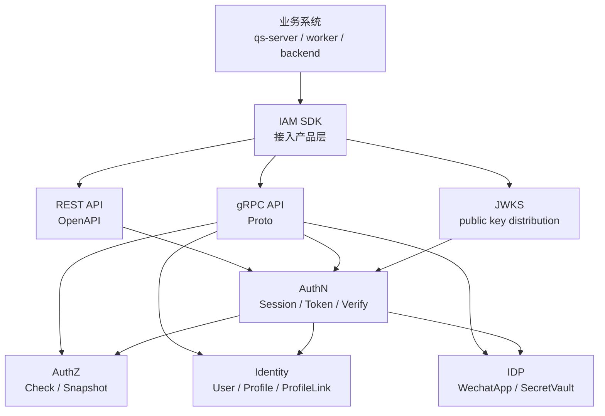

# 为什么 SDK 是接入产品层而不是业务层

## 本文回答

本文回答：为什么 IAM SDK 不是新的业务层，也不是 AuthN/AuthZ/Identity/IDP 的替代实现；为什么 SDK 应该被定位为“接入产品层”：统一封装 REST/gRPC/JWKS/Verify/AuthZ Check/ServiceAuth/错误/配置/可观测性，降低业务服务接入成本；为什么 SDK 不能进入 IAM domain，也不能承载业务规则；这套定位的收益、代价和必须守住的不变量是什么。

读完本文，你应该能回答：

- SDK 在 IAM 架构中属于哪一层；
- SDK 为什么不是新的业务契约；
- SDK 为什么不是 application service，也不是 domain service；
- `sdk.Client` 为什么只是统一 gRPC 连接与子客户端 facade；
- 为什么用户登录在 `auth/loginv2`，而不是 `client.Auth()`；
- 为什么 SDK 同时封装 JWKS、本地验证、在线 Verify、ServiceAuth；
- 为什么 `Authz().AllowScoped` 只是接入便捷方法，不是权限规则；
- 为什么 `ProfileLink()` 是系统侧接入封装，不是 REST 当前用户 guard；
- 为什么 IDP SDK 是高信任内部接入能力；
- 为什么 SDK public API 要用 compile test 固化；
- 为什么 internal transport/observability 不能作为公开 API；
- 业务系统应该如何通过 SDK 接入 IAM。

---

## 30 秒结论

SDK 是 IAM 的 **接入产品层**，不是业务层。

它不定义：

```text
什么是 User
什么是 Account
什么是 Session
什么是 Permission
什么是 ProfileLink
什么是 WechatApp
```

这些属于：

```text
domain / application / REST OpenAPI / gRPC proto
```

SDK 负责的是：

```text
把 IAM 已经暴露的 REST/gRPC/JWKS 能力包装成稳定、易用、可配置、可观测、可测试的 Go 接入体验。
```

当前 SDK 的定位是：

```text
业务服务
  -> pkg/sdk
  -> REST LoginV2 / gRPC AuthN / gRPC AuthZ / gRPC Identity / gRPC IDP / JWKS / Verify / ServiceAuth
  -> IAM Server
```

它解决的是接入复杂度：

| 接入痛点 | SDK 封装 |
| --- | --- |
| gRPC 连接、TLS、metadata、retry | `sdk.NewClient` + `Config` |
| 用户登录 REST v2 | `auth/loginv2` |
| 在线 token verify | `client.Auth().VerifyToken` |
| 本地 JWT 验签 | `auth/jwks` + `auth/verifier` |
| 服务间 token | `auth/serviceauth.ServiceAuthHelper` |
| 授权判定 | `client.Authz().Check/Allow/AllowScoped` |
| User / Profile / ProfileLink 接入 | `client.Identity()`、`client.Profile()`、`client.ProfileLink()` |
| IDP 内部读取 | `client.IDP()` |
| 错误判断 | `pkg/sdk/errors` |
| metrics/tracing 接入 | `WithMetricsCollector`、`WithTracingHook` |

一句话：

> **SDK 不生产 IAM 业务事实；SDK 让业务系统以更低成本、更少错误地消费 IAM 事实。**

---

## 主图：SDK 在 IAM 架构中的位置



---

## 重点速查

| 问题 | 当前答案 | 源码入口 |
| --- | --- | --- |
| SDK 官方定位 | `pkg/sdk` 是 IAM 官方 Go 接入入口，公开稳定面固定。 | `pkg/sdk/README.md` |
| SDK 公开稳定包 | `pkg/sdk`、`config`、`auth/client`、`auth/loginv2`、`auth/jwks`、`auth/verifier`、`auth/serviceauth`、`authz`、`identity`、`idp`、`errors`。 | `pkg/sdk/README.md` |
| SDK 总入口 | `sdk.NewClient(ctx, cfg)`。 | `pkg/sdk/client.go` |
| SDK 子客户端 | Auth、Authz、Identity、ProfileLink、IDP。 | `pkg/sdk/client.go` |
| 用户登录入口 | `auth/loginv2.NewClient` 调 REST `/api/v2/authn/login`。 | `pkg/sdk/auth/loginv2/client.go` |
| AuthZ 接入便捷方法 | `Check`、`Allow`、`AllowScoped`、`GetAuthorizationSnapshot`。 | `pkg/sdk/authz/check.go` |
| ProfileLink 接入能力 | `HasProfileLink`、`ListProfiles`、`GetUserProfiles`、`ListProfileLinks`。 | `pkg/sdk/identity/profile_link_query.go` |
| 服务间认证 | `NewServiceAuthHelper` 启动时获取 token 并启动 refresh loop。 | `pkg/sdk/auth/serviceauth/constructor.go` |
| JWKS 接入 | `NewJWKSManager` 默认职责链 Cache -> CircuitBreaker -> HTTP -> gRPC -> Seed。 | `pkg/sdk/auth/jwks/builder.go` |
| 公开 API 如何防回退 | `public_api_compile_test.go` 固定公开符号。 | `pkg/sdk/public_api_compile_test.go` |
| internal 能力是否公开 | transport、observability、高级 errors 已收回内部实现。 | `pkg/sdk/README.md` |
| 架构边界如何防止层次污染 | architecture tests 禁止 domain/application/transport/container 边界回退。 | `internal/pkg/architecture/architecture_test.go` |

---

## 1. SDK 解决的不是业务问题，而是接入问题

业务问题是：

```text
如何登录？
如何验证 token？
谁有权限访问资源？
User 与 Profile 是什么关系？
微信应用如何管理？
```

这些问题分别由：

```text
AuthN
AuthZ
Identity
IDP
```

解决。

SDK 解决的是另一个问题：

```text
业务服务如何稳定、低成本、少踩坑地接入这些能力？
```

如果没有 SDK，业务服务会散落很多重复代码：

```text
手写 gRPC dial
手写 TLS / mTLS
手写 metadata
手写 request-id / trace-id
手写 VerifyToken 调用
手写 AuthZ Check
手写 JWKS 拉取和缓存
手写 service token 刷新
手写错误码判断
手写重试和超时
```

SDK 把这些接入横切问题产品化，但不改变 IAM 的业务模型。

---

## 2. 为什么 SDK 不是新的业务契约

IAM 的业务契约已经存在：

```text
REST OpenAPI
gRPC proto
domain/application 源码
```

SDK 是这些契约之上的 Go 封装。

例如：

```text
Authz().AllowScoped
```

只是对 gRPC：

```text
AuthorizationService.Check
```

的便捷封装。

它没有定义新的授权语义：

```text
subject/domain/object/action/scope 怎么解释
Casbin 如何判定
RoleBinding 如何生成
PolicyVersion 如何传播
```

这些仍然属于 AuthZ。

同理：

```text
ProfileLink().HasProfileLink
```

只是调用 gRPC ProfileLinkQuery。  
它不定义 ProfileLink 的领域规则。

```text
auth/loginv2.Client.Login
```

只是调用 REST AuthN v2 login endpoint。  
它不决定登录策略和账号绑定。

所以 SDK 是：

```text
consumer-facing facade
```

不是：

```text
domain model
```

---

## 3. 为什么 SDK 不是 application service

application service 位于 IAM Server 内部。

它负责：

```text
用例编排
事务边界
领域服务调用
repository port
UoW
事件 staging
runtime reload
```

SDK 位于调用方进程中。

它负责：

```text
调用 IAM Server
处理连接
传递凭证
包装错误
提供便捷方法
```

这两个层次完全不同。

### 对比

| 维度 | Application Service | SDK |
| --- | --- | --- |
| 所在进程 | IAM Server | 业务服务 |
| 依赖方向 | 调 domain / ports / UoW | 调 REST/gRPC |
| 是否拥有事务 | 是 | 否 |
| 是否写 IAM DB | 是，间接通过 repositories | 否 |
| 是否产生领域事件 | 是 | 否 |
| 是否定义业务规则 | 是 | 否 |
| 主要目标 | 实现用例 | 简化接入 |

如果 SDK 开始实现业务规则，就会出现“双业务层”：

```text
IAM Server 一套规则
SDK 本地一套规则
```

这会导致不可控漂移。

---

## 4. `sdk.Client` 为什么只是统一 facade

`sdk.Client` 内部持有：

```text
grpc.ClientConn
Config
Auth client
Authz client
Identity client
ProfileLink client
IDP client
```

创建过程：

```text
cfg.WithDefaults()
cfg.Validate()
apply ClientOption
attach metadata interceptor
internaltransport.Dial
initSubClients
```

然后暴露：

```text
Auth()
Authz()
Identity()
Profile()
ProfileLink()
IDP()
Conn()
Close()
```

这说明 `sdk.Client` 的核心职责是：

```text
统一连接与子客户端装配
```

不是：

```text
统一 IAM 业务编排
```

### 为什么这很重要

如果 `sdk.Client` 变成业务层，它可能会开始做：

```text
登录后自动建 User
Verify 后自动 Check 权限
ProfileLink 不存在时自动建立
IDP 读取 secret 后自动登录
```

这些都是危险的。  
SDK 不应该替业务服务隐式做 IAM 业务决策。

---

## 5. 为什么用户登录单独放在 `auth/loginv2`

用户登录是 REST AuthN v2 能力：

```text
POST /api/v2/authn/login
```

当前 gRPC AuthN 没有 Login RPC。  
所以 SDK 登录入口是：

```text
pkg/sdk/auth/loginv2
```

而不是：

```text
client.Auth().Login
```

`auth/loginv2.Client` 负责：

```text
规范化 base URL 到 /api/v2
POST /api/v2/authn/login
处理 REST envelope
映射错误到 SDK IAMError
```

这体现了 SDK 的产品层特征：

```text
它不会强行把所有 IAM 能力塞进一个协议
而是根据事实契约选择正确接入方式
```

### 这条边界很重要

```text
用户登录
  -> REST LoginV2

服务端 token verify / refresh / revoke / JWKS
  -> gRPC AuthService / JWKSService

本地 JWT 验签
  -> JWKSManager + TokenVerifier

服务间 token
  -> ServiceAuthHelper
```

SDK 按接入场景组织能力，而不是按 IAM server 内部模块强行一一映射。

---

## 6. 为什么 AuthZ SDK 只是便捷封装，不是授权规则

`Authz().Check` 调用：

```text
AuthorizationService.Check
```

`Allow` 只是：

```text
Check(subject, domain, object, action) -> bool
```

`AllowScoped` 只是：

```text
Check(subject, domain, object, action, scopeType, scopeValue) -> bool
```

它不判断：

```text
subject 格式是否应当是 user 还是 service
resource/action 是否存在
permission 是否应该授予
role binding 是否有效
Casbin facts 如何匹配
scopeMatch 如何覆盖
```

这些全在 IAM AuthZ server 里。

### 正确使用方式

业务服务应该把 SDK 当成远程授权决策客户端：

```go
allowed, err := client.Authz().AllowScoped(
    ctx,
    "user:1024",
    "tenant-a",
    "scale:form:template:*",
    "read",
    "origin",
    "school-a",
)
```

错误使用方式是：

```text
在 SDK 调用方本地复刻 AuthZ 规则
或让 SDK 内置业务资源权限表
```

SDK 可以缓存、fallback、包装调用，但不应成为授权规则源。

---

## 7. 为什么 Identity/Profile/ProfileLink SDK 是系统侧接入封装

`client.Identity()`、`client.Profile()` 和 `client.ProfileLink()` 封装的是 gRPC Identity 服务。

它们更偏系统侧：

```text
IdentityRead
IdentityLifecycle
ProfileCommand
ProfileLinkQuery
ProfileLinkCommand
```

这和 REST `/identity/me`、`/identity/profile-links` 的当前用户视角不同。

例如：

```text
ProfileLink().HasProfileLink(userID, profileID)
```

只是服务间查询某 user/profile 是否有关联。

它不是：

```text
当前登录用户是否可以访问这个 profile
```

当前用户视角 guard 是 REST/application 里的 `MyProfiles` / `MyProfileLinks` 语义。

### 为什么要强调

如果业务服务误以为 SDK ProfileLink 就等于 REST current-user guard，可能产生越权。

正确理解是：

```text
SDK ProfileLink = 系统侧 Identity relation client
业务服务仍要结合自己的用户上下文和 AuthZ 策略
```

---

## 8. 为什么 IDP SDK 是高信任内部接入

`client.IDP()` 当前封装：

```text
IDPService.GetWechatApp
```

而 IDP gRPC service 可能返回：

```text
WechatApp，包括 app_secret
```

这意味着 IDP SDK 不是普通业务服务随便用的能力。

它属于高信任内部接入能力，必须配合：

```text
mTLS
service token
ACL
audit
日志脱敏
```

### 正确边界

普通业务服务如果只是需要微信登录，不应该自己拿 AppSecret。  
应该走：

```text
AuthN 登录
```

只有确实需要与微信平台交互的内部组件，才应该通过 IDP SDK 获取 WechatApp 配置。

SDK 只是提供接入封装，不代表这个能力可以无边界使用。

---

## 9. 为什么 SDK 同时封装 JWKS、Verify、ServiceAuth

IAM 的接入场景不是单一的。

### 9.1 JWKSManager

解决：

```text
业务服务如何获取和缓存 JWKS？
kid miss 怎么办？
HTTP/gRPC/seed 怎么 fallback？
```

默认职责链是：

```text
Cache -> CircuitBreaker -> HTTP -> gRPC -> Seed
```

### 9.2 TokenVerifier

解决：

```text
业务服务如何选择本地验签、远程 Verify、fallback、缓存？
```

它是验证策略层，不是 AuthN 业务层。

### 9.3 ServiceAuthHelper

解决：

```text
服务如何获取 service token？
如何提前刷新？
刷新失败如何处理？
调用时如何构造 authenticated context？
```

它启动时获取初始 token，并运行 refresh loop。

### 9.4 为什么这些属于接入产品层

这些能力都不是 IAM 业务规则本身。  
它们是让业务系统安全可靠消费 IAM 能力的工程封装。

---

## 10. 为什么 internal transport/observability 不公开

SDK README 明确：

```text
transport、observability 和高级错误分析能力已经收回内部实现
不再作为公开稳定包
```

原因是这些是 plumbing：

```text
gRPC dial
retry interceptor
metadata interceptor
metrics wrapper
tracing wrapper
circuit breaker
advanced error matcher
```

如果公开这些低层能力，调用方会绑定 SDK 内部实现，后续重构会困难。

当前公开的是稳定 hook：

```text
WithMetricsCollector
WithTracingHook
DefaultObservabilityConfig
```

这体现产品层设计：

```text
对外提供可用扩展点
对内保留实现演进空间
```

---

## 11. 为什么 SDK public API 要有 compile test

SDK 是外部调用方直接 import 的包。  
一旦公开 API 被误删，业务服务会直接编译失败。

所以当前有：

```text
pkg/sdk/public_api_compile_test.go
```

它固定：

```text
sdk.NewClient
sdk.Config
ConfigFromEnv
ConfigFromViper
DefaultObservabilityConfig
auth/loginv2
auth/jwks
auth/verifier
auth/serviceauth
authz
identity
idp
sdk/errors
```

这不是普通单元测试，而是兼容性护栏。

### 为什么业务层不需要这种 public surface test

IAM server 内部 domain/application 可以通过架构测试和包内测试演进。  
SDK 面向外部调用方，需要更强兼容性承诺。

这进一步说明 SDK 是产品化接入层。

---

## 12. SDK 与 REST/gRPC 的关系

SDK 不替代 REST/gRPC。  
它消费 REST/gRPC。

| 能力 | REST | gRPC | SDK |
| --- | --- | --- |
| 用户登录 | `/authn/login` | 当前无 Login RPC | `auth/loginv2` |
| 在线 Verify | `/authn/verify` | `AuthService.VerifyToken` | `client.Auth().VerifyToken` |
| JWKS | `/.well-known/jwks.json` | `JWKSService.GetJWKS` | `JWKSManager` |
| 本地验签 | 调用方自行实现 | 调用方自行实现 | `TokenVerifier` |
| 服务间 token | 非主入口 | `IssueServiceToken` | `ServiceAuthHelper` |
| AuthZ Check | `/authz/check` | `AuthorizationService.Check` | `Authz().Check/Allow` |
| Identity read | REST current-user/admin | gRPC system-side | `Identity()` |
| Profile command | REST admin/current-user write | gRPC system-side | `Profile()` |
| ProfileLink | REST current-user guard | gRPC system-side | `ProfileLink()` |
| IDP | REST admin management | gRPC high-trust lookup | `IDP()` |

SDK 的价值是把这些差异包装成清晰的 Go API。  
但真实契约仍然是 REST OpenAPI 和 gRPC proto。

---

## 13. 为什么 SDK 不能进入 IAM domain

IAM domain 包不能依赖 SDK。

原因：

```text
domain 是业务模型
SDK 是外部接入客户端
```

如果 domain 依赖 SDK，会出现反向依赖：

```text
IAM server domain -> IAM client SDK -> IAM server API
```

这是架构循环。

正确方向是：

```text
业务服务 -> SDK -> IAM REST/gRPC -> IAM application/domain
```

错误方向是：

```text
IAM domain -> SDK
```

架构测试中已经有类似边界：

```text
domain 不依赖 infra/database
application 不依赖 transport/infra
transport 不依赖 container
```

SDK 也应遵守这个思想：

```text
SDK 只能作为外部接入层，被业务系统使用
不能被 IAM 内部业务层反向使用
```

---

## 14. 如果 SDK 变成业务层会怎样

### 14.1 规则漂移

例如 SDK 本地实现：

```text
AllowScoped 里自己判断 role/resource/scope
```

就可能和 server AuthZ 不一致。

### 14.2 双重事实源

业务规则会分裂成：

```text
server domain/application 一套
SDK 本地一套
```

这会让 bug 极难排查。

### 14.3 安全边界混乱

如果 SDK 自动帮调用方创建 ProfileLink、读取 IDP secret、绕过 AuthZ Check，就会让服务端安全边界失效。

### 14.4 版本兼容困难

SDK 发布节奏和 server 部署节奏不一定一致。  
业务规则放在 SDK 中，会导致不同服务使用不同版本 SDK 时行为不同。

### 14.5 测试复杂度爆炸

每个业务规则都要在：

```text
server
SDK
业务服务
```

重复测试。

所以 SDK 必须保持接入封装定位。

---

## 15. 当前设计收益

### 15.1 降低业务服务接入成本

业务服务不用手写：

- gRPC dial；
- metadata；
- token verify；
- AuthZ Check；
- JWKS refresh；
- service token refresh；
- error mapping。

### 15.2 保持 IAM 业务规则集中

所有认证、授权、Identity、IDP 规则仍在 IAM server 内部。  
SDK 只调用，不复制。

### 15.3 支持多种接入模式

同一个 SDK 支持：

```text
REST LoginV2
gRPC AuthN/AuthZ/Identity/IDP
JWKS local verify
ServiceAuth
```

### 15.4 有稳定对外 API

公开稳定面由 README 和 compile test 固化。  
内部 transport/observability 可以继续演进。

### 15.5 更适合业务项目复用

qs-server、worker、backend 等 Go 服务可以统一通过 SDK 接入 IAM，而不是各写一套 client。

---

## 16. 当前设计代价

### 16.1 SDK 本身也要维护版本兼容

公开 API 一旦稳定，就不能随意删除。  
这增加维护成本。

### 16.2 调用方仍要理解边界

SDK 简化接入，但不能替调用方理解：

```text
local verify vs online verify
ProfileLink vs AuthZ Permission
IDP secret 风险
REST Login vs gRPC Auth
```

### 16.3 SDK 不能替代服务端策略

调用方如果期待 SDK 自动做所有权限和登录判断，会误用。

### 16.4 SDK 与 server 契约要同步

proto/OpenAPI 变化后，SDK wrapper、docs、compile test 都要更新。

---

## 17. 必须守住的不变量

### 17.1 SDK 不定义业务规则

AuthN/AuthZ/Identity/IDP 规则以 server domain/application 为准。

### 17.2 SDK 不替代 REST/gRPC 契约

SDK API 只是 Go 封装。  
机器契约仍是 OpenAPI 和 proto。

### 17.3 SDK 不进入 IAM domain/application

IAM server 的核心业务层不能依赖 SDK。

### 17.4 SDK public API 必须稳定

公开符号变更必须更新 compile test 和迁移文档。

### 17.5 internal transport/observability 不公开

对外只提供 hook 和 config，不暴露 internal plumbing。

### 17.6 SDK 不隐藏高风险边界

IDP secret、service token、local verify vs online verify 都必须在文档中明确。

### 17.7 SDK 不能把 ProfileLink 当 AuthZ permission

ProfileLink client 是 Identity relation client。  
权限仍然走 AuthZ。

---

## 18. 面试/宣讲讲法

### 10 秒版

```text
SDK 是 IAM 的接入产品层，不是业务层；它把 REST/gRPC/JWKS/AuthZ Check 等能力封装成稳定 Go API，降低业务服务接入成本，但不复制 IAM 的业务规则。
```

### 30 秒版

```text
我把 SDK 定位成接入产品层，而不是业务层。IAM 的业务语义仍然在 AuthN、AuthZ、Identity、IDP 的 server-side domain/application 中；SDK 只负责把 REST LoginV2、gRPC Verify/AuthZ/Identity/IDP、JWKS、本地验证、ServiceAuth、错误处理和配置封装成稳定的 Go API。这样业务服务能更容易接入 IAM，同时不会产生第二套认证授权规则。
```

### 3 分钟版结构

```text
1. 先说明 SDK 解决的是接入复杂度
2. 讲 sdk.Client 只是连接和子客户端 facade
3. 讲 LoginV2 为什么是 REST client
4. 讲 AuthZ/Identity/Profile/ProfileLink SDK 只是 gRPC wrapper
5. 讲 JWKS/Verifier/ServiceAuth 是接入策略封装
6. 讲为什么 SDK 不能承载业务规则
7. 讲 public API compile test 和 internal 包边界
8. 讲收益、代价和不变量
```

---

## 19. 常见追问

### Q1：为什么不把 SDK 做成业务领域模型？

因为业务领域模型应该只有一个事实源，即 IAM server 的 domain/application。  
SDK 如果复制领域规则，会和 server 漂移。

### Q2：SDK 里的 `AllowScoped` 算不算业务规则？

不算。  
它只是 `AuthorizationService.Check` 的便捷封装。真正的授权规则在 server AuthZ。

### Q3：为什么登录不放在 `client.Auth()`？

因为当前登录事实契约是 REST AuthN v2，不是 gRPC AuthService。  
SDK 按事实契约封装，所以用户登录在 `auth/loginv2`。

### Q4：业务服务能不能只用 SDK，不懂 REST/gRPC？

可以降低理解成本，但不能完全不懂边界。  
至少要知道 local verify 与 online verify 的差异、ProfileLink 与 AuthZ 的差异、IDP secret 的风险。

### Q5：为什么 SDK internal transport 不公开？

因为 transport/retry/metadata/observability 是内部 plumbing。  
公开后会绑死实现。对外只暴露稳定 config 和 hook。

### Q6：SDK 能不能自动帮我做权限中间件？

可以在业务服务侧封装 middleware，但 SDK core 不应该默认替所有场景做权限决策。不同业务资源和风险等级不同，必须由业务服务显式接入 AuthZ Check。

---

## 20. 代码证据地图

| 结论 | 代码入口 |
| --- | --- |
| SDK 是官方 Go 接入入口，公开稳定面固定 | `pkg/sdk/README.md` |
| internal transport/observability 不再公开 | `pkg/sdk/README.md` |
| `sdk.Client` 只装配 gRPC conn 与子客户端 | `pkg/sdk/client.go` |
| LoginV2 是 REST client，调用 `/api/v2/authn/login` | `pkg/sdk/auth/loginv2/client.go` |
| AuthZ SDK 是 Check/Allow/AllowScoped wrapper | `pkg/sdk/authz/check.go` |
| ProfileLink SDK 是 gRPC query wrapper | `pkg/sdk/identity/profile_link_query.go` |
| ServiceAuthHelper 管服务间 token 获取和刷新 | `pkg/sdk/auth/serviceauth/constructor.go` |
| JWKSManager 默认职责链 | `pkg/sdk/auth/jwks/builder.go` |
| SDK public API compile test 固定公开符号 | `pkg/sdk/public_api_compile_test.go` |
| 架构测试保护 server-side 分层边界 | `internal/pkg/architecture/architecture_test.go` |

---

## 21. 推荐源码阅读路线

### 第一轮：SDK 总入口

```text
pkg/sdk/README.md
pkg/sdk/client.go
pkg/sdk/aliases.go
pkg/sdk/public_api_compile_test.go
```

目标：理解 SDK 公开面和统一 client。

### 第二轮：配置与 transport 边界

```text
pkg/sdk/config
pkg/sdk/internal/transport
pkg/sdk/context_helpers.go
```

目标：理解公开 config 与 internal plumbing 的边界。

### 第三轮：用户登录

```text
pkg/sdk/auth/loginv2/client.go
pkg/sdk/auth/loginv2/types.go
api/rest/authn.v2.yaml
```

目标：理解 REST LoginV2 是用户登录入口。

### 第四轮：认证接入

```text
pkg/sdk/auth/client
pkg/sdk/auth/jwks
pkg/sdk/auth/verifier
pkg/sdk/auth/serviceauth
api/grpc/iam/authn/v2/authn.proto
```

目标：理解 Verify、JWKS、本地验证、服务间 token。

### 第五轮：授权和身份接入

```text
pkg/sdk/authz/check.go
pkg/sdk/identity/read.go
pkg/sdk/identity/profile_link_query.go
pkg/sdk/identity/profile_link_command.go
api/grpc/iam/authz/v2/authz.proto
api/grpc/iam/identity/v2/identity.proto
```

目标：理解 SDK 只是 server gRPC 契约 wrapper。

### 第六轮：IDP 与安全边界

```text
pkg/sdk/idp
api/grpc/iam/idp/v2/idp.proto
docs/05-接入与契约/02-gRPC API契约.md
```

目标：理解 IDP SDK 是高信任内部接入能力。

---

## 22. 验证建议

```bash
go test ./pkg/sdk \
  ./pkg/sdk/auth/... \
  ./pkg/sdk/authz \
  ./pkg/sdk/identity \
  ./pkg/sdk/idp \
  ./pkg/sdk/config \
  ./pkg/sdk/errors

go test ./internal/pkg/architecture

make docs-hygiene
```

建议重点测试方向：

| 测试方向 | 目的 |
| --- | --- |
| public API compile | 防止稳定公开符号回退 |
| NewClient | 子客户端初始化完整 |
| Config defaults/validate | 连接配置稳定 |
| LoginV2 | base URL 规范化、REST envelope、错误映射 |
| Auth().VerifyToken | gRPC AuthN 包装和错误包装 |
| JWKSManager | HTTP/gRPC/seed/cache fallback |
| TokenVerifier | local/remote/fallback 策略 |
| ServiceAuthHelper | 初始 token、refresh loop、Stop |
| Authz.AllowScoped | CheckRequest 字段传递正确 |
| ProfileLink.HasProfileLink | gRPC query wrapper 正确 |
| IDP.GetWechatApp | 高信任接口错误包装 |
| SDK internal import | 外部文档不鼓励依赖 internal plumbing |

---

## 本文总结

SDK 是接入产品层，不是业务层。

它的目标是：

```text
让业务服务更容易、更稳定、更安全地消费 IAM 能力
```

而不是：

```text
在客户端重新实现 IAM 业务规则
```

正确分层是：

```text
IAM Server domain/application
  -> 定义和执行 AuthN/AuthZ/Identity/IDP 业务规则

REST / gRPC / JWKS
  -> 暴露机器契约

SDK
  -> 封装这些契约，提供 Go 服务端接入体验

业务服务
  -> 使用 SDK 调 IAM，而不是复制 IAM 规则
```

必须守住：

```text
SDK 不定义业务规则
SDK 不替代 OpenAPI/proto
SDK 不进入 IAM domain/application
SDK public API 要稳定
SDK internal plumbing 不公开
高风险能力要明确边界
```

这就是为什么 SDK 应该被视为“接入产品层”，而不是 IAM 的“业务层”。
