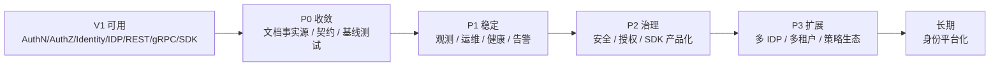

# 系统演进路线

## 本文回答

本文回答：IAM 当前已经完成了什么；下一阶段不应该盲目堆功能，而应该如何从“可用”演进到“可治理、可观测、可扩展、可产品化”；AuthN、AuthZ、Identity、IDP、SDK、运维、架构护栏分别还有哪些关键演进方向；哪些事情应该优先做，哪些应该暂缓；如何用测试、契约和文档保证演进不破坏现有边界。

读完本文，你应该能回答：

- IAM 当前能力基线是什么；
- 下一阶段系统演进的核心目标是什么；
- 为什么演进不应从“继续加功能”开始；
- AuthN 下一步应该优先补什么；
- AuthZ 下一步应该优先补什么；
- Identity/ProfileLink 下一步应该优先补什么；
- IDP 下一步应该如何从微信走向通用身份源；
- SDK 下一步如何从 Go client 走向接入产品；
- 运行时和运维还缺哪些治理能力；
- 架构护栏还应该怎样加强；
- 哪些需求现在看起来重要，但应该暂缓；
- 如何给 IAM 制定阶段性 roadmap；
- 如何判断一个演进项是否应该进入下一阶段。

---

## 30 秒结论

IAM 当前已经不是“从零开始”的系统。  
它已经具备第一版身份与访问管理服务的骨架：

```text
AuthN：登录、Session、Token、Refresh、JWKS、KeyRotation、ServiceToken
AuthZ：Role、Resource、Permission、RoleBinding、Check、Snapshot、PolicyVersion、Outbox
Identity：User、Profile、ProfileLink、当前用户档案关系
IDP：微信/企微应用配置、SecretVault、外部身份源协作
Access：REST、gRPC、SDK
Runtime：process/container/transport/bootstrap/shutdown
Guard：architecture tests、OpenAPI/proto/SDK/docs 防漂移
```

下一阶段不应该先追求“大而全”，而应该按下面顺序演进：

```text
P0：收敛事实源与文档发布
P1：补齐稳定性、观测性和运维闭环
P2：增强安全治理、授权治理和接入产品化
P3：扩展多身份源、多租户治理、策略同步与生态化
```

核心路线是：

```text
可用
  -> 可验证
  -> 可观测
  -> 可治理
  -> 可扩展
  -> 可产品化
```

一句话：

> **IAM 的下一阶段重点，不是再堆更多功能，而是把已有的认证、授权、身份、IDP、接入能力做成可治理、可观测、可验证、可持续演进的基础服务。**

---

## 主图：IAM 演进路线



---

## 重点速查

| 演进方向 | 当前基础 | 下一步重点 | 事实入口 |
|---|---|---|---|
| 系统定位 | IAM 已覆盖 AuthN/AuthZ/Identity/IDP/Suggest/CacheGovernance/Outbox | 收敛为身份与访问管理平台，不再按普通用户中心讲 | `README.md` |
| 文档体系 | 第一版事实层已经形成 00-06 | 增加 07 专题分析、08 宣讲，更新 docs README | `docs/README.md` |
| AuthN | Session、Refresh、Verify、JWKS、KeyRotation、ServiceToken | 完善设备会话、风险登录、service token revoke、审计 | `application/authn` |
| AuthZ | Check、Snapshot、PolicyChange、UoW、Outbox | 授权审计、policy diff、缓存治理、scope 扩展、admin guard | `application/authz` |
| Identity | User、Profile、ProfileLink、SelfProfileEnsurer | 邀请/审批、关系审计、更多 relation、Profile 资源化授权 | `application/uc` |
| IDP | 微信/企微配置、SecretVault、access_token | 抽象 Provider 接入模型、OIDC/SAML/OAuth2 provider | `application/idp` |
| SDK | Go SDK 公开面、LoginV2、JWKS、Verifier、ServiceAuth、AuthZ | SDK middleware、cache strategy、more examples、semver release | `pkg/sdk` |
| 运行时 | process/container/transport/lifecycle | health/ready 深度化、metrics、tracing、runtime dashboard | `internal/apiserver/process` |
| 事件 | AuthZ version outbox relay | outbox dashboard、dead-letter、manual replay、consumer idempotency guide | `infra/mysql/eventoutbox` |
| 架构护栏 | architecture tests、contract tests、docs hygiene | 增加演进决策记录、ADR、契约兼容矩阵 | `internal/pkg/architecture` |

---

## 1. 当前能力基线

IAM 当前已经具备明确的一阶段能力。

根 README 已经把功能特性列为：

```text
认证系统 AuthN
授权系统 AuthZ
身份管理 Identity
第三方集成 IDP
智能搜索 Suggest
缓存治理 CacheGovernance
事件发布 Transactional Outbox
```

并且系统结构已经按六边形架构与 CQRS 思路组织为：

```text
process
container
transport/rest
transport/grpc
application
domain
infra
```

这说明 IAM 已经具备：

```text
模块边界
运行时装配
协议接入
领域模型
基础设施适配
事件传播
SDK 接入
文档与架构护栏
```

### 1.1 第一阶段已经解决的问题

当前 IAM 已经能回答：

- 用户如何通过多种方式登录；
- token 如何签发、刷新、撤销；
- JWKS 如何发布；
- 用户是否被 block / inactive；
- subject 是否有权限访问 resource/action/scope；
- 权限变更如何写入 facts；
- 授权版本如何通过 outbox 传播；
- User/Profile/ProfileLink 如何表达业务档案关系；
- 微信/企微 IDP 如何协作；
- 业务服务如何通过 REST/gRPC/SDK 接入；
- 架构边界如何通过测试约束。

### 1.2 当前不应该再用“用户中心”描述它

当前系统已经超出了：

```text
User CRUD
Login
JWT
Role field
```

它应该被定位为：

```text
身份与访问管理基础服务
```

后续路线也应该围绕这个定位展开。

---

## 2. 演进路线的核心原则

### 2.1 先治理，再扩张

不要一上来就继续加：

```text
更多 IDP
更多权限模型
更多 SDK 语言
更多后台页面
更多缓存
```

在已有能力基线下，优先应该补齐：

```text
观测
审计
运维
错误边界
兼容性
文档事实源
测试护栏
```

否则功能越多，漂移越快。

### 2.2 所有演进必须回到事实源

新增能力必须同步：

```text
源码
OpenAPI / proto
SDK wrapper
测试
docs
architecture guard
```

不能只写代码，不写契约。  
也不能只写文档，不改事实源。

### 2.3 不要破坏已有边界

演进不能让系统退回：

```text
AuthN 判断资源权限
AuthZ 签发 token
IDP 直接登录
ProfileLink 变成权限表
SDK 复制 server business rule
domain import infra
application import transport
```

这些边界是系统可持续演进的前提。

### 2.4 每个阶段都要有可验证交付物

演进路线不应该写成：

```text
以后优化安全
以后完善观测
以后增强授权
```

而应该写成：

```text
新增哪些接口
新增哪些测试
新增哪些指标
新增哪些文档
什么命令通过
```

---

## 3. P0：收敛事实源与第一版发布

P0 的目标是：

```text
把当前已经实现的系统讲清楚、验清楚、发布清楚。
```

不是继续加功能。

### 3.1 文档体系收敛

当前 `docs/README.md` 已经定义 00-06 第一版事实层。  
后续应该补：

```text
07-专题分析
08-宣讲
```

最终文档结构建议：

```text
docs/
├── 00-概览/
├── 01-运行时/
├── 02-认证AuthN/
├── 03-授权AuthZ/
├── 04-身份Identity/
├── 05-接入与契约/
├── 06-架构护栏/
├── 07-专题分析/
├── 08-宣讲/
└── _archive/
```

### 3.2 归档旧文档

旧文档要进入：

```text
docs/_archive/
```

并在 `_archive/README.md` 中说明：

```text
只做历史追溯
不作为当前事实源
```

### 3.3 契约验证跑通

P0 必须确保：

```bash
make docs-hygiene
go test ./internal/pkg/architecture
go test ./internal/apiserver/transport/rest
go test ./internal/apiserver/transport/grpc
go test ./pkg/sdk
```

如果涉及 API：

```bash
make docs-swagger
make api-validate
make proto-gen
```

### 3.4 交付物

```text
docs/README.md 更新到终局结构
07-专题分析 完成第一版
08-宣讲 完成第一版
_archive 归档清楚
CONTRIBUTING-DOCS 与 docs-hygiene 保持一致
```

### 3.5 完成标准

P0 完成后，读者应该能：

```text
从 docs/README 进入任何主题
知道事实源在哪里
知道旧文档不能作为当前事实
知道 REST/gRPC/SDK 怎么接入
知道源码阅读路线
```

---

## 4. P1：稳定性与可观测性闭环

P1 的目标是：

```text
让 IAM 不只是能跑，而是能被观测、诊断、告警和恢复。
```

### 4.1 Health / Ready / Live 深度化

当前已有 health、debug、gRPC health、outbox relay runtime task 等基础。  
下一步应区分：

```text
live：进程还活着
ready：核心依赖可用，能处理流量
health：模块级状态与降级状态
```

建议补充：

| 检查项 | 用途 |
|---|---|
| MySQL ping | 基础依赖 |
| Redis ping | session/token/cache 依赖 |
| JWKS active key | token 签发能力 |
| Casbin runtime loaded | AuthZ 判定能力 |
| Outbox pending/failed | 事件传播健康 |
| IDP SecretVault | 第三方登录能力 |
| EventBus availability | Outbox relay 发布能力 |

### 4.2 Metrics

建议增加指标：

```text
authn_login_total{method,result}
authn_token_verify_total{result,reason}
authn_refresh_total{result}
authz_check_total{result,resource,action}
authz_policy_change_total{kind,result}
outbox_pending_count
outbox_failed_count
outbox_oldest_age_seconds
jwks_key_rotation_total
idp_wechat_token_refresh_total{result}
sdk_request_total{method,code}
```

### 4.3 Tracing

重点链路：

```text
Login
Verify
Refresh
AuthZ Check
Grant/Revoke Permission
Bind/Unbind Role
ProfileLink Create/Revoke
Wechat login
Outbox relay
```

Trace 应该能回答：

```text
一个登录请求卡在哪里？
一个 AuthZ Check 是 token verify 慢，还是 Casbin 慢？
一个 outbox event 是否发布失败？
```

### 4.4 Log 结构化

日志必须结构化记录：

```text
request_id
trace_id
user_id
account_id
tenant_id
session_id
event_id
policy_version
operation
result
error_code
duration_ms
```

禁止记录：

```text
password
refresh token 明文
AppSecret
CorpSecret
private key
```

### 4.5 交付物

```text
metrics 文档
health/readiness 文档
debug/diagnostics 文档
Grafana dashboard 草案
alert rule 草案
outbox status dashboard
```

---

## 5. P2：AuthN 安全治理增强

P2 的 AuthN 目标是：

```text
把登录态从“可用”提升到“可治理、安全可控、可审计”。
```

### 5.1 设备会话管理

当前 Session 已经是登录态锚点。  
下一步可以扩展：

```text
device_id
device_name
ip
user_agent
location
login_method
last_seen_at
risk_level
```

并支持：

```text
列出我的登录设备
撤销单个设备
撤销全部其他设备
管理员下线用户全部 session
```

### 5.2 风险登录检测

基于 Session 和 Login event 扩展：

```text
异常 IP
异常地区
新设备
短时间多次失败
高风险登录方式
```

初期可以只做记录和审计，不一定立即阻断。

### 5.3 Service Token 治理

当前 service token 有 IssueServiceToken 和 SDK ServiceAuthHelper。  
后续可增强：

```text
service identity registry
service token revoke marker
service credential version
audience policy
service token audit
TTL policy
```

### 5.4 Refresh Token 安全

建议增强：

```text
refresh token reuse detection
refresh token family
rotation replay detection
refresh token device binding
refresh token revoke reason
```

### 5.5 JWKS / KeyRotation 治理

增强方向：

```text
key rotation dry-run
key rotation audit
key retirement safety check
kid miss metrics
JWKS cache diagnostics
manual force rotate / retire 流程文档
```

### 5.6 交付物

```text
Session 管理 API
Session 管理后台契约
Service token revoke 设计
Refresh token family 设计
Key rotation 运维手册
AuthN 安全审计日志
```

---

## 6. P2：AuthZ 治理增强

P2 的 AuthZ 目标是：

```text
从“能判定”演进到“能治理授权策略”。
```

### 6.1 Policy Diff

每次授权变更应能回答：

```text
这次变更前后差异是什么？
谁改的？
为什么改？
影响哪些 subject/resource？
```

可以围绕 `PolicyChange` 扩展：

```text
before facts
after facts
diff summary
changed_by
reason
request_id
```

### 6.2 授权审计

记录：

```text
grant permission
revoke permission
bind role
unbind role
policy version increment
outbox event id
runtime reload result
```

并提供查询接口。

### 6.3 Resource Catalog 治理

当前 Resource/Permission 已有模型。  
后续要治理：

```text
resource key 命名规范
action 命名规范
scope kind 命名规范
resource ownership
resource deprecation
```

### 6.4 Scope 扩展

当前 scope 已经存在，但未来可能需要更丰富语义：

```text
tenant
origin
school
profile
organization
project
```

要避免：

```text
scope_value 被写成无限自由文本
```

建议引入：

```text
scope registry
scope validator
scope docs
scope test cases
```

### 6.5 授权快照缓存策略

围绕：

```text
AuthorizationSnapshot
PolicyVersion
iam.authz.version_changed
```

设计：

```text
SDK snapshot cache
业务服务本地 cache
tenant version tracking
stale-while-revalidate
```

### 6.6 交付物

```text
Policy Diff 文档
授权审计表/事件
Resource/Action/Scope 命名规范
AuthZ Snapshot cache guide
Outbox consumer 幂等指南
```

---

## 7. P2：Identity/ProfileLink 治理增强

P2 的 Identity 目标是：

```text
让 User/Profile/ProfileLink 从可用模型演进到可协作、可审计、可扩展的身份关系系统。
```

### 7.1 ProfileLink 邀请与审批

当前 ProfileLink 可以建立和撤销。  
后续可以引入：

```text
invite
accept
reject
expire
revoke
```

解决：

```text
用户不能随便把自己 link 到任意儿童档案
```

### 7.2 关系审计

记录：

```text
who linked whom
relation
established_at
revoked_at
operator
reason
request_id
```

### 7.3 Relation 扩展

当前 relation：

```text
self
parent
grandparent
other
```

未来可能扩展：

```text
guardian
teacher
doctor
therapist
viewer
```

要避免直接乱加枚举。  
应先明确：

```text
业务权限含义
是否与 AuthZ 绑定
是否需要审批
是否可撤销
```

### 7.4 Profile 资源化授权

当前 ProfileLink 是 Identity guard，不是 AuthZ permission。  
未来如果 Profile 访问要统一进 AuthZ，可设计：

```text
Resource: identity:profile:*
Action: read / update / link / revoke
Scope: profile:<id> / origin:<school>
```

但不能把 ProfileLink 直接当权限表。

### 7.5 交付物

```text
ProfileLink invite/approval 设计
ProfileLink audit 设计
Relation 扩展规范
Profile resource authorization ADR
MyProfiles access guard tests
```

---

## 8. P2：IDP 从微信模块走向通用 Provider

P2 的 IDP 目标是：

```text
从“微信应用配置模块”演进为“通用外部身份源基础设施”。
```

### 8.1 Provider 抽象

当前 IDP 主要是 WechatApp。  
未来可抽象：

```text
Provider
ProviderApp
ProviderCredential
ProviderSecret
ProviderTokenCache
ProviderAuthClient
```

支持：

```text
wechat_miniprogram
wecom
wechat_official_account
oidc
oauth2
saml
apple
google
feishu
dingtalk
```

### 8.2 SecretVault 演进

当前 SecretVault 是端口。  
后续可以支持：

```text
local AES-GCM
cloud KMS
HSM
key versioning
secret rotation audit
```

### 8.3 Provider Token 治理

微信 access_token 只是第一类 provider token。  
未来可统一：

```text
provider_access_token
provider_refresh_token
provider_token_cache
provider_token_refresh_policy
```

注意始终区分：

```text
Provider token != IAM token
```

### 8.4 交付物

```text
Generic IDP Provider ADR
SecretVault KMS adapter
Provider token cache interface
OIDC provider spike
IDP admin REST/gRPC contract v3 评估
```

---

## 9. P2：SDK 接入产品化增强

P2 的 SDK 目标是：

```text
让 SDK 从“可用 client”变成“业务服务接入 IAM 的产品化工具箱”。
```

### 9.1 Middleware

提供可选 server-side middleware：

```text
HTTP token verify middleware
gRPC token verify interceptor
AuthZ Check middleware helper
ProfileLink guard helper
```

但必须保持：

```text
显式配置
不默认替业务做授权决策
不复制 server 业务规则
```

### 9.2 缓存策略

提供：

```text
JWKS cache
Verify result cache
AuthorizationSnapshot cache
PolicyVersion invalidation hook
```

注意：

```text
缓存必须能被 PolicyVersion event 失效
```

### 9.3 示例完善

新增示例：

```text
basic
mtls
verifier
service_auth
authz
snapshot_cache
profilelink_guard
idp_internal
```

### 9.4 发布治理

引入：

```text
semver
changelog
migration guide
public API compatibility
examples compile test
```

### 9.5 交付物

```text
SDK middleware package
SDK snapshot cache guide
SDK examples 2.0
SDK compatibility policy
SDK release checklist
```

---

## 10. P2：接入契约与后台管理面增强

P2 的 Access 目标是：

```text
让 REST/gRPC/SDK 不只是可调用，而是可治理、可兼容、可演进。
```

### 10.1 API 兼容矩阵

维护：

```text
REST v2 path compatibility
gRPC v2 proto compatibility
SDK version compatibility
deprecated route list
breaking change policy
```

### 10.2 Admin API 分层

明确：

```text
public
protected
admin
internal
debug
```

并在文档和测试中保护。

### 10.3 API Gateway 接入指南

输出：

```text
JWKS local verify at gateway
online Verify fallback
AuthZ Check per route
service token for backend
mTLS between services
```

### 10.4 交付物

```text
API compatibility matrix
Admin route protection checklist
Gateway integration guide
REST/gRPC/SDK versioning policy
```

---

## 11. P3：多实例、多租户与策略生态

P3 是更长线的演进。

### 11.1 多实例策略同步

当前 Outbox 传播版本事件。  
后续可以增强：

```text
multi-instance runtime reload coordination
policy sync worker
tenant version registry
node policy freshness
```

### 11.2 多租户治理

强化：

```text
tenant isolation
platform tenant
business tenant
tenant-level admin
tenant-level policy version
tenant-level audit
```

### 11.3 外部策略生态

未来可考虑：

```text
policy export
policy import
policy simulation
policy dry-run
policy approval workflow
policy rollback
```

### 11.4 管理后台产品化

围绕：

```text
User
Account
Session
Role
Resource
Permission
RoleBinding
PolicyVersion
Outbox
IDP Provider
ProfileLink
```

建设后台能力。

---

## 12. 哪些事情应该暂缓

### 12.1 暂缓复杂 ABAC

当前 RBAC + scope 已经够用。  
不建议立刻引入复杂 ABAC/OPA/Rego，除非业务确实需要复杂属性策略。

### 12.2 暂缓多语言 SDK

Go SDK 还需要产品化。  
先把 Go SDK 做稳定，再考虑 Java/Node/Python SDK。

### 12.3 暂缓重做所有 API v3

除非现有 v2 契约无法承载核心需求。  
否则应该保持 v2 稳定，局部扩展。

### 12.4 暂缓 IDP 大而全平台

先抽象 provider model，再接一个新 provider 验证。  
不要一次性支持所有平台。

### 12.5 暂缓把 ProfileLink 全面 AuthZ 化

ProfileLink 是 Identity 关系。  
如果要资源化授权，应先做 ADR 和小范围试点。

---

## 13. 演进优先级矩阵

| 优先级 | 方向 | 原因 | 交付物 |
|---|---|---|---|
| P0 | 文档与事实源收敛 | 避免后续演进无依据 | 00-08 文档、archive、docs-hygiene |
| P0 | 契约测试跑通 | 防止 REST/gRPC/SDK 漂移 | api-validate、proto test、SDK compile |
| P1 | Metrics/Tracing/Health | 基础服务必须可观测 | 指标、dashboard、health/readiness |
| P1 | Outbox 运维面 | 事件传播是关键链路 | status、retry、manual replay |
| P1 | AuthN 安全审计 | 登录态是核心安全面 | session audit、token audit |
| P2 | AuthZ 审计与 diff | 授权变更需要可解释 | policy diff、change log |
| P2 | SDK middleware/cache | 接入产品化 | middleware、snapshot cache |
| P2 | ProfileLink invite/audit | 关系协作治理 | invite/approval/audit |
| P2 | IDP provider abstraction | 从微信走向通用身份源 | provider ADR、OIDC spike |
| P3 | 多实例策略同步 | 平台化部署需要 | sync worker、freshness dashboard |
| P3 | 管理后台产品化 | 提升可运营性 | admin console / APIs |

---

## 14. 阶段性路线图

### Phase 0：文档发布与基线冻结

目标：

```text
当前系统讲清楚
旧文档归档
事实源统一
```

交付：

```text
docs/07-专题分析/*
docs/08-宣讲/*
docs/_archive/README.md
docs/README.md 更新
make docs-hygiene 通过
```

### Phase 1：观测与运维闭环

目标：

```text
系统出问题能看到、能定位、能恢复
```

交付：

```text
metrics
tracing
health/readiness
outbox dashboard
key rotation audit
session/token audit
```

### Phase 2：安全与授权治理

目标：

```text
登录态、授权变更、ProfileLink 关系可审计、可治理
```

交付：

```text
session management
service token governance
policy diff
authorization audit
profilelink invite/audit
resource/scope registry
```

### Phase 3：接入产品化

目标：

```text
业务服务低成本接 IAM
```

交付：

```text
SDK middleware
snapshot cache
examples
compatibility matrix
gateway integration guide
```

### Phase 4：平台化扩展

目标：

```text
从单项目 IAM 走向身份平台
```

交付：

```text
generic IDP provider
OIDC/OAuth2/SAML support
multi-tenant governance
policy simulation
admin console
multi-language SDK
```

---

## 15. 判断一个演进项是否应该做

每个演进项进入 backlog 前，问 8 个问题：

```text
1. 它解决的是当前真实痛点，还是想象中的平台能力？
2. 它属于 AuthN/AuthZ/Identity/IDP/SDK/Infra 哪个边界？
3. 它是否会破坏已有不变量？
4. 它是否需要更新 REST/gRPC/SDK 契约？
5. 它是否需要新增架构测试或契约测试？
6. 它是否需要迁移数据？
7. 它是否能被观测和运维？
8. 它是否能被文档准确解释？
```

如果回答不清楚，就不要马上做。

---

## 16. 常见误区

### 误区一：演进路线就是功能列表

不是。  
演进路线应该说明阶段目标、优先级、边界、交付物和验证方式。

### 误区二：继续加 IDP 就是平台化

不是。  
没有 Provider 抽象、SecretVault 治理、token cache、审计和管理面，接更多平台只会增加复杂度。

### 误区三：有了 Outbox 就不需要运维

不对。  
Outbox 只是保证事件可重试。pending/failed 堆积仍需要观测、告警和修复手段。

### 误区四：SDK 越厚越好

不对。  
SDK 应该产品化接入体验，但不能复制 server 业务规则。

### 误区五：AuthZ 越复杂越强

不对。  
授权模型越复杂，治理成本越高。当前应先把 RBAC + scope + version + audit 做扎实。

### 误区六：文档写完就不会漂移

不对。  
文档必须和源码、契约、测试一起维护。

---

## 17. 推荐源码阅读路线

### 第一轮：当前能力基线

```text
README.md
docs/README.md
```

目标：理解现有模块和文档事实层。

### 第二轮：运行时和装配

```text
internal/apiserver/process
internal/apiserver/container
internal/apiserver/transport/rest
internal/apiserver/transport/grpc
```

目标：理解演进项会落在哪些运行时边界。

### 第三轮：AuthN/AuthZ/Identity/IDP

```text
internal/apiserver/application/authn
internal/apiserver/application/authz
internal/apiserver/application/uc
internal/apiserver/application/idp
```

目标：理解各业务边界当前状态。

### 第四轮：Infra 和 Outbox

```text
internal/apiserver/infra
internal/apiserver/infra/mysql/eventoutbox
internal/apiserver/infra/messaging
```

目标：理解观测、运维、可靠性演进的基础。

### 第五轮：SDK 与契约

```text
api/rest
api/grpc
pkg/sdk
```

目标：理解接入产品化路线。

### 第六轮：护栏

```text
internal/pkg/architecture
scripts
docs/CONTRIBUTING-DOCS.md
```

目标：理解演进如何不破坏边界。

---

## 18. 验证建议

常规演进检查：

```bash
go test ./internal/pkg/architecture
go test ./internal/apiserver/transport/rest
go test ./internal/apiserver/transport/grpc
go test ./pkg/sdk
make docs-hygiene
```

涉及 REST：

```bash
make docs-swagger
make api-validate
```

涉及 gRPC：

```bash
make proto-gen
go test ./internal/apiserver/transport/grpc
```

涉及 SDK：

```bash
go test ./pkg/sdk/...
```

涉及 AuthN：

```bash
go test ./internal/apiserver/application/authn/... \
  ./internal/apiserver/domain/authn/... \
  ./internal/apiserver/infra/cache/redis \
  ./internal/apiserver/infra/token/...
```

涉及 AuthZ：

```bash
go test ./internal/apiserver/application/authz/... \
  ./internal/apiserver/domain/authz/... \
  ./internal/apiserver/infra/casbin \
  ./internal/apiserver/infra/mysql/eventoutbox
```

涉及 Identity：

```bash
go test ./internal/apiserver/application/uc/... \
  ./internal/apiserver/domain/uc/... \
  ./internal/apiserver/infra/mysql/profilelink
```

涉及 IDP：

```bash
go test ./internal/apiserver/application/idp/... \
  ./internal/apiserver/domain/idp/... \
  ./internal/apiserver/transport/rest/idp
```

---

## 19. 本文总结

IAM 的系统演进路线不应该是：

```text
继续加更多功能
```

而应该是：

```text
把已有身份与访问管理能力做成可治理、可观测、可扩展、可产品化的基础服务。
```

当前系统已经具备：

```text
AuthN
AuthZ
Identity
IDP
REST/gRPC/SDK
Outbox
CacheGovernance
架构护栏
文档事实源
```

下一步路线应该是：

```text
P0：事实源收敛与文档发布
P1：观测、健康、运维、审计
P2：安全治理、授权治理、SDK 产品化、ProfileLink 协作治理
P3：多 IDP、多租户、多实例策略同步、管理后台与生态化
```

核心原则是：

```text
先治理，再扩张
先可验证，再产品化
先守边界，再做平台
```

这篇作为 `07-专题分析` 的收束篇，回答的是：

```text
IAM 现在站在哪里？
下一步应该往哪里走？
为什么不能只靠继续堆功能？
```

到这里，`07-专题分析` 的主线闭合：

```text
为什么 IAM 不是普通用户中心
为什么拆 AuthN/AuthZ/Identity/IDP
为什么 AuthN 需要 Session/Refresh/JWKS/Verify
为什么 AuthZ 写入需要 UoW/Outbox
为什么 ProfileLink/IDP/SDK 都必须守住边界
最后：系统如何继续演进
```
