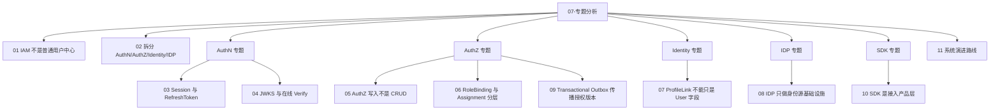

# 07-专题分析

## 本文回答

`07-专题分析/` 是 IAM 文档体系中的 **设计取舍层**。

它不负责重复源码事实，也不负责写面试讲稿，而是集中回答：

```text
为什么 IAM 要这样设计？
为什么不能用更简单的方式？
当前设计解决了什么问题？
它付出了什么代价？
必须守住哪些边界？
后续如何演进？
```

如果说：

```text
00-06 是“当前系统是什么”
```

那么：

```text
07 是“为什么当前系统要这样做”
```

本目录用于支撑架构复盘、设计评审、技术决策说明和面试深挖。

---

## 30 秒结论

`07-专题分析/` 是 IAM 的“为什么型文档”。

它围绕 IAM 的关键设计取舍展开：

```text
为什么 IAM 不是普通用户中心？
为什么拆 AuthN / AuthZ / Identity / IDP？
为什么 AuthN 需要 Session / RefreshToken / JWKS / Verify？
为什么 AuthZ 写入不是 CRUD？
为什么需要 RoleBinding / PolicyVersion / Transactional Outbox？
为什么 ProfileLink 不能只是 User 字段？
为什么 IDP 不直接做登录？
为什么 SDK 是接入产品层？
系统下一步应该如何演进？
```

一句话：

> **专题分析不重复事实层，而是解释事实层背后的设计理由、替代方案、收益代价和必须守住的不变量。**

---

## 本目录文档

当前 `07-专题分析/` 建议包含 11 篇正文文档：

```text
07-专题分析/
├── README.md
├── 01-为什么IAM不是普通用户中心.md
├── 02-为什么拆分AuthN-AuthZ-Identity-IDP.md
├── 03-为什么AuthN需要Session与RefreshToken.md
├── 04-为什么JWKS与在线Verify要并存.md
├── 05-为什么AuthZ写入不是简单CRUD.md
├── 06-为什么RoleBinding与Assignment要分层.md
├── 07-为什么ProfileLink不能只是User字段.md
├── 08-为什么IDP只做身份源基础设施.md
├── 09-为什么需要TransactionalOutbox传播授权版本.md
├── 10-为什么SDK是接入产品层而不是业务层.md
└── 11-系统演进路线.md
```

| 文档 | 核心问题 | 关联事实层 |
|---|---|---|
| `01-为什么IAM不是普通用户中心.md` | IAM 为什么不能只按 User CRUD / 登录系统理解 | `00-概览` |
| `02-为什么拆分AuthN-AuthZ-Identity-IDP.md` | 四个边界为什么不能揉成 UserService | `00-概览`、`01-运行时` |
| `03-为什么AuthN需要Session与RefreshToken.md` | 为什么 JWT 之外还需要 Session 与 RefreshToken | `02-认证AuthN` |
| `04-为什么JWKS与在线Verify要并存.md` | 为什么本地验签和在线状态校验不能互相替代 | `02-认证AuthN`、`05-接入与契约` |
| `05-为什么AuthZ写入不是简单CRUD.md` | 授权写入为什么涉及 facts、version、reload、outbox | `03-授权AuthZ` |
| `06-为什么RoleBinding与Assignment要分层.md` | 对外 wire term 与内部领域语言为什么要区分 | `03-授权AuthZ`、`05-接入与契约` |
| `07-为什么ProfileLink不能只是User字段.md` | User/Profile 多对多关系为什么需要 ProfileLink | `04-身份Identity` |
| `08-为什么IDP只做身份源基础设施.md` | 第三方身份源为什么不直接签发 IAM Token | `02-认证AuthN`、`IDP 源码` |
| `09-为什么需要TransactionalOutbox传播授权版本.md` | 授权版本事件为什么必须 durable outbox | `03-授权AuthZ` |
| `10-为什么SDK是接入产品层而不是业务层.md` | SDK 为什么只封装调用，不定义业务规则 | `05-接入与契约` |
| `11-系统演进路线.md` | IAM 从可用到可治理、可产品化应如何推进 | 全局 |

---

## 专题分析知识地图



---

## 推荐阅读顺序

### 标准顺序

```text
01-为什么IAM不是普通用户中心
  -> 02-为什么拆分AuthN-AuthZ-Identity-IDP
  -> 03-为什么AuthN需要Session与RefreshToken
  -> 04-为什么JWKS与在线Verify要并存
  -> 05-为什么AuthZ写入不是简单CRUD
  -> 06-为什么RoleBinding与Assignment要分层
  -> 07-为什么ProfileLink不能只是User字段
  -> 08-为什么IDP只做身份源基础设施
  -> 09-为什么需要TransactionalOutbox传播授权版本
  -> 10-为什么SDK是接入产品层而不是业务层
  -> 11-系统演进路线
```

原因：

1. 先建立 IAM 的整体定位；
2. 再理解四个核心边界；
3. 再逐个解释 AuthN、AuthZ、Identity、IDP、SDK 的关键取舍；
4. 最后用系统演进路线收束。

---

### 如果你准备面试深挖

推荐优先读：

```text
01-为什么IAM不是普通用户中心.md
03-为什么AuthN需要Session与RefreshToken.md
04-为什么JWKS与在线Verify要并存.md
05-为什么AuthZ写入不是简单CRUD.md
09-为什么需要TransactionalOutbox传播授权版本.md
07-为什么ProfileLink不能只是User字段.md
10-为什么SDK是接入产品层而不是业务层.md
```

这几篇最容易被追问。

---

### 如果你准备架构评审

推荐优先读：

```text
02-为什么拆分AuthN-AuthZ-Identity-IDP.md
05-为什么AuthZ写入不是简单CRUD.md
06-为什么RoleBinding与Assignment要分层.md
08-为什么IDP只做身份源基础设施.md
09-为什么需要TransactionalOutbox传播授权版本.md
11-系统演进路线.md
```

这几篇最适合解释架构边界和工程取舍。

---

### 如果你准备文档发布

推荐优先读：

```text
01-为什么IAM不是普通用户中心.md
02-为什么拆分AuthN-AuthZ-Identity-IDP.md
11-系统演进路线.md
../06-架构护栏/02-文档事实源与防漂移机制.md
```

重点关注：

```text
定位一致性
术语一致性
事实层与专题层不混淆
_archive 不作为当前事实源
```

---

## 专题分析写作模板

每篇专题分析建议使用类似结构：

```text
# 标题

## 本文回答

## 30 秒结论

## 问题背景

## 如果用简单方案会怎样

## 当前设计怎么做

## 替代方案分析

## 当前设计收益

## 当前设计代价

## 必须守住的不变量

## 面试/宣讲讲法

## 常见追问

## 代码证据地图

## 推荐源码阅读路线

## 本文总结
```

不是每篇必须机械套满，但至少要包含：

```text
为什么
当前做法
替代方案
收益代价
不变量
证据链
```

---

## 专题分析与事实层的边界

### 事实层回答

```text
当前系统如何实现？
源码入口在哪里？
接口契约是什么？
运行链路是什么？
```

对应目录：

```text
00-概览
01-运行时
02-认证AuthN
03-授权AuthZ
04-身份Identity
05-接入与契约
06-架构护栏
```

### 专题层回答

```text
为什么要这样实现？
为什么不采用更简单方案？
这个设计的代价是什么？
什么边界不能破？
```

对应目录：

```text
07-专题分析
```

### 表达层回答

```text
如何讲给别人听？
面试如何回答？
技术分享如何组织？
```

对应目录：

```text
08-宣讲
```

不要把三层混在一起。

---

## 专题主题与代码证据入口

| 专题 | 主要代码证据 |
|---|---|
| IAM 不是普通用户中心 | `README.md`、`docs/README.md`、`internal/apiserver/container` |
| 拆分 AuthN/AuthZ/Identity/IDP | `internal/apiserver/container/assembler/authn.go`、`authz.go`、`user.go`、`idp.go` |
| Session 与 RefreshToken | `application/authn/token/issuer.go`、`verifier.go`、`refresher.go`、`domain/authn/session` |
| JWKS 与在线 Verify | `infra/token/jwt`、`infra/token/keyset`、`transport/rest/authn/handler/jwks_public.go`、`token/verifier.go` |
| AuthZ 写入不是 CRUD | `application/authz/policy/committer.go`、`application/authz/uow`、`infra/mysql/uow/authz` |
| RoleBinding 与 Assignment | `domain/authz/model.go`、`domain/authz/rolebinding`、`transport/rest/authz/dto`、`api/grpc/iam/authz/v2/authz.proto` |
| ProfileLink 不是 User 字段 | `domain/uc/user`、`domain/uc/profile`、`domain/uc/profilelink`、`application/uc/profile` |
| IDP 只做基础设施 | `container/assembler/idp.go`、`domain/idp/wechatapp`、`application/authn/login/adapter_wechat_mini.go` |
| Transactional Outbox | `application/authz/shared/version_event.go`、`infra/mysql/eventoutbox`、`infra/messaging/outbox_relay.go` |
| SDK 是接入产品层 | `pkg/sdk/README.md`、`pkg/sdk/client.go`、`pkg/sdk/public_api_compile_test.go` |
| 系统演进路线 | `README.md`、`docs/README.md`、`08-宣讲/*`、`06-架构护栏/*` |

---

## 与其他目录的关系

| 目录 | 关系 |
|---|---|
| `00-概览` | 提供系统定位和总图，专题分析解释为什么不是普通用户中心 |
| `01-运行时` | 提供进程与装配事实，专题分析解释边界设计取舍 |
| `02-认证AuthN` | 提供 AuthN 事实链路，专题分析解释 Session/Refresh/JWKS/Verify |
| `03-授权AuthZ` | 提供 AuthZ 事实链路，专题分析解释写入、RoleBinding、Outbox |
| `04-身份Identity` | 提供 User/Profile/ProfileLink 事实，专题分析解释关系建模取舍 |
| `05-接入与契约` | 提供 REST/gRPC/SDK 事实，专题分析解释 SDK 为什么不是业务层 |
| `06-架构护栏` | 提供护栏事实，专题分析说明为什么必须防漂移 |
| `08-宣讲` | 把专题分析里的设计取舍转成对外表达和面试回答 |
| `_archive` | 只作为历史背景，不能作为当前设计取舍依据 |

---

## 常见误区

### 误区一：专题分析等于事实层文档

错误。  
专题分析不应重复“源码如何运行”，而要回答“为什么这样设计”。

---

### 误区二：专题分析可以脱离源码发挥

错误。  
每篇专题分析都必须能回链源码、契约或测试证据。

---

### 误区三：专题分析只讲优点

错误。  
成熟的设计说明必须讲：

```text
收益
代价
边界
替代方案
不变量
```

---

### 误区四：专题分析可以替代面试稿

不建议。  
专题分析偏深度设计取舍；面试表达应去 `08-宣讲/`。

---

### 误区五：系统演进路线就是 TODO 列表

错误。  
演进路线要讲：

```text
当前基线
优先级
阶段目标
交付物
验证标准
暂缓事项
```

---

## 验证建议

修改专题分析文档后，至少运行：

```bash
make docs-hygiene
```

如果专题中引用了 REST/gRPC/SDK 契约，建议同步运行：

```bash
make docs-swagger
make api-validate
make proto-gen
go test ./pkg/sdk/...
```

如果专题中引用了架构边界，建议运行：

```bash
go test ./internal/pkg/architecture
```

如果专题中引用了业务链路，建议运行对应模块测试：

```bash
go test ./internal/apiserver/application/authn/... \
  ./internal/apiserver/application/authz/... \
  ./internal/apiserver/application/uc/... \
  ./internal/apiserver/application/idp/...
```

---

## 维护规则

### 1. 每篇专题必须回答“为什么”

标题如果是“为什么 X”，正文就必须明确回答：

```text
为什么需要 X
不用 X 会怎样
当前 X 怎么做
X 的代价是什么
X 的边界是什么
```

---

### 2. 不重复事实层正文

如果某段已经变成源码流程说明，应该回到：

```text
02-认证AuthN
03-授权AuthZ
04-身份Identity
05-接入与契约
```

专题里只保留必要证据。

---

### 3. 必须写替代方案

每篇专题至少应该比较一种替代方案：

```text
简单 CRUD
纯 JWT
只用 JWKS
直接 MQ publish
IDP 直接签 token
SDK 做厚业务层
```

---

### 4. 必须写不变量

专题分析必须沉淀可维护边界，例如：

```text
IDP 不签 IAM token
AuthZ 不验证登录凭证
ProfileLink 不等于 AuthZ Permission
SDK 不定义业务规则
Outbox 是 at-least-once
```

---

### 5. 不从 `_archive` 复制当前设计依据

历史材料可以帮助理解演进，但当前设计依据必须来自：

```text
源码
机器契约
测试
当前维护文档
```

---

## 本文总结

`07-专题分析/` 解释的是 IAM 的设计取舍。

核心心智是：

```text
00-06 讲事实
07 讲为什么
08 讲怎么表达
```

读完本目录后，读者应该能回答：

```text
为什么 IAM 不是普通用户中心？
为什么 AuthN/AuthZ/Identity/IDP 要拆开？
为什么 AuthN 需要 Session/Refresh/JWKS/Verify？
为什么 AuthZ 写入不是 CRUD？
为什么 ProfileLink 不能只是 User 字段？
为什么 IDP 不直接做登录？
为什么 SDK 不是业务层？
为什么授权版本传播需要 Transactional Outbox？
系统下一步该如何演进？
```

如果只记一句话：

> **专题分析是 IAM 的设计取舍索引，用来解释当前系统为什么这样做、它解决了什么问题、付出了什么代价，以及哪些边界必须长期守住。**
