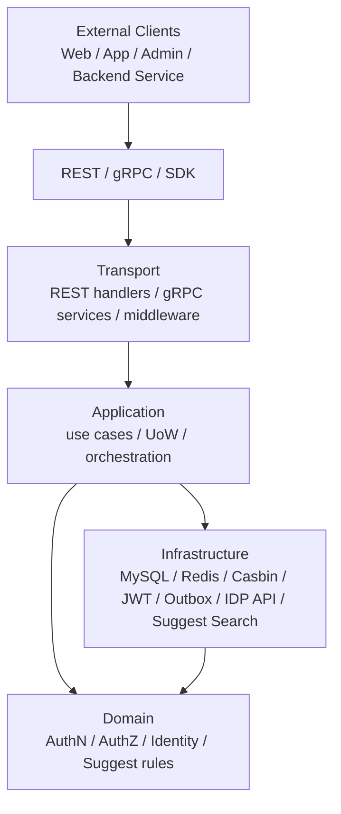
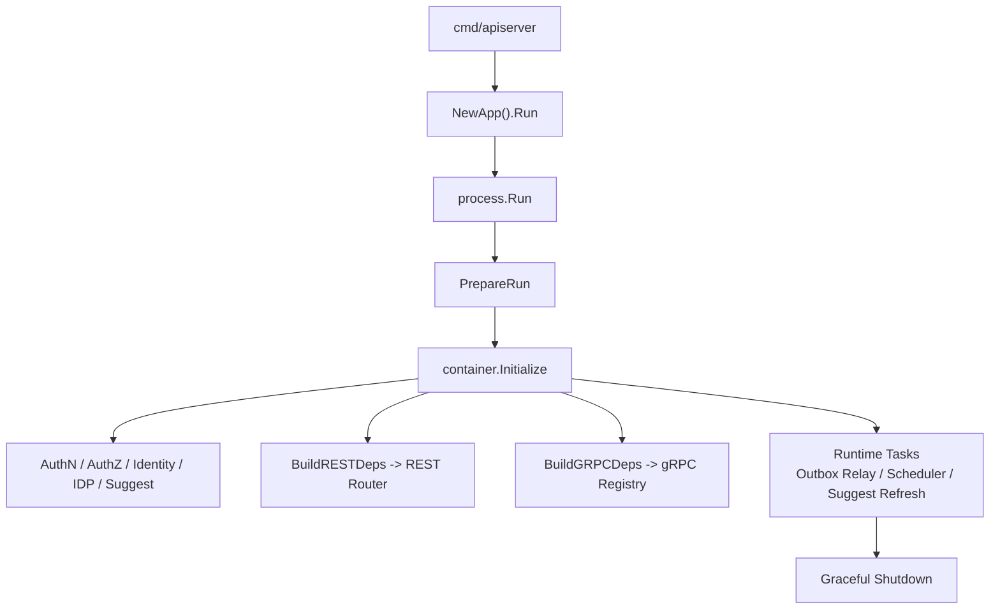
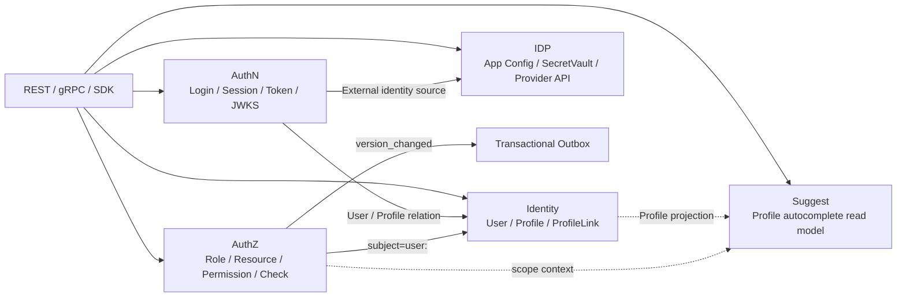
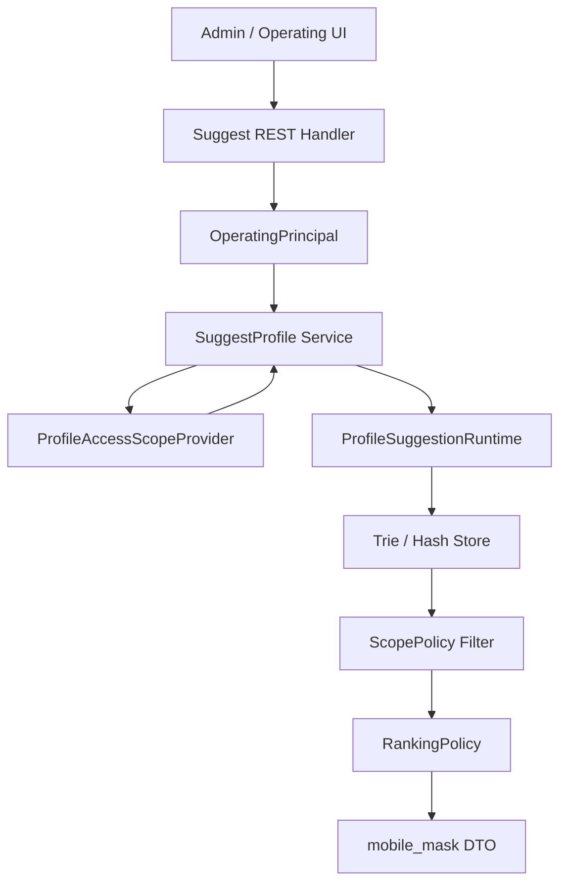
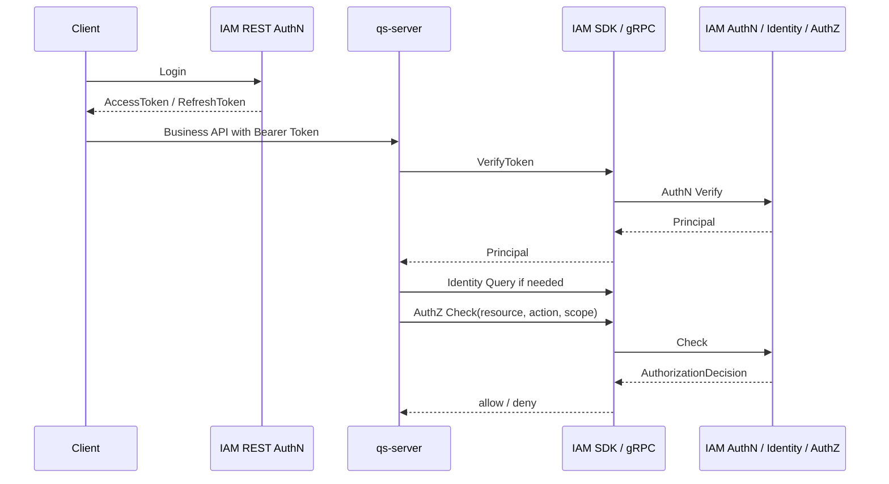

# 02-系统架构讲法

## 1. 本文定位

本文是 `07-宣讲/` 中用于对外讲解 IAM 系统架构的表达材料。

它不替代：

```text
00-概览；
01-运行时；
02-认证AuthN；
03-授权AuthZ；
04-身份Identity；
05-接入与契约；
06-架构护栏；
08-Suggest。
```

事实层文档负责解释源码结构、运行机制、接口契约、辅助读模型和架构护栏。

本文负责回答：

```text
面试或技术分享中，IAM 架构应该怎么讲？
先讲什么，后讲什么？
如何从业务问题过渡到架构设计？
白板图怎么画？
怎么讲出设计取舍，而不是只背目录？
Suggest 这种辅助读模型应该放在架构讲法的什么位置？
被追问时，如何回到源码、契约、测试和文档证据？
```

一句话：

> 本文负责把 IAM 的事实层架构，整理成一套能面试、能白板、能技术分享、能被追问的架构表达；其中 Suggest 作为 iam-apiserver 内置的 Profile 联想搜索辅助读模型讲解，不讲成 IAM 核心身份域、完整搜索服务或 AuthZ 权限中心。

---

## 2. 架构一句话

最推荐说法：

```text
IAM 采用分层 + 六边形架构组织：外部通过 REST/gRPC/SDK 接入，Transport 层负责协议适配，Application 层编排 AuthN、AuthZ、Identity、IDP、Suggest 等用例和事务边界，Domain 层承载认证、授权、身份关系和辅助读模型规则，Infra 层适配 MySQL、Redis、Casbin、JWT、Outbox、第三方身份源、Suggest Trie/Hash 索引运行时等外部资源，Container 作为组合根负责模块装配，Process 负责服务生命周期。
```

更短版：

```text
IAM 的架构核心是：Transport 只做协议适配，Application 编排用例，Domain 承载业务规则，Infra 适配外部资源，Container 负责装配，Process 负责生命周期；Suggest 作为辅助读模型被装配在 iam-apiserver 内，服务后台 Profile autocomplete。
```

再短一点：

```text
IAM 用分层和六边形架构，把协议、用例、领域规则、基础设施和运行时装配拆开，让 AuthN、AuthZ、Identity、IDP 可以独立演进，并通过 Suggest 辅助读模型支持管理端 Profile 联想搜索。
```

注意讲法边界：

```text
AuthN / AuthZ / Identity / IDP 是 IAM 主线能力；
Suggest 是辅助读模型和工程亮点；
不要把 IAM 讲成 AuthN / AuthZ / Identity / IDP / Suggest 五大核心身份域。
```

---

## 3. 30 秒讲法

```text
IAM 整体采用分层和六边形架构。外部通过 REST、gRPC、Go SDK 接入；Transport 层只做协议适配、参数绑定和错误映射；Application 层编排登录、Token Verify、AuthZ Check、ProfileLink、Suggest Profile 查询与索引刷新等用例；Domain 层承载 Session、RoleBinding、Permission、ProfileLink、ProfileAccessScope 等领域规则；Infra 层适配 MySQL、Redis、Casbin、JWT、Outbox、第三方身份源以及 Suggest 的 Trie/Hash 搜索索引。运行时上，process 负责服务生命周期，container 作为组合根装配 AuthN、AuthZ、Identity、IDP 和 Suggest 等模块，并把能力投影给 REST/gRPC/SDK 接入面和 runtime tasks。
```

适合场景：

```text
面试官问“整体架构是什么”；
技术分享中快速铺垫；
白板图前的口头说明。
```

如果时间很短，Suggest 只补一句：

```text
另外，IAM 内置了一个 Suggest 辅助读模型，用于后台 Profile autocomplete，解决权限过滤、索引刷新和手机号安全问题。
```

---

## 4. 1 分钟讲法

```text
IAM 的系统架构可以从两个维度讲：纵向分层和横向模块。

纵向分层上，最外层是 REST/gRPC/SDK 接入。REST 和 gRPC 属于 Transport 层，只负责协议适配、认证中间件、DTO/proto 转换和错误映射；Application 层负责用例编排和事务边界，比如登录、刷新 Token、VerifyToken、AuthZ Check、授权写入、ProfileLink 操作，以及 Suggest 的 Profile 查询和索引刷新；Domain 层负责业务规则，比如 Session 是否 active、Permission 是否覆盖某个 action、RoleBinding 是否有效、ProfileLink 是否重复、ProfileAccessScope 如何过滤候选；Infra 层负责 MySQL、Redis、Casbin、JWT、Outbox、微信/企微 API、Suggest Trie/Hash/Runtime 等外部资源适配。

横向模块上，IAM 主线拆成 AuthN、AuthZ、Identity、IDP。AuthN 管认证态，AuthZ 管访问权，Identity 管 User/Profile/ProfileLink，IDP 管外部身份源。同时 iam-apiserver 内置 Suggest 辅助读模型，服务 operating 后台 Profile autocomplete。运行时由 process 管生命周期，container 作为组合根装配各模块，并把模块能力投影给 REST、gRPC、runtime tasks 和 SDK 接入。
```

适合场景：

```text
面试项目架构介绍；
技术分享架构部分；
回答“你怎么组织这个系统”。
```

---

## 5. 3 分钟讲法

```text
我讲 IAM 架构时，会先从外部接入讲起。

IAM 的调用方包括前端、管理后台、qs-server、collection-server、qs-worker 等业务系统和内部服务。不同调用方通过 REST、gRPC、Go SDK 接入 IAM：REST 面向前端和管理端，gRPC 面向服务间调用，SDK 面向 Go 服务端项目。这里 REST/gRPC/SDK 不是三套业务逻辑，而是同一套 IAM 能力的三种接入投影。管理后台的 Profile 联想搜索走 Suggest REST，本质上也是 IAM 能力的一个 HTTP 投影。

请求进入 IAM 后，首先到 Transport 层。REST handler 和 gRPC service 只做协议适配，比如参数绑定、认证中间件、DTO/proto mapper、错误映射和路由/service 注册。Transport 不直接操作数据库，不直接调用 Casbin，不直接签发 Token，也不直接写 Outbox。比如 Suggest REST handler 也只负责 query 参数、OperatingPrincipal 提取、限流和调用 application service，不直接理解 Trie/Hash 或权限细节。

真正的业务用例进入 Application 层。Application 层负责编排用例和事务边界。比如 AuthN 登录链路会编排 LoginIdentity、Credential、Challenge、Principal、Session 和 Token 签发；AuthZ 写入链路会通过 PolicyChangeCommitter 在 UoW 里写管理事实、运行时 facts、递增 PolicyVersion，并 stage Outbox event；Identity 链路会编排 User、Profile、ProfileLink 的创建、查询和关系维护；Suggest 链路会编排 OperatingPrincipal、ProfileAccessScopeProvider、ProfileSuggestionRuntime、搜索策略、RateLimiter、Metrics 和 DegradedService。

Domain 层承载业务规则。比如 AuthN 里 Session 是否 active，AuthZ 里 Role、Resource、Permission、RoleBinding、Scope 的不变量，Identity 里 ProfileLink 的 relation、active/revoked 和唯一性规则。Suggest 里则有 Keyword、Query、ProfileSearchTerm、ProfileAccessScope、ScopePolicy、RankingPolicy、mobile_mask 等读模型和安全规则。这一层不依赖 MySQL、Redis、Casbin、REST、gRPC 或 proto。

Infra 层负责所有外部资源适配，比如 MySQL repository、Redis session/token store、Casbin runtime adapter、JWT/JWKS/keyset、Transactional Outbox、微信/企微 API 和 SecretVault。Suggest 的 Trie/Hash/Runtime、MySQL Loader、SnapshotWriter、Metrics、RateLimiter 也属于 infra 或运行时适配。这样领域层面对的是端口和领域语言，技术实现可以隔离在 infra。

运行时装配上，process 负责服务生命周期：加载配置、准备资源、初始化 container、注册 REST/gRPC、启动后台任务和优雅关闭。container 作为组合根装配 AuthN、AuthZ、Identity、IDP、Suggest 等模块，并暴露 typed deps 给 REST/gRPC/runtime tasks。业务代码不会在请求处理中随意到 container 里取对象，因此它不是传统 Service Locator 式的隐式依赖。

这个架构最关键的取舍是：我没有让 handler 直接操作数据库，也没有让 application 直接依赖 transport 或 concrete infra，而是通过分层、typed deps、UoW、ports/adapters 和架构测试保护边界。Suggest 也没有做成一个“大搜索中心”：它暂时留在 IAM 内，作为 Profile autocomplete 辅助读模型，只消费 ProfileAccessScope 做过滤，不逐条调用完整 AuthZ，也不返回明文手机号。代价是结构比简单 CRUD 更复杂，但收益是 AuthN、AuthZ、Identity、IDP、Suggest、REST/gRPC/SDK 可以长期演进，不容易变成大 UserService。
```

适合场景：

```text
面试深聊前的完整架构铺垫；
技术分享架构章节；
架构答辩主线。
```

---

## 6. 推荐讲解顺序

不要一上来讲目录。

推荐顺序：

```text
1. 先讲系统定位；
2. 再讲外部接入；
3. 再讲纵向分层；
4. 再讲横向模块；
5. 再讲运行时装配；
6. 再讲辅助读模型；
7. 再讲关键设计取舍；
8. 最后讲架构护栏和证据链。
```

### 6.1 系统定位

```text
IAM 是面向业务系统接入的身份与访问管理服务，不是普通用户中心。
```

### 6.2 外部接入

```text
前端和管理端走 REST，后端服务间调用走 gRPC，Go 服务端通过 SDK 接入；管理端 Profile autocomplete 走 Suggest REST。
```

### 6.3 纵向分层

```text
Transport -> Application -> Domain -> Infra
```

### 6.4 横向模块

```text
AuthN / AuthZ / Identity / IDP 是主线模块；Suggest 是辅助读模型模块。
```

### 6.5 运行时装配

```text
process 管生命周期，container 管模块装配。
```

### 6.6 辅助读模型

```text
Suggest 服务 operating 后台 Profile autocomplete，通过 ProfileAccessScope 过滤可见范围，通过 Trie/Hash/Runtime 支持高频查询，通过 Full/Delta refresh 维护索引。
```

### 6.7 关键设计取舍

```text
Session + AccessToken + RefreshToken；
PolicyChange + UoW + Outbox；
User / Profile / ProfileLink；
IDP 与 AuthN 分离；
REST / gRPC / SDK 分层接入；
Suggest 留在 IAM 内而不是拆独立服务；
Suggest 用读模型索引而不是每次直接 MySQL 查询；
Suggest 消费 ProfileAccessScope 而不是逐条 AuthZ Check。
```

### 6.8 架构护栏

```text
architecture tests；
contract tests；
SDK public API compile test；
Suggest REST / domain / application / infra tests；
docs-hygiene。
```

---

## 7. 白板图讲法

画图时不要一开始画所有源码目录。

先画主链路：

```text
External Clients
  -> REST / gRPC / SDK
  -> Transport
  -> Application
  -> Domain
  -> Infra
  -> MySQL / Redis / Casbin / JWT / Outbox / IDP API / Suggest Search Runtime
```

---

### 7.1 白板图一：分层主图



讲图时说：

```text
这张图表达纵向分层。请求从外部接入进入 Transport，Transport 不写业务规则，只调用 Application。Application 编排用例和事务，Domain 承载业务规则，Infra 负责外部资源适配。依赖方向的核心是业务规则向内，技术实现向外。Suggest 也遵守这个边界：REST handler 不直接查索引，application 负责编排，domain 表达 ProfileAccessScope 和 ranking 规则，infra 承载 Trie/Hash/Runtime。
```

---

### 7.2 白板图二：运行时装配图



讲图时说：

```text
运行时上，cmd/apiserver 只是入口，真正生命周期由 process 管。process 准备配置、数据库、Redis、EventBus、container，再注册 REST/gRPC，启动后台任务并处理优雅关闭。container 只负责组合依赖，不承载请求级业务逻辑。Suggest 的 Runtime、Full/Delta Refresher、RateLimiter、Metrics 和 DegradedService 也在这个阶段被装配。
```

---

### 7.3 白板图三：模块边界图



讲图时说：

```text
横向模块上，IAM 主线拆成 AuthN、AuthZ、Identity、IDP。AuthN 管认证态，AuthZ 管访问权，Identity 管用户和业务档案关系，IDP 管外部身份源基础设施。Suggest 是辅助读模型，使用 Profile 投影出的 ProfileSearchTerm 和权限侧解析出的 ProfileAccessScope，服务后台 autocomplete。它不是完整搜索服务，也不是 AuthZ 权限中心。
```

---

### 7.4 白板图四：Suggest 查询链路图



讲图时说：

```text
这张图说明 Suggest 为什么不是简单 SQL 查询。请求进来后先得到当前 operating 用户，再解析 ProfileAccessScope，然后从 Runtime 当前索引中用 Trie/Hash 召回候选，先做 scope filter，再排序和返回 mobile_mask。这样可以兼顾 autocomplete 性能、数据权限和手机号安全。
```

---

### 7.5 白板图五：qs-server 接入图



讲图时说：

```text
这张图说明 IAM 不是孤立系统，而是给业务系统接入。前端到 IAM 登录，业务请求进入 qs-server，qs-server 通过 SDK/gRPC 验 Token、查身份、做 AuthZ Check，不复制 IAM 的账号、角色和权限表。
```

---

## 8. 架构亮点讲法

### 8.1 亮点一：分层边界清楚

推荐说法：

```text
Handler 不直接操作数据库，Application 不直接依赖 Transport，Domain 不依赖 Infra，Infra 只做外部资源适配。
```

展开：

```text
比如 AuthZ 写入时，REST handler 只负责 DTO 和调用 application；application 通过 PolicyChangeCommitter 编排 UoW；domain 生成 PolicyChange；infra 才负责写 casbin_rule、policy_versions 和 outbox。Suggest 也一样：handler 不直接操作 Trie/Hash，application 编排查询与刷新，domain 表达 scope 和 ranking，infra/search 负责具体索引实现。
```

---

### 8.2 亮点二：横向模块拆分合理

推荐说法：

```text
AuthN、AuthZ、Identity、IDP 分别回答认证态、访问权、身份关系和外部身份源四类问题；Suggest 作为辅助读模型回答 operating 后台如何快速搜索可见 Profile。
```

展开：

```text
如果合成一个 UserService，登录、权限、档案关系、微信/企微 AppSecret、Token 签发、Profile autocomplete 都会混在一起。拆分后，每个模块都有清楚职责和事实源。
```

---

### 8.3 亮点三：运行时装配可控

推荐说法：

```text
process 负责生命周期，container 作为组合根通过 typed deps 初始化各模块，并把模块能力投影给 REST/gRPC/runtime tasks。
```

展开：

```text
这样 transport 不需要知道 container 内部结构，只消费显式 deps；gRPC 也通过 registrations 注册服务。请求处理中不鼓励业务代码到 container 里随便取对象。Suggest 的 Runtime、Refresher、RateLimiter、Metrics、DegradedService 也通过组合根装配，而不是在 handler 中临时创建。
```

---

### 8.4 亮点四：关键写入链路有一致性设计

推荐说法：

```text
AuthZ 写入不是 CRUD，而是 UoW + PolicyVersion + Transactional Outbox + RuntimeReload。
```

展开：

```text
这保证授权管理事实、运行时 facts、版本和事件记录同事务提交，后续由 relay 可靠发布版本变化，运行时再按版本刷新。
```

---

### 8.5 亮点五：辅助读模型兼顾性能和安全

推荐说法：

```text
Suggest 不是直接查 MySQL，也不是完整搜索服务，而是内置的 Profile 联想搜索读模型，通过 Trie/Hash 支持高频 autocomplete，通过 ProfileAccessScope 过滤可见范围，通过 mobile_mask、限流、指标和降级保护安全与稳定性。
```

展开：

```text
管理后台输入姓名、拼音、简拼、ProfileID 或手机号形态关键词时，Suggest 会先根据 OperatingPrincipal 解析 ProfileAccessScope，再从 Runtime 当前索引里召回候选，先过滤再排序。手机号搜索需要额外授权，响应只返回 mobile_mask；索引不可用时可以降级为空结果，不拖垮 AuthN/AuthZ/Identity 主链路。
```

---

### 8.6 亮点六：有架构护栏

推荐说法：

```text
项目用测试保护架构边界，而不是只靠开发约定。
```

展开：

```text
比如 domain 不能依赖 infra，application 不能依赖 transport，Casbin facts 不能进入 domain，SDK 不 import internal，SDK public API 通过 compile test 固定，文档通过 docs-hygiene 防止旧路径和旧术语回流。Suggest 也有专门的防漂移边界：不能绕过 ProfileAccessScope，不能返回明文 mobile，不能把 tenant_id 当 org_id，不能把 Suggest 写成 AuthZ 中心。
```

---

## 9. 面试回答模板

### Q1：你这个项目整体架构是什么？

```text
整体是分层 + 六边形架构。外部通过 REST/gRPC/SDK 接入，Transport 层负责协议适配，Application 层负责编排用例和事务，Domain 层承载认证、授权、身份关系和辅助读模型规则，Infra 层适配 MySQL、Redis、Casbin、JWT、Outbox、第三方身份源和 Suggest 搜索索引。运行时上由 process 管理生命周期，container 作为组合根装配 AuthN、AuthZ、Identity、IDP、Suggest 等模块，并把能力投影给 REST/gRPC。
```

---

### Q2：为什么要这么分层？

```text
因为 IAM 不是简单 CRUD，它同时处理登录态、Token、授权判定、用户档案关系、第三方身份源、Profile autocomplete 和业务系统接入。如果 handler 直接写数据库，或者 application 直接依赖 infra，很快会变成大泥球。分层后，协议、用例、领域规则和基础设施可以独立演进，也方便测试和替换。
```

---

### Q3：你的架构和 MVC 有什么区别？

```text
MVC 更偏表现层组织方式，而这里更强调六边形架构和依赖方向。REST/gRPC 是外部适配器，MySQL、Redis、Casbin、JWT、Outbox、第三方身份源、Suggest 搜索索引是基础设施适配器，中间的 Application/Domain 才是业务核心。核心逻辑不依赖具体协议和外部资源实现。
```

---

### Q4：Container 是不是 Service Locator？

```text
我这里的 container 更接近 composition root。它负责初始化模块和组装依赖，但请求处理过程中不会让业务代码到 container 里随便取对象。REST router 和 gRPC registry 消费的是 container 投影出来的 typed deps 或 registrations，这样能避免 Service Locator 式的隐式依赖。
```

---

### Q5：为什么要有 process 层？

```text
process 层负责进程生命周期：配置准备、资源初始化、container 初始化、REST/gRPC 注册、后台任务启动和 graceful shutdown。这样 main 函数不会变成上帝函数，container 也不会承担进程生命周期职责。像 Outbox relay、AuthZ policy sync、Suggest Full/Delta refresh 这种后台任务也需要被纳入统一生命周期。
```

---

### Q6：你的领域层怎么保证不依赖基础设施？

```text
代码上通过端口和仓储接口隔离，infra 负责实现；测试上有 architecture tests，检查 domain 不依赖 infra/database，application 不依赖 transport/infra，Casbin facts 不能进入 domain。这些测试相当于架构护栏。
```

---

### Q7：架构最大亮点是什么？

```text
我觉得最大亮点不是用了某个框架，而是边界比较清楚，并且用测试固化边界。比如 AuthN/AuthZ/Identity/IDP 四个主线模块拆分清楚，AuthZ 写入用 UoW + Outbox 保证事实和事件一致，接入层通过 REST/gRPC/SDK 产品化；同时内置 Suggest 辅助读模型处理后台 Profile autocomplete，并解决权限过滤、手机号安全、索引刷新和降级。整体用架构测试和契约测试防止后续演进中退回大泥球。
```

---

### Q8：为什么 Suggest 不拆成独立服务？

```text
从领域上讲，Suggest 不是 IAM 的核心身份域，独立成服务也有道理。但当前规模下，独立服务会带来部署、鉴权、数据同步、观测和运维成本。它暂时留在 iam-apiserver 内，作为 Profile 联想搜索读模型，复用 IAM 的认证和授权上下文。边界上我限制它只消费 ProfileAccessScope，不承载完整 AuthZ；索引不可用时可以降级为空结果，避免影响 AuthN/AuthZ/Identity 主链路。
```

---

### Q9：为什么 Suggest 不直接查 MySQL？

```text
Suggest 是高频 autocomplete 接口，还要支持中文名、拼音、简拼、ProfileID、手机号精确匹配。如果每次都直接查 MySQL，再叠加权限过滤、排序和手机号安全，延迟和数据库压力都不好控制。所以我把它做成读模型：Loader 把 Profile 投影为 ProfileSearchTerm，Runtime 维护 Trie/Hash 索引，查询时先召回再用 ProfileAccessScope 过滤，最后排序和脱敏返回。
```

---

## 10. 架构讲法中的证据链

| 你讲的点 | 可以回链的证据 |
| --- | --- |
| IAM 不是普通用户中心 | `docs/00-概览`、`docs/07-宣讲/00-项目一句话定位.md` |
| 运行时由 process 管生命周期 | `docs/01-运行时`、`process` 相关源码 |
| container 是组合根 | `docs/01-运行时`、`internal/apiserver/container` |
| REST/gRPC/SDK 是三种接入投影 | `docs/05-接入与契约`、`api/rest`、`api/grpc`、`pkg/sdk` |
| AuthN 模块职责 | `docs/02-认证AuthN` |
| AuthZ 模块职责 | `docs/03-授权AuthZ` |
| Identity 模块职责 | `docs/04-身份Identity` |
| Suggest 辅助读模型 | `docs/08-Suggest`、`api/rest/suggest.v2.yaml`、`application/suggest`、`domain/suggest`、`infra/suggest` |
| Suggest REST 查询链路 | `docs/08-Suggest/01-查询链路-SuggestProfile从请求到索引过滤.md`、`transport/rest/suggest` |
| Suggest 权限范围 | `docs/08-Suggest/02-权限范围-OperatingPrincipal与ProfileAccessScope.md`、`domain/suggest/scope.go` |
| Suggest 索引模型 | `docs/08-Suggest/03-索引模型-ProfileSearchTerm-Trie-Hash-Runtime.md`、`infra/suggest/search` |
| 架构护栏 | `docs/06-架构护栏`、`internal/pkg/architecture` |
| REST 契约护栏 | `router_matrix_test.go`、`scripts/check-route-contracts.py` |
| gRPC 契约护栏 | `proto_contract_test.go` |
| SDK 公开 API 护栏 | `pkg/sdk/public_api_compile_test.go` |

注意：证据链要回到当前事实层，不要回到已归档的专题分析。

---

## 11. 不推荐的架构讲法

### 11.1 一上来讲目录

```text
项目里有 cmd、internal、pkg、docs、api……
```

问题：

```text
这是文件结构，不是架构。
```

推荐改成：

```text
先讲请求链路、分层、模块边界和依赖方向，再讲目录如何承载这些层次。
```

---

### 11.2 只说“用了六边形架构”

```text
我用了六边形架构。
```

问题：

```text
太空，面试官会追问你哪里体现六边形。
```

推荐补一句：

```text
REST/gRPC 是外部适配器，MySQL/Redis/Casbin/JWT/Outbox/IDP API/Suggest Search 是基础设施适配器，Application/Domain 在中间，业务规则不依赖协议和基础设施实现。
```

---

### 11.3 把 container 讲成业务层

```text
container 负责业务逻辑。
```

问题：

```text
错误。container 是组合根，不处理请求，不写业务规则。
```

正确说法：

```text
container 负责装配模块和投影能力，业务逻辑在 application/domain。
```

---

### 11.4 把 infra 讲成工具包

```text
infra 就是工具类。
```

问题：

```text
infra 是适配器层，承载 MySQL、Redis、Casbin、JWT、Outbox、第三方身份源、Suggest Search Runtime 等外部资源实现，不只是 utils。
```

---

### 11.5 忽略架构护栏

```text
我们约定 domain 不依赖 infra。
```

问题：

```text
只靠约定不够。
```

推荐说：

```text
项目用 architecture tests 检查依赖方向，防止边界回退。
```

---

### 11.6 把规划能力说成已完成能力

```text
我们已经有完整企业级 IAM 平台能力。
```

问题：

```text
过度包装，容易被追问打穿。
```

推荐说：

```text
当前项目实现了 IAM 的核心认证、授权、身份关系和接入链路，并保留了继续扩展多 IDP、多租户治理和管理后台能力的架构空间；Suggest 当前作为内置辅助读模型服务后台 Profile autocomplete，不是独立搜索平台。
```

---

### 11.7 把 Suggest 讲成核心身份域

```text
IAM 有 AuthN、AuthZ、Identity、IDP、Suggest 五大核心域。
```

问题：

```text
不准确。Suggest 是辅助读模型，不是核心身份域。
```

正确说法：

```text
IAM 主线能力是 AuthN/AuthZ/Identity/IDP，同时内置 Suggest 辅助读模型服务管理后台 Profile autocomplete。
```

---

### 11.8 把 Suggest 讲成完整搜索服务

```text
IAM 内置了一个搜索服务。
```

问题：

```text
容易被理解成全文检索、搜索平台或独立搜索服务。
```

正确说法：

```text
Suggest 是 Profile 联想搜索读模型，面向 operating 后台 autocomplete，主要解决候选召回、权限过滤、手机号安全和低延迟查询。
```

---

### 11.9 把 Suggest 讲成 AuthZ 权限中心

```text
Suggest 负责判断用户能不能看 Profile。
```

问题：

```text
不准确。Suggest 只消费已经解析出的 ProfileAccessScope 做过滤。
```

正确说法：

```text
权限侧或可见性侧解析 ProfileAccessScope，Suggest Store 只做 scope filter，不逐条执行完整 AuthZ Check。
```

---

## 12. 系统架构与业务模块的衔接

讲完分层后，要自然转到业务模块。

推荐衔接句：

```text
在这个分层架构里，横向业务模块主要是 AuthN、AuthZ、Identity 和 IDP。它们不是独立微服务，而是在同一个 iam-apiserver 中通过 container 组装出来的模块边界。每个模块都有自己的 domain/application/infra 组织方式，并通过 REST/gRPC/SDK 对外暴露能力。除此之外，IAM 内还装配了 Suggest 辅助读模型，服务管理端 Profile autocomplete，但它不是 IAM 的核心身份域。
```

然后展开：

```text
AuthN 负责认证态；
AuthZ 负责访问权；
Identity 负责身份和档案关系；
IDP 负责第三方身份源基础设施；
Suggest 负责后台 Profile 联想搜索读模型。
```

---

## 13. 系统架构与技术亮点的衔接

讲完架构后，可以自然引出亮点。

推荐衔接句：

```text
这套架构不是为了套模式，而是为了解决 IAM 的几个核心复杂点：登录态管理、授权一致性、身份关系建模、第三方身份源隔离、业务系统接入，以及后台 Profile autocomplete 这种高频辅助查询的安全和性能问题。
```

然后展开：

```text
Session + AccessToken + RefreshToken + JWKS / Verify；
PolicyChange + UoW + PolicyVersion + Outbox；
User / Profile / ProfileLink；
IDP 与 AuthN 分离；
REST / gRPC / SDK；
Suggest ProfileAccessScope + Trie/Hash + Full/Delta refresh + mobile_mask；
architecture tests / contract tests。
```

---

## 14. 简历项目描述版本

```text
负责设计并实现 IAM 身份与访问管理服务，采用分层与六边形架构组织代码：通过 process 管理服务生命周期，container 作为组合根装配 AuthN、AuthZ、Identity、IDP、Suggest 等模块，REST/gRPC 作为协议适配层，Application 层编排登录、授权、ProfileLink、Profile suggest 等用例，Domain 层承载认证、授权、身份关系和辅助读模型规则，Infra 层适配 MySQL、Redis、Casbin、JWT、Transactional Outbox、第三方身份源和 Suggest Trie/Hash 搜索索引。系统对外提供 REST/gRPC/SDK 接入，并通过架构测试和契约测试保护模块边界。
```

更保守、更适合简历的一版：

```text
负责设计并实现 IAM 身份与访问管理服务，采用分层与六边形架构组织 AuthN、AuthZ、Identity、IDP 等核心模块，并内置 Suggest 辅助读模型支持管理后台 Profile 联想搜索；系统对外提供 REST/gRPC/SDK 接入，Infra 层适配 MySQL、Redis、Casbin、JWT、Transactional Outbox 和第三方身份源，并通过架构测试和契约测试保护模块边界。
```

可以按真实贡献再压缩。

不要把还没完成的能力写成已完成。

---

## 15. 30 分钟分享中的位置

如果做 30 分钟技术分享，架构部分建议占：

```text
5～7 分钟
```

结构：

```text
1 分钟：系统定位；
2 分钟：纵向分层；
2 分钟：横向模块；
1 分钟：运行时装配；
1 分钟：辅助读模型与架构护栏。
```

Suggest 不建议在架构部分占太多时间。

更合适的讲法是：

```text
系统架构章节：30 秒说明它是内置辅助读模型；
接入章节：30 秒说明 Suggest REST 服务管理端 autocomplete；
工程质量章节：30 秒说明权限过滤、手机号安全、限流、指标和降级护栏。
```

不要在架构部分深入所有业务细节。

业务细节留给后面的 AuthN、AuthZ、Identity、接入、Suggest 追问和工程护栏章节。

---

## 16. 本文总结

系统架构讲法的核心不是：

```text
我用了哪些目录；
我用了哪些框架；
我用了哪些中间件。
```

而是回答：

```text
这个系统如何隔离协议、用例、领域规则和基础设施？
这个系统如何装配 AuthN/AuthZ/Identity/IDP？
这个系统如何接纳 Suggest 这种辅助读模型，而不破坏主线边界？
这个系统如何对外提供 REST/gRPC/SDK？
这个系统如何防止长期演进中边界腐烂？
```

最推荐的架构表达：

```text
IAM 采用分层 + 六边形架构。外部通过 REST/gRPC/SDK 接入，Transport 只做协议适配，Application 编排用例和事务，Domain 承载认证、授权、身份关系和辅助读模型规则，Infra 适配 MySQL、Redis、Casbin、JWT、Outbox、第三方身份源和 Suggest 搜索索引。运行时由 process 管生命周期，container 作为组合根装配 AuthN、AuthZ、Identity、IDP、Suggest 等模块，并通过架构测试和契约测试保护边界。
```

如果只记住一句话：

```text
IAM 的架构讲法不是背目录，而是讲清：外部如何接入，内部如何分层，主线模块如何拆分，辅助读模型如何被纳入但不越界，运行时如何装配，边界如何被测试保护。
```
