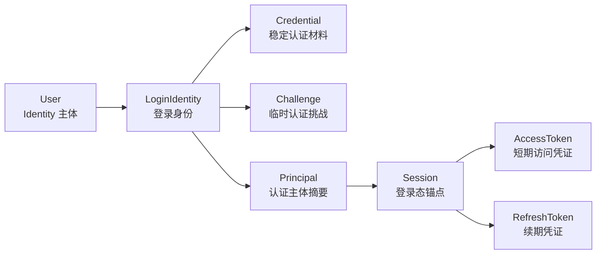
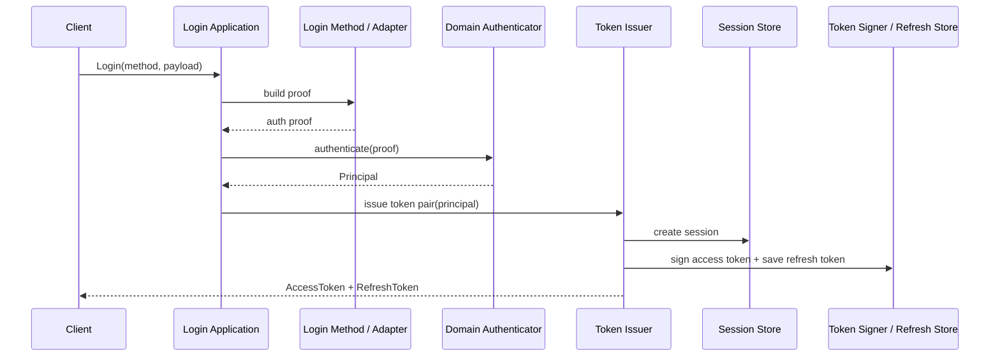
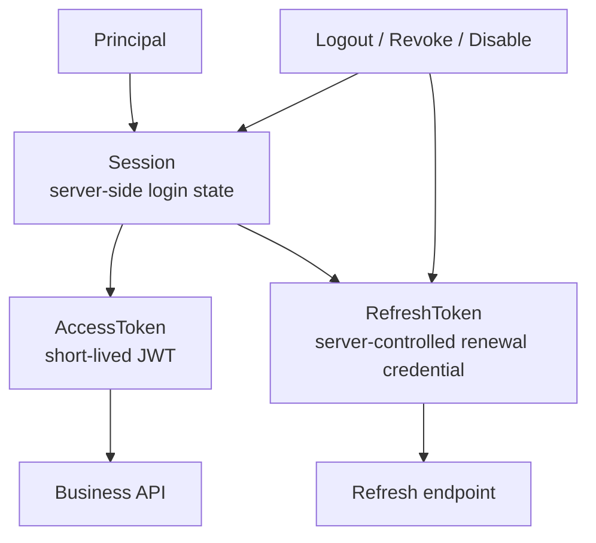
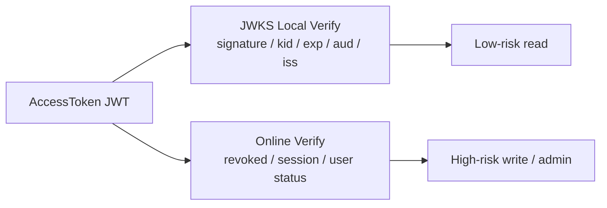

# 03-AuthN 认证体系讲法

## 1. 本文定位

本文是 `07-宣讲/` 中用于对外讲解 IAM AuthN 认证体系的表达材料。

它不替代 `docs/02-认证AuthN/` 下的事实层文档，也不替代源码。

事实层文档负责回答：

```text
AuthN 模型是什么；
Onboarding / Linking / Login / Token / Session / JWKS 链路如何实现；
事实源在哪里。
```

本文负责回答：

```text
面试或技术分享中，AuthN 应该怎么讲？
为什么 AuthN 不是简单“查用户 + 发 JWT”？
如何讲清 User、LoginIdentity、Credential、Challenge 的关系？
登录请求如何变成 Principal？
Principal 如何变成 AccessToken / RefreshToken？
Session、AccessToken、RefreshToken 的边界是什么？
JWKS 本地验签和在线 Verify 为什么要并存？
AuthN 和 Identity / IDP / AuthZ / SDK 如何协作？
```

一句话：

> 本文负责把 AuthN 的事实层设计，整理成一套能面试、能白板、能技术分享、能被追问的认证体系表达。

---

## 2. AuthN 一句话

最推荐说法：

```text
AuthN 是 IAM 的认证体系，负责把不同登录方式提交的证明材料统一转换成 Principal，并通过 Session、AccessToken、RefreshToken、JWKS 和在线 Verify 管理登录态与凭证生命周期。
```

更短版：

```text
AuthN 负责回答“你是谁、你如何证明、这次登录态现在是否仍然有效”。
```

再短一点：

```text
AuthN 不是发 JWT，而是管理认证证明、登录态和 Token 生命周期。
```

---

## 3. 30 秒讲法

```text
IAM 的 AuthN 不是简单登录接口，而是一套认证与登录态管理体系。它先通过 LoginIdentity、Credential、Challenge 等模型表达“谁用什么方式证明自己”，登录成功后产出 Principal；然后通过 Session 建立服务端可控的登录态锚点，再签发短期 AccessToken 和可服务端控制的 RefreshToken。AccessToken 适合业务请求携带和 JWKS 本地验签，RefreshToken 负责续期，Session 负责撤销、退出、禁用、风险控制等状态边界。后续 Verify 也不只是验 JWT，还要根据策略检查 token、session、user/account 状态是否仍然有效。
```

适合场景：

```text
面试官问“认证怎么做的？”；
技术分享中快速介绍 AuthN；
从系统架构过渡到认证链路。
```

---

## 4. 1 分钟讲法

```text
AuthN 的核心不是“登录成功后发一个 JWT”，而是把多种登录方式统一成一套可撤销、可刷新、可验签、可治理的登录态模型。

在模型上，User 属于 Identity，是登录后的身份主体；LoginIdentity 属于 AuthN，用来表达某个用户可以通过什么登录方式进入系统；Credential 是认证材料，比如密码哈希、外部身份绑定、服务凭证等；Challenge 表示一次临时认证挑战，比如验证码、OAuth code、短信 OTP 等。

在登录链路上，不同登录方式最终都会被适配成认证证明，领域认证器认证成功后产出 Principal。Principal 是 IAM 内部认证主体摘要，后续 Token 链路再把 Principal 转成 AccessToken 和 RefreshToken。

在凭证生命周期上，AuthN 会先创建 Session，再签发短期 AccessToken，并保存或管理 RefreshToken。这样登出、账号禁用、Session revoke、RefreshToken rotation 和在线 Verify 都能围绕 Session 做状态控制。

在验证策略上，低风险读场景可以用 JWKS 做本地验签，高风险或需要强状态判断的场景走在线 Verify。JWKS 证明 token 是 IAM 签的，在线 Verify 证明这个登录态现在仍然有效。
```

适合场景：

```text
面试项目介绍中的 AuthN 部分；
技术分享 AuthN 章节；
回答“为什么不只用 JWT”。
```

---

## 5. 3 分钟讲法

```text
我讲 AuthN 时，一般会从三个层次讲：认证模型、登录链路、Token 与 Session 边界。

第一层是认证模型。AuthN 不直接把 User、密码、微信 openid、短信验证码揉在一个表里。User 属于 Identity，代表系统里的身份主体；AuthN 里用 LoginIdentity 表达“这个用户可以通过哪种方式登录”，比如 password、wechat、wecom、service；用 Credential 表达稳定认证材料，比如密码哈希、外部账号绑定或服务凭证；用 Challenge 表达一次性或短期证明材料，比如短信验证码、OAuth code、微信 code。这样 User 和登录方式解耦，后续新增登录方式不会污染 User 模型。

第二层是登录链路。不同入口进来后，不是直接查 users 表发 token，而是先根据登录方式构造认证证明，再交给 Authenticator 做领域认证。认证成功后得到 Principal。Principal 是 AuthN 的关键中间产物，它代表“这次请求已经证明出的认证主体”，通常包含 user_id、subject、tenant、login_identity、auth method、AMR 和 claims。Login 的领域终点是 Principal，Token 的职责是把 Principal 转成可以跨请求携带的凭证。

第三层是 Session 和 Token。AuthN 不把 JWT 当作唯一登录态。认证成功后会建立 Session，Session 是服务端可控的登录态锚点；AccessToken 是短期访问凭证，适合每次请求携带；RefreshToken 是续期凭证，生命周期更长，但必须服务端可控、可撤销、可轮换。这样用户登出、账号禁用、Session revoke、RefreshToken 泄露处理都能落到服务端状态上，而不是只能等 JWT 自然过期。

第四层是验证策略。IAM 同时支持 JWKS 本地验签和在线 Verify。JWKS 通过公开 JWK Set，让业务服务本地验证 JWT 签名、kid、exp、issuer、audience，适合低风险高吞吐场景；在线 Verify 会在验签之外继续检查 token 是否撤销、Session 是否 active、用户或账号状态是否仍然可用，适合高风险写操作、管理操作和需要强状态一致的场景。

所以 AuthN 的设计价值是：把多种认证方式统一到 Principal、Session、AccessToken、RefreshToken、JWKS、Verify/Revoke 这套模型里，既能支持性能，又能支持登录态可撤销、安全治理和业务系统统一接入。
```

适合场景：

```text
面试深聊 AuthN；
技术分享认证章节；
回答“认证体系的设计亮点是什么”。
```

---

## 6. 推荐讲解顺序

不要从 JWT 开始讲。

推荐顺序：

```text
1. 先讲 AuthN 解决的问题；
2. 再讲 User / LoginIdentity / Credential / Challenge；
3. 再讲 Login 如何产出 Principal；
4. 再讲 Principal 如何变成 TokenPair；
5. 再讲 Session / AccessToken / RefreshToken 的边界；
6. 再讲 JWKS 与在线 Verify 的取舍；
7. 最后讲 AuthN 与 Identity / IDP / AuthZ / SDK 的协作。
```

### 6.1 先讲问题

```text
AuthN 不是为了“发一个 token”，而是为了统一多种登录方式，并管理登录态生命周期。
```

### 6.2 再讲模型

```text
User 是身份主体；
LoginIdentity 是登录入口；
Credential 是稳定认证材料；
Challenge 是临时认证挑战。
```

### 6.3 再讲 Principal

```text
Principal 是认证成功后的主体摘要，是 Login 链路和 Token 链路之间的边界对象。
```

### 6.4 再讲 Token

```text
AccessToken 用于访问；
RefreshToken 用于续期；
Session 用于服务端状态控制。
```

### 6.5 最后讲 Verify

```text
JWKS 证明 token 签名可信；
在线 Verify 证明登录态当前仍有效。
```

---

## 7. 白板图讲法

### 7.1 图一：AuthN 模型关系图



讲图时说：

```text
这张图讲的是 AuthN 的模型边界。User 是 Identity 的主体，LoginIdentity 是 AuthN 的登录入口，Credential 和 Challenge 是证明材料，认证成功后产出 Principal，再由 Session 和 Token 链路管理登录态。
```

---

### 7.2 图二：登录主链路



讲图时说：

```text
这张图体现的是统一登录链路。不同登录方式先被适配成认证 proof，领域认证器输出 Principal，Token Issuer 再创建 Session 并签发 AccessToken / RefreshToken。
```

---

### 7.3 图三：Token 与 Session 边界图



讲图时说：

```text
AccessToken 是短期访问凭证，RefreshToken 是续期凭证，Session 是服务端登录态锚点。真正可撤销、可禁用、可治理的边界在 Session 和 RefreshToken 上，而不是只靠 JWT 过期时间。
```

---

### 7.4 图四：JWKS 与在线 Verify



讲图时说：

```text
JWKS 解决签名可信，在线 Verify 解决当前可用。业务服务可以按风险选择：低风险读走本地验签，高风险写和管理操作走在线 Verify。
```

---

## 8. AuthN 要讲清楚的核心概念

### 8.1 User

User 是身份主体，属于 Identity。

讲法：

```text
User 表达系统中的人或主体状态，但它不直接承载所有登录方式。登录方式由 AuthN 的 LoginIdentity 管理。
```

---

### 8.2 LoginIdentity

LoginIdentity 是用户可登录身份。

讲法：

```text
同一个 User 可以绑定多个 LoginIdentity，比如密码账号、微信 openid、企微 userid、服务身份等。这样新增登录方式不会污染 User 模型。
```

---

### 8.3 Credential

Credential 是稳定认证材料。

讲法：

```text
Credential 表达可长期存在的认证材料，比如密码哈希、外部账号绑定、服务凭证。它和一次性 Challenge 不同。
```

---

### 8.4 Challenge

Challenge 是临时认证挑战。

讲法：

```text
Challenge 表达短期证明过程，例如短信验证码、OAuth code、微信 code、一次性 challenge。它通常有 TTL、状态和消费语义。
```

---

### 8.5 Principal

Principal 是认证成功后的主体摘要。

讲法：

```text
不同登录方式最终都要归一成 Principal。密码、微信、企微只是认证方式不同，登录成功后 IAM 内部都用 Principal 表达“这次请求证明出的主体”。
```

Principal 通常包含：

```text
UserID；
Subject；
TenantID；
LoginIdentityID；
AuthMethod；
AMR；
Claims。
```

具体字段以当前 AuthN 契约和 SDK public API 为准。

---

### 8.6 Session

Session 是服务端登录态锚点。

讲法：

```text
Session 不是浏览器 session，而是 IAM 记录的一次登录会话。AccessToken 和 RefreshToken 都可以关联 Session。只要 Session 被 revoke，在线 Verify 和 Refresh 都应失败。
```

---

### 8.7 AccessToken

AccessToken 是短期访问凭证。

讲法：

```text
AccessToken 适合请求携带，可以是 JWT，适合 JWKS 验签，但它不应该承担长期登录态。
```

---

### 8.8 RefreshToken

RefreshToken 是服务端可控的续期凭证。

讲法：

```text
RefreshToken 的价值不在携带 claims，而在服务端可控、可撤销、可轮换、可绑定 Session。它不应该只是另一个长期 JWT。
```

---

### 8.9 JWKS / Verify

讲法：

```text
JWKS 负责离线验签，Verify 负责在线状态。JWKS 证明 token 是 IAM 签的，Verify 证明 token 现在仍然能用。
```

---

## 9. AuthN 的设计亮点讲法

### 9.1 亮点一：多登录方式统一

推荐说法：

```text
AuthN 通过 LoginIdentity、Credential、Challenge 和登录方法适配，把 password、wechat、wecom、service token 等方式统一到同一条 Login -> Principal 链路。
```

价值：

```text
新增登录方式时，不需要重写 Session、Token、Verify、Refresh、Revoke 等后续链路。
```

---

### 9.2 亮点二：Principal 是链路边界

推荐说法：

```text
Login 的领域终点是 Principal，Token 链路的起点也是 Principal。
```

价值：

```text
登录方式和 Token 签发解耦。无论是密码、微信还是企微，认证成功后都归一成 Principal。
```

---

### 9.3 亮点三：登录态可撤销

推荐说法：

```text
AuthN 不只依赖无状态 JWT，而是通过 Session 和 RefreshToken 引入服务端可控状态。
```

价值：

```text
用户登出、用户封禁、账号禁用、RefreshToken 泄露、风险控制都能影响旧登录态。
```

---

### 9.4 亮点四：短期访问与长期续期分离

推荐说法：

```text
AccessToken 短期，RefreshToken 长期但服务端可控。
```

价值：

```text
既保证用户体验，又降低长期凭证泄露风险。
```

---

### 9.5 亮点五：JWKS 与在线 Verify 并存

推荐说法：

```text
JWKS 支持业务服务本地验签，在线 Verify 支持强状态判断。
```

价值：

```text
性能和安全可以按场景平衡。
```

---

### 9.6 亮点六：IDP 与 AuthN 分离

推荐说法：

```text
IDP 只管外部身份源配置、SecretVault 和外部 API，AuthN 统一做 LoginIdentity、Principal、Session 和 Token。
```

价值：

```text
不会出现微信登录一套 token、密码登录一套 token、企微登录又一套 token 的混乱。
```

---

## 10. AuthN 与其他模块的关系

### 10.1 AuthN 与 Identity

```text
Identity 提供 User / Profile / ProfileLink；
AuthN 使用 User 作为认证主体锚点；
在线 Verify 可以检查 User 状态；
用户禁用可以影响 Session / Token 有效性。
```

一句话：

```text
Identity 说明“这个主体是谁”，AuthN 管“这个主体的登录态是否有效”。
```

---

### 10.2 AuthN 与 IDP

```text
IDP 提供微信/企微等外部身份源配置、SecretVault 和外部 API 适配；
AuthN 负责把外部身份解析结果绑定到 LoginIdentity，并统一签发 IAM Token。
```

一句话：

```text
IDP 证明外部身份源如何接入，AuthN 决定外部身份能否成为 IAM Principal。
```

---

### 10.3 AuthN 与 AuthZ

```text
AuthN 证明你是谁；
AuthZ 判断你能做什么。
```

一句话：

```text
AuthN 不做资源权限判断，AuthZ 不做密码验证和 Token 签发。
```

---

### 10.4 AuthN 与 SDK

```text
SDK 封装 Login、VerifyToken、JWKSManager、TokenVerifier、ServiceAuth 等接入能力。
```

一句话：

```text
SDK 是业务服务接入 AuthN 的客户端封装，不是 AuthN 业务层。
```

---

## 11. 面试回答模板

### Q1：你的登录流程怎么设计？

```text
登录流程不是直接查用户发 JWT，而是先根据登录方式构造认证 proof，再交给 Authenticator 做领域认证。认证成功后得到 Principal，Principal 是认证链路的核心边界对象。之后 Token 链路基于 Principal 创建 Session，签发短期 AccessToken，并保存或管理 RefreshToken。这样后续 Verify、Refresh、Revoke 都能围绕同一个 Session 做状态控制。
```

---

### Q2：为什么不只用 JWT？

```text
JWT 只能证明 token 是 IAM 签发的，并且没有过期，但不能证明登录态现在仍然有效。比如用户登出、用户被禁用、账号状态变化，旧 JWT 在过期前本地验签仍然可能通过。所以我用 Session 做在线登录态锚点，在线 Verify 时除了验 JWT，还会检查 token revoke、Session active 和 User/Account 状态。
```

---

### Q3：AccessToken 和 RefreshToken 怎么分工？

```text
AccessToken 是短期访问凭证，适合每次请求携带和 JWKS 验签；RefreshToken 是长期续期凭证，但必须服务端可控、可撤销、可轮换，并且绑定 Session。这样既能保持用户体验，也能控制长期凭证风险。
```

---

### Q4：RefreshToken 为什么不做成普通长期 JWT？

```text
RefreshToken 的关键不是携带 claims，而是服务端可控。它需要能被删除、轮换、绑定 Session、检测是否过期。如果做成完全无状态 JWT，泄露后很难精准撤销，也很难做 rotation 和 replay detection。
```

---

### Q5：JWKS 和在线 Verify 有什么区别？

```text
JWKS 是公钥分发机制，业务服务可以本地验证 JWT 签名、kid、exp、audience、issuer；在线 Verify 是状态判定，它还会检查 token 是否撤销、Session 是否 active、User/Account 是否仍然可用。所以 JWKS 证明签名可信，在线 Verify 证明当前可用。
```

---

### Q6：用户被禁用后旧 token 怎么处理？

```text
如果只做本地 JWT 验签，旧 token 在过期前可能仍然通过。所以高风险请求应该走在线 Verify。在线 Verify 会检查 User/Account 状态，也可以结合 Session revoke 让该用户的登录态失效。
```

---

### Q7：ServiceToken 和用户 Token 有什么区别？

```text
用户 Token 绑定 User、LoginIdentity、Session，在线 Verify 要检查 Session 和用户状态。ServiceToken 表达的是服务身份，不应该伪装成某个管理员用户登录，它应该通过 audience、TTL、service identity、mTLS、ACL 和审计来约束。
```

---

### Q8：微信/企微登录怎么融入 AuthN？

```text
微信或企微不是直接签 IAM Token。IDP 提供外部 app 配置、secret 和外部 API 适配，AuthN 的登录适配器拿到外部身份后，仍然回到 LoginIdentity 绑定、Principal、Session 和 Token 签发链路。这样密码、微信、企微最终都统一到同一套登录态模型。
```

---

### Q9：为什么要拆 LoginIdentity 和 User？

```text
User 是系统身份主体，LoginIdentity 是登录入口。一个 User 可能有密码账号、微信 openid、企微 userid、手机号等多个登录身份。如果把这些都塞进 User，后续新增登录方式和账号绑定会污染 User 模型。拆开后，Identity 管 User，AuthN 管登录身份和凭证。
```

---

### Q10：Challenge 和 Credential 有什么区别？

```text
Credential 是相对稳定的认证材料，比如密码哈希、外部账号绑定、服务凭证；Challenge 是一次性或短期认证挑战，比如短信验证码、OAuth code、微信 code。Credential 更像长期证明材料，Challenge 更像一次登录过程中的临时证明。
```

---

## 12. 不推荐的 AuthN 讲法

### 12.1 说成“JWT 登录”

```text
用户登录成功后发 JWT。
```

问题：

```text
太浅。JWT 只是 AccessToken 的一种实现方式，不能解释 Session、RefreshToken、Verify、Revoke、JWKS。
```

---

### 12.2 说成“登录注册模块”

```text
AuthN 是登录注册模块。
```

问题：

```text
不准确。AuthN 还包括 LoginIdentity、Credential、Challenge、Session、Token 生命周期、JWKS、Verify/Revoke、ServiceToken 等边界。
```

---

### 12.3 只讲微信登录

```text
我们支持微信登录。
```

问题：

```text
把第三方登录特例当成 AuthN 整体。正确说法是：微信登录只是 AuthN 的一种登录方式，由 IDP 提供身份源基础设施，最终仍回到 AuthN 登录态模型。
```

---

### 12.4 把 JWKS 说成完整认证

```text
业务服务拿 JWKS 验签通过，就说明用户一定有效。
```

问题：

```text
错误。JWKS 只证明签名可信，不能证明 Session active、Token 未撤销或 User/Account 状态正常。
```

---

### 12.5 把 RefreshToken 当成另一个 AccessToken

```text
RefreshToken 也是一个长期访问 Token。
```

问题：

```text
错误。RefreshToken 只能用于换取新的 AccessToken，不应该被业务 API 当访问凭证使用。
```

---

## 13. 证据链索引

| 讲法 | 证据 |
| --- | --- |
| AuthN 模型总览 | `docs/02-认证AuthN/00-AuthN模型总览-User-LoginIdentity-Credential-Challenge.md` |
| Onboarding 负责开通登录身份和凭证 | `docs/02-认证AuthN/01-Onboarding链路-从身份开通到LoginIdentity与Credential.md` |
| Linking 负责登录身份绑定解绑 | `docs/02-认证AuthN/02-Linking链路-登录身份绑定解绑与安全边界.md` |
| Login 负责从请求到 Principal | `docs/02-认证AuthN/03-Login链路-从登录请求到Principal.md` |
| Token 链路负责 Principal 到 AccessToken / RefreshToken | `docs/02-认证AuthN/04-Token链路-从Principal到AccessToken与RefreshToken.md` |
| Session 与 Token 边界 | `docs/02-认证AuthN/05-Session与Token边界-Principal-Session-AccessToken-RefreshToken.md` |
| JWT/JWS/JWK/JWKS 与 KeyRotation | `docs/02-认证AuthN/06-JWT-JWS-JWK-JWKS边界与KeyRotation.md` |
| 第三方登录与 IDP 协作 | `docs/02-认证AuthN/07-第三方登录与IDP协作-WeChat-WeCom.md` |
| AuthN 分层架构与事实源 | `docs/02-认证AuthN/08-AuthN分层架构与事实源索引.md` |
| REST/gRPC/SDK 接入 AuthN | `docs/05-接入与契约` |
| 架构护栏 | `docs/06-架构护栏` |

不要把已归档的专题分析作为当前证据源。

---

## 14. 简历项目描述版本

```text
设计并实现 IAM AuthN 认证体系，围绕 User、LoginIdentity、Credential、Challenge、Principal、Session、AccessToken、RefreshToken、JWKS 和在线 Verify 构建统一登录态模型。登录链路将 password、wechat、wecom、service token 等不同认证方式统一转换为 Principal，再基于 Session 签发短期 AccessToken 和服务端可控的 RefreshToken；验证链路支持 JWKS 本地验签与在线 Verify 双模式，以兼顾性能和登录态可撤销性。
```

可以按真实贡献再压缩。

不要把尚未完整实现的登录方式说成已完成能力。

---

## 15. 30 分钟分享中的位置

如果做 30 分钟技术分享，AuthN 建议占：

```text
5～6 分钟
```

结构：

```text
1 分钟：为什么不是简单 JWT 登录；
1 分钟：User / LoginIdentity / Credential / Challenge；
1 分钟：Login -> Principal；
1 分钟：Session / AccessToken / RefreshToken；
1 分钟：JWKS vs 在线 Verify；
1 分钟：IDP 与 AuthN 协作和常见追问。
```

不要在 AuthN 部分讲太多 AuthZ。

AuthZ 只需要一句话：

```text
AuthN 证明你是谁，AuthZ 判断你能做什么。
```

---

## 16. 本文总结

AuthN 认证体系讲法的核心是：

```text
不要把它讲成“登录后发 JWT”。
```

应该讲成：

```text
User / LoginIdentity / Credential / Challenge
  -> Login proof
  -> Principal
  -> Session
  -> AccessToken
  -> RefreshToken
  -> JWKS / Verify / Revoke
```

最推荐的表达：

```text
IAM 的 AuthN 是认证与登录态管理体系。它通过 LoginIdentity、Credential、Challenge 和登录方法适配，把 password、wechat、wecom、service token 等不同登录方式统一成认证 proof，由 Authenticator 认证出 Principal，再基于 Session 签发 AccessToken 和 RefreshToken。后续既可以通过 JWKS 做本地验签，也可以通过在线 Verify 检查 token revoke、Session active 和 User/Account 状态。这样既支持性能，也支持登录态可撤销和安全治理。
```

如果只记住一句话：

```text
AuthN 不是发 JWT，而是把多种认证方式统一成 Principal，并用 Session、AccessToken、RefreshToken、JWKS 和在线 Verify 管理登录态生命周期。
```
