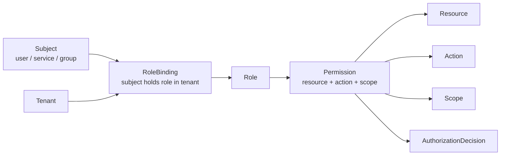
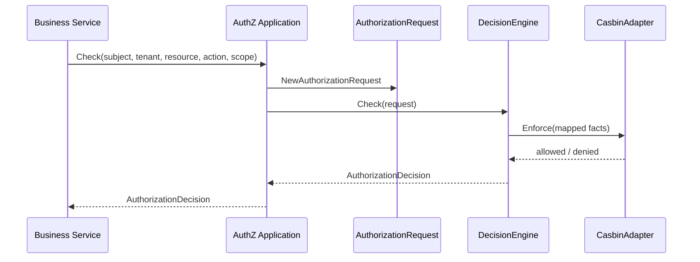
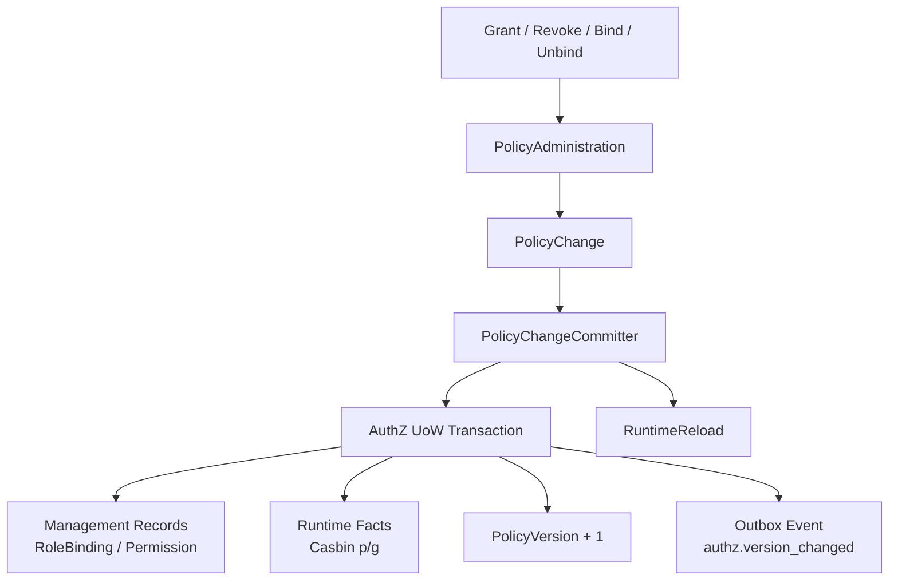
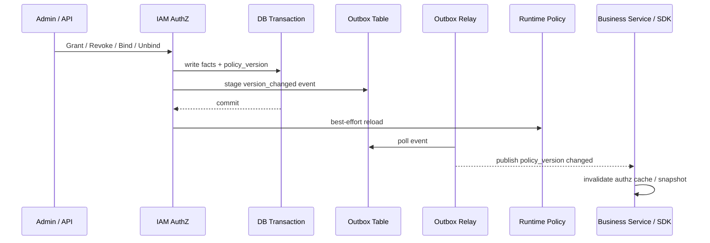

# 04-AuthZ 授权体系讲法

## 1. 本文定位

本文是 `07-宣讲/` 中用于对外讲解 IAM AuthZ 授权体系的表达材料。

它不替代 `docs/03-授权AuthZ/` 下的事实层文档，也不替代源码。

事实层文档负责回答：

```text
AuthZ 模型是什么；
Resource / Role / RoleBinding / Permission 如何建模；
授权写入链路如何经过 PolicyChangeCommitter；
PolicyVersion / Outbox / RuntimeReload 如何协作；
Check / Snapshot / Casbin runtime 如何工作；
事实源在哪里。
```

本文负责回答：

```text
面试或技术分享中，AuthZ 应该怎么讲？
为什么 AuthZ 不是 user.role 字段？
Role、Resource、Permission、RoleBinding 如何组织？
Subject / Tenant / Resource / Action / Scope 如何构成一次 Check？
Casbin 在系统里到底是什么角色？
授权写入为什么不是简单 CRUD？
PolicyVersion、Outbox、RuntimeReload 为什么重要？
AuthZ 如何与 AuthN、Identity、SDK、qs-server 协作？
```

一句话：

> 本文负责把 AuthZ 的事实层设计，整理成一套能面试、能白板、能技术分享、能被追问的授权体系表达。

---

## 2. AuthZ 一句话

最推荐说法：

```text
AuthZ 是 IAM 的资源级授权体系，负责判断某个 Subject 在某个 Tenant 下，能否对某个 Resource 执行某个 Action，并满足某个 Scope。
```

更短版：

```text
AuthZ 负责回答“你能不能访问这个资源”。
```

和 AuthN 的边界：

```text
AuthN 证明你是谁；
AuthZ 判断你能做什么。
```

不要把 AuthZ 讲成：

```text
user.role 字段；
Casbin 封装；
权限 CRUD；
后台菜单权限。
```

---

## 3. 30 秒讲法

```text
IAM 的 AuthZ 不是简单的 user.role 字段，而是一套资源级授权体系。它用 Subject、Role、Resource、Permission、RoleBinding、Action、Scope 建模访问权：RoleBinding 表示某个 subject 在某个 tenant 下持有某个 role，Permission 表示某个 role 能对某个 resource 执行某个 action，并受 scope 限制。业务服务发起 Check 时传入 subject、tenant、resource、action、scope，AuthZ 返回 AuthorizationDecision。Casbin 只是 infra 层 runtime policy engine，不是领域模型。写入侧也不是 CRUD，而是通过 PolicyChangeCommitter 和 UoW 同事务写授权 facts、递增 PolicyVersion、stage Outbox 事件，并在提交后 reload runtime policy。
```

适合场景：

```text
面试官问“权限怎么做的？”；
技术分享中快速介绍 AuthZ；
从 AuthN 过渡到资源访问控制。
```

---

## 4. 1 分钟讲法

```text
AuthZ 的核心问题是资源访问判定：某个 subject 在某个 tenant 下，能不能对某个 resource 执行某个 action，并满足某个 scope。

普通系统可能直接写 user.role == admin，但 IAM 要服务多个业务系统，权限不能只停留在用户表字段上。所以我把授权模型拆成 Subject、Role、Resource、Permission、RoleBinding。RoleBinding 回答“谁在某个 tenant 下拥有什么角色”；Permission 回答“某个角色能对什么资源执行什么动作，并限制在什么 scope”。

读链路上，业务服务调用 AuthZ Check，传 subject、tenant、resource、action、scope。Application 层构造 AuthorizationRequest，再交给 DecisionEngine，当前 runtime 由 CasbinAdapter 实现。Casbin 在这里是 infra adapter，只负责运行时判定，领域语言仍然是 Role、Resource、Permission、RoleBinding、Scope 和 AuthorizationDecision。

写链路上，授权变更不是简单 insert/delete。绑定角色或授予权限时，既要写管理事实，也要写 runtime facts，还要递增 PolicyVersion、stage Transactional Outbox 事件，并在事务提交后 reload runtime policy。这样才能保证管理面、判定面、版本传播和运行时策略一致。
```

适合场景：

```text
面试项目介绍中的 AuthZ 部分；
技术分享授权章节；
回答“为什么不用 user.role”。
```

---

## 5. 3 分钟讲法

```text
我讲 AuthZ 时，一般会从四个层次讲：授权模型、Check 读链路、Policy 写链路、运行时一致性。

第一层是授权模型。AuthZ 不用 user.role 字段做权限判断，而是把授权拆成 Subject、Role、Resource、Permission、RoleBinding、Action、Scope。Subject 是被授权主体，可以是 user、service 或其他主体；Role 是权限集合；Resource 是受保护资源；Action 是 read、create、update、delete、submit、export 等动作；Scope 表示权限作用范围，例如 all:*、origin:<profile_id>；Permission 表示某个 Role 能对某个 Resource 执行某个 Action 并受 Scope 限制；RoleBinding 表示某个 Subject 在某个 Tenant 下持有某个 Role。

第二层是 Check 读链路。业务系统不应该自己判断权限，而是把 subject、tenant、resource、action、scope 交给 IAM AuthZ Check。Application 层会构造 AuthorizationRequest，然后调用 DecisionEngine。当前 DecisionEngine 的 runtime 实现是 CasbinAdapter，最终把领域请求映射成 Casbin Enforce 所需的 facts，并返回 AuthorizationDecision。这里要特别说明：Casbin 是 infra runtime，不是领域模型。业务层不要说 p/g facts，也不要直接调用 casbin.Enforce。

第三层是授权写入链路。授权写入不是普通 CRUD。比如给用户绑定角色，不只是插入一条 role_binding；给角色授予权限，也不只是插入一条 permission。因为运行时判定依赖的是 policy facts，所以写入时要同时维护管理事实和运行时 facts。项目里通过 PolicyAdministration 生成 PolicyChange，再由 PolicyChangeCommitter 在 UoW 中统一提交。

第四层是一致性和传播。一次授权变更通常要做几件事：写 RoleBinding 或 Permission 管理记录，写 Casbin p/g facts，递增 PolicyVersion，stage version_changed Outbox event，并在事务提交后 reload 当前 runtime policy。PolicyVersion 用来表达某个 tenant 的授权事实版本，Outbox 用来保证 DB 事实和事件发布的一致性，RuntimeReload 用来让当前进程的判定引擎尽快看到新策略。这样管理面、判定面、跨实例传播和业务系统缓存失效才有统一依据。

所以 AuthZ 的设计价值不是“用了 Casbin”，而是：用领域模型表达授权，用 Casbin 作为运行时判定适配器，用 PolicyChangeCommitter 管住写入边界，用 PolicyVersion 和 Outbox 管住授权版本传播。
```

适合场景：

```text
面试深聊 AuthZ；
技术分享授权章节；
回答“授权体系设计亮点是什么”。
```

---

## 6. 推荐讲解顺序

不要从 Casbin 开始讲。

推荐顺序：

```text
1. 先讲 AuthZ 解决的问题；
2. 再讲 Subject / Tenant / Resource / Action / Scope；
3. 再讲 Role / Permission / RoleBinding；
4. 再讲 Check 如何返回 AuthorizationDecision；
5. 再讲 Casbin 只是 infra runtime；
6. 再讲授权写入为什么不是 CRUD；
7. 最后讲 PolicyVersion / Outbox / RuntimeReload。
```

### 6.1 先讲问题

```text
AuthZ 不是为了保存角色字段，而是为了给业务系统提供统一资源访问判定。
```

### 6.2 再讲请求模型

```text
subject + tenant + resource + action + scope
```

### 6.3 再讲授权模型

```text
subject 通过 rolebinding 获得 role；
role 通过 permission 拥有 resource/action/scope。
```

### 6.4 再讲判定

```text
Check 返回 AuthorizationDecision，而不是让业务系统自己解释权限规则。
```

### 6.5 最后讲写入和传播

```text
授权变更会改变 runtime policy，因此需要 PolicyChangeCommitter、PolicyVersion、Outbox 和 RuntimeReload。
```

---

## 7. 白板图讲法

### 7.1 图一：授权模型图



讲图时说：

```text
这张图讲授权模型。Subject 不是直接有权限，而是在某个 Tenant 下通过 RoleBinding 获得 Role；Role 再通过 Permission 关联 Resource、Action 和 Scope。最终一次 Check 返回 AuthorizationDecision。
```

---

### 7.2 图二：Check 判定链路



讲图时说：

```text
业务服务不直接判断权限，也不直接调用 Casbin。它调用 IAM Check。AuthZ 应用层构造领域请求，DecisionEngine 负责判定，CasbinAdapter 只是当前 infra runtime 实现。
```

---

### 7.3 图三：授权写入链路



讲图时说：

```text
授权写入不是单表 CRUD。PolicyChangeCommitter 在一个 UoW 中同时维护管理事实、运行时 facts、版本和 Outbox 事件，提交后再 reload runtime policy。
```

---

### 7.4 图四：版本传播链路



讲图时说：

```text
PolicyVersion 和 Outbox 解决的是授权变更后的传播问题。DB 事实和事件记录同事务提交，relay 再异步发布，业务系统可以按 policy_version 判断缓存是否过期。
```

---

## 8. AuthZ 要讲清楚的核心概念

### 8.1 Subject

Subject 是被授权主体。

讲法：

```text
AuthZ 不关心 subject 是通过密码、微信还是 service token 认证出来的，那是 AuthN 的事。AuthZ 只关心这个 subject 能否访问资源。
```

常见形式：

```text
user:<user_id>
service:<service_name>
group:<group_id>
```

具体格式以当前 AuthZ 契约为准。

---

### 8.2 Tenant

Tenant 是授权域。

讲法：

```text
同一个 subject 在不同 tenant 下可能持有不同 role，所以 Check 请求必须带 tenant 维度。
```

---

### 8.3 Resource

Resource 是受保护资源。

讲法：

```text
Resource 表示业务系统中需要授权保护的对象，例如 qs:evaluation:report:*、qs:survey:questionnaire:*、iam:authz:role:*。
```

Resource 不是数据库表名，也不是 URL path。

它是授权语义里的资源标识。

---

### 8.4 Action

Action 是对资源的操作。

讲法：

```text
Action 表示用户想对资源做什么，例如 read、create、update、delete、submit、export、publish。
```

---

### 8.5 Scope

Scope 是权限作用范围。

讲法：

```text
Scope 用来避免权限过粗。比如同样是 read 报告，可以是 all:*，也可以只允许 origin:<profile_id>。
```

典型形式：

```text
all:*
origin:<value>
owner:<user_id>
tenant:<tenant_id>
```

具体 ScopeKind 以 ResourceCatalog 为准。

---

### 8.6 Role

Role 是权限集合。

讲法：

```text
Role 不是直接写在 User 表上的字符串，而是 Permission 的聚合点。Subject 通过 RoleBinding 获得 Role。
```

---

### 8.7 Permission

Permission 表示角色的资源访问能力。

讲法：

```text
Permission 回答“某个 role 能对哪个 resource 执行哪个 action，并受哪个 scope 限制”。
```

---

### 8.8 RoleBinding

RoleBinding 表示主体持有角色的事实。

讲法：

```text
RoleBinding 回答“某个 subject 在某个 tenant 下持有什么 role”。
```

注意：

```text
rolebinding 是内部领域语言；
assignment 只作为 REST / proto / SDK wire term。
```

---

### 8.9 AuthorizationDecision

AuthorizationDecision 是一次判定结果。

讲法：

```text
业务系统不应该只拿 bool，而应该能看到 allowed、reason、deny_code、matched_role、matched_permission、policy_version 等信息，便于排查和缓存治理。
```

具体字段以当前 AuthZ 契约和 SDK public API 为准。

---

## 9. AuthZ 的设计亮点讲法

### 9.1 亮点一：不是 user.role，而是资源级授权模型

推荐说法：

```text
AuthZ 用 subject/tenant/resource/action/scope 做一次判定请求，用 Role/Permission/RoleBinding 管授权事实。
```

价值：

```text
可以支持资源级、租户级、范围级权限，而不是粗糙角色字段。
```

---

### 9.2 亮点二：RoleBinding 与 Assignment 分层

推荐说法：

```text
assignment 是 REST/proto/SDK 对外 wire term，rolebinding 是内部 domain/application 领域语言。
```

价值：

```text
对外 API 可以使用更容易理解的角色分配概念，内部仍保持领域语义准确。
```

---

### 9.3 亮点三：Casbin 是 infra adapter，不是领域模型

推荐说法：

```text
业务语言是 Role、Resource、Permission、RoleBinding、Scope，Casbin p/g facts 只是运行时判定映射。
```

价值：

```text
避免业务层被 Casbin 术语污染，也为未来替换或扩展 runtime engine 留空间。
```

---

### 9.4 亮点四：授权写入不是 CRUD

推荐说法：

```text
授权写入通过 PolicyChangeCommitter 和 UoW 同事务维护管理事实、runtime facts、PolicyVersion 和 Outbox event。
```

价值：

```text
保证管理面、判定面、版本传播和当前 runtime policy 一致。
```

---

### 9.5 亮点五：PolicyVersion + Outbox 管版本传播

推荐说法：

```text
每次授权事实变化都会递增 PolicyVersion，并通过 Transactional Outbox 发布 version_changed 事件。
```

价值：

```text
业务服务可以用 policy_version 判断本地 snapshot 或 cache 是否过期。
```

---

### 9.6 亮点六：Snapshot 只做视图，不替代 Check

推荐说法：

```text
AuthorizationSnapshot 可以展示 subject 当前 roles、permissions 和 policy_version，但最终访问控制仍应调用 Check。
```

价值：

```text
前端展示、管理后台诊断和 SDK 缓存可以使用 Snapshot，但不会绕过权威判定。
```

---

### 9.7 亮点七：有架构护栏

推荐说法：

```text
架构测试防止 AuthZ 退回 assignment 包，防止 Casbin facts 进入 domain，防止 handler 直接调用 Casbin。
```

价值：

```text
授权模型长期演进时不容易腐烂。
```

---

## 10. AuthZ 与其他模块的关系

### 10.1 AuthZ 与 AuthN

```text
AuthN 证明身份；
AuthZ 判断访问权。
```

讲法：

```text
AuthZ 不验证密码，也不签发 token；它接收已经被 AuthN 证明出的 subject，并判断这个 subject 有没有权限访问资源。
```

---

### 10.2 AuthZ 与 Identity

```text
Identity 提供 User、Profile、ProfileLink；
AuthZ 使用 subject 和 scope 做资源权限判定。
```

讲法：

```text
ProfileLink 是身份关系，不是最终权限。用户是某个儿童 Profile 的 guardian，不等于自动拥有所有 report:read 权限。敏感访问仍要进入 AuthZ Check。
```

---

### 10.3 AuthZ 与 SDK

```text
SDK 封装 Check、Allow、AllowScoped、AuthorizationSnapshot。
```

讲法：

```text
SDK 是业务服务调用 AuthZ 的客户端封装，不在本地复制 Role、Permission、RoleBinding 或 Casbin facts。
```

---

### 10.4 AuthZ 与 qs-server

```text
qs-server 构造业务资源语义；
IAM AuthZ 做权威权限判定。
```

讲法：

```text
qs-server 根据测评报告、答卷、问卷模板等业务对象构造 resource/action/scope，然后调用 IAM Check。qs-server 不复制 IAM 权限表，也不直接调用 Casbin。
```

示例：

```text
subject = user:<iam_user_id>
tenant = tenant-a
resource = qs:evaluation:report:*
action = read
scope = origin:<profile_id>
```

---

### 10.5 AuthZ 与 Outbox

```text
授权事实变化后，通过 PolicyVersion + Outbox 通知下游。
```

讲法：

```text
AuthZ 写入不仅改变当前 DB，还要让 runtime policy 和业务系统缓存知道授权版本变了。
```

---

## 11. 面试回答模板

### Q1：你的授权模型怎么设计？

```text
我把授权模型拆成 Subject、Role、Resource、Permission、RoleBinding、Action、Scope。RoleBinding 表示某个 subject 在某个 tenant 下持有某个 role；Permission 表示某个 role 能对某个 resource 执行某个 action，并受 scope 限制。业务服务发起 Check 时传 subject、tenant、resource、action、scope，AuthZ 返回 AuthorizationDecision。
```

---

### Q2：为什么不用 user.role 字段？

```text
user.role 只能表达很粗的角色，无法表达资源、动作、tenant 和 scope，也无法支持多业务系统统一 Check、授权快照、授权版本传播和缓存失效。IAM 要作为统一授权中心，所以需要 Role/Resource/Permission/RoleBinding 这类资源级授权模型。
```

---

### Q3：Casbin 在你的系统里是什么角色？

```text
Casbin 是运行时 policy engine，不是领域模型。领域层使用 Role、Resource、Permission、RoleBinding、Scope 这些业务概念；infra 层把这些授权事实映射成 Casbin p/g facts，然后通过 Casbin Enforcer 做 Check。这样业务模型不会被 Casbin 术语污染。
```

---

### Q4：一次授权判定怎么走？

```text
业务服务调用 AuthZ Check，传 subject、tenant、resource、action、scope。Application 层构造 AuthorizationRequest，然后调用 DecisionEngine。当前 DecisionEngine 由 CasbinAdapter 实现，最终执行 Enforce，返回 AuthorizationDecision。
```

---

### Q5：授权写入为什么不是 CRUD？

```text
因为授权写入改变的是运行时可判定的策略事实。比如绑定角色不仅要写 rolebinding 管理记录，还要写 Casbin g fact；授予权限要写 p fact；此外还要递增 PolicyVersion、stage Outbox 事件，并在事务提交后 reload runtime policy。否则管理面、判定面和下游缓存会不一致。
```

---

### Q6：PolicyVersion 有什么用？

```text
PolicyVersion 表示某个 tenant 的授权事实版本。业务服务或 SDK 可以用它判断本地授权快照或缓存是否过期。每次授权 facts 改变后都递增版本，并通过 Outbox 传播 version_changed 事件。
```

---

### Q7：Outbox 在授权系统中解决什么？

```text
Outbox 解决 DB 授权事实和事件发布之间的一致性问题。如果直接 DB commit 后 publish MQ，会有 DB 成功但 MQ 失败的窗口。Transactional Outbox 把授权 facts、PolicyVersion 和事件记录放在同一个事务里，之后由 relay 异步可靠投递。
```

---

### Q8：assignment 和 rolebinding 有什么区别？

```text
assignment 是 REST/proto/SDK 对外 wire term，表示角色分配；rolebinding 是内部领域语言，表示 subject 在 tenant 下持有 role。这样既保持 API 语义对接入方友好，又让内部模型保持准确。
```

---

### Q9：Snapshot 能不能替代 Check？

```text
不能。Snapshot 适合管理后台展示、前端按钮展示、调试和缓存视图，但最终资源访问控制应该走 Check。因为 Check 是针对具体 subject、tenant、resource、action、scope 的权威判定。
```

---

### Q10：ProfileLink 和 AuthZ 是什么关系？

```text
ProfileLink 是 Identity 里的身份关系，说明某个 User 和某个 Profile 有什么关系；AuthZ 是资源访问判定。比如用户是儿童 Profile 的 guardian，并不等于自动拥有所有报告读取权限。读取报告仍要走 resource/action/scope 的 AuthZ Check。
```

---

## 12. 不推荐的 AuthZ 讲法

### 12.1 说成“我用了 Casbin”

```text
权限系统用了 Casbin。
```

问题：

```text
太浅。Casbin 只是运行时判定引擎，不是授权模型。
```

正确说法：

```text
我用 Role、Resource、Permission、RoleBinding 建模授权，再把授权事实映射到 Casbin p/g facts 做运行时判定。
```

---

### 12.2 说成“用户有角色”

```text
用户表里有 role。
```

问题：

```text
这会把复杂授权讲成 user.role 字段。
```

正确说法：

```text
subject 通过 RoleBinding 在 tenant 下持有 role，role 再通过 Permission 关联 resource、action 和 scope。
```

---

### 12.3 说成“权限就是 CRUD”

```text
授权就是增删改查角色和权限。
```

问题：

```text
漏掉 runtime facts、PolicyVersion、Outbox、RuntimeReload。
```

正确说法：

```text
授权管理接口可能是 CRUD 风格，但授权写入本质是策略事实变更，需要 UoW、版本和事件传播。
```

---

### 12.4 混淆 AuthN 和 AuthZ

```text
AuthZ 验证 token 后判断权限。
```

问题：

```text
验证 token 是 AuthN 的事。AuthZ 接收 subject 并判断访问权。
```

正确说法：

```text
AuthN 证明你是谁，AuthZ 判断你能不能访问资源。
```

---

### 12.5 把 Snapshot 当成最终权限判定

```text
前端拿到 Snapshot 后就可以决定接口能不能访问。
```

问题：

```text
前端展示控制不是最终访问控制。最终访问控制必须由后端调用 Check。
```

---

### 12.6 把 ProfileLink 当成权限

```text
用户关联了 Profile，所以可以读取所有报告。
```

问题：

```text
ProfileLink 是身份关系，不是资源权限。资源访问仍应走 AuthZ Check。
```

---

## 13. 证据链索引

| 讲法 | 证据 |
| --- | --- |
| AuthZ 模型总览 | `docs/03-授权AuthZ/00-AuthZ模型总览-Subject-Role-Resource-Permission-RoleBinding.md` |
| Resource / Action / Scope 模型 | `docs/03-授权AuthZ/01-资源模型-ResourceKey-ResourcePattern-Action-Scope.md` |
| Role / RoleBinding / Subject 模型 | `docs/03-授权AuthZ/02-角色模型-Role-RoleBinding-Subject.md` |
| 授权写入经过 PolicyChangeCommitter | `docs/03-授权AuthZ/03-授权写入链路-PolicyAdministration-PolicyChange-PolicyChangeCommitter.md` |
| PolicyVersion / Outbox / RuntimeReload | `docs/03-授权AuthZ/04-授权版本与事件传播链路-PolicyVersion-Outbox-RuntimeReload.md` |
| Check / Snapshot 判定链路 | `docs/03-授权AuthZ/05-权限检查链路-Check-Snapshot.md` |
| Casbin 是 infra runtime | `docs/03-授权AuthZ/06-Casbin运行时模型-pgFacts与四段Matcher.md` |
| AuthZ 分层架构和事实源 | `docs/03-授权AuthZ/07-AuthZ分层架构与事实源索引.md` |
| REST/gRPC/SDK 接入 AuthZ | `docs/05-接入与契约` |
| 架构护栏 | `docs/06-架构护栏` |

不要把已归档的专题分析作为当前证据源。

---

## 14. 简历项目描述版本

```text
设计并实现 IAM AuthZ 授权体系，基于 Subject、Role、Resource、Permission、RoleBinding、Action、Scope 建模资源级访问控制，支持 subject/tenant/resource/action/scope 维度的授权判定。读链路通过 AuthorizationRequest + DecisionEngine 接入 Casbin runtime policy engine；写链路通过 PolicyChangeCommitter 和 AuthZ UoW 同事务写入管理事实与 runtime facts、递增 PolicyVersion、stage Transactional Outbox 事件，并在提交后 reload runtime policy，保证管理面、判定面和下游授权缓存的一致性。
```

可以按真实贡献再压缩。

不要把尚未完整实现的多租户治理、管理后台或分布式传播能力说成已完成能力。

---

## 15. 30 分钟分享中的位置

如果做 30 分钟技术分享，AuthZ 建议占：

```text
6～7 分钟
```

结构：

```text
1 分钟：为什么不是 user.role；
1 分钟：Subject / Role / Resource / Permission / RoleBinding；
1 分钟：Check 判定链路；
1 分钟：Casbin 只是 infra runtime；
2 分钟：PolicyChange / UoW / PolicyVersion / Outbox 写入链路；
1 分钟：Snapshot、缓存和常见追问。
```

不要在 AuthZ 部分讲太多 AuthN。

AuthN 只需要一句话：

```text
AuthN 证明你是谁，AuthZ 判断你能做什么。
```

---

## 16. 本文总结

AuthZ 授权体系讲法的核心是：

```text
不要把它讲成“用了 Casbin”或“用户有 role”。
```

应该讲成：

```text
Subject + Tenant
  -> RoleBinding
  -> Role
  -> Permission
  -> Resource / Action / Scope
  -> AuthorizationDecision
```

最推荐的表达：

```text
IAM 的 AuthZ 是资源级授权体系。它用 Subject、Role、Resource、Permission、RoleBinding、Action、Scope 表达授权模型，用 AuthorizationRequest 表达一次判定请求，再通过 DecisionEngine 接入 CasbinAdapter 做运行时 Enforce。Casbin 只是 infra 层 policy engine，业务语言仍然是 Role、Resource、Permission、RoleBinding 和 Scope。写入侧通过 PolicyChangeCommitter 和 UoW 同事务写授权管理事实、runtime facts、PolicyVersion 和 Outbox event，并在提交后 reload runtime policy，从而保证管理面、判定面和下游缓存的一致性。
```

如果只记住一句话：

```text
AuthZ 不是 user.role，也不是 Casbin 封装；它是以 Subject、Role、Resource、Permission、RoleBinding、Action、Scope 为核心的资源级授权体系，并通过 PolicyVersion 与 Outbox 管理授权事实变化后的传播边界。
```
