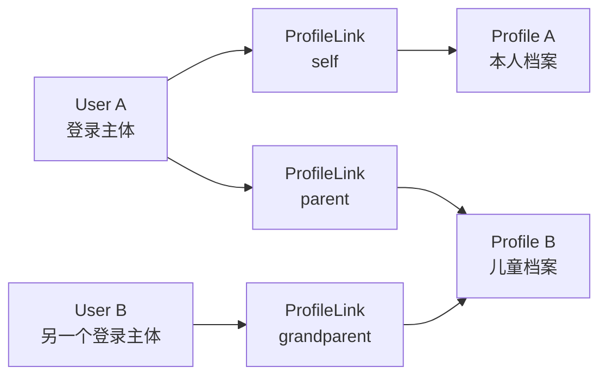
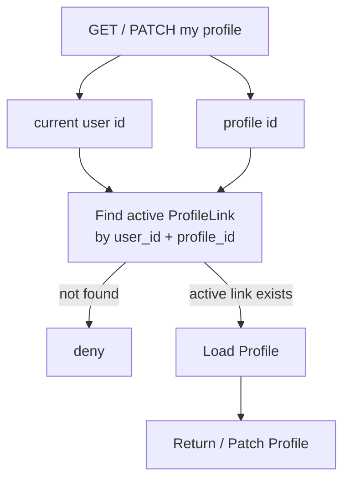
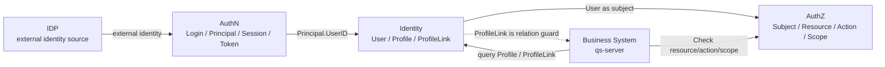
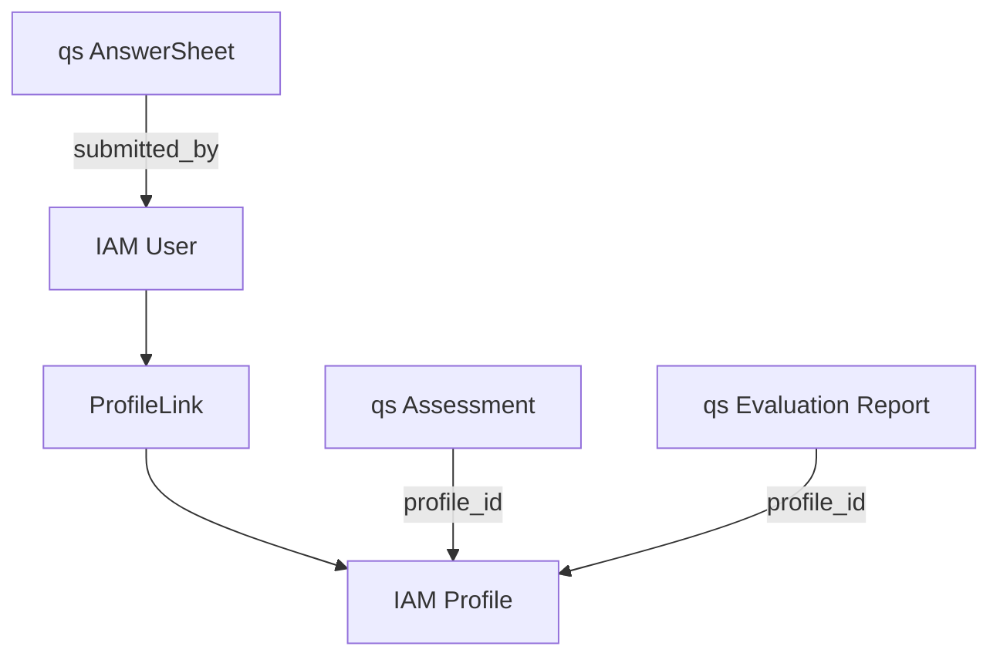

# 05-Identity 与 ProfileLink 讲法

## 1. 本文定位

本文是 `07-宣讲/` 中用于对外讲解 IAM Identity 与 ProfileLink 的表达材料。

它不替代 `docs/04-身份Identity/` 下的事实层文档，也不替代源码。

事实层文档负责回答：

```text
User 是什么；
Profile 是什么；
ProfileLink 是什么；
User / Profile / ProfileLink 如何协作；
ProfileLink 与 AuthN / AuthZ 的边界是什么；
Identity 的事实源在哪里。
```

本文负责回答：

```text
面试或技术分享中，Identity 应该怎么讲？
为什么 User 和 Profile 要分开？
为什么 ProfileLink 不能只是 User 字段？
ProfileLink 和 AuthZ 权限有什么区别？
当前用户视角如何保护档案访问？
Identity 如何与 AuthN、AuthZ、IDP、SDK、qs-server 协作？
```

一句话：

> 本文负责把 Identity 的事实层设计，整理成一套能面试、能白板、能技术分享、能被追问的身份关系建模表达。

---

## 2. Identity 一句话

最推荐说法：

```text
Identity 是 IAM 的身份关系模块，负责把登录主体 User、业务档案 Profile、以及二者之间的 ProfileLink 关系分开建模，用来支持本人档案、儿童档案、亲属关系和业务系统中的档案访问边界。
```

更短版：

```text
Identity 负责回答“系统内部这个主体是谁，以及他和哪些业务档案有关”。
```

再短一点：

```text
User 是登录主体，Profile 是业务档案，ProfileLink 是二者之间的关系事实。
```

不要把 Identity 讲成：

```text
用户资料 CRUD；
儿童档案模块；
Profile 权限表；
AuthN 登录表；
AuthZ 权限表。
```

---

## 3. 30 秒讲法

```text
IAM 的 Identity 不是普通用户资料模块。它把 User 和 Profile 分开：User 是登录主体，是 AuthN Principal、Session、Token 和 AuthZ subject 的身份锚点；Profile 是业务档案，可以表示本人档案、儿童档案或被测评者档案；ProfileLink 是 User 和 Profile 之间的关系事实，可以表达 self、parent、grandparent、other 等关系，并支持 active / revoked 生命周期。这样一个 User 可以关联多个 Profile，一个 Profile 也可以被多个 User 关联。ProfileLink 可以作为当前用户访问档案的关系 guard，但它不是 AuthZ permission，资源级访问仍然应该走 AuthZ Check。
```

适合场景：

```text
面试官问“用户和档案怎么建模”；
技术分享中快速介绍 Identity；
从 AuthN/AuthZ 过渡到业务身份关系。
```

---

## 4. 1 分钟讲法

```text
Identity 主要解决的是 User、Profile、ProfileLink 的关系建模问题。普通用户系统通常把用户资料直接放在 User 表里，但在测评、儿童档案、家庭关系这类业务里，登录主体和业务档案不是一回事。

User 是能登录系统的人，是 AuthN 中 Principal、Session、Token 的身份锚点，也可以作为 AuthZ 的 subject。Profile 是业务档案，比如本人档案、儿童档案或被测评者档案，它不直接登录，也不签发 token。ProfileLink 是 User 和 Profile 之间的关系事实，比如 self、parent、grandparent、other，并且有 active、revoked 等生命周期。

这样设计可以支持一个 User 关联多个 Profile，也支持一个 Profile 被多个 User 关联。对于当前用户视角，读取或修改档案时可以先检查当前用户与该 Profile 是否存在 active ProfileLink，避免用户直接按 profile_id 越权访问。这里要注意，ProfileLink 是身份关系 guard，不是 AuthZ 权限；如果是资源级访问控制，仍然应该进入 AuthZ Check。
```

适合场景：

```text
面试项目介绍中的 Identity 部分；
技术分享身份建模章节；
回答“为什么 User 和 Profile 要拆”。
```

---

## 5. 3 分钟讲法

```text
我讲 Identity 时，一般会从三个核心概念讲：User、Profile、ProfileLink。

第一，User 是登录主体。它表示 IAM 内部可以被认证和识别的主体，会出现在 AuthN 的 Principal、Session、Token claims 中，也可以作为 AuthZ 的 subject。User 有状态，例如 active、inactive、blocked。用户被 block 后，会影响登录态和在线 Verify。

第二，Profile 是业务档案。它不是登录主体，而是业务系统中被记录、被测评、被关联的档案。比如在测评系统里，Profile 可以是本人档案、儿童档案或被测评者档案。Profile 可以有姓名、性别、生日、证件等基础身份信息，但它不直接登录，也不直接签发 token。身高、体重、测评结果这类业务属性应放在业务系统中，而不是都塞进 IAM Profile。

第三，ProfileLink 是 User 和 Profile 之间的关系事实。它不是 user.profile_id 字段，因为业务里一个用户可能有自己的档案，也可能关联多个儿童档案；一个儿童档案也可能被父母、祖辈或其他照护人关联。关系本身还要表达类型和生命周期，比如 self、parent、grandparent、other、active、revoked。因此 ProfileLink 必须是一等关系实体。

应用层上，Identity 会提供系统侧能力和当前用户视角能力。系统侧能力可以创建 User、维护 Profile、建立或撤销 ProfileLink；当前用户视角，例如 MyProfiles / MyProfileLinks，会限制用户只能访问与自己有 active link 的 Profile，不能通过猜 profile_id 或 user_id 操作别人的档案关系。

最后要强调边界：ProfileLink 可以作为身份关系 guard，但它不是 AuthZ permission。AuthZ 判断的是 subject 能否对 resource 执行 action，并满足 scope；ProfileLink 判断的是 user 和 profile 是否存在关系。未来如果要把 Profile 操作纳入统一资源权限系统，应通过 AuthZ Resource / Action / Scope 扩展，而不是把 ProfileLink 当成权限表。
```

适合场景：

```text
面试深聊 Identity；
技术分享身份关系建模章节；
回答“ProfileLink 为什么是一等实体”。
```

---

## 6. 推荐讲解顺序

不要从字段开始讲。

推荐顺序：

```text
1. 先讲业务问题：登录主体和业务档案不是一回事；
2. 再讲 User：登录主体和身份锚点；
3. 再讲 Profile：业务档案；
4. 再讲 ProfileLink：User 与 Profile 的关系事实；
5. 再讲当前用户视角 guard；
6. 再讲 ProfileLink 与 AuthZ 的边界；
7. 最后讲 Identity 与 AuthN / AuthZ / IDP / SDK / qs-server 的协作。
```

### 6.1 先讲问题

```text
普通 User 表很难表达本人档案、儿童档案、父母关系、祖辈关系和多用户共享档案。
```

### 6.2 再讲 User

```text
User 是能登录、能被认证、能作为 subject 的身份主体。
```

### 6.3 再讲 Profile

```text
Profile 是业务档案，不直接登录，不直接签发 token。
```

### 6.4 再讲 ProfileLink

```text
ProfileLink 是 User 和 Profile 之间的关系边，承载 relation、status 和生命周期。
```

### 6.5 最后讲边界

```text
ProfileLink 是身份关系；AuthZ Check 是资源权限判定。
```

---

## 7. 白板图讲法

### 7.1 图一：User / Profile / ProfileLink



讲图时说：

```text
这张图表达的是：User 和 Profile 不是一对一。User 通过 ProfileLink 关联 Profile，一个 User 可以关联多个 Profile，一个 Profile 也可以被多个 User 关联。
```

---

### 7.2 图二：当前用户访问 Profile 的 guard



讲图时说：

```text
当前用户不能直接按 profile_id 读写档案，必须先检查 current user 和 profile 之间是否存在 active ProfileLink。这个 guard 解决的是当前用户视角的关系访问边界。
```

---

### 7.3 图三：Identity 与 AuthN / AuthZ / IDP 的边界



讲图时说：

```text
Identity 提供 User、Profile、ProfileLink。AuthN 使用 UserID 作为登录主体，AuthZ 使用 user:<id> 作为 subject，业务系统可以查询 ProfileLink 做身份关系判断，但最终资源访问仍应走 AuthZ Check。
```

---

### 7.4 图四：qs-server 中的身份引用



讲图时说：

```text
qs-server 不复制 IAM 的 User/Profile 表，而是保存 iam_user_id、iam_profile_id 这类引用。业务对象归属和权限判断再通过 Identity 查询和 AuthZ Check 完成。
```

---

## 8. Identity 要讲清楚的核心概念

### 8.1 User

User 是登录主体和身份锚点。

讲法：

```text
User 是 IAM 内部的主体，它有状态，会进入 AuthN Principal、Session、Token，也可以作为 AuthZ subject。
```

关键词：

```text
user_id；
status；
active；
inactive；
blocked。
```

---

### 8.2 Profile

Profile 是业务档案。

讲法：

```text
Profile 不是登录用户，而是业务中被记录、被测评、被关联的档案，例如本人档案或儿童档案。
```

关键词：

```text
profile_id；
name；
gender；
birthday；
identity info。
```

注意：

```text
Profile 只保存通用身份档案信息，不应该承载所有业务属性。
```

---

### 8.3 ProfileLink

ProfileLink 是 User 与 Profile 的关系事实。

讲法：

```text
ProfileLink 表达哪个 User 和哪个 Profile 有什么关系，以及这个关系当前是否有效。
```

关键词：

```text
self；
parent；
grandparent；
other；
active；
revoked。
```

---

### 8.4 MyProfiles / MyProfileLinks

MyProfiles / MyProfileLinks 是当前用户视角的访问用例。

讲法：

```text
系统侧可以管理 User/Profile/ProfileLink，但当前用户视角必须限制在自己的关系范围内。MyProfiles / MyProfileLinks 会通过 current user 和 active ProfileLink 做 guard。
```

---

## 9. Identity 的设计亮点讲法

### 9.1 亮点一：User 和 Profile 分离

推荐说法：

```text
User 是登录主体，Profile 是业务档案。
```

价值：

```text
避免把儿童档案、本人档案、被测评者档案都硬塞进 User 表。
```

---

### 9.2 亮点二：ProfileLink 是关系实体

推荐说法：

```text
User 和 Profile 通过 ProfileLink 建立关系，而不是 User 持有 profile_id 字段。
```

价值：

```text
支持多对多、关系类型、软撤销、历史追溯和当前用户访问 guard。
```

---

### 9.3 亮点三：self profile link 不变量

推荐说法：

```text
self profile link 表示 User 与本人档案的关系，一个 User 最多只能有一个 active self link，但可以没有 self Profile。
```

价值：

```text
系统能稳定找到当前用户自己的档案，同时避免注册或登录时强行创建档案。
```

---

### 9.4 亮点四：当前用户视角 guard

推荐说法：

```text
MyProfiles / MyProfileLinks 会限制用户只能访问和操作自己的 active link。
```

价值：

```text
避免用户通过猜 profile_id 或 user_id 越权访问他人档案关系。
```

---

### 9.5 亮点五：ProfileLink 与 AuthZ 边界清楚

推荐说法：

```text
ProfileLink 是身份关系，不是资源权限。
```

价值：

```text
避免把亲属关系、档案关系和资源访问权限混在一起。资源级访问仍由 AuthZ Check 判定。
```

---

### 9.6 亮点六：业务系统只保存 IAM 引用

推荐说法：

```text
qs-server 保存 iam_user_id、iam_profile_id 等引用，不复制 IAM 身份表。
```

价值：

```text
IAM 统一维护身份事实，业务系统专注业务对象和业务状态。
```

---

## 10. Identity 与其他模块的关系

### 10.1 Identity 与 AuthN

```text
AuthN 用 UserID 表示 Principal 的身份锚点；
Identity 提供 User 和 User 状态。
```

讲法：

```text
AuthN 管登录态，Identity 管内部主体和状态。在线 Verify 可以结合 User 状态判断 token 当前是否仍然有效。
```

---

### 10.2 Identity 与 AuthZ

```text
AuthZ 使用 user:<id> 作为 subject；
Identity 提供 User / Profile / ProfileLink 背景关系。
```

讲法：

```text
Identity 提供身份和关系上下文，AuthZ 判断资源访问权。ProfileLink 不是 Permission。
```

---

### 10.3 Identity 与 IDP

```text
IDP 解析外部身份；
AuthN 绑定 LoginIdentity；
Identity 提供 IAM 内部 User。
```

讲法：

```text
微信 openid 或企微 userid 不是 IAM User，本地 User 才是系统内部身份锚点。
```

---

### 10.4 Identity 与 SDK

```text
SDK 可以封装 GetUser、GetProfile、ListProfileLinks 等查询能力。
```

讲法：

```text
业务服务通过 SDK 查询身份关系，但 SDK 不替代 Identity，也不自动替业务服务完成所有访问控制。
```

---

### 10.5 Identity 与 qs-server

```text
qs-server 引用 IAM User/Profile；
IAM 维护 User/Profile/ProfileLink 事实。
```

讲法：

```text
qs-server 的测评、答卷、报告等业务对象可以引用 iam_user_id 和 iam_profile_id；需要用户与档案关系时查询 ProfileLink；需要最终资源访问控制时调用 AuthZ Check。
```

---

## 11. 面试回答模板

### Q1：为什么 User 和 Profile 要分开？

```text
因为 User 是登录主体，Profile 是业务档案，两者变化原因不同。User 会进入 AuthN 的 Principal、Session、Token，也会作为 AuthZ subject；Profile 是业务侧的档案，比如本人档案、儿童档案、被测评者档案。一个 User 可以关联多个 Profile，一个 Profile 也可能被多个 User 关联，所以不能把 Profile 字段直接放进 User。
```

---

### Q2：为什么 ProfileLink 不能只是 user.profile_id？

```text
user.profile_id 只能表达一对一关系，但业务里需要表达多对多关系。比如一个用户有本人档案和多个儿童档案，一个儿童档案可能被父母或祖辈多个用户关联。ProfileLink 还要表达 self、parent、grandparent、other 等关系类型，以及 active/revoked 生命周期，所以必须建模成独立关系实体。
```

---

### Q3：ProfileLink 和 AuthZ 权限有什么区别？

```text
ProfileLink 是身份关系，表达 user 和 profile 有没有关系以及是什么关系；AuthZ 是资源权限，判断 subject 能不能对 resource 执行 action。ProfileLink 可以作为当前用户视角的关系 guard，但如果是系统级资源授权，仍然应该走 AuthZ 的 Resource/Action/Scope Check。
```

---

### Q4：怎么防止用户访问别人的 Profile？

```text
当前用户视角可以通过 MyProfiles / MyProfileLinks 做 guard。比如读取或修改某个 Profile 前，先按 currentUserID + profileID 查询 active ProfileLink。如果没有 active link，就拒绝访问。这样不能直接靠猜 profile_id 访问别人档案。
```

---

### Q5：创建档案和建立关系怎么保证一致？

```text
创建 Profile 和建立 ProfileLink 应放在同一个应用用例和事务边界中处理。先创建业务档案，再建立当前用户与 Profile 的关系，避免出现 Profile 创建成功但关系没有建立的孤立状态。
```

---

### Q6：为什么关系撤销不是直接删除？

```text
ProfileLink 是关系事实，撤销关系后仍然可能需要审计和追溯。如果直接删除，历史关系会丢失。所以更好的方式是软撤销，例如记录 revokedAt 或状态，让 active 关系和历史关系可以区分。
```

---

### Q7：self profile link 是什么？

```text
self profile link 表示用户和自己本人档案之间的关系。它也是 ProfileLink 的一种，只是有更强不变量：一个 User 最多只能有一个 active self link，但可以没有 self Profile。这样既保持模型统一，又避免注册或登录时强行补档案。
```

---

### Q8：用户被 block 和 Identity 有什么关系？

```text
User 是 Identity 的身份锚点，它有 active、inactive、blocked 等状态。AuthN 在线 Verify 可以检查 User 状态，User 被 blocked 后旧 token 应该不能继续通过在线 Verify；同时也可以结合 SessionManager 撤销该用户的会话。
```

---

### Q9：业务系统为什么不直接存完整 Profile？

```text
IAM 是身份事实源，qs-server 这类业务系统更适合保存 iam_user_id、iam_profile_id 这样的引用，而不是复制 IAM 的完整 User/Profile 表。业务系统只保存自己的业务对象和业务状态，需要身份信息时通过 Identity 查询，需要访问控制时通过 AuthZ Check。
```

---

### Q10：ProfileLink 能不能直接当权限用？

```text
不建议。ProfileLink 最多可以作为当前用户视角的身份关系 guard，但它不是完整资源权限模型。资源级权限需要 subject、tenant、resource、action、scope 这些维度，应该由 AuthZ Check 判定。
```

---

## 12. 不推荐的 Identity 讲法

### 12.1 说成“用户资料模块”

```text
Identity 就是用户资料管理。
```

问题：

```text
太窄。它还包括 Profile 和 ProfileLink 身份关系。
```

---

### 12.2 说成“儿童档案模块”

```text
这是儿童档案管理。
```

问题：

```text
Profile 是通用业务档案，儿童只是典型场景。
```

---

### 12.3 说成“User 有多个 Profile”

```text
User 下挂多个 Profile。
```

问题：

```text
容易误导成一对多。更准确是 User 和 Profile 通过 ProfileLink 建立多对多关系。
```

---

### 12.4 把 ProfileLink 说成权限

```text
ProfileLink 表示用户有权限访问 Profile。
```

问题：

```text
不准确。ProfileLink 是身份关系 guard，不是完整资源权限系统。
```

更准确说法：

```text
ProfileLink 可以用于当前用户视角的关系检查，但资源级权限仍由 AuthZ Check 判断。
```

---

### 12.5 把微信 openid 当成 User

```text
微信 openid 就是用户。
```

问题：

```text
不准确。openid 是外部身份源标识，IAM 内部 User 才是系统身份主体。
```

---

## 13. 证据链索引

| 讲法 | 证据 |
| --- | --- |
| Identity 模型总览 | `docs/04-身份Identity/README.md` |
| User 与 Profile 模型 | `docs/04-身份Identity/01-User与Profile模型.md` |
| ProfileLink 链路 | `docs/04-身份Identity/02-ProfileLink链路--用户与儿童档案关系协作.md` |
| AuthN 使用 User 作为 Principal 身份锚点 | `docs/02-认证AuthN` |
| AuthZ 使用 subject 做资源访问判定 | `docs/03-授权AuthZ` |
| qs-server 接入 IAM 时引用 User/Profile | `docs/05-接入与契约/04-业务系统接入链路-qs-server接入 IAM 详解.md` |
| 架构护栏与事实源规则 | `docs/06-架构护栏` |

不要把已归档的专题分析作为当前证据源。

---

## 14. 简历项目描述版本

```text
设计并实现 IAM Identity 身份关系模型，将登录主体 User、业务档案 Profile 和关系实体 ProfileLink 分开建模，支持 self、parent、grandparent、other 等关系类型以及 active/revoked 生命周期。通过 ProfileLink 支持一个 User 关联多个 Profile、一个 Profile 被多个 User 关联，并在当前用户视角用 active ProfileLink 做档案访问 guard；同时保持 ProfileLink 与 AuthZ 权限边界清晰，ProfileLink 表达身份关系，资源级访问仍由 AuthZ Check 判定。
```

可以按真实贡献再压缩。

不要把尚未完整实现的业务侧档案权限、管理后台能力或复杂家庭协作能力说成已完成能力。

---

## 15. 30 分钟分享中的位置

如果做 30 分钟技术分享，Identity / ProfileLink 建议占：

```text
4～5 分钟
```

结构：

```text
1 分钟：User / Profile 为什么要分开；
1 分钟：ProfileLink 为什么是关系实体；
1 分钟：当前用户视角 guard；
1 分钟：ProfileLink 与 AuthZ 边界；
1 分钟：qs-server 如何引用 IAM User/Profile。
```

不要在 Identity 部分讲太多 AuthN 或 AuthZ。

只需要记住：

```text
AuthN 证明 User 登录态；
Identity 管 User/Profile/ProfileLink；
AuthZ 判断资源访问权。
```

---

## 16. 本文总结

Identity 与 ProfileLink 讲法的核心是：

```text
不要把它讲成普通用户资料 CRUD。
```

应该讲成：

```text
User 是登录主体；
Profile 是业务档案；
ProfileLink 是关系事实。
```

最推荐的表达：

```text
IAM 的 Identity 模块把 User、Profile、ProfileLink 分开建模。User 是登录主体和身份锚点，参与 AuthN 和 AuthZ；Profile 是业务档案，可以表示本人档案、儿童档案或被测评者档案；ProfileLink 是 User 与 Profile 之间的关系事实，支持 self、parent、grandparent、other 以及 active/revoked 状态。当前用户访问档案时，可以通过 active ProfileLink 做关系 guard。ProfileLink 是身份关系，不是 AuthZ 权限，资源级访问仍由 AuthZ Check 判定。
```

如果只记住一句话：

```text
Identity 不是用户资料 CRUD，而是用 User、Profile、ProfileLink 三个模型，把登录主体、业务档案和二者关系拆清楚，并为 AuthN、AuthZ 和业务系统接入提供稳定身份事实。
```
