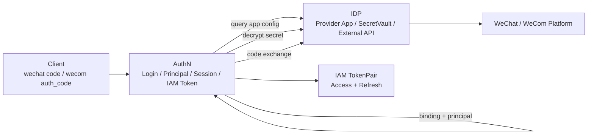
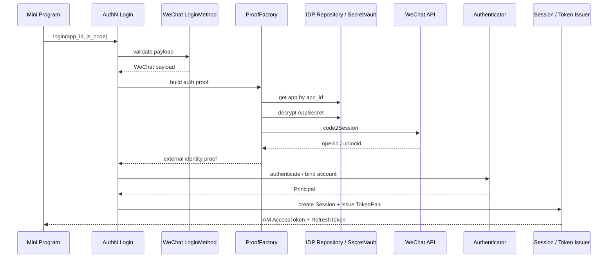
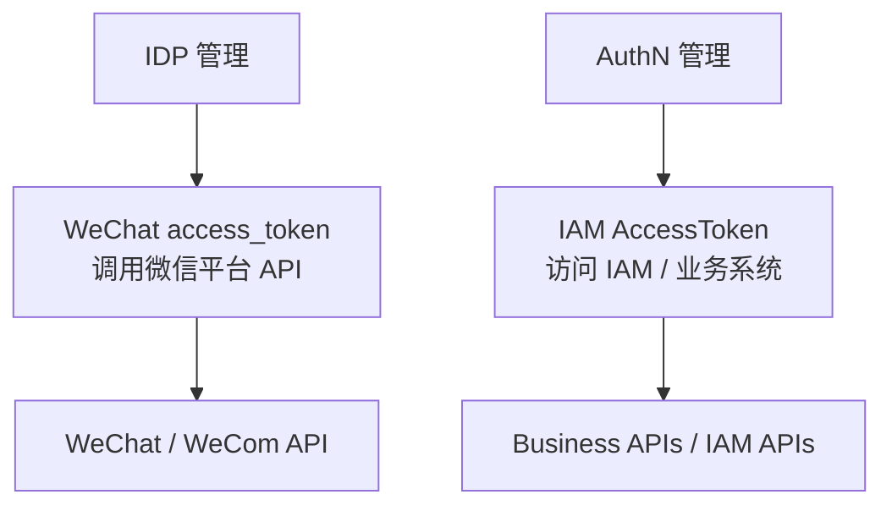
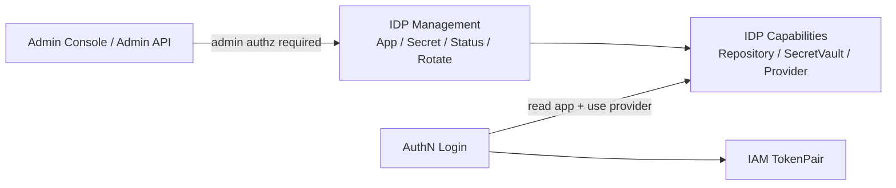

# 06-IDP 与第三方登录讲法

## 1. 本文定位

本文是 `07-宣讲/` 中用于对外讲解 IAM IDP 与第三方登录的表达材料。

它不替代 AuthN 事实层文档，也不替代 IDP 源码。

事实层文档负责回答：

```text
第三方登录如何进入 AuthN；
IDP 与 AuthN 如何协作；
WeChat / WeCom 登录链路如何处理；
IDP app、secret、外部身份源 API 的事实源在哪里。
```

本文负责回答：

```text
面试或技术分享中，IDP 应该怎么讲？
为什么 IDP 不是 AuthN？
为什么第三方登录最终仍由 AuthN 签发 IAM Token？
微信 access_token 和 IAM AccessToken 有什么区别？
SecretVault 为什么重要？
微信 / 企微登录链路怎么讲才清楚？
IDP 如何与 AuthN、Identity、SDK、管理接口协作？
```

一句话：

> 本文负责把 IDP 和第三方登录的事实层设计，整理成一套能面试、能白板、能技术分享、能被追问的第三方身份源表达。

---

## 2. IDP 一句话

最推荐说法：

```text
IDP 是 IAM 的第三方身份源基础设施模块，负责外部应用配置、密钥托管、平台访问凭证和外部 API 适配；真正的登录判定、账号绑定、Principal、Session、AccessToken 与 RefreshToken 签发仍由 AuthN 统一完成。
```

更短版：

```text
IDP 负责外部身份源如何接入，AuthN 负责外部身份能否成为 IAM 登录态。
```

再短一点：

```text
IDP 管第三方身份源，AuthN 管 IAM 登录态。
```

不要把 IDP 讲成：

```text
微信登录模块；
AuthN 登录模块；
Token 签发模块；
普通配置表；
微信 SDK 工具包。
```

---

## 3. 30 秒讲法

```text
IAM 里的 IDP 不是登录模块，而是第三方身份源基础设施模块。它负责微信、企微等外部应用配置、AppSecret / CorpSecret 的 SecretVault 管理、平台 access_token 缓存和外部 API 适配。真正的登录链路仍然由 AuthN 编排：客户端提交微信 code 或企微 auth_code 后，AuthN 的 LoginMethod / ProofFactory 从 IDP 查询应用配置、解密 secret、调用外部身份源完成 code exchange，然后再由 AuthN 完成账号绑定、Principal、Session、AccessToken 和 RefreshToken 签发。这样能保证密码登录、微信登录、企微登录最终共享同一套 Session、Refresh、Verify、Revoke 和 JWKS 语义。
```

适合场景：

```text
面试官问“第三方登录怎么做”；
技术分享中快速介绍 IDP；
从 AuthN 过渡到第三方身份源。
```

---

## 4. 1 分钟讲法

```text
IDP 这块最重要的是边界。第三方登录很容易写成“微信 code2Session 成功后直接发 IAM Token”，但这样会让微信登录、企微登录、密码登录各自形成一套 token、session、refresh、revoke 语义。

所以在 IAM 中，IDP 只做第三方身份源基础设施。比如微信应用的 AppID、AppSecret、应用状态、凭据轮换、微信平台 access_token 缓存、微信 / 企微 API 调用都归 IDP 管。IDP 通过 Repository、SecretVault、AuthProvider 等能力提供给 AuthN 使用。

真正的登录入口仍在 AuthN。用户提交微信 code 或企微 auth_code 后，AuthN 的 LoginMethod 和 ProofFactory 会从 IDP 拿应用配置和密钥，构造领域 proof，交给 Authenticator 做认证。认证成功后得到 Principal，再由 AuthN 创建 Session，并签发 AccessToken 和 RefreshToken。

这样做的价值是：外部身份源可以独立治理，但 IAM 登录态保持统一。
```

适合场景：

```text
面试项目介绍中的 IDP 部分；
技术分享第三方登录章节；
回答“为什么 IDP 不直接发 Token”。
```

---

## 5. 3 分钟讲法

```text
我讲 IDP 与第三方登录时，会先强调一个边界：IDP 不是登录模块，它是外部身份源基础设施模块。真正的认证、账号绑定和 IAM Token 签发仍然由 AuthN 统一负责。

为什么要这样拆？因为第三方登录涉及两类完全不同的问题。第一类是外部平台基础设施问题，比如微信应用配置、AppSecret 加密、微信 access_token 缓存、微信 code2Session、企业微信 corp secret、agent_id、外部 API 调用和平台 token 生命周期。这些属于 IDP。第二类是 IAM 内部认证问题，比如这个外部身份是否绑定了 IAM LoginIdentity，应该对应哪个 User，User 或账号状态是否可用，是否创建 Session，是否签发 AccessToken 和 RefreshToken。这些属于 AuthN。

以微信小程序登录为例，客户端提交 app_id 和 js_code。AuthN 的微信登录方法会校验 payload，并通过 ProofFactory 从 IDP 查询对应 WeChat App，检查应用是否启用，再通过 SecretVault 解密 AppSecret，然后调用微信 code2Session 拿到 openid / unionid。注意，code2Session 成功只证明这个 code 对应某个微信外部身份，不等于 IAM 登录成功。后续仍要检查这个外部身份是否绑定 IAM LoginIdentity / User，账号状态是否正常，然后才能产出 Principal。

企业微信登录类似，只是外部身份源换成 corp_id、auth_code、agent_id 和企微 API。这里有一个安全点：agent_id 这类服务端配置不应该完全信任客户端传入，而应来自 IDP 管理配置或服务端配置。AuthN 只是借用 IDP 提供的配置、secret 和 provider 能力，登录态仍由 AuthN 统一管理。

还有一个容易混淆的概念：微信 access_token 不是 IAM AccessToken。微信 access_token 是调用微信平台 API 的凭证，属于 IDP 的外部平台凭证；IAM AccessToken 是用户访问 IAM 或业务系统的访问凭证，属于 AuthN 的登录态凭证。二者名字相似，但用途、生命周期、安全边界完全不同。

这套设计的价值是：第三方身份源可以独立管理和审计，secret 可以集中托管，外部 provider 可以扩展；同时所有登录方式最终都走同一套 Principal、Session、AccessToken、RefreshToken、Verify、Revoke 和 JWKS 机制，不会出现每个登录方式一套 Token 的混乱。
```

适合场景：

```text
面试深聊第三方登录；
技术分享 IDP 章节；
回答“微信登录为什么不直接发 IAM Token”。
```

---

## 6. 推荐讲解顺序

不要从微信 SDK 开始讲。

推荐顺序：

```text
1. 先讲问题：第三方登录容易污染 AuthN；
2. 再讲边界：IDP 管身份源，AuthN 管登录态；
3. 再讲 IDP 核心能力：App、SecretVault、Provider、平台 token；
4. 再讲第三方登录如何进入 AuthN；
5. 再讲微信 access_token 与 IAM AccessToken 区别；
6. 再讲管理面安全；
7. 最后讲扩展到更多 provider 的方式。
```

### 6.1 先讲问题

```text
如果每种第三方登录都自己签 Token，IAM 登录态会分裂。
```

### 6.2 再讲边界

```text
IDP 只管理外部身份源基础设施，AuthN 统一管理 Principal、Session 和 Token。
```

### 6.3 再讲核心能力

```text
Provider App；
SecretVault；
External AuthProvider；
Platform access_token cache；
Admin management API。
```

### 6.4 再讲登录链路

```text
第三方 code -> IDP code exchange -> external identity -> AuthN binding -> Principal -> Session -> TokenPair。
```

### 6.5 最后讲安全边界

```text
secret 脱敏；
管理接口授权；
平台 token 与 IAM token 分离；
高信任 SDK/gRPC 接入控制。
```

---

## 7. 白板图讲法

### 7.1 图一：IDP 与 AuthN 边界



讲图时说：

```text
IDP 只提供外部身份源能力，AuthN 仍然是登录编排者和 IAM Token 签发者。
```

---

### 7.2 图二：微信小程序登录链路



讲图时说：

```text
code2Session 只能证明外部微信身份，不等于 IAM 登录成功。必须经过 AuthN 的账号绑定、Principal 和 Token 签发链路。
```

---

### 7.3 图三：两个 access token 的区别



讲图时说：

```text
微信 access_token 和 IAM AccessToken 名字像，但完全不是一回事。前者属于外部平台访问令牌，后者属于 IAM 登录态访问凭证。
```

---

### 7.4 图四：IDP 管理面与登录面的分离



讲图时说：

```text
IDP 管理面用于维护第三方应用和密钥，必须受管理权限保护；登录面只是 AuthN 使用 IDP capabilities 完成外部身份解析。
```

---

## 8. IDP 要讲清楚的核心概念

### 8.1 Provider App

Provider App 是第三方身份源应用配置。

讲法：

```text
Provider App 管的是微信小程序、企微应用等外部身份源应用的 app_id、corp_id、name、type、status 和凭据引用。
```

当前如果代码中仍以 WechatApp 命名，可以这样讲：

```text
当前实现以 WechatApp / WeCom 相关配置为主，未来可以演进为更通用的 ProviderApp 模型。
```

---

### 8.2 SecretVault

SecretVault 是密钥托管能力。

讲法：

```text
AppSecret / CorpSecret 不应该明文散落在登录代码里，而应该由 IDP 的 SecretVault 加密、解密、脱敏和后续轮换。
```

关键词：

```text
Encrypt；
Decrypt；
Sign；
redaction；
KMS/HSM 可演进。
```

---

### 8.3 Platform access_token

平台 access_token 是调用外部平台 API 的凭证。

讲法：

```text
微信 access_token 属于 IDP，用于调用微信平台 API；它不是用户访问业务系统的 IAM AccessToken。
```

---

### 8.4 External AuthProvider

External AuthProvider 是外部身份源 API 适配能力。

讲法：

```text
AuthN 不应该到处散落微信 SDK 或企微 SDK 调用，而是通过 IDP 提供的 Provider 完成 code exchange、token refresh 和外部身份解析。
```

---

### 8.5 LoginMethod / ProofFactory

LoginMethod / ProofFactory 是第三方登录进入 AuthN 的应用层入口。

讲法：

```text
LoginMethod 校验第三方登录 payload，ProofFactory 从 IDP 拿配置和密钥并构造 AuthN 领域 proof，后续仍由 AuthN 完成账号绑定、Principal、Session 和 Token。
```

---

## 9. IDP 的设计亮点讲法

### 9.1 亮点一：IDP 与 AuthN 分离

推荐说法：

```text
IDP 管外部身份源基础设施，AuthN 管 IAM 登录态。
```

价值：

```text
避免每种第三方登录各自签一套 IAM Token。
```

---

### 9.2 亮点二：SecretVault 集中密钥治理

推荐说法：

```text
AppSecret / CorpSecret 通过 SecretVault 托管，登录链路只在需要时使用解密结果。
```

价值：

```text
避免 secret 明文散落，后续可以演进到云 KMS 或 HSM。
```

---

### 9.3 亮点三：平台 token 与 IAM token 分离

推荐说法：

```text
微信 access_token 调微信平台 API，IAM AccessToken 访问 IAM 和业务系统。
```

价值：

```text
避免两个 access token 语义混淆，降低安全事故风险。
```

---

### 9.4 亮点四：IDP REST 是管理面，不是登录面

推荐说法：

```text
IDP REST 管第三方应用配置、凭据轮换、启用禁用和平台 token 管理，必须经过管理权限控制。
```

价值：

```text
管理面和登录面分离，降低 secret 泄露和未授权配置变更风险。
```

---

### 9.5 亮点五：第三方登录最终归一到 Principal

推荐说法：

```text
微信、企微、密码登录最终都归一到 AuthN Principal、Session 和 TokenPair。
```

价值：

```text
登录态语义统一，后续 Verify、Refresh、Revoke、JWKS 都能复用。
```

---

### 9.6 亮点六：可扩展到更多 Provider

推荐说法：

```text
当前以微信 / 企微为主，边界上可以扩展到 OIDC、OAuth2、飞书、钉钉等身份源。
```

注意：

```text
如果代码尚未实现通用 Provider，不要说“已经支持所有 Provider”，只能说“边界支持后续演进”。
```

---

## 10. IDP 与其他模块的关系

### 10.1 IDP 与 AuthN

```text
IDP 提供配置、密钥和外部 API 能力；AuthN 负责统一登录链路。
```

讲法：

```text
AuthN 是登录编排者，IDP 是外部身份源能力提供者。
```

---

### 10.2 IDP 与 Identity

```text
外部 openid / unionid / userid 不是 IAM User。
```

讲法：

```text
外部身份源返回的是外部身份标识，AuthN 通过 LoginIdentity / 账号绑定映射到 IAM User，Identity 提供本地 User 身份锚点。
```

---

### 10.3 IDP 与 SDK

```text
SDK 可以封装 IDP 管理或查询能力，但这属于高信任内部接入能力。
```

讲法：

```text
如果 IDP API 可能访问 app secret、凭据状态或管理能力，就必须通过 service token、mTLS、ACL 和 audit 限制调用方。
```

---

### 10.4 IDP 与运维

```text
IDP 涉及 secret、外部平台 token、provider API 和缓存。
```

讲法：

```text
IDP 不只是代码逻辑，还需要密钥治理、缓存治理、脱敏日志和管理面权限保护。
```

---

### 10.5 IDP 与 AuthZ

```text
IDP 管理接口需要 AuthZ 保护。
```

讲法：

```text
创建应用、启用禁用应用、轮换凭据、读取平台 token 这类操作属于管理权限，应由 IAM 自己的认证和授权体系保护。
```

---

## 11. 面试回答模板

### Q1：IDP 和 AuthN 的边界是什么？

```text
IDP 负责第三方身份源基础设施，比如微信/企微应用配置、SecretVault、平台 access_token 和外部 API 适配；AuthN 负责登录判定、账号绑定、Principal、Session 和 IAM Token 签发。IDP 说明外部身份源如何接入，AuthN 决定这个外部身份能不能成为 IAM 登录态。
```

---

### Q2：为什么不让 IDP 直接签发 IAM Token？

```text
如果 IDP 直接签发 Token，就会导致微信登录、企微登录、密码登录各自形成一套 token、session、refresh、revoke 语义。IAM 需要所有登录方式最终走同一套 AuthN 登录态，所以 IAM AccessToken 和 RefreshToken 必须由 AuthN 统一签发。
```

---

### Q3：微信 code2Session 成功后为什么还不算 IAM 登录成功？

```text
code2Session 只能证明这个 code 对应某个微信 openid 或 unionid，不能证明这个外部身份已经绑定 IAM LoginIdentity，也不能证明 User/Account 状态正常，更不能创建 IAM Session。只有 AuthN 完成绑定检查并认证出 Principal 后，才算 IAM 登录成功。
```

---

### Q4：微信 access_token 和 IAM AccessToken 有什么区别？

```text
微信 access_token 是调用微信平台 API 的凭证，由 IDP 管；IAM AccessToken 是用户或服务访问 IAM/业务系统的访问凭证，由 AuthN 管。它们名字相似，但所属系统、用途、生命周期和安全边界完全不同。
```

---

### Q5：SecretVault 在这里解决什么问题？

```text
SecretVault 负责 AppSecret、CorpSecret 等外部身份源密钥的加密、解密、脱敏和后续托管。这样 AuthN 只在需要构造 proof 时借用解密结果，不负责密钥生命周期，后续也可以替换成 KMS 或 HSM。
```

---

### Q6：企业微信登录有什么安全点？

```text
企业微信登录中，corp_id 和 auth_code 可能来自客户端，但 agent_id 这类敏感配置不应完全信任客户端传入，应该来自服务端配置或 IDP 应用配置。AuthN ProofFactory 会查询 IDP 中的应用配置，检查启用状态，通过 SecretVault 解密 CorpSecret，最后才构造外部身份 proof。
```

---

### Q7：IDP REST 为什么要管理权限保护？

```text
因为 IDP REST 是管理面，涉及外部应用创建、启用禁用、凭据轮换、平台 access_token 获取和刷新。这些都是高敏操作，必须受认证和授权保护。不能把 IDP 管理接口当成普通公开登录接口。
```

---

### Q8：未来如果接入更多第三方平台怎么办？

```text
可以沿用同样边界：IDP 管 provider 配置、secret、外部 API 和平台 token；AuthN 管登录态、账号绑定、Principal、Session 和 IAM Token。当前如果只实现了微信/企微，就应诚实说当前实现范围，未来可从 WeChat/WeCom 模型演进到更通用的 ProviderApp / ProviderCredential / ProviderTokenCache。
```

---

### Q9：IDP 出问题会不会影响登录？

```text
会影响依赖第三方身份源的登录方式，比如微信或企微登录，因为 AuthN 需要通过 IDP 查询应用配置、解密 secret、调用外部 API。但密码登录、已有 AccessToken 的本地验签等能力不一定受同样影响。具体要看登录方式和验证路径。
```

---

### Q10：第三方账号和 IAM User 如何关联？

```text
第三方平台返回的是 openid、unionid、userid 等外部标识。AuthN 会把这些外部身份映射到 IAM 的 LoginIdentity 或账号绑定关系，再关联本地 User。外部标识不是 IAM User，本地 User 才是系统内部身份锚点。
```

---

## 12. 不推荐的 IDP 讲法

### 12.1 说成“微信登录模块”

```text
IDP 是微信登录模块。
```

问题：

```text
太窄，并且容易让人以为 IDP 负责签发 IAM Token。
```

正确说法：

```text
IDP 是第三方身份源基础设施，微信/企微只是当前实现。
```

---

### 12.2 说成“code2Session 成功就是登录成功”

```text
微信 code2Session 成功后就登录成功。
```

问题：

```text
错误。code2Session 只证明外部微信身份，还要经过 IAM LoginIdentity 绑定、User/Account 状态检查、Principal 和 Session / Token 签发。
```

---

### 12.3 混淆两个 access token

```text
微信 access_token 就是用户 token。
```

问题：

```text
严重错误。微信 access_token 调微信 API，IAM AccessToken 访问业务 API。
```

---

### 12.4 说 IDP 发 JWT

```text
IDP 登录后发 JWT。
```

问题：

```text
错误。IAM 登录态 Token 由 AuthN 统一签发。
```

---

### 12.5 说 AppSecret 在登录代码里配置

```text
登录代码里配置微信 AppSecret。
```

问题：

```text
不安全。AppSecret / CorpSecret 应由 IDP 的 SecretVault 管理。
```

---

### 12.6 把未来 Provider 说成已完成能力

```text
我们已经支持所有 OAuth/OIDC Provider。
```

问题：

```text
如果代码当前只实现微信/企微，这就是夸大。应该说边界支持后续扩展，而不是已完成所有 provider。
```

---

## 13. 证据链索引

| 讲法 | 证据 |
| --- | --- |
| 第三方登录最终回到 AuthN | `docs/02-认证AuthN/07-第三方登录与IDP协作-WeChat-WeCom.md` |
| AuthN 登录链路从请求到 Principal | `docs/02-认证AuthN/03-Login链路-从登录请求到Principal.md` |
| Principal 到 TokenPair | `docs/02-认证AuthN/04-Token链路-从Principal到AccessToken与RefreshToken.md` |
| Session 与 Token 边界 | `docs/02-认证AuthN/05-Session与Token边界-Principal-Session-AccessToken-RefreshToken.md` |
| IDP 与接入契约 | `docs/05-接入与契约` |
| 架构护栏与事实源规则 | `docs/06-架构护栏` |
| 外部身份源 app、secret、provider 事实 | `internal/apiserver/domain/idp`、`internal/apiserver/application/idp`、`internal/apiserver/infra/idp` |
| 第三方登录 proof / method 事实 | `internal/apiserver/application/authn/login` |

不要把已归档的专题分析作为当前证据源。

---

## 14. 简历项目描述版本

```text
设计并实现 IAM IDP 与第三方登录协作边界，将微信/企微应用配置、SecretVault 密钥托管、平台 access_token 缓存和外部 API 适配收敛到 IDP 模块中，认证登录态统一由 AuthN 处理。微信/企微登录通过 AuthN LoginMethod 和 ProofFactory 从 IDP 查询应用配置、解密 AppSecret/CorpSecret、调用外部身份源构造 proof，再由 AuthN 完成 LoginIdentity 绑定、Principal、Session、AccessToken 和 RefreshToken 签发，避免第三方身份源直接污染 IAM 登录态模型。
```

可以按真实贡献再压缩。

不要把尚未完整实现的通用 OAuth/OIDC Provider、完整多 IDP 管理平台或企业级 KMS 能力说成已完成能力。

---

## 15. 30 分钟分享中的位置

如果做 30 分钟技术分享，IDP 建议占：

```text
3～4 分钟
```

结构：

```text
1 分钟：IDP 与 AuthN 边界；
1 分钟：微信/企微登录链路；
1 分钟：SecretVault 与 token 区分；
1 分钟：管理面安全和常见追问。
```

不要在 IDP 部分过度展开微信 SDK 细节。

重点讲：

```text
边界；
密钥；
平台 token；
IAM 登录态统一。
```

---

## 16. 本文总结

IDP 与第三方登录讲法的核心是：

```text
不要把 IDP 讲成微信登录模块。
```

应该讲成：

```text
IDP 管第三方身份源基础设施；
AuthN 管 IAM 登录态。
```

最推荐的表达：

```text
IAM 中的 IDP 负责微信/企微等外部应用配置、SecretVault、平台 access_token 和外部 API 适配。微信或企微登录时，AuthN LoginMethod / ProofFactory 会向 IDP 查询应用配置、解密 secret、调用外部身份源构造 proof，但真正的账号绑定、Principal、Session、AccessToken 和 RefreshToken 仍由 AuthN 统一处理。这样既能独立治理第三方身份源，又能保证所有登录方式最终共享同一套 IAM 登录态和 Token 生命周期。
```

如果只记住一句话：

```text
IDP 不是登录模块，而是第三方身份源基础设施；第三方身份解析完成后，仍必须回到 AuthN 的 LoginIdentity、Principal、Session 和 Token 链路。
```
