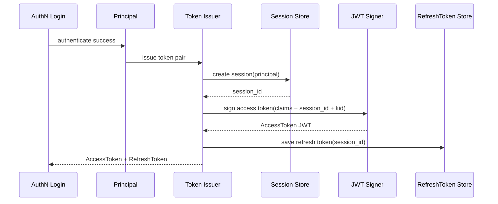
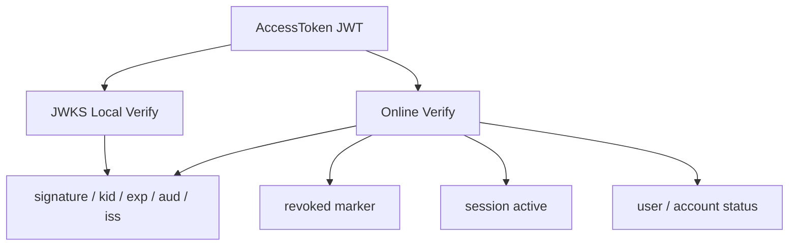
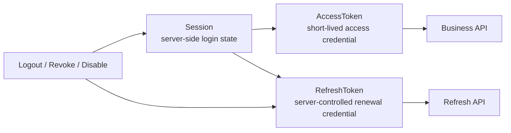
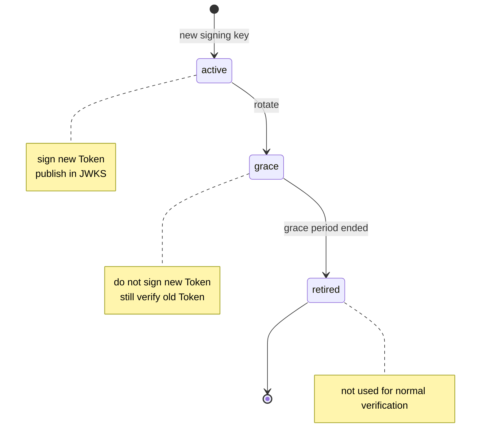

# 07-JWKS 与 Token 安全讲法

## 1. 本文定位

本文是 `07-宣讲/` 中用于对外讲解 IAM Token 安全体系的表达材料。

它不替代 `docs/02-认证AuthN/` 下的事实层文档，也不替代源码。

事实层文档负责回答：

```text
Principal 如何变成 AccessToken 与 RefreshToken；
Session、AccessToken、RefreshToken 的边界是什么；
JWT / JWS / JWK / JWKS 分别是什么；
KeyRotation 如何工作；
本地验签与在线 Verify 如何取舍；
事实源在哪里。
```

本文负责回答：

```text
面试或技术分享中，Token 安全应该怎么讲？
为什么不能只发一个长期 JWT？
AccessToken、RefreshToken、Session 如何分工？
JWKS 解决什么问题？
在线 Verify 解决什么问题？
KeyRotation 为什么需要 active / grace / retired？
Service Token 和用户 Token 有什么区别？
如何讲出 Token 安全设计的工程价值？
```

一句话：

> 本文负责把 Token 安全的事实层设计，整理成一套能面试、能白板、能技术分享、能被追问的认证安全表达。

---

## 2. Token 安全一句话

最推荐说法：

```text
IAM 的 Token 安全体系不是简单 JWT 登录，而是用短期 AccessToken、服务端可控 RefreshToken、在线 Session 锚点、JWKS 公钥分发和在线 Verify 状态检查，共同解决跨服务认证、Token 撤销、登录态续期、密钥轮换和高低风险场景分层验证问题。
```

更短版：

```text
JWKS 证明 Token 签名可信，在线 Verify 证明 Token 当前可用，Session 和 RefreshToken 负责让登录态可撤销、可续期、可治理。
```

再短一点：

```text
Token 安全不是发 JWT，而是 Session、AccessToken、RefreshToken、JWKS、Verify 的组合。
```

不要把它讲成：

```text
JWT 登录；
无状态登录；
发一个长期 Token；
RefreshToken 也是 JWT；
JWKS 可以证明用户仍然有效。
```

---

## 3. 30 秒讲法

```text
IAM 的 Token 安全不是简单发一个 JWT。认证成功后，AuthN 会先基于 Principal 创建 Session，再签发短期 AccessToken，并保存或管理服务端可控的 RefreshToken。AccessToken 是短期访问凭证，适合业务请求携带和通过 JWKS 本地验签；RefreshToken 是续期凭证，绑定 Session，支持撤销、轮换和服务端控制；Session 是在线登录态锚点，在线 Verify 和 Refresh 都会检查 Session 是否 active。JWKS 负责把公钥发布给业务服务做本地验签，在线 Verify 则在验签之外检查 Token 是否 revoked、Session 是否 active、User/Account 是否仍可用。
```

适合场景：

```text
面试官问“Token 怎么设计”；
技术分享中快速介绍 Token 安全；
从 AuthN 登录链路过渡到安全治理。
```

---

## 4. 1 分钟讲法

```text
Token 安全这块，我主要从三层讲。

第一层是凭证分工。AccessToken 是短期访问凭证，适合每次请求携带；RefreshToken 是长期续期凭证，但必须服务端保存、可撤销、可轮换；Session 是一次在线登录态，AccessToken 和 RefreshToken 都应该绑定 Session。

第二层是验证策略。业务服务可以通过 JWKS 本地验签，验证 JWT 签名、kid、exp、issuer、audience，这适合低风险高吞吐场景。但 JWKS 只能证明 Token 是 IAM 签的，不能证明登录态仍然有效。高风险场景要调用在线 Verify，在线 Verify 会检查 revoked marker、Session active，以及 User/Account 状态。

第三层是密钥治理。AccessToken 签发时会使用 active signing key，并在 JWT header 中写入 kid；JWKS endpoint 发布可用于验签的公钥。KeyRotation 时旧 key 进入 grace 还能验旧 Token，新 key 负责签新 Token，最后 retired 不再用于正常验签。
```

适合场景：

```text
面试项目介绍中的 Token 安全部分；
技术分享 JWKS / Verify 章节；
回答“为什么不只用 JWT”。
```

---

## 5. 3 分钟讲法

```text
IAM 的 Token 安全设计，我会先强调一个前提：JWT 本身只能证明 Token 没被篡改，并且是某个私钥签发的，但它不能证明用户当前仍然允许访问系统。因此我没有把登录态设计成一个长期 JWT，而是拆成 Session、AccessToken、RefreshToken、JWKS 和在线 Verify。

登录签发时，AuthN 认证成功会得到 Principal。Token 链路首先基于 Principal 创建 Session，Session 是服务端可控的登录态锚点；然后在 AccessToken 里写入 user_id、tenant_id、session_id、auth method、AMR 等 claims，使用当前 active signing key 签名，并把 kid 写到 JWT header；最后生成 RefreshToken，并把 RefreshToken 与 SessionID、UserID、TenantID、过期时间等信息保存到服务端 store。

验证时有两种模式。第一种是 JWKS 本地验签。业务服务拿到 AccessToken 后，根据 header 里的 kid 从 JWKS 找公钥，验证签名和 exp、aud、iss 等静态 claims。这种方式性能好，适合低风险高吞吐场景。第二种是在线 Verify。在线 Verify 先验 JWT，再检查 revoked marker，然后通过 session_id 加载 Session，确认 Session active，最后检查 User/Account 状态。如果用户被 block、账号 disabled、session revoked，即使 JWT 签名有效，在线 Verify 也会失败。

Refresh 也不是简单换一个 Token。系统会从服务端 store 读取 RefreshToken，再加载 Session，检查 Session active 和 User/Account 状态；通过后签发新的 TokenPair，删除或失效旧 RefreshToken，并根据策略延长 Session 或更新 refresh 窗口。这样 RefreshToken 是可控的，不是一个不可撤销的长期 JWT。

密钥方面，JWT 签发用 active key，验签通过 kid 找 verification key。JWKS 只发布适合验证当前有效 Token 的公钥。active key 用来签新 Token，grace key 用来验旧 Token，retired key 不再发布或不再用于正常验签。这样能实现平滑 KeyRotation。

所以这套设计的价值是：低风险请求可以走本地验签获得性能，高风险请求可以走在线 Verify 获得状态安全；短期 AccessToken 降低泄露窗口，服务端 RefreshToken 和 Session 提供撤销与续期能力，JWKS 和 KeyRotation 支持跨服务验签和密钥平滑演进。
```

适合场景：

```text
面试深聊 Token 安全；
技术分享 JWKS / Verify / KeyRotation；
回答“Token 安全体系的设计亮点是什么”。
```

---

## 6. 推荐讲解顺序

不要从 JWT 开始讲。

推荐顺序：

```text
1. 先讲问题：长期 JWT 无法精确撤销；
2. 再讲 Session / AccessToken / RefreshToken 分工；
3. 再讲 Token 签发链路；
4. 再讲 JWKS 本地验签；
5. 再讲在线 Verify 状态检查；
6. 再讲 RefreshToken 轮换；
7. 再讲 KeyRotation；
8. 最后讲 Service Token 与用户 Token 边界。
```

### 6.1 先讲问题

```text
JWT 只能证明签名可信，不能证明登录态当前仍然有效。
```

### 6.2 再讲凭证分工

```text
AccessToken 负责访问；
RefreshToken 负责续期；
Session 负责服务端状态控制。
```

### 6.3 再讲验证分层

```text
JWKS 本地验签用于低风险高吞吐；
在线 Verify 用于高风险强状态。
```

### 6.4 最后讲密钥治理

```text
active key 签新 Token，grace key 验旧 Token，retired key 退出正常验证路径。
```

---

## 7. 白板图讲法

### 7.1 图一：登录签发链路



讲图时说：

```text
签发不是直接发 JWT，而是先创建 Session，再签发 AccessToken，并保存 RefreshToken。Session 是登录态锚点。
```

---

### 7.2 图二：JWKS 本地验签 vs 在线 Verify



讲图时说：

```text
JWKS 只做密码学和静态 claims 验证，在线 Verify 多了撤销、Session、User/Account 状态检查。两者不是替代关系。
```

---

### 7.3 图三：Session / AccessToken / RefreshToken 边界



讲图时说：

```text
AccessToken 负责访问，RefreshToken 负责续期，Session 负责状态控制。撤销、登出、禁用最终要影响 Session 或 RefreshToken，而不是只等 JWT 过期。
```

---

### 7.4 图四：KeyRotation



讲图时说：

```text
active key 签新 Token，grace key 验旧 Token，retired key 退出正常验证路径。这个状态机让密钥轮换不影响旧 Token 的平滑过渡。
```

---

## 8. Token 安全要讲清楚的核心概念

### 8.1 AccessToken

AccessToken 是短期访问凭证。

讲法：

```text
AccessToken 适合每次业务请求携带，通常用 JWT/JWS 承载，可以被业务服务本地验签，也可以交给 IAM 在线 Verify。
```

关键点：

```text
短 TTL；
claims；
session_id；
header kid；
JWKS verify；
online Verify。
```

---

### 8.2 RefreshToken

RefreshToken 是服务端可控的续期凭证。

讲法：

```text
RefreshToken 不是另一个长期访问 Token，也不应该被业务 API 使用。它的核心价值是服务端保存、可撤销、可轮换、绑定 Session。
```

关键点：

```text
随机值；
服务端保存；
可撤销；
可轮换；
绑定 SessionID；
只用于 refresh。
```

---

### 8.3 Session

Session 是在线登录态锚点。

讲法：

```text
Session 不是浏览器 session，而是 IAM 记录的一次登录会话。只要 Session 被 revoke，在线 Verify 和 Refresh 都应该失败。
```

关键点：

```text
SessionID；
UserID；
TenantID；
active / revoked / expired；
refresh window。
```

---

### 8.4 JWKS

JWKS 是公钥发布机制。

讲法：

```text
JWKS 让业务服务可以根据 Token header 里的 kid 找到公钥，本地验证 JWT/JWS 签名。
```

关键点：

```text
public keys only；
kid；
JWK Set；
Cache-Control；
active / grace keys。
```

---

### 8.5 在线 Verify

在线 Verify 是当前可用性判断。

讲法：

```text
在线 Verify 不是远程 parse JWT，而是在验签之外继续检查 revoked marker、Session active、User/Account 状态。
```

关键点：

```text
signature；
expired；
revoked marker；
session active；
user/account status。
```

---

### 8.6 KeyRotation

KeyRotation 是签名密钥平滑演进机制。

讲法：

```text
active key 签新 Token，grace key 验旧 Token，retired key 退出正常验证路径。
```

关键点：

```text
kid；
active；
grace；
retired；
JWKS publish window；
old token verification window。
```

---

### 8.7 Service Token

Service Token 是服务身份凭证。

讲法：

```text
Service Token 表达服务身份，不应该伪装成管理员用户登录，也不走用户 Session / RefreshToken 语义。
```

关键点：

```text
service identity；
audience；
TTL；
no user session；
mTLS / ACL / audit 可增强。
```

---

## 9. 设计亮点讲法

### 9.1 亮点一：JWT 不承担完整登录态

推荐说法：

```text
JWT 只做短期 AccessToken，完整登录态由 Session + RefreshToken 管理。
```

价值：

```text
避免长期 JWT 无法精确撤销的问题。
```

---

### 9.2 亮点二：Access / Refresh 分工清楚

推荐说法：

```text
AccessToken 负责访问，RefreshToken 负责续期。
```

价值：

```text
AccessToken 可以短期化，RefreshToken 可以服务端控制。
```

---

### 9.3 亮点三：Session 支持在线撤销

推荐说法：

```text
AccessToken 和 RefreshToken 都绑定 Session。
```

价值：

```text
用户登出、封禁、账号禁用、Token revoke 可以影响旧登录态。
```

---

### 9.4 亮点四：JWKS 与在线 Verify 并存

推荐说法：

```text
JWKS 负责本地验签，在线 Verify 负责状态强一致。
```

价值：

```text
业务服务可以按风险选择性能或强状态安全。
```

---

### 9.5 亮点五：KeyRotation 有平滑过渡

推荐说法：

```text
active / grace / retired 支持签名密钥平滑轮换。
```

价值：

```text
新旧 Token 在轮换过程中都能被合理验证。
```

---

### 9.6 亮点六：Service Token 与用户 Token 分离

推荐说法：

```text
Service Token 不走用户 Session / RefreshToken 语义。
```

价值：

```text
服务身份与用户身份边界清楚，避免后台任务伪装管理员用户。
```

---

## 10. 与其他模块的关系

### 10.1 与 AuthN

```text
Token 安全是 AuthN 的核心能力。
```

讲法：

```text
Login 认证出 Principal，Token 链路创建 Session、签发 AccessToken、保存 RefreshToken，Verifier 负责在线状态判断。
```

---

### 10.2 与 Identity

```text
Verify 可以检查 User / Account 状态。
```

讲法：

```text
Token 是否有效，不只取决于签名，还取决于 User 是否 active、账号是否 disabled。
```

具体字段和状态以当前 AuthN / Identity 事实源为准。

---

### 10.3 与 IDP

```text
第三方登录最终也回到同一套 Session / Token。
```

讲法：

```text
微信/企微只是登录方式不同，IAM AccessToken 与 RefreshToken 仍由 AuthN 统一签发。
```

---

### 10.4 与 SDK

```text
SDK 可以提供 JWKSManager、TokenVerifier、AuthN.VerifyToken、ServiceAuth 等封装。
```

讲法：

```text
SDK 让业务服务按风险选择本地验签、在线 Verify 或 fallback 策略，但 SDK 不替代 IAM AuthN 事实源。
```

---

### 10.5 与 qs-server

```text
qs-server 通过 Bearer Token 接入 IAM。
```

讲法：

```text
前端登录 IAM 后携带 AccessToken 调用 qs-server，qs-server 可以通过 SDK/JWKS 本地验签或远程 Verify 得到 Principal，再按业务对象调用 AuthZ Check。
```

---

## 11. 面试回答模板

### Q1：为什么不只发一个长期 JWT？

```text
长期 JWT 最大问题是撤销困难。用户登出、被封禁、账号禁用后，只要 JWT 没过期，本地验签仍可能通过。所以 IAM 把登录态拆成短期 AccessToken、服务端 RefreshToken 和在线 Session。JWT 只做短期访问凭证，Session 和在线 Verify 负责当前状态。
```

---

### Q2：AccessToken 和 RefreshToken 怎么分工？

```text
AccessToken 是短期访问凭证，适合业务请求携带和 JWKS 验签；RefreshToken 是服务端保存的长期续期凭证，用于在 AccessToken 过期后换取新 Token。Refresh 时要检查 RefreshToken、Session 和 User/Account 状态，并在成功后轮换或失效旧 RefreshToken。
```

---

### Q3：为什么 RefreshToken 不做成普通长期 JWT？

```text
RefreshToken 的核心价值是服务端可控。它需要能被删除、轮换、绑定 Session，并且在泄露时能够精准撤销。如果做成完全无状态 JWT，撤销和重放检测都会困难。
```

---

### Q4：在线 Verify 比本地验签多做什么？

```text
本地验签只检查签名、kid、过期时间、issuer、audience 等静态条件。在线 Verify 在此基础上还会查 access token revoked marker、Session 是否 active、User/Account 是否仍允许访问。所以本地验签通过，不代表在线 Verify 一定通过。
```

---

### Q5：JWKS 是怎么支持 KeyRotation 的？

```text
JWT header 里带 kid，业务服务根据 kid 从 JWKS 找公钥。Key 有 active、grace、retired 三种状态：active 签新 Token 并发布；grace 不签新 Token，但仍可用于验旧 Token；retired 退出正常验证路径。这样可以平滑切换签名密钥。
```

---

### Q6：用户被 block 后旧 Token 怎么失效？

```text
如果只做本地 JWKS 验签，旧 Token 在过期前可能仍然有效。所以高风险请求要走在线 Verify。在线 Verify 会重新评估 User/Account 状态。如果用户被 block，即使 JWT 签名有效，Verify 也应该失败；系统也可以按 user/session 维度 revoke sessions，让旧登录态失效。
```

---

### Q7：Service Token 和用户 Token 有什么区别？

```text
用户 Token 绑定 User、LoginIdentity 和 Session，Verify 时要检查 Session 与 User/Account 状态。Service Token 表示服务身份，不应该伪装成某个管理员用户登录，也不走用户 Session / RefreshToken 语义。它应该通过 audience、TTL、service identity、mTLS、ACL 和审计来约束。
```

---

### Q8：JWKS endpoint 为什么要缓存控制？

```text
JWKS 是公钥集合，业务服务会频繁拉取。ETag、Last-Modified、Cache-Control 这类缓存机制可以减少重复传输，并支持客户端缓存。KeyRotation 时客户端可以根据缓存策略刷新公钥。
```

---

### Q9：AccessToken 泄露怎么办？

```text
第一，AccessToken TTL 应较短，降低泄露窗口；第二，可以记录 revoked marker，让在线 Verify 拒绝该 Token；第三，可以 revoke 对应 Session，让后续 Refresh 和在线 Verify 失败；第四，高风险场景不要只依赖本地验签，要走在线 Verify。
```

---

### Q10：为什么本地验签和在线 Verify 要并存？

```text
因为二者解决的问题不同。本地验签解决性能和跨服务低成本认证，适合低风险高吞吐；在线 Verify 解决状态强一致，适合高风险写操作、管理操作、账号状态变更后即时生效等场景。
```

---

## 12. 不推荐的讲法

### 12.1 “我们用 JWT 做登录”

问题：

```text
太浅，也容易暴露安全理解不足。
```

推荐改成：

```text
我们用 JWT 作为短期 AccessToken，但完整登录态由 Session 和 RefreshToken 管理。
```

---

### 12.2 “JWKS 可以证明用户有效”

问题：

```text
错误。JWKS 只证明签名可信，不能证明 Session active 或 User/Account 状态正常。
```

推荐改成：

```text
JWKS 证明 Token 是 IAM 签的，在线 Verify 证明 Token 当前仍可用。
```

---

### 12.3 “RefreshToken 也是长期 JWT”

问题：

```text
不推荐。RefreshToken 的关键是服务端可控、可撤销、可轮换。
```

推荐改成：

```text
RefreshToken 是服务端保存的续期凭证，不应该被业务 API 当访问凭证使用。
```

---

### 12.4 “KeyRotation 就是换一把 key”

问题：

```text
太粗。密钥轮换要考虑旧 Token 验签窗口和 JWKS 发布窗口。
```

推荐改成：

```text
active key 签新 Token，grace key 验旧 Token，retired key 退出正常验证路径。
```

---

### 12.5 “在线 Verify 就是远程 parse JWT”

问题：

```text
错误。在线 Verify 应在验签之外检查撤销、Session 和主体状态。
```

---

### 12.6 “Service Token 就是管理员用户 Token”

问题：

```text
错误。Service Token 是服务身份凭证，不应伪装成管理员用户登录。
```

---

## 13. 证据链索引

| 讲法 | 证据 |
| --- | --- |
| Token 链路从 Principal 到 AccessToken / RefreshToken | `docs/02-认证AuthN/04-Token链路-从Principal到AccessToken与RefreshToken.md` |
| Session 与 Token 边界 | `docs/02-认证AuthN/05-Session与Token边界-Principal-Session-AccessToken-RefreshToken.md` |
| JWT/JWS/JWK/JWKS 与 KeyRotation | `docs/02-认证AuthN/06-JWT-JWS-JWK-JWKS边界与KeyRotation.md` |
| AuthN Login 到 Principal | `docs/02-认证AuthN/03-Login链路-从登录请求到Principal.md` |
| SDK TokenVerifier / JWKS / Verify 接入 | `docs/05-接入与契约/03-SDK接入模型-Go服务端集成.md` |
| qs-server 通过 Token 接入 IAM | `docs/05-接入与契约/04-业务系统接入链路-qs-server接入 IAM 详解.md` |
| 架构护栏与事实源规则 | `docs/06-架构护栏` |
| Token / JWT / JWKS 代码事实 | `internal/apiserver/application/authn/token`、`internal/apiserver/infra/token` |
| REST JWKS endpoint 事实 | `internal/apiserver/transport/rest/authn` |

不要把已归档的专题分析作为当前证据源。

---

## 14. 简历项目描述版本

```text
设计并实现 IAM Token 安全体系，采用 Session + AccessToken + RefreshToken 的登录态模型：登录成功后先创建 Session，再签发带 SessionID 的短期 JWT AccessToken，并保存服务端可控的 RefreshToken；在线 Verify 在 JWT 验签之外继续检查 revoked marker、Session active 和 User/Account 状态；RefreshToken 刷新时检查 Session 和主体状态，并轮换或失效旧 RefreshToken。同时设计 JWKS 公钥发布与 active/grace/retired KeyRotation 机制，支持业务服务本地验签和高风险场景在线 Verify 并存。
```

可以按真实贡献再压缩。

不要把尚未完整实现的 mTLS、完整服务间 ACL、企业级 KMS/HSM 能力说成已完成能力。

---

## 15. 30 分钟分享中的位置

如果做 30 分钟技术分享，JWKS 与 Token 安全建议占：

```text
4～5 分钟
```

结构：

```text
1 分钟：为什么不能只用长期 JWT；
1 分钟：Session / Access / Refresh 分工；
1 分钟：在线 Verify 状态检查；
1 分钟：JWKS 与 KeyRotation；
1 分钟：常见追问。
```

不要在这里重复完整 AuthN 登录链路。

只需要强调：

```text
Login 产出 Principal；
Token 链路基于 Principal 创建 Session 并签发 TokenPair；
后续验证分为本地验签和在线 Verify。
```

---

## 16. 本文总结

JWKS 与 Token 安全讲法的核心是：

```text
不要把它讲成“用了 JWT”。
```

应该讲成：

```text
AccessToken = 短期访问凭证；
RefreshToken = 服务端可控续期凭证；
Session = 在线登录态锚点；
JWKS = 公钥分发与本地验签；
Online Verify = 当前可用性判断；
KeyRotation = 签名密钥平滑演进。
```

最推荐的表达：

```text
IAM 的 Token 安全体系不是简单 JWT 登录，而是 Session、AccessToken、RefreshToken、JWKS 和在线 Verify 的组合。AccessToken 是短期 JWT，适合业务请求携带和本地验签；RefreshToken 是服务端保存的续期凭证，支持撤销和轮换；Session 是在线登录态锚点；JWKS 负责公钥分发和跨服务本地验签；在线 Verify 则在验签之外检查 revoked marker、Session active 和 User/Account 状态。这样既能支持高吞吐本地验签，也能支持高风险场景的强一致认证状态判断。
```

如果只记住一句话：

```text
JWKS 证明 Token 签名可信，在线 Verify 证明 Token 当前可用，Session 和 RefreshToken 负责让登录态可撤销、可续期、可治理。
```
