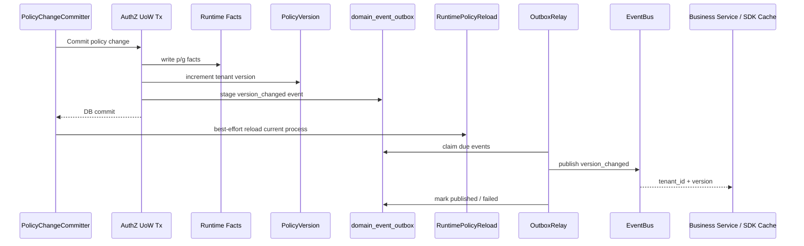
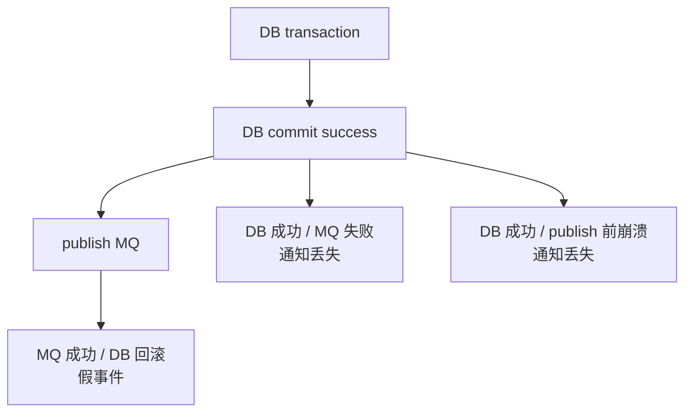
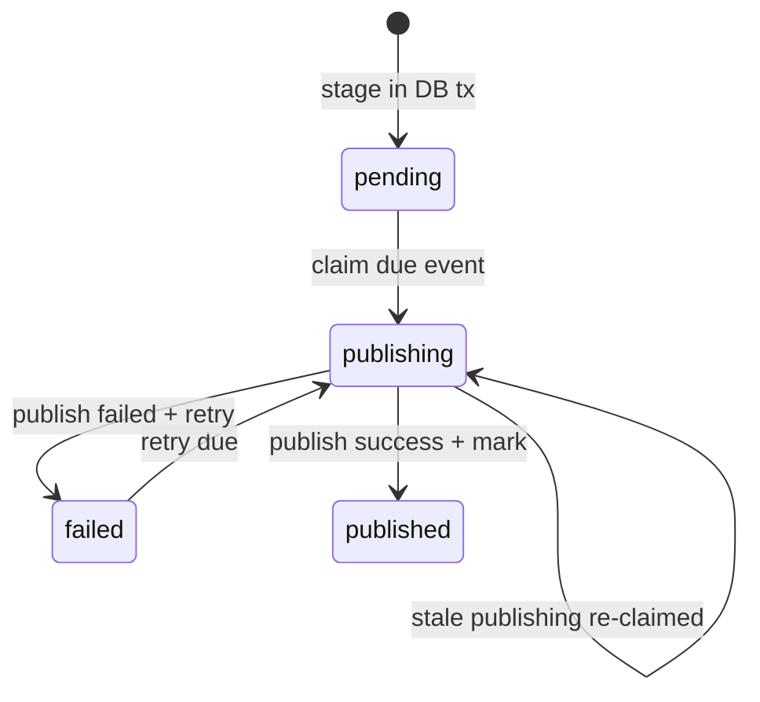
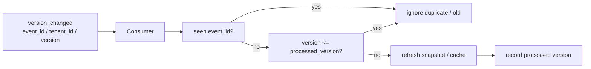

# 08-Outbox 与授权版本传播讲法

## 1. 本文定位

本文是 `07-宣讲/` 中用于对外讲解 IAM AuthZ 授权版本传播与 Transactional Outbox 的表达材料。

它不替代 `docs/03-授权AuthZ/` 下的事实层文档，也不替代源码。

事实层文档负责回答：

```text
授权写入为什么不是简单 CRUD；
PolicyChangeCommitter 如何提交授权变更；
PolicyVersion 如何递增；
Transactional Outbox 如何 stage 事件；
RuntimeReload 如何刷新当前进程策略；
Outbox Relay 如何异步发布事件；
事实源在哪里。
```

本文负责回答：

```text
面试或技术分享中，Outbox 应该怎么讲？
为什么授权变更需要传播？
为什么只 reload 当前进程不够？
为什么不能直接 DB commit 后 publish MQ？
PolicyVersion 是什么？
Outbox 解决什么一致性问题？
为什么 Outbox 通常是 at-least-once？
消费者为什么必须幂等？
如何把这套机制讲成工程亮点？
```

一句话：

> 本文负责把 AuthZ 授权版本传播与 Transactional Outbox 的事实层设计，整理成一套能面试、能白板、能技术分享、能被追问的工程一致性表达。

---

## 2. Outbox 一句话

最推荐说法：

```text
IAM 用 PolicyVersion + Transactional Outbox 传播授权变更：每次授权 facts 变化都会递增 tenant 级策略版本，并在同一个数据库事务中写入 version_changed 事件，之后由 Outbox Relay 异步发布，保证授权缓存失效和跨系统同步不会因为 MQ 失败而丢失。
```

更短版：

```text
Outbox 解决的是：授权事实已经变了，其他实例和业务系统必须最终可靠地知道。
```

再短一点：

```text
PolicyVersion 表达授权事实变了，Outbox 保证这个变化最终可靠传播。
```

不要把它讲成：

```text
用了 MQ；
发了一个事件；
异步通知一下；
保证 exactly-once；
runtime reload 就够了。
```

---

## 3. 30 秒讲法

```text
AuthZ 写入不是简单改数据库，因为权限变更会影响当前 IAM 实例、其他 IAM 实例、业务服务本地缓存和 SDK 授权快照。IAM 每次授权变更都会写授权 facts、递增 PolicyVersion，并 stage 一个 iam.authz.version_changed 事件。这个事件不能直接在 DB commit 后 publish MQ，否则会出现 DB 成功但 MQ 失败，或者 MQ 成功但 DB 回滚的问题。所以系统使用 Transactional Outbox，把授权 facts、PolicyVersion 和 outbox row 放在同一个事务里提交；事务提交后当前进程 best-effort reload runtime policy，后台 Outbox Relay 再异步 claim 事件、publish 到 EventBus，并 mark published 或 failed。
```

适合场景：

```text
面试官问“授权变更怎么传播”；
技术分享中快速介绍 Outbox；
从 AuthZ 写入链路过渡到一致性治理。
```

---

## 4. 1 分钟讲法

```text
Outbox 主要解决授权版本传播的可靠性问题。

AuthZ 的授权事实写在数据库里，运行时判定依赖 runtime policy，例如 Casbin Enforcer 加载后的 facts。每次授予权限、撤销权限、绑定角色、解绑角色时，除了写管理事实和 runtime facts，还要递增 PolicyVersion，表示这个 tenant 的授权版本发生变化。

问题是，这个变化不仅当前进程要知道，其他 IAM 实例、业务服务缓存、SDK AuthorizationSnapshot cache 也要知道。如果直接在 DB commit 后发 MQ，中间有失败窗口：DB 成功但 MQ 失败，通知就丢了；MQ 成功但 DB 回滚，下游又会收到不存在的版本。

所以 IAM 使用 Transactional Outbox：在同一个 UoW 事务里写授权 facts、递增 PolicyVersion、插入 outbox row。提交成功后，当前进程 best-effort reload runtime policy；后台 relay 周期性 claim pending event，发布到 EventBus，成功后标记 published，失败则标记 failed 并设置下次重试时间。这个机制通常是 at-least-once，所以消费者需要按 event_id 或 tenant_id + version 做幂等。
```

适合场景：

```text
面试项目介绍中的工程一致性部分；
技术分享 Outbox 章节；
回答“为什么授权写入不是 CRUD”。
```

---

## 5. 3 分钟讲法

```text
Outbox 这块我会从授权变更的传播需求讲起。

AuthZ 里每次权限变更，比如给角色授权、撤销权限、绑定角色、解绑角色，本质上都会改变授权 facts。这些 facts 是后续 Check 的依据，所以当前 IAM 进程需要 reload runtime policy。同时，其他 IAM 实例、业务服务的授权缓存、SDK 的 AuthorizationSnapshot cache，也需要知道某个 tenant 的授权版本已经变化。

为了表达这个变化，系统引入 PolicyVersion。PolicyVersion 是 tenant 级授权事实版本。每次授权 facts 变化后，PolicyChangeCommitter 会在同一个 UoW 事务里递增 PolicyVersion，并 stage 一个 iam.authz.version_changed 事件。这个事件的 payload 很轻，通常只包含 tenant_id 和 version。它不是全量权限数据，而是缓存失效和同步信号。

为什么要用 Transactional Outbox？因为 DB 和 MQ 不是一个事务资源。直接写完 DB 后 publish MQ，会有两个经典问题：第一，DB 成功但 MQ 失败，下游永远不知道授权变了；第二，MQ 成功但 DB 回滚，下游看到不存在的版本。所以事件不能直接发，必须先作为 outbox row 和授权 facts、PolicyVersion 一起提交到数据库。这样只要 DB 提交成功，事件就不会丢。

提交后，当前进程会 best-effort reload runtime policy，让本实例尽快看到新策略。但 reload 当前进程不等于传播完成，因为其他实例和业务服务缓存仍然不知道版本变化。因此还需要 Outbox Relay 作为后台任务，周期性从 domain_event_outbox 表里 claim due events，把状态从 pending 或 failed 置为 publishing，然后发布到 EventBus。发布成功就 mark published，失败就 mark failed 并设置 next_attempt_at。如果 EventBus 不可用，relay 不应该 claim 事件，事件继续留在 pending 状态，等 EventBus 恢复后再投递。

不过 Outbox 不是 exactly-once，而是 at-least-once。比如 MQ publish 成功但 mark published 失败，或者 relay publish 后进程崩溃，事件可能被重复投递。所以消费者必须幂等。对于授权版本事件，最好的幂等键是 event_id，或者业务键 tenant_id + version。消费者只要记录自己处理到的最大版本，重复或旧版本直接忽略。

所以这套机制的价值不是“用了 MQ”，而是把授权 facts、版本和事件记录放在一个事务里，避免 DB 和 MQ 双写不一致；再通过 relay 和幂等消费，实现授权版本变化的最终可靠传播。
```

适合场景：

```text
面试深聊 AuthZ 写入一致性；
技术分享 Outbox 与授权版本传播；
回答“Transactional Outbox 解决了什么问题”。
```

---

## 6. 推荐讲解顺序

不要从 MQ 开始讲。

推荐顺序：

```text
1. 先讲问题：授权变更影响运行时和下游缓存；
2. 再讲 PolicyVersion：tenant 级授权事实版本；
3. 再讲为什么 DB commit 后直接 publish MQ 不可靠；
4. 再讲 Transactional Outbox：facts + version + event 同事务；
5. 再讲 RuntimeReload：当前进程 best-effort reload；
6. 再讲 Outbox Relay：异步发布和重试；
7. 再讲 at-least-once 与消费者幂等；
8. 最后讲观测和运维边界。
```

### 6.1 先讲问题

```text
授权 facts 变化后，当前 runtime、其他实例、SDK snapshot 和业务缓存都可能过期。
```

### 6.2 再讲版本

```text
PolicyVersion 是 tenant 级授权事实版本，表示这个 tenant 的授权策略已经变化。
```

### 6.3 再讲一致性

```text
DB 和 MQ 不能原子提交，所以不能把事件直接 publish 当成可靠传播。
```

### 6.4 最后讲幂等

```text
Outbox 保证至少投递一次，不保证只投递一次；消费者必须幂等。
```

---

## 7. 白板图讲法

### 7.1 图一：授权变更写入与传播



讲图时说：

```text
这张图表达的是：授权事实、版本和 outbox row 同事务提交；当前进程 reload 是提交后的本地刷新；事件发布是事务后的异步可靠投递。
```

---

### 7.2 图二：为什么不能直接 publish MQ



讲图时说：

```text
DB 和 MQ 无法天然原子提交，所以不能直接在授权写入后同步 publish MQ。Outbox 用本地 DB 事务先把事件持久化，再异步发布。
```

---

### 7.3 图三：Outbox 状态机



讲图时说：

```text
Outbox 的状态机保证事件不会因为 publish 失败就丢掉，但也意味着消费者要处理重复投递。
```

---

### 7.4 图四：消费者幂等



讲图时说：

```text
因为 Outbox 是 at-least-once，消费者要按 event_id 或 tenant_id + version 幂等。旧版本和重复事件直接忽略。
```

---

## 8. Outbox 要讲清楚的核心概念

### 8.1 PolicyVersion

PolicyVersion 是 tenant 级授权事实版本。

讲法：

```text
每次授权 facts 变化后，PolicyVersion 递增。业务服务可以用 tenant_id + version 判断本地授权缓存或 snapshot 是否过期。
```

关键词：

```text
tenant_id；
version；
authz_version；
snapshot cache；
cache invalidation。
```

---

### 8.2 version_changed event

version_changed event 是授权版本变化信号。

讲法：

```text
version_changed 事件不是全量权限数据，而是授权版本变化信号。payload 通常只需要 tenant_id 和 version。
```

关键词：

```text
iam.authz.version_changed；
tenant_id；
version；
cache invalidation。
```

---

### 8.3 Transactional Outbox

Transactional Outbox 是本地事务内事件表模式。

讲法：

```text
Transactional Outbox 把业务事实变更和事件记录放在同一个 DB 事务里，避免 DB 成功但消息丢失。
```

关键词：

```text
facts；
version；
outbox row；
same transaction。
```

---

### 8.4 Outbox Relay

Outbox Relay 是异步发布器。

讲法：

```text
Relay 从 outbox 表 claim due events，publish 到 EventBus，并标记 published 或 failed。
```

关键词：

```text
claim；
publish；
mark published；
mark failed；
retry；
stale publishing。
```

---

### 8.5 at-least-once

at-least-once 是投递语义。

讲法：

```text
Outbox 保证至少投递一次，不保证只投递一次，所以消费者必须幂等。
```

关键词：

```text
event_id；
tenant_id + version；
idempotency；
duplicate delivery。
```

---

### 8.6 RuntimeReload

RuntimeReload 是当前进程策略刷新。

讲法：

```text
RuntimeReload 解决当前 IAM 进程的 runtime policy 刷新；Outbox 解决其他实例、业务服务和 SDK 缓存的最终通知。两者都需要。
```

---

## 9. 设计亮点讲法

### 9.1 亮点一：避免 DB + MQ 双写不一致

推荐说法：

```text
授权 facts、PolicyVersion 和 outbox row 同事务提交。
```

价值：

```text
避免 DB 成功但事件丢失，或者事件发布但 DB 回滚。
```

---

### 9.2 亮点二：事件是轻量版本信号

推荐说法：

```text
version_changed payload 只带 tenant_id + version。
```

价值：

```text
事件不成为第二事实源，具体权限仍然从 IAM 查询或拉 snapshot。
```

---

### 9.3 亮点三：Relay 异步可靠发布

推荐说法：

```text
claim -> publish -> mark published / failed。
```

价值：

```text
写入路径不等待 MQ 成功，EventBus 恢复后可继续投递。
```

---

### 9.4 亮点四：EventBus 不可用时不 claim

推荐说法：

```text
publisher 不可用时 relay degraded，但不 claim 事件。
```

价值：

```text
消息不会因为 EventBus 不可用而进入异常中间状态。
```

---

### 9.5 亮点五：支持重试与恢复

推荐说法：

```text
failed event 到 next_attempt_at 后重试，stale publishing 可以重新 claim。
```

价值：

```text
relay 崩溃、发布失败、mark 失败后都能恢复。
```

---

### 9.6 亮点六：明确 at-least-once 语义

推荐说法：

```text
消费者按 event_id 或 tenant_id + version 幂等。
```

价值：

```text
不假装 exactly-once，工程边界真实可控。
```

---

### 9.7 亮点七：RuntimeReload 与 Outbox 分工清楚

推荐说法：

```text
RuntimeReload 刷新当前进程，Outbox 通知其他实例和业务服务。
```

价值：

```text
避免把本地 reload 误当成系统级传播完成。
```

---

## 10. 与其他模块的关系

### 10.1 与 AuthZ

```text
Outbox 是 AuthZ 写入链路的一部分。
```

讲法：

```text
授权 facts 变化后，PolicyChangeCommitter 在 UoW 中写 facts、递增 PolicyVersion，并 stage outbox event。
```

---

### 10.2 与 SDK

```text
SDK 或业务服务可以根据 authz_version 判断本地 snapshot 是否过期。
```

讲法：

```text
Outbox 事件负责通知版本变化，SDK/业务服务负责按版本刷新缓存或重新拉 snapshot。
```

---

### 10.3 与运行时

```text
process 启动后台 Outbox Relay，生命周期关闭时 cancel。
```

讲法：

```text
Outbox 不是请求同步发布，而是 runtime task 异步投递。
```

---

### 10.4 与运维

```text
Outbox 需要 pending / failed / publishing 观测。
```

讲法：

```text
Outbox 让事件可恢复，但也需要 dashboard、日志和告警，否则 failed 堆积没人知道。
```

---

### 10.5 与 qs-server

```text
qs-server 可以根据 authz_version 刷新本地授权缓存或重新获取 Snapshot。
```

讲法：

```text
IAM 发布 version_changed 事件后，qs-server 或 SDK 可以按 tenant_id + version 判断是否需要失效本地 AuthorizationSnapshot。
```

---

## 11. 面试回答模板

### Q1：为什么授权版本传播需要 Outbox？

```text
因为授权变更既要写数据库事实，又要通知其他系统。如果直接 DB commit 后 publish MQ，会有 DB 成功但 MQ 失败的窗口，通知可能丢失。Transactional Outbox 把授权 facts、PolicyVersion 和 outbox event 放到同一个数据库事务里提交，之后由 relay 异步发布，这样事件不会因为 MQ 短暂失败而丢失。
```

---

### Q2：PolicyVersion 是什么？

```text
PolicyVersion 是 tenant 级授权事实版本。每次授权 facts 改变后 version 递增。业务服务或 SDK 可以用 tenant_id + authz_version 判断本地授权快照是否过期。
```

---

### Q3：version_changed 事件为什么只带 tenant_id 和 version？

```text
因为它是缓存失效和同步信号，不是全量权限数据。全量权限可能很大，而且会让事件变成第二事实源。更好的方式是下游收到 tenant_id + version 后，根据需要重新拉 AuthorizationSnapshot。
```

---

### Q4：Outbox Relay 怎么工作？

```text
Relay 会周期性从 domain_event_outbox claim 到期事件，把 pending 或到期 failed 的事件置为 publishing，然后 publish 到 EventBus。成功后 mark published，失败后 mark failed 并设置 next_attempt_at，后续继续重试。对于 stale publishing，也可以重新 claim，避免进程崩溃导致事件卡死。
```

---

### Q5：EventBus 不可用时怎么办？

```text
如果 EventBus publisher 不可用，relay 应进入 degraded 状态并直接返回，不 claim 事件。事件继续留在 pending 状态，等 EventBus 恢复后再投递。
```

---

### Q6：Outbox 是 exactly-once 吗？

```text
不是，通常是 at-least-once。比如 publish 成功但 mark published 失败，或者 relay 在 publish 后崩溃，事件可能重复投递。因此消费者必须根据 event_id 或 tenant_id + version 做幂等。
```

---

### Q7：runtime reload 和 outbox 关系是什么？

```text
runtime reload 解决当前 IAM 进程的 runtime policy 刷新；outbox 解决跨系统传播，通知其他实例、业务服务或 SDK 缓存授权版本变了。一个解决本进程，一个解决外部消费者，两者都需要。
```

---

### Q8：reload 失败会不会回滚授权写入？

```text
不会。reload 发生在事务提交后，DB 已经是授权事实源。reload 失败说明当前 runtime 暂时未刷新成功，应记录 degraded 并通过后续重试或运维修复，而不是回滚已提交事实。
```

---

### Q9：消费者如何幂等？

```text
消费者可以按 event_id 去重，也可以按 tenant_id + version 处理。对于授权版本事件，常见做法是记录每个 tenant 已处理的最大 version，如果收到重复版本或旧版本就直接忽略；如果收到新版本，就刷新 snapshot 或失效缓存。
```

---

### Q10：Outbox 会不会让授权写入变慢？

```text
写入路径只是在同一个 DB 事务里多写一条 outbox row，不等待 MQ publish 成功。真正的发布由后台 relay 异步执行。因此它增加了一点 DB 写入成本，但避免了同步等待外部消息系统，也换来了事件不丢的可靠性。
```

---

## 12. 不推荐的讲法

### 12.1 “我用 MQ 发授权事件”

问题：

```text
太浅。重点不是用了 MQ，而是 DB 事实和事件记录如何一致。
```

推荐改成：

```text
我用 Transactional Outbox 把授权 facts、PolicyVersion 和事件记录放在同一个事务里，再由 relay 异步发布。
```

---

### 12.2 “Outbox 保证消息只发一次”

问题：

```text
错误。Outbox 通常是 at-least-once，不是 exactly-once。
```

推荐改成：

```text
Outbox 保证事件不丢，但可能重复，消费者必须幂等。
```

---

### 12.3 “事件里带所有权限数据”

问题：

```text
当前不应该这样设计。事件只带 tenant_id + version。
```

推荐改成：

```text
事件是版本变化信号，不是全量权限事实。下游需要具体权限时重新拉 snapshot。
```

---

### 12.4 “runtime reload 就够了”

问题：

```text
runtime reload 只影响当前进程，不会通知其他实例或业务服务缓存。
```

推荐改成：

```text
runtime reload 解决当前进程，Outbox 解决跨系统传播。
```

---

### 12.5 “MQ 挂了授权写入就不能做”

问题：

```text
不准确。只要 DB 和 outbox store 可用，事件可以先入库，MQ 恢复后 relay 发布。
```

---

### 12.6 “Outbox 等于最终一致性已完成”

问题：

```text
不完整。Outbox 只保证事件最终可投递，消费者还要幂等、刷新缓存、处理失败和观测告警。
```

---

## 13. 证据链索引

| 讲法 | 证据 |
| --- | --- |
| 授权写入经过 PolicyChangeCommitter | `docs/03-授权AuthZ/03-授权写入链路-PolicyAdministration-PolicyChange-PolicyChangeCommitter.md` |
| PolicyVersion / Outbox / RuntimeReload 事实层 | `docs/03-授权AuthZ/04-授权版本与事件传播链路-PolicyVersion-Outbox-RuntimeReload.md` |
| AuthZ 分层架构与事实源 | `docs/03-授权AuthZ/07-AuthZ分层架构与事实源索引.md` |
| REST/gRPC/SDK 接入 AuthZ | `docs/05-接入与契约` |
| 架构护栏与事实源规则 | `docs/06-架构护栏` |
| PolicyChangeCommitter 代码事实 | `internal/apiserver/application/authz/policy/committer.go` |
| VersionChangedEvent 代码事实 | `internal/apiserver/domain/authz/policy/events.go` |
| Outbox store 代码事实 | `internal/apiserver/infra/mysql/eventoutbox/store.go` |
| Outbox Relay 代码事实 | `internal/apiserver/infra/messaging/outbox_relay.go` |

不要把已归档的专题分析作为当前证据源。

---

## 14. 简历项目描述版本

```text
设计并实现 IAM AuthZ 授权版本传播机制，在授权策略写入链路中通过 PolicyChangeCommitter 和 UoW 同事务写入授权 facts、递增 PolicyVersion，并将 iam.authz.version_changed 事件 stage 到 Transactional Outbox。后台 Outbox Relay 异步 claim pending/failed/stale events，发布到 EventBus，并按 published/failed 状态更新 outbox row，实现授权版本变化的 at-least-once 可靠传播，支持业务服务按 tenant_id + version 幂等刷新授权缓存或重新拉取 AuthorizationSnapshot。
```

可以按真实贡献再压缩。

不要把尚未完整实现的跨集群事件总线、全链路 exactly-once、自动化补偿平台或完整可视化运维平台说成已完成能力。

---

## 15. 30 分钟分享中的位置

如果做 30 分钟技术分享，Outbox 与授权版本传播建议占：

```text
4～5 分钟
```

结构：

```text
1 分钟：为什么授权变更要传播；
1 分钟：为什么不能直接 publish MQ；
1 分钟：Transactional Outbox 写入链路；
1 分钟：Relay 状态机和重试；
1 分钟：at-least-once 与消费者幂等。
```

不要在这里重复完整 AuthZ 模型。

只需要强调：

```text
授权 facts 变化；
PolicyVersion 递增；
Outbox 事件同事务入库；
Relay 异步发布；
消费者幂等刷新。
```

---

## 16. 本文总结

Outbox 与授权版本传播讲法的核心是：

```text
不要把它讲成“我用了 MQ”。
```

应该讲成：

```text
授权 facts 改变
  -> PolicyVersion 递增
  -> version_changed event 同事务进入 Outbox
  -> 当前进程 runtime reload
  -> Relay 异步发布
  -> 下游按 tenant_id + version 幂等刷新
```

最推荐的表达：

```text
IAM 的授权变更需要通过 PolicyVersion 和 Transactional Outbox 可靠传播。每次授权 facts 变化后，系统在同一个 UoW 事务中写 facts、递增 PolicyVersion，并 stage iam.authz.version_changed 事件。事务提交后当前进程 best-effort reload runtime policy，后台 Outbox Relay 再异步 claim 事件并发布到 EventBus。这个机制避免 DB 成功但 MQ 失败导致通知丢失，同时明确采用 at-least-once 语义，要求消费者按 event_id 或 tenant_id + version 幂等处理。
```

如果只记住一句话：

```text
PolicyVersion 表达授权事实变了，Transactional Outbox 保证这个变化不会因为 MQ 失败而丢失，消费者按版本幂等刷新本地授权视图。
```
