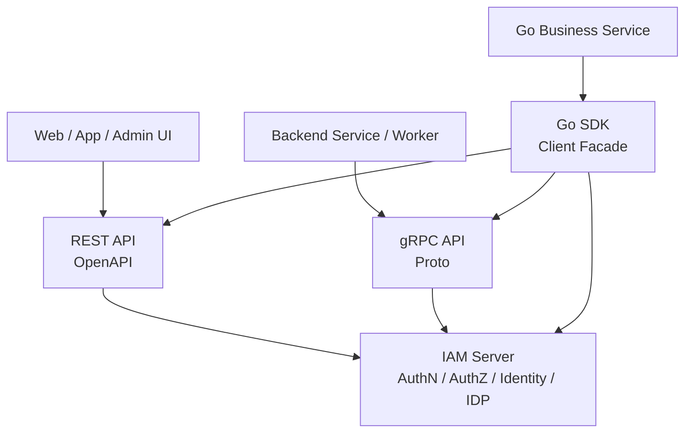
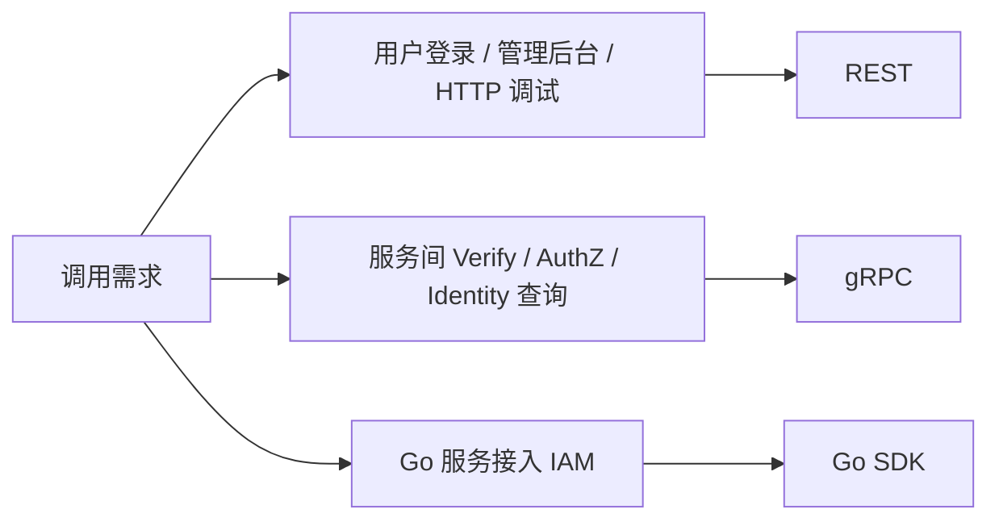
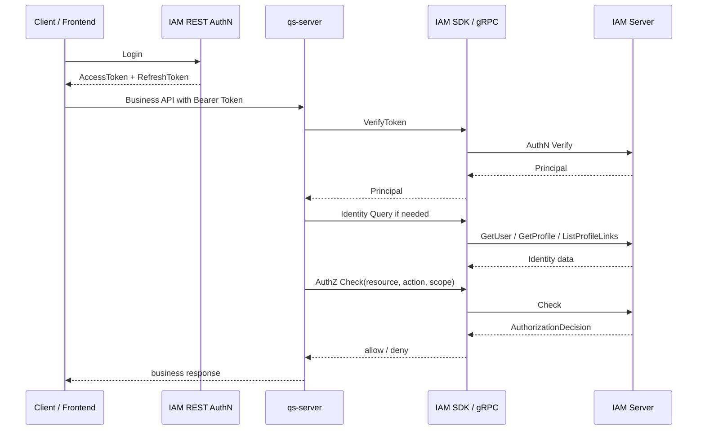
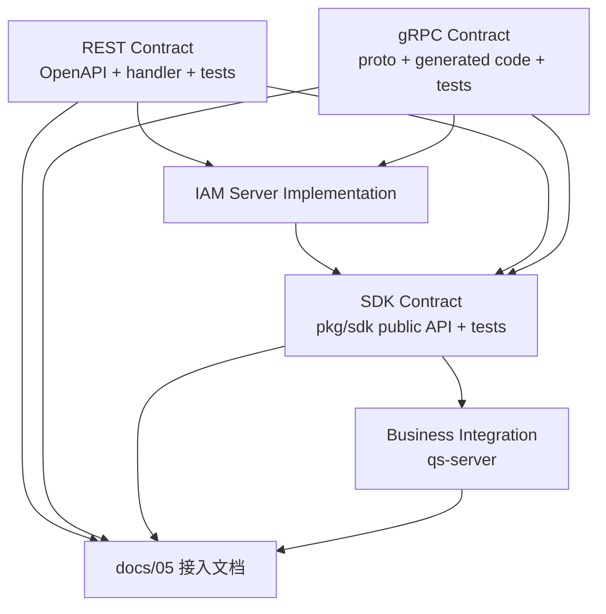

# 09-REST / gRPC / SDK 接入讲法

## 1. 本文定位

本文是 `07-宣讲/` 中用于对外讲解 IAM 接入体系的表达材料。

它不替代 `docs/05-接入与契约/` 下的事实层文档，也不替代 OpenAPI、proto 或 SDK 源码。

事实层文档负责回答：

```text
业务系统如何接入 IAM；
REST API 契约如何组织；
gRPC API 契约如何组织；
Go SDK 如何封装服务端接入；
qs-server 如何接入 IAM；
接入契约如何防漂移。
```

本文负责回答：

```text
面试或技术分享中，REST / gRPC / SDK 应该怎么讲？
为什么 IAM 要同时提供 REST、gRPC 和 SDK？
三者分别服务什么调用方？
为什么 REST 适合前端和管理后台？
为什么 gRPC 适合服务间调用？
为什么 SDK 是 Go 服务端接入产品层？
业务系统应该怎么选接入方式？
qs-server 如何完整接入 IAM？
这些契约如何防漂移？
```

一句话：

> 本文负责把 REST、gRPC、SDK 的事实层接入设计，整理成一套能面试、能白板、能技术分享、能被追问的接入体系表达。

---

## 2. 接入体系一句话

最推荐说法：

```text
IAM 通过 REST、gRPC 和 Go SDK 提供分层接入：REST 面向 Web、App、管理后台和通用 HTTP 调试，gRPC 面向可信服务间调用，Go SDK 则把 Token 验证、Identity 查询、AuthZ Check、JWKS、本地验签、ServiceAuth、错误映射和超时重试封装成 Go 业务服务更容易使用的接入产品层。
```

更短版：

```text
REST 解决前端和管理端怎么接，gRPC 解决服务间怎么接，SDK 解决 Go 业务服务怎么低成本、少踩坑地接。
```

再短一点：

```text
REST、gRPC、SDK 不是三套业务逻辑，而是同一套 IAM 能力的三种接入投影。
```

不要把它讲成：

```text
三套接口；
REST 只是调试；
gRPC 比 REST 高级所以都该用 gRPC；
SDK 是业务层；
SDK 可以替代 IAM Server。
```

---

## 3. 30 秒讲法

```text
IAM 的接入体系分成 REST、gRPC 和 Go SDK 三层。REST 以 OpenAPI 为字段级事实源，适合 Web、App、管理后台、登录和通用 HTTP 调试；gRPC 以 proto 为字段级事实源，适合可信服务间调用，比如 VerifyToken、AuthZ Check、AuthorizationSnapshot、Identity / ProfileLink 查询和 IDP 内部能力；Go SDK 面向 Go 业务服务，封装 REST/gRPC/JWKS/ServiceAuth/AuthZ Check/Identity 查询/错误映射/配置和连接管理。三者不是重复建设，而是服务不同调用方，底层仍然回到同一套 IAM Server 的 AuthN、AuthZ、Identity、IDP 能力。
```

适合场景：

```text
面试官问“外部系统怎么接 IAM”；
技术分享中快速介绍接入体系；
从系统架构过渡到业务系统接入。
```

---

## 4. 1 分钟讲法

```text
IAM 是基础服务，调用方不止一种，所以不能只提供一种接口。

前端、App、管理后台和 HTTP 调试场景需要 REST，因为 REST 对前端友好，OpenAPI 可以描述路径、字段、认证、错误响应，也适合登录、刷新 Token、当前用户、管理后台这些用户侧或管理侧能力。

后端服务和 worker 更适合 gRPC，因为它们属于可信服务间调用，需要强类型 proto、deadline、metadata、service identity、AuthZ Check、Identity 查询和内部集成能力。

Go 业务服务虽然可以直接调用 REST 或 gRPC，但如果每个服务都自己写 gRPC dial、metadata、JWKS 拉取、Token Verify、AuthZ Check、Service Token、错误映射和超时重试，就会重复且容易漂移。所以 SDK 是 Go 服务端接入产品层，封装 IAM 常用接入能力，降低业务系统接入成本。

这三层不是三套业务实现。REST 和 gRPC 是机器契约，SDK 是 Go 封装，真正业务语义仍然在 IAM Server 的 AuthN、AuthZ、Identity 和 IDP 模块。
```

适合场景：

```text
面试项目介绍中的接入部分；
技术分享 REST/gRPC/SDK 章节；
回答“为什么要同时有 REST、gRPC、SDK”。
```

---

## 5. 3 分钟讲法

```text
IAM 的接入体系，我会从调用方出发讲，而不是从接口文件出发讲。

第一类调用方是 Web、App、管理后台和普通 HTTP 客户端。这些场景最适合 REST，因为 REST 容易调试，OpenAPI 可以描述 path、schema、security、error response，也方便前端和管理端生成文档或 client。像用户登录、刷新 Token、退出登录、Me 当前用户视角、Identity 当前用户档案、AuthZ 管理接口、IDP 管理接口，都适合通过 REST 暴露。

第二类调用方是后端服务和 worker，例如 qs-server、collection-server、qs-worker。它们更适合 gRPC，因为服务间调用需要强类型 proto、明确 deadline、metadata、service identity、重试和错误码映射。业务服务可以通过 gRPC 调 IAM 的 VerifyToken、AuthZ Check、GetAuthorizationSnapshot、GetUser、GetProfile、ListProfileLinks 等能力。

第三类调用方是 Go 业务服务。理论上 Go 服务可以直接调 REST 或 gRPC，但真实项目里这会带来大量重复接入代码：连接管理、TLS、metadata、service token、JWKS、本地验签、在线 Verify、AuthZ Check、错误映射、timeout、retry、fake client。IAM SDK 的定位就是把这些能力封装成 Go 服务端更稳定的接入产品层。SDK 不定义业务规则，不复制 IAM 数据库，也不本地实现授权。它只是把 REST/gRPC/JWKS/ServiceAuth 等能力封装给业务服务使用。

以 qs-server 为例，前端先通过 IAM REST 登录拿 AccessToken / RefreshToken；调用 qs-server 业务接口时携带 Bearer Token；qs-server 通过 SDK 或 gRPC VerifyToken 得到 Principal；然后按业务需要查询 User、Profile、ProfileLink；访问敏感资源前，qs-server 构造 resource/action/scope 调 IAM AuthZ Check；IAM 返回 AuthorizationDecision 后，qs-server 再决定放行或拒绝。这个链路说明 IAM 不是孤立系统，而是业务系统的认证授权基础服务。

最后，接入契约要防漂移。REST 字段以 OpenAPI 为准，gRPC 字段以 proto 为准，SDK public API 以 pkg/sdk 为准，server implementation 和 tests 决定真实行为。文档负责解释接入链路，不能替代机器契约。
```

适合场景：

```text
面试深聊业务系统接入；
技术分享接入体系章节；
回答“qs-server 如何接入 IAM”。
```

---

## 6. 推荐讲解顺序

不要从接口数量开始讲。

推荐顺序：

```text
1. 先讲调用方不同；
2. 再讲 REST 适合前端和管理端；
3. 再讲 gRPC 适合可信服务间调用；
4. 再讲 SDK 适合 Go 服务端工程化接入；
5. 再讲 qs-server 接入主链路；
6. 再讲 REST/gRPC/SDK 不是三套业务逻辑；
7. 最后讲契约事实源和防漂移。
```

### 6.1 先讲调用方

```text
IAM 面向 Web、App、Admin、Backend Service、Worker、Go 业务服务，而不是单一调用方。
```

### 6.2 再讲 REST

```text
REST 适合用户侧、管理侧和 HTTP 调试。
```

### 6.3 再讲 gRPC

```text
gRPC 适合可信服务间调用和内部集成。
```

### 6.4 再讲 SDK

```text
SDK 适合 Go 服务端低成本接入 IAM。
```

### 6.5 最后讲防漂移

```text
OpenAPI、proto、pkg/sdk public API 和 tests 才是接入契约事实源。
```

---

## 7. 白板图讲法

### 7.1 图一：三层接入模型



讲图时说：

```text
REST、gRPC、SDK 不是三套业务逻辑，而是同一套 IAM Server 能力面向不同调用方的接入投影。
```

---

### 7.2 图二：接入方式选择图



讲图时说：

```text
选择接入方式不是看哪种技术更高级，而是看调用方是谁、链路是否可信、是否需要强类型、是否需要 SDK 封装。
```

---

### 7.3 图三：业务系统接入主链路



讲图时说：

```text
这张图说明业务系统接入 IAM 的完整链路：前端登录 IAM，业务请求进 qs-server，qs-server 通过 SDK/gRPC 验 Token、查身份、做 AuthZ Check。
```

---

### 7.4 图四：契约事实源图



讲图时说：

```text
文档负责解释链路，但字段事实要回到 OpenAPI、proto、pkg/sdk public API 和 server implementation。
```

---

## 8. REST 要讲清楚什么

### 8.1 REST 的定位

```text
REST 面向 Web、App、管理后台、登录、当前用户视角和通用 HTTP 接入。
```

### 8.2 REST 的事实源

```text
api/rest
OpenAPI YAML / JSON
internal/apiserver/transport/rest
REST tests
```

一句话：

```text
OpenAPI 是 REST 字段级事实源，REST handler 是运行行为事实源。
```

---

### 8.3 REST 覆盖的能力

```text
AuthN：Login、Refresh、Logout、Verify、JWKS、Me；
Identity：User、Profile、ProfileLink、当前用户视角；
AuthZ：Resource、Role、Permission、Assignment、Check、Snapshot、PolicyLinter；
IDP：WeChat / WeCom app 管理；
System：health、ready、metrics；
Debug / Suggest：以当前代码和 OpenAPI 为准。
```

具体接口字段以 OpenAPI 为准。

---

### 8.4 REST 适合讲的价值

```text
前端友好；
管理后台友好；
curl / Postman 调试方便；
OpenAPI 可生成文档和客户端；
适合登录、当前用户和管理面操作。
```

---

### 8.5 REST 不适合讲成什么

不要说：

```text
REST 是全部能力的唯一入口。
```

因为：

```text
可信服务间调用更适合 gRPC；
Go 业务服务更适合 SDK；
REST 文档不替代 OpenAPI。
```

---

## 9. gRPC 要讲清楚什么

### 9.1 gRPC 的定位

```text
gRPC 面向可信服务间调用、后端服务和 worker。
```

### 9.2 gRPC 的事实源

```text
api/grpc
.proto files
generated code
internal/apiserver/transport/grpc
gRPC tests
```

一句话：

```text
proto 是 gRPC 字段级事实源，gRPC service implementation 是运行行为事实源。
```

---

### 9.3 gRPC 覆盖的能力

```text
AuthN：Login、RefreshToken、VerifyToken、Service Token；
Identity：User、Profile、ProfileLink 查询；
AuthZ：Check、Snapshot、Assignment、Permission 管理；
IDP：外部身份源配置；
System：内部 health / runtime 状态。
```

具体 service、rpc、message 以 proto 为准。

---

### 9.4 gRPC 适合的场景

```text
后端服务在线 VerifyToken；
服务间 AuthZ Check；
拉取 AuthorizationSnapshot；
系统侧 Identity 查询；
ProfileLink Query / Command；
IDP 内部高信任读取；
Service Token；
metadata / deadline / retry / audit。
```

---

### 9.5 gRPC 不适合讲成什么

不要说：

```text
gRPC 是前端直接调用入口。
```

它的定位是：

```text
可信服务间调用，不是普通公网客户端入口。
```

也不要说：

```text
gRPC 比 REST 高级，所以全部改成 gRPC。
```

协议选择看调用方，不看技术偏好。

---

## 10. SDK 要讲清楚什么

### 10.1 SDK 的定位

```text
SDK 是 Go 服务端接入 IAM 的产品化封装。
```

它不是：

```text
新的业务层；
新的授权引擎；
新的认证事实源；
IAM Server 替代品。
```

---

### 10.2 SDK 的事实源

```text
pkg/sdk
pkg/sdk public API
SDK tests
SDK examples
```

一句话：

```text
pkg/sdk public API 是 SDK 事实源，public API compile test 用来防止误删和签名漂移。
```

---

### 10.3 SDK 应该封装什么

```text
gRPC / REST client 初始化；
配置加载；
TLS / metadata / service identity；
AuthN VerifyToken；
JWKS 本地验签；
Refresh / Revoke；
Identity User / Profile / ProfileLink 查询；
AuthZ Check / Allow / AllowScoped；
AuthorizationSnapshot；
错误映射；
timeout / retry；
fake client / test helper。
```

实际 public API 以 `pkg/sdk` 为准。

---

### 10.4 SDK 的价值

```text
减少业务服务重复接入代码；
统一 IAM client 初始化；
统一错误映射；
统一 Token 验证策略；
统一 AuthZ Check 调用；
统一 Identity 查询；
统一测试 fake。
```

---

### 10.5 SDK 不应该做什么

SDK 不应该：

```text
import internal/apiserver；
访问 IAM 数据库；
本地维护 Role / Permission / RoleBinding；
直接操作 Casbin；
复制 Identity / AuthZ 业务规则；
把 JWKS 本地验签说成强状态 Verify；
替业务服务自动决定所有安全策略。
```

---

## 11. 三者的选择规则

| 场景 | 推荐接入 |
| --- | --- |
| 用户登录 | REST |
| 前端刷新 Token | REST |
| 管理后台 | REST |
| 当前用户页面 | REST / 后端聚合 |
| curl / Postman 调试 | REST |
| 服务间 VerifyToken | gRPC / SDK |
| 服务间 AuthZ Check | gRPC / SDK |
| AuthorizationSnapshot | gRPC / SDK |
| Identity/Profile/ProfileLink 系统侧查询 | gRPC / SDK |
| Go 业务服务接入 | SDK |
| Worker 调 IAM | gRPC / SDK |
| API Gateway 本地验签 | JWKS / SDK TokenVerifier |
| 契约字段确认 | OpenAPI / proto / pkg/sdk |

简单规则：

```text
用户侧和管理侧优先 REST；
服务间调用优先 gRPC；
Go 服务端优先 SDK；
字段级事实回到 OpenAPI / proto / pkg/sdk。
```

---

## 12. 设计亮点讲法

### 12.1 亮点一：按调用方设计接入方式

推荐说法：

```text
前端/管理后台用 REST，后端服务用 gRPC，Go 服务用 SDK。
```

价值：

```text
不是为了炫技术，而是不同调用方需要不同契约形态。
```

---

### 12.2 亮点二：机器契约和 SDK 封装分离

推荐说法：

```text
OpenAPI / proto 是机器契约，SDK 是 Go 封装。
```

价值：

```text
SDK 变化不能替代契约事实源，契约变化也必须同步 SDK。
```

---

### 12.3 亮点三：SDK 不复制业务规则

推荐说法：

```text
SDK 只调用 IAM，不本地实现 AuthZ、ProfileLink、IDP 规则。
```

价值：

```text
避免业务规则出现第二事实源。
```

---

### 12.4 亮点四：qs-server 接入链路清楚

推荐说法：

```text
Client 登录 IAM，qs-server 验 Token、查身份、做 AuthZ Check。
```

价值：

```text
IAM 真正成为业务系统的身份与授权基础服务，而不是孤立模块。
```

---

### 12.5 亮点五：契约防漂移机制明确

推荐说法：

```text
REST 有 OpenAPI 和 route/schema contract，gRPC 有 proto contract，SDK 有 public API compile test，docs 有 docs-hygiene。
```

价值：

```text
接入契约不靠口头约定维护。
```

---

## 13. 面试回答模板

### Q1：为什么同时提供 REST、gRPC、SDK？

```text
因为调用方不同。REST 适合 Web、App、管理后台和登录；gRPC 适合后端服务间调用，比如 VerifyToken、AuthZ Check、Identity 查询；SDK 适合 Go 业务服务接入 IAM，封装连接、TLS、metadata、JWKS、Verify、ServiceAuth、AuthZ Check 和错误处理。它们不是重复业务逻辑，而是同一套 IAM 能力的不同接入投影。
```

---

### Q2：REST 和 gRPC 怎么划分？

```text
REST 更偏用户侧和管理侧，事实源是 OpenAPI，适合登录、当前用户、管理后台和 HTTP 调试。gRPC 更偏服务间调用，事实源是 proto，适合 AuthN Verify、AuthZ Check、AuthorizationSnapshot、Identity/Profile/ProfileLink 系统侧接入和 IDP 高信任能力。
```

---

### Q3：SDK 为什么不是业务层？

```text
SDK 不定义 User、Session、Permission、ProfileLink 等业务规则，也不本地实现授权判定。它只是把 REST/gRPC/JWKS/ServiceAuth 这些接入能力封装成稳定 Go API。业务规则仍然在 IAM Server 的 domain/application 中。
```

---

### Q4：业务服务应该直接调 gRPC 还是用 SDK？

```text
如果是 Go 服务，优先用 SDK，因为 SDK 已经封装连接、配置、metadata、错误、JWKS、ServiceAuth 和常见 client。只有需要非常底层控制、跨语言调用或非 Go 语言时，才直接使用 gRPC proto。
```

---

### Q5：SDK 会不会隐藏太多安全细节？

```text
SDK 会降低接入成本，但不能隐藏安全语义。比如 JWKS 本地验签不等于在线 Verify，ProfileLink 不等于 AuthZ 权限，IDP 管理接口是高信任能力。SDK 文档和接入文档必须把这些边界讲清楚。
```

---

### Q6：qs-server 是怎么接入 IAM 的？

```text
前端先通过 IAM REST 登录拿 AccessToken / RefreshToken，然后携带 Bearer Token 调 qs-server。qs-server 通过 SDK 或 gRPC VerifyToken 得到 Principal，再按业务需要查询 User/Profile/ProfileLink。访问敏感业务资源前，qs-server 构造 resource、action、scope 调 IAM AuthZ Check，收到 AuthorizationDecision 后决定放行或拒绝。
```

---

### Q7：为什么业务系统不直接读 IAM 数据库？

```text
因为 IAM 数据库是 IAM 内部事实源，不是接入契约。业务系统直接读库会绕过 AuthN/AuthZ/Identity 的语义、状态和权限边界，也会导致 schema 变化直接影响业务系统。正确方式是通过 REST/gRPC/SDK 接入。
```

---

### Q8：如何防止 REST/gRPC/SDK 漂移？

```text
REST 通过 OpenAPI、router matrix 和 route/schema contract 检查；gRPC 通过 proto contract test 确认 proto service 有 runtime registration；SDK 通过 public API compile test 固定公开稳定面；文档通过 docs-hygiene 防止断链和旧事实回流。
```

---

### Q9：OpenAPI、proto、SDK 文档冲突时以谁为准？

```text
字段级契约以机器契约为准：REST 看 OpenAPI，gRPC 看 proto，SDK 看 pkg/sdk public API。运行行为看 server implementation 和 tests。人类文档负责解释链路，不替代机器契约。
```

---

### Q10：REST/gRPC/SDK 是不是增加维护成本？

```text
会增加一定维护成本，所以必须有事实源和防漂移机制。但它换来的是调用方分层清晰：前端和管理端不用接 gRPC，后端服务不用手写 HTTP 接入，Go 业务服务不用重复封装 VerifyToken、AuthZ Check 和 JWKS。关键是用 OpenAPI、proto、SDK tests 和文档规则控制维护成本。
```

---

## 14. 不推荐的讲法

### 14.1 “我们有 REST、gRPC、SDK 三套接口”

问题：

```text
容易让人以为是三套业务逻辑。
```

推荐改成：

```text
REST、gRPC、SDK 是同一套 IAM 能力面向不同调用方的接入投影。
```

---

### 14.2 “SDK 是业务层”

问题：

```text
错误。SDK 是接入产品层，不定义业务规则。
```

推荐改成：

```text
SDK 封装 REST/gRPC/JWKS/ServiceAuth 等接入复杂度，业务规则仍在 IAM Server。
```

---

### 14.3 “gRPC 比 REST 高级，所以都用 gRPC”

问题：

```text
技术偏见。登录、管理后台和前端仍然适合 REST。
```

推荐改成：

```text
按调用方和场景选协议。
```

---

### 14.4 “REST 只是调试用”

问题：

```text
不准确。REST 是 Web、App、Admin 和登录场景的正式契约。
```

---

### 14.5 “SDK 可以让业务方不用理解安全边界”

问题：

```text
不对。SDK 降低接入成本，但不能替代调用方理解 local verify、online verify、IDP secret、ProfileLink 与 AuthZ 的边界。
```

---

### 14.6 “业务服务可以 import IAM internal 包”

问题：

```text
错误。业务服务应通过 REST/gRPC/SDK 接入，不能依赖 IAM internal 实现。
```

---

## 15. 与其他模块的关系

### 15.1 与 AuthN

```text
REST 提供登录、Refresh、Logout、Verify、JWKS；gRPC / SDK 提供服务间 Verify、Token/JWKS/ServiceAuth 相关能力。
```

### 15.2 与 AuthZ

```text
REST 提供 AuthZ 管理和 Check；gRPC / SDK 提供服务间 AuthorizationService、Check、Allow、AllowScoped、Snapshot。
```

### 15.3 与 Identity

```text
REST 提供当前用户视角和管理能力；gRPC / SDK 提供系统侧 User/Profile/ProfileLink 查询与命令。
```

### 15.4 与 IDP

```text
REST 提供 IDP 管理面；gRPC / SDK 提供高信任内部读取或服务间能力，具体以当前契约为准。
```

### 15.5 与 qs-server

```text
qs-server 是业务系统接入 IAM 的样板：Bearer Token -> VerifyToken -> Principal -> Identity Query -> AuthZ Check -> AuthorizationDecision。
```

### 15.6 与架构护栏

```text
接入契约通过 OpenAPI、proto、SDK public API、contract tests、docs-hygiene 防漂移。
```

---

## 16. 证据链索引

| 讲法 | 证据 |
| --- | --- |
| 接入总览 | `docs/05-接入与契约/00-接入总览-业务系统如何接入IAM.md` |
| REST API 契约 | `docs/05-接入与契约/01-REST API契约-前端与管理端接入.md` |
| gRPC API 契约 | `docs/05-接入与契约/02-gRPC API契约-服务间调用与内部集成.md` |
| Go SDK 接入模型 | `docs/05-接入与契约/03-SDK接入模型-Go服务端集成.md` |
| qs-server 接入 IAM 详解 | `docs/05-接入与契约/04-业务系统接入链路-qs-server接入 IAM 详解.md` |
| 契约事实源与防漂移 | `docs/05-接入与契约/05-契约事实源与防漂移机制.md` |
| REST 机器契约 | `api/rest` |
| gRPC 机器契约 | `api/grpc` |
| SDK public API | `pkg/sdk` |
| REST runtime | `internal/apiserver/transport/rest` |
| gRPC runtime | `internal/apiserver/transport/grpc` |
| SDK public API compile test | `pkg/sdk/public_api_compile_test.go` |
| 架构护栏 | `docs/06-架构护栏` |

不要把已归档的专题分析作为当前证据源。

---

## 17. 简历项目描述版本

```text
设计并完善 IAM 的 REST/gRPC/SDK 接入体系：REST 以 OpenAPI 为事实源，面向 Web、App 和管理后台，覆盖登录、Token、AuthZ、Identity、IDP 等用户侧和管理侧接口；gRPC 以 proto 为事实源，面向可信服务间调用，提供 VerifyToken、AuthZ Check、AuthorizationSnapshot、Identity/Profile/ProfileLink 系统侧接入等能力；Go SDK 作为接入产品层，封装 REST/gRPC/JWKS/ServiceAuth/AuthZ Check/Identity 查询/错误映射和配置连接管理，降低 qs-server 等 Go 业务服务接入 IAM 的复杂度，并通过契约测试和 public API compile test 防止接口漂移。
```

可以按真实贡献再压缩。

不要把尚未完整实现的跨语言 SDK、完整多语言客户端生成平台或所有协议能力说成已完成能力。

---

## 18. 30 分钟分享中的位置

如果做 30 分钟技术分享，REST/gRPC/SDK 接入建议占：

```text
4～5 分钟
```

结构：

```text
1 分钟：为什么需要三种接入方式；
1 分钟：REST 适合什么；
1 分钟：gRPC 适合什么；
1 分钟：SDK 封装什么；
1 分钟：qs-server 接入和契约防漂移。
```

不要在这里逐个念接口。

只需要强调：

```text
调用方不同；
接入方式不同；
底层能力相同；
事实源不同；
契约需要防漂移。
```

---

## 19. 本文总结

REST / gRPC / SDK 接入讲法的核心是：

```text
不要把它讲成“三套接口”。
```

应该讲成：

```text
三类调用方；
三种接入方式；
同一套 IAM 能力；
一套契约事实源和防漂移机制。
```

最推荐的表达：

```text
IAM 对外提供 REST、gRPC 和 Go SDK 三层接入。REST 以 OpenAPI 为事实源，面向 Web、App、管理后台和登录场景；gRPC 以 proto 为事实源，面向可信服务间调用，提供 VerifyToken、AuthZ Check、Identity/Profile/ProfileLink 系统侧接入等能力；SDK 是 Go 服务端接入产品层，封装 REST/gRPC/JWKS/ServiceAuth/AuthZ Check/Identity 查询等复杂度，但不定义业务规则。三者服务不同调用方，底层仍然回到同一套 IAM Server 的 AuthN、AuthZ、Identity、IDP 能力。
```

如果只记住一句话：

```text
REST、gRPC、SDK 不是三套业务逻辑，而是 IAM 面向前端、服务间调用和 Go 业务服务的三种接入投影；字段事实分别回到 OpenAPI、proto 和 pkg/sdk public API。
```
