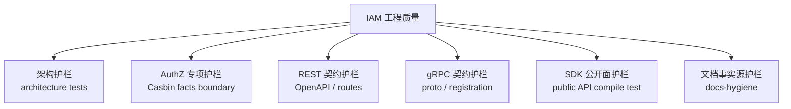
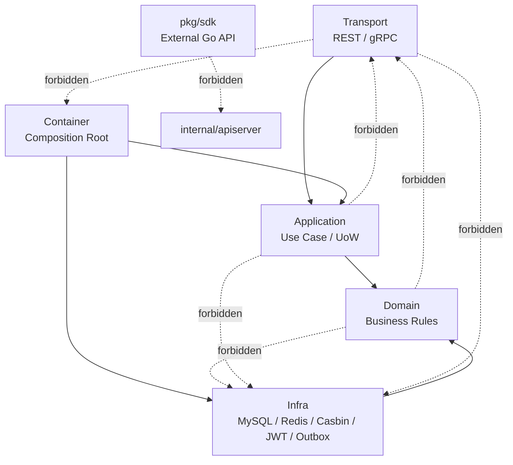
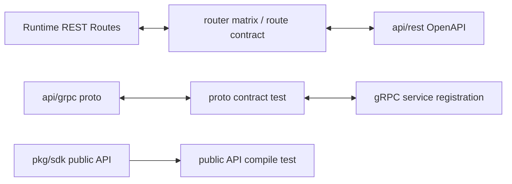
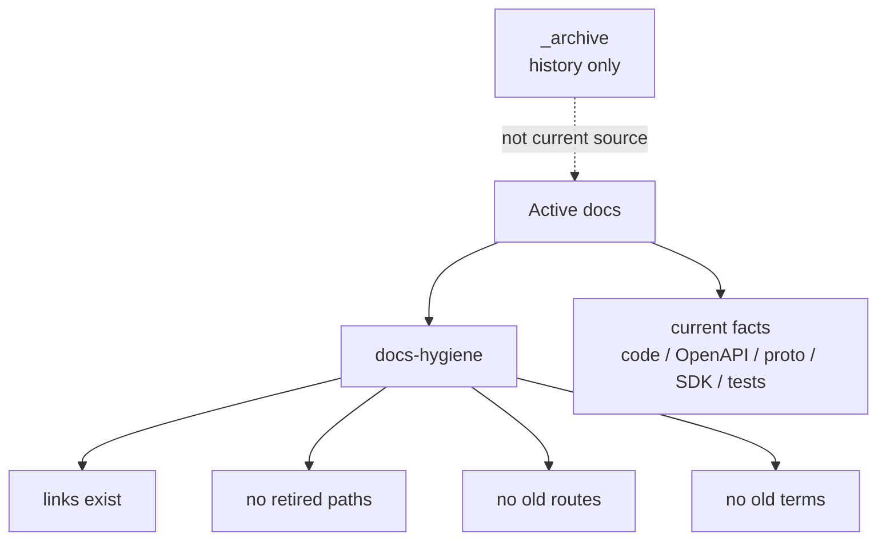

# 10-工程质量与架构护栏讲法

## 1. 本文定位

本文是 `07-宣讲/` 中用于对外讲解 IAM 工程质量与架构护栏的表达材料。

它不替代 `docs/06-架构护栏/` 下的事实层文档，也不替代测试代码、CI 脚本或 Makefile。

事实层文档负责回答：

```text
哪些代码依赖边界不能破坏；
哪些架构测试保护分层边界；
REST / gRPC / SDK 契约如何防漂移；
文档事实源如何防止旧事实回流；
代码、契约、测试、文档冲突时以谁为准。
```

本文负责回答：

```text
面试或技术分享中，工程质量应该怎么讲？
如何把“测试”讲成“边界治理”？
架构测试和单元测试有什么区别？
为什么 REST / gRPC / SDK 契约需要自动化保护？
为什么文档也要纳入工程质量？
这些护栏如何防止 IAM 长期演进成大泥球？
如何把工程治理讲成项目亮点，而不是代码洁癖？
```

一句话：

> 本文负责把 IAM 的架构护栏、契约护栏、SDK 护栏和文档护栏，整理成一套能面试、能白板、能技术分享、能被追问的工程质量表达。

---

## 2. 工程质量一句话

最推荐说法：

```text
IAM 的工程质量不只靠单元测试，而是通过架构测试、REST/gRPC 契约测试、SDK public API compile test 和 docs-hygiene，把分层依赖、协议契约、SDK 公开 API 和文档事实源都变成可自动验证的工程护栏。
```

更短版：

```text
IAM 用自动化护栏防止代码边界、接口契约、SDK 公开面和文档事实源在长期演进中漂移。
```

再短一点：

```text
工程质量不是“测试多”，而是关键边界可验证、可追踪、可持续演进。
```

不要把它讲成：

```text
我写了很多测试；
我用了六边形架构；
我写了很多文档；
CI 会跑测试；
代码风格比较干净。
```

这些说法太泛，听起来像口号。

---

## 3. 30 秒讲法

```text
IAM 的工程质量不是只做业务单元测试，而是专门做了多层架构护栏。代码层面，architecture tests 检查 domain 不能依赖 infra/transport，application 不能依赖 transport/具体 infra，transport 不能绕过 application 直接访问 repository、container 或 Casbin，SDK 不能 import IAM internal 包。契约层面，REST 用 OpenAPI、router matrix 和 route/schema contract 防止路由和文档漂移；gRPC 用 proto contract test 防止 proto service 和 runtime registration 漂移；SDK 用 public API compile test 固定外部 Go 调用方面向的稳定 API。文档层面，docs-hygiene 检查活跃文档链接、退役路径、旧路由和旧术语，防止旧事实回流。这样 IAM 长期重构时，不只靠开发者记忆，而是让测试和脚本守住边界。
```

适合场景：

```text
面试官问“你怎么保证项目质量”；
技术分享中快速介绍工程治理；
从系统架构过渡到长期可维护性。
```

---

## 4. 1 分钟讲法

```text
IAM 的工程质量，我主要从四类护栏讲。

第一类是架构测试。IAM 采用分层和六边形架构，所以不能只靠口头约定说 domain 不依赖 infra。项目里用 architecture tests 扫描 import 和源码 token，保护 domain、application、transport、container、SDK 等边界，防止 handler 直接访问 repository，防止 application 依赖 transport，防止 AuthZ domain 被 Casbin p/g/r facts 污染。

第二类是接入契约测试。IAM 对外有 REST、gRPC、Go SDK 三种接入方式。REST 侧通过 OpenAPI、router matrix 和 contract scripts 检查运行时路由与接口契约一致；gRPC 侧通过 proto contract test 检查 proto service 是否有对应 runtime registration；SDK 侧通过 public API compile test 固定对外公开符号。

第三类是文档事实源。IAM 文档很多，如果文档长期不校验，很容易引用旧目录、旧路由、旧术语。docs-hygiene 会检查活跃文档链接和退役事实引用，_archive 只保存历史，不作为当前事实源。

第四类是工程边界意识。比如 Casbin 是 infra runtime，不是 AuthZ 领域模型；SDK 是接入产品层，不是业务层；OpenAPI/proto/pkg/sdk 是机器契约，文档只是解释层。这样项目的质量不是停留在功能能跑，而是边界可验证、契约可追踪、文档可信。
```

适合场景：

```text
面试项目介绍中的工程质量部分；
技术分享架构护栏章节；
回答“项目长期怎么维护”。
```

---

## 5. 3 分钟讲法

```text
IAM 是一个基础服务，复杂度不只在业务功能，还在边界很多：AuthN、AuthZ、Identity、IDP、REST、gRPC、SDK、Outbox、文档契约。如果只靠开发约定，系统长期演进很容易变成大泥球。所以我把工程质量设计成一套自动化护栏。

第一层是代码架构护栏。IAM 采用分层和六边形架构，核心依赖方向是 Transport -> Application -> Domain，Infra 去实现外部资源适配。domain 层不能依赖 infra、database、transport、proto；application 不能依赖 transport 或 concrete infra；transport 不能直接访问 repository、DB transaction、Casbin 或 container；SDK 不能 import internal/apiserver，也不能直接访问 IAM 数据库。这些边界通过 architecture tests 固化，而不是只写在文档里。

第二层是 AuthZ 专项护栏。AuthZ 是最容易被基础设施污染的模块，因为底层用了 Casbin。但我的领域语言不是 p/g/r facts，而是 Subject、Role、Resource、Permission、RoleBinding、Scope、AuthorizationRequest、AuthorizationDecision。CasbinAdapter、PolicyRule、GroupingRule、sub/dom/obj/act 这些技术事实只能留在 infra/casbin。架构测试会防止这些术语回流到 domain/application/transport，避免 AuthZ 变成 Casbin 封装。

第三层是接入契约护栏。IAM 同时提供 REST、gRPC 和 SDK，如果没有契约测试，很容易出现 OpenAPI 写了但 runtime 没注册，proto 声明了 service 但 gRPC server 没注册，SDK 文档写了但 public API 被改掉。REST 侧通过 router matrix、route contract、OpenAPI schema 检查；gRPC 侧通过 proto contract test 检查 service registration；SDK 侧通过 public API compile test 固定 sdk.NewClient、Config、AuthN、AuthZ、Identity、IDP、errors 等公开面。

第四层是文档护栏。IAM 的文档体系很重，如果文档过期，反而会误导维护者。所以 docs-hygiene 会检查活跃 Markdown 链接，检查是否引用退役包、旧路由、旧术语，比如旧 interface 包、旧 AuthN 路由、旧 Identity refs、旧 assignment 包。归档内容放在 _archive，只能作为历史材料，不能作为当前事实源。

这套体系的价值是：当项目继续重构时，很多错误不会等到线上才发现，也不需要完全依赖人工 review。比如有人让 domain import infra、让 REST handler 直接调用 Casbin、让 SDK import internal、让文档引用旧路径，测试和脚本会直接失败。它不是代码洁癖，而是基础服务长期演进的防撞栏。
```

适合场景：

```text
面试深聊工程质量；
技术分享架构护栏章节；
回答“怎么防止系统越写越乱”。
```

---

## 6. 推荐讲解顺序

不要从“我写了很多测试”开始讲。

推荐顺序：

```text
1. 先讲问题：基础服务长期演进容易边界腐烂；
2. 再讲代码护栏：architecture tests 保护分层依赖；
3. 再讲 AuthZ 专项护栏：Casbin facts 不进领域模型；
4. 再讲契约护栏：REST/gRPC/SDK 防漂移；
5. 再讲文档护栏：docs-hygiene 防旧事实回流；
6. 再讲质量收益：边界可验证、契约可追踪、文档可信；
7. 最后讲这些护栏不是洁癖，而是基础服务演进能力。
```

### 6.1 先讲问题

```text
IAM 不是简单业务 CRUD，它有认证、授权、身份、接入、运行时和文档多条边界，长期演进一定需要护栏。
```

### 6.2 再讲代码边界

```text
domain、application、transport、infra、container、SDK 各自有禁止依赖方向。
```

### 6.3 再讲契约边界

```text
REST 看 OpenAPI，gRPC 看 proto，SDK 看 pkg/sdk public API。
```

### 6.4 最后讲文档边界

```text
活跃文档只能解释当前事实，_archive 不能证明当前实现。
```

---

## 7. 白板图讲法

### 7.1 图一：工程质量五类护栏



讲图时说：

```text
我把工程质量拆成可验证的五类护栏：代码架构、AuthZ 专项边界、REST/gRPC 契约、SDK 公开面和文档事实源。
```

---

### 7.2 图二：分层依赖护栏



讲图时说：

```text
架构测试保护的不是目录好不好看，而是依赖方向是否稳定。业务规则向内，协议和基础设施向外。
```

---

### 7.3 图三：接入契约防漂移



讲图时说：

```text
REST、gRPC、SDK 各自有机器事实源，也各自有测试护栏，不靠人工记忆维护接口一致性。
```

---

### 7.4 图四：文档事实源防漂移



讲图时说：

```text
文档也会漂移，所以活跃文档必须回链当前事实源，_archive 只能作历史材料，不能证明当前实现。
```

---

## 8. 工程质量要讲清楚的核心概念

### 8.1 架构测试

讲法：

```text
架构测试不是业务测试，而是验证代码结构有没有破坏依赖边界。
```

保护：

```text
domain 不依赖 infra / transport；
application 不依赖 transport / concrete infra；
transport 不绕过 application；
container 只做组合根；
SDK 不 import internal；
AuthZ domain 不出现 Casbin facts。
```

---

### 8.2 契约测试

讲法：

```text
契约测试保护机器契约和运行时注册不漂移。
```

保护：

```text
REST routes 与 OpenAPI；
gRPC proto 与 service registration；
SDK public API 与外部调用方编译稳定性。
```

---

### 8.3 Public API compile test

讲法：

```text
SDK 是外部 Go 服务会 import 的包，所以公开符号需要编译期护栏。
```

保护：

```text
sdk.NewClient；
Config；
AuthN / AuthZ / Identity / IDP client；
JWKS / TokenVerifier；
ServiceAuth；
errors；
fake / test helper。
```

实际符号以 `pkg/sdk` 和 compile test 为准。

---

### 8.4 docs-hygiene

讲法：

```text
文档也会漂移，所以 active docs 需要检查断链和退役事实引用。
```

保护：

```text
链接存在；
不引用旧 route；
不引用旧 package；
不引用旧术语；
_archive 不作为当前事实源。
```

---

### 8.5 事实源优先级

讲法：

```text
文档是解释层，不是最高事实源。
```

优先级：

```text
源码真实行为
  -> OpenAPI / proto / pkg/sdk / config / migration
  -> tests
  -> 当前正文文档
  -> README
  -> _archive
```

---

## 9. 设计亮点讲法

### 9.1 亮点一：用测试保护架构，而不是只靠约定

推荐说法：

```text
分层依赖由 architecture tests 扫描 import 和源码 token 保护。
```

价值：

```text
新代码一旦破坏依赖方向，CI 可以直接失败。
```

---

### 9.2 亮点二：AuthZ 有专项边界保护

推荐说法：

```text
Casbin facts 不进入 domain，assignment 包不回流。
```

价值：

```text
保证 AuthZ 业务语言稳定，不被 infra 技术细节污染。
```

---

### 9.3 亮点三：REST/gRPC 契约有机器校验

推荐说法：

```text
REST 路由与 OpenAPI 对齐，proto service 与 runtime registration 对齐。
```

价值：

```text
接口文档和运行时代码不容易各说各话。
```

---

### 9.4 亮点四：SDK 公共面有兼容性护栏

推荐说法：

```text
public API compile test 固定 SDK 对外稳定符号。
```

价值：

```text
外部业务服务升级 SDK 时不容易被无意 breaking change 打断。
```

---

### 9.5 亮点五：文档也被当成工程资产

推荐说法：

```text
docs-hygiene 检查 active docs 的链接和退役事实引用。
```

价值：

```text
文档不只是“写完就算”，而是纳入工程质量体系。
```

---

### 9.6 亮点六：事实源边界明确

推荐说法：

```text
文档解释事实，机器契约和源码证明事实。
```

价值：

```text
避免历史文档、旧讨论、旧 README 反向污染当前设计。
```

---

## 10. 面试回答模板

### Q1：你怎么保证项目不会越写越乱？

```text
我没有只靠口头约定，而是加了自动化护栏。比如 architecture tests 会检查 domain 不能依赖 infra/transport，application 不能依赖 transport/具体 infra，transport 不能绕过 application 直接访问 repository 或 Casbin，SDK 不能 import internal。REST/gRPC/SDK 也有契约测试，文档有 docs-hygiene。这样新代码一旦破坏关键边界，CI 可以直接失败。
```

---

### Q2：什么是架构测试？和单元测试有什么区别？

```text
单元测试验证业务行为，比如登录是否成功、权限判定是否正确；架构测试验证代码结构，比如某层是否依赖了不该依赖的包、某些退役包是否回流、某些技术事实是否进入 domain。它保护的是长期可维护性。
```

---

### Q3：你怎么防止 REST 文档和代码不一致？

```text
REST 以 OpenAPI 作为字段、路径和错误响应事实源。运行时侧通过 router matrix test 和 route/schema contract scripts 检查关键路由是否注册、public routes 是否被 OpenAPI 覆盖、schema 是否漂移。这样 REST 文档和 runtime routes 不完全靠人工同步。
```

---

### Q4：你怎么防止 gRPC proto 和服务注册不一致？

```text
gRPC 有 proto contract test，会扫描 api/grpc 下 proto 文件里的 service 声明，然后检查 transport/grpc/service 源码中是否存在对应 Register<Service>Server 调用。如果 proto 声明了服务但运行时没有注册，测试会失败。
```

---

### Q5：SDK 的兼容性怎么保证？

```text
SDK 有 public API compile test，固定对外稳定符号，比如 sdk.NewClient、Config、AuthN/AuthZ/Identity/IDP client、JWKS、TokenVerifier、ServiceAuth、errors、fake/test helper 等。如果这些公开 API 被误删或签名不兼容，编译测试会失败。
```

---

### Q6：文档怎么防止过期？

```text
首先文档明确自己是解释层，REST/gRPC/SDK/源码各有事实源。其次 docs-hygiene 会检查 active docs 的相对链接是否存在，并检查是否引用退役路径、旧路由和旧术语。归档文档放在 _archive，只作为历史材料，不作为当前事实源。
```

---

### Q7：为什么要禁止 Casbin facts 进入 domain？

```text
因为 Casbin 是运行时策略引擎，不是业务模型。业务模型应该是 Subject、Role、Resource、Permission、RoleBinding、Scope、AuthorizationDecision。如果 domain 里出现 p/g/r、sub/dom/obj/act 这类 Casbin 技术语言，就会让业务层被基础设施污染，后续扩展和替换都困难。
```

---

### Q8：这些护栏会不会降低开发效率？

```text
短期会增加一些约束，但长期能降低重构成本。IAM 是基础服务，认证、授权、身份和接入契约一旦混乱，后续修复成本很高。架构护栏相当于提前把边界固化，避免项目慢慢变成大泥球。
```

---

### Q9：工程质量亮点怎么讲得不空？

```text
不要只说测试多，而要说测试保护什么。比如 architecture tests 保护分层依赖，OpenAPI/proto contract 保护接口契约，SDK compile test 保护外部调用方，docs-hygiene 保护文档事实源。这样质量目标是具体可验证的。
```

---

### Q10：文档和代码冲突时怎么办？

```text
按事实源优先级处理：源码和运行时行为优先，其次是 OpenAPI/proto/pkg/sdk/config/migration 这些机器契约，再是测试，然后才是当前正文文档和 README。旧文档和 _archive 只能提供历史线索，不能证明当前事实。
```

---

## 11. 不推荐的讲法

### 11.1 “我写了很多测试”

问题：

```text
太泛，没有说明测试保护什么。
```

推荐改成：

```text
除了业务测试，我还用架构测试和契约测试保护分层边界、接口契约和 SDK 公共面。
```

---

### 11.2 “我用了六边形架构”

问题：

```text
如果没有护栏，容易变成口号。
```

推荐改成：

```text
我用 architecture tests 检查 domain/application/transport/container 的依赖边界，防止六边形架构退化。
```

---

### 11.3 “文档我都写了”

问题：

```text
文档也可能过期。
```

推荐改成：

```text
我通过 docs-hygiene 检查 active docs 的链接和退役事实引用，避免旧事实回流。
```

---

### 11.4 “接口按文档来”

问题：

```text
文档不是机器契约。
```

推荐改成：

```text
REST 以 OpenAPI 为事实源，gRPC 以 proto 为事实源，SDK 以 pkg/sdk public API 为事实源。
```

---

### 11.5 “Casbin 就是授权模型”

问题：

```text
错误。Casbin 是 infra runtime engine。
```

推荐改成：

```text
授权模型是 Role、Resource、Permission、RoleBinding、Scope，Casbin facts 只在 infra 层。
```

---

### 11.6 “docs-hygiene 通过就说明文档完全正确”

问题：

```text
错误。docs-hygiene 只检查链接和退役事实引用，业务解释仍需回链源码、契约和测试人工核对。
```

---

## 12. 与其他模块的关系

### 12.1 与系统架构

```text
系统架构讲法说明分层，架构护栏保证分层不退化。
```

### 12.2 与 AuthN

```text
AuthN 的 Session、Token、JWKS、Verify 语义需要通过事实源和契约保持一致。
```

### 12.3 与 AuthZ

```text
AuthZ 是最容易被 infra 事实污染的模块，所以需要 Casbin facts 和 rolebinding/assignment 边界护栏。
```

### 12.4 与 REST/gRPC/SDK

```text
接入层质量不只看 handler 和 service 能跑，还要看契约与运行时是否一致。
```

### 12.5 与文档体系

```text
文档是工程资产，需要事实源优先级和 hygiene，而不是随手写。
```

---

## 13. 证据链索引

| 讲法 | 证据 |
| --- | --- |
| 架构测试与依赖边界 | `docs/06-架构护栏/01-架构测试与依赖边界.md` |
| 文档事实源与防漂移 | `docs/06-架构护栏/02-文档事实源与防漂移机制.md` |
| 架构测试代码 | `internal/pkg/architecture/architecture_test.go` |
| REST 关键路由和 OpenAPI 覆盖 | `internal/apiserver/transport/rest/router_matrix_test.go` |
| REST route contract | `scripts/check-route-contracts.py` |
| OpenAPI contract | `scripts/check-openapi-contracts.py` |
| gRPC proto service registration | `internal/apiserver/transport/grpc/proto_contract_test.go` |
| SDK public API 固定 | `pkg/sdk/public_api_compile_test.go` |
| docs-hygiene | `scripts/check-docs-links.py` |
| 接入契约事实源 | `docs/05-接入与契约/05-契约事实源与防漂移机制.md` |
| REST 机器契约 | `api/rest` |
| gRPC 机器契约 | `api/grpc` |
| SDK public API | `pkg/sdk` |

不要把已归档的专题分析作为当前证据源。

---

## 14. 简历项目描述版本

```text
为 IAM 项目建立工程质量与架构护栏体系：通过 architecture tests 约束 domain/application/transport/container/SDK 的依赖方向，防止 domain 依赖 infra、application 依赖 transport、transport 绕过 application，以及 AuthZ domain 被 Casbin p/g facts 污染；通过 REST router matrix、OpenAPI contract 和 gRPC proto contract 保证 REST/gRPC 机器契约与运行时注册对齐；通过 SDK public API compile test 固定 Go SDK 对外稳定面；通过 docs-hygiene 检查活跃文档断链、退役路径、旧路由和旧术语引用，降低长期演进中的架构漂移、接口漂移和文档漂移风险。
```

可以按真实贡献再压缩。

不要把尚未完整实现的全链路质量平台、完整自动化文档审计平台、企业级发布门禁体系说成已完成能力。

---

## 15. 30 分钟分享中的位置

如果做 30 分钟技术分享，工程质量与架构护栏建议占：

```text
3～4 分钟
```

结构：

```text
1 分钟：为什么基础服务需要架构护栏；
1 分钟：architecture tests 保护依赖边界；
1 分钟：REST/gRPC/SDK 契约防漂移；
1 分钟：docs-hygiene 与文档事实源。
```

不要在这里逐个解释所有测试函数。

只需要强调：

```text
边界可验证；
契约可追踪；
文档可信；
演进可控。
```

---

## 16. 本文总结

工程质量与架构护栏讲法的核心是：

```text
不要只说“我写了测试”。
```

应该讲成：

```text
我把系统长期演进中最容易漂移的边界变成了自动化验证。
```

最推荐的表达：

```text
IAM 的工程质量不只靠单元测试，而是通过架构测试、REST/gRPC 契约测试、SDK public API compile test 和 docs-hygiene 建立多层护栏。架构测试保护 domain/application/transport/container/SDK 的依赖方向，防止 AuthZ 被 Casbin 技术事实污染；REST 和 gRPC 契约测试保护 OpenAPI/proto 与运行时注册一致；SDK public API compile test 保护外部 Go 调用方的稳定接入面；docs-hygiene 保护文档链接和事实源，防止旧路由、旧包、旧术语回流。这样 IAM 作为基础服务在长期演进中更不容易退化成大泥球。
```

如果只记住一句话：

```text
IAM 的工程质量不是“测试很多”，而是用自动化护栏守住代码边界、接口契约、SDK 公开面和文档事实源。
```
