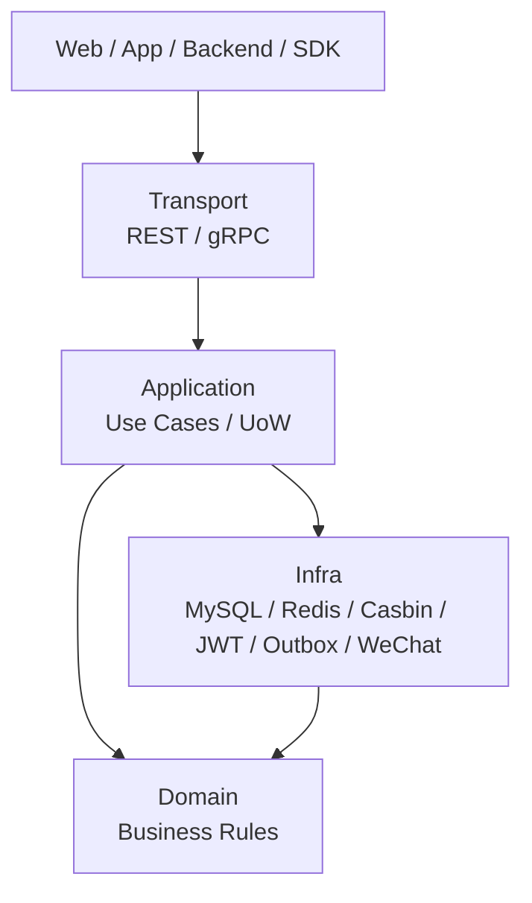
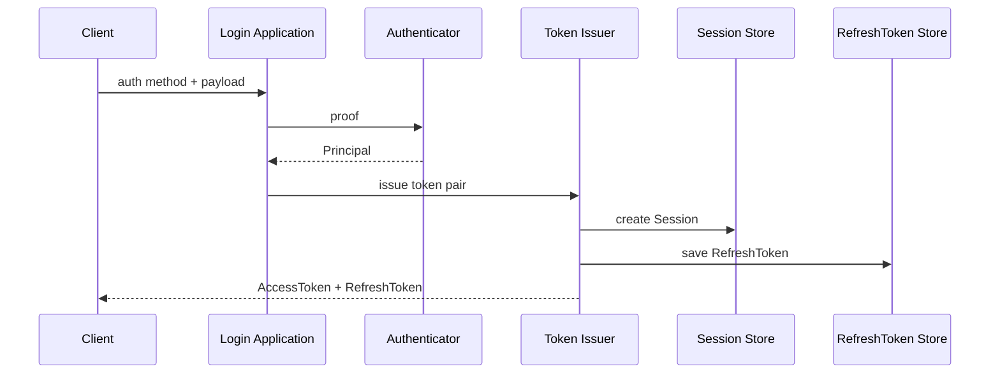
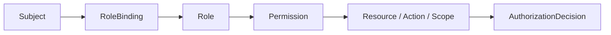
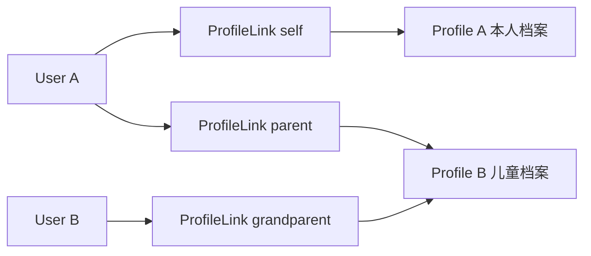

# 11-30 分钟技术分享脚本

## 1. 本文定位

本文是 `07-宣讲/` 的整合型讲稿。

它不替代事实层文档，也不替代源码。

它的目标是把前面 10 篇宣讲材料组织成一场：

```text
30 分钟可讲；
结构可控；
重点清楚；
可以被追问；
可以回链证据。
```

适用场景：

```text
技术分享；
面试项目深讲；
架构答辩；
同事/朋友技术介绍；
简历项目复盘。
```

一句话：

> 本文负责把 IAM 的项目定位、业务背景、系统架构、AuthN、AuthZ、Identity、IDP、REST/gRPC/SDK 和工程护栏，组织成一场 30 分钟技术分享。

---

## 2. 分享标题

最推荐标题：

```text
从用户中心到 IAM：一个 Go 身份与访问管理服务的设计与实现
```

备选标题：

```text
IAM 身份与访问管理服务：AuthN、AuthZ、Identity、IDP 与 SDK 接入实践
```

偏面试版：

```text
一个 Go IAM 项目的架构设计：认证、授权、身份关系与工程护栏
```

偏技术分享版：

```text
Go IAM 服务实践：Session/Token、资源授权、ProfileLink 与契约治理
```

---

## 3. 分享目标

这场 30 分钟分享要让听众理解五件事：

```text
1. IAM 为什么不是普通用户中心；
2. IAM 如何拆成 AuthN、AuthZ、Identity、IDP；
3. 核心链路如何设计：Session/Token、AuthZ Check、ProfileLink、Outbox；
4. REST/gRPC/SDK 如何支撑业务系统接入；
5. 项目如何通过架构测试、契约测试、SDK compile test、docs-hygiene 支撑长期演进。
```

不要试图在 30 分钟内讲完所有代码。

重点是建立系统心智：

```text
为什么要做；
边界怎么拆；
关键链路怎么走；
设计取舍是什么；
证据在哪里。
```

---

## 4. 听众预设

### 4.1 如果是面试官

他们关心：

```text
你是否真的理解项目；
你是否能解释设计取舍；
你是否有复杂系统建模能力；
你是否能把 Go 工程组织清楚；
你是否能处理一致性、安全、契约和可维护性问题；
你是否能诚实区分已实现能力和后续演进方向。
```

---

### 4.2 如果是技术同事

他们关心：

```text
系统怎么接入；
模块边界是什么；
哪些能力已经有；
哪些坑要避免；
接口契约和 SDK 怎么用；
后续怎么演进。
```

---

### 4.3 如果是朋友或非本项目同学

他们关心：

```text
这个系统解决什么问题；
为什么不是用户登录那么简单；
你做这个项目的技术含量在哪里；
这套设计能迁移到什么类似系统里。
```

---

## 5. 30 分钟时间分配

推荐时间轴：

| 时间 | 模块 | 目标 |
| ---: | --- | --- |
| 0:00 - 2:00 | 开场与一句话定位 | 建立 IAM 心智 |
| 2:00 - 5:00 | 业务背景与问题 | 说明为什么需要 IAM |
| 5:00 - 9:00 | 系统架构总览 | 讲分层、模块和运行时装配 |
| 9:00 - 14:00 | AuthN 认证体系 | 讲 Principal、Session、Token、JWKS/Verify |
| 14:00 - 19:00 | AuthZ 授权体系 | 讲模型、Check、写入、Outbox |
| 19:00 - 22:00 | Identity/ProfileLink | 讲 User、Profile、ProfileLink |
| 22:00 - 24:00 | IDP 与第三方登录 | 讲 IDP/AuthN 边界 |
| 24:00 - 26:00 | REST/gRPC/SDK 接入 | 讲接入方式和 SDK 定位 |
| 26:00 - 28:00 | 工程质量与架构护栏 | 讲自动化护栏和防漂移 |
| 28:00 - 30:00 | 总结与 Q&A 引导 | 收束亮点，导向追问 |

如果时间紧，删减顺序：

```text
优先删 IDP 细节；
再删 REST/gRPC/SDK 细节；
再删工程护栏细节；
不要删 AuthN、AuthZ、Identity 的主线。
```

---

## 6. 开场：0:00 - 2:00

### 6.1 讲稿

```text
大家好，今天我分享的是一个 Go 实现的 IAM 身份与访问管理服务。

这个项目最容易被误解成“用户中心”或者“登录系统”，但它的定位更大一些。它不是只维护 users 表，也不是登录后发一个 JWT，而是面向业务系统接入，统一处理登录认证、Session 与 Token 管理、资源授权判定、用户和业务档案关系、第三方身份源集成，以及 REST/gRPC/SDK 接入。

一句话说，IAM 解决的是：在多入口、多服务、多身份源的业务系统里，谁能登录、登录态现在是否有效、能访问什么资源、和哪些业务档案有关，以及其他业务系统如何稳定接入这些能力。
```

---

### 6.2 白板 / Slide 提示

写一行：

```text
IAM = AuthN + AuthZ + Identity + IDP + Access Contract + Guard
```

解释：

```text
AuthN：你是谁，登录态是否有效；
AuthZ：你能访问什么资源；
Identity：你和业务档案是什么关系；
IDP：外部身份源如何接入；
Access：业务系统如何接入；
Guard：系统如何长期不漂移。
```

---

### 6.3 转场句

```text
为什么需要这样一个系统？我们先看业务背景。
```

---

## 7. 业务背景与问题：2:00 - 5:00

### 7.1 讲稿

```text
这个项目的背景是：业务系统不再只是一个单体页面，而会有 Web、App、微信小程序、管理后台、内部服务、worker 等多种入口。

如果没有统一 IAM，每个业务系统都会自己处理登录、JWT、权限、微信登录、用户资料和档案关系。短期开发很快，但长期会出现几个问题。

第一，认证分散。不同服务可能各自签 token，各自处理 refresh、logout、用户禁用，最后用户在一个系统被禁用，另一个系统旧 token 还可用。

第二，授权分散。很多系统一开始会写 user.role == admin，或者在业务代码里写 owner 判断。但资源、动作、tenant、scope 变多后，权限判断会散落在各个 handler 和 service 里。

第三，身份关系复杂。业务里不仅有登录用户，还有本人档案、儿童档案、亲属关系。如果只用 User.profile_id 或 Profile.user_id，很难表达一个用户关联多个档案、一个儿童档案被多个用户关联。

第四，第三方身份源容易污染登录逻辑。微信、企微登录会涉及 AppSecret、平台 access_token、code exchange，如果直接写进 LoginService，登录态和外部平台配置会混在一起。

所以 IAM 的价值是把这些能力收敛成统一基础服务：AuthN 管登录态，AuthZ 管访问权，Identity 管身份档案关系，IDP 管外部身份源，对外通过 REST/gRPC/SDK 接入。
```

---

### 7.2 白板 / Slide 提示

问题侧：

```text
Without IAM:
- auth scattered
- permission scattered
- profile relation unclear
- third-party login mixed
- service integration duplicated
- contract/document drift
```

解决侧：

```text
IAM:
AuthN / AuthZ / Identity / IDP / REST-gRPC-SDK / Guard
```

---

### 7.3 转场句

```text
基于这些问题，我没有把系统做成一个大 UserService，而是做了分层架构和模块拆分。
```

---

## 8. 系统架构总览：5:00 - 9:00

### 8.1 讲稿

```text
IAM 的架构可以从两个维度讲：纵向分层和横向模块。

纵向上，它采用分层和六边形架构。外部请求通过 REST、gRPC 或 SDK 进入系统，Transport 层只做协议适配，比如路由、参数绑定、错误映射和 middleware。真正的用例编排在 Application 层，比如登录、Verify、AuthZ Check、授权写入、ProfileLink 操作。Domain 层承载业务规则，比如 Session 是否 active、RoleBinding 是否成立、Permission 是否覆盖某个 action、ProfileLink 是否重复。Infra 层适配 MySQL、Redis、Casbin、JWT、Outbox、微信/企微 API。

运行时上，cmd/apiserver 只是入口，process 负责进程生命周期，比如配置、资源准备、服务启动、后台任务和优雅关闭。container 是组合根，负责装配 AuthN、AuthZ、Identity、IDP 等模块，并把能力投影给 REST deps、gRPC registration 和 runtime tasks。

横向模块上，主要是四个核心边界：AuthN 负责认证态，AuthZ 负责访问权，Identity 负责用户和业务档案关系，IDP 负责外部身份源基础设施。
```

---

### 8.2 白板图



模块图：

```text
AuthN    AuthZ    Identity    IDP
```

---

### 8.3 关键强调

```text
container 不是业务层，是 composition root；
transport 不直接操作数据库；
domain 不依赖 infra；
application 不依赖 transport；
SDK 不 import internal。
```

---

### 8.4 转场句

```text
接下来我从最核心的认证链路开始讲，也就是 AuthN。
```

---

## 9. AuthN 认证体系：9:00 - 14:00

### 9.1 讲稿

```text
AuthN 解决的问题是：你如何证明你是谁，以及这次登录态和 token 现在是否仍然有效。

这里我没有把它设计成“查用户表后发 JWT”。AuthN 先用 User、LoginIdentity、Credential、Challenge 表达认证模型。User 是 Identity 中的身份主体；LoginIdentity 表示某个用户可以通过什么方式登录；Credential 是稳定认证材料，比如密码哈希、外部账号绑定或服务凭证；Challenge 是一次性或短期证明材料，比如验证码、OAuth code、微信 code。

登录链路上，不同登录方式会被适配成认证 proof，然后交给领域认证器。认证成功后得到 Principal。Principal 是 Login 链路和 Token 链路之间的边界对象，它代表这次请求已经证明出的认证主体。

接下来 Token 链路不会直接只发一个 JWT，而是先创建 Session。Session 是服务端可控的登录态锚点。然后签发短期 AccessToken，并把 session_id、user_id、tenant_id、auth method 等 claims 放进去。最后生成 RefreshToken，并把 RefreshToken 作为服务端可控的续期凭证保存起来。

这样设计是为了解决长期 JWT 撤销困难的问题。AccessToken 是短期访问凭证，适合请求携带和本地验签；RefreshToken 是服务端可控的续期凭证；Session 是登录态锚点，可以被 revoke。

验证也分两种。低风险高吞吐场景可以用 JWKS 本地验签，根据 kid 找公钥，验证 JWT 签名和 exp、aud、iss。高风险场景则要调用在线 Verify。在线 Verify 不只是验 JWT，还会检查 access token revoked marker、Session 是否 active、User/Account 是否仍可用。

所以 AuthN 的核心亮点是：多种登录方式最终统一到 Principal、Session、AccessToken、RefreshToken、JWKS 和在线 Verify 这一套模型。
```

---

### 9.2 白板图



---

### 9.3 重点句

```text
JWT 证明 token 是 IAM 签的；Session 证明这次登录态仍然在线有效；RefreshToken 证明客户端有资格续期。
```

---

### 9.4 转场句

```text
AuthN 解决“你是谁”，但业务系统还需要知道“你能做什么”，这就是 AuthZ。
```

---

## 10. AuthZ 授权体系：14:00 - 19:00

### 10.1 讲稿

```text
AuthZ 解决的问题是：某个 subject 在某个 tenant 下，能不能对某个 resource 执行某个 action，并且满足某个 scope。

这里不是 user.role 字段，也不是简单 Casbin 封装。我把授权模型拆成 Subject、Role、Resource、Permission、RoleBinding、Action、Scope。Permission 表示某个 role 能对某个 resource 执行某个 action，并限制在某个 scope；RoleBinding 表示某个 subject 在某个 tenant 下持有某个 role。

判定链路是：业务服务发起 Check，传 subject、tenant、resource、action、scope。Application 层构造成 AuthorizationRequest，然后调用 DecisionEngine。当前 DecisionEngine 由 CasbinAdapter 实现，最终执行 Enforce，返回 AuthorizationDecision。

这里要强调，Casbin 不是领域模型。领域语言是 Role、Resource、Permission、RoleBinding、Scope、AuthorizationDecision；Casbin 的 p/g facts 只是 infra 层 runtime 映射。

写入侧更能体现复杂度。授权写入不是简单 CRUD。比如绑定角色时，要写 rolebinding 管理记录，也要写 Casbin g fact；授予权限时，要写 p fact。除此之外，还要递增 PolicyVersion，stage 一个 iam.authz.version_changed 事件到 Transactional Outbox，并在事务提交后 reload 当前进程的 runtime policy。

这样做是为了保证管理面、判定面和下游缓存失效是一致的。PolicyVersion 让业务服务知道授权版本是否变化，Outbox 保证这个变化最终可靠传播。
```

---

### 10.2 白板图

授权模型：



写入链路：

```text
PolicyChange -> UoW -> Facts -> PolicyVersion -> Outbox -> RuntimeReload
```

---

### 10.3 重点句

```text
AuthZ 的亮点不是“用了 Casbin”，而是把领域授权模型、运行时判定、版本传播和事务一致性拆清楚。
```

---

### 10.4 转场句

```text
认证和授权之外，IAM 还有一个很重要的问题：用户和业务档案之间到底是什么关系。
```

---

## 11. Identity 与 ProfileLink：19:00 - 22:00

### 11.1 讲稿

```text
Identity 模块不是普通用户资料 CRUD。这里有三个概念：User、Profile、ProfileLink。

User 是登录主体，是 IAM 内部身份锚点，会出现在 Principal、Session、Token 里，也会作为 AuthZ subject。User 有状态，比如 active、inactive、blocked。

Profile 是业务档案，比如本人档案、儿童档案、被测评者档案。Profile 不直接登录，不直接签 token。

ProfileLink 是 User 和 Profile 之间的关系事实。为什么不能只是 User.profile_id？因为一个 User 可能有自己的档案和多个儿童档案，一个儿童 Profile 也可能被父母、祖辈等多个 User 关联。关系本身也有类型，比如 self、parent、grandparent、other，还有 active/revoked 状态。

所以这里用 User -- ProfileLink -- Profile 的模型。当前用户访问 Profile 时，MyProfiles 会先检查 currentUserID 和 profileID 之间是否有 active ProfileLink。如果没有，就拒绝访问。MyProfileLinks 也限制当前用户只能操作自己的关系。

注意，ProfileLink 是身份关系 guard，不是 AuthZ permission。如果未来要把 Profile 操作纳入统一资源授权，应该通过 AuthZ Resource/Action/Scope 扩展，而不是把 ProfileLink 变成权限表。
```

---

### 11.2 白板图



---

### 11.3 重点句

```text
User 是登录主体，Profile 是业务档案，ProfileLink 是关系事实。
```

---

### 11.4 转场句

```text
Identity 解决内部身份关系；如果身份来自外部平台，比如微信或企微，就进入 IDP。
```

---

## 12. IDP 与第三方登录：22:00 - 24:00

### 12.1 讲稿

```text
IDP 这里最重要的是边界。它不是登录模块，而是第三方身份源基础设施模块。

IDP 负责微信/企微应用配置、AppSecret 或 CorpSecret 的 SecretVault 加密管理、微信平台 access_token 缓存，以及微信/企微 API 适配。真正的登录判定、账号绑定、Session 和 IAM Token 签发仍然由 AuthN 统一完成。

以微信小程序登录为例，客户端提交 app_id 和 js_code。AuthN 的微信登录方法会向 IDP 查询应用配置，检查应用是否 enabled，再通过 SecretVault 解密 AppSecret，然后进行 code2Session。code2Session 成功只说明这个 code 对应某个微信 openid/unionid，不等于 IAM 登录成功。后续还要检查这个外部身份是否绑定 IAM LoginIdentity / User，最后才由 AuthN 创建 Principal、Session 和 Token。

这里还有一个容易混淆的点：微信 access_token 不是 IAM AccessToken。微信 access_token 是调用微信平台 API 的凭证，由 IDP 管；IAM AccessToken 是访问 IAM 或业务系统的 JWT，由 AuthN 管。
```

---

### 12.2 重点句

```text
IDP 证明外部身份源如何接入，AuthN 决定外部身份能否成为 IAM 登录态。
```

---

### 12.3 转场句

```text
有了这些能力之后，业务系统怎么接入 IAM？这就是 REST、gRPC 和 SDK。
```

---

## 13. REST / gRPC / SDK 接入：24:00 - 26:00

### 13.1 讲稿

```text
IAM 对外提供三种接入方式，不是为了做三套接口，而是服务不同调用方。

REST 面向 Web、App、管理后台、登录和 HTTP 调试，事实源是 OpenAPI。比如登录、当前用户信息、ProfileLink 当前用户视角、AuthZ 管理、IDP 管理都适合 REST。

gRPC 面向可信服务间调用，事实源是 proto。比如 VerifyToken、AuthZ Check、AuthorizationSnapshot、Identity 系统侧查询、ProfileLink 查询、IDP 内部高信任能力，都适合 gRPC。

SDK 是 Go 服务端接入 IAM 的产品化封装。业务服务理论上可以直接调 REST/gRPC，但每个服务自己写连接、metadata、JWKS、Verify、ServiceAuth、AuthZ Check 和错误处理会重复且容易出错。SDK 通过稳定 public API 封装 AuthN、AuthZ、Identity、IDP、JWKS、本地验签、在线 Verify、ServiceAuth 和 fake client。

要强调的是：SDK 不是业务层。它不定义权限规则，不定义 ProfileLink 规则，只是把 IAM 契约封装成 Go 服务更好用的 API。
```

---

### 13.2 重点句

```text
REST 服务前端和管理面，gRPC 服务可信服务间调用，SDK 服务 Go 业务系统低成本接入。
```

---

### 13.3 转场句

```text
最后一个问题是：这样一个基础服务，如何保证长期演进不变成大泥球？
```

---

## 14. 工程质量与架构护栏：26:00 - 28:00

### 14.1 讲稿

```text
IAM 的工程质量不只是单元测试，而是把容易漂移的边界做成自动化护栏。

第一是架构测试。比如 domain 不能依赖 infra/database，application 不能依赖 transport/具体 infra，transport 不能绕过 application 直接访问 repository、container 或 Casbin，SDK 不能 import internal。AuthZ 还有专项护栏，防止 Casbin p/g/r facts 进入 domain，保证领域语言仍然是 Subject、Role、Resource、Permission、RoleBinding、Scope。

第二是契约测试。REST 侧有 router matrix 和 OpenAPI contract，确认关键路由已注册，并且 public routes 和 schema 与 OpenAPI 不漂移。gRPC 侧有 proto contract test，扫描 proto 里的 service，并检查 transport/grpc/service 里是否有对应 Register<Service>Server 调用。

第三是 SDK public API compile test。SDK 是外部 Go 服务会 import 的包，所以要固定公开稳定面，避免误删公开符号导致业务服务升级后编译失败。

第四是 docs-hygiene。它检查活跃文档链接和退役路径、旧路由、旧术语，避免旧事实回流。也就是说，文档也被当成工程资产管理。
```

---

### 14.2 重点句

```text
这些护栏不是洁癖，而是为了让 IAM 作为基础服务长期可维护。
```

---

### 14.3 转场句

```text
最后我用两分钟总结一下这个项目的核心价值。
```

---

## 15. 总结：28:00 - 30:00

### 15.1 讲稿

```text
总结一下，IAM 这个项目不是普通用户中心，而是一个身份与访问管理基础服务。

它的核心设计可以压缩成六句话。

第一，AuthN 负责认证态，把多种登录方式统一到 Principal、Session、AccessToken、RefreshToken、JWKS 和 Verify。

第二，AuthZ 负责访问权，用 Role、Resource、Permission、RoleBinding 建模资源级授权，并通过 PolicyVersion 和 Outbox 传播授权变化。

第三，Identity 负责身份与业务档案关系，把 User、Profile、ProfileLink 分开，支持本人档案、儿童档案和亲属关系。

第四，IDP 负责外部身份源基础设施，微信/企微只提供外部身份，真正 IAM 登录态由 AuthN 统一签发。

第五，REST、gRPC、SDK 分别服务前端管理面、可信服务间调用和 Go 业务服务接入。

第六，项目用架构测试、契约测试、SDK compile test 和 docs-hygiene 保护边界，防止长期演进中漂移。

如果用一句话收束：这个项目的价值不是写了几个登录和权限接口，而是把身份、认证、授权、档案关系、第三方身份源和系统接入做成了一个可演进、可治理、可验证的 Go IAM 服务。
```

---

### 15.2 Q&A 引导

```text
后面如果大家感兴趣，可以重点追问三块：
1. AuthN 里的 Session / Refresh / JWKS / Verify；
2. AuthZ 里的 RoleBinding / Casbin / PolicyVersion / Outbox；
3. 工程质量里的架构测试和契约防漂移。
```

---

## 16. 超时删减方案

如果只剩 20 分钟：

| 保留 | 时间 |
| --- | ---: |
| 定位与背景 | 2 分钟 |
| 架构 | 3 分钟 |
| AuthN | 5 分钟 |
| AuthZ | 5 分钟 |
| Identity | 2 分钟 |
| IDP + 接入 + 护栏 | 合并 3 分钟 |

删掉：

```text
IDP 细节；
SDK 细节；
工程护栏部分具体测试名。
```

保留核心句：

```text
不是用户中心；
AuthN/AuthZ/Identity/IDP；
Session/Token；
Role/Permission/Outbox；
ProfileLink；
REST/gRPC/SDK；
架构护栏。
```

---

## 17. 如果只有 10 分钟

结构：

```text
1 分钟：项目定位；
2 分钟：架构；
2 分钟：AuthN；
2 分钟：AuthZ；
1 分钟：Identity/ProfileLink；
1 分钟：REST/gRPC/SDK；
1 分钟：工程质量总结。
```

10 分钟版本讲稿：

```text
IAM 是一个身份与访问管理服务，不是普通用户中心。它把认证、授权、身份关系、第三方身份源和系统接入统一起来。

架构上采用分层与六边形架构，Transport 负责 REST/gRPC 协议适配，Application 编排用例和事务，Domain 承载业务规则，Infra 适配 MySQL、Redis、Casbin、JWT、Outbox 和微信/企微 API，Container 作为组合根，Process 管生命周期。

AuthN 负责登录态。不同登录方式最终都归一成 Principal，Token 链路基于 Principal 创建 Session、签发短期 AccessToken、保存服务端可控 RefreshToken。JWKS 支持本地验签，在线 Verify 检查 revoked marker、Session 和 User/Account 状态。

AuthZ 负责访问权。模型是 Subject、Role、Resource、Permission、RoleBinding、Action、Scope。Check 输入 subject、tenant、resource、action、scope，最后通过 DecisionEngine / CasbinAdapter 判定。写入不是 CRUD，而是 UoW 写 facts、递增 PolicyVersion、stage Outbox，并 reload runtime policy。

Identity 把 User、Profile、ProfileLink 分开。User 是登录主体，Profile 是业务档案，ProfileLink 是关系事实，可以表达 self、parent、grandparent 等关系。

IDP 只做第三方身份源基础设施，微信/企微配置和 SecretVault 归 IDP，真正登录态由 AuthN 签发。

对外通过 REST、gRPC、SDK 接入。最后，项目通过架构测试、契约测试、SDK compile test 和 docs-hygiene 防止长期演进中边界漂移。
```

---

## 18. 如果是面试深讲，优先准备的追问

### 18.1 AuthN 追问

```text
为什么不用长期 JWT？
RefreshToken 为什么不做 JWT？
JWKS 和在线 Verify 的区别？
用户 block 后旧 token 怎么失效？
ServiceToken 和用户 Token 区别？
```

---

### 18.2 AuthZ 追问

```text
为什么不用 user.role？
Casbin 在系统里是什么角色？
授权写入为什么不是 CRUD？
PolicyVersion 有什么用？
Outbox 为什么是 at-least-once？
```

---

### 18.3 Identity 追问

```text
User 和 Profile 为什么分开？
ProfileLink 为什么不能只是 user.profile_id？
ProfileLink 和 AuthZ Permission 区别？
怎么防止用户访问别人 Profile？
```

---

### 18.4 架构追问

```text
为什么需要 container？
container 是不是 Service Locator？
为什么 process 单独一层？
怎么保证 domain 不依赖 infra？
怎么防止 REST/gRPC/SDK 漂移？
```

---

## 19. 讲稿使用建议

### 19.1 不要逐字背

这篇脚本是底稿，不是朗读稿。

真正讲的时候，记住结构：

```text
定位；
背景；
架构；
AuthN；
AuthZ；
Identity；
IDP；
接入；
护栏；
总结。
```

---

### 19.2 每段只背一句核心句

例如：

```text
AuthN：不是简单 JWT，而是 Principal + Session + Access + Refresh + JWKS + Verify。
AuthZ：不是 user.role，而是 Role/Resource/Permission/RoleBinding + PolicyVersion + Outbox。
Identity：不是用户资料，而是 User/Profile/ProfileLink。
IDP：不是登录模块，而是外部身份源基础设施。
SDK：不是业务层，而是接入产品层。
Guard：不是测试多，而是边界可验证。
```

---

### 19.3 面试时根据追问展开

```text
不要主动把每个细节讲满。
先讲主线，再让面试官追问。
```

---

## 20. 证据链索引

| 分享内容 | 可回链文档 |
| --- | --- |
| 项目定位 | `docs/07-宣讲/00-项目一句话定位.md` |
| 业务背景 | `docs/07-宣讲/01-业务背景与问题.md` |
| 系统架构 | `docs/07-宣讲/02-系统架构讲法.md` |
| AuthN | `docs/07-宣讲/03-AuthN认证体系讲法.md` |
| AuthZ | `docs/07-宣讲/04-AuthZ授权体系讲法.md` |
| Identity/ProfileLink | `docs/07-宣讲/05-Identity与ProfileLink讲法.md` |
| IDP | `docs/07-宣讲/06-IDP与第三方登录讲法.md` |
| JWKS/Token 安全 | `docs/07-宣讲/07-JWKS与Token安全讲法.md` |
| Outbox | `docs/07-宣讲/08-Outbox与授权版本传播讲法.md` |
| REST/gRPC/SDK | `docs/07-宣讲/09-REST-gRPC-SDK接入讲法.md` |
| 工程质量 | `docs/07-宣讲/10-工程质量与架构护栏讲法.md` |
| 事实层总览 | `docs/00-概览` |
| 运行时事实层 | `docs/01-运行时` |
| AuthN 事实层 | `docs/02-认证AuthN` |
| AuthZ 事实层 | `docs/03-授权AuthZ` |
| Identity 事实层 | `docs/04-身份Identity` |
| 接入事实层 | `docs/05-接入与契约` |
| 架构护栏事实层 | `docs/06-架构护栏` |

不要把已归档的专题分析作为当前证据源。

---

## 21. 本文总结

这场 30 分钟技术分享的主线是：

```text
为什么需要 IAM
  -> IAM 如何拆分边界
  -> AuthN 如何管理登录态
  -> AuthZ 如何判定和传播权限
  -> Identity 如何表达档案关系
  -> IDP 如何接入第三方身份源
  -> REST/gRPC/SDK 如何服务业务系统
  -> 架构护栏如何保护长期演进
```

最终要让听众记住一句话：

```text
IAM 不是普通用户中心，而是一个围绕认证、授权、身份关系、第三方身份源和业务系统接入构建的 Go 身份与访问管理基础服务。
```

如果分享结束后，听众能理解：

```text
AuthN 管认证态；
AuthZ 管访问权；
Identity 管 User/Profile/ProfileLink；
IDP 管外部身份源；
REST/gRPC/SDK 是接入层；
Outbox 管授权版本传播；
架构测试和契约测试管长期边界。
```

这场分享就是成功的。
