# 12-架构图素材索引

## 1. 本文定位

本文是 `07-宣讲/` 的架构图素材库。

它不是连续阅读的技术文章，也不替代事实层文档。

它服务于：

```text
技术分享 PPT；
面试白板讲解；
简历项目答辩；
README / docs 插图；
Notion 项目复盘；
30 分钟技术分享脚本配图。
```

本文回答：

```text
IAM 项目可以画哪些图？
每张图适合回答什么问题？
每张图适合放在哪篇宣讲文档里？
面试时应该优先准备哪几张图？
技术分享时应该按什么顺序展示图？
每张图怎么讲才不变成“复杂图表堆砌”？
```

一句话：

> 本文负责把 IAM 的项目定位、系统架构、AuthN、AuthZ、Identity、IDP、接入体系和工程护栏，整理成可复用、可白板、可宣讲、可追问的架构图素材。

---

## 2. 使用原则

架构图不是越多越好。

推荐原则：

```text
1. 一张图只回答一个问题；
2. 面试最多准备 3～5 张核心图；
3. 30 分钟技术分享最多展示 8～11 张图；
4. 图要服务讲法，不要为了复杂而复杂；
5. 图里的每条箭头都要能解释；
6. 图必须能回链事实层文档、源码、OpenAPI、proto、SDK 或测试；
7. 不画已经归档、已经废弃或你讲不清楚的旧结构。
```

不要一次性展示所有图。

不同场景要裁剪：

```text
面试：少图、强解释、能追问；
技术分享：按主线逐步展开；
README：只放定位图和核心架构图；
答辩：图要能回链证据；
复盘：可以补运行时和护栏图。
```

---

## 3. 图谱总览

推荐把 IAM 架构图分成八类：

```text
A. 项目定位图
B. 系统架构图
C. 运行时装配图
D. AuthN 认证链路图
E. AuthZ 授权链路图
F. Identity / ProfileLink 图
G. IDP 与第三方登录图
H. 接入与工程护栏图
```

| 类别 | 图名 | 用途 | 优先级 |
| --- | --- | --- | --- |
| A | IAM 总定位图 | 讲 IAM 不是普通用户中心 | P0 |
| A | 普通用户中心 vs IAM | 讲系统定位差异 | P1 |
| B | 分层架构主图 | 讲 Transport/Application/Domain/Infra | P0 |
| B | 横向模块边界图 | 讲 AuthN/AuthZ/Identity/IDP | P0 |
| B | 六边形架构图 | 讲 driving/driven adapters | P1 |
| C | 服务启动与组合根图 | 讲 process/container/REST/gRPC/runtime task | P1 |
| C | Container 能力投影图 | 讲 composition root，不是 service locator | P1 |
| D | AuthN 模型关系图 | 讲 User/LoginIdentity/Credential/Challenge | P0 |
| D | AuthN 登录主链路图 | 讲 Login -> Principal -> Session -> Token | P0 |
| D | Session/Access/Refresh 分工图 | 讲登录态和凭证边界 | P0 |
| D | JWKS vs 在线 Verify 图 | 讲签名可信 vs 当前可用 | P0 |
| D | KeyRotation 状态机 | 讲 active/grace/retired | P1 |
| E | AuthZ 授权模型图 | 讲 Subject/RoleBinding/Role/Permission/Resource | P0 |
| E | AuthZ Check 链路图 | 讲 AuthorizationRequest -> DecisionEngine -> Casbin | P0 |
| E | AuthZ 写入链路图 | 讲 PolicyChange/UoW/Version/Outbox/Reload | P0 |
| E | Outbox 授权版本传播图 | 讲版本变化如何可靠传播 | P1 |
| E | Outbox 状态机 | 讲 at-least-once 与重试 | P1 |
| F | User/Profile/ProfileLink 图 | 讲登录主体与业务档案关系 | P0 |
| F | 当前用户 Profile 访问 guard 图 | 讲 MyProfiles 防越权 | P1 |
| F | Identity 与 AuthN/AuthZ 边界图 | 讲 ProfileLink 不是 Permission | P1 |
| G | IDP 与 AuthN 边界图 | 讲 IDP 只做身份源基础设施 | P0 |
| G | 微信登录链路图 | 讲 code2Session 不等于 IAM 登录成功 | P1 |
| G | 双 access token 区分图 | 讲平台 token 与 IAM token 区别 | P1 |
| H | REST/gRPC/SDK 接入模型图 | 讲三类调用方和三种接入方式 | P0 |
| H | 接入方式选择图 | 讲不同场景如何选 REST/gRPC/SDK | P1 |
| H | qs-server 接入 IAM 主链路图 | 讲业务系统如何接 IAM | P0 |
| H | 工程护栏总图 | 讲 architecture/contract/SDK/docs 防漂移 | P1 |
| H | 分层依赖护栏图 | 讲 architecture tests 保护什么 | P1 |
| H | 契约防漂移图 | 讲 REST/gRPC/SDK 如何防漂移 | P1 |

---

# A. 项目定位图

## A1. IAM 总定位图

### 适用文档

```text
00-项目一句话定位.md
01-业务背景与问题.md
11-30分钟技术分享脚本.md
```

### 适合回答

```text
这个项目到底是什么？
为什么不是普通用户中心？
IAM 包含哪些核心能力？
```

### 讲图要点

```text
IAM = AuthN + AuthZ + Identity + IDP + Access + Guard
```

不要把 IAM 讲成：

```text
User CRUD；
登录系统；
JWT 系统；
微信登录系统；
权限 CRUD。
```

### Mermaid

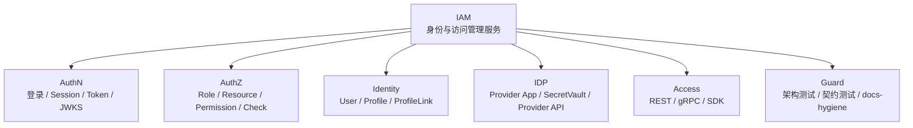

### 讲图台词

```text
我会先把 IAM 拆成六块：AuthN 管认证态，AuthZ 管访问权，Identity 管身份与档案关系，IDP 管第三方身份源，Access 管业务系统接入，Guard 管长期演进不漂移。
```

---

## A2. 普通用户中心 vs IAM

### 适用文档

```text
00-项目一句话定位.md
01-业务背景与问题.md
11-30分钟技术分享脚本.md
```

### 适合回答

```text
为什么不能说这是用户中心？
普通 users 表 CRUD 和 IAM 的差别在哪里？
```

### Mermaid

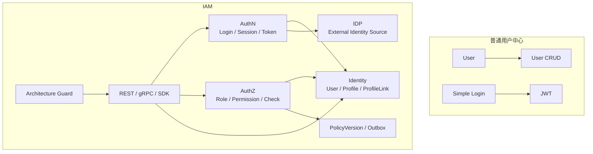

### 讲图台词

```text
普通用户中心的核心是 User CRUD 和简单登录，而 IAM 的核心是身份、认证、授权、会话、凭证、第三方身份源和业务系统接入。
```

---

# B. 系统架构图

## B1. 分层架构主图

### 适用文档

```text
02-系统架构讲法.md
10-工程质量与架构护栏讲法.md
11-30分钟技术分享脚本.md
```

### 适合回答

```text
项目整体架构是什么？
你怎么组织代码层次？
六边形架构体现在哪里？
```

### Mermaid

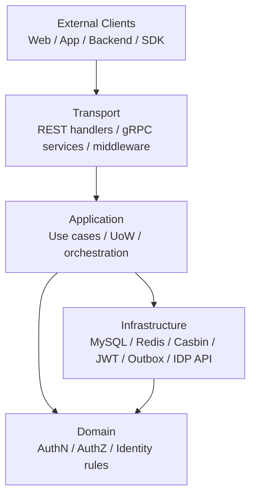

### 讲图台词

```text
Transport 只做协议适配，Application 负责编排用例和事务，Domain 承载业务规则，Infra 适配外部资源。核心逻辑不依赖 REST、gRPC、MySQL、Redis 或 Casbin 的具体实现。
```

---

## B2. 横向模块边界图

### 适用文档

```text
02-系统架构讲法.md
03-AuthN认证体系讲法.md
04-AuthZ授权体系讲法.md
05-Identity与ProfileLink讲法.md
06-IDP与第三方登录讲法.md
```

### 适合回答

```text
为什么拆 AuthN/AuthZ/Identity/IDP？
模块之间怎么协作？
```

### Mermaid

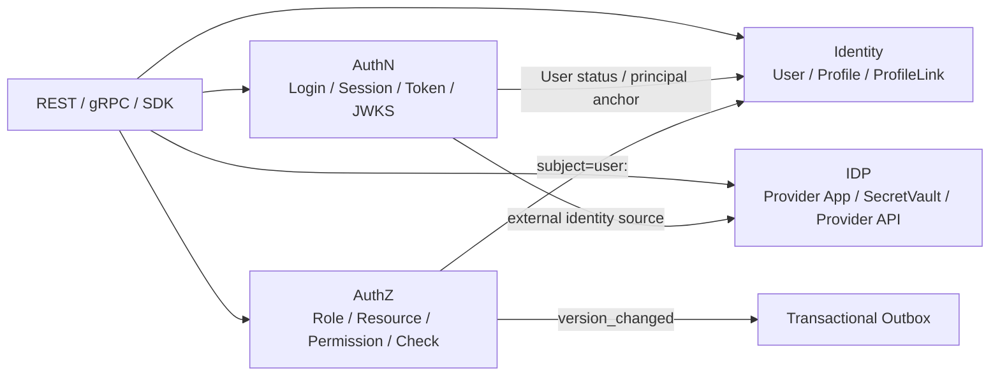

### 讲图台词

```text
AuthN、AuthZ、Identity、IDP 不是四个随便拆出来的目录，而是四类不同问题：认证态、访问权、身份关系和外部身份源。
```

---

## B3. 六边形架构图

### 适用文档

```text
02-系统架构讲法.md
10-工程质量与架构护栏讲法.md
```

### 适合回答

```text
你说用了六边形架构，哪里体现？
REST/gRPC、MySQL、Redis、Casbin 分别是什么角色？
```

### Mermaid

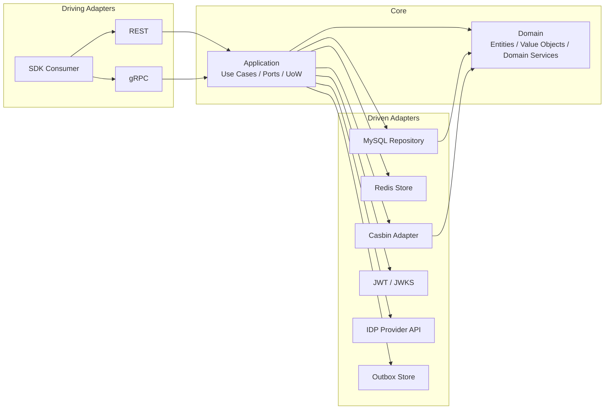

### 讲图台词

```text
REST/gRPC 是驱动适配器，MySQL/Redis/Casbin/JWT/IDP API 是被驱动适配器，中间的 Application/Domain 才是核心。
```

---

# C. 运行时装配图

## C1. 服务启动与组合根图

### 适用文档

```text
02-系统架构讲法.md
11-30分钟技术分享脚本.md
```

### 适合回答

```text
服务如何启动？
process 和 container 分别负责什么？
container 是不是 Service Locator？
```

### Mermaid

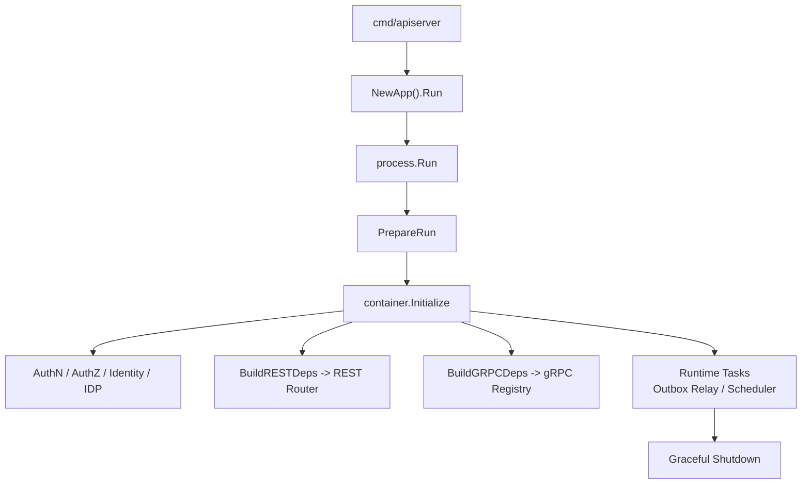

### 讲图台词

```text
main 很薄，process 负责生命周期，container 是组合根，模块能力最终投影给 REST、gRPC 和 runtime tasks。
```

---

## C2. Container 能力投影图

### 适用文档

```text
02-系统架构讲法.md
10-工程质量与架构护栏讲法.md
```

### 适合回答

```text
container 是不是 Service Locator？
REST/gRPC 怎么拿依赖？
```

### Mermaid

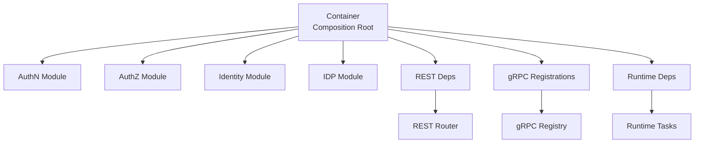

### 讲图台词

```text
container 只在启动阶段负责组装和能力投影，业务请求不会到 container 里随便取对象，所以它是 composition root，不是运行期 Service Locator。
```

---

# D. AuthN 认证链路图

## D1. AuthN 模型关系图

### 适用文档

```text
03-AuthN认证体系讲法.md
```

### 适合回答

```text
User、LoginIdentity、Credential、Challenge 是什么关系？
为什么登录方式不直接塞进 User？
```

### Mermaid

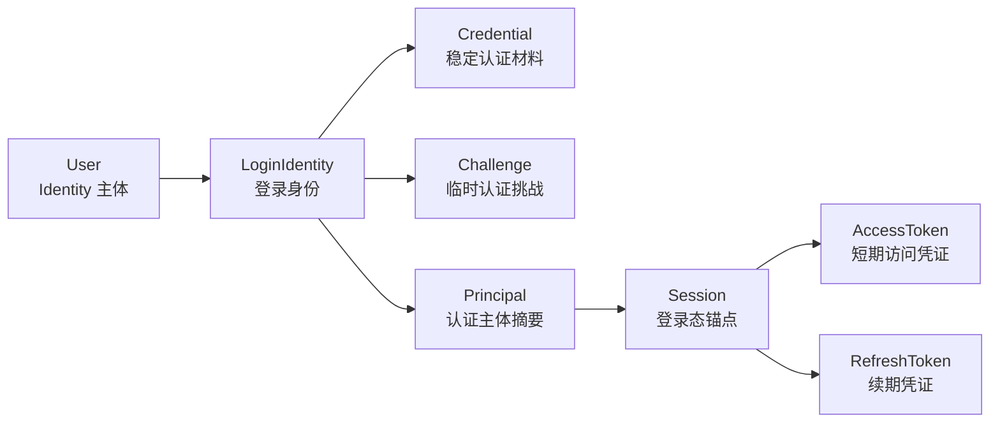

### 讲图台词

```text
User 是 Identity 的主体，LoginIdentity 是 AuthN 的登录入口，Credential 和 Challenge 是证明材料，认证成功后产出 Principal，再由 Session 和 Token 链路管理登录态。
```

---

## D2. AuthN 登录主链路图

### 适用文档

```text
03-AuthN认证体系讲法.md
07-JWKS与Token安全讲法.md
11-30分钟技术分享脚本.md
```

### 适合回答

```text
登录流程怎么设计？
为什么不是直接发 JWT？
不同登录方式如何统一？
```

### Mermaid

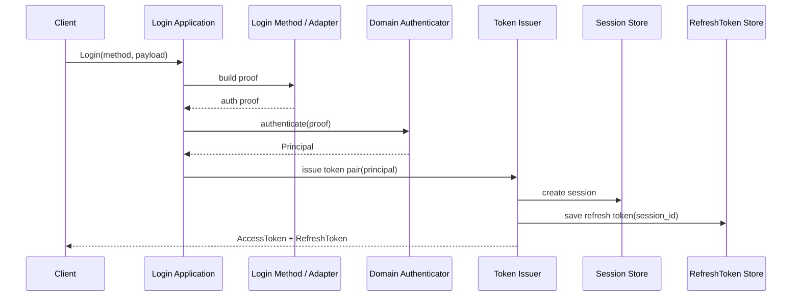

### 讲图台词

```text
不同登录方式先被适配成认证 proof，领域认证器输出 Principal，Token Issuer 再创建 Session 并签发 AccessToken / RefreshToken。
```

---

## D3. Session / Access / Refresh 分工图

### 适用文档

```text
03-AuthN认证体系讲法.md
07-JWKS与Token安全讲法.md
```

### 适合回答

```text
AccessToken 和 RefreshToken 怎么分工？
为什么需要 Session？
为什么不能只用 JWT？
```

### Mermaid

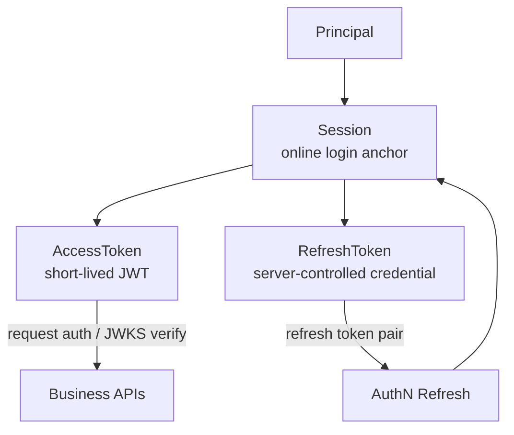

### 讲图台词

```text
AccessToken 负责访问，RefreshToken 负责续期，Session 是二者共同绑定的在线登录态锚点。
```

---

## D4. JWKS vs 在线 Verify 图

### 适用文档

```text
03-AuthN认证体系讲法.md
07-JWKS与Token安全讲法.md
```

### 适合回答

```text
JWKS 和在线 Verify 有什么区别？
本地验签通过为什么不代表用户仍然有效？
```

### Mermaid

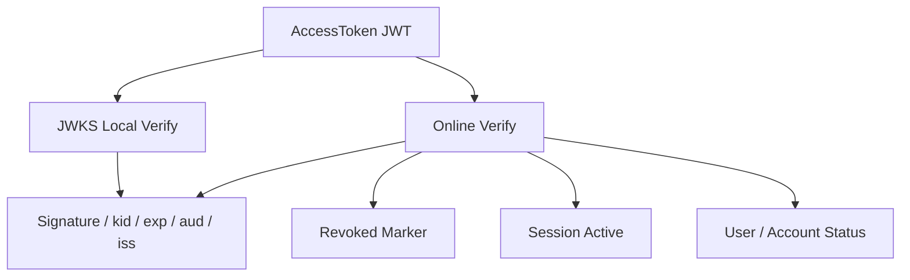

### 讲图台词

```text
JWKS 证明签名可信，在线 Verify 证明当前可用。两者不是替代关系。
```

---

## D5. KeyRotation 状态机

### 适用文档

```text
07-JWKS与Token安全讲法.md
```

### 适合回答

```text
JWKS 如何支持密钥轮换？
active / grace / retired 分别是什么？
```

### Mermaid

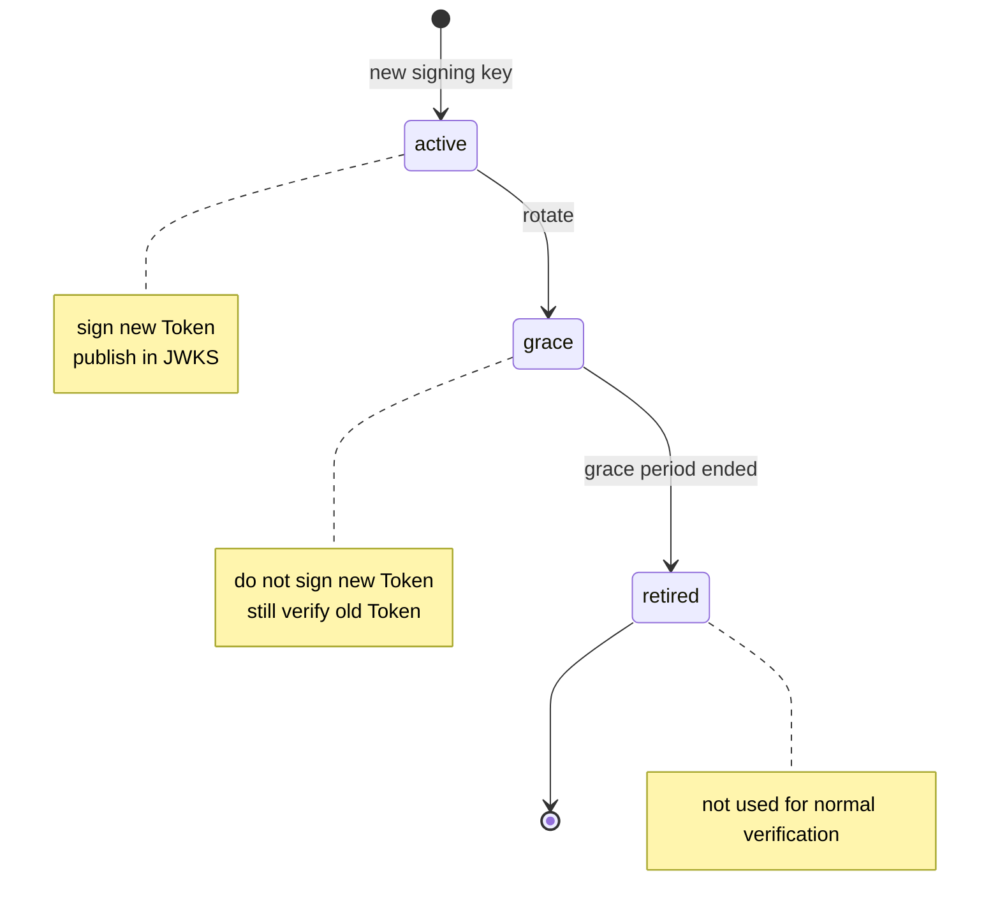

### 讲图台词

```text
active 负责签新 Token，grace 负责验旧 Token，retired 退出正常验证路径。这个状态机让 KeyRotation 平滑过渡。
```

---

# E. AuthZ 授权链路图

## E1. AuthZ 授权模型图

### 适用文档

```text
04-AuthZ授权体系讲法.md
08-Outbox与授权版本传播讲法.md
```

### 适合回答

```text
授权模型怎么设计？
为什么不用 user.role？
RoleBinding 和 Permission 分别表达什么？
```

### Mermaid

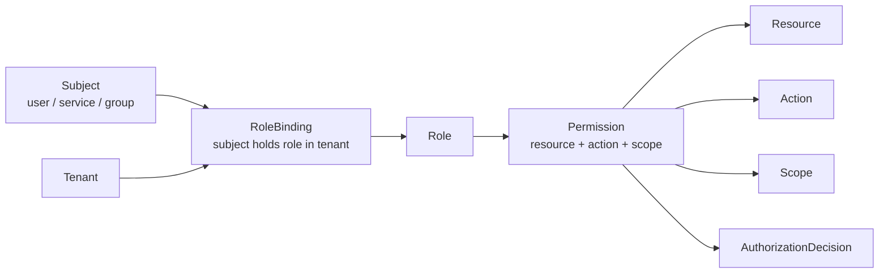

### 讲图台词

```text
Subject 不是直接有权限，而是在某个 Tenant 下通过 RoleBinding 获得 Role；Role 再通过 Permission 关联 Resource、Action 和 Scope。
```

---

## E2. AuthZ Check 链路图

### 适用文档

```text
04-AuthZ授权体系讲法.md
```

### 适合回答

```text
一次权限判定怎么走？
Casbin 在哪里？
业务服务要不要直接调用 Casbin？
```

### Mermaid

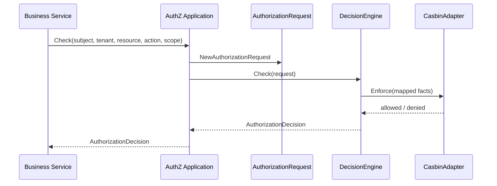

### 讲图台词

```text
业务服务不自己判断权限，也不直接调用 Casbin。它调用 IAM Check，AuthZ 应用层构造领域请求，DecisionEngine 负责判定，CasbinAdapter 只是 infra runtime 实现。
```

---

## E3. AuthZ 写入链路图

### 适用文档

```text
04-AuthZ授权体系讲法.md
08-Outbox与授权版本传播讲法.md
```

### 适合回答

```text
授权写入为什么不是 CRUD？
PolicyChangeCommitter 做什么？
```

### Mermaid

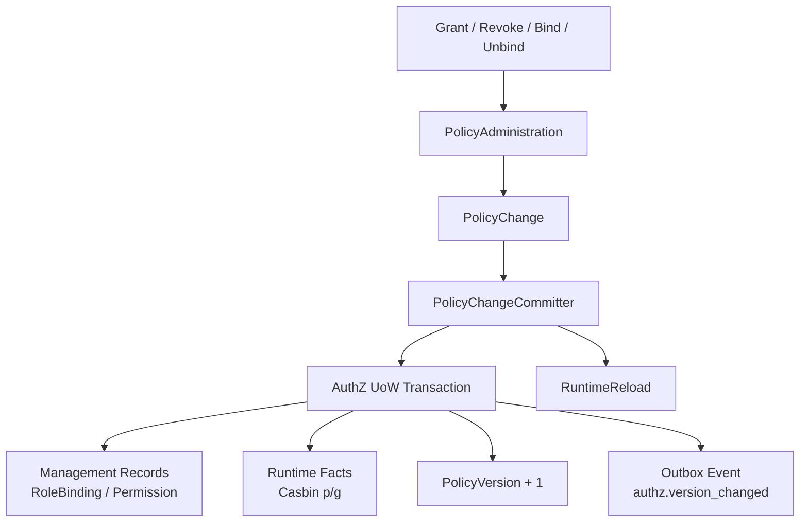

### 讲图台词

```text
授权写入不是单表 CRUD。PolicyChangeCommitter 在一个 UoW 中同时维护管理事实、运行时 facts、版本和 Outbox 事件，提交后再 reload runtime policy。
```

---

## E4. Outbox 授权版本传播图

### 适用文档

```text
08-Outbox与授权版本传播讲法.md
04-AuthZ授权体系讲法.md
```

### 适合回答

```text
为什么授权版本传播需要 Outbox？
DB commit 后直接 publish MQ 有什么问题？
```

### Mermaid

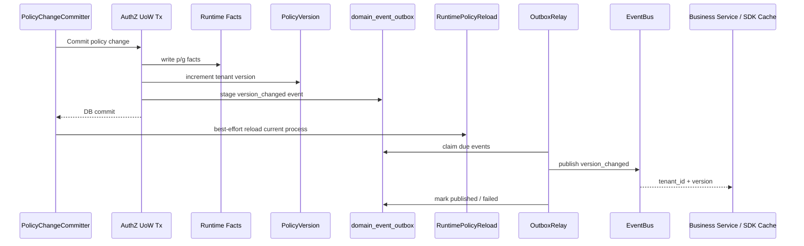

### 讲图台词

```text
授权 facts、PolicyVersion 和 outbox row 同事务提交；当前进程 reload 是提交后的本地刷新；事件发布是事务后的异步可靠投递。
```

---

## E5. Outbox 状态机

### 适用文档

```text
08-Outbox与授权版本传播讲法.md
```

### 适合回答

```text
Outbox 怎么重试？
为什么消费者要幂等？
Outbox 是 exactly-once 吗？
```

### Mermaid

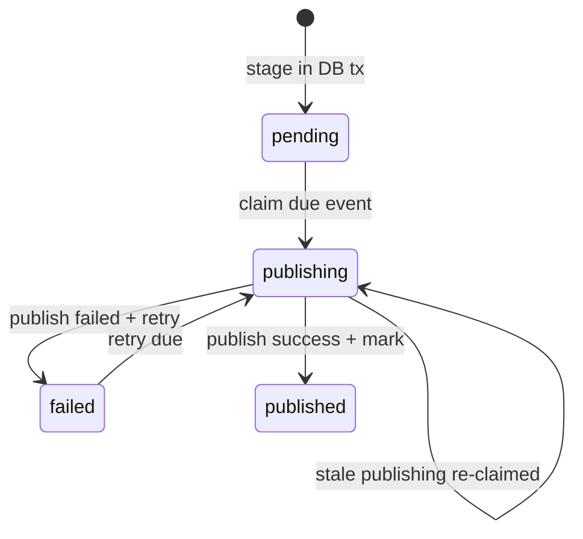

### 讲图台词

```text
Outbox 保证 at-least-once，不保证 exactly-once，所以消费者要按 event_id 或 tenant_id + version 幂等。
```

---

# F. Identity / ProfileLink 图

## F1. User / Profile / ProfileLink 图

### 适用文档

```text
05-Identity与ProfileLink讲法.md
11-30分钟技术分享脚本.md
```

### 适合回答

```text
为什么 User 和 Profile 要分开？
ProfileLink 为什么不能只是 User 字段？
为什么不是 user.profile_id？
```

### Mermaid

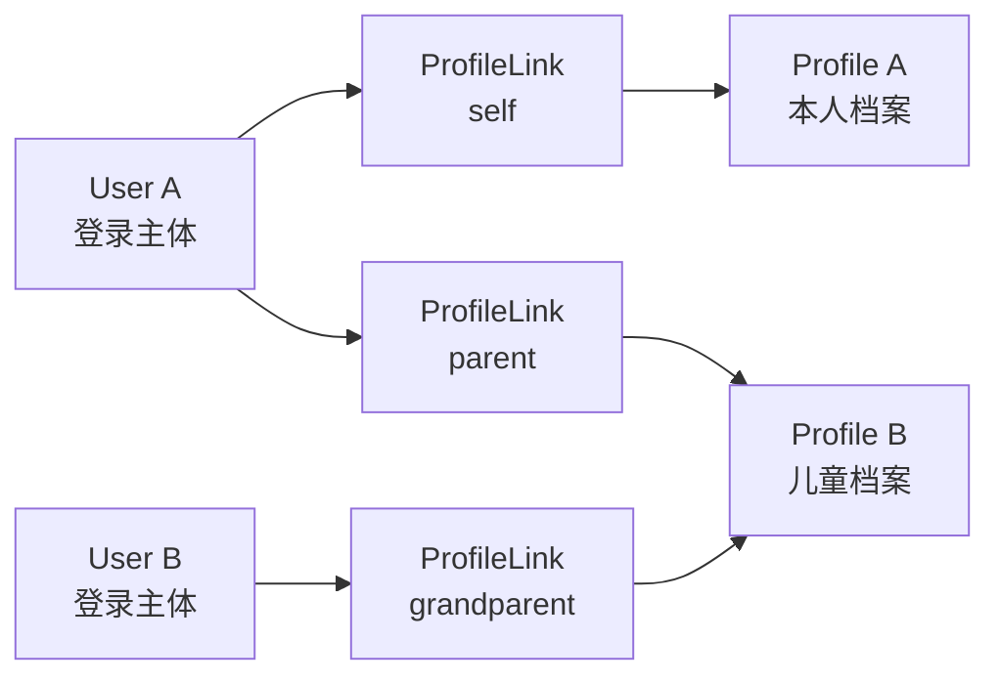

### 讲图台词

```text
User 是登录主体，Profile 是业务档案，ProfileLink 是二者之间的关系事实。它不是一对一字段，而是多对多关系边。
```

---

## F2. 当前用户 Profile 访问 guard 图

### 适用文档

```text
05-Identity与ProfileLink讲法.md
```

### 适合回答

```text
怎么防止用户访问别人的 Profile？
MyProfiles 为什么不能直接按 profile_id 查？
```

### Mermaid

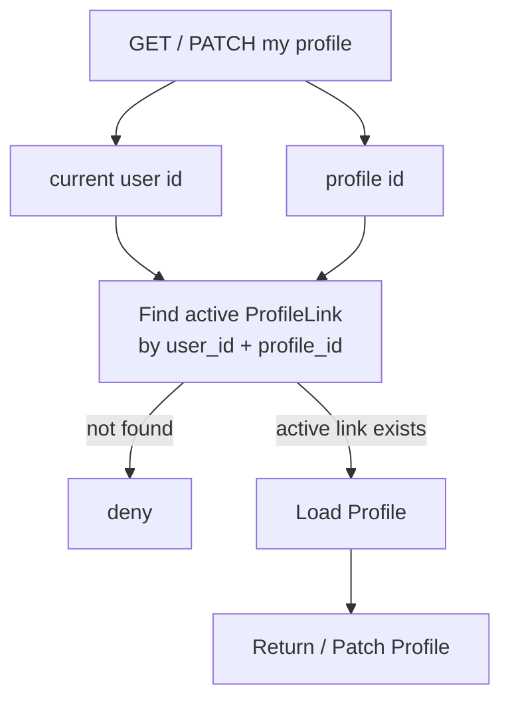

### 讲图台词

```text
当前用户不能直接按 profile_id 读写档案，必须先检查 current user 和 profile 之间是否存在 active ProfileLink。
```

---

## F3. Identity 与 AuthN/AuthZ 边界图

### 适用文档

```text
05-Identity与ProfileLink讲法.md
03-AuthN认证体系讲法.md
04-AuthZ授权体系讲法.md
```

### 适合回答

```text
Identity 和 AuthN/AuthZ 怎么协作？
ProfileLink 是权限吗？
```

### Mermaid

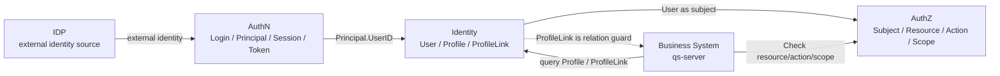

### 讲图台词

```text
Identity 提供 User、Profile、ProfileLink。AuthN 使用 UserID 作为登录主体，AuthZ 使用 user:<id> 作为 subject，业务系统可以查询 ProfileLink 做身份关系判断，但最终资源访问仍应走 AuthZ Check。
```

---

# G. IDP 与第三方登录图

## G1. IDP 与 AuthN 边界图

### 适用文档

```text
06-IDP与第三方登录讲法.md
03-AuthN认证体系讲法.md
```

### 适合回答

```text
IDP 和 AuthN 的边界是什么？
为什么 IDP 不签 IAM token？
```

### Mermaid

```mermaid
flowchart LR
    Client["Client<br/>wechat code / wecom auth_code"]
    AuthN["AuthN<br/>Login / Principal / Session / IAM Token"]
    IDP["IDP<br/>Provider App / SecretVault / External API"]
    Provider["WeChat / WeCom Platform"]
    Token["IAM TokenPair<br/>Access + Refresh"]

    Client --> AuthN
    AuthN -->|"query app config"| IDP
    AuthN -->|"decrypt secret"| IDP
    AuthN -->|"code exchange"| IDP
    IDP --> Provider
    AuthN -->|"binding + principal"| AuthN
    AuthN --> Token
```

### 讲图台词

```text
IDP 只提供外部身份源能力，AuthN 仍然是登录编排者和 IAM Token 签发者。
```

---

## G2. 微信小程序登录链路图

### 适用文档

```text
06-IDP与第三方登录讲法.md
03-AuthN认证体系讲法.md
```

### 适合回答

```text
微信登录怎么接入 IAM？
code2Session 成功是不是登录成功？
```

### Mermaid

```mermaid
sequenceDiagram
    participant Client as Mini Program
    participant AuthN as AuthN Login
    participant Method as WeChat LoginMethod
    participant Proof as ProofFactory
    participant IDP as IDP Repository / SecretVault
    participant WeChat as WeChat API
    participant Authenticator as Authenticator
    participant Token as Session / Token Issuer

    Client->>AuthN: login(app_id, js_code)
    AuthN->>Method: validate payload
    Method-->>AuthN: WeChat payload
    AuthN->>Proof: build auth proof
    Proof->>IDP: get app by app_id
    Proof->>IDP: decrypt AppSecret
    Proof->>WeChat: code2Session
    WeChat-->>Proof: openid / unionid
    Proof-->>AuthN: external identity proof
    AuthN->>Authenticator: authenticate / bind account
    Authenticator-->>AuthN: Principal
    AuthN->>Token: create Session + issue TokenPair
    Token-->>Client: IAM AccessToken + RefreshToken
```

### 讲图台词

```text
code2Session 只能证明外部微信身份，不等于 IAM 登录成功。必须经过 AuthN 的账号绑定、Principal 和 Token 签发链路。
```

---

## G3. 双 access token 区分图

### 适用文档

```text
06-IDP与第三方登录讲法.md
07-JWKS与Token安全讲法.md
```

### 适合回答

```text
微信 access_token 和 IAM AccessToken 是什么关系？
为什么名字一样但不能混淆？
```

### Mermaid

```mermaid
flowchart TB
    WechatToken["WeChat access_token<br/>调用微信平台 API"]
    IAMToken["IAM AccessToken<br/>访问 IAM / 业务系统"]
    IDP["IDP 管理"]
    AuthN["AuthN 管理"]
    WeChatAPI["WeChat / WeCom API"]
    BusinessAPI["Business APIs / IAM APIs"]

    IDP --> WechatToken --> WeChatAPI
    AuthN --> IAMToken --> BusinessAPI
```

### 讲图台词

```text
微信 access_token 和 IAM AccessToken 名字像，但完全不是一回事。前者属于外部平台访问令牌，后者属于 IAM 登录态访问凭证。
```

---

# H. 接入与工程护栏图

## H1. REST / gRPC / SDK 接入模型图

### 适用文档

```text
09-REST-gRPC-SDK接入讲法.md
11-30分钟技术分享脚本.md
```

### 适合回答

```text
为什么要同时提供 REST、gRPC、SDK？
REST/gRPC/SDK 是不是三套业务逻辑？
```

### Mermaid

```mermaid
flowchart TD
    Web["Web / App / Admin UI"]
    Service["Backend Service / Worker"]
    GoService["Go Business Service"]

    REST["REST API<br/>OpenAPI"]
    GRPC["gRPC API<br/>Proto"]
    SDK["Go SDK<br/>Client Facade"]

    IAM["IAM Server<br/>AuthN / AuthZ / Identity / IDP"]

    Web --> REST --> IAM
    Service --> GRPC --> IAM
    GoService --> SDK
    SDK --> REST
    SDK --> GRPC
```

### 讲图台词

```text
REST、gRPC、SDK 是同一套 IAM 能力面向不同调用方的接入投影，不是三套业务逻辑。
```

---

## H2. 接入方式选择图

### 适用文档

```text
09-REST-gRPC-SDK接入讲法.md
```

### 适合回答

```text
什么场景用 REST？
什么场景用 gRPC？
什么场景用 SDK？
```

### Mermaid

```mermaid
flowchart LR
    Need["调用需求"]
    Login["用户登录 / 管理后台 / HTTP 调试"]
    S2S["服务间 Verify / AuthZ / Identity 查询"]
    GoApp["Go 服务接入 IAM"]

    REST["REST"]
    GRPC["gRPC"]
    SDK["SDK"]

    Need --> Login --> REST
    Need --> S2S --> GRPC
    Need --> GoApp --> SDK
```

### 讲图台词

```text
选择接入方式不是看哪种技术更高级，而是看调用方和场景。
```

---

## H3. qs-server 接入 IAM 主链路图

### 适用文档

```text
09-REST-gRPC-SDK接入讲法.md
11-30分钟技术分享脚本.md
```

### 适合回答

```text
业务系统如何接入 IAM？
qs-server 如何使用 Token、Identity 和 AuthZ？
```

### Mermaid

```mermaid
sequenceDiagram
    participant Client as Client / Frontend
    participant IAMRest as IAM REST AuthN
    participant QS as qs-server
    participant SDK as IAM SDK / gRPC
    participant IAM as IAM Server

    Client->>IAMRest: Login
    IAMRest-->>Client: AccessToken + RefreshToken
    Client->>QS: Business API with Bearer Token
    QS->>SDK: VerifyToken
    SDK->>IAM: AuthN Verify
    IAM-->>SDK: Principal
    SDK-->>QS: Principal
    QS->>SDK: Identity Query if needed
    SDK->>IAM: GetUser / GetProfile / ListProfileLinks
    IAM-->>SDK: Identity data
    QS->>SDK: AuthZ Check(resource, action, scope)
    SDK->>IAM: Check
    IAM-->>SDK: AuthorizationDecision
    SDK-->>QS: allow / deny
    QS-->>Client: business response
```

### 讲图台词

```text
前端登录 IAM，业务请求进 qs-server，qs-server 通过 SDK/gRPC 验 Token、查身份、做 AuthZ Check，不复制 IAM 的账号、角色和权限表。
```

---

## H4. 工程护栏总图

### 适用文档

```text
10-工程质量与架构护栏讲法.md
06-架构护栏/README.md
```

### 适合回答

```text
你怎么保证系统长期不乱？
工程质量怎么体现？
```

### Mermaid

```mermaid
flowchart TD
    Quality["工程质量与架构护栏"]

    Arch["架构测试<br/>依赖方向 / 分层边界"]
    REST["REST 契约<br/>路由 / OpenAPI"]
    GRPC["gRPC 契约<br/>proto / registration"]
    SDK["SDK 公开面<br/>compile test"]
    Docs["文档事实源<br/>docs-hygiene"]

    Quality --> Arch
    Quality --> REST
    Quality --> GRPC
    Quality --> SDK
    Quality --> Docs
```

### 讲图台词

```text
工程质量不是只靠业务测试，而是把架构边界、接口契约、SDK 公开面和文档事实源都做成自动化护栏。
```

---

## H5. 分层依赖护栏图

### 适用文档

```text
10-工程质量与架构护栏讲法.md
06-架构护栏/01-架构测试与依赖边界.md
```

### 适合回答

```text
architecture tests 保护什么？
为什么说不是目录洁癖？
```

### Mermaid

```mermaid
flowchart TD
    Transport["Transport<br/>REST / gRPC"]
    Application["Application<br/>Use Case / UoW"]
    Domain["Domain<br/>Business Rules"]
    Infra["Infra<br/>MySQL / Redis / Casbin / JWT / Outbox"]
    Container["Container<br/>Composition Root"]
    SDK["pkg/sdk<br/>External Go API"]

    Transport --> Application
    Application --> Domain
    Infra --> Domain
    Container --> Application
    Container --> Infra

    Domain -. forbidden .-> Infra
    Domain -. forbidden .-> Transport
    Application -. forbidden .-> Transport
    Application -. forbidden .-> Infra
    Transport -. forbidden .-> Container
    Transport -. forbidden .-> Infra
    SDK -. forbidden .-> Internal["internal/apiserver"]
```

### 讲图台词

```text
架构测试保护的是依赖方向，不是目录洁癖。核心是业务规则向内，协议和基础设施向外。
```

---

## H6. 契约防漂移图

### 适用文档

```text
10-工程质量与架构护栏讲法.md
06-架构护栏/02-文档事实源与防漂移机制.md
09-REST-gRPC-SDK接入讲法.md
```

### 适合回答

```text
如何防止 REST/gRPC/SDK 文档和代码不一致？
契约事实源是什么？
```

### Mermaid

```mermaid
flowchart LR
    RESTCode["Runtime REST Routes"]
    OpenAPI["api/rest OpenAPI"]
    RESTTest["router matrix / route contract"]

    Proto["api/grpc proto"]
    GRPCReg["gRPC service registration"]
    ProtoTest["proto contract test"]

    SDKAPI["pkg/sdk public API"]
    Compile["public API compile test"]

    RESTCode <--> RESTTest <--> OpenAPI
    Proto <--> ProtoTest <--> GRPCReg
    SDKAPI --> Compile
```

### 讲图台词

```text
REST、gRPC、SDK 各自有事实源和契约测试，不靠人工记忆维护一致性。
```

---

# I. 面试推荐 5 张核心图

如果是面试，建议只准备 5 张图：

```text
1. IAM 总定位图；
2. 分层架构主图；
3. AuthN 登录主链路图；
4. AuthZ 授权模型图 + AuthZ 写入链路图；
5. User / Profile / ProfileLink 图。
```

原因：

| 图 | 面试价值 |
| --- | --- |
| IAM 总定位图 | 迅速说明项目不是普通用户中心 |
| 分层架构主图 | 展示工程架构能力 |
| AuthN 登录主链路图 | 展示认证与 Token 安全理解 |
| AuthZ 授权模型 + 写入链路图 | 展示复杂业务建模与一致性治理 |
| User/Profile/ProfileLink 图 | 展示领域建模能力 |

如果还有时间，再补：

```text
JWKS vs 在线 Verify；
Outbox 状态机；
REST/gRPC/SDK 接入模型；
工程护栏总图。
```

面试白板时不要追求图复杂。

每张图只讲一个问题：

```text
定位图：这个项目是什么；
分层图：项目如何组织；
AuthN 图：登录如何变成 Token；
AuthZ 图：权限如何判定和传播；
ProfileLink 图：身份关系如何建模。
```

---

# J. 30 分钟分享推荐图序

如果是 30 分钟技术分享，推荐图序：

```text
1. IAM 总定位图；
2. 分层架构主图；
3. 横向模块边界图；
4. AuthN 登录主链路图；
5. JWKS vs 在线 Verify 图；
6. AuthZ 授权模型图；
7. AuthZ 写入链路图；
8. User / Profile / ProfileLink 图；
9. IDP 与 AuthN 边界图；
10. REST / gRPC / SDK 接入模型图；
11. 工程护栏总图。
```

时间不足时删掉：

```text
KeyRotation 状态机；
Outbox 状态机；
Container 能力投影图；
当前用户 Profile guard 图；
契约防漂移图。
```

不要删：

```text
定位图；
分层图；
AuthN 图；
AuthZ 图；
ProfileLink 图。
```

---

# K. 图的使用规则

## K1. 一张图只讲一个问题

错误：

```text
一张图塞进所有模块、所有表、所有接口、所有依赖。
```

正确：

```text
每张图只回答一个核心问题。
```

例如：

```text
AuthN 登录主链路图 -> 登录如何变成 Token；
JWKS vs Verify 图 -> 签名可信和当前可用的区别；
ProfileLink 图 -> User/Profile 为什么不是一对一；
Outbox 状态机 -> 为什么消费者要幂等。
```

---

## K2. 面试时少画细节，多画边界

面试官通常更关心：

```text
你怎么拆边界？
你为什么这么设计？
失败时怎么办？
这套设计如何演进？
```

不一定关心：

```text
每个 handler 名字；
每个 DTO 字段；
每个表字段；
每个测试函数名。
```

---

## K3. 不要画出你讲不清楚的东西

如果一张图里有：

```text
你没看过的源码；
你不理解的模块；
你无法解释的箭头；
你无法回链证据的未来能力。
```

不要放进面试图里。

---

## K4. 图要能回链证据

每张图都应该能回链到：

```text
源码；
OpenAPI；
proto；
SDK；
测试；
事实层文档。
```

不要画“凭感觉”的图。

---

## K5. 不要把规划能力画成当前能力

比如：

```text
完整多租户管理平台；
完整 OAuth/OIDC Provider 平台；
完整服务间 mTLS；
完整多语言 SDK；
完整可视化权限运维平台。
```

如果当前代码尚未完整实现，就不要画成已完成能力。

可以写成：

```text
后续演进方向；
架构预留；
暂未完整实现。
```

---

# L. 证据链索引

| 图类 | 事实层证据 |
| --- | --- |
| 项目定位图 | `docs/00-概览`、`docs/07-宣讲/00-项目一句话定位.md` |
| 业务背景图 | `docs/07-宣讲/01-业务背景与问题.md` |
| 系统架构图 | `docs/00-概览`、`docs/01-运行时`、`docs/07-宣讲/02-系统架构讲法.md` |
| AuthN 图 | `docs/02-认证AuthN`、`docs/07-宣讲/03-AuthN认证体系讲法.md` |
| Token / JWKS 图 | `docs/02-认证AuthN/04-*`、`docs/02-认证AuthN/05-*`、`docs/02-认证AuthN/06-*`、`docs/07-宣讲/07-JWKS与Token安全讲法.md` |
| AuthZ 图 | `docs/03-授权AuthZ`、`docs/07-宣讲/04-AuthZ授权体系讲法.md` |
| Outbox 图 | `docs/03-授权AuthZ/04-*`、`docs/07-宣讲/08-Outbox与授权版本传播讲法.md` |
| Identity 图 | `docs/04-身份Identity`、`docs/07-宣讲/05-Identity与ProfileLink讲法.md` |
| IDP 图 | `docs/02-认证AuthN/07-*`、`docs/07-宣讲/06-IDP与第三方登录讲法.md` |
| 接入图 | `docs/05-接入与契约`、`docs/07-宣讲/09-REST-gRPC-SDK接入讲法.md` |
| 工程护栏图 | `docs/06-架构护栏`、`docs/07-宣讲/10-工程质量与架构护栏讲法.md` |

不要把已归档的专题分析作为当前证据源。

---

# 本文总结

`12-架构图素材索引.md` 的作用是：

```text
帮你把 IAM 项目的关键设计转成可讲、可画、可追问的图。
```

最重要的不是图多，而是图服务讲法。

IAM 对外宣讲建议永远围绕这条主线组织图：

```text
项目定位
  -> 系统架构
  -> AuthN
  -> AuthZ
  -> Identity
  -> IDP
  -> 接入
  -> 工程护栏
```

面试优先准备 5 张图：

```text
IAM 总定位图；
分层架构主图；
AuthN 登录主链路图；
AuthZ 授权模型 / 写入链路图；
User / Profile / ProfileLink 图。
```

这 5 张图讲清楚，IAM 项目的核心能力、复杂度和工程价值就基本能讲出来。

如果只记住一句话：

```text
架构图不是为了展示复杂度，而是为了用最少的视觉元素讲清边界、链路、取舍和证据。
```
