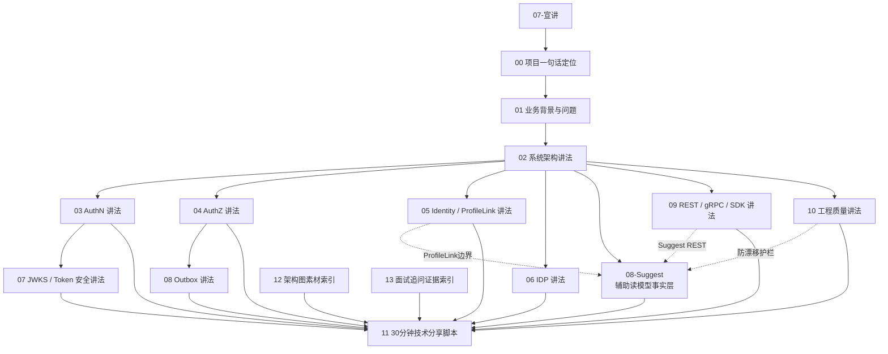

# 07-宣讲

## 1. 模块定位

`07-宣讲/` 是 IAM 文档体系中的 **表达层、面试准备层和技术分享层**。

它不负责重新解释源码细节，也不替代事实层文档。

它回答的是：

```text
IAM 项目如何对外讲清楚？
面试时如何介绍项目？
30 分钟技术分享如何组织？
每个模块应该怎么讲？
Suggest 这类辅助读模型应该怎么讲，才不被误解为核心身份域或完整搜索服务？
架构图如何准备？
追问时如何回链证据？
```

本目录服务于：

```text
面试准备；
技术分享；
项目答辩；
简历项目介绍；
朋友/同事讲解；
个人项目复盘。
```

一句话：

> `07-宣讲/` 是表达层：把 `docs/00`～`docs/06` 以及 `docs/08-Suggest` 的系统事实、设计边界和证据链，组织成可对外讲、可面试答、可技术分享的材料。

---

## 2. 30 秒结论

`07-宣讲/` 的目标，是把 IAM 从“我写了很多代码”转成一套清楚的表达：

```text
项目定位
  -> 业务背景
  -> 系统架构
  -> AuthN
  -> AuthZ
  -> Identity / ProfileLink
  -> IDP
  -> JWKS / Token 安全
  -> Outbox
  -> REST / gRPC / SDK
  -> Suggest 辅助读模型
  -> 工程质量
  -> 30 分钟分享
  -> 架构图
  -> 面试追问
```

表达层必须遵守一个原则：

```text
表达可以更顺，但事实不能变形；
讲法可以更聚焦，但能力不能夸大；
面试可以提炼亮点，但必须能回链源码、契约、测试和事实层文档；
Suggest 可以作为工程亮点讲，但不能讲成 IAM 核心身份域、完整搜索服务或 AuthZ 权限中心。
```

IAM 对外表达时，建议这样定位 Suggest：

```text
AuthN / AuthZ / Identity / IDP 是 IAM 主线能力；
Suggest 是 iam-apiserver 内置的 Profile 联想搜索辅助读模型；
它服务 operating 后台 autocomplete，体现高频查询、权限范围过滤、索引刷新、手机号安全、限流、指标和降级设计；
它不是完整搜索服务，不是完整组织权限系统，也不是 AuthZ 判定中心。
```

---

## 3. 本目录文档

当前 `07-宣讲/` 包含 14 篇正文文档：

```text
07-宣讲/
├── README.md
├── 00-项目一句话定位.md
├── 01-业务背景与问题.md
├── 02-系统架构讲法.md
├── 03-AuthN认证体系讲法.md
├── 04-AuthZ授权体系讲法.md
├── 05-Identity与ProfileLink讲法.md
├── 06-IDP与第三方登录讲法.md
├── 07-JWKS与Token安全讲法.md
├── 08-Outbox与授权版本传播讲法.md
├── 09-REST-gRPC-SDK接入讲法.md
├── 10-工程质量与架构护栏讲法.md
├── 11-30分钟技术分享脚本.md
├── 12-架构图素材索引.md
└── 13-面试追问证据索引.md
```

| 文档 | 作用 |
| --- | --- |
| `00-项目一句话定位.md` | 给 IAM 一个可背、可讲、可写简历的定位 |
| `01-业务背景与问题.md` | 解释为什么业务系统需要 IAM |
| `02-系统架构讲法.md` | 讲分层、模块、运行时和架构亮点，包括 Suggest 作为辅助读模型如何纳入 iam-apiserver |
| `03-AuthN认证体系讲法.md` | 讲 User/LoginIdentity/Credential/Challenge、Principal、Session、Token、Verify |
| `04-AuthZ授权体系讲法.md` | 讲 Subject、Role、Resource、Permission、RoleBinding、Check、PolicyChange、Outbox |
| `05-Identity与ProfileLink讲法.md` | 讲 User、Profile、ProfileLink 建模与身份关系边界，并区分 ProfileLink 与 Suggest ProfileAccessScope |
| `06-IDP与第三方登录讲法.md` | 讲 IDP / AuthN 边界与微信、企微第三方登录 |
| `07-JWKS与Token安全讲法.md` | 讲 JWT、JWS、JWK、JWKS、KeyRotation、Online Verify |
| `08-Outbox与授权版本传播讲法.md` | 讲 PolicyVersion、Transactional Outbox、Relay、at-least-once、幂等 |
| `09-REST-gRPC-SDK接入讲法.md` | 讲 REST、gRPC、SDK 三层接入投影，并补充 Suggest REST 管理端 autocomplete |
| `10-工程质量与架构护栏讲法.md` | 讲 architecture tests、contract tests、SDK compile test、docs-hygiene、Suggest 防漂移护栏 |
| `11-30分钟技术分享脚本.md` | 整合型 30 分钟分享讲稿 |
| `12-架构图素材索引.md` | 可复用 Mermaid 图素材索引，包括 Suggest 查询与刷新图 |
| `13-面试追问证据索引.md` | 问题 -> 回答 -> 证据 -> 展开 的面试作战地图，包括 Suggest 追问 |

当前暂不新增独立 `14-Suggest讲法.md`。

原因是 Suggest 更适合作为：

```text
系统架构中的辅助读模型；
REST 接入中的管理端 autocomplete；
Identity 边界中的 ProfileLink / ProfileAccessScope 对比；
工程质量中的安全、限流、降级和防漂移案例；
面试追问中的专项亮点。
```

如果后续希望把 Suggest 做成独立宣讲专题，再新增：

```text
14-Suggest辅助读模型讲法.md
```

---

## 4. 宣讲知识地图



---

## 5. 推荐阅读顺序

### 5.1 面试准备顺序

```text
00-项目一句话定位.md
  -> 01-业务背景与问题.md
  -> 02-系统架构讲法.md
  -> 03-AuthN认证体系讲法.md
  -> 04-AuthZ授权体系讲法.md
  -> 05-Identity与ProfileLink讲法.md
  -> 07-JWKS与Token安全讲法.md
  -> 08-Outbox与授权版本传播讲法.md
  -> 09-REST-gRPC-SDK接入讲法.md
  -> 10-工程质量与架构护栏讲法.md
  -> 13-面试追问证据索引.md
```

重点：

```text
先能讲清项目；
再能讲清架构；
再能讲清 AuthN / AuthZ / Identity 三条主线；
再能把 Suggest 作为辅助读模型工程亮点讲清楚；
最后准备追问证据。
```

如果面试官追问 Suggest，再回链：

```text
../08-Suggest/README.md
../08-Suggest/01-查询链路-SuggestProfile从请求到索引过滤.md
../08-Suggest/02-权限范围-OperatingPrincipal与ProfileAccessScope.md
../08-Suggest/03-索引模型-ProfileSearchTerm-Trie-Hash-Runtime.md
../08-Suggest/04-刷新链路-Loader-Refresher-FullDelta-Snapshot.md
../08-Suggest/05-安全与运维-手机号搜索-限流-指标-降级.md
```

---

### 5.2 30 分钟技术分享准备顺序

```text
11-30分钟技术分享脚本.md
  -> 12-架构图素材索引.md
  -> 00-项目一句话定位.md
  -> 02-系统架构讲法.md
  -> 03-AuthN认证体系讲法.md
  -> 04-AuthZ授权体系讲法.md
  -> 05-Identity与ProfileLink讲法.md
  -> 09-REST-gRPC-SDK接入讲法.md
  -> 10-工程质量与架构护栏讲法.md
```

重点：

```text
先拿完整脚本；
再选图；
最后补细节；
Suggest 不单独抢主线时间，但可以作为系统架构、REST 接入和工程护栏里的亮点补充。
```

---

### 5.3 简历项目描述准备顺序

```text
00-项目一句话定位.md
  -> 01-业务背景与问题.md
  -> 03-AuthN认证体系讲法.md
  -> 04-AuthZ授权体系讲法.md
  -> 05-Identity与ProfileLink讲法.md
  -> 09-REST-gRPC-SDK接入讲法.md
  -> 13-面试追问证据索引.md
```

重点：

```text
一句话定位；
项目价值；
技术亮点；
可追问证据；
Suggest 可以作为“内置高频联想搜索读模型”的工程亮点，但不要替代 AuthN/AuthZ 主线。
```

---

### 5.4 架构答辩准备顺序

```text
02-系统架构讲法.md
  -> 10-工程质量与架构护栏讲法.md
  -> 12-架构图素材索引.md
  -> 13-面试追问证据索引.md
```

重点：

```text
分层；
模块；
边界；
辅助读模型；
护栏；
证据。
```

---

### 5.5 Suggest 专项追问准备顺序

```text
../08-Suggest/README.md
  -> ../08-Suggest/01-查询链路-SuggestProfile从请求到索引过滤.md
  -> ../08-Suggest/02-权限范围-OperatingPrincipal与ProfileAccessScope.md
  -> ../08-Suggest/03-索引模型-ProfileSearchTerm-Trie-Hash-Runtime.md
  -> ../08-Suggest/04-刷新链路-Loader-Refresher-FullDelta-Snapshot.md
  -> ../08-Suggest/05-安全与运维-手机号搜索-限流-指标-降级.md
  -> 13-面试追问证据索引.md
```

重点：

```text
为什么 Suggest 暂留 IAM，而不是独立服务；
为什么不是直接 MySQL autocomplete；
ProfileAccessScope 如何过滤可见候选；
ProfileLink 与 ProfileAccessScope 有什么区别；
手机号搜索为什么需要授权、限流和脱敏；
Trie / Hash / Runtime 如何服务高频查询；
Full / Delta refresh 如何维护索引；
DegradedService 为什么可以返回空结果。
```

---

## 6. 宣讲主线

IAM 对外表达建议围绕这条主线：

```text
为什么需要 IAM
  -> IAM 如何拆分边界
  -> AuthN 如何管理登录态
  -> AuthZ 如何判定和传播权限
  -> Identity 如何表达身份关系
  -> IDP 如何接入第三方身份源
  -> REST / gRPC / SDK 如何服务业务系统
  -> Suggest 如何服务管理后台 Profile autocomplete
  -> 架构护栏如何保护长期演进
```

不要一上来堆技术名词：

```text
JWT；
Casbin；
Redis；
gRPC；
Outbox；
Trie；
Hash；
DDD。
```

正确顺序是：

```text
业务问题
  -> 领域边界
  -> 技术实现
  -> 工程取舍
  -> 证据链
```

Suggest 的表达顺序建议是：

```text
管理后台需要快速定位 Profile
  -> 直接 MySQL 查询难以兼顾拼音/简拼、手机号安全、权限过滤和低延迟
  -> IAM 内置 Suggest 辅助读模型
  -> Query 进入 REST 后构造 OperatingPrincipal 和 ProfileAccessScope
  -> Trie / Hash / Runtime 做高频匹配
  -> Scope filter 保证只返回可见候选
  -> mobile_mask、限流、指标和降级保护安全与稳定性
```

---

## 7. 最短项目定位

如果只允许说一句话：

```text
IAM 是一个面向业务系统接入的身份与访问管理服务，统一提供登录认证、Session 与 Token 管理、资源授权判定、User/Profile/ProfileLink 身份关系、第三方身份源集成、REST/gRPC/SDK 接入能力，并内置 Profile 联想搜索辅助读模型服务管理后台 autocomplete。
```

如果只允许说 10 秒：

```text
IAM 不是普通用户中心，而是统一处理认证、授权、身份关系、业务系统接入，并提供管理端 Profile 联想搜索能力的基础服务。
```

如果面试表达需要更聚焦，可以把 Suggest 降级为补充句：

```text
除了核心 AuthN/AuthZ/Identity/IDP，我还在 IAM 内实现了一个 Suggest 辅助读模型，用于后台 Profile autocomplete，并解决权限过滤、手机号安全和索引刷新问题。
```

---

## 8. 面试推荐图

面试优先准备 5 张主线图：

```text
1. IAM 总定位图；
2. 分层架构主图；
3. AuthN 登录主链路图；
4. AuthZ 授权模型 / 写入链路图；
5. User / Profile / ProfileLink 图。
```

这 5 张图覆盖：

```text
项目定位；
架构能力；
认证安全；
授权建模；
领域建模。
```

如果还有余力，准备第 6 张：

```text
6. Suggest 查询链路图：OperatingPrincipal -> ProfileAccessScope -> Trie/Hash -> scope filter -> mobile_mask。
```

再进一步准备：

```text
JWKS vs 在线 Verify；
Outbox 状态机；
REST / gRPC / SDK 接入模型；
Suggest Full / Delta refresh；
工程护栏总图。
```

---

## 9. 面试追问主线

面试时最容易追问的方向：

| 方向 | 高频问题 |
| --- | --- |
| 项目定位 | 为什么不是普通用户中心？ |
| 架构 | 为什么分层？container 是不是 Service Locator？ |
| AuthN | 为什么不只用 JWT？Session 和 RefreshToken 怎么分工？ |
| Token 安全 | JWKS 和在线 Verify 有什么区别？KeyRotation 怎么做？ |
| AuthZ | 为什么不用 user.role？Casbin 是什么角色？ |
| AuthZ 写入 | 为什么不是 CRUD？PolicyVersion 和 Outbox 有什么用？ |
| Identity | User 和 Profile 为什么分开？ProfileLink 为什么不是字段？ |
| IDP | 为什么 IDP 不直接签 IAM Token？ |
| 接入 | REST / gRPC / SDK 怎么划分？SDK 为什么不是业务层？ |
| Suggest | 为什么不直接查 MySQL？为什么不拆独立服务？如何保证只返回有权限的 Profile？ |
| 工程质量 | 怎么防止系统越写越乱？ |

回答方式建议：

```text
结论
  -> 原因
  -> 当前设计
  -> 代码 / 契约 / 测试证据
  -> 代价和边界
```

Suggest 追问的回答边界：

```text
可以讲：ProfileAccessScope、Trie / Hash、Full / Delta refresh、mobile_mask、限流、指标、降级；
不要讲：Suggest 是完整搜索服务、Suggest 是 AuthZ 中心、ProfileLink 直接等于可见范围、手机号明文返回。
```

---

## 10. 宣讲文档与事实层的关系

宣讲文档不是事实源。

如果宣讲内容与事实层冲突，按以下优先级判断：

```text
1. 源码和运行时行为；
2. OpenAPI / proto / SDK public API / configs / migrations；
3. 测试与架构护栏；
4. 00～06 事实层文档；
5. 08-Suggest 辅助读模型文档；
6. 07 宣讲表达；
7. _archive 历史材料。
```

宣讲文档要随事实层更新。

不能为了表达顺滑而牺牲准确性。

特别是 Suggest：

```text
如果 docs/08-Suggest、api/rest/suggest.v2.yaml、transport/rest/suggest、application/suggest、domain/suggest、infra/suggest 与宣讲文档冲突，优先相信代码、契约、测试和 docs/08-Suggest。
```

---

## 11. 与其他目录的关系

| 目录 | 关系 |
| --- | --- |
| `00-概览` | 提供系统定位与总图，宣讲模块从中提炼一句话定位和架构讲法 |
| `01-运行时` | 提供 process/container/transport/Suggest refresh 事实，宣讲模块转成架构白板讲法 |
| `02-认证AuthN` | 提供 AuthN 事实链路，宣讲模块转成认证体系讲法 |
| `03-授权AuthZ` | 提供 AuthZ 事实链路，宣讲模块转成授权体系讲法 |
| `04-身份Identity` | 提供 User/Profile/ProfileLink 事实，宣讲模块转成领域建模讲法，并区分 ProfileLink 与 ProfileAccessScope |
| `05-接入与契约` | 提供 REST/gRPC/SDK/Suggest REST 事实，宣讲模块转成接入讲法 |
| `06-架构护栏` | 提供工程护栏和文档防漂移事实，宣讲模块转成工程质量亮点 |
| `08-Suggest` | 提供 Profile 联想搜索辅助读模型事实，宣讲模块转成 Suggest 工程亮点与追问证据 |
| `_archive` | 历史材料，不作为当前宣讲证据源 |

---

## 12. 常见误区

### 12.1 宣讲文档可以夸大系统能力

错误。

宣讲应该准确表达当前事实，不能把规划能力说成已完成能力。

---

### 12.2 面试只需要背讲稿

错误。

讲稿只能帮助组织语言。

真正面试要能回链源码、契约和测试证据。

---

### 12.3 技术分享要把所有源码讲完

错误。

30 分钟分享应该讲主线、边界和关键取舍，不应逐文件解释。

---

### 12.4 架构图越复杂越好

错误。

一张图只回答一个问题。

面试图以清楚为第一优先级。

---

### 12.5 只讲技术点，不讲业务问题

错误。

技术点必须从业务问题和系统复杂度中自然引出。

---

### 12.6 把 Suggest 讲成 IAM 核心身份域

错误。

Suggest 是 Profile 联想搜索辅助读模型，不是 Identity 核心域。

Identity 的核心仍然是：

```text
User / Profile / ProfileLink
```

---

### 12.7 把 Suggest 讲成完整搜索服务

错误。

Suggest 服务 operating 后台 autocomplete，不是全文检索平台。

它解决的是：

```text
低延迟候选匹配；
ProfileAccessScope 过滤；
手机号搜索安全；
索引刷新；
降级稳定性。
```

---

### 12.8 把 Suggest 讲成 AuthZ 权限中心

错误。

Suggest 消费 ProfileAccessScope 做过滤，不逐条执行完整 AuthZ Check。

权威资源访问判定仍然属于 AuthZ。

---

### 12.9 把 ProfileLink 直接讲成 Suggest 可见范围

错误。

ProfileLink 是身份关系事实。

ProfileAccessScope 才是 Suggest 查询时的可见范围表达。

ProfileLink 可以参与构建可见性读模型，但不能直接替代 ProfileAccessScope。

---

### 12.10 讲手机号搜索时返回明文手机号

错误。

宣讲中只能讲：

```text
mobile_mask
```

不要展示明文手机号、手机号数组、手机号命中 profileIDs。

---

## 13. 维护规则

### 13.1 宣讲内容必须能回链事实

每个亮点都应该能回链到：

```text
源码；
OpenAPI；
proto；
SDK；
测试；
事实层文档。
```

不能讲没有证据的高级能力。

Suggest 相关亮点必须能回链到：

```text
api/rest/suggest.v2.yaml；
internal/apiserver/transport/rest/suggest；
internal/apiserver/application/suggest；
internal/apiserver/domain/suggest；
internal/apiserver/infra/suggest；
internal/apiserver/infra/mysql/suggest；
docs/08-Suggest。
```

---

### 13.2 宣讲文档不替代事实层

如果要修改事实，应去：

```text
00-概览；
01-运行时；
02-认证AuthN；
03-授权AuthZ；
04-身份Identity；
05-接入与契约；
06-架构护栏；
08-Suggest。
```

如果只是改表达方式，才改：

```text
07-宣讲。
```

---

### 13.3 面试模板必须保留边界和代价

不要只写：

```text
设计亮点。
```

还要写：

```text
为什么；
代价；
边界；
追问；
证据。
```

Suggest 尤其要保留边界：

```text
为什么暂不拆独立服务；
为什么不直接 MySQL；
为什么不逐条 AuthZ Check；
为什么只能返回 mobile_mask；
降级为空结果的代价是什么。
```

---

### 13.4 架构图要保持可讲

如果一张图不能在 60 秒内讲清楚，就应该拆成两张图。

Suggest 图尤其不要一次性把：

```text
REST Handler；
OperatingPrincipal；
ProfileAccessScopeProvider；
ProfileSearchTerm；
Trie；
Hash；
Runtime；
Full refresh；
Delta refresh；
RateLimiter；
Metrics；
DegradedService；
```

全部塞进一张图。

建议拆成：

```text
查询链路图；
索引模型图；
刷新链路图；
安全护栏图。
```

---

### 13.5 不把 TODO 写成已完成

系统演进路线、未来扩展、多 IDP、多租户、管理后台、独立 Suggest 服务等内容必须标注为：

```text
后续演进；
设计方向；
暂未完整实现。
```

不能混入当前完成能力。

---

### 13.6 不把辅助能力讲成主域

当前表达层应保持：

```text
AuthN / AuthZ / Identity / IDP 是主线；
Suggest 是辅助读模型；
Access / Guard 是接入和治理能力。
```

不要把 IAM 讲成：

```text
AuthN / AuthZ / Identity / IDP / Suggest 五大核心领域。
```

更准确的说法是：

```text
IAM 主线能力是 AuthN/AuthZ/Identity/IDP，同时内置 Suggest 辅助读模型服务管理后台 Profile autocomplete。
```

---

## 14. 验证建议

修改宣讲文档后，建议运行：

```bash
make docs-hygiene
```

如果宣讲文档引用了源码路径、API 路径或 SDK 路径，建议同步检查：

```bash
go test ./internal/pkg/architecture
go test ./pkg/sdk/...
make api-validate
```

如果宣讲文档引用了 Suggest 路径、REST 契约或索引能力，建议同步检查：

```bash
go test ./internal/apiserver/domain/suggest/... \
  ./internal/apiserver/application/suggest/... \
  ./internal/apiserver/infra/suggest/... \
  ./internal/apiserver/infra/mysql/suggest/... \
  ./internal/apiserver/transport/rest/suggest/...
```

如果只是表达层修改，一般不需要跑全量业务测试，但必须保证：

```text
链接有效；
术语准确；
没有引用旧路径；
没有把规划能力写成已实现能力；
没有把 Suggest 写成 IAM 核心身份域；
没有把 ProfileLink 写成 ProfileAccessScope；
没有把 mobile_mask 写成明文 mobile。
```

---

## 15. 本文总结

`07-宣讲/` 是 IAM 的表达层。

核心心智是：

```text
00～06 和 08-Suggest 讲事实；
07 讲怎么表达。
```

读完本目录后，读者应该能：

```text
用一句话介绍 IAM；
用 30 秒讲项目定位；
用 3 分钟讲系统架构；
用 30 分钟做技术分享；
用图讲清 AuthN / AuthZ / Identity / IDP；
把 Suggest 作为辅助读模型工程亮点讲清楚；
回答常见面试追问；
把每个亮点回链到证据。
```

如果只记一句话：

> `07-宣讲/` 把 IAM 的系统事实、设计边界和证据链组织成可对外表达、可面试追问、可技术分享的材料；其中 Suggest 应作为 Profile 联想搜索辅助读模型来讲，而不是讲成 IAM 核心身份域、完整搜索服务或 AuthZ 权限中心。