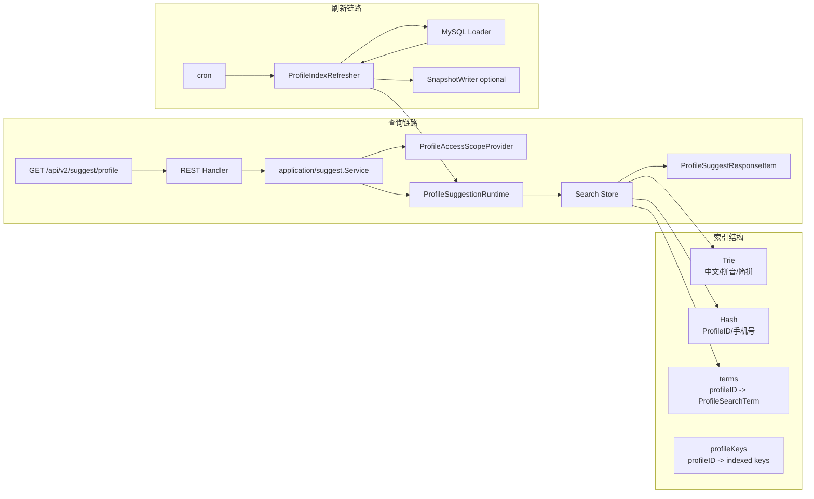
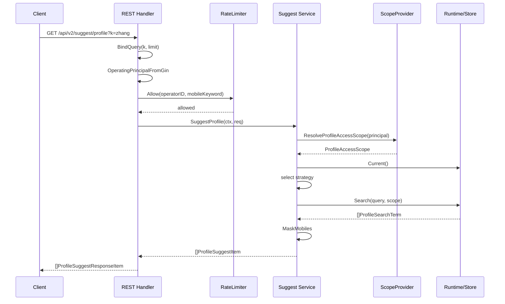

# 00-Suggest 模块总览：Profile 联想搜索读模型

> 本文回答：Suggest 模块为什么存在、它在 IAM 项目中的边界是什么、它如何通过 ProfileSearchTerm 构建读模型、查询链路如何从 REST 请求进入索引、刷新链路如何维护进程内索引，以及 infra/search 中的 Trie 为什么采用三叉搜索树模型。

---

## 30 秒结论

| 问题 | 结论 |
| ---- | ---- |
| Suggest 是什么？ | Profile 联想搜索读模型，用于 operating 后台快速搜索档案候选 |
| 它是不是 IAM 核心域？ | 不是。它是暂存于 IAM apiserver 中的辅助读模型模块 |
| 它解决什么问题？ | 支持中文名、拼音、简拼、ProfileID、手机号的快速联想搜索，并按当前操作员可见范围过滤 |
| 为什么不是直接 MySQL 查询？ | MySQL 难以优雅支持高频 autocomplete、拼音/简拼匹配、内部扩大召回后权限过滤 |
| 为什么不是独立服务？ | 当前规模下独立服务会增加部署、同步、运维、权限一致性成本，收益不足 |
| 核心模型是什么？ | `ProfileSearchTerm` 是索引项；`ProfileAccessScope` 是当前操作员可见范围；`Query` 是查询参数 |
| 查询顺序是什么？ | `keyword match -> scope filter -> rank + limit -> mobile mask` |
| 索引由什么组成？ | `Trie` 负责中文/拼音/简拼，`Hash` 负责 ProfileID/手机号，`terms` 保存 ProfileSearchTerm |
| Trie 为什么要重点理解？ | 它是文本联想的核心索引；当前 infra 使用三叉搜索树结构组织 rune 节点，支持前缀/通配搜索 |
| 当前最大过渡点是什么？ | 默认 Loader 仍是过渡读模型，`org_id` 来自 `PlaceholderOrgID`，生产可通过 SQL 覆盖 |

一句话：

> **Suggest 是一个内嵌在 IAM apiserver 中的 Profile 搜索读模型：刷新链路负责把 Profile 数据构造成索引，查询链路负责在索引中快速召回、按权限过滤并安全返回。**

---

## 1. 模块背景

Operating 后台经常需要通过“输入一点关键词，快速找到 Profile”的方式完成业务操作，例如：

```text
输入儿童姓名：张三
输入拼音：zhangsan
输入简拼：zs
输入档案 ID：10001
输入手机号：138****0000
```

如果每次输入都直接查询 MySQL，会遇到几个问题：

1. 高频 autocomplete 会对数据库形成压力。
2. 中文名、拼音、简拼需要额外字段或复杂查询。
3. 结果必须先扩大候选，再根据当前操作员权限过滤，最后排序截断。
4. 手机号搜索有更高敏感度，需要额外授权、限流、脱敏。
5. 查询体验需要低延迟，而不是每次拼多表 SQL。

所以当前选择构建一个进程内 Profile 联想搜索读模型。

---

## 2. 模块定位

Suggest 当前定位为：

```text
Profile Suggestion Read Model
```

它属于读模型，而不是写模型。

它不是：

- AuthN 登录认证模块。
- AuthZ 通用授权模块。
- Identity 用户 / Profile 核心领域模型。
- ProfileLink 关系模型。
- 完整组织权限系统。
- 独立搜索服务。

它是：

- operating 后台的 Profile 联想搜索能力。
- 基于 MySQL 数据源构建的进程内索引。
- 通过 `ProfileAccessScope` 执行轻量数据可见性过滤的读模型。
- 可降级、可刷新、可限流、可观测的辅助模块。

因此 Suggest 的边界是：

```text
负责快速召回候选；
负责按已解析出的 scope 做过滤；
不负责计算完整业务权限；
不负责维护 Profile 核心事实；
不负责代替 AuthZ。
```

---

## 3. 为什么 Suggest 不属于 IAM 核心域

IAM 核心职责主要是：

```text
用户身份 Identity
账号与登录 AuthN
角色、资源、权限 AuthZ
Token / Session / JWKS
```

Suggest 关注的是：

```text
后台输入关键词时，快速找到可见 Profile 候选
```

它使用 IAM 的身份和权限上下文，但它本身不是身份模型。

更准确地说：

```text
IAM core 提供“谁在调用”和“是否具备接口权限”；
Suggest 使用这些上下文做 Profile 联想查询；
业务组织范围和 Profile 可见性通过 ProfileAccessScope 输入 Suggest。
```

所以 Suggest 暂时内置在 IAM 项目中，是工程部署上的折中，不代表它是 IAM 核心领域。

---

## 4. 总体架构



整个模块可以拆成两条主线：

```text
查询链路：请求进入 -> 构造 query/scope -> 索引召回 -> 权限过滤 -> 排序返回
刷新链路：MySQL 读取 -> 构造 ProfileSearchTerm -> 替换/增量更新索引
```

---

## 5. 核心包结构

```text
internal/apiserver/domain/suggest
├── principal.go       # OperatingPrincipal
├── profile.go         # ProfileSearchTerm / Query / Keyword
├── scope.go           # ProfileAccessScope / ScopePolicy
├── ranking.go         # RankingPolicy
└── mobile.go          # 手机号识别与脱敏

internal/apiserver/application/suggest
├── service.go         # SuggestProfile 用例
├── search_strategy.go # 搜索策略链
├── ports.go           # application 端口
├── refresher.go       # 索引刷新用例
├── config.go          # 配置默认值
├── degraded.go        # 降级服务
└── metrics_port.go    # 指标端口

internal/apiserver/infra/suggest/search
├── runtime.go         # Runtime 原子持有当前索引
├── store.go           # Store 聚合 Trie / Hash / terms
├── trie.go            # 三叉搜索树索引
├── hash.go            # ProfileID / 手机号精确索引
└── snapshot.go        # 快照写入

internal/apiserver/infra/mysql/suggest
├── loader.go                    # MySQL -> ProfileSearchTerm
└── profile_visibility_resolver.go# 可见 ProfileID 解析
```

---

## 6. 核心模型：ProfileSearchTerm

`ProfileSearchTerm` 是 Suggest 索引中的 Profile 读模型项。

它不是 Profile 聚合本身，而是为了搜索构造出来的投影。

典型字段：

```text
ProfileID
DisplayName
Mobiles
Weight
OrgID
OwnerOperatorIDs
```

### 6.1 字段语义

| 字段 | 说明 |
| ---- | ---- |
| ProfileID | Profile 唯一 ID，也是索引主键 |
| DisplayName | 展示名，用于中文名、拼音、简拼索引 |
| Mobiles | 手机号列表，用于精确匹配，返回时必须脱敏 |
| Weight | 排序权重 |
| OrgID | 业务组织可见范围 |
| OwnerOperatorIDs | 负责该 Profile 的操作员 ID 集合 |

### 6.2 Deprecated 字段

当前代码中仍保留 `TenantID`，但它已经不是数据权限主路径。

当前约定是：

```text
TenantDomain = IAM 授权域，不进入 Suggest 索引；
OrgID        = 业务组织可见范围，进入 Suggest 读模型；
TenantID     = Deprecated，预留给未来 SaaS 隔离，不作为当前数据权限过滤主路径。
```

这点非常重要，因为之前系统中曾经混用过 tenant 与 org 概念。

---

## 7. 核心模型：ProfileAccessScope

`ProfileAccessScope` 是权限侧解析后的 Profile 可见范围。

Suggest 不负责计算完整权限，只消费这个 scope。

典型字段：

```text
AllProfile
OrgIDs
OperatorID
ProfileIDs
AllowMobileSearch
```

| 字段 | 说明 |
| ---- | ---- |
| AllProfile | 是否可查看全部 Profile |
| OrgIDs | 可见业务组织范围 |
| OperatorID | 当前操作员 ID，可用于 owner 过滤 |
| ProfileIDs | 复杂数据权限预计算出的精确 Profile 集合 |
| AllowMobileSearch | 是否允许手机号形态关键词搜索 |

查询时会把 scope 编译成 set，提高过滤效率：

```text
ProfileIDs -> profileSet
OrgIDs     -> orgSet
TenantIDs  -> tenantSet（Deprecated）
```

当前建议：

```text
普通 operating 用户：不要默认获得 TenantIDs；
组织级权限：使用 OrgIDs；
个人负责范围：使用 OperatorID 或 ProfileIDs；
复杂可见性：使用 ProfileIDs。
```

---

## 8. 查询链路总览

REST 请求：

```http
GET /api/v2/suggest/profile?k=zhang&limit=20
```

处理流程：



关键点：

1. Handler 做参数绑定、principal 提取、限流前置。
2. Service 做 use case 编排。
3. ScopeProvider 负责把 operating 用户解析成可见范围。
4. Index 只做关键词召回和 scope filter。
5. DTO 只返回脱敏手机号。

---

## 9. 查询顺序为什么不能错

正确顺序：

```text
match keyword
  ↓
filter by scope
  ↓
rank
  ↓
limit
```

错误顺序：

```text
match keyword
  ↓
rank
  ↓
limit
  ↓
filter by scope
```

错误顺序会导致召回质量问题。

例如全局搜索 `zhang`，前 20 个候选都属于其他组织，而当前操作员真正可见的候选排在第 50 个。

如果先 limit 再过滤：

```text
前 20 个候选
  ↓
全部无权限
  ↓
返回空
```

但正确结果应该是：

```text
扩大内部召回
  ↓
按 scope 过滤
  ↓
返回当前用户可见候选
```

因此 Query 中有 `InternalLimit` 和 `WildcardKeyCap`，用于控制内部召回规模。

---

## 10. 搜索策略总览

Suggest 使用策略链选择查询方式。

当前典型策略：

| 策略 | 条件 | 行为 |
| ---- | ---- | ---- |
| mobileDeniedStrategy | 手机号形态且无手机号搜索权限 | 返回空数组 |
| numericExactStrategy | 纯数字关键词 | Hash 精确匹配 ProfileID / 手机号 |
| prefixTextStrategy | 非数字关键词 | Trie 查询中文名 / 拼音 / 简拼 |

手机号形态关键词比普通数字更敏感。

因此：

```text
手机号形态 + 无权限 -> 返回空；
手机号形态 + 有权限 -> 仍然必须经过 scope filter；
返回结果 -> 只返回 mobile_mask。
```

---

## 11. Infra 重点：为什么使用 Trie

Suggest 的文本联想需要支持：

```text
中文名前缀：张 -> 张三
全拼前缀：zhang -> 张三
简拼前缀：zs -> 张三
```

如果只用普通 map：

```go
map[string][]profileID
```

则必须知道完整 key 才能查到结果。

例如：

```text
key = zhangsan
query = zhang
```

普通 map 无法直接前缀匹配，除非遍历所有 key：

```text
for key in allKeys:
    strings.HasPrefix(key, query)
```

这样在高频 autocomplete 下成本较高。

Trie 的价值是：

```text
把字符串按 rune 路径组织起来；
查询前缀时先定位到前缀节点；
再收集该前缀下的候选 key / profileID。
```

---

## 12. 当前 Trie 是三叉搜索树模型

当前 infra/search 中的 Trie 不是最常见的“每个节点一个 map[char]*node”的多叉树，而是三叉搜索树模型。

三叉搜索树，也常叫 Ternary Search Tree，核心思想是：

```text
每个节点保存一个 rune；
每个节点有三条边：small / equal / large。
```

可以理解为：

```text
small：当前字符比节点字符小，往左找；
equal：当前字符等于节点字符，进入下一个字符；
large：当前字符比节点字符大，往右找。
```

节点结构可以抽象为：

```go
type node struct {
    r     rune
    small *node
    equal *node
    large *node
    end   bool
    value []int64
}
```

它结合了：

```text
二叉搜索树的字符比较；
Trie 的前缀路径语义。
```

---

## 13. 三叉搜索树如何插入 key

假设插入 key：

```text
zhangsan -> profileID=1001
```

插入过程不是一次性把整个字符串挂到 map，而是逐字符处理：

```text
z -> h -> a -> n -> g -> s -> a -> n
```

伪流程：

```text
insert(node, chars, index):
    ch = chars[index]

    if node == nil:
        node = newNode(ch)

    if ch < node.r:
        node.small = insert(node.small, chars, index)

    if ch > node.r:
        node.large = insert(node.large, chars, index)

    if ch == node.r:
        if index == len(chars)-1:
            node.end = true
            node.value append profileID
        else:
            node.equal = insert(node.equal, chars, index+1)
```

重点是：

```text
small / large 仍然停留在当前字符 index；
equal 才进入下一个字符 index。
```

这是三叉搜索树和普通 Trie 最大的思维差异。

---

## 14. 三叉搜索树如何做前缀查询

以前缀 `zhang` 为例。

查询分两步：

```text
第一步：按字符找到 z-h-a-n-g 这个前缀路径的末尾节点；
第二步：从这个节点的 equal 子树向下收集所有 end=true 的 key 对应 profileIDs。
```

也就是说：

```text
prefix = zhang
匹配到 prefix 最后一个字符 g
  ↓
收集 g 节点自身 value
  ↓
继续收集 g.equal 下所有后缀
```

这样可以得到：

```text
zhang
zhangsan
zhangxiaoming
zhangxiaohua
```

再映射成：

```text
profileIDs -> ProfileSearchTerm
```

---

## 15. 三叉搜索树和普通 Trie 的区别

### 15.1 普通 Trie

普通 Trie 常见结构：

```go
type node struct {
    children map[rune]*node
    end bool
    value []int64
}
```

特点：

| 特点 | 说明 |
| ---- | ---- |
| 查询直观 | 每个字符直接找 children[ch] |
| 内存开销可能较大 | 每个节点可能有 map |
| 实现简单 | 前缀查询易理解 |
| 字符集大时 map 开销明显 | 中文 rune 场景尤其需要注意 |

### 15.2 三叉搜索树

三叉搜索树结构：

```go
type node struct {
    r rune
    small *node
    equal *node
    large *node
    end bool
    value []int64
}
```

特点：

| 特点 | 说明 |
| ---- | ---- |
| 节点结构紧凑 | 不需要每个节点维护 map |
| 适合较大字符集 | rune 比较走 small/large |
| 保留前缀语义 | equal 链路表达字符推进 |
| 实现复杂度更高 | 删除、收集、排序都更容易写错 |

---

## 16. 为什么三叉树适合当前 Suggest

当前 Suggest 的文本 key 包括：

```text
中文原名：张三
全拼：zhangsan
简拼：zs
```

这些 key 的字符集比较混合：

- 中文 rune。
- 英文字母。
- 拼音字符串。
- 简拼短字符串。

三叉搜索树有几个优势：

1. 不需要每个节点持有 `map[rune]*node`。
2. 对中文 rune 和英文 rune 都能统一比较。
3. 保留前缀检索能力。
4. 支持通过 `WildcardKeyCap` 限制前缀扩展规模。
5. 可以和 profileID value 结合，避免重复存储完整 term。

所以当前设计选择三叉树，是在：

```text
内存结构
前缀查询
中文/拼音混合 key
实现复杂度
```

之间做的平衡。

---

## 17. Trie 中写入哪些 key

对一个 Profile：

```text
ProfileID: 1001
DisplayName: 张三
```

Trie 会写入多类文本 key：

| Key 类型 | 示例 | 用途 |
| -------- | ---- | ---- |
| 原名 | 张三 | 中文名前缀搜索 |
| 全拼 | zhangsan | 拼音搜索 |
| 简拼 | zs | 首字母搜索 |

因此用户可以通过：

```text
张
张三
zhang
zhangs
zs
```

命中同一个 Profile。

---

## 18. Trie 为什么只保存 profileID

当前 Store 中有：

```text
Trie / Hash -> []profileID
terms       -> profileID -> ProfileSearchTerm
```

而不是：

```text
Trie / Hash -> []ProfileSearchTerm
```

原因：

1. 同一个 Profile 会写入多个 key。
2. 如果每个 key 都保存完整 term，会重复占内存。
3. Profile 更新时，需要统一覆盖 term。
4. 权限过滤时需要拿最新 term。
5. 删除旧 key 时，可以通过 profileID 精确移除。

所以 Trie 的 value 是 profileID 列表，而完整数据在 `terms` 中。

---

## 19. profileKeys 的作用

三叉树插入容易，删除相对复杂。

Suggest 要支持增量更新，就必须知道：

```text
某个 profileID 之前写入过哪些 Trie key / Hash key
```

否则当 Profile 从：

```text
张三 -> 李四
```

如果只新增 `李四 / lisi / ls`，旧的：

```text
张三 / zhangsan / zs
```

仍然能搜到该 profile。

因此 Store 维护：

```text
profileKeys: profileID -> indexed keys
```

更新时：

```text
1. 根据 profileID 找到旧 keys；
2. 从 Trie / Hash 中移除旧 profileID；
3. 写入新 keys；
4. 更新 terms[profileID]。
```

这解决了旧姓名、旧手机号、旧拼音 key 残留问题。

---

## 20. Hash 的职责

Trie 负责文本前缀。

Hash 负责精确匹配：

```text
ProfileID -> profileID
手机号    -> profileID
```

也就是说：

```text
输入 1001 -> 找 ProfileID=1001
输入 13800138000 -> 找手机号绑定的 Profile
```

Hash 不做手机号前缀搜索。

手机号形态关键词本身属于敏感查询：

```text
看起来像手机号
  ↓
需要 AllowMobileSearch
  ↓
仍然经过 ProfileAccessScope 过滤
  ↓
返回 mobile_mask
```

---

## 21. RankingPolicy

RankingPolicy 负责：

1. 按 ProfileID 去重。
2. 同一 Profile 保留更高 Weight。
3. 根据 Query 做前缀命中优先。
4. 按 Weight 降序。
5. 最后按 Limit 截断。

排序发生在 scope filter 之后。

也就是说：

```text
无权限候选不会参与最终排序。
```

这是避免越权数据污染结果排序的关键。

---

## 22. Loader 是过渡读模型

当前默认 MySQL Loader 仍然是过渡方案。

它从 Profile 相关表构造 `ProfileSearchTerm`，但因为当前表结构还没有完整的 Profile visibility read model，所以默认 SQL 使用：

```text
tenant_id = 0
org_id = PlaceholderOrgID
owner_operator_ids = profiles.created_by
```

这意味着：

```text
当前默认 Loader 能满足开发/过渡场景；
生产环境可以通过 FullSQL / DeltaSQL 注入更准确的读模型 SQL；
长期应建设真实 Profile visibility read model。
```

文档后续的刷新链路篇会详细讲。

---

## 23. 什么时候应该升级为独立服务

当前内嵌模块足够，但以下信号出现时应考虑拆分：

| 信号 | 说明 |
| ---- | ---- |
| 多系统复用 | QS、Operating、CRM 等都需要同一 Suggest 能力 |
| 数据源复杂化 | Profile、Assessment、Organization、ExternalUser 多源聚合 |
| 搜索规则复杂化 | 分词、模糊匹配、拼音多音字、权重学习 |
| QPS 上升 | apiserver 资源被 autocomplete 明显拖累 |
| 权限模型复杂化 | scope 解析需要独立缓存、事件驱动、版本控制 |
| 运维独立性 | 需要单独限流、熔断、扩缩容、灰度 |

在这之前，独立服务会带来过度设计。

---

## 24. 当前边界总结

Suggest 当前边界可以总结为：

```text
它是 IAM 项目内的 Profile 联想搜索读模型；
它使用 IAM operating principal；
它消费 ProfileAccessScope；
它构建进程内 Trie/Hash 索引；
它不拥有完整 AuthZ；
它不拥有完整 Organization 模型；
它不返回敏感明文手机号；
它可降级，不阻断核心 IAM 能力。
```

最重要的设计判断是：

> **Suggest 不是权限中心。权限中心负责产出可见范围，Suggest 只在索引查询时消费这个范围。**

---

## 25. 代码事实源

| 主题 | 文件 |
| ---- | ---- |
| 查询用例 | `internal/apiserver/application/suggest/service.go` |
| 应用端口 | `internal/apiserver/application/suggest/ports.go` |
| 搜索策略 | `internal/apiserver/application/suggest/search_strategy.go` |
| 读模型 | `internal/apiserver/domain/suggest/profile.go` |
| 权限范围 | `internal/apiserver/domain/suggest/scope.go` |
| 排序策略 | `internal/apiserver/domain/suggest/ranking.go` |
| 手机号安全 | `internal/apiserver/domain/suggest/mobile.go` |
| 三叉树索引 | `internal/apiserver/infra/suggest/search/trie.go` |
| Store 聚合 | `internal/apiserver/infra/suggest/search/store.go` |
| Hash 索引 | `internal/apiserver/infra/suggest/search/hash.go` |
| Runtime | `internal/apiserver/infra/suggest/search/runtime.go` |
| MySQL Loader | `internal/apiserver/infra/mysql/suggest/loader.go` |
| 组合根 | `internal/apiserver/container/assembler/suggest.go` |
| REST Handler | `internal/apiserver/transport/rest/suggest/handler.go` |

---

## 26. 下一篇

下一篇建议继续阅读：

[01-查询链路-SuggestProfile从请求到索引过滤.md](./01-查询链路-SuggestProfile从请求到索引过滤.md)

它会从一次真实 REST 请求开始，逐步分析：

```text
Handler -> RateLimiter -> Service -> ScopeProvider -> Strategy -> Store -> DTO
```
