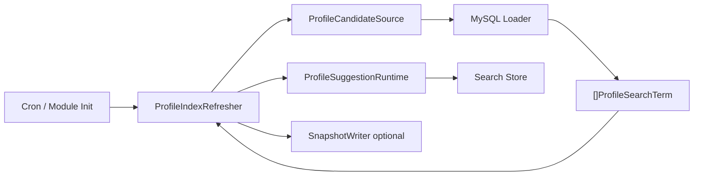
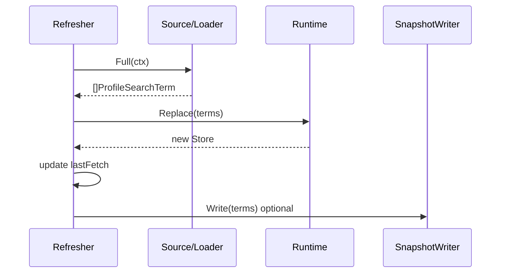
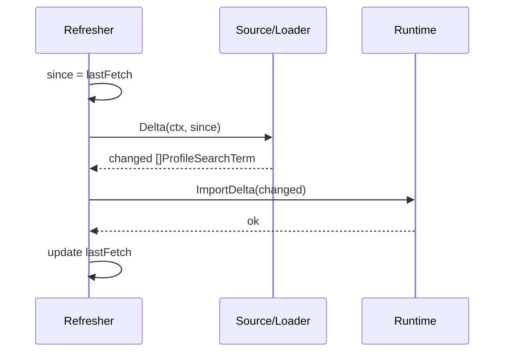

# 04-刷新链路：Loader / Refresher / Full / Delta / Snapshot

> 本文回答：Suggest 模块的索引数据从哪里来；MySQL Loader 如何把 Profile 数据投影成 `ProfileSearchTerm`；`ProfileIndexRefresher` 如何执行全量刷新和增量刷新；`Runtime.Replace` 与 `Runtime.ImportDelta` 分别解决什么问题；Delta tombstone 协议为什么重要；SnapshotWriter 的定位是什么；为什么 `Required=false` 时 Suggest 可以降级而不阻断 IAM 核心服务；以及 `PlaceholderOrgID` 为什么只是过渡方案。

---

## 30 秒结论

| 问题 | 结论 |
| ---- | ---- |
| 刷新链路负责什么？ | 把 MySQL / SQL 结果转换成 `ProfileSearchTerm`，并维护进程内 Suggest 索引 |
| Loader 负责什么？ | 从数据源读取 Profile 联想候选，生成 `[]ProfileSearchTerm` |
| Refresher 负责什么？ | 编排 Full / Delta refresh，调用 Runtime 替换或更新索引 |
| Full refresh 做什么？ | 读取全量候选，构建新 Store，并通过 Runtime 原子替换当前索引 |
| Delta refresh 做什么？ | 读取 since 之后的变化候选，在当前 Store 上执行 upsert / delete |
| Delta 最大风险是什么？ | 如果数据源不能返回删除 / 解绑 / 清空手机号等 tombstone，旧索引 key 仍可能残留 |
| Snapshot 是权威数据源吗？ | 不是。Snapshot 主要用于排障、兼容和观察刷新输入 |
| Required=false 是什么？ | Suggest 初始化失败时降级为空结果，不阻断 IAM 主服务 |
| PlaceholderOrgID 是什么？ | 默认 Loader 的过渡组织 ID，占位用于当前 profiles 表尚无真实 org 可见性字段的阶段 |

一句话：

> **刷新链路是 Suggest 读模型的生命线：Full 负责构建权威快照，Delta 负责运行期修正，Snapshot 只辅助排障，Runtime 负责安全切换当前活动索引。**

---

## 1. 刷新链路总览

Suggest 的查询链路依赖进程内索引。

索引不是凭空存在的，而是由刷新链路从数据源构建出来。

整体流程：



刷新链路分为两类：

```text
Full refresh：全量加载，构建新 Store，原子替换当前索引。
Delta refresh：加载变更，在当前 Store 上执行增量导入。
```

---

## 2. 为什么 Suggest 需要刷新链路

Suggest 是读模型，不是权威写模型。

权威事实仍然在数据库或业务表中。

Suggest 维护的是：

```text
为了快速搜索构建出来的索引副本。
```

因此它必须解决几个问题：

1. 启动时如何构建第一份索引。
2. 运行中数据变化后如何更新索引。
3. 刷新失败时如何不影响主服务。
4. 增量更新如何避免旧 key 残留。
5. 如何观测刷新耗时和索引规模。
6. 如何排查当前索引输入数据。

这些都属于刷新链路的职责。

---

## 3. 核心角色

| 角色 | 职责 |
| ---- | ---- |
| `ProfileCandidateSource` | application 端口，读取 ProfileSearchTerm 候选 |
| MySQL Loader | `ProfileCandidateSource` 的 MySQL 实现 |
| `ProfileIndexRefresher` | 编排 Full / Delta 刷新 |
| `ProfileSuggestionRuntime` | 持有当前活动索引，支持 Replace / ImportDelta |
| Search Store | 真正的 Trie / Hash / terms / profileKeys 索引 |
| `SnapshotWriter` | 可选，把候选写入文件用于排障 |
| Metrics | 记录刷新耗时、索引规模等指标 |

---

## 4. ProfileCandidateSource 端口

application 层定义数据源端口：

```go
type ProfileCandidateSource interface {
    Full(ctx context.Context) ([]domainsuggest.ProfileSearchTerm, error)
    Delta(ctx context.Context, since time.Time) ([]domainsuggest.ProfileSearchTerm, error)
}
```

语义：

| 方法 | 说明 |
| ---- | ---- |
| `Full` | 返回全量 ProfileSearchTerm |
| `Delta` | 返回 since 之后变化的 ProfileSearchTerm |

application 不关心数据来自 MySQL、MongoDB、Outbox、CDC 还是其他服务。

当前实现主要是 MySQL Loader。

---

## 5. MySQL Loader 的职责

MySQL Loader 的职责是：

```text
SQL rows -> ProfileSearchTerm[]
```

它负责：

1. 执行 FullSQL / DeltaSQL。
2. 读取 ProfileID、DisplayName、Mobiles、Weight。
3. 读取业务可见性字段 OrgID、OwnerOperatorIDs。
4. 兼容过渡配置 PlaceholderOrgID。
5. 把 CSV 字段拆成 slice。
6. 构造 domain `ProfileSearchTerm`。

它不负责：

- 构建 Trie / Hash。
- 做 scope filter。
- 判断手机号权限。
- 执行 AuthZ。
- 返回 REST DTO。

---

## 6. 默认 Loader 是过渡读模型

当前默认 Loader 不是最终生产可见性模型。

它的定位是过渡方案。

原因是：

```text
profiles 表当前尚无完整的 org / owner / visibility read model 字段。
```

因此默认 SQL 使用约定：

```text
tenant_id = 0
org_id = PlaceholderOrgID
owner_operator_ids = profiles.created_by
```

语义：

| 字段 | 当前默认来源 | 说明 |
| ---- | ------------ | ---- |
| tenant_id | 固定为 0 | 不再用 tenant_id 冒充业务 org |
| org_id | PlaceholderOrgID | 过渡业务组织 ID |
| owner_operator_ids | profiles.created_by | 过渡 owner 范围 |
| mobiles | profile_links/users 聚合 | 用于手机号精确匹配 |
| weight | 默认 1 | 基础排序权重 |

这说明：

```text
默认 Loader 能支持开发和过渡场景；
生产环境如需准确数据权限，应覆盖 FullSQL / DeltaSQL 或建设 Profile visibility read model。
```

---

## 7. PlaceholderOrgID

`PlaceholderOrgID` 是默认 Loader 的过渡配置。

它解决的是：

```text
当前 Profile 数据还没有真实 org_id 字段，但 Suggest 读模型已经以 OrgID 作为业务可见范围主维度。
```

因此默认 SQL 会把所有 Profile 映射到同一个占位 org。

这适合：

```text
单组织开发环境；
测试环境；
过渡上线阶段；
尚未完成 Profile 可见性读模型之前。
```

但它不适合长期生产精细权限。

长期应替换为：

```text
真实 Profile org_id；
真实 Profile owner_operator_ids；
或者 ProfileIDs 级可见性读模型。
```

---

## 8. 为什么 tenant_id 固定为 0

历史上系统曾经混用：

```text
tenant_id = org_id
```

这会导致 IAM 授权域和业务组织范围混淆。

当前已经明确：

```text
TenantDomain = IAM 授权域，例如 fangcun / platform；
OrgID        = 业务组织范围，例如 1 / 2 / 3。
```

Suggest 索引不应该用 tenant_id 作为当前数据权限主路径。

因此默认 Loader 中：

```text
tenant_id = 0
```

表示：

```text
当前 Suggest 读模型不使用 tenant_id 做数据过滤。
```

`TenantID/TenantIDs` 在 Suggest 中仅作为 Deprecated / future SaaS reserved 字段存在。

---

## 9. FullSQL 与 DeltaSQL

Loader 支持通过配置覆盖默认 SQL：

```text
FullSQL
DeltaSQL
```

### 9.1 FullSQL

FullSQL 应返回完整索引候选。

推荐字段：

```text
id
name
tenant_id
org_id
mobiles
owner_operator_ids
weight
```

其中：

```text
tenant_id 当前建议返回 0；
org_id 应返回真实业务组织 ID；
owner_operator_ids 应返回真实可见 owner 集合。
```

### 9.2 DeltaSQL

DeltaSQL 应返回 since 之后发生变化的候选。

除了 upsert，也要能表达 delete / tombstone。

如果 DeltaSQL 只能查：

```sql
WHERE deleted_at IS NULL AND updated_at > ?
```

那么它无法告诉 Store 哪些 Profile 被删除。

这种 Delta 是不完整的。

---

## 10. Loader 输出：ProfileSearchTerm

Loader 输出的是：

```text
[]ProfileSearchTerm
```

每个 term 至少包含：

```text
ProfileID
DisplayName
Mobiles
Weight
OrgID
OwnerOperatorIDs
```

对于删除，可以返回 tombstone：

```text
ProfileID = 1001
DisplayName = ""
```

Store 看到 tombstone 后，会删除该 profile 的旧索引。

---

## 11. ProfileIndexRefresher

`ProfileIndexRefresher` 是刷新链路的应用服务。

它依赖：

```text
ProfileCandidateSource
ProfileSuggestionRuntime
SnapshotWriter optional
Metrics optional
```

它负责：

```text
RunFull(ctx)
RunDelta(ctx)
```

Refresher 不直接操作 Trie / Hash。

它只调用 Runtime：

```text
Replace
ImportDelta
```

---

## 12. RunFull

Full refresh 是权威刷新方式。

流程：

```text
1. source.Full(ctx) 读取全量 ProfileSearchTerm；
2. runtime.Replace(terms) 构建新 Store 并原子替换；
3. 更新 lastFetch；
4. 可选写 Snapshot；
5. 记录刷新耗时和索引规模。
```

Mermaid：



---

## 13. Runtime.Replace

`Runtime.Replace` 的语义是：

```text
基于全量 terms 构建一份新的 Store，构建完成后一次性替换当前活动索引。
```

这样做的好处：

1. 构建新索引时不影响旧索引查询。
2. 替换动作很快。
3. 全量构建失败不会污染当前索引。
4. 老请求如果已经拿到旧 Store，可以继续完成。
5. 新请求会读取新 Store。

这是读模型热替换设计。

---

## 14. RunDelta

Delta refresh 用于运行期增量修正。

流程：

```text
1. 检查 lastFetch；
2. source.Delta(ctx, lastFetch) 读取变化 terms；
3. runtime.ImportDelta(terms)；
4. 更新 lastFetch；
5. 可选写 Snapshot；
6. 记录刷新耗时。
```

Mermaid：



---

## 15. Runtime.ImportDelta

`Runtime.ImportDelta` 的语义是：

```text
在当前 Store 上导入增量 terms。
```

导入时 Store 会：

```text
for each term:
    remove old keys by profileID
    if tombstone:
        delete term and profileKeys
    else:
        build new keys
        insert Trie / Hash
        update terms
        update profileKeys
```

也就是说，Delta 不再是简单 append。

它支持：

```text
姓名变更；
手机号变更；
owner/org/weight 变更；
Profile 删除 tombstone。
```

---

## 16. Delta tombstone 协议

Delta 要可靠，必须能表达删除。

推荐 tombstone：

```text
ProfileID > 0
DisplayName = ""
```

语义：

```text
删除该 profileID 的所有旧 Trie / Hash key；
删除 terms[profileID]；
删除 profileKeys[profileID]。
```

为什么不能只靠 `deleted_at IS NULL`？

因为如果 SQL 过滤掉删除记录：

```sql
WHERE deleted_at IS NULL
```

Store 根本看不到被删除的 profileID，也就无法删除旧索引。

所以 DeltaSQL 必须具备：

```text
upsert 变更；
delete tombstone；
手机号清空；
owner/org 变更；
权限关系解绑。
```

---

## 17. Delta 什么时候不安全

以下 Delta 不安全：

```text
只返回新增 / 修改，不返回删除；
只查 deleted_at IS NULL；
手机号删除后不返回该 Profile；
owner_operator_ids 解绑后不返回该 Profile；
org_id 变更后不返回该 Profile；
Profile 删除后不返回 tombstone。
```

不安全后果：

```text
旧姓名仍可搜索；
旧手机号仍可搜索；
旧 owner 仍能通过 scope 命中；
删除 Profile 仍残留在索引；
权限收缩后索引仍然过宽。
```

如果不能保证 Delta 完整性，建议：

```text
降低 Delta 频率；
缩短 Full refresh 周期；
或者禁用 Delta，仅使用 Full refresh。
```

---

## 18. lastFetch 的语义

Refresher 使用 `lastFetch` 作为 Delta 的 since 时间。

注意：

```text
lastFetch 是运行期状态，不是持久化 checkpoint。
```

因此：

```text
进程重启后，应先 Full refresh；
Full refresh 成功后再启用 Delta；
不要依赖 lastFetch 跨重启恢复。
```

这也是为什么模块启动时应优先执行 Full refresh。

---

## 19. Full 与 Delta 的关系

Full 和 Delta 不是互相替代关系。

| 刷新方式 | 作用 |
| -------- | ---- |
| Full | 构建权威快照，修复所有索引漂移 |
| Delta | 运行期快速修正少量变化 |

推荐策略：

```text
启动时 Full；
运行中定时 Delta；
周期性 Full 兜底；
Delta 不完整时以 Full 为准。
```

Full 是最终兜底。

Delta 是性能优化。

---

## 20. SnapshotWriter

SnapshotWriter 是可选组件。

它可以把刷新得到的候选写入文件。

用途：

```text
排障；
观察当前索引输入；
兼容历史工具；
快速比较 FullSQL 输出；
复现线上问题。
```

它不是：

```text
权威数据源；
默认恢复机制；
持久化 checkpoint；
替代 MySQL Loader 的数据源。
```

如果未来要从 Snapshot 恢复，需要新增：

```text
SnapshotReader；
版本号；
checksum；
生成时间；
schema version；
回滚策略。
```

当前不做这个假设。

---

## 21. SuggestModule 装配

SuggestModule 在 container/assembler 中完成组合根装配。

它通常负责：

```text
读取配置；
判断 enable/required；
校验生产环境手机号脱敏配置；
创建 MySQL Loader；
创建 ProfileVisibilityIDsResolver；
创建 ProfileAccessScopeProvider；
创建 Search Runtime；
创建 Metrics Recorder；
创建 RateLimiter；
创建 Refresher；
启动 Full / Delta cron；
失败时按 Required 决定报错或降级。
```

这说明 Suggest 不是简单 handler，而是一个完整运行时模块。

---

## 22. Required=false 降级启动

Suggest 不是 IAM 核心能力。

因此配置支持：

```text
Required=false
```

语义：

```text
Suggest 初始化失败时，不阻断 apiserver 启动；
模块进入 degraded 状态；
查询返回空数组；
记录错误日志和健康状态。
```

适用场景：

```text
数据库暂时不可用；
FullSQL 配置错误；
索引刷新失败；
Suggest 功能不是当前主链路必需。
```

如果设置：

```text
Required=true
```

则 Suggest 初始化失败会导致模块启动失败。

生产是否 required，需要根据业务依赖程度决定。

---

## 23. DegradedService

降级服务的语义是：

```text
任何 SuggestProfile 查询返回空数组。
```

它不应该：

```text
返回全局数据；
绕过权限；
临时查询 MySQL；
暴露内部错误详情。
```

这样做是安全优先。

因为 Suggest 失败时，最安全的行为是：

```text
查不到任何候选。
```

而不是：

```text
返回可能越权的数据。
```

---

## 24. 生产环境手机号脱敏保护

配置中可能存在：

```text
DisableMobileMask
```

用于特殊排障。

但生产环境中不应允许关闭手机号脱敏。

组合根应校验：

```text
production && DisableMobileMask=true -> 启动失败
```

原因：

```text
手机号是敏感信息；
Suggest 是高频查询接口；
返回明文手机号风险很高；
排障配置不能变成生产默认能力。
```

---

## 25. 刷新指标

刷新链路应记录：

```text
刷新耗时；
刷新类型 full/delta；
刷新是否成功；
索引 term 数量；
matched candidates；
visible after scope；
查询返回数量。
```

其中刷新相关重点是：

| 指标 | 用途 |
| ---- | ---- |
| refresh duration | 判断 Full / Delta 是否过慢 |
| index terms | 判断索引规模是否异常 |
| refresh error logs | 发现 SQL / DB / Runtime 问题 |

这些指标有助于判断：

```text
Full refresh 是否变慢；
Delta 是否异常频繁；
索引规模是否突然下降；
scope filter 是否过滤掉过多候选。
```

---

## 26. 配置项建议

Suggest 相关配置通常包括：

```text
Enable
Required
DataDir
FullSyncCron
DeltaSyncCron
MaxResults
InternalMaxResults
KeyPadLen
WildcardKeyCap
FullSQL
DeltaSQL
Snapshot
PlaceholderOrgID
DisableMobileMask
RateLimit
```

其中最需要谨慎的是：

| 配置 | 风险 |
| ---- | ---- |
| Required | true 会让 Suggest 故障影响主服务启动 |
| DeltaSyncCron | Delta 不完整时会造成索引漂移 |
| FullSQL / DeltaSQL | SQL 字段不符合约定会导致索引错误 |
| PlaceholderOrgID | 只是过渡配置，不适合长期精细权限 |
| DisableMobileMask | 生产环境不能开启 |
| WildcardKeyCap | 过大可能导致前缀搜索返回过多候选 |
| InternalMaxResults | 过小会导致 scope filter 后召回不足 |

---

## 27. 默认 Loader 的局限

默认 Loader 当前局限：

```text
org_id 来自 PlaceholderOrgID；
owner_operator_ids 暂用 profiles.created_by；
tenant_id 固定为 0；
没有真实组织树；
没有真实 Profile 分配关系；
没有完整 visibility edge 模型。
```

因此它不是最终权限事实源。

长期建议建设：

```text
Profile visibility read model
```

可能形式：

```text
profile_suggestion_terms
profile_visibility_edges
```

或者在业务表成熟后直接由 SQL 聚合真实：

```text
profile_id
org_id
owner_operator_ids
visible_profile_ids
```

---

## 28. 推荐生产 SQL 约定

如果生产覆盖 FullSQL，建议返回：

```sql
SELECT
  p.id,
  p.name,
  0 AS tenant_id,
  p.org_id AS org_id,
  GROUP_CONCAT(DISTINCT u.phone) AS mobiles,
  GROUP_CONCAT(DISTINCT a.operator_id) AS owner_operator_ids,
  1 AS weight
FROM profiles p
LEFT JOIN profile_links pl ON ...
LEFT JOIN users u ON ...
LEFT JOIN profile_assignments a ON ...
WHERE p.deleted_at IS NULL
GROUP BY p.id;
```

这只是示意。

真实 SQL 应以当前业务表为准。

重点是：

```text
tenant_id 不要冒充 org_id；
org_id 必须是真实业务组织范围；
owner_operator_ids 必须是真实负责关系；
手机号字段必须可控；
删除和解绑必须能通过 Full 或 Delta 修正。
```

---

## 29. 推荐 DeltaSQL 约定

DeltaSQL 推荐支持：

```text
updated_at > ?
deleted_at 变化
手机号变化
owner/operator 变化
org 变化
```

如果使用 tombstone：

```sql
SELECT
  p.id,
  '' AS name,
  0 AS tenant_id,
  0 AS org_id,
  '' AS mobiles,
  '' AS owner_operator_ids,
  0 AS weight
FROM profiles p
WHERE p.deleted_at IS NOT NULL
  AND p.updated_at > ?;
```

同时 upsert 查询返回正常 term。

也可以通过 outbox / CDC 直接生成 upsert/delete 事件，再转换为 `ProfileSearchTerm`。

---

## 30. 刷新失败处理

Full refresh 失败：

```text
启动阶段：
  Required=true  -> 启动失败
  Required=false -> 降级服务

运行阶段：
  保留旧索引
  记录错误
  下次 cron 重试
```

Delta refresh 失败：

```text
保留当前索引
记录错误
等待下次 Delta 或 Full 兜底
```

Snapshot 写失败：

```text
不应影响 Runtime 索引；
记录错误即可。
```

原则：

```text
不要因为辅助排障能力失败而污染查询索引。
```

---

## 31. 常见错误设计

### 31.1 默认 SQL 中 tenant_id=org_id

错误。

当前边界已经明确：

```text
TenantDomain 是 IAM 授权域；
OrgID 是业务组织范围。
```

索引中不应继续用 tenant_id 表达 org。

---

### 31.2 DeltaSQL 只返回 deleted_at IS NULL 数据

错误。

这样 Store 无法收到删除 tombstone。

删除记录会残留在索引中。

---

### 31.3 Snapshot 当作权威恢复数据

错误。

当前 Snapshot 只是排障和观察工具。

没有版本、checksum、reader、schema 校验前，不应作为恢复机制。

---

### 31.4 Required=true 盲目开启

需要谨慎。

如果 Suggest 不是业务核心链路，`Required=true` 会让辅助能力故障拖垮 IAM 主服务。

---

### 31.5 DisableMobileMask 用于生产排障

错误。

生产不应返回明文手机号。

排障应通过安全审计和受控日志，而不是关闭脱敏。

---

## 32. 测试建议

建议覆盖：

```text
1. Loader.Full 返回 ProfileSearchTerm；
2. Loader.Delta 正确使用 since 参数；
3. Full refresh 调用 Runtime.Replace；
4. Delta refresh 调用 Runtime.ImportDelta；
5. Full refresh 成功后更新 lastFetch；
6. Delta refresh 无 lastFetch 时不执行或安全返回；
7. SnapshotWriter 写失败不污染 Runtime；
8. Required=false 时初始化失败进入 DegradedService；
9. Required=true 时初始化失败返回错误；
10. production + DisableMobileMask=true 启动失败；
11. tombstone term 能删除旧索引；
12. Delta 不完整时 Full refresh 能恢复一致性。
```

---

## 33. 代码事实源

| 主题 | 文件 |
| ---- | ---- |
| Refresher | `internal/apiserver/application/suggest/refresher.go` |
| 数据源端口 | `internal/apiserver/application/suggest/ports.go` |
| Config | `internal/apiserver/application/suggest/config.go` |
| DegradedService | `internal/apiserver/application/suggest/degraded.go` |
| MySQL Loader | `internal/apiserver/infra/mysql/suggest/loader.go` |
| Visibility Resolver | `internal/apiserver/infra/mysql/suggest/profile_visibility_resolver.go` |
| Runtime | `internal/apiserver/infra/suggest/search/runtime.go` |
| Store ImportTerms | `internal/apiserver/infra/suggest/search/store.go` |
| SnapshotWriter | `internal/apiserver/infra/suggest/search/snapshot.go` |
| 组合根 | `internal/apiserver/container/assembler/suggest.go` |
| Metrics | `internal/apiserver/infra/suggest/metrics/` |

---

## 34. Verify

建议执行：

```bash
go test ./internal/apiserver/application/suggest/...
go test ./internal/apiserver/infra/mysql/suggest/...
go test ./internal/apiserver/infra/suggest/search/...
go test ./internal/apiserver/container/assembler/...
```

建议 grep：

```bash
grep -R "PlaceholderOrgID" internal docs
grep -R "DeltaSQL" internal docs
grep -R "SnapshotWriter" internal docs
grep -R "DisableMobileMask" internal docs
grep -R "Required" internal/apiserver/application/suggest internal/apiserver/container/assembler
```

---

## 35. 下一篇

下一篇建议阅读：

[05-安全与运维-手机号搜索-限流-指标-降级.md](./05-安全与运维-手机号搜索-限流-指标-降级.md)

它会继续分析：

```text
手机号搜索为什么需要额外授权；
mobile_mask 如何保证输出安全；
RateLimiter 如何区分普通搜索和手机号搜索；
Metrics 如何观测查询和索引；
DegradedService 如何保护 IAM 核心链路；
生产环境安全护栏如何设计。
```
