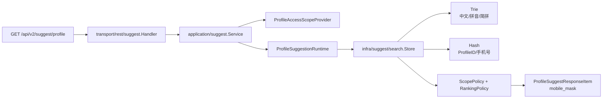
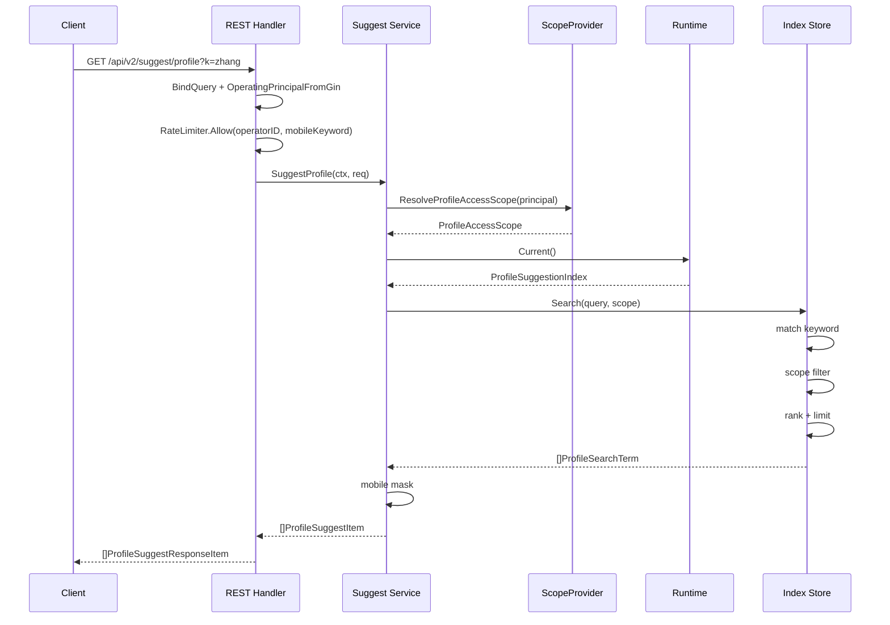
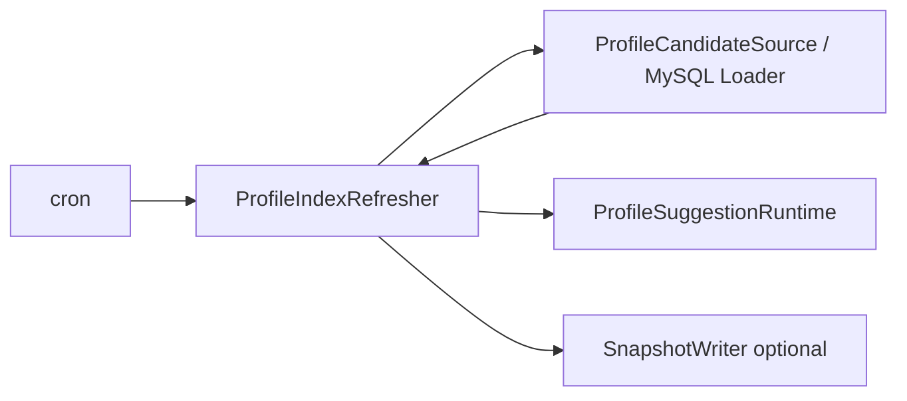

# 08-Suggest：Profile 联想搜索读模型

> 本目录记录 IAM 项目中 Suggest 模块的设计、实现与运维边界。
>
> Suggest 当前不是 IAM 核心身份域模型，而是暂时内置在 IAM apiserver 中的 **Profile 联想搜索读模型模块**。它服务 operating 后台的档案联想查询，通过进程内索引实现快速召回，再通过 `ProfileAccessScope` 做当前操作员可见范围过滤。

---

## 30 秒结论

| 问题 | 结论 |
| ---- | ---- |
| Suggest 是什么？ | Profile 联想搜索读模型，用于 operating 后台快速搜索档案 |
| 它属于 IAM 核心域吗？ | 不属于 AuthN/AuthZ/Identity 核心域，是暂存于 IAM 项目内的辅助读模型模块 |
| 为什么不直接查 MySQL？ | 需要支持中文名、拼音、简拼、ProfileID/手机号精确匹配，以及高频 autocomplete 场景 |
| 为什么不单独拆服务？ | 当前规模还不足以支撑独立服务的部署、同步、监控和权限复杂度成本 |
| 权限怎么做？ | 请求携带 `OperatingPrincipal`，应用层解析 `ProfileAccessScope`，索引层执行 scope filter |
| 数据权限主维度是什么？ | 当前使用 `OrgID / OperatorID / ProfileIDs`；`TenantID/TenantIDs` 仅作为未来 SaaS 隔离预留，当前不作为数据权限主路径 |
| 手机号搜索安全吗？ | 手机号形态关键词需要额外授权；结果只返回 `mobile_mask`；支持限流与指标 |
| 索引怎么刷新？ | `ProfileIndexRefresher` 执行 Full / Delta refresh，`ProfileSuggestionRuntime` 持有进程内索引 |
| 故障会影响 IAM 核心能力吗？ | `Required=false` 时降级为空结果，不阻断 IAM 主服务启动 |

一句话：

> **Suggest = SearchIndex + ProfileAccessScope + 安全运维护栏。**

---

## 1. 模块定位

Suggest 模块解决的是 operating 后台中的一个具体查询体验问题：

```text
后台操作员输入姓名 / 拼音 / 简拼 / 档案 ID / 手机号
  ↓
系统快速返回其有权查看的 Profile 候选项
```

它不是：

- AuthN 登录认证模块。
- AuthZ 通用授权模块。
- Identity 用户/档案核心领域模型。
- ProfileLink 关系模型。
- 独立搜索服务。
- 完整组织权限系统。

它是：

```text
Profile Suggestion Read Model
```

即：围绕 Profile 查询体验构建的进程内搜索索引和权限过滤读模型。

---

## 2. 为什么 Suggest 暂时放在 IAM 项目中

从领域划分上，Suggest 更像 operating 后台的辅助查询能力，不是 IAM 核心域。

但当前阶段暂时保留在 IAM 项目内，原因是：

1. Profile 数据源在 IAM 侧。
2. operating 后台对 Profile 联想查询依赖 IAM 鉴权与身份上下文。
3. 当前 QPS、数据量和团队维护成本尚不值得拆出独立 suggest 服务。
4. 独立服务会引入额外的数据同步、部署、限流、监控、故障降级和权限一致性成本。
5. 进程内索引已经能满足当前快速查询需求。

因此当前定位是：

```text
IAM apiserver 内置 Suggest 读模型模块。
```

后续如果满足以下条件，可以再考虑拆独立服务：

- 多个业务系统复用 Suggest。
- 数据源不再只来自 IAM。
- 搜索规则复杂到需要独立演进。
- 需要接入 Meilisearch / OpenSearch / Elasticsearch。
- QPS、延迟、资源隔离有独立扩缩容需求。
- 需要独立灰度、熔断、监控和发布节奏。

---

## 3. 总体架构



查询核心顺序：

```text
keyword match
  ↓
scope filter
  ↓
rank + limit
  ↓
mobile mask
```

这个顺序不能反过来。

如果先 rank + limit，再 scope filter，就会出现：

```text
全局前 20 条都是无权限数据
  ↓
过滤后为空
  ↓
用户明明有可见结果却查不到
```

所以 Suggest 必须先扩大内部召回，再按权限范围过滤，最后排序截断。

---

## 4. 分层职责

```text
internal/apiserver/domain/suggest
  领域读模型与策略：OperatingPrincipal、ProfileAccessScope、ProfileSearchTerm、Query、ScopePolicy、RankingPolicy、手机号脱敏。

internal/apiserver/application/suggest
  应用用例与端口：SuggestProfile、ProfileAccessScopeProvider、ProfileSuggestionRuntime、ProfileCandidateSource、RateLimiter、Metrics、Refresher。

internal/apiserver/infra/mysql/suggest
  MySQL 数据源适配：ProfileSearchTerm Loader、ProfileVisibilityIDsResolver。

internal/apiserver/infra/suggest/search
  进程内索引：Runtime、Store、Trie、Hash、SnapshotWriter。

internal/apiserver/infra/suggest/access
  operating 权限范围适配：OperatingProfileAccessScopeProvider、可见 ProfileID 缓存。

internal/apiserver/infra/suggest/ratelimit
  Suggest 限流实现：本地/Redis 限流适配。

internal/apiserver/infra/suggest/metrics
  指标记录实现。

internal/apiserver/transport/rest/suggest
  REST 接口、DTO、OperatingPrincipal 提取、RateLimit 前置检查。

internal/apiserver/container/assembler
  SuggestModule 组合根：装配 DB、loader、scope provider、runtime、metrics、rate limiter、refresher、cron、degraded service。
```

---

## 5. 核心模型

### 5.1 OperatingPrincipal

表达当前 operating 后台调用者：

```text
OperatorID
TenantDomain
OrgIDs
RoleCodes
IsSuperAdmin
```

注意：

- `TenantDomain` 是 IAM 授权域，例如 `fangcun` / `platform`。
- 它不是业务组织 ID。
- 当前业务组织范围使用 `OrgIDs / ProfileIDs / OperatorID` 表达。

---

### 5.2 ProfileAccessScope

表达当前操作员可见的 Profile 范围：

```text
AllProfile
OrgIDs
OperatorID
ProfileIDs
AllowMobileSearch
```

其中：

| 字段 | 说明 |
| ---- | ---- |
| AllProfile | 超级管理员或全局可见场景 |
| OrgIDs | 业务组织可见范围 |
| OperatorID | 当前操作员负责的 Profile 范围 |
| ProfileIDs | 复杂权限预计算后的精确 Profile 集合 |
| AllowMobileSearch | 是否允许手机号形态关键词搜索 |

`TenantIDs` 当前只作为未来 SaaS 授权域隔离预留，当前数据权限不要依赖它。

---

### 5.3 ProfileSearchTerm

表达索引中的 Profile 读模型项：

```text
ProfileID
DisplayName
Mobiles
Weight
OrgID
OwnerOperatorIDs
```

其中：

- `DisplayName` 用于中文前缀、拼音、简拼索引。
- `Mobiles` 用于手机号精确匹配，但返回时必须脱敏。
- `OrgID` 是业务组织可见范围。
- `OwnerOperatorIDs` 用于操作员负责范围过滤。
- `TenantID` 已标记为 Deprecated，不作为当前数据权限主路径。

---

## 6. 查询链路

REST 入口：

```text
GET /api/v2/suggest/profile?k={keyword}&limit={limit}
```

执行过程：



---

## 7. 搜索策略

Suggest 当前按 keyword 形态选择策略：

| 关键词形态 | 行为 |
| ---------- | ---- |
| 空字符串 | 返回空数组 |
| 手机号形态且无权限 | 返回空数组 |
| 纯数字 | Hash 精确匹配 ProfileID / 手机号 |
| 非数字 | Trie 匹配中文名 / 拼音 / 简拼 |

手机号形态关键词会被额外记录安全日志：

```text
operator_id
tenant_domain
allow_mobile_search
keyword_len
```

不会记录明文手机号。

---

## 8. 索引模型

进程内索引由 Runtime 持有：

```text
ProfileSuggestionRuntime
  ↓
Store
  ├── Trie: 中文名 / 拼音 / 简拼 -> profileIDs
  ├── Hash: ProfileID / 手机号 -> profileIDs
  ├── terms: profileID -> ProfileSearchTerm
  └── profileKeys: profileID -> indexed keys
```

关键点：

1. Trie / Hash 只保存 `profileID`，不复制完整 term。
2. Profile 详情统一从 `terms` 中读取。
3. `profileKeys` 记录每个 Profile 写入过哪些 Trie / Hash key。
4. 增量更新同一 Profile 时，会先撤销旧 key，再写入新 key。
5. `DisplayName` 为空的 term 可作为 tombstone 删除索引项。
6. Runtime 使用原子替换方式维护当前活动索引。

---

## 9. 刷新链路



刷新类型：

| 类型 | 说明 |
| ---- | ---- |
| Full | 全量读取 ProfileSearchTerm 并替换索引 |
| Delta | 按 since 拉取变更并导入当前 Store |
| Snapshot | 可选，把刷新后的候选写入文件，主要用于排障/兼容，不是权威数据源 |

当前默认 MySQL Loader 是过渡读模型：

- `tenant_id` 固定为 0。
- `org_id` 来自 `PlaceholderOrgID`。
- `owner_operator_ids` 暂由 `profiles.created_by` 生成。
- 生产可通过 `FullSQL / DeltaSQL` 覆盖。

原因：当前 `profiles` 表尚无完整 org/owner 可见性读模型字段。

---

## 10. 安全边界

Suggest 必须满足：

1. 必须经过认证中间件。
2. 必须经过接口级 search 权限控制。
3. 查询必须携带 OperatingPrincipal。
4. 数据结果必须经过 ProfileAccessScope 过滤。
5. 手机号搜索必须有额外授权。
6. 返回结果只能暴露 `mobile_mask`。
7. 生产环境禁止 `DisableMobileMask=true`。
8. 支持 rate limit。
9. 支持指标观测。
10. Suggest 初始化失败时可降级，不阻断 IAM 核心能力。

---

## 11. 运维能力

| 能力 | 说明 |
| ---- | ---- |
| RateLimit | 按 operator 区分普通关键词 / 手机号关键词限流 |
| Metrics | 查询次数、手机号形态查询、返回结果数、过滤前后候选数、索引规模、刷新耗时 |
| DegradedService | 初始化失败且 `Required=false` 时返回空结果 |
| FullSyncCron | 周期性全量刷新 |
| DeltaSyncCron | 可选增量刷新 |
| Snapshot | 可选落盘刷新候选，用于排障 |
| Production Guard | 生产禁止关闭手机号脱敏 |

---

## 12. 当前文档结构

建议按以下顺序阅读：

| 文档 | 内容 |
| ---- | ---- |
| [00-Suggest模块总览-Profile联想搜索读模型.md](./00-Suggest模块总览-Profile联想搜索读模型.md) | 模块定位、边界、整体架构 |
| [01-查询链路-SuggestProfile从请求到索引过滤.md](./01-查询链路-SuggestProfile从请求到索引过滤.md) | 从 REST 请求到 Service / Strategy / Index 的查询流程 |
| [02-权限范围-OperatingPrincipal与ProfileAccessScope.md](./02-权限范围-OperatingPrincipal与ProfileAccessScope.md) | operating 用户、可见范围、OrgID/ProfileIDs/OperatorID 权限边界 |
| [03-索引模型-ProfileSearchTerm-Trie-Hash-Runtime.md](./03-索引模型-ProfileSearchTerm-Trie-Hash-Runtime.md) | ProfileSearchTerm、Trie、Hash、Runtime、Ranking |
| [04-刷新链路-Loader-Refresher-FullDelta-Snapshot.md](./04-刷新链路-Loader-Refresher-FullDelta-Snapshot.md) | Loader、Full/Delta、tombstone、Snapshot、Cron |
| [05-安全与运维-手机号搜索-限流-指标-降级.md](./05-安全与运维-手机号搜索-限流-指标-降级.md) | 手机号安全、限流、指标、降级、生产约束 |

---

## 13. 代码事实源

### Domain

```text
internal/apiserver/domain/suggest/principal.go
internal/apiserver/domain/suggest/profile.go
internal/apiserver/domain/suggest/scope.go
internal/apiserver/domain/suggest/ranking.go
internal/apiserver/domain/suggest/mobile.go
```

### Application

```text
internal/apiserver/application/suggest/service.go
internal/apiserver/application/suggest/search_strategy.go
internal/apiserver/application/suggest/ports.go
internal/apiserver/application/suggest/refresher.go
internal/apiserver/application/suggest/config.go
internal/apiserver/application/suggest/degraded.go
internal/apiserver/application/suggest/metrics_port.go
```

### Infrastructure

```text
internal/apiserver/infra/mysql/suggest/loader.go
internal/apiserver/infra/mysql/suggest/profile_visibility_resolver.go
internal/apiserver/infra/suggest/access/
internal/apiserver/infra/suggest/search/
internal/apiserver/infra/suggest/ratelimit/
internal/apiserver/infra/suggest/metrics/
```

### Transport / Container

```text
internal/apiserver/transport/rest/suggest/
internal/apiserver/container/assembler/suggest.go
api/rest/suggest.v2.yaml
```

---

## 14. 关键不变量

1. Suggest 不是 IAM 核心身份域。
2. Suggest 不直接承载完整 AuthZ。
3. Suggest 不逐条调用 Casbin。
4. Suggest 通过 `ProfileAccessScope` 消费权限计算结果。
5. 当前数据权限主路径是 `OrgIDs / OperatorID / ProfileIDs`。
6. `TenantID/TenantIDs` 当前不作为数据权限主路径。
7. `TenantDomain` 是 IAM 授权域，不进入 Suggest 索引。
8. 手机号搜索必须额外授权。
9. 返回手机号必须脱敏。
10. 查询顺序必须是 `match -> scope filter -> rank -> mask`。
11. Loader 默认 SQL 是过渡读模型，生产可覆盖。
12. Suggest 失败可降级，不应拖垮 AuthN/AuthZ/Identity 核心能力。

---

## 15. Verify

建议执行：

```bash
go test ./internal/apiserver/domain/suggest/...
go test ./internal/apiserver/application/suggest/...
go test ./internal/apiserver/infra/suggest/...
go test ./internal/apiserver/infra/mysql/suggest/...
go test ./internal/apiserver/transport/rest/suggest/...
```

文档检查：

```bash
grep -R "tenant_id.*org_id" docs || true
grep -R "DefaultTenantID" docs || true
grep -R "TenantScope" docs || true
grep -R "Suggest" docs/08-Suggest

git diff --check
```

---

## 16. 下一步

如果要继续完善 Suggest：

1. 建立真实 Profile visibility read model，减少对 `PlaceholderOrgID` 的依赖。
2. 补充 `FullSQL / DeltaSQL` 生产配置示例。
3. 明确 Delta tombstone 协议。
4. 为手机号搜索增加安全审计事件。
5. 为多实例部署补充 Redis / 网关级限流策略。
6. 长期评估是否迁移到独立搜索服务。
