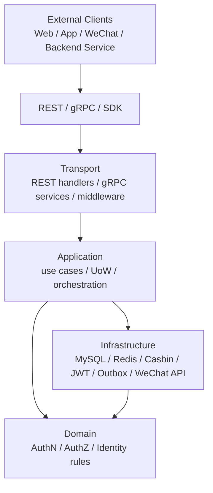
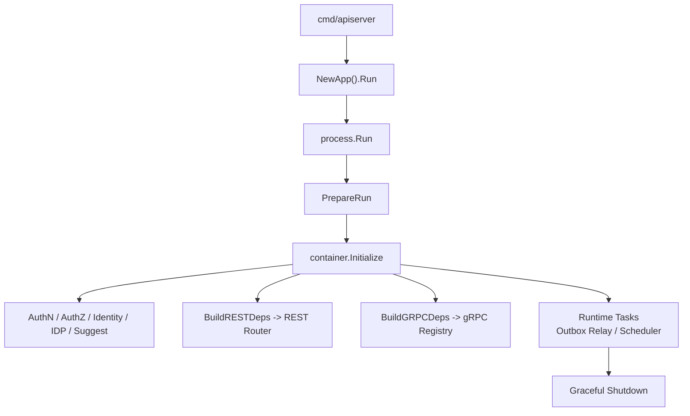
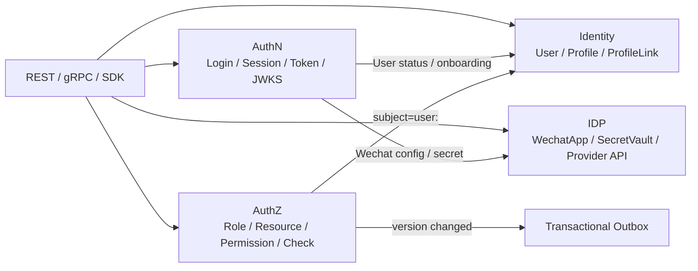

# 系统架构讲法

## 本文用途

本文是 `08-宣讲` 模块中用于对外讲解 IAM 系统架构的材料。

它不是《系统架构总览》的重复版。  
事实层文档负责解释源码结构和运行机制；本文负责回答：

```text
面试或技术分享中，我应该如何把 IAM 架构讲清楚？
先讲什么？
后讲什么？
怎么画图？
怎么体现设计取舍？
被追问时怎么回到证据链？
```

本文目标是形成一套可背、可画、可追问的架构表达。

---

## 1. 架构一句话

```text
IAM 采用分层 + 六边形架构组织：外部请求通过 REST/gRPC 进入 Transport 层，由 Application 层编排 AuthN、AuthZ、Identity、IDP 等用例，Domain 层承载认证、授权和身份关系规则，Infra 层适配 MySQL、Redis、Casbin、JWT、Outbox 和微信 API，Container 作为组合根负责模块装配，Process 负责服务生命周期。
```

更短版：

```text
IAM 的架构核心是：Transport 只做协议适配，Application 编排用例，Domain 承载业务规则，Infra 适配外部资源，Container 负责装配，Process 负责生命周期。
```

---

## 2. 30 秒讲法

```text
IAM 整体采用六边形架构和分层设计。最外层是 REST 和 gRPC 接入，负责协议适配和路由注册；进入系统后由 Application 层编排具体用例，比如登录、Token Verify、AuthZ Check、ProfileLink 操作；核心业务规则放在 Domain 层，比如 Session、RoleBinding、Permission、ProfileLink；基础设施层负责 MySQL、Redis、Casbin、JWT、Outbox、微信 API 等适配。运行时上，process 负责服务生命周期，container 作为组合根装配 AuthN、AuthZ、Identity、IDP 等模块，再把能力投影给 REST/gRPC/SDK 接入面。
```

---

## 3. 1 分钟讲法

```text
IAM 的系统架构可以从两个维度讲：运行时装配维度和业务分层维度。

运行时上，服务从 cmd/apiserver 入口启动，进入 process.Run，由 process 创建 APIServer、执行 PrepareRun、初始化资源、创建 container、注册 REST/gRPC，并处理后台任务和优雅关闭。container 是组合根，负责装配 AuthN、AuthZ、Identity、IDP、Suggest、CacheGovernance 和 Outbox 等模块。

业务分层上，最外层是 transport，REST/gRPC 只负责协议适配、参数绑定、中间件和调用 application service；application 层负责用例编排和事务边界，比如登录链路、授权写入、ProfileLink 创建；domain 层负责业务规则，比如 Session 是否 active、Permission 是否支持某 action、ProfileLink 是否重复；infra 层负责 MySQL、Redis、Casbin、JWT、Outbox、微信 API 等外部资源适配。

这个架构的核心目标是把协议、用例、领域规则和基础设施隔离开，让认证、授权、身份关系和第三方身份源可以独立演进。
```

---

## 4. 3 分钟讲法

```text
我讲 IAM 架构时，会先从请求链路讲起。

外部调用方包括 Web、App、微信小程序、内部服务和管理后台。它们通过 REST、gRPC 或 SDK 接入 IAM。REST 更适合 Web、移动端和管理后台，gRPC 更适合服务间调用，SDK 则是 Go 服务端接入 IAM 的产品化封装。

请求进入 IAM 后，首先到 transport 层。REST 使用 Gin router，gRPC 使用 proto service registry。transport 只做协议适配，比如参数绑定、JWT middleware、错误映射和 service registration，它不直接处理业务规则。

业务逻辑进入 application 层。Application 层负责用例编排，比如 AuthN 的登录、刷新、Verify，AuthZ 的 Check、GrantPermission、BindRole，Identity 的 User/Profile/ProfileLink 操作。Application 层也是事务和 UoW 的主要编排位置，比如 AuthZ 写入会通过 PolicyChangeCommitter 在一个 UoW 中写授权 facts、递增 PolicyVersion，并 stage Outbox event。

真正的业务规则在 domain 层。比如 AuthN 里 Session 是否 active，AuthZ 里 Role、Resource、Permission、RoleBinding 的规则，Identity 里 ProfileLink 的 relation、active/revoked 和 self link 不变量。这一层不应该依赖 MySQL、Redis、Casbin 或 REST。

Infra 层负责所有外部资源适配，比如 MySQL repository、Redis token/session store、Casbin adapter、JWT keyset、Transactional Outbox、微信 API 和 SecretVault。这样领域层只依赖端口，基础设施可以替换。

运行时装配方面，process 负责从配置到资源再到服务运行的生命周期，container 作为组合根装配 AuthN、AuthZ、Identity、IDP 等模块。各模块只暴露 application capabilities，container 再把这些能力投影给 REST deps、gRPC registrations 和 runtime tasks。

这个架构最关键的取舍是：我没有让 handler 直接操作数据库，也没有让 application 直接依赖 transport 或 infra，而是通过分层、typed deps、UoW 和架构测试保护边界。这样项目虽然比简单 CRUD 复杂，但认证、授权、身份关系和第三方身份源可以长期演进。
```

---

## 5. 白板图讲法

画图时不要一开始画所有模块。  
推荐先画主链路：

```text
External Clients
  -> REST / gRPC / SDK
  -> Transport
  -> Application
  -> Domain
  -> Infra
  -> MySQL / Redis / Casbin / JWT / Outbox / WeChat
```

### 白板图一：分层主图



讲图时说：

```text
这张图表达的是 IAM 的纵向分层。请求从外部接入进入 Transport，Transport 不写业务规则，只调用 Application。Application 编排用例和事务，Domain 承载业务规则，Infra 负责外部资源适配。
```

---

### 白板图二：运行时装配图



讲图时说：

```text
运行时上，cmd/apiserver 只是入口，真正生命周期由 process 管。process 创建 server，执行 PrepareRun，准备数据库、Redis、EventBus、container，然后注册 REST/gRPC，并启动后台任务和优雅关闭。
```

---

### 白板图三：模块边界图



讲图时说：

```text
横向模块上，我把 IAM 拆成 AuthN、AuthZ、Identity、IDP。AuthN 管认证态，AuthZ 管访问权，Identity 管身份和档案关系，IDP 管外部身份源基础设施。它们通过明确 capability 协作，而不是揉成一个 UserService。
```

---

## 6. 架构讲解顺序

推荐顺序：

```text
1. 先讲系统定位
2. 再讲外部接入
3. 再讲纵向分层
4. 再讲横向模块
5. 再讲运行时装配
6. 再讲关键设计取舍
7. 最后讲架构护栏
```

不要一上来讲目录。

### 6.1 系统定位

```text
IAM 是身份与访问管理服务，不是普通用户中心。
```

### 6.2 外部接入

```text
外部通过 REST、gRPC、SDK 接入。
```

### 6.3 纵向分层

```text
Transport -> Application -> Domain -> Infra
```

### 6.4 横向模块

```text
AuthN / AuthZ / Identity / IDP
```

### 6.5 运行时装配

```text
process 管生命周期，container 管模块装配。
```

### 6.6 关键设计取舍

```text
Session + Token
PolicyChange + UoW + Outbox
ProfileLink
IDP 与 AuthN 分离
SDK 是接入层
```

### 6.7 架构护栏

```text
architecture tests
contract tests
docs hygiene
```

---

## 7. 架构亮点讲法

### 7.1 分层边界清楚

```text
Handler 不直接操作数据库，Application 不直接依赖 Transport，Domain 不依赖 Infra，Infra 只做外部资源适配。
```

怎么展开：

```text
比如 AuthZ 写入时，REST handler 只负责 DTO 和调用 application；application 通过 PolicyChangeCommitter 编排 UoW；domain 生成 PolicyChange；infra 才负责写 casbin_rule、policy_versions 和 outbox。
```

---

### 7.2 横向模块拆分合理

```text
AuthN、AuthZ、Identity、IDP 分别回答认证态、访问权、身份关系和外部身份源四类问题。
```

怎么展开：

```text
如果合成 UserService，登录、权限、档案关系、微信 AppSecret、Token 签发都会混在一起。
```

---

### 7.3 运行时装配可控

```text
process 负责生命周期，container 作为组合根通过 typed deps 初始化各模块，并把模块能力投影给 REST/gRPC/runtime tasks。
```

怎么展开：

```text
这样 transport 不需要知道 container 内部结构，只消费显式 deps；gRPC 也通过 registrations 注册服务。
```

---

### 7.4 写入链路有一致性设计

```text
AuthZ 写入不是 CRUD，而是 UoW + PolicyVersion + Transactional Outbox + Runtime Reload。
```

怎么展开：

```text
这保证授权 facts、版本和事件记录同事务提交，后续由 relay 可靠发布版本变化。
```

---

### 7.5 有架构护栏

```text
项目用测试保护架构边界，而不是只靠开发约定。
```

怎么展开：

```text
比如 domain 不能依赖 infra，application 不能依赖 transport，Casbin facts 不能进入 domain，SDK public API 通过 compile test 固定。
```

---

## 8. 面试回答模板

### Q1：你这个项目整体架构是什么？

```text
整体是分层 + 六边形架构。外部通过 REST/gRPC/SDK 接入，Transport 层负责协议适配，Application 层负责编排用例和事务，Domain 层承载认证、授权、身份关系的业务规则，Infra 层适配 MySQL、Redis、Casbin、JWT、Outbox 和微信 API。运行时上由 process 管理生命周期，container 作为组合根装配 AuthN、AuthZ、Identity、IDP 等模块，并把能力投影给 REST/gRPC。
```

---

### Q2：为什么要这么分层？

```text
因为 IAM 不是简单 CRUD，它同时处理登录态、Token、授权判定、用户档案关系和第三方身份源。如果 handler 直接写数据库，或者 application 直接依赖 infra，很快会变成大泥球。分层后，协议、用例、领域规则和基础设施可以独立演进，也方便测试和替换。
```

---

### Q3：你的架构和 MVC 有什么区别？

```text
MVC 更偏表现层组织方式，而这里更强调六边形架构和依赖方向。REST/gRPC 只是外部适配器，MySQL、Redis、Casbin、JWT、微信 API 是基础设施适配器，中间的 application/domain 才是业务核心。核心逻辑不依赖具体协议和外部资源实现。
```

---

### Q4：Container 是不是 Service Locator？

```text
我这里的 container 更接近 composition root。它负责初始化模块和组装依赖，但请求处理过程中不会让业务代码到 container 里随便取对象。REST router 和 gRPC registry 消费的是 container 投影出来的 typed deps 或 registrations，这样能避免 Service Locator 式的隐式依赖。
```

---

### Q5：为什么要有 process 层？

```text
process 层负责进程生命周期：创建 APIServer、准备资源、初始化 container、注册 REST/gRPC、启动后台任务、处理 graceful shutdown。这样 main 函数不会变成上帝函数，container 也不会承担进程生命周期职责。
```

---

### Q6：你的领域层怎么保证不依赖基础设施？

```text
代码上通过端口和仓储接口隔离，infra 负责实现；测试上有 architecture tests，检查 domain 不依赖 infra/database，application 不依赖 transport/infra，Casbin facts 不能进入 domain。这些测试相当于架构护栏。
```

---

### Q7：架构最大亮点是什么？

```text
我觉得最大亮点不是用了某个框架，而是边界比较清楚，并且用测试固化边界。比如 AuthN/AuthZ/Identity/IDP 四个模块拆分清楚，AuthZ 写入用 UoW + Outbox 保证事实和事件一致，接入层通过 REST/gRPC/SDK 产品化，同时用架构测试和契约测试防止后续演进中退回大泥球。
```

---

## 9. 架构讲法中的证据链

| 你讲的点 | 可以回链的证据 |
| --- | --- |
| 服务入口很薄 | `cmd/apiserver/apiserver.go` 只调用 `apiserver.NewApp(...).Run()` |
| process 管生命周期 | `process.Run` 创建 APIServer、PrepareRun、Run |
| apiServer 持有 cfg、shutdown、generic server、grpc server、dbManager、container | `process/root.go` |
| container 是组合根 | `container.Container` 持有 MySQL、Redis、EventBus、AuthN/AuthZ/User/IDP/Suggest 等模块 |
| AuthN 模块职责 | `AuthnModule` 持有 account/login/token/session/JWKS/key rotation |
| AuthZ 模块职责 | `AuthzModule` 持有 role/resource/policy/rolebinding/check/snapshot |
| Identity 模块职责 | `UserModule` 持有 User/Profile/MyProfiles/ProfileLink |
| IDP 模块职责 | `IDPModule` 明确认证由 AuthN 提供，自己暴露 Repository/SecretVault/AuthProvider |
| REST 只消费 deps | `transport/rest.Router` 通过 `Deps`、auth middleware、module routes 注册 |
| gRPC 通过 registrations 注册 | `transport/grpc.Registry` 遍历 Registration 并 MarkAllServicesServing |
| 根 README 描述系统模块 | `README.md` 功能特性和模块交互 |
| docs 说明事实源 | `docs/README.md` |

---

## 10. 不推荐的架构讲法

### 10.1 一上来讲目录

```text
项目里有 cmd、internal、pkg、docs、api……
```

问题：

```text
这是文件结构，不是架构。
```

推荐改成：

```text
先讲请求链路和依赖方向，再讲目录如何承载这些层次。
```

---

### 10.2 只说“用了六边形架构”

```text
我用了六边形架构。
```

问题：

```text
太空，面试官会追问你哪里体现六边形。
```

推荐补一句：

```text
REST/gRPC 是外部适配器，MySQL/Redis/Casbin/JWT/微信 API 是基础设施适配器，Application/Domain 在中间，业务规则不依赖协议和基础设施实现。
```

---

### 10.3 把 container 讲成业务层

```text
container 负责业务逻辑。
```

问题：

```text
错误。container 是组合根，不处理请求，不写业务规则。
```

正确说法：

```text
container 负责装配模块和投影能力，业务逻辑在 application/domain。
```

---

### 10.4 把 infra 讲成底层工具包

```text
infra 就是工具类。
```

问题：

```text
infra 是适配器层，承载 MySQL、Redis、Casbin、JWT、Outbox、微信 API 等外部资源实现，不只是 utils。
```

---

### 10.5 忽略架构护栏

```text
我们约定 domain 不依赖 infra。
```

问题：

```text
只靠约定不够。
```

推荐说：

```text
项目用 architecture tests 检查依赖方向，防止边界回退。
```

---

## 11. 系统架构与业务模块的衔接

讲完分层后，要自然转到业务模块。

衔接句：

```text
在这个分层架构里，横向业务模块主要是 AuthN、AuthZ、Identity 和 IDP。它们不是独立微服务，而是在同一个 iam-apiserver 中通过 container 组装的模块边界。每个模块都有自己的 domain/application/infra 组织方式，并通过 REST/gRPC/SDK 对外暴露能力。
```

然后展开：

```text
AuthN 负责认证态
AuthZ 负责访问权
Identity 负责身份和档案关系
IDP 负责第三方身份源
```

---

## 12. 系统架构与技术亮点的衔接

讲完架构后，可以自然引出亮点。

衔接句：

```text
这套架构本身不是为了套模式，而是为了解决 IAM 里的几个核心复杂点：登录态管理、授权一致性、身份关系建模、第三方身份源隔离和业务系统接入。
```

然后展开：

```text
Session + Access/Refresh Token + JWKS/Verify
PolicyChange + UoW + Outbox
User/Profile/ProfileLink
IDP 与 AuthN 分离
REST/gRPC/SDK
Architecture tests
```

---

## 13. 简历项目描述版本

```text
负责设计并实现 IAM 身份与访问管理服务，采用分层与六边形架构组织代码：通过 process 管理服务生命周期，container 作为组合根装配 AuthN、AuthZ、Identity、IDP 等模块，REST/gRPC 作为协议适配层，Application 层编排登录、授权、ProfileLink 等用例，Domain 层承载认证、授权和身份关系规则，Infra 层适配 MySQL、Redis、Casbin、JWT、Transactional Outbox 和微信 API。系统对外提供 REST/gRPC/SDK 接入，并通过架构测试和契约测试保护模块边界。
```

---

## 14. 30 分钟分享中的位置

如果做 30 分钟技术分享，架构部分建议占：

```text
5-7 分钟
```

结构：

```text
1 分钟：系统定位
2 分钟：纵向分层
2 分钟：横向模块
1 分钟：运行时装配
1 分钟：架构护栏
```

不要在架构部分深入所有业务细节。  
业务细节留给后面的 AuthN/AuthZ/Identity 专题。

---

## 15. 本文总结

系统架构讲法的核心不是“我用了什么目录”，而是：

```text
这个系统如何隔离协议、用例、领域规则和基础设施？
这个系统如何装配 AuthN/AuthZ/Identity/IDP？
这个系统如何对外提供 REST/gRPC/SDK？
这个系统如何防止长期演进中边界腐烂？
```

最推荐的架构表达是：

```text
IAM 采用分层 + 六边形架构。外部通过 REST/gRPC/SDK 接入，Transport 只做协议适配，Application 编排用例和事务，Domain 承载认证、授权、身份关系规则，Infra 适配 MySQL、Redis、Casbin、JWT、Outbox、微信 API。运行时由 process 管生命周期，container 作为组合根装配 AuthN、AuthZ、Identity、IDP 等模块，并通过架构测试和契约测试保护边界。
```

后续讲 AuthN、AuthZ、Identity、IDP 时，都从这个架构骨架展开。
