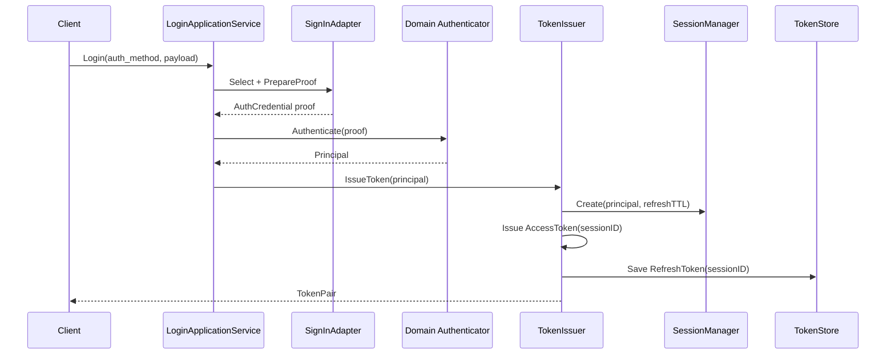
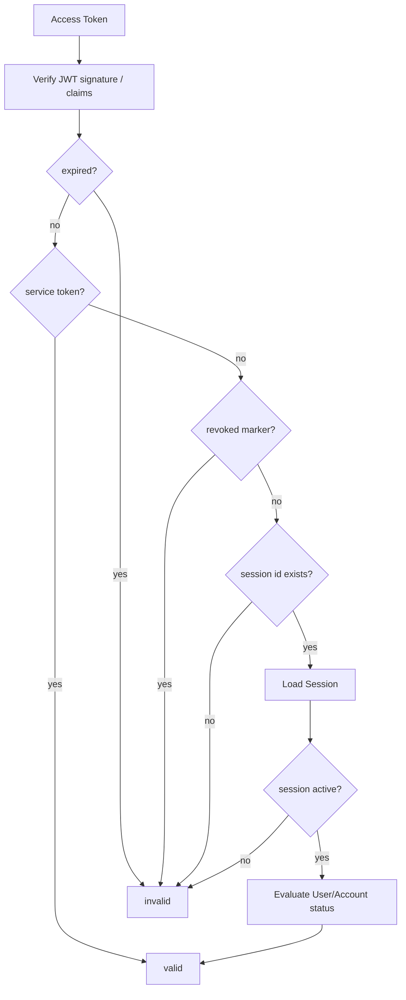
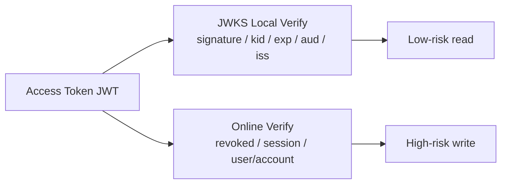

# AuthN 认证体系讲法

## 本文用途

本文是 `08-宣讲` 模块中用于对外讲解 IAM AuthN 认证体系的材料。

它不是 AuthN 源码说明书，而是帮你在面试、技术分享、项目介绍中讲清楚：

```text
IAM 的认证体系解决什么问题？
为什么不是简单“查用户 + 发 JWT”？
登录请求如何变成 Principal、Session、Access Token、Refresh Token？
为什么 JWKS 与在线 Verify 要并存？
怎么讲出 AuthN 的设计亮点和工程价值？
```

---

## 1. AuthN 一句话

```text
AuthN 是 IAM 的认证体系，负责把不同登录方式提交的凭据统一转换成 IAM Principal，并通过 Session、Access Token、Refresh Token、JWKS 和在线 Verify 管理登录态与凭证生命周期。
```

更短版：

```text
AuthN 负责“你如何证明你是谁”，以及“这次登录态和 token 现在是否仍然有效”。
```

---

## 2. 30 秒讲法

```text
IAM 的 AuthN 不是简单登录接口，而是一套认证与登录态管理体系。它把密码、手机号验证码、微信、企微、Service Token 等不同认证方式统一到同一条链路：先通过 SignInAdapter 选择登录方式并构造 proof，再由领域 Authenticator 认证出 Principal，之后 TokenIssuer 创建 Session，并签发 Access Token 和 Refresh Token。Access Token 是短期访问凭证，Refresh Token 是服务端可控的续期凭证，Session 是在线登录态锚点。后续 Verify 不只是验 JWT，还会检查 token 是否撤销、Session 是否 active、User/Account 是否仍可用。
```

---

## 3. 1 分钟讲法

```text
AuthN 认证体系的核心不是“登录成功后发一个 JWT”，而是把多种登录方式统一成一套可撤销、可刷新、可验签、可治理的登录态模型。

在登录阶段，请求会先进入 LoginApplicationService。SignIn 会通过 MethodSelector 和 SignInAdapterCatalog 选择登录方式，比如 password、phone_otp、wechat、wecom，适配器把不同 payload 转换成领域 proof。然后领域 Authenticator 根据 proof 做认证，认证成功后得到 Principal，包含 UserID、AccountID、TenantID、AMR 和 claims。

接下来 TokenIssuer 不会直接只发 JWT，而是先创建 Session，再签发短期 Access Token，并把 Refresh Token 保存到服务端 store。这样后续登出、封禁、账号禁用、token 撤销都能影响登录态。

验证阶段分两类：低风险高吞吐场景可以用 JWKS 本地验签；高风险或需要状态强一致的场景要调用在线 Verify。在线 Verify 会在 JWT 验签之外继续检查 revoked marker、Session active 和 User/Account 状态。
```

---

## 4. 3 分钟讲法

```text
IAM 的 AuthN 模块我会从三个层次讲：登录编排、凭证生命周期、验证策略。

第一层是登录编排。外部请求不会直接进入某个固定登录函数，而是进入 LoginApplicationService。这里会通过 SignInAdapterCatalog 和 MethodSelector 根据 auth_method 选择登录方式，例如 password、phone_otp、wechat、wecom。不同登录方式的 payload 会被适配成领域 proof，然后交给 domain Authenticator。Authenticator 不关心 HTTP 或 JSON，它只关心这个 proof 是否能认证出一个 Principal。Principal 是 IAM 内部认证主体，包含 UserID、AccountID、TenantID、认证方式 AMR 和扩展 claims。

第二层是凭证生命周期。认证成功后，TokenIssuer 不只是发一个 JWT。它会先创建 Session，Session 是在线登录态锚点；再基于 Principal + SessionID 签发短期 Access Token；同时生成随机 Refresh Token，并保存到服务端 token store。Access Token 适合请求携带和 JWKS 验签，Refresh Token 适合续期，但必须服务端可控；Session 用来支持登出、撤销、用户封禁、账号禁用和批量下线。

第三层是验证策略。IAM 同时支持 JWKS 离线验签和在线 Verify。JWKS 负责把公钥发布出去，让业务服务本地验证 JWT 签名、kid、exp、issuer、audience；在线 Verify 则负责判断这个 token 当前还能不能用。在线 Verify 会先验 JWT，再检查 access token revoked marker，再根据 session_id 加载 Session，确认 Session active，最后重新检查 User/Account 状态。也就是说，JWT 只能证明 token 是 IAM 签的，在线 Verify 才能证明登录态当前仍有效。

所以 AuthN 的设计价值是：把多种登录方式统一到同一套 Principal、Session、Token、JWKS、Verify/Revoke 模型里，既支持高性能本地验签，也支持高安全在线状态校验。
```

---

## 5. 白板图讲法

### 图一：登录主链路



讲图时说：

```text
这张图体现的是 AuthN 的统一登录模型。不同登录方式通过 adapter 适配成 proof，领域认证器输出 Principal，TokenIssuer 再创建 Session 并签发 token pair。
```

---

### 图二：在线 Verify 链路



讲图时说：

```text
在线 Verify 不只是验 JWT。JWT 验签之后，还要检查 token 是否被撤销、session 是否 active、user/account 是否仍可访问。
```

---

### 图三：JWKS 与在线 Verify 的关系



讲图时说：

```text
JWKS 解决签名可信，在线 Verify 解决当前可用。业务服务可以按风险选择：低风险读走本地验签，高风险写走在线 Verify。
```

---

## 6. AuthN 要讲清楚的五个核心概念

### 6.1 Principal

Principal 是认证成功后的 IAM 主体。

它通常包含：

```text
UserID
AccountID
TenantID
AMR
Claims
```

讲法：

```text
不同登录方式最终都要归一成 Principal。密码、微信、企微只是认证方式不同，登录成功后 IAM 内部都用 Principal 表达“这个人是谁”。
```

---

### 6.2 Session

Session 是在线登录态锚点。

讲法：

```text
Session 不是浏览器 session，而是 IAM 记录的一次登录会话。Access Token 和 Refresh Token 都绑定 Session。只要 Session 被 revoke，在线 Verify 和 Refresh 都会失败。
```

---

### 6.3 Access Token

Access Token 是短期访问凭证。

讲法：

```text
Access Token 是 JWT，适合请求携带和 JWKS 验签，但它不应该承担长期登录态。
```

---

### 6.4 Refresh Token

Refresh Token 是服务端可控的续期凭证。

讲法：

```text
Refresh Token 不是另一个长期 JWT，而是服务端保存的随机凭证。刷新时要检查 Refresh Token、Session 和 User/Account 状态，并且刷新成功后会轮换旧 token。
```

---

### 6.5 JWKS / Verify

讲法：

```text
JWKS 负责离线验签，Verify 负责在线状态。JWKS 证明 token 是 IAM 签的，Verify 证明 token 现在仍然能用。
```

---

## 7. AuthN 的设计亮点

### 7.1 多登录方式统一

```text
通过 SignInAdapterCatalog + MethodSelector，把 password、phone_otp、wechat、wecom 等方式统一到同一条 SignIn 链路。
```

价值：

```text
新增登录方式时，不需要改 TokenIssuer、Session、Verify 等后续链路。
```

---

### 7.2 登录态可撤销

```text
Access Token 带 SessionID，Refresh Token 也保存 SessionID。在线 Verify 和 Refresh 都会检查 Session 是否 active。
```

价值：

```text
用户登出、用户封禁、账号禁用、token 撤销都能影响旧登录态。
```

---

### 7.3 短期访问 + 长期续期分离

```text
Access Token 短期，Refresh Token 长期但服务端可控。
```

价值：

```text
既保证用户体验，又降低 token 泄露风险。
```

---

### 7.4 离线验签与在线验证并存

```text
JWKS 支持业务服务本地验签，在线 Verify 支持强一致状态判断。
```

价值：

```text
性能和安全可以按场景平衡。
```

---

### 7.5 IDP 与 AuthN 分离

```text
IDP 只管微信/企微应用配置、SecretVault 和外部 API，AuthN 统一做账号绑定、Principal、Session 和 Token。
```

价值：

```text
不会出现微信登录一套 token、密码登录一套 token 的混乱。
```

---

## 8. 不推荐的 AuthN 讲法

### 8.1 说成“JWT 登录”

```text
用户登录成功后发 JWT。
```

问题：

```text
太浅。JWT 只是 Access Token 的实现方式，不能解释 Session、Refresh、Verify、Revoke、JWKS。
```

---

### 8.2 说成“登录注册模块”

```text
AuthN 是登录注册模块。
```

问题：

```text
不准确。AuthN 还包括 Session、Token 生命周期、JWKS、ServiceToken、Verify/Revoke。
```

---

### 8.3 只讲微信登录

```text
我们支持微信登录。
```

问题：

```text
把第三方登录特例当成 AuthN 整体。正确说法是：微信登录只是 AuthN 的一种登录方式，由 IDP 提供身份源基础设施。
```

---

### 8.4 把 JWKS 说成完整认证

```text
业务服务拿 JWKS 验签就说明用户有效。
```

问题：

```text
错误。JWKS 只证明签名可信，不能证明 session active 或 user/account 状态正常。
```

---

## 9. 面试常见问题回答

### Q1：你的登录流程怎么设计？

```text
登录流程不是直接查用户发 JWT，而是先通过 auth_method 选择登录方式，SignInAdapter 把不同 payload 转成领域 proof，再交给 Authenticator 做认证。认证成功后得到 Principal，TokenIssuer 先创建 Session，再签发 Access Token，并保存 Refresh Token。这样后续 Verify、Refresh、Revoke 都能围绕同一个 Session 做状态控制。
```

---

### Q2：为什么不只用 JWT？

```text
JWT 只能证明 token 是 IAM 签发的，并且没过期，但不能证明登录态现在仍然有效。比如用户登出、用户被 block、账号被 disable，旧 JWT 在过期前本地验签仍然可能通过。所以我用 Session 做在线登录态锚点，在线 Verify 时会检查 revoked marker、Session 和 User/Account 状态。
```

---

### Q3：Access Token 和 Refresh Token 怎么分工？

```text
Access Token 是短期访问凭证，适合每次请求携带和 JWKS 验签；Refresh Token 是长期续期凭证，但必须服务端保存、可撤销、可轮换，并且绑定 Session。这样既能保持用户体验，也能控制长期凭证风险。
```

---

### Q4：Refresh Token 为什么不做成 JWT？

```text
Refresh Token 的关键不是携带 claims，而是服务端可控。它需要能被删除、轮换、绑定 Session、检测是否过期。如果做成完全无状态 JWT，泄露后很难精准撤销。
```

---

### Q5：JWKS 和在线 Verify 有什么区别？

```text
JWKS 是公钥分发机制，业务服务可以本地验证 JWT 签名、kid、exp、audience、issuer；在线 Verify 是状态判定，它还会检查 access token 是否撤销、Session 是否 active、User/Account 是否仍然可用。所以 JWKS 证明签名可信，在线 Verify 证明当前可用。
```

---

### Q6：用户被封禁后旧 token 怎么处理？

```text
在线 Verify 会重新检查 User/Account 状态，用户被 block 后旧 token 即使签名有效，也会 Verify 失败。同时 Identity 的用户状态变更可以触发 session revoke，让该用户的登录态失效。
```

---

### Q7：Service Token 和用户 Token 有什么区别？

```text
用户 token 绑定 User、Account、Session，在线 Verify 要检查 Session 和 User/Account 状态。Service Token 表达的是服务身份，当前不走用户 Session 语义，应该通过 audience、TTL、mTLS、ACL 和审计来约束。
```

---

### Q8：微信登录怎么融入 AuthN？

```text
微信登录不是 IDP 直接签 token。AuthN 的微信 adapter 会通过 IDP 查询 WechatApp 配置、解密 AppSecret、调用微信 code2Session，然后继续走 AuthN 的账号绑定、Principal、Session 和 Token 签发链路。这样微信、企微、密码登录最终都统一到同一套登录态模型。
```

---

## 10. AuthN 与其他模块的关系

### 10.1 AuthN 与 Identity

```text
AuthN 登录成功后使用 UserID 作为 Principal 的身份锚点；在线 Verify 时会检查 User 状态；用户被 block 时可以撤销 Session。
```

讲法：

```text
Identity 提供“这个用户是谁、状态是什么”，AuthN 管“这个用户的登录态是否有效”。
```

---

### 10.2 AuthN 与 IDP

```text
IDP 提供微信/企微应用配置、SecretVault 和外部 API，AuthN 负责统一登录态和 Token。
```

讲法：

```text
IDP 证明外部身份源如何接入，AuthN 决定外部身份能不能成为 IAM Principal。
```

---

### 10.3 AuthN 与 AuthZ

```text
AuthN 证明你是谁，AuthZ 判断你能做什么。
```

讲法：

```text
AuthN 不做资源权限判断，AuthZ 不做密码验证和 token 签发。
```

---

### 10.4 AuthN 与 SDK

```text
SDK 封装 LoginV2、VerifyToken、JWKSManager、TokenVerifier、ServiceAuthHelper。
```

讲法：

```text
SDK 是业务服务接入 AuthN 的产品化封装，不是 AuthN 业务层。
```

---

## 11. 证据链索引

| 讲法 | 证据 |
| --- | --- |
| AuthN module 包含 account/login/token/session/JWKS/key rotation | `AuthnModule` 装配 |
| LoginApplicationService 构造 SignIn/SignOut，并使用 adapter catalog | `application/authn/login/services_impl.go` |
| SignIn 选择登录方式、准备 proof、调用 Authenticator、签发 token | `application/authn/login/sign_in.go` |
| TokenIssuer 先创建 Session，再签 access token 和保存 refresh token | `application/authn/token/issuer.go` |
| Verify 检查 JWT、revoked marker、Session、User/Account 状态 | `application/authn/token/verifier.go` |
| Refresh 检查 refresh token、Session、User/Account 状态，并轮换旧 refresh token | `application/authn/token/refresher.go` |
| JWKS 公开 endpoint 用于验证 JWT 签名，并带 ETag/Cache-Control | `transport/rest/authn/handler/jwks_public.go` |
| IDP 只做身份源基础设施，认证由 AuthN 统一提供 | `IDPModule` 装配注释 |

---

## 12. 简历项目描述版本

```text
设计并实现 IAM AuthN 认证体系，支持多登录方式统一认证、Session 登录态、Access Token / Refresh Token 生命周期、Token 撤销、在线 Verify、JWKS 公钥发布与 KeyRotation。登录链路通过 SignInAdapterCatalog 适配 password、phone_otp、wechat、wecom 等方式，认证成功后生成 Principal，并由 TokenIssuer 创建 Session、签发短期 Access Token、保存服务端 Refresh Token；在线 Verify 在 JWT 验签之外继续检查 revoked marker、Session active 和 User/Account 状态。
```

---

## 13. 30 分钟分享中的位置

如果做 30 分钟技术分享，AuthN 建议占：

```text
5-6 分钟
```

结构：

```text
1 分钟：为什么不是简单 JWT 登录
1 分钟：登录主链路
1 分钟：Session / Access / Refresh
1 分钟：Verify / JWKS
1 分钟：IDP 与 AuthN 协作
1 分钟：常见追问
```

---

## 14. 本文总结

AuthN 认证体系讲法的核心是：

```text
不要把它讲成“登录后发 JWT”。
```

应该讲成：

```text
多认证方式
  -> 统一 SignIn
  -> Principal
  -> Session
  -> Access Token
  -> Refresh Token
  -> Verify / Revoke / JWKS
```

推荐最终表达：

```text
IAM 的 AuthN 是认证与登录态管理体系。它通过 SignInAdapter 把 password、phone_otp、wechat、wecom 等不同登录方式统一成领域 proof，由 Authenticator 认证出 Principal，再由 TokenIssuer 创建 Session、签发 Access Token 并保存 Refresh Token。后续既可以通过 JWKS 做本地验签，也可以通过在线 Verify 检查 revoked marker、Session 和 User/Account 状态。这样既支持性能，也支持登录态可撤销和安全治理。
```
