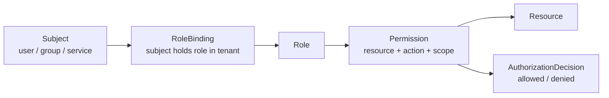
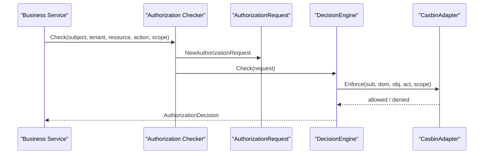
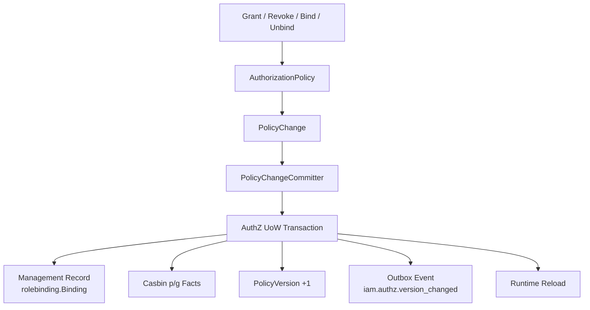

# AuthZ 授权体系讲法

## 本文用途

本文是 `08-宣讲` 模块中用于对外讲解 IAM AuthZ 授权体系的材料。

它不是 AuthZ 源码说明书，而是帮你在面试、技术分享、项目介绍中讲清楚：

```text
AuthZ 解决什么问题？
为什么不是 user.role 字段？
Role、Resource、Permission、RoleBinding 怎么组织？
一次 Check 如何走到 Casbin？
授权写入为什么不是简单 CRUD？
PolicyVersion 和 Outbox 为什么重要？
如何讲出 AuthZ 的设计亮点和工程价值？
```

---

## 1. AuthZ 一句话

```text
AuthZ 是 IAM 的授权体系，负责回答“某个 subject 在某个 tenant 下，能不能对某个 resource 执行某个 action，并且满足某个 scope”。
```

更短版：

```text
AuthZ 负责“你能不能做这件事”。
```

和 AuthN 的边界：

```text
AuthN 证明你是谁
AuthZ 判断你能做什么
```

---

## 2. 30 秒讲法

```text
IAM 的 AuthZ 不是简单的 user.role 字段，而是一套资源级授权体系。它用 Role、Resource、Permission、RoleBinding 建模：Permission 表示某个角色能对某个资源执行某个动作，RoleBinding 表示某个 subject 在某个 tenant 下持有某个角色。业务服务发起 Check 时，会传 subject、tenant、resource、action、scope，AuthZ 会构造成 AuthorizationRequest，并通过 Casbin runtime policy engine 得到 allowed 或 denied。写入侧也不是 CRUD，而是通过 PolicyChangeCommitter 和 UoW 写授权 facts、递增 PolicyVersion、stage Outbox 事件，并在提交后 reload runtime policy。
```

---

## 3. 1 分钟讲法

```text
AuthZ 的核心问题是资源访问判定。普通系统可能直接写 user.role == admin，但 IAM 需要支持多角色、多资源、多 action、多 tenant 和 scope，所以我把授权模型拆成 Role、Resource、Permission、RoleBinding。

其中 Permission 回答“某个角色能对什么资源做什么动作”，RoleBinding 回答“某个 subject 在某个 tenant 下持有什么角色”。Check 的请求模型是 subject、tenant、resource、action、scope。进入应用层后会构造 AuthorizationRequest，再通过 DecisionEngine 调用 CasbinAdapter。Casbin 在这里不是领域模型，只是运行时策略引擎；领域语言仍然是 Role、Resource、Permission、RoleBinding、Scope。

写入侧更复杂，授权变更不是简单插表。比如绑定角色时，既要写 rolebinding 管理记录，也要写 Casbin g fact，还要递增 PolicyVersion，stage 授权版本 Outbox 事件，并在事务提交后 reload runtime policy。这样才能保证管理面、判定面、缓存失效和跨系统传播的一致性。
```

---

## 4. 3 分钟讲法

```text
IAM 的 AuthZ 模块我会从两个链路讲：读链路，也就是授权判定；写链路，也就是授权策略变更。

先讲读链路。AuthZ 回答的问题是：某个 subject 在某个 tenant 下，能不能对某个 resource 执行某个 action，并且符合某个 scope。这里的 subject 可以是 user、group 或 service；resource 是业务资源，比如某类档案、量表、管理功能；action 是 read、write、delete 等动作；scope 则用于表达 all 或 origin 这样的对象范围。应用层会把这些输入构造成 AuthorizationRequest，然后交给 DecisionEngine。当前 DecisionEngine 的实现是 CasbinAdapter，最后通过 Casbin Enforcer 判定 allowed 或 denied。

再讲授权模型。AuthZ 不是 user.role 字段，而是 Role、Resource、Permission、RoleBinding 四个核心对象。Permission 表示 role 能对 resource 执行 action；RoleBinding 表示 subject 在 tenant 下持有 role。所以判定时先通过 RoleBinding 找到 subject 的角色，再通过角色找到权限，最终判断 resource/action/scope 是否匹配。

然后讲写链路。授权写入不是简单 CRUD。比如给角色授予权限，不只是 insert permission；给用户绑定角色，也不只是 insert role_binding。因为系统还要把领域授权事实写成 Casbin p/g facts，用于运行时判定；还要递增 PolicyVersion，让下游知道授权版本变化；还要把 version_changed 事件 stage 到 Transactional Outbox，保证 DB 事实和事件通知同事务提交；最后在提交后 reload runtime policy，让当前进程的 Casbin Enforcer 看到新策略。

这套设计的价值是：AuthZ 既能支持在线 Check，也能提供授权快照；既能管理角色资源权限，也能可靠传播授权版本变化；同时通过架构测试保证 Casbin 只是 infra adapter，不污染 domain 领域语言。
```

---

## 5. 白板图讲法

### 图一：授权模型



讲图时说：

```text
AuthZ 的核心是 subject 通过 RoleBinding 获得 Role，Role 通过 Permission 拥有 Resource/Action/Scope，最终 Check 返回 allowed 或 denied。
```

---

### 图二：授权判定链路



讲图时说：

```text
业务服务不自己判断权限，而是把 subject、tenant、resource、action、scope 交给 AuthZ Check。AuthZ 把它转成领域请求，再由 CasbinAdapter 做运行时判定。
```

---

### 图三：授权写入链路



讲图时说：

```text
授权写入不是 CRUD。它会把领域变更转成 PolicyChange，再在 UoW 里同时写管理记录、Casbin facts、PolicyVersion 和 Outbox event，提交后 reload runtime policy。
```

---

## 6. AuthZ 要讲清楚的六个核心概念

### 6.1 Subject

Subject 是被授权主体。

```text
user
group
service
```

讲法：

```text
AuthZ 不关心这个 subject 是怎么登录的，那是 AuthN 的事情。AuthZ 只关心这个 subject 在某个 tenant 下能不能访问某个资源。
```

---

### 6.2 Role

Role 是权限集合的业务身份。

讲法：

```text
角色不是直接等于用户字段，而是权限聚合点。用户或服务通过 RoleBinding 持有角色。
```

---

### 6.3 Resource

Resource 是受保护资源。

讲法：

```text
Resource 表示系统里可被授权保护的对象，比如某类档案、量表、管理接口或业务功能。
```

---

### 6.4 Permission

Permission 表示：

```text
某个 Role 可以对某个 Resource 执行某个 Action，并限制在某个 Scope。
```

讲法：

```text
Permission 回答“角色能做什么”。
```

---

### 6.5 RoleBinding

RoleBinding 表示：

```text
某个 Subject 在某个 Tenant 下持有某个 Role。
```

讲法：

```text
RoleBinding 回答“谁拥有什么角色”。
```

---

### 6.6 Scope

Scope 表示权限作用范围。

当前典型是：

```text
all:*
origin:<value>
```

讲法：

```text
Scope 用来避免权限过粗，比如同样是 read 某类资源，也可以限定在某个 origin 范围内。
```

---

## 7. AuthZ 的设计亮点

### 7.1 不是 user.role，而是资源级授权模型

```text
Subject + Tenant + Resource + Action + Scope
```

价值：

```text
能支持资源级、租户级和范围级权限，而不是粗糙角色字段。
```

---

### 7.2 RoleBinding 与 Assignment 分层

```text
assignment 是 REST/proto 对外 wire term
rolebinding 是内部领域语言
```

价值：

```text
保留 API 兼容，同时保持内部领域语义准确。
```

---

### 7.3 Casbin 是 infra adapter，不是领域模型

```text
业务语言是 Role、Resource、Permission、RoleBinding、Scope
Casbin p/g facts 只是运行时判定映射
```

价值：

```text
避免业务层被 Casbin 术语污染，后续替换或扩展 runtime engine 更容易。
```

---

### 7.4 授权写入不是 CRUD

```text
PolicyChangeCommitter + UoW + Facts + PolicyVersion + Outbox + RuntimeReload
```

价值：

```text
保证管理面、判定面、版本传播和当前 runtime policy 一致。
```

---

### 7.5 支持 AuthorizationSnapshot

```text
SnapshotReader 读取 subject 的 roles、permissions 和 authz_version。
```

价值：

```text
业务服务可以拿授权快照并结合 PolicyVersion 做缓存治理。
```

---

### 7.6 有架构护栏

```text
架构测试禁止 AuthZ 退回 assignment 包，禁止 Casbin facts 进入 domain。
```

价值：

```text
防止授权模型长期演进后边界腐烂。
```

---

## 8. 不推荐的 AuthZ 讲法

### 8.1 说成“我用了 Casbin”

```text
权限系统用了 Casbin。
```

问题：

```text
太浅。Casbin 只是运行时判定引擎，不是你的授权模型。
```

正确说法：

```text
我用 Role、Resource、Permission、RoleBinding 建模授权，再把授权事实映射到 Casbin p/g rules 做运行时判定。
```

---

### 8.2 说成“用户有角色”

```text
用户表里有 role。
```

问题：

```text
这会把复杂授权讲成 user.role 字段。
```

正确说法：

```text
subject 通过 RoleBinding 在 tenant 下持有角色，角色再通过 Permission 关联资源和动作。
```

---

### 8.3 说成“权限就是 CRUD”

```text
授权就是增删改查角色和权限。
```

问题：

```text
漏掉 runtime facts、PolicyVersion、Outbox、reload。
```

正确说法：

```text
授权管理接口是 CRUD 风格，但授权写入本质是策略事实变更，需要 UoW 和版本传播。
```

---

### 8.4 混淆 AuthN 和 AuthZ

```text
AuthZ 验证 token 后判断权限。
```

问题：

```text
验证 token 是 AuthN 的事。AuthZ 接收 subject 并判断访问权。
```

正确说法：

```text
AuthN 证明你是谁，AuthZ 判断你能不能访问资源。
```

---

## 9. 面试常见问题回答

### Q1：你的授权模型怎么设计？

```text
我把授权模型拆成 Role、Resource、Permission、RoleBinding。Permission 表示角色能对某个资源执行某个动作，并可以带 scope；RoleBinding 表示某个 subject 在某个 tenant 下持有某个 role。业务服务发起 Check 时传 subject、tenant、resource、action、scope，最终返回 allowed 或 denied。
```

---

### Q2：为什么不用 user.role 字段？

```text
user.role 只能表达很粗的角色，无法表达资源、动作、tenant 和 scope，也无法支持授权快照、授权版本传播和跨服务统一 Check。IAM 需要给多个业务系统提供统一授权能力，所以必须用 Role/Resource/Permission/RoleBinding 建模。
```

---

### Q3：Casbin 在你的系统里是什么角色？

```text
Casbin 是运行时 policy engine，不是领域模型。领域层使用 Role、Resource、Permission、RoleBinding、Scope 这些业务概念；infra 层把这些授权事实映射成 Casbin p/g facts，然后通过 Casbin Enforcer 做 Check。
```

---

### Q4：一次授权判定怎么走？

```text
业务服务调用 AuthZ Check，传 subject、tenant、resource、action、scope。Application 层构造 AuthorizationRequest，然后调用 DecisionEngine。当前 DecisionEngine 由 CasbinAdapter 实现，最终执行 Enforce，返回 AuthorizationDecision。
```

---

### Q5：授权写入为什么不是 CRUD？

```text
因为授权写入改变的是运行时可判定的策略事实。比如绑定角色不仅要写 rolebinding 管理记录，还要写 Casbin g fact；授予权限要写 p fact；此外还要递增 PolicyVersion、stage Outbox 事件，并在事务提交后 reload runtime policy。否则管理面、判定面和下游缓存会不一致。
```

---

### Q6：PolicyVersion 有什么用？

```text
PolicyVersion 表示某个 tenant 的授权事实版本。业务服务或 SDK 可以用它判断本地授权快照是否过期。每次授权 facts 改变后都递增版本，并通过 Outbox 传播 version_changed 事件。
```

---

### Q7：Outbox 在授权系统中解决什么？

```text
Outbox 解决 DB 授权事实和事件发布之间的一致性问题。如果直接 DB commit 后 publish MQ，会有 DB 成功但 MQ 失败的窗口。Transactional Outbox 把授权 facts、PolicyVersion 和事件记录放在同一个事务里，之后由 relay 异步可靠投递。
```

---

### Q8：assignment 和 rolebinding 有什么区别？

```text
assignment 是 REST/proto 对外 wire term，表示角色分配；rolebinding 是内部领域语言，表示 subject 在 tenant 下持有 role。这样既保持 API 兼容，又让内部模型更准确。
```

---

## 10. AuthZ 与其他模块的关系

### 10.1 AuthZ 与 AuthN

```text
AuthN 证明身份，AuthZ 判断访问权。
```

讲法：

```text
AuthZ 不验证密码，也不签发 token；它接收 subject 并判断这个 subject 有没有权限访问资源。
```

---

### 10.2 AuthZ 与 Identity

```text
Identity 提供 User/Profile/ProfileLink，AuthZ 使用 user:<id> 作为 subject。
```

讲法：

```text
ProfileLink 是身份关系，不是资源权限。如果要做资源权限，仍然要走 AuthZ Resource/Action/Scope。
```

---

### 10.3 AuthZ 与 SDK

```text
SDK 封装 Check、Allow、AllowScoped、AuthorizationSnapshot。
```

讲法：

```text
SDK 只是调用 AuthZ，不在本地复制授权规则。
```

---

### 10.4 AuthZ 与 Outbox

```text
授权事实变化后，通过 PolicyVersion + Outbox 通知下游。
```

讲法：

```text
AuthZ 写入不仅改变当前 DB，还要告诉业务服务授权版本变了。
```

---

## 11. 证据链索引

| 讲法 | 证据 |
| --- | --- |
| AuthZ module 装配 role/resource/policy/rolebinding/check/snapshot | `container/assembler/authz.go` |
| 领域模型包含 Subject、Permission、RoleBinding、AuthorizationRequest | `domain/authz/model.go` |
| Checker 将 CheckCommand 转成 AuthorizationRequest，再调用 DecisionEngine | `application/authz/authorization/service.go` |
| SnapshotReader 返回 roles、permissions、authz_version | `application/authz/authorization/service.go` |
| PolicyChangeCommitter 拥有 UoW、facts、version、outbox、reload 顺序 | `application/authz/policy/committer.go` |
| CasbinAdapter 是 runtime policy engine，DB 是授权事实源 | `infra/casbin/adapter.go` |
| Casbin Check 最终 Enforce sub/dom/obj/act/scope | `infra/casbin/adapter.go` |
| AuthZ 初始化时创建 CasbinAdapter、repositories、UoW、application services | `container/assembler/authz.go` |

---

## 12. 简历项目描述版本

```text
设计并实现 IAM AuthZ 授权体系，基于 Role、Resource、Permission、RoleBinding 建模资源级权限，支持 subject/tenant/resource/action/scope 维度的授权判定。读链路通过 AuthorizationRequest + DecisionEngine 接入 Casbin runtime policy engine；写链路通过 PolicyChangeCommitter 和 AuthZ UoW 同事务写入授权 facts、递增 PolicyVersion、stage Transactional Outbox 事件，并在提交后 reload runtime policy，保证管理面、判定面和下游授权缓存的一致性。
```

---

## 13. 30 分钟分享中的位置

如果做 30 分钟技术分享，AuthZ 建议占：

```text
6-7 分钟
```

结构：

```text
1 分钟：为什么不是 user.role
1 分钟：Role / Resource / Permission / RoleBinding
1 分钟：Check 判定链路
1 分钟：Casbin 是 infra adapter
2 分钟：PolicyChange / UoW / Outbox 写入链路
1 分钟：追问准备
```

---

## 14. 本文总结

AuthZ 授权体系讲法的核心是：

```text
不要把它讲成“用了 Casbin”或“用户有角色”。
```

应该讲成：

```text
Subject
  -> RoleBinding
  -> Role
  -> Permission
  -> Resource / Action / Scope
  -> AuthorizationDecision
```

推荐最终表达：

```text
IAM 的 AuthZ 是资源级授权体系。它用 Role、Resource、Permission、RoleBinding 表达授权模型，用 AuthorizationRequest 表达一次判定请求，再通过 CasbinAdapter 做运行时 Enforce。Casbin 只是 infra 层 policy engine，业务语言仍然是 Role、Resource、Permission、RoleBinding、Scope。写入侧通过 PolicyChangeCommitter 和 UoW 同事务写授权 facts、递增 PolicyVersion、stage Outbox 事件，并在提交后 reload runtime policy，从而保证管理面、判定面和下游缓存的一致性。
```
