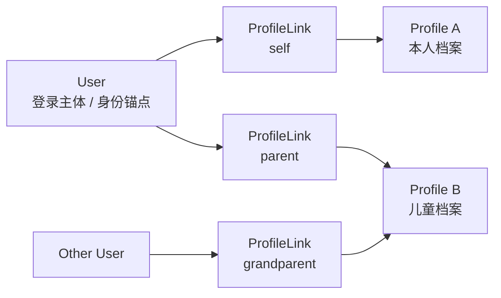
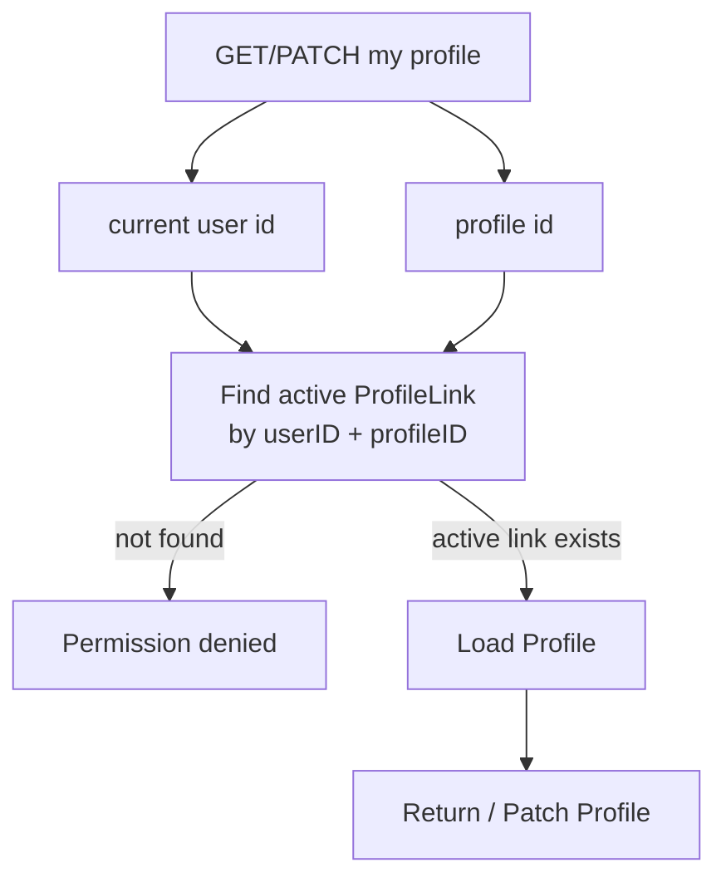
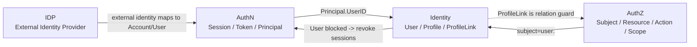

# Identity 与 ProfileLink 讲法

## 本文用途

本文是 `08-宣讲` 模块中用于对外讲解 IAM Identity 与 ProfileLink 的材料。

它不是字段说明书，而是帮你在面试、技术分享、项目介绍中讲清楚：

```text
Identity 模块解决什么问题？
User 和 Profile 为什么要分开？
ProfileLink 为什么不能只是 User 字段？
当前用户视角如何保护档案访问？
ProfileLink 和 AuthZ 权限是什么关系？
Identity 如何与 AuthN/AuthZ 协作？
```

这篇的核心目标是：  
**把 Identity 讲成“身份主体与业务档案关系建模”，而不是讲成普通用户资料 CRUD。**

---

## 1. Identity 一句话

```text
Identity 是 IAM 中管理内部身份主体与业务档案关系的模块，它把登录主体 User、业务档案 Profile、以及二者之间的 ProfileLink 关系分开建模，用来支持本人档案、儿童档案、亲属关系和当前用户访问边界。
```

更短版：

```text
Identity 负责“系统内部这个人是谁，以及他和哪些业务档案有关”。
```

---

## 2. 30 秒讲法

```text
IAM 的 Identity 不是简单用户资料模块。它把 User 和 Profile 分开：User 是登录主体，是 AuthN token 里的身份锚点；Profile 是业务档案，比如本人档案或儿童档案；ProfileLink 是 User 和 Profile 之间的关系事实，可以表达 self、parent、grandparent、other 等关系，并支持 active/revoked 状态。这样一个用户可以关联多个档案，一个档案也可以被多个用户关联。当前用户访问档案时，MyProfiles 和 MyProfileLinks 会通过 active ProfileLink 做 guard，避免用户直接按 profile_id 越权访问别人的档案。
```

---

## 3. 1 分钟讲法

```text
Identity 这块我主要解决的是 User、Profile、ProfileLink 的关系建模问题。普通用户系统往往把用户资料直接放在 User 表里，但在我们的业务里，登录主体和业务档案不是一回事。User 是能登录系统的人，参与 AuthN 的 token、session、user status，也可以作为 AuthZ 的 subject；Profile 是业务档案，比如本人档案、儿童档案或被测评者档案；ProfileLink 是 User 和 Profile 之间的关系，比如 self、parent、grandparent、other。

这样设计可以支持一个 User 关联多个 Profile，也支持一个儿童 Profile 被多个 User 关联。ProfileLink 还可以被软撤销，保留历史关系。对于当前用户视角，MyProfiles 创建档案时会在同一个事务里创建 Profile 和 ProfileLink；读取或修改档案时会先检查当前用户是否有 active ProfileLink，避免直接按 profile_id 越权。这里要注意，ProfileLink 是身份关系 guard，不是 AuthZ permission；资源级权限仍然由 AuthZ 负责。
```

---

## 4. 3 分钟讲法

```text
Identity 模块我会从三个概念讲：User、Profile 和 ProfileLink。

首先，User 是登录主体。它是 IAM 内部的身份锚点，会出现在 AuthN 的 Principal、Session、Token claims 里，也可以作为 AuthZ 的 subject。User 有状态，比如 active、inactive、blocked。用户被 block 后，会影响登录态和 token 验证。

第二，Profile 是业务档案。它不是登录主体，而是业务侧要记录和操作的档案，比如本人档案、儿童档案、被测评者档案。Profile 有姓名、证件、性别、生日、身高体重等业务信息，但它不直接登录，也不直接签发 token。

第三，ProfileLink 是 User 和 Profile 之间的关系实体。它不是一个 user.profile_id 字段，因为业务里一个用户可能有自己的档案和多个儿童档案，一个儿童档案也可能被父母、祖辈等多个用户关联。关系本身还有类型，比如 self、parent、grandparent、other，也有生命周期，比如 established、revoked。所以我把关系建模成一等实体 ProfileLink。

应用层上，UserModule 会装配 UserCreator、UserEditor、UserStatusChanger、ProfileDirectory、MyProfiles、ProfileLinkCommands、ProfileLinkDirectory、MyProfileLinks 等能力。MyProfiles 是当前用户视角的档案访问用例，创建档案时同事务创建 Profile 和 ProfileLink；读取或修改档案时必须先确认当前用户与该 Profile 有 active link。MyProfileLinks 则限制当前用户只能 grant/list/revoke 自己的关系，不能操作其他用户的 link。

最后要强调边界：ProfileLink 可以作为 Identity 层的关系 guard，但它不是 AuthZ 权限。AuthZ 判断的是 subject 能不能对 resource 做 action；ProfileLink 判断的是 user 和 profile 有没有关系。未来如果要把 Profile 操作纳入统一权限系统，应该通过 AuthZ Resource/Action/Scope 扩展，而不是把 ProfileLink 当权限表。
```

---

## 5. 白板图讲法

### 图一：User / Profile / ProfileLink



讲图时说：

```text
这张图表达的是：User 和 Profile 不是一对一。ProfileLink 是二者之间的关系边，一个 User 可以关联多个 Profile，一个 Profile 也可以被多个 User 关联。
```

---

### 图二：当前用户访问 Profile 的 guard



讲图时说：

```text
当前用户不能直接按 profile_id 读写档案，必须先通过 active ProfileLink 检查，确认他和这个 Profile 有关系。
```

---

### 图三：Identity 与 AuthN/AuthZ 的边界



讲图时说：

```text
Identity 提供用户和档案关系。AuthN 使用 UserID 作为登录主体，AuthZ 使用 user:<id> 作为授权 subject。ProfileLink 是关系 guard，不是 AuthZ permission。
```

---

## 6. Identity 要讲清楚的四个核心概念

### 6.1 User

User 是登录主体和身份锚点。

讲法：

```text
User 是 IAM 内部的人，它有状态，会进入 Principal、Session 和 Token，也会作为 AuthZ subject。
```

关键词：

```text
ID
Name
Phone
Email
Status
active / inactive / blocked
```

---

### 6.2 Profile

Profile 是业务档案。

讲法：

```text
Profile 不是登录用户，而是业务中被记录、被测评、被关联的档案，比如本人档案或儿童档案。
```

关键词：

```text
Name
IDCard
Gender
Birthday
Height
Weight
```

---

### 6.3 ProfileLink

ProfileLink 是 User 与 Profile 的关系事实。

讲法：

```text
ProfileLink 表达谁和哪个档案有什么关系。它有 relation、type、establishedAt、revokedAt，所以必须是实体，而不能只是 User 的一个字段。
```

关键词：

```text
self
parent
grandparent
other
active
revoked
```

---

### 6.4 MyProfiles / MyProfileLinks

MyProfiles / MyProfileLinks 是当前用户视角的访问用例。

讲法：

```text
系统侧 ProfileLinkCommands 可以操作关系，但当前用户只能通过 MyProfiles / MyProfileLinks 操作自己的档案关系，这里会做 current user guard。
```

---

## 7. Identity 的设计亮点

### 7.1 User 和 Profile 分离

```text
User 是登录主体，Profile 是业务档案。
```

价值：

```text
避免把儿童档案、本人档案、被测评者档案都硬塞进 User 表。
```

---

### 7.2 ProfileLink 作为关系实体

```text
User -- ProfileLink -- Profile
```

价值：

```text
支持多对多、关系类型、软撤销、历史追溯和当前用户访问 guard。
```

---

### 7.3 self profile link 不变量

```text
每个 User 应该有且只有一个 active self ProfileLink。
```

价值：

```text
系统能稳定找到当前用户自己的档案，同时保持 self 关系和普通关系统一建模。
```

---

### 7.4 当前用户视角 guard

```text
MyProfiles / MyProfileLinks 会限制用户只能访问和操作自己的 active link。
```

价值：

```text
避免用户通过猜 profile_id 或 user_id 越权访问他人档案关系。
```

---

### 7.5 与 AuthZ 边界清楚

```text
ProfileLink 是身份关系，不是资源权限。
```

价值：

```text
避免把亲属关系、档案关系和资源权限混在一起。
```

---

## 8. 不推荐的 Identity 讲法

### 8.1 说成“用户资料模块”

```text
Identity 就是用户资料管理。
```

问题：

```text
太窄。它还包括 Profile 和 ProfileLink 身份关系。
```

---

### 8.2 说成“儿童档案模块”

```text
这是儿童档案管理。
```

问题：

```text
Profile 是通用业务档案，儿童只是典型场景。
```

---

### 8.3 说成“User 有多个 Profile”

```text
User 下挂多个 Profile。
```

问题：

```text
容易误导成一对多。实际是 User/Profile 通过 ProfileLink 建立多对多关系。
```

---

### 8.4 把 ProfileLink 说成权限

```text
ProfileLink 表示用户有权限访问 Profile。
```

问题：

```text
不准确。ProfileLink 是身份关系 guard，资源权限仍由 AuthZ 决定。
```

更准确说法：

```text
ProfileLink 可以用于当前用户视角的关系检查，但它不是完整资源权限系统。
```

---

## 9. 面试常见问题回答

### Q1：为什么 User 和 Profile 要分开？

```text
因为 User 是登录主体，Profile 是业务档案，两者变化原因不同。User 会进入 AuthN 的 Principal、Session、Token，也会作为 AuthZ subject；Profile 是业务侧的档案，比如本人档案、儿童档案、被测评者档案。一个 User 可以关联多个 Profile，一个 Profile 也可能被多个 User 关联，所以不能把 Profile 字段直接放进 User。
```

---

### Q2：为什么 ProfileLink 不能只是 `user.profile_id`？

```text
`user.profile_id` 只能表达一对一关系，但业务里需要表达多对多关系，比如一个用户有本人档案和多个儿童档案，一个儿童档案可能被父母或祖辈多个用户关联。ProfileLink 还要表达 self、parent、grandparent、other 等关系类型，以及 active/revoked 状态，所以必须建模成独立关系实体。
```

---

### Q3：ProfileLink 和 AuthZ 权限有什么区别？

```text
ProfileLink 是身份关系，表达 user 和 profile 有没有关系以及是什么关系；AuthZ 是资源权限，判断 subject 能不能对 resource 执行 action。ProfileLink 可以作为当前用户访问档案的 guard，但如果要做系统级资源授权，仍然应该走 AuthZ 的 Resource/Action/Scope。
```

---

### Q4：怎么防止用户访问别人的 Profile？

```text
当前用户视角通过 MyProfiles 和 MyProfileLinks 做 guard。比如读取或修改某个 Profile 前，会先按 currentUserID + profileID 查询 active ProfileLink，如果没有 active link，就返回 permission denied。这样不能直接靠猜 profile_id 访问别人档案。
```

---

### Q5：创建档案和建立关系怎么保证一致？

```text
MyProfiles.Create 会在同一个 UoW transaction 里创建 Profile，然后通过 ProfileLinker 建立当前用户和 Profile 的关系，再保存 ProfileLink。这样不会出现 Profile 创建成功但关系没建立的孤立状态。
```

---

### Q6：为什么关系撤销不是直接删除？

```text
ProfileLink 有 RevokedAt，撤销是软撤销。这样可以保留关系历史，支持审计和追溯，也允许后续重新建立新的关系。
```

---

### Q7：self profile link 是什么？

```text
self profile link 表示用户和自己本人档案之间的关系。它也是 ProfileLink 的一种，只是有更强不变量：每个 User 应该只有一个 active self link。这样既保持模型统一，又能稳定找到当前用户自己的档案。
```

---

### Q8：用户被 block 和 Identity 有什么关系？

```text
User 是 Identity 的身份锚点，它有 active、inactive、blocked 等状态。AuthN 在线 Verify 会检查 User 状态，User 被 block 后旧 token 应该不能继续通过在线 Verify，同时 UserStatusChanger 可以结合 SessionManager 撤销该用户的会话。
```

---

## 10. Identity 与其他模块的关系

### 10.1 Identity 与 AuthN

```text
AuthN 用 UserID 表示 Principal 的身份锚点，Verify 时会检查 User 状态。
```

讲法：

```text
AuthN 管登录态，Identity 管用户主体和状态。
```

---

### 10.2 Identity 与 AuthZ

```text
AuthZ 使用 user:<id> 作为 subject，但不会把 ProfileLink 当 Permission。
```

讲法：

```text
Identity 提供 subject 和关系上下文，AuthZ 判断资源访问权。
```

---

### 10.3 Identity 与 IDP

```text
IDP 证明外部身份源，AuthN 绑定 Account/User，Identity 提供 User 这个内部身份锚点。
```

讲法：

```text
微信 openid 不是 User，本地 User 才是 IAM 内部身份。
```

---

### 10.4 Identity 与 SDK

```text
SDK 的 Identity/ProfileLink client 更偏系统侧 gRPC 接入，不等于 REST 当前用户 guard。
```

讲法：

```text
业务服务使用 SDK 查询 ProfileLink 时，仍要理解这是系统侧查询，不是自动替你做当前用户视角的授权。
```

---

## 11. 证据链索引

| 讲法 | 证据 |
|---|---|
| UserModule 装配 User/Profile/ProfileLink/MyProfiles/MyProfileLinks | `container/assembler/user.go` |
| User 是身份锚点并包含状态 | `domain/uc/user/user.go` |
| Profile 是业务档案 | `domain/uc/profile/profile.go` |
| ProfileLink 包含 User/Profile/Type/Rel/EstablishedAt/RevokedAt | `domain/uc/profilelink/profile_link.go` |
| ProfileLink 支持 self/parent/grandparent/other | `profile_link.go` |
| ProfileLinker 建立关系时校验 User/Profile 存在和 active duplicate | `domain/uc/profilelink/linker.go` |
| SelfProfileEnsurer 保证 active self link | `domain/uc/profilelink/self_profile_ensurer.go` |
| MyProfiles.Create 同事务创建 Profile + ProfileLink | `application/uc/profile/service_my_profiles.go` |
| MyProfiles.Get/Patch 通过 active ProfileLink guard | `application/uc/profile/service_access.go` |
| MyProfileLinks 限制当前用户只能操作自己的 link | `application/uc/profilelink/service_access.go` |

---

## 12. 简历项目描述版本

```text
设计并实现 IAM Identity 身份与档案关系模型，将登录主体 User、业务档案 Profile 和关系实体 ProfileLink 分开建模，支持 self、parent、grandparent、other 等关系类型以及 active/revoked 生命周期。通过 MyProfiles / MyProfileLinks 提供当前用户视角的档案访问和关系操作，用 active ProfileLink 作为访问 guard，避免直接按 profile_id 越权访问；同时保持 ProfileLink 与 AuthZ 权限边界清晰，ProfileLink 表达身份关系，资源级权限仍由 AuthZ 判定。
```

---

## 13. 30 分钟分享中的位置

如果做 30 分钟技术分享，Identity/ProfileLink 建议占：

```text
4-5 分钟
```

结构：

```text
1 分钟：User/Profile 为什么要分开
1 分钟：ProfileLink 为什么是关系实体
1 分钟：MyProfiles/MyProfileLinks 当前用户 guard
1 分钟：ProfileLink 与 AuthZ 边界
1 分钟：典型追问
```

---

## 14. 本文总结

Identity 与 ProfileLink 讲法的核心是：

```text
不要把它讲成普通用户资料 CRUD。
```

应该讲成：

```text
User 是登录主体
Profile 是业务档案
ProfileLink 是关系事实
```

推荐最终表达：

```text
IAM 的 Identity 模块把 User、Profile、ProfileLink 分开建模。User 是登录主体和身份锚点，参与 AuthN 和 AuthZ；Profile 是业务档案，可以表示本人档案、儿童档案或被测评者档案；ProfileLink 是 User 与 Profile 之间的关系事实，支持 self、parent、grandparent、other 以及 active/revoked 状态。当前用户访问档案时，MyProfiles 和 MyProfileLinks 会通过 active ProfileLink 做 guard。ProfileLink 是身份关系，不是 AuthZ 权限，资源级访问仍由 AuthZ 判定。
```
