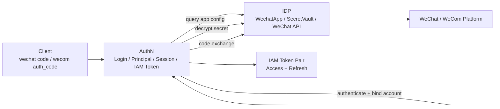
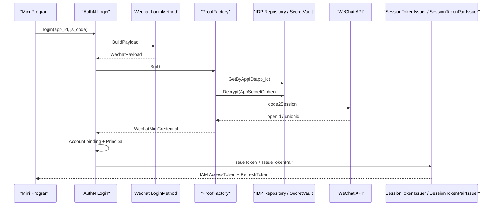
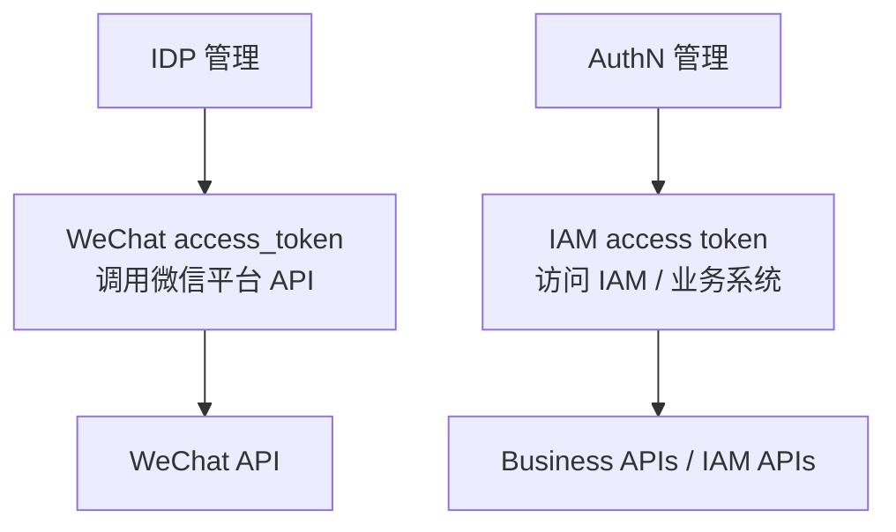

# IDP 与第三方登录讲法

## 本文用途

本文是 `08-宣讲` 模块中用于对外讲解 IAM IDP 与第三方登录的材料。

它不是 IDP 源码说明书，而是帮你在面试、技术分享、项目介绍中讲清楚：

```text
IDP 到底负责什么？
为什么 IDP 不是 AuthN？
为什么微信/企微登录最终仍由 AuthN 签发 IAM Token？
微信 access_token 和 IAM access token 有什么区别？
SecretVault 为什么重要？
第三方登录链路怎么讲才清楚？
```

这篇的核心目标是：  
**把 IDP 讲成“第三方身份源基础设施”，而不是“微信登录模块”。**

---

## 1. IDP 一句话

```text
IDP 是 IAM 中管理第三方身份源基础设施的模块，负责微信/企微应用配置、密钥托管、微信平台 access_token 和外部 API 适配；真正的登录判定、账号绑定、Session 和 IAM Token 签发仍由 AuthN 统一完成。
```

更短版：

```text
IDP 证明外部身份源如何接入，AuthN 决定外部身份能不能登录 IAM。
```

---

## 2. 30 秒讲法

```text
IAM 里的 IDP 不是登录模块，而是第三方身份源基础设施模块。它负责微信/企微应用配置、AppSecret 或 CorpSecret 的 SecretVault 加密管理、微信平台 access_token 缓存和微信 API 适配。真正的登录链路仍然走 AuthN：微信或企微登录时，AuthN LoginMethod / ProofFactory 会向 IDP 查询应用配置、解密 secret、调用外部身份源完成 code exchange，然后再由 AuthN 做账号绑定、Principal、Session 和 IAM Token 签发。这样能保证密码登录、微信登录、企微登录最终都走同一套 Session、Refresh、Verify、Revoke 和 JWKS 语义。
```

---

## 3. 1 分钟讲法

```text
IDP 这块最重要的是边界。第三方登录很容易被写成“微信 code2Session 成功后直接发 IAM token”，但这样会让微信登录、密码登录、企微登录各自形成一套 token/session 语义。

所以在 IAM 中，IDP 只做第三方身份源基础设施。比如微信应用的 AppID、AppSecret、应用状态、凭据轮换、微信 access_token 缓存、微信/企微 API 调用都归 IDP 管。IDP 通过 Repository、SecretVault、WechatAuthProvider 这些能力提供给 AuthN 使用。

真正的登录入口仍在 AuthN。用户提交微信 code 或企微 auth_code 后，AuthN 的登录方法和 ProofFactory 会先从 IDP 拿应用配置和密钥，再构造领域 proof，交给 Authenticator 做认证。认证成功后得到 Principal，最后由 AuthN 的 SessionTokenIssuer 创建 Session，并由 SessionTokenPairIssuer 签发 Access Token 和 Refresh Token。

这样做的价值是：外部身份源可以独立治理，但 IAM 登录态保持统一。
```

---

## 4. 3 分钟讲法

```text
IDP 与第三方登录这块，我会先强调一个边界：IDP 不是登录模块，它是外部身份源基础设施模块。真正的认证和 IAM token 签发仍然由 AuthN 统一负责。

为什么要这样拆？因为第三方登录涉及两类完全不同的问题。第一类是外部平台基础设施问题，比如微信应用配置、AppSecret 加密、微信 access_token 缓存、微信 code2Session、企业微信 corp secret 和 agent_id。这些属于 IDP。第二类是 IAM 内部认证问题，比如这个外部身份是否绑定了 IAM Account，应该对应哪个 User，User/Account 状态是否可用，是否创建 Session，是否签发 Access Token 和 Refresh Token。这些属于 AuthN。

以微信小程序登录为例，客户端提交 app_id 和 js_code。AuthN 的 wechatMiniAdapter 会通过 IDP Repository 查询 WechatApp，检查应用是否启用，再通过 SecretVault 解密 AppSecret，然后构造 WechatMiniCredential。后续认证器会通过微信 code exchange 拿到外部身份标识，再检查 OAuth credential 是否绑定 IAM Account/User。如果认证成功，才进入 AuthN 的 Principal、Session、Token 链路。

企业微信登录类似，只是 adapter 会用 corp_id 和 auth_code，并且 agent_id 来自服务端配置，而不是客户端请求。它同样只把 IDP 作为配置和密钥能力来源，登录态仍由 AuthN 统一管理。

这里还有一个很容易混淆的点：微信 access_token 不是 IAM access token。微信 access_token 是用来调用微信平台 API 的，由 IDP 管；IAM access token 是用户访问 IAM 或业务系统的 JWT，由 AuthN 管。两者名字相似，但语义完全不同。

这套设计的价值是：第三方身份源可以独立管理和审计，secret 可以集中托管，微信/企微接入可以扩展；同时所有登录方式最终都走同一套 Session、Refresh、Verify、Revoke 和 JWKS 机制，不会出现每个登录方式一套 token 的混乱。
```

---

## 5. 白板图讲法

### 图一：IDP 与 AuthN 边界



讲图时说：

```text
IDP 只提供外部身份源能力，AuthN 仍然是登录编排者和 IAM token 签发者。
```

---

### 图二：微信小程序登录链路



讲图时说：

```text
code2Session 只能证明外部微信身份，不等于 IAM 登录成功。必须经过 AuthN 的账号绑定和 token 签发链路。
```

---

### 图三：两个 access token 的区别



讲图时说：

```text
微信 access_token 和 IAM access token 名字像，但完全不是一回事。前者属于外部平台访问令牌，后者属于 IAM 登录态访问凭证。
```

---

## 6. IDP 要讲清楚的五个核心概念

### 6.1 WechatApp

WechatApp 是第三方应用配置对象。

讲法：

```text
WechatApp 管的是外部身份源应用，比如微信小程序或企微应用的 AppID、名称、类型、状态和凭据。
```

关键词：

```text
AppID
Name
Type
Status
Credentials
Enabled / Disabled / Archived
```

---

### 6.2 SecretVault

SecretVault 是密钥托管能力。

讲法：

```text
AppSecret / CorpSecret 不应该明文散落在登录代码里，而是通过 IDP 的 SecretVault 加密、解密和后续轮换。
```

关键词：

```text
Encrypt
Decrypt
Sign
AES-GCM
KMS/HSM 可演进
```

---

### 6.3 WeChat access_token

微信 access_token 是调用微信平台 API 的凭证。

讲法：

```text
它属于 IDP，用来调微信平台接口，不是用户访问业务系统的 IAM access token。
```

---

### 6.4 WechatAuthProvider

WechatAuthProvider 是外部身份源 API 适配能力。

讲法：

```text
AuthN 不直接散落微信 SDK 逻辑，而是通过 IDP 提供的 AuthProvider 调用 code2Session 等外部 API。
```

---

### 6.5 AuthN LoginMethod / ProofFactory

AuthN LoginMethod / ProofFactory 是第三方登录进入 AuthN 的应用层入口。

讲法：

```text
LoginMethod 校验微信/企微 payload，ProofFactory 从 IDP 拿配置和密钥并构造 AuthN 领域 proof，后续仍由 AuthN 完成账号绑定、Principal、Session 和 Token。
```

---

## 7. IDP 设计亮点

### 7.1 IDP 与 AuthN 分离

```text
IDP 管外部身份源基础设施，AuthN 管登录态。
```

价值：

```text
避免每种第三方登录各自签一套 IAM token。
```

---

### 7.2 SecretVault 集中密钥治理

```text
AppSecret / CorpSecret 通过 SecretVault 加密和解密。
```

价值：

```text
避免 secret 明文散落，后续可以演进到云 KMS 或 HSM。
```

---

### 7.3 微信 access_token 与 IAM token 分离

```text
微信 access_token 只用于调用微信平台，IAM access token 用于 IAM/业务系统访问。
```

价值：

```text
避免两个 token 语义混淆。
```

---

### 7.4 IDP REST 是管理面，不是登录面

```text
IDP REST 提供微信应用管理、凭据轮换、微信 access_token 管理，需要 admin middleware。
```

价值：

```text
管理面和登录面分离，降低安全风险。
```

---

### 7.5 未来可扩展成通用 Provider 模型

```text
当前是微信/企微，未来可以扩展 OIDC、OAuth2、飞书、钉钉等 provider。
```

价值：

```text
IDP 模块的边界适合承载更多身份源，而不会污染 AuthN 核心登录态。
```

---

## 8. 不推荐的 IDP 讲法

### 8.1 说成“微信登录模块”

```text
IDP 是微信登录模块。
```

问题：

```text
太窄，并且容易让人以为 IDP 负责签发 IAM token。
```

正确说法：

```text
IDP 是第三方身份源基础设施，微信/企微只是当前实现。
```

---

### 8.2 说成“code2Session 成功就是登录成功”

```text
微信 code2Session 成功后就登录成功。
```

问题：

```text
错误。code2Session 只证明外部微信身份，还要检查 IAM account binding、User/Account 状态，并由 AuthN 签发 token。
```

---

### 8.3 混淆两个 access token

```text
微信 access_token 就是用户 token。
```

问题：

```text
严重错误。微信 access_token 调微信 API，IAM access token 访问业务 API。
```

---

### 8.4 说 IDP 发 JWT

```text
IDP 登录后发 JWT。
```

问题：

```text
错误。IAM 登录态 JWT 由 AuthN SessionTokenIssuer / SessionTokenPairIssuer 统一签发。
```

---

### 8.5 说 AppSecret 在登录代码里配置

```text
登录代码里配置微信 AppSecret。
```

问题：

```text
不安全。AppSecret 应由 IDP 的 SecretVault 管理。
```

---

## 9. 面试常见问题回答

### Q1：IDP 和 AuthN 的边界是什么？

```text
IDP 负责第三方身份源基础设施，比如微信/企微应用配置、SecretVault、微信 access_token 和外部 API 适配；AuthN 负责登录判定、账号绑定、Principal、Session 和 IAM Token 签发。IDP 证明外部身份源如何接入，AuthN 决定这个外部身份能否登录 IAM。
```

---

### Q2：为什么不让 IDP 直接签发 IAM token？

```text
如果 IDP 直接签发 token，就会导致微信登录、企微登录、密码登录各自形成一套 token/session/refresh/revoke 语义。IAM 需要所有登录方式最终走同一套 AuthN 登录态，所以 IAM 登录态 access token 必须由 AuthN SessionTokenIssuer / SessionTokenPairIssuer 统一签发。
```

---

### Q3：微信 code2Session 成功后为什么还不算登录成功？

```text
code2Session 只能证明这个 code 对应某个微信 openid/unionid，不能证明这个外部身份已经绑定 IAM Account，也不能证明 User/Account 状态正常，更不能创建 IAM Session。只有 AuthN 完成账号绑定检查并认证出 Principal 后，才算 IAM 登录成功。
```

---

### Q4：微信 access_token 和 IAM access token 有什么区别？

```text
微信 access_token 是调用微信平台 API 的凭证，由 IDP 管；IAM access token 是用户或服务访问 IAM/业务系统的 JWT，由 AuthN 管。它们名字相似，但所属系统、用途和生命周期完全不同。
```

---

### Q5：SecretVault 在这里解决什么问题？

```text
SecretVault 负责 AppSecret、CorpSecret 等外部身份源密钥的加密、解密和后续托管。这样 AuthN ProofFactory 只在需要构造 proof 时借用解密结果，不负责密钥生命周期，后续也可以替换成 KMS/HSM。
```

---

### Q6：企业微信登录有什么安全点？

```text
企业微信登录里，corp_id 和 auth_code 来自客户端，但 agent_id 使用服务端配置，不信任客户端传入。AuthN ProofFactory 会查询 IDP 中的应用配置，检查启用状态，再通过 SecretVault 解密 CorpSecret，最后才构造 WecomCredential。
```

---

### Q7：IDP REST 为什么要 admin middleware？

```text
因为 IDP REST 是管理面，涉及微信应用创建、启用禁用、凭据轮换、access_token 获取和刷新。这些都是高敏操作，所以必须受 admin middleware 保护。如果没有 admin middleware，管理路由不应注册。
```

---

### Q8：未来如果接入更多第三方平台怎么办？

```text
可以沿用同样边界：IDP 管 provider 配置、secret、外部 API 和平台 token；AuthN 管登录态、账号绑定、Principal、Session 和 IAM token。未来可以从 WechatApp 演进到更通用的 ProviderApp / ProviderCredential / ProviderTokenCache 模型。
```

---

## 10. IDP 与其他模块的关系

### 10.1 IDP 与 AuthN

```text
IDP 提供配置、密钥和外部 API 能力；AuthN 负责统一登录链路。
```

讲法：

```text
AuthN 是登录编排者，IDP 是外部身份源能力提供者。
```

---

### 10.2 IDP 与 Identity

```text
微信 openid / unionid 不是 IAM User。
```

讲法：

```text
外部身份源返回的是外部身份标识，AuthN 通过账号绑定映射到 IAM User，Identity 提供本地 User 身份锚点。
```

---

### 10.3 IDP 与 SDK

```text
SDK 的 IDP client 属于高信任内部接入能力。
```

讲法：

```text
如果 IDP gRPC 可能返回 app_secret，就必须通过 mTLS、service token、ACL、audit 限制调用方。
```

---

### 10.4 IDP 与运维

```text
IDP 涉及 secret、外部 access_token、微信 SDK cache。
```

讲法：

```text
IDP 不只是代码逻辑，还需要密钥治理、缓存治理和管理面保护。
```

---

## 11. 证据链索引

| 讲法 | 证据 |
| --- | --- |
| IDP 负责微信应用管理和供 AuthN 使用的基础设施 | `IDPModule` 注释 |
| IDP 暴露 Repository / SecretVault / WechatAuthProvider | `IDPModule` 方法 |
| WechatApp 包含 AppID、Name、Type、Status、Credentials | `domain/idp/wechatapp/wechatapp.go` |
| SecretVault 定义 Encrypt / Decrypt / Sign | `domain/idp/wechatapp/external.go` |
| 微信小程序 ProofFactory 从 IDP 查询 App、检查启用、解密 AppSecret | `application/authn/login/method/wechat.go`、`application/authn/login/proof/oauth.go` |
| 企业微信 ProofFactory 从 IDP 查询 App、检查启用、解密 CorpSecret，并使用服务端 AgentID | `application/authn/login/method/wecom.go`、`application/authn/login/proof/oauth.go` |
| IDP REST 明确认证由 AuthN 提供 | `transport/rest/idp/router.go` |
| IDP 管理路由需要 admin middleware | `transport/rest/idp/router.go` |

---

## 12. 简历项目描述版本

```text
设计并实现 IAM IDP 与第三方登录协作边界，将微信/企微应用配置、SecretVault 密钥托管、微信平台 access_token 缓存和外部 API 适配放在 IDP 模块中，认证登录态统一由 AuthN 处理。微信/企微登录通过 AuthN LoginMethod 和 ProofFactory 从 IDP 查询应用配置、解密 AppSecret/CorpSecret、构造领域 proof，再由 AuthN 完成账号绑定、Principal、Session 和 IAM Token 签发，避免第三方身份源直接污染登录态模型。
```

---

## 13. 30 分钟分享中的位置

如果做 30 分钟技术分享，IDP 建议占：

```text
3-4 分钟
```

结构：

```text
1 分钟：IDP 与 AuthN 边界
1 分钟：微信/企微登录链路
1 分钟：SecretVault 与 token 区分
1 分钟：高频追问
```

不要在 IDP 部分过度展开微信 SDK 细节。  
重点讲边界和安全。

---

## 14. 本文总结

IDP 与第三方登录讲法的核心是：

```text
不要把 IDP 讲成微信登录模块。
```

应该讲成：

```text
IDP 管第三方身份源基础设施
AuthN 管 IAM 登录态
```

推荐最终表达：

```text
IAM 中的 IDP 负责微信/企微应用配置、SecretVault、微信平台 access_token 和外部 API 适配。微信或企微登录时，AuthN LoginMethod / ProofFactory 会向 IDP 查询应用配置、解密 secret、调用外部身份源构造 proof，但真正的账号绑定、Principal、Session、Access Token 和 Refresh Token 仍由 AuthN 统一处理。这样既能独立治理第三方身份源，又能保证所有登录方式最终共享同一套 IAM 登录态和 Token 生命周期。
```
