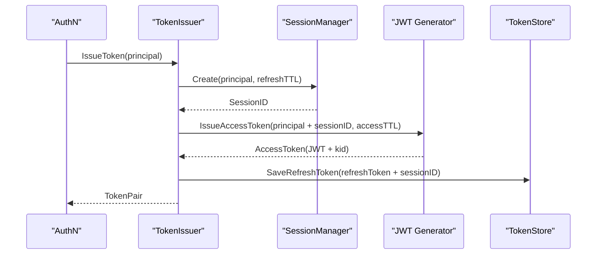
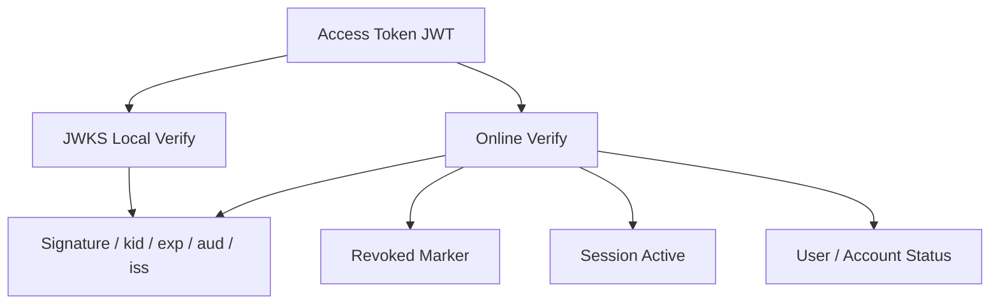
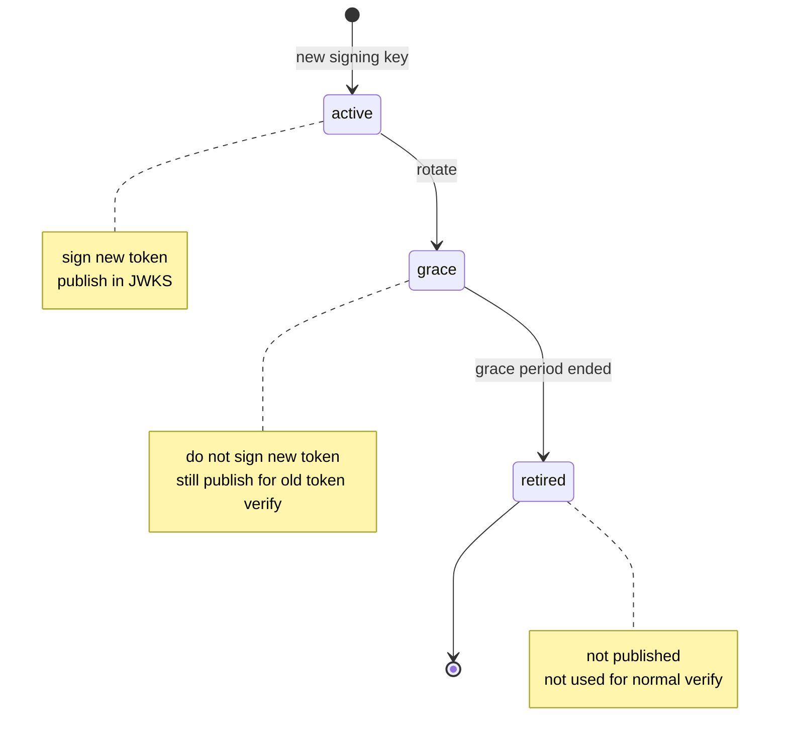

# JWKS 与 Token 安全讲法

## 本文用途

本文是 `08-宣讲` 模块中用于对外讲解 IAM Token 安全体系的材料。

它不是 Token/JWKS 源码说明书，而是帮你在面试、技术分享、项目介绍中讲清楚：

```text
为什么不能只发一个长期 JWT？
Access Token、Refresh Token、Session 如何分工？
JWKS 解决什么问题？
在线 Verify 解决什么问题？
KeyRotation 为什么需要 active / grace / retired？
Service Token 和用户 Token 有什么区别？
如何讲出 Token 安全设计的工程价值？
```

这篇的核心目标是：  
**把 Token 安全讲成“短期访问凭证 + 在线会话锚点 + 服务端续期凭证 + 公钥分发 + 在线状态校验”的组合，而不是简单 JWT。**

---

## 1. 一句话

```text
IAM 的 Token 安全体系通过短期 Access Token、服务端可控的 Refresh Token、在线 Session 锚点、JWKS 公钥分发和在线 Verify 状态检查，共同解决跨服务认证、Token 撤销、登录态续期、密钥轮换和高低风险场景分层验证问题。
```

更短版：

```text
JWKS 证明 token 签名可信，在线 Verify 证明 token 当前可用，Session 和 Refresh Token 负责让登录态可撤销、可续期、可治理。
```

---

## 2. 30 秒讲法

```text
IAM 的 Token 安全不是简单发一个 JWT。登录成功后，TokenIssuer 会先创建 Session，再签发短期 Access Token，并把 Refresh Token 保存到服务端。Access Token 是 JWT，适合业务请求携带和通过 JWKS 本地验签；Refresh Token 是随机凭证，服务端保存、可撤销、可轮换，用来续期；Session 是在线登录态锚点，在线 Verify 和 Refresh 都会检查 Session 是否 active。JWKS 负责把公钥发布给业务服务做本地验签，在线 Verify 则在验签之外检查 token 是否 revoked、Session 是否 active、User/Account 是否仍可用。
```

---

## 3. 1 分钟讲法

```text
Token 安全这块，我主要从三层讲。第一层是凭证分工：Access Token 是短期访问凭证，适合请求携带；Refresh Token 是长期续期凭证，但必须服务端保存、可撤销、可轮换；Session 是一次在线登录态，Access 和 Refresh 都绑定 Session。

第二层是验证策略。业务服务可以通过 JWKS 本地验签，验证 JWT 签名、kid、exp、issuer、audience，这适合低风险高吞吐场景。但 JWKS 只能证明 token 是 IAM 签的，不能证明登录态仍然有效。高风险场景要调用在线 Verify，在线 Verify 会检查 access token revoked marker、Session active，以及 User/Account 状态。

第三层是密钥治理。Access Token 签发时会使用 active signing key，并在 JWT header 中写入 kid；JWKS endpoint 只发布 active/grace 状态且未过期的公钥。KeyRotation 时旧 key 进入 grace 还能验旧 token，新 key 负责签新 token，最后 retired 不再发布。
```

---

## 4. 3 分钟讲法

```text
IAM 的 Token 安全设计，我会先强调一个前提：JWT 本身只能证明 token 没被篡改，并且是某个私钥签发的，但它不能证明用户当前仍然允许访问系统。因此我没有把登录态设计成一个长期 JWT，而是拆成 Session、Access Token、Refresh Token、JWKS 和在线 Verify。

登录签发时，AuthN 认证成功会得到 Principal。TokenIssuer 首先基于 Principal 创建 Session，Session 的生命周期和 refresh 窗口绑定；然后在 Access Token 里写入 UserID、AccountID、TenantID、SessionID、AMR 等 claims，使用当前 active signing key 签名，并把 kid 写到 JWT header；最后生成随机 Refresh Token，并把 Refresh Token 和 SessionID、UserID、AccountID、TenantID 等信息保存到服务端 store。

验证时有两种模式。第一种是 JWKS 本地验签。业务服务拿到 token 后，根据 header 里的 kid 从 JWKS 找公钥，验证签名和 exp、aud、iss 等静态 claims。这种方式性能好，适合低风险高吞吐场景。第二种是在线 Verify。在线 Verify 先验 JWT，再检查 revoked access token marker，然后通过 session_id 加载 Session，确认 Session active，最后检查 User/Account 状态。如果用户被 block、账号 disabled、session revoked，即使 JWT 签名有效，在线 Verify 也会失败。

Refresh 时也不是简单换一个 token。系统会从服务端 store 读取 Refresh Token，再加载 Session，检查 Session active 和 User/Account 状态；通过后签发新的 token pair，删除旧 refresh token，并延长 session 到新 refresh 的过期时间。这样 Refresh Token 是可控的，不是一个不可撤销的长期 JWT。

密钥方面，JWT 签发用 active key，验签通过 kid 找 verification key。JWKS 只发布 active 和 grace 状态的未过期公钥。active key 用来签新 token，grace key 用来验旧 token，retired key 不再发布。这样能实现平滑 KeyRotation。
```

---

## 5. 白板图讲法

### 图一：登录签发链路



讲图时说：

```text
签发不是直接发 JWT，而是先创建 Session，再发 Access Token，并保存 Refresh Token。Session 是登录态锚点。
```

---

### 图二：JWKS 本地验签 vs 在线 Verify



讲图时说：

```text
JWKS 只做密码学验证，在线 Verify 多了撤销、Session、User/Account 状态检查。两者不是替代关系。
```

---

### 图三：KeyRotation



讲图时说：

```text
active key 签新 token，grace key 验旧 token，retired key 不再发布。这个状态机让密钥轮换不影响旧 token 的平滑过渡。
```

---

## 6. Token 安全要讲清楚的六个核心概念

### 6.1 Access Token

讲法：

```text
Access Token 是短期访问凭证，当前实现是 JWT，适合请求携带、业务服务验签和 IAM 在线 Verify。
```

关键点：

```text
短 TTL
包含 user/account/tenant/session claims
header 带 kid
可以 JWKS 验签
可以在线 Verify
```

---

### 6.2 Refresh Token

讲法：

```text
Refresh Token 是服务端保存的长期续期凭证，不是另一个长期 JWT。它绑定 Session，刷新成功后会轮换旧 refresh token。
```

关键点：

```text
随机 uuid value
服务端保存
可撤销
可轮换
绑定 SessionID
```

---

### 6.3 Session

讲法：

```text
Session 是在线登录态锚点。只要 Session 被 revoke，在线 Verify 和 Refresh 都会失败。
```

关键点：

```text
SessionID
UserID
AccountID
TenantID
active / revoked / expired
```

---

### 6.4 JWKS

讲法：

```text
JWKS 是公钥发布机制，让业务服务可以根据 token header 里的 kid 找到公钥，本地验证 JWT 签名。
```

关键点：

```text
public keys only
ETag
Last-Modified
Cache-Control
active/grace keys
```

---

### 6.5 在线 Verify

讲法：

```text
在线 Verify 是 token 当前可用性判断，不只是远程 JWT parse。
```

关键点：

```text
signature
expired
revoked marker
session active
user/account status
```

---

### 6.6 KeyRotation

讲法：

```text
KeyRotation 让签名密钥能平滑替换。active key 签新 token，grace key 验旧 token，retired key 不再发布。
```

---

## 7. 设计亮点

### 7.1 JWT 不承担完整登录态

```text
JWT 只做短期访问凭证，完整登录态由 Session + RefreshToken 管理。
```

价值：

```text
避免长期 JWT 无法撤销的问题。
```

---

### 7.2 Access / Refresh 分工清楚

```text
Access Token 负责访问，Refresh Token 负责续期。
```

价值：

```text
Access 可以短期化，Refresh 可以服务端控制。
```

---

### 7.3 Session 支持在线撤销

```text
Access Token 和 Refresh Token 都绑定 Session。
```

价值：

```text
用户登出、封禁、账号禁用、token revoke 可以影响旧登录态。
```

---

### 7.4 JWKS 与在线 Verify 并存

```text
JWKS 负责本地验签，在线 Verify 负责状态强一致。
```

价值：

```text
业务服务可按风险选择性能或强一致安全。
```

---

### 7.5 KeyRotation 有平滑过渡

```text
active / grace / retired
```

价值：

```text
新旧 token 在轮换过程中都能被合理验证。
```

---

### 7.6 Service Token 与用户 Token 分离

```text
Service Token 不走用户 Session 语义。
```

价值：

```text
服务身份与用户身份边界清楚。
```

---

## 8. 不推荐的讲法

### 8.1 “我们用 JWT 做登录”

问题：

```text
太浅，也容易暴露安全理解不足。
```

推荐改成：

```text
我们用 JWT 作为短期 Access Token，但完整登录态由 Session 和 Refresh Token 管理。
```

---

### 8.2 “JWKS 可以证明用户有效”

问题：

```text
错误。JWKS 只证明签名可信，不能证明 Session active 或 User/Account 状态正常。
```

推荐改成：

```text
JWKS 证明 token 是 IAM 签的，在线 Verify 证明 token 当前仍可用。
```

---

### 8.3 “Refresh Token 也是 JWT”

问题：

```text
当前设计不是。Refresh Token 是服务端保存的随机凭证。
```

推荐改成：

```text
Refresh Token 关键是服务端可控、可撤销、可轮换。
```

---

### 8.4 “KeyRotation 就是换一把 key”

问题：

```text
太粗。密钥轮换要考虑旧 token 验签窗口。
```

推荐改成：

```text
active key 签新 token，grace key 验旧 token，retired key 不再发布。
```

---

## 9. 面试常见问题回答

### Q1：为什么不只发一个长期 JWT？

```text
长期 JWT 最大问题是撤销困难。用户登出、被封禁、账号禁用后，只要 JWT 没过期，本地验签仍可能通过。所以 IAM 把登录态拆成短期 Access Token、服务端 Refresh Token 和在线 Session。JWT 只做短期访问凭证，Session 和 Verify 负责在线状态。
```

---

### Q2：Access Token 和 Refresh Token 怎么分工？

```text
Access Token 是短期访问凭证，适合业务请求携带和 JWKS 验签；Refresh Token 是服务端保存的长期续期凭证，用于在 access token 过期后换取新 token。Refresh 时要检查 Refresh Token、Session 和 User/Account 状态，并在成功后轮换旧 refresh token。
```

---

### Q3：为什么 Refresh Token 不做 JWT？

```text
Refresh Token 的核心价值是服务端可控。它需要能被删除、轮换、绑定 Session，并且在泄露时能够精准撤销。如果做成完全无状态 JWT，撤销和重放检测都会困难。
```

---

### Q4：在线 Verify 比本地验签多做什么？

```text
本地验签只检查签名、kid、过期时间、issuer、audience。在线 Verify 在此基础上还会查 access token revoked marker、Session 是否 active、User/Account 是否仍允许访问。所以本地验签通过，不代表在线 Verify 一定通过。
```

---

### Q5：JWKS 是怎么支持 KeyRotation 的？

```text
JWT header 里带 kid，业务服务根据 kid 从 JWKS 找公钥。Key 有 active、grace、retired 三种状态：active 签新 token 并发布；grace 不签新 token，但仍发布用于验旧 token；retired 不再发布。这样可以平滑切换签名密钥。
```

---

### Q6：用户被 block 后旧 token 怎么失效？

```text
在线 Verify 会重新评估 User/Account 状态。如果 User 被 block，即使 JWT 签名有效，Verify 也会失败。另外系统可以按 user 维度 revoke sessions，让旧登录态失效。
```

---

### Q7：Service Token 和用户 Token 有什么区别？

```text
用户 Token 绑定 User、Account 和 Session，Verify 时要检查 Session 与 User/Account 状态。Service Token 表示服务身份，当前 Verify 中会在过期检查后直接返回 claims，不走用户 Session 语义。它应该通过 audience、TTL、mTLS、ACL 和审计来约束。
```

---

### Q8：JWKS endpoint 为什么要 ETag 和 Cache-Control？

```text
JWKS 是公钥集合，业务服务会频繁拉取。ETag、Last-Modified 和 Cache-Control 可以减少重复传输，并支持客户端缓存。KeyRotation 时客户端可以根据缓存策略刷新公钥。
```

---

## 10. 与其他模块的关系

### 10.1 与 AuthN

```text
Token 安全是 AuthN 的核心能力。
```

讲法：

```text
Login 认证出 Principal，TokenIssuer 创建 Session 并签发 token，Verifier 负责在线状态判断。
```

---

### 10.2 与 Identity

```text
Verify 会检查 User/Account 状态。
```

讲法：

```text
Token 是否有效，不只取决于签名，还取决于 User 是否 active、Account 是否 disabled。
```

---

### 10.3 与 IDP

```text
第三方登录最终也回到同一套 Session/Token。
```

讲法：

```text
微信/企微只是登录方式不同，IAM Token 仍由 AuthN 统一签发。
```

---

### 10.4 与 SDK

```text
SDK 提供 JWKSManager、TokenVerifier、Auth().VerifyToken、ServiceAuthHelper。
```

讲法：

```text
SDK 让业务服务按风险选择本地验签、在线 Verify 或 fallback 策略。
```

---

## 11. 证据链索引

| 讲法 | 证据 |
| --- | --- |
| IssueToken 先创建 Session，再签发 Access Token 和保存 Refresh Token | `application/authn/token/issuer.go` |
| Access Token 带 SessionID/UserID/AccountID/TenantID | `infra/token/jwt/generator.go` |
| JWT header 带 kid，并通过 active signing key 签名 | `infra/token/jwt/generator.go` |
| Verify 检查 expired、revoked marker、Session active、User/Account 状态 | `application/authn/token/verifier.go` |
| Refresh 检查 RefreshToken、Session、SubjectAccess，并删除旧 refresh token | `application/authn/token/refresher.go` |
| Key 有 active/grace/retired 状态 | `infra/token/keyset/key.go` |
| JWKS 只发布 active/grace 且未过期的 key | `infra/token/keyset/key.go` |
| JWKS endpoint 返回 ETag/Last-Modified/Cache-Control | `transport/rest/authn/handler/jwks_public.go` |
| Service Token 由 IssueServiceToken 签发，不带 refresh token | `application/authn/token/issuer.go` |

---

## 12. 简历项目描述版本

```text
设计并实现 IAM Token 安全体系，采用 Session + Access Token + Refresh Token 的登录态模型：登录成功后先创建 Session，再签发带 SessionID 的短期 JWT Access Token，并保存服务端可控的 Refresh Token；在线 Verify 在 JWT 验签之外继续检查 revoked marker、Session active 和 User/Account 状态；Refresh Token 刷新时检查 Session 和主体状态，并轮换旧 refresh token。同时实现 JWKS 公钥发布与 active/grace/retired KeyRotation 机制，支持业务服务本地验签和高风险场景在线 Verify 并存。
```

---

## 13. 30 分钟分享中的位置

如果做 30 分钟技术分享，JWKS 与 Token 安全建议占：

```text
4-5 分钟
```

结构：

```text
1 分钟：为什么不能只用长期 JWT
1 分钟：Session / Access / Refresh 分工
1 分钟：在线 Verify 状态检查
1 分钟：JWKS 与 KeyRotation
1 分钟：常见追问
```

---

## 14. 本文总结

JWKS 与 Token 安全讲法的核心是：

```text
不要把它讲成“用了 JWT”。
```

应该讲成：

```text
Access Token = 短期访问凭证
Refresh Token = 服务端可控续期凭证
Session = 在线登录态锚点
JWKS = 公钥分发与本地验签
Online Verify = 当前可用性判断
KeyRotation = 签名密钥平滑演进
```

推荐最终表达：

```text
IAM 的 Token 安全体系不是简单 JWT 登录，而是 Session、Access Token、Refresh Token、JWKS 和在线 Verify 的组合。Access Token 是短期 JWT，适合业务请求携带和本地验签；Refresh Token 是服务端保存的续期凭证，支持撤销和轮换；Session 是在线登录态锚点；JWKS 负责公钥分发和跨服务本地验签；在线 Verify 则在验签之外检查 revoked marker、Session active 和 User/Account 状态。这样既能支持高吞吐本地验签，也能支持高风险场景的强一致认证状态判断。
```
