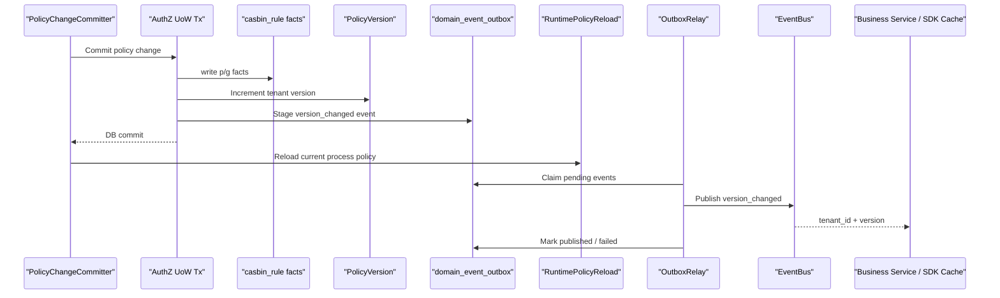
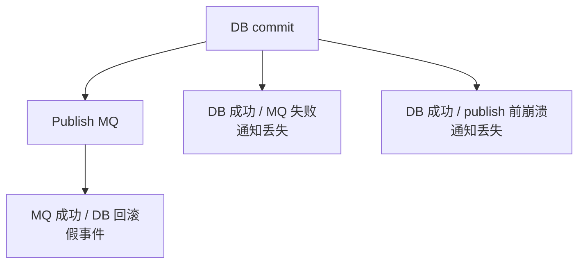
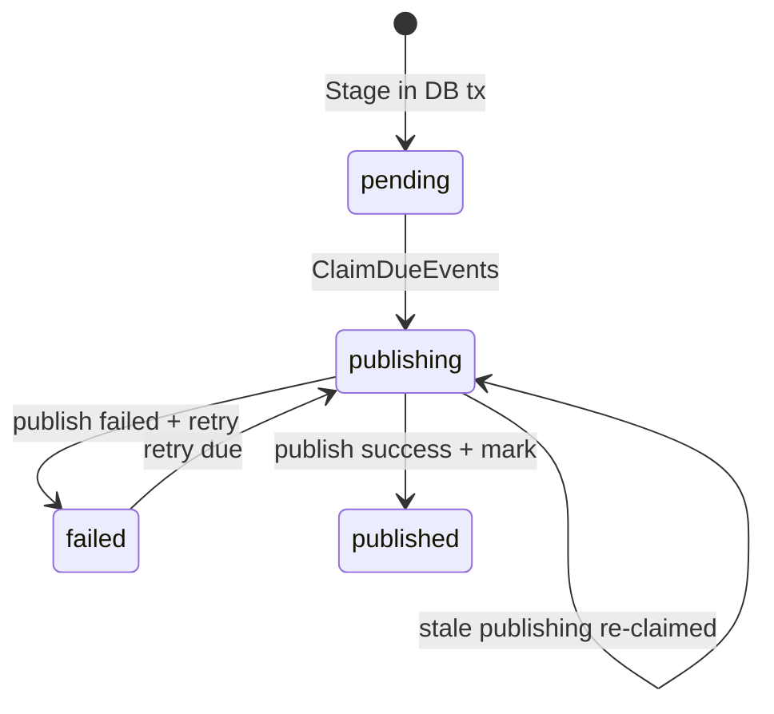

# Outbox 与授权版本传播讲法

## 本文用途

本文是 `08-宣讲` 模块中用于对外讲解 IAM AuthZ 版本传播与 Transactional Outbox 的材料。

它不是 Outbox 源码说明书，而是帮你在面试、技术分享、项目介绍中讲清楚：

```text
为什么授权变更需要传播？
为什么只 reload 当前进程不够？
为什么不能直接 DB commit 后 publish MQ？
PolicyVersion 是什么？
Outbox 解决什么一致性问题？
为什么 Outbox 是 at-least-once？
消费者为什么必须幂等？
如何把这套机制讲成工程亮点？
```

这篇的核心目标是：  
**把 Outbox 讲成“授权事实变更的可靠传播机制”，而不是普通消息队列发送。**

---

## 1. 一句话

```text
IAM 用 PolicyVersion + Transactional Outbox 传播授权变更：每次授权 facts 变化都会递增 tenant 级策略版本，并在同一个数据库事务中写入 version_changed 事件，之后由 Outbox Relay 异步发布，保证授权缓存失效和跨系统同步不会因为 MQ 失败而丢失。
```

更短版：

```text
Outbox 解决的是：授权事实已经变了，其他系统必须最终可靠地知道。
```

---

## 2. 30 秒讲法

```text
AuthZ 写入不是简单改数据库，因为权限变更会影响当前 IAM 实例、其他 IAM 实例、业务服务本地缓存和 SDK 授权快照。IAM 每次授权变更都会写 Casbin facts、递增 PolicyVersion，并 stage 一个 iam.authz.version_changed 事件。这个事件不能直接 publish MQ，否则会出现 DB 成功但 MQ 失败，或者 MQ 成功但 DB 回滚的问题。所以系统使用 Transactional Outbox，把 facts、version 和 outbox row 放在同一个事务里提交；事务提交后当前进程 reload runtime policy，后台 Outbox Relay 再异步 claim 事件、publish 到 EventBus，并 mark published 或 failed。
```

---

## 3. 1 分钟讲法

```text
Outbox 主要解决授权版本传播的可靠性问题。AuthZ 的授权事实写在数据库里，运行时判定用 Casbin Enforcer 加载这些 facts。每次授予权限、撤销权限、绑定角色、解绑角色时，除了写 p/g facts，还要递增 PolicyVersion，表示这个 tenant 的授权版本发生变化。

问题是：这个变化不仅当前进程要知道，其他服务和缓存也要知道。如果直接在 DB commit 后发 MQ，中间有失败窗口：DB 成功但 MQ 失败，通知就丢了；MQ 成功但 DB 回滚，下游又会收到不存在的版本。

所以 IAM 使用 Transactional Outbox：在同一个 UoW 事务里写授权 facts、递增 PolicyVersion、插入 outbox row。提交成功后，后台 relay 周期性 claim pending event，发布到 EventBus，成功后标记 published，失败则标记 failed 并设置下次重试时间。这个机制是 at-least-once，所以消费者需要按 event_id 或 tenant_id + version 做幂等。
```

---

## 4. 3 分钟讲法

```text
Outbox 这块我会从授权变更的传播需求讲起。AuthZ 里每次权限变更，比如给角色授权、撤销权限、绑定角色、解绑角色，本质上都会改变授权 facts。这些 facts 是后续 Check 的依据，所以当前 IAM 进程需要 reload Casbin runtime policy。同时，其他 IAM 实例、业务服务的授权缓存、SDK 的 AuthorizationSnapshot cache，也需要知道某个 tenant 的授权版本已经变化。

为了表达这个变化，系统有 PolicyVersion。每次授权 facts 变化后，PolicyChangeCommitter 会在同一个 UoW 事务里递增 PolicyVersion，并 stage 一个 iam.authz.version_changed 事件。这个事件的 payload 很轻，只包含 tenant_id 和 version，它不是全量权限数据，而是缓存失效和同步信号。

为什么要用 Transactional Outbox？因为 DB 和 MQ 不是一个事务资源。直接写完 DB 后 publish MQ，会有两个经典问题：第一，DB 成功但 MQ 失败，下游永远不知道授权变了；第二，MQ 成功但 DB 回滚，下游看到不存在的版本。所以事件不能直接发，必须先作为 outbox row 和授权 facts 一起提交到数据库。这样只要 DB 提交成功，事件就不会丢。

提交后，Outbox Relay 作为后台任务周期性从 domain_event_outbox 表里 claim due events，把状态从 pending/failed 置为 publishing，然后发布到 EventBus。发布成功就 mark published，失败就 mark failed 并设置 next_attempt_at。如果 EventBus 不可用，relay 不会 claim，事件继续留在 pending 状态。这个设计保证事件最终可以重试投递。

不过 Outbox 不是 exactly-once，而是 at-least-once。比如 MQ publish 成功但 mark published 失败，或者 relay publish 后进程崩溃，事件可能被重复投递。所以消费者必须幂等。对于授权版本事件，最好的幂等键是 event_id，或者业务键 tenant_id + version。消费者只要记录自己处理到的最大版本，重复或旧版本直接忽略。
```

---

## 5. 白板图讲法

### 图一：授权变更写入与传播



讲图时说：

```text
这张图表达的是：授权事实、版本和 outbox row 同事务提交；事件发布是事务后的异步可靠投递。
```

---

### 图二：为什么不能直接 publish MQ



讲图时说：

```text
DB 和 MQ 无法天然原子提交，所以不能直接在授权写入后同步 publish MQ。Outbox 用本地 DB 事务先把事件持久化，再异步发布。
```

---

### 图三：Outbox 状态机



讲图时说：

```text
Outbox 的状态机保证事件不会因为 publish 失败就丢掉，但也意味着消费者要处理重复投递。
```

---

## 6. Outbox 要讲清楚的六个核心概念

### 6.1 PolicyVersion

讲法：

```text
PolicyVersion 表示某个 tenant 的授权事实版本。每次授权 facts 变化后，version 递增，业务服务可以用它判断本地授权缓存是否过期。
```

关键词：

```text
tenant_id
version
authz_version
snapshot cache
```

---

### 6.2 version_changed event

讲法：

```text
version_changed 事件不是全量权限数据，而是授权版本变化信号。payload 只需要 tenant_id 和 version。
```

关键词：

```text
iam.authz.version_changed
tenant_id
version
cache invalidation
```

---

### 6.3 Transactional Outbox

讲法：

```text
Transactional Outbox 把业务事实变更和事件记录放在同一个 DB 事务里，避免 DB 成功但消息丢失。
```

关键词：

```text
facts
version
outbox row
same transaction
```

---

### 6.4 Outbox Relay

讲法：

```text
Relay 是异步发布器，负责从 outbox 表 claim due events，publish 到 EventBus，并标记 published 或 failed。
```

关键词：

```text
claim
publish
mark published
mark failed
retry
```

---

### 6.5 at-least-once

讲法：

```text
Outbox 保证至少投递一次，不保证只投递一次，所以消费者必须幂等。
```

关键词：

```text
event_id
tenant_id + version
idempotency
duplicate delivery
```

---

### 6.6 Runtime Reload

讲法：

```text
Runtime reload 解决当前进程的 Casbin Enforcer 刷新；Outbox 解决其他服务和缓存的最终通知。两者都需要。
```

---

## 7. 设计亮点

### 7.1 避免 DB + MQ 双写不一致

```text
facts + version + outbox row 同事务提交。
```

价值：

```text
避免 DB 成功但事件丢失。
```

---

### 7.2 事件是轻量版本信号

```text
payload = tenant_id + version
```

价值：

```text
事件不成为第二事实源，具体权限仍然从 IAM 查询或拉 snapshot。
```

---

### 7.3 Relay 异步可靠发布

```text
claim -> publish -> mark published/failed
```

价值：

```text
写入路径不等待 MQ 成功，EventBus 恢复后可继续投递。
```

---

### 7.4 EventBus 不可用时不 claim

```text
publisher nil 时 relay degraded，但不 claim。
```

价值：

```text
消息不会因为 EventBus 不可用而进入异常中间状态。
```

---

### 7.5 支持重试与恢复

```text
failed event 到 next_attempt_at 后重试，stale publishing 可以重新 claim。
```

价值：

```text
relay 崩溃或发布失败都能恢复。
```

---

### 7.6 明确 at-least-once 语义

```text
消费者按 event_id 或 tenant_id + version 幂等。
```

价值：

```text
不假装 exactly-once，工程边界真实可控。
```

---

## 8. 不推荐的讲法

### 8.1 “我用 MQ 发授权事件”

问题：

```text
太浅。重点不是用了 MQ，而是 DB 事实和事件记录如何一致。
```

推荐改成：

```text
我用 Transactional Outbox 把授权 facts、PolicyVersion 和事件记录放在同一个事务里，再由 relay 异步发布。
```

---

### 8.2 “Outbox 保证消息只发一次”

问题：

```text
错误。Outbox 通常是 at-least-once，不是 exactly-once。
```

推荐改成：

```text
Outbox 保证事件不丢，但可能重复，消费者必须幂等。
```

---

### 8.3 “事件里带所有权限数据”

问题：

```text
当前不是。事件只带 tenant_id + version。
```

推荐改成：

```text
事件是版本变化信号，不是全量权限事实。下游需要具体权限时重新拉 snapshot。
```

---

### 8.4 “runtime reload 就够了”

问题：

```text
runtime reload 只影响当前进程，不会通知其他实例或业务服务缓存。
```

推荐改成：

```text
runtime reload 解决当前进程，Outbox 解决跨系统传播。
```

---

### 8.5 “MQ 挂了授权写入就不能做”

问题：

```text
不准确。只要 DB 和 outbox store 可用，事件可以先入库，MQ 恢复后 relay 发布。
```

---

## 9. 面试常见问题回答

### Q1：为什么授权版本传播需要 Outbox？

```text
因为授权变更既要写数据库事实，又要通知其他系统。如果直接 DB commit 后 publish MQ，会有 DB 成功但 MQ 失败的窗口，通知可能丢失。Transactional Outbox 把授权 facts、PolicyVersion 和 outbox event 放到同一个数据库事务里提交，之后由 relay 异步发布，这样事件不会因为 MQ 短暂失败而丢失。
```

---

### Q2：PolicyVersion 是什么？

```text
PolicyVersion 是 tenant 级授权事实版本。每次授权 facts 改变后 version 递增。业务服务或 SDK 可以用 authz_version 判断本地授权快照是否过期。
```

---

### Q3：version_changed 事件为什么只带 tenant_id 和 version？

```text
因为它是缓存失效和同步信号，不是全量权限数据。全量权限可能很大，而且会让事件变成第二事实源。更好的方式是下游收到 tenant_id + version 后，根据需要重新拉 AuthorizationSnapshot。
```

---

### Q4：Outbox Relay 怎么工作？

```text
Relay 会周期性从 domain_event_outbox claim 到期事件，把 pending 或到期 failed 的事件置为 publishing，然后 publish 到 EventBus。成功后 mark published，失败后 mark failed 并设置 next_attempt_at，后续继续重试。
```

---

### Q5：EventBus 不可用时怎么办？

```text
当前 relay 如果发现 publisher 不可用，会记录 degraded 并直接返回，不 claim 事件。事件继续留在 pending 状态，等 EventBus 恢复后再投递。
```

---

### Q6：Outbox 是 exactly-once 吗？

```text
不是，是 at-least-once。比如 publish 成功但 mark published 失败，或者 relay 在 publish 后崩溃，事件可能重复投递。因此消费者必须根据 event_id 或 tenant_id + version 做幂等。
```

---

### Q7：runtime reload 和 outbox 关系是什么？

```text
runtime reload 解决当前 IAM 进程的 Casbin Enforcer 刷新；outbox 解决跨系统传播，通知其他服务、实例或缓存授权版本变了。一个解决本进程，一个解决外部消费者，两者都需要。
```

---

### Q8：reload 失败会不会回滚授权写入？

```text
不会。reload 发生在事务提交后，DB 已经是授权事实源。reload 失败说明当前 runtime 暂时未刷新成功，应记录 degraded 并通过后续重试或运维修复，而不是回滚已提交事实。
```

---

## 10. 与其他模块的关系

### 10.1 与 AuthZ

```text
Outbox 是 AuthZ 写入链路的一部分。
```

讲法：

```text
授权 facts 变化后，PolicyVersion 和 outbox event 同事务提交。
```

---

### 10.2 与 SDK

```text
SDK 或业务服务可以根据 authz_version 判断本地 snapshot 是否过期。
```

讲法：

```text
Outbox 事件负责通知版本变化，SDK/业务服务负责按版本刷新缓存。
```

---

### 10.3 与运行时

```text
process 启动后台 Outbox Relay，生命周期关闭时 cancel。
```

讲法：

```text
Outbox 不是请求同步发布，而是 runtime task 异步投递。
```

---

### 10.4 与运维

```text
Outbox 需要 pending/failed/publishing 观测。
```

讲法：

```text
Outbox 让事件可恢复，但也需要 dashboard 和告警，否则 failed 堆积没人知道。
```

---

## 11. 证据链索引

| 讲法 | 证据 |
|---|---|
| Committer 在 UoW 中写 facts、递增 version、stage event | `application/authz/policy/committer.go` |
| stager 缺失会失败 | `application/authz/shared/version_event.go` |
| VersionChangedEvent payload 是 tenant_id + version | `domain/authz/policy/events.go` |
| Outbox Stage 必须在 active DB transaction 中执行 | `infra/mysql/eventoutbox/store.go` |
| Outbox row 包含 event_id、event_type、topic、payload、status、attempt_count 等 | `infra/mysql/eventoutbox/store.go` |
| ClaimDueEvents 支持 pending / failed / stale publishing | `infra/mysql/eventoutbox/store.go` |
| Relay 执行 claim / publish / mark published / mark failed | `infra/messaging/outbox_relay.go` |
| EventBus 不可用时 relay degraded 且不 claim | `infra/messaging/outbox_relay.go` |
| Publish 失败后 mark failed 并设置 retry delay | `infra/messaging/outbox_relay.go` |

---

## 12. 简历项目描述版本

```text
设计并实现 IAM AuthZ 授权版本传播机制，在授权策略写入链路中通过 PolicyChangeCommitter 和 UoW 同事务写入授权 facts、递增 PolicyVersion，并将 iam.authz.version_changed 事件 stage 到 Transactional Outbox。后台 Outbox Relay 异步 claim pending/failed/stale events，发布到 EventBus，并按 published/failed 状态更新 outbox row，实现授权版本变化的 at-least-once 可靠传播，支持业务服务按 tenant_id + version 幂等刷新授权缓存。
```

---

## 13. 30 分钟分享中的位置

如果做 30 分钟技术分享，Outbox 与授权版本传播建议占：

```text
4-5 分钟
```

结构：

```text
1 分钟：为什么授权变更要传播
1 分钟：为什么不能直接 publish MQ
1 分钟：Transactional Outbox 写入链路
1 分钟：Relay 状态机和重试
1 分钟：at-least-once 与消费者幂等
```

---

## 14. 本文总结

Outbox 与授权版本传播讲法的核心是：

```text
不要把它讲成“我用了 MQ”。
```

应该讲成：

```text
授权 facts 改变
  -> PolicyVersion 递增
  -> version_changed event 同事务进入 Outbox
  -> 当前进程 runtime reload
  -> Relay 异步发布
  -> 下游按 tenant_id + version 幂等刷新
```

推荐最终表达：

```text
IAM 的授权变更需要通过 PolicyVersion 和 Transactional Outbox 可靠传播。每次授权 facts 变化后，系统在同一个 UoW 事务中写 facts、递增 PolicyVersion，并 stage iam.authz.version_changed 事件。事务提交后当前进程 reload runtime policy，后台 Outbox Relay 再异步 claim 事件并发布到 EventBus。这个机制避免 DB 成功但 MQ 失败导致通知丢失，同时明确采用 at-least-once 语义，要求消费者按 event_id 或 tenant_id + version 幂等处理。
```
